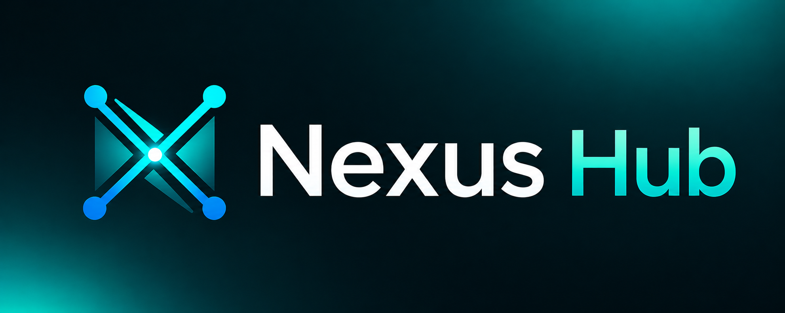
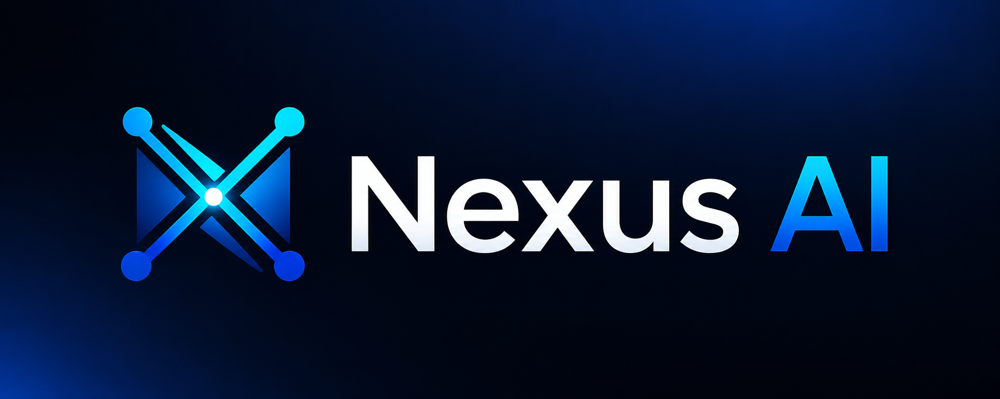

<p align="center"><a href="https://github.com/bendourthe/Nexus-Hub"></a></p>

<p align="center"><em>The Skill Harness for Every AI Coding Assistant.</em></p>

# Nexus-Hub

Nexus-Hub is the upstream skill catalog for AI coding assistants: 203 skills, 36 commands, 14 hooks, 10 agents, and 4 language rule families. It installs in one step on Windows, macOS, and Linux, and it works the same across Claude Code, OpenAI Codex, Gemini (via Antigravity), GitHub Copilot, Cursor, GitHub CLI, and the sibling Nexus desktop app and VS Code extension. The catalog is reverse-engineering-first by policy: zero third-party data processors, zero outbound calls from skills / commands / hooks, zero telemetry.

> **Renamed from DevAI-Hub at v2.0.0** to align with the sibling project [Nexus](https://github.com/bendourthe/Nexus-AI), a local-first desktop AI Studio that consumes Nexus-Hub as its upstream skill feed. Existing `~/.devai-hub/` installs are migrated in place by the v2.0.0 installer on first run; see [docs/v2.0.0/RELEASE_NOTES.md](docs/v2.0.0/RELEASE_NOTES.md) for the full migration story.

---

## How Nexus-Hub fits with Nexus

<p align="center">
<a href="https://github.com/bendourthe/Nexus-Hub"></a>

<a href="https://github.com/bendourthe/Nexus-AI"></a>
</p>

Nexus-Hub and [Nexus](https://github.com/bendourthe/Nexus-AI) are two halves of the same idea, split along a deliberate seam.

- **Nexus-Hub (this repo)** is the catalog: 203 curated skills, 36 commands, 14 hooks, 10 agents, 4 rule families, plus 3 internal MCP servers (`nexus-skill-server`, `nexus-code-search`, `nexus-web-fetch`). It is content-only, platform-agnostic, and shipped via an installer that writes to `~/.nexus-hub/` and into each AI assistant's per-platform config locations.
- **Nexus** is a local-first desktop AI Studio that consumes Nexus-Hub as its skill feed. Nexus's `AGENTS.md` names this repo as "the only external project we deliberately link to" -- the upstream feed for its skill harness.

The two projects are designed to be useful independently: you can install Nexus-Hub into any supported agent platform without touching Nexus, and Nexus can run with or without the upstream catalog wired in. The combination is what gives a single curated skill set to every agent surface a developer touches: terminal, IDE, desktop app, and CLI.

---

## What's New in v2.0.0

v2.0.0 is a **rename + brand modernization** release. There are three headline changes:

### 1. Renamed from DevAI-Hub to Nexus-Hub (breaking)

The repository, distributed artifact, plugin metadata, installer, MCP servers, extensions, scripts, skills, commands, hooks, agents, rules, templates, and every documentation surface have been renamed to **Nexus-Hub**. The complete list of breaking changes is in [CHANGELOG.md](CHANGELOG.md) under `[2.0.0] -- Breaking changes`. The headline items:

- **Installed root**: `~/.devai-hub/` -> `~/.nexus-hub/`
- **Plugin name**: `devai-hub` -> `nexus-hub`
- **MCP server names**: `devai-skill-server` -> `nexus-skill-server` (and the other two)
- **Environment-variable prefix**: `DEVAI_*` -> `NEXUS_*`
- **GitHub URL**: `bendourthe/DevAI-Hub` -> `bendourthe/Nexus-Hub` (GitHub's automatic rename redirect handles in-flight links)

Existing DevAI-Hub installs are migrated in place by a one-shot prompt at the top of the v2.0.0 installer. No symlinks, no compatibility shims -- a single user-visible event.

### 2. Modernized installer

Both `scripts/installer.sh` and `scripts/installer.ps1` now print an ASCII-art `NEXUS-HUB` banner at startup, followed by the tagline, version, and repo URL. The legacy-install migration logic runs immediately after the banner and before the welcome prompt.

### 3. Explicit Nexus brand linkage

This README and the top-level agent instruction files (`AGENTS.md`, `CLAUDE.md`) now describe the relationship between Nexus-Hub and Nexus directly, so the two-project shape is obvious to anyone landing on either repo.

See [CHANGELOG.md](CHANGELOG.md) and [docs/v2.0.0/RELEASE_NOTES.md](docs/v2.0.0/RELEASE_NOTES.md) for the full v2.0.0 entry.

---

## Supported Agentic Platforms

| Platform | Install target | Per-platform surface |
|---|---|---|
| Claude Code (Anthropic) | `~/.claude/` + project `.claude/` | Full: skills, commands, hooks, agents, rules, MCP configs |
| OpenAI Codex CLI | `~/.codex/` + project `AGENTS.md` | Full: skills (under `skills/`), commands (under `prompts/`), agents, rules |
| Gemini (Antigravity) | `~/.gemini/` + project `.gemini/GEMINI.md` | Full: skills, commands (under `workflows/`), agents, rules |
| GitHub Copilot (VS Code) | project `.github/copilot-instructions.md` | Behavioral guardrails (skill index embedded as text) |
| Cursor | project `.cursor/rules/nexus-hub.mdc` + `AGENTS.md` | Behavioral guardrails (skill index embedded as text) |
| OpenCode | project `AGENTS.md` | Behavioral guardrails (skill index embedded as text) |
| GitHub CLI (`gh`) | n/a | Skill / command references via `AGENTS.md` open standard |
| Nexus desktop app | upstream consumer | Reads the same catalog as its skill feed |
| Nexus VS Code extension | upstream consumer | Reads the same catalog as its skill feed |

**Coverage caveat**: Claude Code, Codex, and Gemini get the full per-file file-tree copy. Cursor, OpenCode, and Copilot receive the behavioral guardrails and the skill index embedded into their instruction file, but not a per-command file-tree copy -- on those three platforms, invoke a skill by name or follow the command body as a prompt. The per-platform installer logic lives in [`scripts/installer.sh`](scripts/installer.sh) and [`scripts/installer.ps1`](scripts/installer.ps1).

---

## Quick Start (The 30-Second Setup)

1. **Clone or download** this repository.
2. **Run the installer**:
    - **Windows**: double-click **`install.bat`**.
    - **macOS / Linux**: run `./install.sh` in your terminal.
3. **Drag and drop** your target project folder when asked.
4. **Confirm** to install global skills.
5. **(Optional) Select a project** to configure workspace-specific rules.

**Done.** The installer writes to `~/.nexus-hub/` (the user-global catalog) and into each supported assistant's per-platform config locations. If a legacy `~/.devai-hub/` install is detected, you will see a single migration prompt at the top of the run -- answer `Y` (default) to migrate in place.

After the installer completes:

- **Globally**: your user profile has all 203 skills, 36 commands, 14 hooks, 10 agents, plus Gemini and Codex instructions.
- **Locally**: your project has `copilot-instructions.md` and `AGENTS.md` tailored to your language.

---

## What is Nexus-Hub?

Most AI assistants are generic by default: they know a lot but specialize in nothing. Nexus-Hub is the layer that turns a generic assistant into a specialist for the work you actually do.

It does three things:

1. **Behavioral rules** -- per-language code-style and security rules that tell the assistant how to write code in your project (not just whether the code compiles).
2. **Autonomous skills** -- 203 curated capability prompts grouped into 22 categories. Each skill has a 3-tier loading model (always-loaded summary, body on trigger, deeper references on demand) so context cost stays proportional to what the agent actually needs.
3. **Workflow awareness** -- 36 slash commands that chain skills into multi-step processes (plan generation, phase implementation, deep review, version bump, release notes, session history).

The catalog itself is content; the harness around it is the per-platform installer plus a small set of local MCP servers that surface the catalog to any agent that speaks MCP.

---

## Recommended Workflows

Nexus-Hub provides two opinionated end-to-end workflows. Use these as a starting point and adapt to your project.

### New Project Workflow (5 phases)

Build from scratch with an AI coding agent as your primary partner.

#### 1. Planning

Open an AI chatbot (Claude.ai or ChatGPT) and brainstorm: problem, users, core features, tech stack, constraints. End the session by asking the chatbot to produce a structured Markdown implementation plan -- phases with subtasks, each subtask carrying a self-contained prompt the agent can execute.

#### 2. Project setup

1. Create the Git repo with a three-tier branching model: `main` / `develop` / `feature/*`.
2. Install the Nexus-Hub toolkit: `./install.sh` (macOS / Linux) or `install.bat` (Windows).
3. In Claude Code, run `/setup-project` -- bootstraps `CLAUDE.md`, the directory structure, `.gitignore`, `README.md`, `DEVLOG.md`, and `CHANGELOG.md` in 8 guided phases.
4. Save the implementation plan from step 1 to `docs/<version>/plans/<slug>.md`.
5. Commit with `/generate-commit-message`.

#### 3. Development (core loop)

For each plan phase:

1. Create a feature branch: `feature/phase-N-short-description`.
2. Open a fresh Claude Code session.
3. Run `/implement-phase <slug> <phase>` -- walks every subtask, generates and runs tests, applies fixes, runs `/update-gitignore` + `/update-documentation`, generates a session-history file, and produces a commit message.
4. Commit and push the feature branch.
5. Merge into `develop`. Repeat for the next phase.

#### 4. Quality assurance (pre-release)

1. Run `/run-deep-review` -- a 12-phase orchestrator that chains known-gaps collection, health gates, dependency scan, docs / git hygiene, project validators, `/analyze-codebase`, `/run-security-audit`, `/run-penetration-test --depth=deep`, and `/review-codebase`.
2. Read the synthesis report -- it produces a P0 / P1 / P2 / P3 ranked list of findings with a GO / GO-WITH-CONDITIONS / NO-GO verdict.
3. Address all P0 and P1 findings before release. P2 findings can be deferred to a follow-up patch release; P3 findings are advisory.
4. Run `/generate-sbom` for compliance documentation.

#### 5. Release

1. Run `/update-version` -- orchestrates version detection, layout cleanup, `.gitignore` audit, version-bump across all configuration files, CHANGELOG migration, doc sync, and DEVLOG entry.
2. Merge `develop` into `main`, tag the release, and push.

### Inherited Project Workflow (2 phases)

For projects you have inherited or need to audit.

#### 1. Primary analysis and deep review

1. Clone the repo, open it in VS Code, start a Claude Code session.
2. Run `/run-deep-review` -- the same 12-phase orchestrator from Phase 4 of the New Project Workflow. The synthesis report's prioritized roadmap (P0 / P1 / P2 / P3) becomes your initial backlog.
3. If documentation is sparse, backfill it: `/generate-readme` (if missing), `/generate-changelog` (from git history), `/generate-devlog`, `/refactor-project-layout` (only when the repo has structural issues).
4. Establish the `develop` branch if not already present.
5. Commit the analysis artifacts.

#### 2. Making changes

For each change:

1. Brainstorm in a chatbot, then run `/generate-plan` to produce a structured implementation plan saved to `docs/<version>/plans/<slug>.md`.
2. Run `/implement-phase <slug> <phase>` per phase -- identical to the New Project Workflow's development loop.
3. (Optional) Use git worktrees for parallel work:

    ```bash
    git worktree add ../project-fix feature/security-fix
    # work in a separate Claude Code session, then:
    git worktree remove ../project-fix
    ```

4. After all changes land on `develop`, run `/run-deep-review` again to verify nothing regressed, then `/update-version` and merge to `main`.

The QA and release steps are identical to the New Project Workflow.

---

## Manual setup (if you do not want to run the installer)

If you prefer to copy things yourself, here is how the repo is organized.

### Claude Code (Anthropic)

The most powerful integration -- adds **autonomous agent capabilities**.

- **CLAUDE.md**: the "brain". Copy `catalog/CLAUDE.md` to your project root and customize.
- **Skills**: the "hands". Copy folders from `catalog/skills/` to your project's `.claude/skills/` folder.

    *Example*: copy `catalog/skills/research/trend-research` to enable the trend-research skill.

### Gemini (Google) and Antigravity

Optimized instructions for Google's Gemini models, including the Antigravity workspace layout.

- **Gemini instructions**: copy `templates/ai-instructions/base-gemini.md` (or `templates/ai-instructions/generic-instructions.md` for the legacy template) to `.gemini/GEMINI.md` in your project or user profile.
- **Skills and workflows**: the installer mirrors these to `.gemini/skills/` and `.gemini/antigravity/global_workflows/` so they appear globally in Antigravity.

### GitHub Copilot (Microsoft)

Instructions for VS Code's Copilot Chat.

- Copy `templates/ai-instructions/coding-instructions/{language}.md` to `.github/copilot-instructions.md`.

### Codex (OpenAI)

OpenAI Codex CLI integration. Codex reads `AGENTS.md` at the project root (the open standard, also honored by Cursor / Aider / Jules) plus its user-level config in `~/.codex/`.

- **AGENTS.md**: copy `templates/ai-instructions/base-codex.md` content into your project's `AGENTS.md`.
- **Skills and prompts**: the installer mirrors `catalog/skills/` to `~/.codex/skills/` and `catalog/commands/` to `~/.codex/prompts/`. For manual setup, copy each tree to those destinations.

### Cursor

Cursor IDE integration.

- **Project rules**: copy `templates/ai-instructions/base-cursor.md` content into `.cursor/rules/nexus-hub.mdc` at your project root. Use `alwaysApply: true` in the frontmatter so Cursor applies the rule on every prompt.
- **Open-standard `AGENTS.md`**: Cursor also reads `AGENTS.md` at the project root, so the Codex setup above covers Cursor too.

### OpenCode

OpenCode IDE integration. OpenCode reads `AGENTS.md` per the open standard.

- Copy `templates/ai-instructions/base-opencode.md` content into your project's `AGENTS.md`.

---

## Featured Skills

| Skill | What it does |
|-------|--------------|
| **Architecture Design** | System decomposition, ADRs, C4 diagrams, and fitness functions. |
| **AI Agent Development** | Build agents with tool use, memory systems, and multi-agent orchestration. |
| **RAG Implementation** | End-to-end RAG pipelines with chunking, embeddings, and evaluation. |
| **API Design** | REST, GraphQL, and gRPC design with versioning and error handling. |
| **Code Review** | A 6-step deep dive (security, performance, logic) before you merge. |
| **Test Gen** | Writes comprehensive unit tests using AAA pattern and mocks. |
| **E2E Testing** | Playwright / Cypress automation with page objects and CI integration. |
| **Compliance** | Checks code against SOC2, GDPR, and ISO standards. |
| **Trend Research** | Researches Reddit / X for the last 30 days to find trends and write prompts. |

The full catalog is at [data/SKILL_INDEX.md](data/SKILL_INDEX.md). Per-category landing pages live under [catalog/skills/](catalog/skills/).

---

## Usage Monitoring

Three complementary ways to track your Claude Code usage limits.

### CLI Usage Display (Automatic)

A Stop hook that shows your usage limits directly in the terminal after each Claude Code response. Color-coded and silent when usage is healthy (below 50%).

```
Usage: Session 72% | Weekly 15% | Sonnet 3%  (Session resets in 28m)
```

Installed automatically by the Nexus-Hub installer. Requires `curl` and `jq`.

### VS Code Extension

Monitor usage from the VS Code status bar with a full dashboard.

- **Auto-fetch**: reads your OAuth token and fetches live usage data from the Anthropic API.
- **Status bar**: shows session and weekly usage percentages with a custom Claude icon.
- **SVG tooltip**: hover for theme-aware progress bars with per-metric breakdown and reset timers.
- **Dashboard**: click for a full usage dashboard with model recommendations and optimization tips.

See [extensions/claude-usage-monitor/](extensions/claude-usage-monitor/) for setup instructions.

### `/check-usage` Command

On-demand detailed usage report with model-switching recommendations. Auto-fetches from the API (falls back to manual entry if credentials are unavailable).

---

## Safety and Use in Regulated Industries

Nexus-Hub is built on a **reverse-engineering-first** principle: the catalog ships zero third-party data processors, zero outbound calls from skills / commands / hooks, and zero telemetry. The full threat-model breakdown, industry compatibility matrix, and reporting policy is in [SECURITY.md](SECURITY.md).

Short version:

- **Open-source / hobby / internal commercial software**: green. No restrictions.
- **Regulated industries (healthcare, finance, government, life sciences, automotive, industrial)**: green WITH caveats. Nexus-Hub itself is safe; the caveat is that your chosen LLM provider is where prompts go (use a regulated-cloud option like AWS Bedrock, GCP Vertex AI, Azure OpenAI, or a self-hosted model consistent with your data-protection obligations).
- **Defense / classified / air-gapped**: outside Nexus-Hub's threat model. Do your own assessment.

What Nexus-Hub does NOT do: telemetry, analytics, phone-home, third-party data processors, model downloads, API-key requirements. The MCP Registry Policy in [AGENTS.md](AGENTS.md) categorically rejects search-as-service, embeddings-as-service, scraping-as-service, and generation-as-service. The authoritative classification of every MCP server ever shipped or considered is at [docs/v1.0.0/mcp-reverse-engineering-matrix.md](docs/v1.0.0/mcp-reverse-engineering-matrix.md).

What is OUT of Nexus-Hub's control: your chosen LLM provider, any MCP server you add outside the Nexus-Hub registry, user-initiated outbound calls (`gh`, `git push`, `curl`), and your own user-authored hooks and rules. See [SECURITY.md](SECURITY.md) section 3 for the full caveats.

To report a security issue: email [benjamin.dourthe@gmail.com](mailto:benjamin.dourthe@gmail.com) or open a private security advisory at [github.com/bendourthe/Nexus-Hub/security](https://github.com/bendourthe/Nexus-Hub/security).

---

## Roadmap

Nexus-Hub evolves in versioned slices. Each upcoming line item below traces to a concrete plan file under `docs/<version>/plans/` (the durable source) and resolves once its `[<version>]` block lands in [CHANGELOG.md](CHANGELOG.md). No star gates, no sponsor tiers, no paid features -- the catalog is reverse-engineering-first and stays that way.

| Focus | Target | Status | Source |
|-------|--------|--------|--------|
| Rename DevAI-Hub to Nexus-Hub, modernize installer with ASCII banner, integrate Nexus brand linkage | v2.0.0 | In progress | [docs/v2.0.0/plans/nexus-hub-rename.md](docs/v2.0.0/plans/nexus-hub-rename.md) |
| Cross-OS CI matrix for installer smoke tests (closes the cumulative DF-003 / DF-005 / DF-006 / DF-007 / DF-008 cluster from v1.1.5 known-gaps) | v2.1.0 | Planned | [docs/v1.1.5/](docs/v1.1.5/) known-gaps cluster |
| Skill-eval-loop integration into pre-commit (assertion-graded regression guard for high-traffic skills before they ship) | v2.1.0 | Planned | [catalog/skills/workflow/skill-eval-loop/SKILL.md](catalog/skills/workflow/skill-eval-loop/SKILL.md) |
| MCP registry expansion under the existing 5-step policy (reverse-engineer-first; hard-no on search / embeddings / scraping / generation as a service) | continuous | In progress | [docs/v1.0.0/mcp-reverse-engineering-matrix.md](docs/v1.0.0/mcp-reverse-engineering-matrix.md) |

For narrative-style updates on what changed and why, see [docs/DEVLOG.md](docs/DEVLOG.md). For the formal Keep-a-Changelog log of every release, see [CHANGELOG.md](CHANGELOG.md). For the per-version unfinished-work tracker that the next plan reads to decide what carries forward, see `docs/<version>/known-gaps.md`.

---

## Collaboration

Nexus-Hub is a curated open-source project. While pull requests are typically not accepted from outside contributors, suggestions, feedback, and recommendations are more than welcomed. If you have a better prompt, a smarter rule, or a pattern you would like to see in the catalog, please reach out directly:

- **Email**: [benjamin.dourthe@gmail.com](mailto:benjamin.dourthe@gmail.com)
- **GitHub**: [@bendourthe](https://github.com/bendourthe)

I am happy to discuss skill / command / hook proposals, integration ideas for new platforms, or specific use cases -- especially when the proposal aligns with the policy direction of this project (reverse-engineering-first, no third-party data leaks).

---

## License

See [LICENSE](LICENSE).
