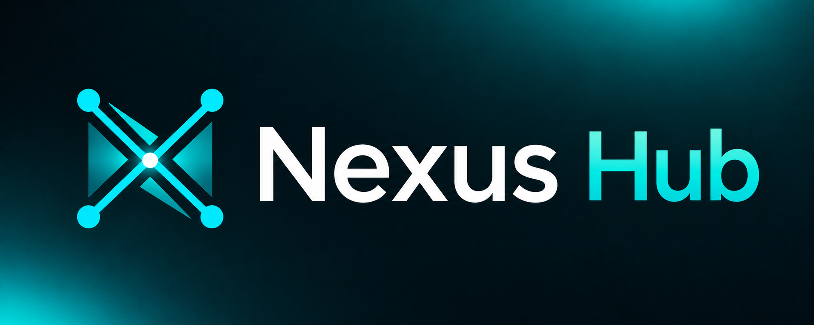

<p align="center"><a href="https://github.com/bendourthe/Nexus-Hub"></a></p>

<p align="center"><em>The Skill Harness for Every AI Coding Assistant.</em></p>

# Nexus-Hub

<!-- nexus-hub-version: 4.7.0 -->

Nexus-Hub is the upstream skill catalog for AI coding assistants: 336 skills, 18 commands, 35 hooks, 23 agents, and 4 language rule families. It installs in one step on Windows, macOS, and Linux, and it works the same across Claude Code, OpenAI Codex, Gemini (via Antigravity), GitHub Copilot, Cursor, GitHub CLI, and the sibling Nexus desktop app and VS Code extension. The catalog is reverse-engineering-first by policy: zero third-party data processors, zero outbound calls from skills / commands / hooks, zero telemetry.

## Interactive Guide -- start here

**New to Nexus-Hub? [Open the interactive guide](guides/website/nexus-hub-guide.html).** It is a self-contained, offline HTML file: a concise Home with the install commands, eight Foundations scenes that build a practical mental model from tokens through harnesses, a playable Asteroids Training loop with a cumulative file explorer, and one Cheatsheets tab for the loop plus command arguments. It is the fastest way to get a teammate productive, and it doubles as a live-demo-quality workshop.

- **File:** [`guides/website/nexus-hub-guide.html`](guides/website/nexus-hub-guide.html) -- one HTML file, fully offline, no server or install required.
- **To view it:** GitHub does not render HTML inline. Open the file above and click **Download raw file** (top-right of the file view), then open the downloaded `.html` in any browser. Or clone the repo and double-click it.
- **To share it:** send that single file to anyone on the team. See [guides/website/README.md](guides/website/README.md) for maintainer notes.

> **Renamed from DevAI-Hub at v2.0.0** to align with the sibling project [Nexus](https://github.com/bendourthe/Nexus-AI), a local-first desktop AI Studio that consumes Nexus-Hub as its upstream skill feed. Existing `~/.devai-hub/` installs are migrated in place by the v2.0.0 installer on first run; see [docs/archives/v2/v2.0/RELEASE_NOTES.md](docs/archives/v2/v2.0/RELEASE_NOTES.md) for the full migration story.

---

## How Nexus-Hub fits with Nexus

<p align="center">
<a href="https://github.com/bendourthe/Nexus-Hub"></a>

<a href="https://github.com/bendourthe/Nexus-AI"></a>
</p>

Nexus-Hub and [Nexus](https://github.com/bendourthe/Nexus-AI) are two halves of the same idea, split along a deliberate seam.

- **Nexus-Hub (this repo)** is the catalog: 336 curated skills, 18 commands, 34 hooks, 23 agents, 4 rule families, plus 4 internal MCP servers (`nexus-skill-server`, `nexus-code-search`, `nexus-web-fetch`, `nexus-context-compressor`) and the local `nexus-memory` CLI store. It is content-only, platform-agnostic, and shipped via an installer that writes to `~/.nexus-hub/` and into each AI assistant's per-platform config locations.
- **Nexus** is a local-first desktop AI Studio that consumes Nexus-Hub as its skill feed. Nexus's `AGENTS.md` names this repo as "the only external project we deliberately link to" -- the upstream feed for its skill harness.

The two projects are designed to be useful independently: you can install Nexus-Hub into any supported agent platform without touching Nexus, and Nexus can run with or without the upstream catalog wired in. The combination is what gives a single curated skill set to every agent surface a developer touches: terminal, IDE, desktop app, and CLI.

---

## What's New in v4.7.0

**Releases now ship a verifiable artifact, and installs can be pinned and rolled back.** Every GitHub Release carries `Nexus-Hub-<version>.tar.gz`, a `SHA256SUMS` file, and a build-provenance attestation. Both bootstrap installers verify that download fail-closed for a tagged ref: a checksum mismatch, a missing checksum file, or an unresolvable tag aborts with a distinct message and never installs unverified, while a network failure is reported as a network failure rather than tampering. Pin with `--ref v4.7.0`, move with `nexus-hub upgrade --latest`, and roll back with `nexus-hub upgrade --ref <older tag>`. No package registry and no new secret.

**Every platform carries an always-loaded `## Autonomous Operation` block.** All twelve substantive instruction templates state that the agent proceeds on reversible work the request already covers and stops only for destructive actions and genuine scope changes. It also settles precedence: your instructions outrank a skill's guidelines, routine skill lookup stays silent, and a skill instruction that would block, narrow, or alter your request is disclosed by name with the line quoted. The communication contract gains its progress-narration half and a rule that formatting follows the reader.

**The interactive guide teaches by showing.** The Models section is rebuilt as a visual learning lab whose language, diffusion, world, and multimodal demos run on a shared clock, pause on hover and focus, and stop under reduced motion. Home is simplified around one checked brief example, and its platform handoff is an illustrative Claude Code to Codex conversation resuming a plan interrupted by a usage limit. The token, prompt, and context lessons are rebuilt, with attachment and context previews that open as native dialogs and stay embedded and offline.

**Routing data re-verified and `gpt-6-astra` mapped.** Every cell of the bundled model map was re-fetched from vendor pages, `gpt-6-astra` enters at frontier, and the prompting profile layer now holds more than one platform with its first OpenAI profile. A scheduled supply-chain watch audits the extension packages and optional extras weekly, producing no required status check by construction.

Catalog counts remain **329 skills**, **18 commands**, **34 hooks**, and **23 agents**. Two opt-in surfaces are new, the pinned install and the upgrade flags; both are documented above with their activation, validation, rollback, and the authority they do not grant.

---

## What's New in v4.5.0

**Every platform now carries an always-loaded writing rule.** A short `## Writing Discipline` block sits in all twelve substantive instruction templates: a prohibition list of the highest-frequency AI-cliche moves, the ASCII punctuation rule that was previously Claude-only, a ban on chatbot leftovers, and a self-check that binds the agent's live chat replies as well as the files it writes. The lockstep parity guard byte-compares it and a twelve-template validator asserts it, so removing it from any one template fails a test. The decision and its alternatives are recorded in `docs/decisions/implemented/policy/2026-09-04-writing-discipline-binds-chat-replies.md`.

**`anti-slop-editing` learns the reflective register and ships a detector.** Nineteen named patterns across seven clusters, each with a before and after pair and a stated class, join the catalog, and `Robotic rhythm` becomes three countable rules. A stdlib-only offline detector reports each finding with line, column, span, and class, exits zero by default, and gates only on request; the skill runs it as a floor before and after editing.

**Agent security closes the boundary gaps the 2026 incidents exposed.** `agent-execution-isolation` gains a host layer beneath the sandbox designed for the case where the virtual machine fails, a transitive-reachability control that treats each allowlisted destination as a node with its own reach, a correction that per-session containers isolate processes and not sessions (with a required enumeration of shared writable services and a remediation ladder), and boundary-interface minimization. `agentic-endpoint-hardening` keeps its advisory default and adds a narrow deterministic response class for violations no legitimate operation produces, guidance only. `purple-team-exercise-design` owns cross-domain attack chaining.

Catalog counts remain **329 skills**, **18 commands**, **34 hooks**, and **23 agents**. This release changes no opt-in capability, installer flag, or host surface; the Writing Discipline block changes distributed instruction text for every platform, is not opt-in, grants no authority, and is overridden by a project's own instruction file.

---

## What's New in v4.4.5

**Five patch cycles of guide work ship as one tag.** v4.4.1 through v4.4.5 were authored in sequence and held back while the operator reviewed Home and Foundations between rounds. Together they take the guide from the rebuilt structure of v4.4.0 to a product that reads correctly on first look, teaches each idea in the operator's words and order, and integrates the reviewed mockups. The range is 44 commits across 63 files, all inside `guides/website/`, `tests/guides/`, and the v4.4 release docs.

**Every illustration reads correctly on first look.** The guardrails figure was rebuilt so no label can escape its box, Context Engineering reads without a legend, the two harness scenes merged into one figure that cannot overlap, the work-cycle ring was replaced and the video plays itself, and section headings follow one stated size rule. The guide no longer addresses the reader in the second person.

**Each segment teaches its one idea.** Models is rebuilt on the eight-stage spine and teaches how a model works instead of listing what it outputs. One prompt is followed through both harnesses with the operator's analogy: the model is a powerful brain, the platform harness is a graduate degree, the Nexus Hub harness is decades of practical experience. The vague prompt is shown beside the reasons it fails, and the cost of dumping everything into the context is named. Every harness layer now states something and shows the chain.

**Training runs on a deterministic arcade shooter.** It replaces Asteroids with the requested lives bug, asteroid hazard, and vertical-movement feature, adds pointer play and dense varied spawning, and its fullscreen presentation fills the whole window at every desktop size with three panes and an overlaid Outline.

Catalog counts remain **329 skills**, **18 commands**, **34 hooks**, and **23 agents**. This release changes no opt-in capability, installer flag, or host surface. The release-time platform re-verification found one documentation drift on the Claude Code effort lever and corrected the recorded statement; the seeded value is unchanged.

---

## What's New in v4.4.0

**The guide now teaches and demonstrates instead of describing.** Home opens on a centred animated mark and wordmark that never wraps, a tagline that sells an outcome rather than listing contents, six honest platform compatibility treatments, and an Installation section where the install command dominates rather than the verification step. Three of those six platforms use labelled text treatments rather than invented trademark geometry, because their vendors publish no distributable standalone product mark; that limit is recorded as a known gap rather than papered over.

**Foundations teaches a non-technical reader what the words actually mean.** The model diagram was corrected to the real sequence (trained, then integrated into a platform, then a request arrives carrying context, then internal reasoning, then output), and five missing concepts were added: tokens for text and images, prompt engineering with worked examples, chatbot versus agentic platform, context engineering and the context window, and harness and loop engineering. The last section ends on an honest account of what Nexus-Hub adds above a platform's own built-in harness.

**Training dropped the download for a game you actually play.** A real in-page Asteroids ships with a seeded wrap-boundary collision bug. The learner plays it, observes the defect, then drives the eight-command loop through a simulated terminal to fix the bug and add asteroid splitting, with an explorable cumulative file tree showing what each command wrote. Everything stays in one self-contained offline HTML file at 480.5 KB against a 500 KB budget, with zero runtime network calls.

**This release is also the first real test of the v4.3.0 verification discipline, and the discipline earned its place.** Every phase ran under the fail-closed ladder, and the Tier 3 deep pass found seven defects that a passing test suite had not: non-integer numeric Training navigation corrupting exported state, presentation mode painting the game over later regions, focus escaping the presentation dialog, a denied-fullscreen fallback surviving route changes and leaving the destination inert, a presentation dialog with no visible close control, and harness claim chips missing from the rendered label-containment inventory. Each was reproduced, fixed, and re-proved in a real browser on Windows and Ubuntu. Browser-backed guide verification is now enforced in CI by a scoped `guide-render` job wired into the `ci-required` aggregate, closing the last gap that let visual defects ship unexercised.

### Capability usage - Claude Code reasoning-effort seeding (changed default)

This release raises the reasoning effort that a Claude Code install seeds, which writes into a file you own, so its operation is documented in full.

| Element | Detail |
|---|---|
| **Activation** | No flag or opt-in. `nexus-hub upgrade` (or a fresh install) seeds `effortLevel: "high"` and `env.CLAUDE_CODE_EFFORT_LEVEL: "high"` into `~/.claude/settings.json`. Seeding is absent-only: an existing value of either key is never overwritten, and the pair is treated as one upgrade unit, so a config already carrying either key receives neither. |
| **Validation** | `python -c "import json;d=json.load(open('$HOME/.claude/settings.json'));print(d.get('effortLevel'), d.get('env',{}).get('CLAUDE_CODE_EFFORT_LEVEL'))"` prints `high high` when both were seeded, and your own prior values when they were preserved. |
| **Rollback** | Set both keys to `"medium"` in `~/.claude/settings.json`. Re-running the installer will not raise them again, because seeding only fills an absent key. Nothing else is written and no file is removed. |
| **Authority** | Raising effort does NOT grant Claude Code any new permission, tool, file access, or network capability, and does NOT change what the hooks allow or block. It only changes how much reasoning the model spends per turn, which raises token cost. This change is scoped to Claude Code alone: Codex, Qwen, Kimi, and Hermes stay at `medium`. A malformed user-owned `env` is preserved and receives no nested key, so a reinstall cannot add an env pin that bypasses the VS Code effort toggle. |
| **Docs** | [`configs/README.md`](configs/README.md) and [`guides/reference/CLAUDE_CODE_SETTINGS_REFERENCE.md`](guides/reference/CLAUDE_CODE_SETTINGS_REFERENCE.md) |

Catalog counts remain **329 skills**, **18 commands**, **34 hooks**, and **23 agents**. This release has no breaking change and adds no installer flag and no opt-in host surface; the one changed default-on surface is documented above.

## Previously, in v4.3.0

**The harness verifies behaviour, not just artifacts.** The phase gate previously checked four things - tests pass, coverage holds, lint is clean, build succeeds - and every one can be true of a feature that has never been run once. A page whose text spills outside its container satisfies all four. A tiered verification ladder now ships in the catalog and every consuming project inherits it on install: a cheap proportional functional smoke at every phase gate, a recorded plan-delta note so the plan is questioned as it is executed rather than trusted to the end, and a fail-closed deep pass before release that dynamically exercises every feature the plan produced, checks rendered output with a real visual-defect detector, runs an adversarial pass, and audits whether the plan itself was complete. Depth scales with blast radius from objective diff-evidenced triggers, and ambiguous classification escalates rather than skips.

**The instruments exist, not just the instructions.** One skill (`functional-verification`) owns the procedure, a renderer-backed detector finds visual defects in real pages, a responsive-layout rule lands in the new `catalog/rules/html/` family, and a paired `html-responsive-guard` hook enforces it at write time on both Bash and PowerShell.

**The interactive guide was rebuilt, and rebuilding it is what exposed the gap above.** The guide is now a dual-theme site with a compact Home, five animated scrollytelling Foundations scenes, an interactive Training walkthrough, and per-scope Cheatsheets, verified to WCAG AA across both themes. The v4.3.0 discipline was built after that rebuild precisely so the guide's successor is not produced by the process that produced its defects.

**A silent Windows failure was found and fixed on the way out.** On a host whose PATH `bash` is the WSL launcher stub, every guarded tool call was denied with no actionable diagnostic, because the stub prints to stdout and exits non-zero without touching stderr. Hook children now resolve a real interpreter, `nexus-hub doctor` reports an unusable one as NEEDS-ACTION, and a new `interpreters` gate group catches the whole class locally instead of on a CI runner.

### Capability usage - `html-responsive-guard` (new default-on hook)

This release adds a hook that can BLOCK a write, so its operation is documented in full rather than left to discovery.

| Element | Detail |
|---|---|
| **Activation** | Installed and registered automatically as a `PreToolUse` hook by `nexus-hub upgrade` (or a fresh install). No flag or env var enables it; it is on once installed. |
| **Validation** | `printf '{"tool_name":"Write","tool_input":{"file_path":"x.html","content":"<style>p{max-width:600px}</style>"}}' \| bash ~/.claude/hooks/html-responsive-guard.sh; echo $?` prints the rule violation and exits `2`. Malformed or unrelated input exits `0`. |
| **Rollback** | `NEXUS_DISABLED_HOOKS=html-responsive-guard` disables just this hook for the session; `NEXUS_HOOK_PROFILE=minimal` disables the advisory set. Neither removes installed files; re-running the installer restores registration. |
| **Authority** | Disabling the hook does NOT make a fixed text cap correct - it only removes write-time enforcement, and the rendered-output detector and the `catalog/rules/html/responsive-layout.md` rule still apply. The hook reads only the write payload it is handed: it makes no outbound call, does not scan your project, and never rewrites your file. It blocks or permits; it does not edit. |
| **Docs** | [`catalog/rules/html/responsive-layout.md`](catalog/rules/html/responsive-layout.md) and [`catalog/skills/testing/functional-verification/SKILL.md`](catalog/skills/testing/functional-verification/SKILL.md) |

Catalog counts are **329 skills** (+1), **18 commands**, **34 hooks** (+1), and **23 agents**. This release has no breaking change. It adds one default-on hook, documented above; it adds no installer flag and no opt-in host surface.

## Previously, in v4.1.2

**Agents stop at the first sufficient construction before writing code.** All 12 substantive instruction templates now carry a compact always-on ladder: skip, reuse this codebase, stdlib, native feature, installed dependency, one line, then minimum. Include-only shims inherit it and do not duplicate the heading.

**Two skills own intensity and delete-lists.** `minimal-construction` walks the seven rungs with lite/full/ultra as a skill argument (no env var or config file). `over-engineering-review` emits a tagged delete-list or `Lean already. Ship.` and does not apply fixes. Deferred ceilings use a generic `construction-debt:` marker.

Catalog counts are **328 skills** (+2), **18 commands**, **33 hooks**, and **23 agents**. This release has no breaking change and changes no opt-in capability, installer flag, or host surface.

## Previously, in v4.1.1

**Local security audits now prove which scanners ran.** A full security-audit run emits a schema-v2 closure record with a receipt for every applicable optional local scanner (`RAN`, `NOT_APPLICABLE`, `UNAVAILABLE`, `FAILED`, or `DECLINED`). Schema-v1 records keep their previous fields. Missing tools stay visible instead of looking complete.

**Detection, fix, and verification stay separate.** The ordered `security-audit` preset re-scans with the same detector after a user-approved patch, and the fixer cannot be the only post-fix verifier. Cloud posture remains read-only.

**Optional scanners stay local.** Semgrep, gitleaks, OSV-Scanner, npm audit, pip-audit, Trivy, and Checkov are recipes on existing skills. None is auto-installed or replaced by a hosted service. See [`guides/reference/SECURITY_AUDIT.md`](guides/reference/SECURITY_AUDIT.md).

Catalog counts remain **326 skills**, **18 commands**, **33 hooks**, and **23 agents**. This release has no breaking change and changes no opt-in capability, installer flag, or host surface.

## Previously, in v4.1.0

**Skill guidance now starts from evidence and ends in action.** Skill authors write executable procedural runbooks, label successful and failed observations before distillation, and pair domain language with an observable trigger.

**Typed-boundary hygiene is a first-class skill.** The `typed-boundary-hygiene` runbook replaces low-evidence TypeScript assertions with named types and checked seams.

**Skill evaluation can add an optional raw-memory comparison** beside the existing with-skill and without-skill benchmark. See the v4.1.0 changelog for Activation, Validation, Rollback, Authority, and Docs.

## Previously, in v4.0.0

**Documentation is placed by lifespan, and the migration proves itself.** Release-bound work lives under `docs/releases/v<MAJOR>/v<MAJOR>.<MINOR>/`, frozen snapshots live under `docs/archives/`, and living material stays at stable roots such as `docs/handbooks/` and `docs/decisions/`. Existing legacy layouts remain honored in place until an explicitly approved migration.

## Previously, in v3.21.0

**Fail-closed last phase, implement drivers, and living handbooks.** `/plan` and `/implement` last-phase runs must write `last-phase-evidence.md` with Goal-vs-codebase review; a heading is not done work. `/implement <slug> full` (alias `in-full`) and `phase-by-phase` encode the multi-phase loop; bare `/implement` stays one-phase. Living `docs/handbooks/` and `docs/decisions/` are required on the current path scheme; v4.0 will snapshot them, not decline them.

This release changes no opt-in capability, installer flag, or host surface.

## Previously, in v3.20.3

**Skills craft, invocation policy, and a Claude Code subscribe path.** Three new skills (`design-interview`, `setup-wizard-generator`, `decision-questionnaire`) take the catalog to **324**. Authoring skills teach agent-writing discipline. Generated command-skills carry `disable-model-invocation: true` so slash dispatchers are not model-auto-invoked. Claude Code can subscribe with `/plugin marketplace add bendourthe/Nexus-Hub` (hooks stay on the installer).

This release documents one opt-in host surface: `claude-plugin-marketplace`. See the changelog for Activation, Validation, Rollback, Authority, and Docs.

## Previously, in v3.20.2

**Interface-craft is now a first-class cluster, not a hole in the catalog.** Six skills (net +6, polish merged into `hallmark-design` rather than a seventh skill) cover accessibility, layout, in-product copy, typography, color systems, and a coordinating `interface-review`. Overlapping rules have one owner; a missing delegate is named instead of reconstructed. Recipe-level elevation, radius, icon stroke, and motion values land in `hallmark-design` after its anti-slop gates. Catalog is **321 skills** across **23 categories**.

This release changes no opt-in capability, installer flag, or host surface.

## Previously, in v3.20.1

**Security coverage doubled, with the gates to keep it honest.** Forty independently authored cybersecurity skills (OT, mobile, API abuse, applied crypto, intel ops, zero trust, deception, firmware, smart contracts, wireless, SSVC/SLSA, purple team) plus two categories (`ot-security`, `mobile-security`). Dual-use skills open with an authorization gate. MITRE F3 mapping, an ATT&CK Navigator export, an agentskills.io conformance guard, a committed coverage map, and an 800-line SKILL.md body cap. Catalog is **315 skills** across **23 categories**.

This release changes no opt-in capability, installer flag, or host surface.

## Previously, in v3.20.0

**Agent execution now has an OS-level isolation skill.** `agent-execution-isolation` teaches Landlock, seccomp, network namespaces, per-session ephemeral containers, placeholder credentials, and an out-of-process egress proxy (static rules, optional LLM judge, SSRF/RFC-1918 blocks, human escalation). `/review security` engages it when the reviewed project spawns agents, holds agent credentials, or makes agent-driven egress calls.

**Existing skills now point at that model instead of duplicating it.** `agentic-endpoint-hardening` documents credential brokering (placeholders in the agent, real keys at a broker). `egress-redaction` states that typed BLOCK/REDACT/HASH/PASS is skippable content policy, not a network perimeter. `ai-agent-governance` records the three-question triage (sandbox, broker, egress) under Pillar 3.

Catalog counts are **275 skills**, **18 commands**, **33 hooks**, and **23 agents**. This release adds no installer flag, opt-in host surface, or outbound call.

## Previously, in v3.19.2

**Agents now have a durable, cross-platform memory store.** `nexus-memory` is a local append-only log of lasting facts, decisions, and events. An agent reads it at session start within a fixed line budget, records as it works, and summarizes older ranges itself. The store never calls a model, never starts a background process, and never leaves the machine. Default root is `~/.nexus-hub/memory/`.

**A read that the harness would silently truncate is no longer acceptable.** Shared output paging splits agent-consumed script output by both a byte cap and a line cap (defaults: 16,000 bytes and 256 lines, the minimum across surfaces verified on 2026-08-23). Printed next-step commands resolve to the script's own path, so they work when the script is not on PATH.

**A relocated store is no longer documentation-only.** Creating or appending inside a git working tree is refused, POSIX permissions are owner-only, and the `memory-store-guard` hook blocks Write, Edit, and git staging of store artifacts unless `NEXUS_MEMORY_ALLOW_IN_REPO=1`.

**The new `agent-memory` skill is the routing home for this store.** It is distinct from `session-query`, `context-pack-builder`, `continuous-learning`, and `solution-knowledge-base`, which stay on-demand and topic-scoped. Spawned subagents are told not to write. Catalog count is now **275 skills**, **18 commands**, **32 hooks**, and **23 agents**.

`nexus-memory` is a local CLI package, not a fifth MCP server. The four internal MCP servers are unchanged. The package is stdlib-only: **zero outbound calls, zero API keys, zero model downloads**.

## Previously, in v3.19.0

**Code intelligence is now cheaper to expose, safer to act on, and still fully offline.** `nexus-code-search` adds `minimal`, `standard`, and `full` tool profiles so a session can expose 7, 16, or 20 tools instead of paying the full definition cost every time. Full remains the compatibility default, and profiles change visibility only - they grant no additional authority.

**Repository searches can route through the local index.** A cross-platform `PreToolUse` hook recognizes Grep, Glob, and equivalent shell searches, then points the agent toward `nexus-code-search`. Its default `soft` mode is advisory; `NEXUS_CODE_SEARCH_ROUTING=block` makes matched searches fail with exit 2, while unrelated commands remain untouched.

**Every MCP tool can return compact responses.** Set `response_format=auto` to use the versioned `NEXUS-CW/1` format only when it clears the measured savings threshold, or use `compact` to force it. JSON remains the default and the fail-open fallback, and `nexus-context-compressor` recognizes the marker so it does not compress the same payload twice.

**Mutation planning gains evidence-backed preflights.** `code_edit_safety`, `code_delete_safety`, and `code_rename_safety` return ordered verdicts with the indexed callers, importers, and references behind them. `insufficient_data` stays distinct from safe, and each result states the graph's cross-repository visibility boundary.

**The local index now understands more than code.** A provider seam ships with a Markdown provider for headings and hierarchy, plus optional hybrid retrieval through pre-placed ONNX weights. Dense retrieval is off by default, never downloads a model, and degrades to keyword search with a precise local hint when its extra, weights, or encoder are unavailable.

The deterministic benchmark records retrieval quality, response bytes, estimated tokens, definition cost, and latency against unique temporary workspaces. CI runs the full extension suite in a container with `--network none`, and the server now supports both MCP SDK 1.x and 2.x schema attribute names. See the [code-search README](extensions/nexus-code-search/README.md) for activation and rollback guidance.

Catalog counts are unchanged at **273 skills**, **18 commands**, **31 hooks**, and **23 agents**. The extension preserves its published guarantee: **zero outbound calls, zero API keys, zero model downloads**.

## Previously, in v3.18.3

**`/presentify` can now produce a slide deck.** Pass `--nav slides` (or pick "Slide deck" in the canvas question) and the output becomes viewport-fitted slides advanced by keyboard arrows, rather than a page you scroll. Everything else about the output is unchanged: still one self-contained offline HTML file, still real interactive charts, still commercial-use-safe imagery.

```bash
/presentify report.pdf --nav slides --interactivity rich
```

Forward is ArrowRight / ArrowDown / PageDown / Space, back is ArrowLeft / ArrowUp / PageUp, Home and End jump to the first and last slide, touch swipes, and on-screen zones click. `scroll` remains the default and the non-interactive fallback, so nothing changes for anyone who does not ask for slides.

**The intake stayed at four questions.** The interactive question surface caps at four per round, so navigation rides on the existing output-aspect question rather than adding a fifth. `--layout` binds the aspect half and `--nav` the navigation half: name both and the question disappears, name one and it narrows to what is still unresolved. The two compose rather than conflict, so `--layout portrait --nav slides` is portrait-ratio slides, and no pair of flags can deadlock the intake.

**The interesting problem was animation, not navigation.** Slide mode has no scroll, so every scroll-triggered effect the balanced, rich, and cinematic levels ship had to be re-expressed or it would simply never fire, leaving content permanently hidden. There are now three slide-native trigger classes and a mapping table covering every pattern in the catalog: effects that run once when a slide activates, effects stepped by arrow key within a slide (PowerPoint-style builds), and permanent ambient loops for atmosphere. One rule is binary and load-bearing: **only non-data-bearing motion may loop.** A chart build or a numeric transition must be entry-triggered or stepped, because looping data motion fabricates the impression of live data.

Cinematic survives too. The scroll-scrubbed camera becomes a fragment-stepped camera - one keyframe per arrow press, using the easing the scrub curve would have applied, with a subtle drift while a keyframe holds. Slide mode changes the trigger, never the asset policy: the size gate, the no-hosted-generation boundary, and the stills-only reduced-motion path all apply unchanged.

**The QA loop grades slides as strictly as pages.** The visual-QA rubric gains a twelfth criterion covering per-slide fit at all four viewports, fragment integrity including deep-link state, ambient-loop discipline, and navigation chrome. The structural scorer gains seven deterministic checks that skip cleanly on a scrolling page, so every page authored before this release stays out of the failure set. One of the seven deliberately runs *outside* that skip: it fails when a page's design record says slides but the markup lost its `data-nav` attribute, which would otherwise skip all six other checks and score a confident green.

Under `prefers-reduced-motion: reduce` a deck is a sequence of settled, fully-legible stages: transitions become instant cuts and ambient loops are removed entirely rather than slowed. Without JavaScript it degrades to ordinary stacked sections in source order, and it prints one slide per page.

Catalog counts are unchanged at **273 skills**, **18 commands**, **31 hooks**, and **23 agents**: this release adds one reference file to an existing skill's bundle rather than a new skill.

## Previously, in v3.18.2

**The GitHub Usage Monitor has been withdrawn.** It is deleted from the catalog, and upgrading uninstalls it from both VS Code and Cursor. Unshipping alone would not have been enough: an extension already installed keeps running, and this one could report a confident **0% used against an allowance GitHub showed as fully exhausted**.

**Why it could not be fixed.** The extension existed to mirror the Included usage bars on `github.com/settings/billing`. That figure is not served by any API. The endpoint that once returned it (`/{scope}/settings/billing/actions`, carrying `included_minutes` and `total_minutes_used`) was [closed down on 2025-09-26](https://github.blog/changelog/2025-09-26-product-specific-billing-apis-are-closing-down/); re-verified 2026-08-22, the Budgets API exposes only budget amounts, `/usage` and `/usage/summary` carry no allowance field, and GraphQL has no billing surface at all.

So the number had to be reconstructed, and the reconstruction needs one input GitHub does not provide. The billing page discounts cover *"Actions usage in public repositories **and** included usage for Actions minutes and storage"* -- two reasons summed into one figure, with no discount-reason field and no visibility field on any line item. The only discriminator is the repository, and GitHub reports visibility **as of now** while billing items are **historical**. A repository that was private when its minutes ran and is public today has its whole month retroactively reclassified as free, which is exactly how a saturated allowance renders as 0%. That gap is a property of what is missing from the data, not something an implementation can close.

The mechanism also moves underneath any reconstruction: runner prices were cut on 2026-01-01, and from 2026-03-01 self-hosted runners began consuming the quota "based on list price". The second change silently falsified two statements v3.18.1 itself shipped.

**The Claude, Codex, and Cursor monitors are unaffected and stay.** They do not share the problem: each reads a *served* usage figure from its vendor's own first-party endpoint and reconstructs nothing. That is the difference, and it is why only this one was withdrawn.

Settings under `githubUsageMonitor.*` are left in place rather than deleted; they are inert and harmless. Full reasoning, including the four alternatives rejected and the one thing that would reopen the decision, is at [`docs/decisions/implemented/architecture/2026-08-22-withdraw-the-github-usage-monitor.md`](docs/decisions/implemented/architecture/2026-08-22-withdraw-the-github-usage-monitor.md).

Catalog counts are unchanged at **273 skills**, **18 commands**, **31 hooks**, and **23 agents**. Nexus-Hub now ships **three** usage monitor extensions instead of four.

---

## Supported Agentic Platforms

| Platform | Install target | Path | Per-platform surface |
|---|---|---|---|
| Claude Code (Anthropic) | `~/.claude/` + project `.claude/` | legacy + registry | Full: skills, commands, hooks, agents, rules, MCP configs |
| OpenAI Codex CLI | `~/.codex/` + project `.codex/` + `AGENTS.md` | legacy + registry | Full: skills (under `skills/`), commands (under `prompts/`), agents, rules |
| Gemini (IDE / Antigravity 1.0) | `~/.gemini/` + project `.gemini/GEMINI.md` | legacy + registry | Full: skills, commands (under `workflows/`), agents, rules |
| **Gemini CLI (Google, ENTERPRISE-ONLY post-2026-06-18)** | `~/.gemini/commands/*.toml` + project `.gemini/commands/*.toml` | **registry (new in v2.1.0; gated behind `--enterprise` / `-Enterprise` flag in v2.2.0)** | TOML-format custom commands generated from `catalog/commands/*.md`. Non-enterprise users transition to Antigravity CLI before 2026-06-18 per the 2026-05-21 Google announcement. |
| **Antigravity 2.0 + CLI (Google)** | `~/.gemini/antigravity-cli/` + project `.agents/` | **registry (new in v2.1.0, CLI coverage added v2.2.0; paths verified v2.3.0)** | Full: skills, commands (under `workflows/`), subagents, rules. Single integration covers both the desktop IDE and the standalone Antigravity CLI (`agy` binary), verified 2026-05-29 against Google's public Antigravity CLI docs. |
| GitHub Copilot (VS Code) | project `.github/copilot-instructions.md` | legacy + registry | Behavioral guardrails (skill index embedded as text); merge semantics if the file already exists |
| Cursor | project `.cursor/rules/*.mdc` + `AGENTS.md` | registry | Per-rule `.mdc` files + behavioral guardrails (skill index embedded as text) |
| OpenCode | project `AGENTS.md` + `.opencode/` | registry | Behavioral guardrails + skills mirror |
| **Nexus-AI (Local Studio)** | `~/.nexus-ai/catalog/` + project `.nexus-ai/catalog/` | **registry (new in v2.1.0)** | Full mirror: skills, commands, agents, rules, hooks, MCP configs, templates, plus a `nexus-hub-version.json` manifest. Isolated under `catalog/` so the app's own data at the `~/.nexus-ai/` root stays outside a catalog refresh. |
| GitHub CLI (`gh`) | via `gh copilot` extension | indirect | Skill / command references via `AGENTS.md` open standard |
| Nexus desktop app | upstream consumer | indirect | Reads the same catalog as its skill feed |
| Nexus VS Code extension | upstream consumer | indirect | Reads the same catalog as its skill feed |

**Coverage caveat**: the **registry** path (introduced in v2.1.0 Phase 10) dispatches install / teardown through `scripts/lib/integrations/runner.py` and supports a `--dry-run` mode. The **legacy** path (the long-standing in-installer copy blocks) continues to be the canonical install for Claude / Gemini / Codex / Copilot until v2.2.0 parity migration (tracked as DF-001 in `docs/archive/v2/v2.1/known-gaps.md`). Both paths produce the same end-state on disk for those platforms; the per-platform installer logic lives in [`scripts/installer.sh`](scripts/installer.sh), [`scripts/installer.ps1`](scripts/installer.ps1), and the per-platform subclasses under [`scripts/lib/integrations/`](scripts/lib/integrations/). Per-platform capability specs (install surface, distributed content, instruction file, quirks) are documented under [`docs/specs/`](docs/specs/).

**Branch-based install** (v2.4.0): pass `--branch <name>` (Bash) or `-Branch <name>` (PowerShell) to install the catalog from a pushed branch instead of the current checkout. The installer shallow-clones the repo at `<name>` into a deterministic cache directory (`~/.nexus-hub/branches/<sanitized-name>/`) and runs the install from that checkout, so the user's working copy is never touched. The branch name is sanitized for filesystem safety (path-traversal sequences are neutralized). Combine with `--check` / `-Check` for a clone-free probe that prints the resolved cache path and clone source.

---

## Quick Start (one command)

Open a terminal and paste the line for your system. It downloads the catalog from this repo and runs the installer -- no clone, no unzip, no `cd`.

**macOS / Linux** (paste into Terminal):

```bash
curl -fsSL https://raw.githubusercontent.com/bendourthe/Nexus-Hub/main/install.sh | bash
```

No `curl` on the box? Use `wget`:

```bash
wget -qO- https://raw.githubusercontent.com/bendourthe/Nexus-Hub/main/install.sh | bash
```

**Windows** (paste into PowerShell):

```powershell
irm https://raw.githubusercontent.com/bendourthe/Nexus-Hub/main/install.ps1 | iex
```

That is the whole setup -- no prompts. The installer prechecks its dependencies (and tells you exactly what to install if one is missing), then performs a global install across every supported assistant it detects; assistants you do not have are skipped with a note, never an error. Your customizations are preserved (marker-merge), and on a re-install it asks once only if it finds a managed file you changed that it would overwrite, naming the file.

**Done.** The installer writes to `~/.nexus-hub/` (the user-global catalog) and into each supported assistant's per-platform config locations. If a legacy `~/.devai-hub/` install is detected, you will see a single migration prompt at the top of the run -- answer `Y` (default) to migrate in place.

After the installer completes:

- **Globally**: your user profile has all 329 skills, 18 commands, 34 hooks, 23 agents, plus Gemini and Codex instructions.
- **Locally**: your project has `copilot-instructions.md` and `AGENTS.md` tailored to your language.

**Power-user flags**: `--workspace <path>` installs into a single repo instead of globally; `--platforms <comma-list>` limits the install to a subset of assistants; `--yes` runs fully unattended (refreshes managed files with no prompt -- ideal for CI). Prefer to clone first? `git clone` the repo and run `./install.sh` (macOS / Linux) or `install.bat` (Windows) -- the in-repo path still works exactly as before.

### Claude Code plugin (subscribe-style alternative)

The installer above is the primary path: every platform, hooks, and `nexus-hub upgrade`. Claude Code users who only want the catalog as a plugin can subscribe instead:

```
/plugin marketplace add bendourthe/Nexus-Hub
/plugin install nexus-hub@nexus-hub
```

This is not a replacement for the installer. It does not install hooks, other platforms, or the `nexus-hub` CLI.

If Anthropic later lists Nexus-Hub in `claude-plugins-official`, that listing is pinned to a git SHA that can lag tagged releases. Marketplace users may trail `main`. Prefer the installer, or this repo's marketplace added from a release tag, when you need the current release. The maintainer submission draft is [`docs/releases/v3/v3.20/development/claude-marketplace-submission.md`](docs/releases/v3/v3.20/development/claude-marketplace-submission.md).

### Installing a subset (selective installation)

By default you get the whole catalog. If you want a smaller install, pick a **profile**, one or more **capability modules**, or one or more **role bundles**. Selectors combine by union.

```bash
# macOS / Linux
bash scripts/installer.sh --profile core
bash scripts/installer.sh --modules ai-engineering,testing
bash scripts/installer.sh --bundles ai-engineer
bash scripts/installer.sh --profile core --modules security-operations   # union
```

```powershell
# Windows
.\scripts\installer.ps1 -Profile core
.\scripts\installer.ps1 -Modules ai-engineering,testing
.\scripts\installer.ps1 -Bundles ai-engineer
```

Profiles are `minimal`, `core`, and `full`. Modules group skills by capability (one per catalog category, so every skill is reachable through at least one). Role bundles are curated cross-category sets like `ai-engineer` or `devops-engineer`. List what is available with `python scripts/lib/installer/selection.py --repo-root . --profile core` , which prints the resolved plan without installing anything.

Three things worth knowing before you narrow an install:

- **Hooks, rules, templates, and settings always install**, under every selection including `minimal`. Narrowing your skill set asks for fewer capabilities, never for fewer guardrails.
- **Commands and agents follow their skills.** A command that is a thin pointer over one skill (for example `/implement` over `implement-phase`) installs only when that skill is selected; everything else installs regardless. So a focused install stays coherent instead of leaving commands that cannot do anything.
- **No selector means the full catalog**, byte-for-byte identical to what you would have got before selective installation existed.

`nexus-hub upgrade` re-applies whatever you selected, so an upgrade never quietly widens a focused install back to everything. To change scope, pass a new selector; to go back to everything, pass `--profile full`.

Selectors need Python to resolve. A full install does not.

### Keeping it current

Run `nexus-hub upgrade` -- it reports your installed version against the latest, shows a short what's-new summary, and updates in place on confirmation. Re-running the install command above works too; the installer is idempotent.

### Pinning a version, verifying the download, rolling back

The one-line install above follows the `main` branch, which has no publishable checksum because every commit changes the archive. To install a specific release instead, pin a tag; a pinned install downloads the tarball the project published for that release and verifies it before anything runs.

| Element | Detail |
|---|---|
| **Activation** | macOS / Linux: `curl -fsSL https://raw.githubusercontent.com/bendourthe/Nexus-Hub/main/install.sh \| bash -s -- --ref v4.7.0`. Windows: `&([scriptblock]::Create((irm https://raw.githubusercontent.com/bendourthe/Nexus-Hub/main/install.ps1))) -Ref v4.7.0`. The `NEXUS_HUB_REF` environment variable does the same. |
| **Validation** | The bootstrap prints `checksum OK (<sha256>)` before extracting; `nexus-hub --version` reports the installed version; `~/.nexus-hub/PINNED_REF` holds the pinned tag. `gh attestation verify Nexus-Hub-4.7.0.tar.gz -R bendourthe/Nexus-Hub` checks the build-provenance attestation of the published tarball. |
| **Rollback** | `nexus-hub upgrade --ref v4.6.0` installs an older tag (any tag that carries the published artifact set, v4.7.0 and later); `nexus-hub upgrade --latest` moves a pinned install to the newest release; installing `main` again removes the pin. |
| **Authority** | Verification proves the download is byte-for-byte what the release workflow published for that tag. It does not audit the catalog's content, grant any platform permission, or protect the host; a pinned install receives no updates until you move it. Tags published before v4.7.0 carry no artifact set and fail closed. |
| **Docs** | `docs/decisions/implemented/policy/2026-09-05-verifiable-pinnable-installs.md`; the bootstrap headers in `install.sh` and `install.ps1`. |

`nexus-hub upgrade` on a pinned install refuses to move and prints those options, so an upgrade never quietly unpins you.

### Verifying your install

Run `nexus-hub verify` to confirm your installed catalog matches the published release. It recomputes the SHA-256 of every file in the catalog tree and diffs the result against the `MANIFEST.sha256` that ships with each release, reporting any file that is modified, missing, or unexpected, then a single `verify: PASS` or `verify: FAIL` line. It is strictly local: it reads only local files, makes no network call, needs no credential, and adds no dependency.

What this does and does not prove: `verify` detects on-disk tampering or corruption AFTER install, relative to the published catalog. It is trustworthy to the extent the manifest itself came from the release you trust (it rides inside the same signed release tag the installer pulls from). It is NOT a code signature and NOT a substitute for verifying the download channel -- an attacker who can rewrite both a file and the manifest in the same tree defeats it. Use it to catch accidental corruption and post-install drift, not to establish first-trust in the bytes.

### Add organization standards

Connect a validated local-directory or Git bundle with `nexus-hub org connect <path-or-url>`, inspect it with `nexus-hub org status`, and then reinstall or repair the target workspace. Nexus-Hub projects the organization's concise core and rule files into existing platform surfaces without uploading the bundle or claiming policy enforcement. See the [Organization Knowledge Layer guide](guides/ORG_KNOWLEDGE_LAYER.md) for the bundle contract, lifecycle commands, precedence model, authoring workflow, and rollback procedure.

---

## What is Nexus-Hub?

Most AI assistants are generic by default: they know a lot but specialize in nothing. Nexus-Hub is the layer that turns a generic assistant into a specialist for the work you actually do.

It does three things:

1. **Behavioral rules** -- per-language code-style and security rules that tell the assistant how to write code in your project (not just whether the code compiles).
2. **Autonomous skills** -- 208 curated capability prompts grouped into 22 categories. Each skill has a 3-tier loading model (always-loaded summary, body on trigger, deeper references on demand) so context cost stays proportional to what the agent actually needs.
3. **Workflow awareness** -- 36 slash commands that chain skills into multi-step processes (plan generation, phase implementation, deep review, version bump, release notes, session history).

The catalog itself is content; the harness around it is the per-platform installer plus a small set of local MCP servers that surface the catalog to any agent that speaks MCP.

---

## Recommended Workflows

Nexus-Hub provides two opinionated end-to-end workflows. Use these as a starting point and adapt to your project.

### New Project Workflow (5 phases)

Build from scratch with an AI coding agent as your primary partner.

#### 1. Planning

Open an AI chatbot (Claude.ai or ChatGPT) and brainstorm: problem, users, core features, tech stack, constraints. End the session by asking the chatbot to produce a structured Markdown implementation plan -- phases with subtasks, each subtask carrying a self-contained prompt the agent can execute.

#### 2. Project setup

1. Create the Git repo with a three-tier branching model: `main` / `develop` / `feature/*`.
2. Install the Nexus-Hub toolkit -- paste the one-line install command for your OS (see [Quick Start](#quick-start-one-command)).
3. In Claude Code, run `/setup project` -- bootstraps `CLAUDE.md`, the directory structure, `.gitignore`, `README.md`, `DEVLOG.md`, and `CHANGELOG.md` in 8 guided phases.
4. Save the implementation plan from step 1 to `docs/<version>/plans/<slug>.md`.
5. Commit with `/commit`.

#### 3. Development (core loop)

Create ONE feature branch for the whole plan (`feat/<slug>`), then for each phase:

1. Open a fresh Claude Code session.
2. Run `/implement <slug> <phase>` -- walks every subtask, generates and runs tests, applies fixes, runs `/update gitignore` + `/update docs`, generates a session-history file, and produces a commit message.
3. Commit locally. Repeat for the next phase.

**Non-final phases do not push** (v4.0.0). A remote pipeline run per phase bills to validate work the plan itself calls incomplete, and a red check on incomplete work teaches you to stop reading red checks. One branch, one commit per phase, all local.

The final phase does the rest in order: it reconciles your pipeline against the canonical CI/CD contract via `[[cicd-architect]]`, completes the full local gate, then pushes ONCE with your explicit approval and opens the integration pull request. That pull request is the plan's first remote validation, and it tests the merge result rather than the branch tip. A red required check reopens the final phase and is reproduced locally before any re-push; release work starts only after the merge lands green.

If you do want to push mid-plan (to share work in progress, say), just ask -- the rule removes the default, not your authority.

Each `/implement` phase runs a best-effort model-routing pre-flight before building: it re-confirms the model and reasoning effort `/plan` recorded for the phase, re-assessing against the currently-available models so a plan built before a new release picks up the newer or cheaper option. It is platform-agnostic and never blocks (it degrades to the plan's recommendation when routing is unavailable). Run `/route` to route any task or phase on demand.

#### 4. Quality assurance (pre-release)

1. Run `/review full` -- a 12-phase orchestrator that chains known-gaps collection, health gates, dependency scan, docs / git hygiene, project validators, codebase description (`/describe full`), and the `security`, `pentest`, and full codebase-review scopes.
2. Read the synthesis report -- it produces a P0 / P1 / P2 / P3 ranked list of findings with a GO / GO-WITH-CONDITIONS / NO-GO verdict.
3. Address all P0 and P1 findings before release. P2 findings can be deferred to a follow-up patch release; P3 findings are advisory.
4. Run `/review sbom` for compliance documentation.

#### 5. Release

1. Run `/update release` -- orchestrates version detection, layout cleanup, `.gitignore` audit, version-bump across all configuration files, CHANGELOG migration, doc sync, and the DEVLOG index line.
2. Merge `develop` into `main`, tag the release, and push.

### Inherited Project Workflow (2 phases)

For projects you have inherited or need to audit.

#### 1. Primary analysis and deep review

1. Clone the repo, open it in VS Code, start a Claude Code session.
2. Run `/review full` -- the same 12-phase orchestrator from Phase 4 of the New Project Workflow. The synthesis report's prioritized roadmap (P0 / P1 / P2 / P3) becomes your initial backlog.
3. If documentation is sparse, backfill it: `/update docs` (README, if missing), `/update changelog` (from git history), `/update devlog`, `/update refactor` (only when the repo has structural issues).
4. Establish the `develop` branch if not already present.
5. Commit the analysis artifacts.

#### 2. Making changes

For each change:

1. Brainstorm in a chatbot, then run `/plan` to produce a structured implementation plan saved to `docs/<version>/plans/<slug>.md`.
2. Run `/implement <slug> <phase>` per phase -- identical to the New Project Workflow's development loop.
3. (Optional) Use git worktrees for parallel work:

    ```bash
    git worktree add ../project-fix feature/security-fix
    # work in a separate Claude Code session, then:
    git worktree remove ../project-fix
    ```

4. After all changes land on `develop`, run `/review full` again to verify nothing regressed, then `/update release` and merge to `main`.

The QA and release steps are identical to the New Project Workflow.

---

## Manual setup (if you do not want to run the installer)

If you prefer to copy things yourself, here is how the repo is organized.

### Claude Code (Anthropic)

The most powerful integration -- adds **autonomous agent capabilities**.

- **CLAUDE.md**: the "brain". Copy `catalog/CLAUDE.md` to your project root and customize.
- **Skills**: the "hands". Copy folders from `catalog/skills/` to your project's `.claude/skills/` folder.

    *Example*: copy `catalog/skills/research/trend-research` to enable the trend-research skill.

### Gemini (Google) and Antigravity

Optimized instructions for Google's Gemini models, including the Antigravity workspace layout.

- **Gemini instructions**: copy `templates/ai-instructions/base-gemini.md` (or `templates/ai-instructions/generic-instructions.md` for the legacy template) to `.gemini/GEMINI.md` in your project or user profile.
- **Skills and workflows**: the installer mirrors these to `.gemini/skills/` and `.gemini/antigravity/global_workflows/` so they appear globally in Antigravity.

### GitHub Copilot (Microsoft)

Instructions for VS Code's Copilot Chat.

- Copy `templates/ai-instructions/coding-instructions/{language}.md` to `.github/copilot-instructions.md`.

### Codex (OpenAI)

OpenAI Codex CLI integration. Codex reads `AGENTS.md` at the project root (the open standard, also honored by Cursor / Aider / Jules) plus its user-level config in `~/.codex/`.

- **AGENTS.md**: copy `templates/ai-instructions/base-codex.md` content into your project's `AGENTS.md`.
- **Skills and prompts**: the installer mirrors `catalog/skills/` to `~/.codex/skills/` and `catalog/commands/` to `~/.codex/prompts/`. For manual setup, copy each tree to those destinations.

### Cursor

Cursor IDE integration.

- **Project rules**: copy `templates/ai-instructions/base-cursor.md` content into `.cursor/rules/nexus-hub.mdc` at your project root. Use `alwaysApply: true` in the frontmatter so Cursor applies the rule on every prompt.
- **Open-standard `AGENTS.md`**: Cursor also reads `AGENTS.md` at the project root, so the Codex setup above covers Cursor too.

### OpenCode

OpenCode IDE integration. OpenCode reads `AGENTS.md` per the open standard.

- Copy `templates/ai-instructions/base-opencode.md` content into your project's `AGENTS.md`.

---

## Development setup

For contributors working *on* Nexus-Hub (not consumers of the installer), the repo ships a [`.devcontainer/`](.devcontainer/) at the root. Open the repo in VS Code with the Dev Containers extension installed (or click "Reopen in Container" when prompted) and the post-create hook will install Python tooling (`pytest`, `ruff`), the GitHub CLI (`gh`), and the Claude Code CLI (`claude`). Authenticate `gh` and `claude` once the container is up, then run `make validate` to confirm the catalog is clean.

The devcontainer is opt-in -- the standard Quick Start above does not require it. It exists for first-touch contributor onboarding and for reproducing the maintainer's environment across machines.

### Running the checks locally

Validation logic lives in the repository, not in the workflow files, so what CI runs is exactly what you can run:

```bash
make ci-fast       # seconds: parses, hygiene, workflow security, version sync
make ci-full       # minutes: every validator, the whole test tree, extensions
make ci-platform   # shell lint, PowerShell AST parse, Windows PowerShell 5.1 legs
```

Each target is a one-line delegation to `python scripts/ci/run.py --profile <name>`, which needs no CI provider and no network. Add `--list` to print what a profile would run without running it, or `--base origin/develop` to scope the run to what changed. Reports land in `reports/` (gitignored): a readable `summary.md`, plus JUnit, `summary.json`, and environment metadata.

Full guide, including how to add a check: [`docs/releases/v4/v4.0/development/ci-cd-profile-guide.md`](docs/releases/v4/v4.0/development/ci-cd-profile-guide.md).

---

## Featured Skills

| Skill | What it does |
|-------|--------------|
| **Architecture Design** | System decomposition, ADRs, C4 diagrams, and fitness functions. |
| **AI Agent Development** | Build agents with tool use, memory systems, and multi-agent orchestration. |
| **RAG Implementation** | End-to-end RAG pipelines with chunking, embeddings, and evaluation. |
| **API Design** | REST, GraphQL, and gRPC design with versioning and error handling. |
| **Code Review** | A 6-step deep dive (security, performance, logic) before you merge. |
| **Test Gen** | Writes comprehensive unit tests using AAA pattern and mocks. |
| **E2E Testing** | Playwright / Cypress automation with page objects and CI integration. |
| **Compliance** | Checks code against SOC2, GDPR, and ISO standards. |
| **Trend Research** | Researches Reddit / X for the last 30 days to find trends and write prompts. |

The full catalog is at [data/SKILL_INDEX.md](data/SKILL_INDEX.md). Per-category landing pages live under [catalog/skills/](catalog/skills/).

---

## Usage Monitoring

Three complementary ways to track your AI coding usage limits.

### CLI Usage Display (Automatic)

A Stop hook that shows your usage limits directly in the terminal after each Claude Code response. Color-coded and silent when usage is healthy (below 50%).

```
Usage: Session 72% | Weekly 15% | Sonnet 3%  (Session resets in 28m)
```

Installed automatically by the Nexus-Hub installer. Requires `curl` and `jq`.

### VS Code and Cursor Extensions

Monitor your AI coding usage from the editor status bar with a full dashboard. Three separate, independently-installable extensions - one per tool - that install and run side by side:

- **Claude Usage Monitor** (`nexus-hub.claude-usage-monitor`): Claude Code (Anthropic) session and weekly limits, with model and effort recommendations. See [extensions/claude-usage-monitor/](extensions/claude-usage-monitor/).
- **Codex Usage Monitor** (`nexus-hub.codex-usage-monitor`): Codex (ChatGPT / OpenAI) usage, with the plan tier, extra rate-limit windows, a credits line, and throttle / pacing recommendations (periwinkle `#5244BB` progress bars). See [extensions/codex-usage-monitor/](extensions/codex-usage-monitor/).
- **Cursor Usage Monitor** (`nexus-hub.cursor-usage-monitor`): personal Cursor Models and Other Models included-usage meters with on-demand spend context (steel-blue `#4682B4` progress bars), for the Cursor IDE only. This release ships with live fetch disabled entirely - cached or manually-entered dashboard values drive the UI until a bounded, authorized session-reuse probe verifies a safe live path. See [extensions/cursor-usage-monitor/](extensions/cursor-usage-monitor/).

Each shows usage in the status bar with a theme-aware hover and a full dashboard, and makes at most a single outbound call only to your own account. Each reads a usage figure its vendor actually serves, rather than reconstructing one: the Claude and Codex monitors read your local OAuth token and query the vendor's own usage endpoint. None of them scrape a billing website or read browser cookies. A fourth monitor for GitHub billing was withdrawn in v3.18.2 because GitHub serves no such figure and the reconstruction could not be made reliable; see the decision record for the full reasoning. The installer isolates extensions by editor host: the Claude and Codex monitors install only through the VS Code CLI, and the Cursor monitor installs only through the Cursor CLI - never cross-installed. Install any one alone by pointing `code --install-extension` (or `cursor --install-extension`) at its VSIX.

### `/usage` Command

On-demand detailed usage report with model-switching recommendations. Auto-fetches from the API (falls back to manual entry if credentials are unavailable).

---

## Safety and Use in Regulated Industries

Nexus-Hub is built on a **reverse-engineering-first** principle: the catalog ships zero third-party data processors, zero outbound calls from skills / commands / hooks, and zero telemetry. The full threat-model breakdown, industry compatibility matrix, and reporting policy is in [SECURITY.md](SECURITY.md).

Short version:

- **Open-source / hobby / internal commercial software**: green. No restrictions.
- **Regulated industries (healthcare, finance, government, life sciences, automotive, industrial)**: green WITH caveats. Nexus-Hub itself is safe; the caveat is that your chosen LLM provider is where prompts go (use a regulated-cloud option like AWS Bedrock, GCP Vertex AI, Azure OpenAI, or a self-hosted model consistent with your data-protection obligations).
- **Defense / classified / air-gapped**: outside Nexus-Hub's threat model. Do your own assessment.

What Nexus-Hub does NOT do: telemetry, analytics, phone-home, third-party data processors, model downloads, API-key requirements. The MCP Registry Policy in [AGENTS.md](AGENTS.md) categorically rejects search-as-service, embeddings-as-service, scraping-as-service, and generation-as-service. The authoritative classification of every MCP server ever shipped or considered is at [docs/policy/mcp-reverse-engineering-matrix.md](docs/policy/mcp-reverse-engineering-matrix.md).

What is OUT of Nexus-Hub's control: your chosen LLM provider, any MCP server you add outside the Nexus-Hub registry, user-initiated outbound calls (`gh`, `git push`, `curl`), and your own user-authored hooks and rules. See [SECURITY.md](SECURITY.md) section 3 for the full caveats.

To report a security issue: email [benjamin.dourthe@gmail.com](mailto:benjamin.dourthe@gmail.com) or open a private security advisory at [github.com/bendourthe/Nexus-Hub/security](https://github.com/bendourthe/Nexus-Hub/security).

---

## Roadmap

Nexus-Hub evolves in versioned slices. Each upcoming line item below traces to a concrete plan file under `docs/<version>/plans/` (the durable source) and resolves once its `[<version>]` block lands in [CHANGELOG.md](CHANGELOG.md). No star gates, no sponsor tiers, no paid features -- the catalog is reverse-engineering-first and stays that way.

| Focus | Target | Status | Source |
|-------|--------|--------|--------|
| Rename DevAI-Hub to Nexus-Hub, modernize installer with ASCII banner, integrate Nexus brand linkage | v2.0.0 | In progress | [docs/archives/v2/v2.0/plans/nexus-hub-rename.md](docs/archives/v2/v2.0/plans/nexus-hub-rename.md) |
| Cross-OS CI matrix for installer smoke tests (closes the cumulative DF-003 / DF-005 / DF-006 / DF-007 / DF-008 cluster from v1.1.5 known-gaps) | v2.1.0 | Planned | [docs/archives/v1/v1.1/](docs/archives/v1/v1.1/) known-gaps cluster |
| Skill-eval-loop integration into pre-commit (assertion-graded regression guard for high-traffic skills before they ship) | v2.1.0 | Planned | [catalog/skills/workflow/skill-eval-loop/SKILL.md](catalog/skills/workflow/skill-eval-loop/SKILL.md) |
| MCP registry expansion under the existing 5-step policy (reverse-engineer-first; hard-no on search / embeddings / scraping / generation as a service) | continuous | In progress | [docs/policy/mcp-reverse-engineering-matrix.md](docs/policy/mcp-reverse-engineering-matrix.md) |

For a per-release navigation index linking each release to its plan, per-phase history, and known gaps, see [docs/DEVLOG.md](docs/DEVLOG.md); the pre-conversion narrative body is archived at [docs/archives/DEVLOG-v0-v3.17.md](docs/archives/DEVLOG-v0-v3.17.md). For the authoritative Keep-a-Changelog record of what changed in every release, see [CHANGELOG.md](CHANGELOG.md). For the per-version unfinished-work tracker that the next plan reads to decide what carries forward, see `docs/<version>/known-gaps.md`.

---

## Collaboration

Nexus-Hub is a curated open-source project. While pull requests are typically not accepted from outside contributors, suggestions, feedback, and recommendations are more than welcomed. If you have a better prompt, a smarter rule, or a pattern you would like to see in the catalog, please reach out directly:

- **Email**: [benjamin.dourthe@gmail.com](mailto:benjamin.dourthe@gmail.com)
- **GitHub**: [@bendourthe](https://github.com/bendourthe)

I am happy to discuss skill / command / hook proposals, integration ideas for new platforms, or specific use cases -- especially when the proposal aligns with the policy direction of this project (reverse-engineering-first, no third-party data leaks).

---

## License

See [LICENSE](LICENSE).
