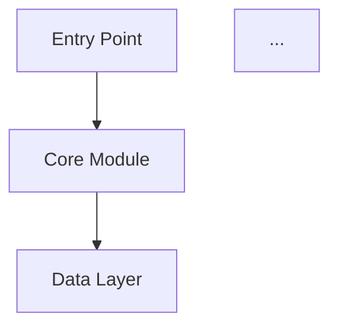
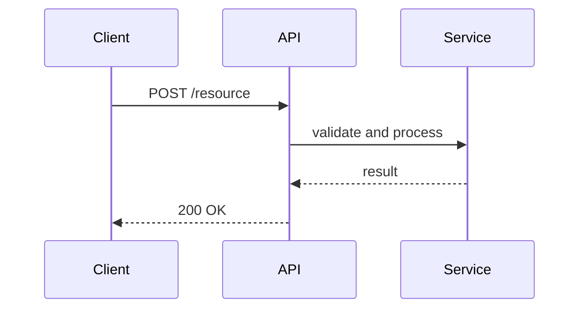

# Analyze Codebase

Perform a comprehensive analysis of this codebase and produce a structured report saved to the `/docs` directory.

## Steps

### 1. Determine the Current Version

- Locate the `CHANGELOG` file in the project root (try `CHANGELOG.md`, `CHANGELOG`, `HISTORY.md` in that order).
- Extract the most recent version tag from the changelog (e.g., `v0.9.0`). It is typically the first version heading in the file.
- If no changelog is found, check `package.json`, `pyproject.toml`, `Cargo.toml`, or equivalent manifest for a version field.
- If no version can be determined, use `vUnknown` as the directory name and note this in the report.

### 2. Resolve the Output Path

- Construct the output path: `<project_root>/docs/<version>/analysis.md`
- Example: `docs/v0.9.0/analysis.md`
- Create the directory if it does not exist.
- If the file already exists, overwrite it and note at the top of the report that it was regenerated with a timestamp.

### 3. Analyze the Codebase

Perform the analysis described below before writing anything. Collect all findings first, then write the report in a single pass.

Exclude the following from analysis:
- `node_modules/`, `vendor/`, `.venv/`, `dist/`, `build/`, `out/`
- Any generated files (check for headers like `// generated`, `# auto-generated`)
- Binary files and lock files (`package-lock.json`, `yarn.lock`, `poetry.lock`)
- The `/docs` directory itself

### 4. Write the Report

Write the file to the resolved output path using the structure defined below. Use valid Markdown throughout. Prefer Mermaid diagrams (fenced with ` ```mermaid `) for architecture, dependency, and sequence diagrams. Every structural or architectural claim must cite at least one supporting file path.

---

## Report Structure

The report must contain the following sections in order.

---

### Front Matter

```
# Codebase Analysis: <Project Name>

**Version**: <version>
**Generated**: <ISO 8601 timestamp>
**Regenerated**: <ISO 8601 timestamp> *(only if file previously existed)*
**Analyzer**: Claude Code — analyze-codebase command
```

---

### 1. Executive Summary

3-5 sentences covering: what this project does, what problem it solves, and its current state (active development, stable, legacy, experimental). A reader should know whether they are in the right place after reading this section alone.

---

### 2. Architecture Overview

High-level description of the architectural style (monolith, microservices, library, CLI, event-driven, etc.). Follow with a Mermaid diagram showing major components and their relationships.



Explain each component in 1-2 sentences beneath the diagram.

---

### 3. Technology Stack

A Markdown table with the following columns: Layer, Technology, Version (if determinable), Notes.

Layers to cover: runtime/language, frameworks, data storage, infrastructure, build tooling, testing, and any other significant dependency. Flag anything that is version-pinned for a non-obvious reason.

---

### 4. Project Structure

An annotated directory tree pruned to a meaningful depth (typically 2-3 levels). Do not simply list folders. Explain the *intent* and responsibility of each significant directory.

```
/
├── src/              # Application source — feature-based organization
│   ├── core/         # Domain logic; no framework dependencies
│   └── api/          # HTTP handlers and route definitions
├── tests/            # Mirrors src/ structure; unit and integration tests
...
```

State the organizational pattern explicitly (e.g., "This project uses a layered architecture with clear separation between domain logic in `core/` and infrastructure concerns in `infra/`").

---

### 5. Core Domain Model

The central entities, types, or data structures that define the vocabulary of the codebase. Include a Mermaid ER or class diagram if there are 3 or more related entities. Reference the files where these are defined.

A developer who understands this section should be able to read any other part of the codebase without being confused by terminology.

---

### 6. Key Workflows and Entry Points

List the primary entry points (e.g., `main()`, CLI commands, API route registrations, event listeners) with their file locations.

Then trace 2-4 of the most important end-to-end flows through the system. Use Mermaid sequence diagrams where the flow crosses more than two components.



---

### 7. Module and Dependency Map

Describe which modules depend on which, based on actual import analysis (not inferred from folder structure). Identify:

- High-coupling hotspots (modules imported by many others)
- Any circular dependencies detected
- Modules that are effectively utilities or shared infrastructure

Include a Mermaid graph if the dependency structure is non-trivial.

---

### 8. Configuration and Environment

How the application is configured: config files, environment variables, feature flags. Provide a table of environment variables with columns: Variable, Required, Default, Purpose. Note where secrets are expected to come from.

---

### 9. Testing Strategy

What test types exist (unit, integration, e2e, snapshot, etc.), where they live, and how to run them. Note any areas of the codebase that are conspicuously untested. If coverage data is available or can be inferred, include it.

---

### 10. Build, Run, and Deploy

Exact commands to go from a clean clone to a running instance. Distinguish between development and production modes. Summarize the CI/CD pipeline if one is present (check `.github/workflows/`, `.gitlab-ci.yml`, `Jenkinsfile`, etc.).

---

### 11. Known Complexity and Gotchas

The highest-value section. Document:

- Non-obvious design decisions and the reasoning behind them (if determinable from comments or commit messages)
- Areas of known technical debt (look for `TODO`, `FIXME`, `HACK`, `XXX` comments and summarize patterns)
- Things that look wrong but are intentional
- Historical quirks or legacy patterns still present

If no gotchas are found, say so explicitly rather than omitting the section.

---

### 12. Suggested Reading Order

For a developer who wants to get productive quickly: which files to read first, which best illustrate the dominant patterns, and which to defer until they have more context. Provide a short ordered list with a one-line rationale for each entry.

---

## Implementation Notes

These guidelines make the output significantly more useful:

- **Use static analysis, not just file reading.** Parse import/require statements to build the actual dependency graph rather than inferring it from folder structure. The structure often lies; the imports don't.
- **Weight sections by signal, not size.** A 50-line `core/domain/user.ts` might deserve more space than a 2,000-line generated file. Filter out generated, vendored, and build artifact paths before analysis.
- **Ground claims in evidence.** Every architectural assertion should cite the specific file or line that supports it. "The application uses an event-driven pattern (see `src/core/event-bus.ts:12`)" is far more trustworthy than a bare claim.
- **Flag confidence level.** If a section is inferred (e.g., "this appears to be the entry point because..."), say so. The report should be honest about the difference between what it found and what it concluded.

---

## Quality Checks

Before writing the file, verify the following:

- [ ] Every architectural claim is supported by a cited file path.
- [ ] All Mermaid diagrams use valid syntax (no undefined node references).
- [ ] The version string matches what was extracted from the changelog exactly.
- [ ] Generated, vendored, and build artifact files were excluded from analysis.
- [ ] The output path resolves to inside the project root (no path traversal).
- [ ] Sections that could not be populated (e.g., no tests found) say so explicitly rather than being omitted.

---

## Final Output

Confirm to the user:

1. The full path of the file that was written.
2. The version that was detected and how it was determined (which file, which field).
3. A one-line summary of each section and whether any sections required assumptions or had low confidence.
