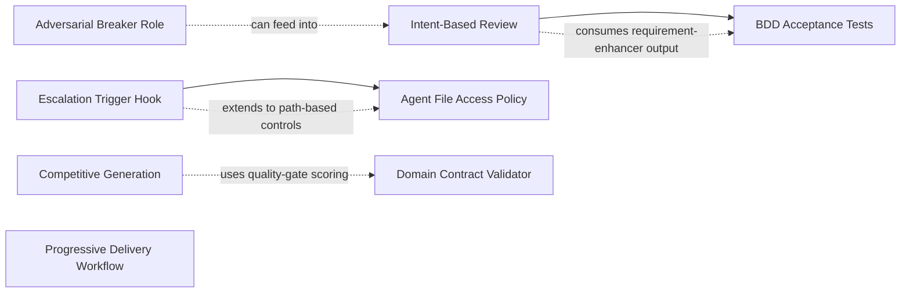

# Source Analysis: DevAI-Hub vs. "How to Kill the Code Review"

**Version**: 0.8.1
**Generated**: 2026-03-06T12:00:00Z
**Analyzer**: Claude Code -- compare-project command
**External Source**: https://www.latent.space/p/reviews-dead
**Source Type**: Web Article

---

## Section 1: Executive Summary

This report compares DevAI-Hub v0.8.1 against the Latent Space article "How to Kill the Code Review" by Ankit Jain (March 2, 2026), which proposes replacing traditional line-by-line code review with a 5-layer automated verification model for AI-generated code. From the article, 18 actionable insights were extracted spanning competitive agent generation, deterministic guardrails, BDD-style acceptance criteria, permission-based architecture, and adversarial verification. Of these, 4 are already implemented in DevAI-Hub, 8 are partially implemented, 5 are missing, and 1 is not applicable. The overall recommendation is **selective adoption**: DevAI-Hub's existing hook system and quality-gate infrastructure provide strong foundations for Layers 2 and 5, but Layers 1 (competitive generation), 3 (BDD acceptance tests), and 4 (file-level access controls) represent meaningful gaps that would strengthen DevAI-Hub's positioning as AI-generated code scales.

---

## Section 2: Source Overview

**Title**: How to Kill the Code Review
**Author**: Ankit Jain
**Publication**: Latent Space
**Date**: March 2, 2026
**Topic**: The future of code review in an AI-first development workflow

The article's central thesis is that traditional code review (line-by-line human inspection of diffs) cannot scale to AI-generated code volume: teams with high AI adoption merge 98% more PRs while review time increases 91%. Jain proposes a "Swiss Cheese" layered trust model with five verification layers (competitive generation, deterministic guardrails, BDD acceptance criteria, permission-based architecture, adversarial verification) that collectively catch alignment failures without requiring humans to read every line. The paradigm shifts from "Did you write this correctly?" to "Are we solving the right problem with the right constraints?"

---

## Section 3: Key Insights Extracted

### Overarching Thesis

| # | Insight | Article Section |
|---|---------|-----------------|
| I-01 | Replace line-by-line code review with layered automated verification for AI-generated code. | The Problem / The Solution |
| I-02 | Specs (not code) become the source of truth; review intent and acceptance criteria rather than implementation details. | Shift to Intent-Based Review |
| I-03 | Adopt "ship fast, observe everything, revert faster" as the operating model, replacing "review slowly, miss bugs anyway, debug in production". | What Changes About "Good Code" |

### Layer 1: Compare Multiple Options

| # | Insight | Article Section |
|---|---------|-----------------|
| I-04 | Deploy multiple agents with different approaches to the same task (competitive generation). | Layer 1: Compare Multiple Options |
| I-05 | Select the winning implementation by objective criteria: test passage rate, diff size minimization, dependency avoidance. | Layer 1: Compare Multiple Options |

### Layer 2: Deterministic Guardrails

| # | Insight | Article Section |
|---|---------|-----------------|
| I-06 | Define verification criteria before implementation begins (spec-first development). | Layer 2: Deterministic Guardrails |
| I-07 | Use custom linters to encode organization-wide invariants (e.g., no hardcoded credentials, naming conventions). | Layer 2: Deterministic Guardrails |
| I-08 | Enforce domain contracts as automated checks (type requirements, schema validation, business rule assertions). | Layer 2: Deterministic Guardrails |
| I-09 | All guardrails must produce deterministic pass/fail artifacts; agents cannot negotiate with failing checks. | Layer 2: Deterministic Guardrails |

### Layer 3: Humans Define Acceptance Criteria

| # | Insight | Article Section |
|---|---------|-----------------|
| I-10 | Write BDD-style specifications in natural language (Given/When/Then) and automate them as executable tests. | Layer 3: Humans Define Acceptance Criteria |
| I-11 | Humans write acceptance criteria only; never read implementation unless something fails. | Layer 3: Humans Define Acceptance Criteria |
| I-12 | Acceptance criteria (not the diff) become the primary review artifact. | Layer 3: Humans Define Acceptance Criteria |

### Layer 4: Permission Systems as Architecture

| # | Insight | Article Section |
|---|---------|-----------------|
| I-13 | Apply granular file-level access controls to AI agents: restrict which files and directories each agent can modify based on task scope. | Layer 4: Permission Systems as Architecture |
| I-14 | Define escalation triggers that automatically flag certain high-risk patterns: auth logic changes, database schema changes, new dependency additions, infrastructure config modifications. | Layer 4: Permission Systems as Architecture |

### Layer 5: Adversarial Verification

| # | Insight | Article Section |
|---|---------|-----------------|
| I-15 | Separate agent responsibilities architecturally: one agent codes, a second verifies independently, a third attempts to break the implementation. | Layer 5: Adversarial Verification |
| I-16 | The "breaker" agent specifically targets edge cases, security vulnerabilities, and contract violations in the implementation. | Layer 5: Adversarial Verification |
| I-17 | Verification results are independent artifacts (not annotations on the implementation); they stand alone for audit and review. | Layer 5: Adversarial Verification |

### Operational Model

| # | Insight | Article Section |
|---|---------|-----------------|
| I-18 | Instrument deployments with observability and automated rollback so regressions trigger revert without human intervention. | What Changes About "Good Code" |

---

## Section 4: Relevance Analysis

| # | Insight | Status | Evidence / Notes |
|---|---------|--------|-----------------|
| I-01 | Replace line-by-line review with layered verification | **Partially Implemented** | The `full-code-review` workflow (`workflows.json:9-19`) chains 6 skills in a structured pipeline (context-analysis, code-quality, security-review, performance-review, testing-review, final-report), which is a layered approach. However, each layer still performs line-by-line code inspection rather than checking verification artifacts. The paradigm shift (review outcomes, not lines) is not yet encoded. |
| I-02 | Specs as source of truth, not code | **Partially Implemented** | The `requirement-enhancer` skill (`catalog/skills/developer-experience/requirement-enhancer/SKILL.md`) generates Given/When/Then acceptance criteria. The `research-plan-implement` workflow (`workflows.json:179-191`) uses REQUEST.md as the contract and enforces GO/NO-GO gates. The `traceability-matrix-generator` skill maps requirements to code. However, no skill or workflow explicitly instructs agents to treat specs as the primary review artifact or skip code reading when all acceptance criteria pass. |
| I-03 | Ship fast, observe, revert faster | **Partially Implemented** | The `rollback-strategy-advisor` skill (`catalog/skills/infrastructure/rollback-strategy-advisor/SKILL.md`) covers revert planning. The `observability-setup` skill covers monitoring instrumentation. The `cd-pipeline-generator` skill generates deployment pipelines. However, no unified workflow chains deploy-observe-auto-revert as a single orchestrated pattern. |
| I-04 | Multiple agents generating competing solutions | **Missing** | The `cross-model-orchestrator` skill (`catalog/skills/orchestration/cross-model-orchestrator/SKILL.md:26-27`) assigns distinct roles (Planner, Implementer, Reviewer, Verifier) but does not instruct multiple agents to generate competing implementations of the same task. Competitive generation is a fundamentally different pattern from role-based orchestration. |
| I-05 | Objective selection criteria for competing implementations | **Missing** | The `quality-gate-definitions` skill (`catalog/skills/orchestration/quality-gate-definitions/SKILL.md:52-60`) defines criteria categories (Required, Optional, Automatic, Manual) for phase transitions, but not for comparing and selecting between alternative implementations. No scoring rubric exists for test passage rate, diff size, or dependency count as selection criteria. |
| I-06 | Define verification before implementation (spec-first) | **Already Implemented** | The `test-driven-development` skill (`catalog/skills/workflow/test-driven-development/SKILL.md`) enforces write-tests-first. The `research-plan-implement` workflow requires acceptance criteria in REQUEST.md before any implementation. The `quality-gate-definitions` skill (`catalog/skills/orchestration/quality-gate-definitions/SKILL.md:42-48`) places a Planning Gate between research and implementation phases, ensuring criteria are defined upfront. |
| I-07 | Custom linters as org-wide invariants | **Already Implemented** | The hooks system is production-ready: `secret-scan.sh` blocks hardcoded credentials on Write/Edit (`catalog/hooks/settings.json:16-19,30-33`), `git-guardrails.sh` blocks dangerous git commands on Bash (`catalog/hooks/settings.json:6-11`), `lint-on-write.sh` runs language-specific linters after every Write/Edit (`catalog/hooks/settings.json:44-47,54-57`), and `large-file-guard.sh` warns on oversized files (`catalog/hooks/settings.json:20-23`). |
| I-08 | Domain contracts as automated checks | **Partially Implemented** | The `behavior-preservation-checker` skill (`catalog/skills/code-review/behavior-preservation-checker/SKILL.md:28-31`) verifies interface contracts (method signatures, return types, exception contracts, side effects) during refactoring. The `quality-gate-definitions` skill supports domain-specific criteria. However, there is no dedicated skill for generating or enforcing business rule assertions as automated runtime checks (e.g., contract testing, invariant verification, schema validation beyond refactoring). |
| I-09 | Guardrails produce deterministic pass/fail artifacts | **Already Implemented** | All hooks use deterministic exit codes: `secret-scan.sh` and `git-guardrails.sh` exit 2 (block) on failure; `lint-on-write.sh` and `large-file-guard.sh` exit 0 with warnings. The `quality-gate-definitions` skill (`catalog/skills/orchestration/quality-gate-definitions/SKILL.md:56-60`) explicitly defines Required criteria as "Must pass for GO. No exceptions" and Automatic criteria as "Verified by a tool or command. No human needed". |
| I-10 | BDD specs automated as executable tests | **Missing** | The `requirement-enhancer` skill generates Given/When/Then acceptance criteria as text (`catalog/skills/developer-experience/requirement-enhancer/SKILL.md:35`), but does not automate them as executable BDD tests (Cucumber, pytest-bdd, SpecFlow). The `test-cases` skill generates test cases but not from BDD feature files. No skill covers BDD/Gherkin workflow. |
| I-11 | Humans only write acceptance criteria, never review code unless failure | **Missing** | No skill or workflow defines this delegation model explicitly. The `research-plan-implement` workflow uses REQUEST.md with acceptance criteria, but the `full-code-review` workflow still expects detailed implementation review. No workflow template reframes review as "check acceptance criteria pass/fail status only". |
| I-12 | Acceptance criteria as the primary review artifact | **Partially Implemented** | The `research-plan-implement` skill centers on REQUEST.md. The `traceability-matrix-generator` skill maps requirements to tests. However, the `full-code-review` workflow (`workflows.json:9-19`) still presents code as the primary review artifact, not acceptance criteria status. |
| I-13 | File-level access controls for agents | **Missing** | No skill, hook, or template configures which files an agent is allowed to modify. The hooks system (`catalog/hooks/settings.json`) operates on tool types (Bash, Write, Edit) not file path restrictions. Claude Code natively supports path-based permissions in `.claude/settings.json`, but DevAI-Hub provides no skill or template for configuring these. |
| I-14 | Escalation triggers for sensitive changes | **Partially Implemented** | `git-guardrails.sh` blocks dangerous git commands. `secret-scan.sh` blocks secrets in writes. However, no hook or skill triggers escalation when an agent modifies auth logic, database schemas, dependency manifests (package.json, requirements.txt, go.mod), or infrastructure configuration (Dockerfiles, Terraform, CI pipelines). The `component-boundary-identifier` skill identifies boundaries but does not enforce access or trigger escalation. |
| I-15 | Separate coder/verifier/breaker agent roles | **Partially Implemented** | The `cross-model-orchestrator` skill (`catalog/skills/orchestration/cross-model-orchestrator/SKILL.md:54-57`) defines four roles: Planner, Implementer, Reviewer, Verifier. This covers coder and verifier separation. However, the "breaker" role (an adversarial agent that actively tries to break the implementation) is absent from the role taxonomy. |
| I-16 | Breaker agent targets edge cases, security holes, contract violations | **Partially Implemented** | Individual skills exist for each concern: `edge-case-generator`, `fuzzing-input-generator`, `exploitability-analyzer`, `security-review`. However, these are not assembled into a single "adversarial breaker" agent role or workflow that specifically tries to break another agent's implementation. They operate independently, not as a coordinated adversarial check. |
| I-17 | Verification results as independent artifacts | **Already Implemented** | The `cross-model-orchestrator` produces PLAN.md, REVIEW.md, PROGRESS.md, and VERIFY.md as independent artifacts at each phase. The `research-plan-implement` skill produces artifact files at each gate. The `quality-gate-definitions` skill includes reporting templates for gate outcomes and audit trails. |
| I-18 | Observability + automated rollback | **Not Applicable** | Automated rollback triggers are a runtime concern beyond a static skill library's scope. DevAI-Hub covers the instructional side: the `observability-setup` skill defines monitoring patterns, and the `rollback-strategy-advisor` skill covers revert planning including automated trigger conditions. Actual runtime implementation depends on the deployment platform. |

### Summary

| Status | Count | Insights |
|--------|-------|----------|
| Already Implemented | 4 | I-06, I-07, I-09, I-17 |
| Partially Implemented | 8 | I-01, I-02, I-03, I-08, I-12, I-14, I-15, I-16 |
| Missing | 5 | I-04, I-05, I-10, I-11, I-13 |
| Not Applicable | 1 | I-18 |

---

## Section 5: Adoption Plan

### P0: Immediate (High Value, Low-Medium Effort)

| What to Adopt | Source (Article Section) | Target (Project Location) | Effort | Dependencies | Risk |
|--------------|------------------------|--------------------------|--------|--------------|------|
| **Intent-Based Review Workflow**: New skill and workflow that reviews acceptance criteria pass/fail status rather than reading implementation line-by-line. When all acceptance criteria pass, the review is complete; line-by-line review is triggered only for failed criteria. | Shift to Intent-Based Review; Layer 3 (I-01, I-02, I-11, I-12) | New skill: `catalog/skills/code-review/intent-based-review/SKILL.md`; New workflow: `intent-based-code-review` in `workflows.json` | Medium: new skill (~300 lines) + workflow entry + update existing full-code-review docs to reference alternative | Depends on existing `requirement-enhancer` skill output format (Given/When/Then) and `quality-gate-definitions` for gate structure | Low. Positioned as a complement to (not replacement for) the existing `full-code-review` workflow. No breaking changes. |

### P1: Short-Term (High Value, Medium Effort)

| What to Adopt | Source (Article Section) | Target (Project Location) | Effort | Dependencies | Risk |
|--------------|------------------------|--------------------------|--------|--------------|------|
| **BDD Acceptance Test Generator**: Skill that takes Given/When/Then acceptance criteria from `requirement-enhancer` output and generates executable BDD test files (pytest-bdd for Python, Cucumber.js for JavaScript). | Layer 3: Humans Define Acceptance Criteria (I-10) | New skill: `catalog/skills/tests-generation/bdd-acceptance-tests/SKILL.md` | Medium: new skill (~400 lines) covering two language ecosystems, with templates for feature files and step definitions | Consumes output from `requirement-enhancer` skill; integrates with `test-structure` skill for project setup | Medium. BDD ecosystem is fragmented; start with Python + JavaScript only. Users may expect more languages. |
| **Escalation Trigger Hook**: Hook that inspects Write/Edit targets and warns (or blocks) when files match sensitive path patterns: auth modules, migration files, dependency manifests, infrastructure config. | Layer 4: Permission Systems as Architecture (I-14) | New hook: `catalog/hooks/escalation-trigger.sh`; Update: `catalog/hooks/settings.json` PreToolUse section | Low: shell script (~80 lines) with configurable path patterns + settings.json entry | None; standalone hook | Low. Advisory by default (warn, not block). Users configure blocking behavior per project. |
| **Adversarial Breaker Agent Role**: New skill defining the "breaker" agent that actively tries to break another agent's implementation by generating adversarial inputs, edge cases, and attack vectors. Produces ADVERSARIAL-REPORT.md as an independent artifact. | Layer 5: Adversarial Verification (I-15, I-16) | New skill: `catalog/skills/orchestration/adversarial-verifier/SKILL.md`; Update: `cross-model-orchestrator` SKILL.md to add fifth "Breaker" role | Medium: new skill (~350 lines) + minor update to existing orchestrator skill | Integrates with existing `edge-case-generator`, `fuzzing-input-generator`, `exploitability-analyzer` skills as sub-techniques | Medium. Breaker quality depends on LLM capability. Skill should include "verification of the verifier" step (breaker must produce a failing test for each claim). |
| **Agent File Access Policy**: Skill providing templates and configuration snippets for restricting which files/directories an agent can modify, using Claude Code's native path-based permissions. Includes example configurations for common scenarios (frontend-only, backend-only, read-only reviewer). | Layer 4: Permission Systems as Architecture (I-13) | New skill: `catalog/skills/orchestration/agent-access-policy/SKILL.md` | Low: template-focused skill (~250 lines) providing `.claude/settings.json` snippets | None; uses Claude Code's native permission system | Low. Purely instructional; no runtime enforcement beyond what Claude Code already provides. |

### P2: Medium-Term (Medium Value, Medium Effort)

| What to Adopt | Source (Article Section) | Target (Project Location) | Effort | Dependencies | Risk |
|--------------|------------------------|--------------------------|--------|--------------|------|
| **Competitive Multi-Agent Generation**: Skill instructing users to run N agents in parallel on the same task, collect outputs, and select the winner using a scoring rubric (test pass rate, diff size, new dependency count, lint score, complexity). | Layer 1: Compare Multiple Options (I-04, I-05) | New skill: `catalog/skills/orchestration/competitive-generation/SKILL.md`; New workflow: `competitive-implementation` in `workflows.json` | Medium: new skill (~350 lines) with scoring rubric template and COMPARISON.md artifact format | Integrates with `quality-gate-definitions` for scoring criteria and `cross-model-orchestrator` for multi-model setup | Medium. Token cost multiplied by N agents. Skill should include cost estimation guidance and recommend this only for high-risk/high-value changes. |
| **Domain Contract Validator**: Skill covering how to define and enforce business rule assertions as automated checks (contract testing, schema validation, invariant verification) beyond refactoring contexts. | Layer 2: Deterministic Guardrails (I-08) | New skill: `catalog/skills/testing/domain-contract-validator/SKILL.md` | Medium: new skill (~300 lines) covering contract testing patterns across Python, JavaScript, and Java | Can reference `behavior-preservation-checker` for contract checking techniques; extends beyond refactoring scope | Low. Complements existing skills without overlap. |

### P3: Backlog (Medium Value, High Effort)

| What to Adopt | Source (Article Section) | Target (Project Location) | Effort | Dependencies | Risk |
|--------------|------------------------|--------------------------|--------|--------------|------|
| **Progressive Delivery Workflow**: Workflow chaining cd-pipeline-generator, observability-setup, and rollback-strategy-advisor into a single deploy-observe-revert pattern with quality gates for canary analysis and automated rollback triggers. | What Changes About "Good Code" (I-03, I-18) | New workflow: `progressive-delivery` in `workflows.json` | High: requires careful integration of three existing skills into a coherent workflow with new gate definitions for canary analysis | Depends on `cd-pipeline-generator`, `observability-setup`, `rollback-strategy-advisor` skills | Medium. Runtime execution depends entirely on deployment platform; skill can only provide instructional templates, not actual automated rollback. |

---

## Section 6: Implementation Sequence

### Phase A: Foundation (target v0.9.0)

```
1. Intent-Based Review Workflow (P0)
   - Create catalog/skills/code-review/intent-based-review/SKILL.md
   - Add "intent-based-code-review" workflow to workflows.json
   - Update full-code-review workflow docs to reference the alternative

2. BDD Acceptance Test Generator (P1)
   - Create catalog/skills/tests-generation/bdd-acceptance-tests/SKILL.md
   - Cover Python (pytest-bdd) and JavaScript (Cucumber.js) initially

3. Escalation Trigger Hook (P1)
   - Create catalog/hooks/escalation-trigger.sh
   - Add to catalog/hooks/settings.json PreToolUse section
```

### Phase B: Differentiation (target v0.9.1 or v0.10.0)

```
4. Adversarial Breaker Agent Role (P1)
   - Create catalog/skills/orchestration/adversarial-verifier/SKILL.md
   - Update cross-model-orchestrator SKILL.md to add "Breaker" as fifth role

5. Agent File Access Policy (P1)
   - Create catalog/skills/orchestration/agent-access-policy/SKILL.md
   - Include .claude/settings.json template snippets for common scenarios

6. Competitive Multi-Agent Generation (P2)
   - Create catalog/skills/orchestration/competitive-generation/SKILL.md
   - Add "competitive-implementation" workflow to workflows.json
```

### Phase C: Polish (target v0.10.x)

```
7. Domain Contract Validator (P2)
   - Create catalog/skills/testing/domain-contract-validator/SKILL.md

8. Progressive Delivery Workflow (P3)
   - Add "progressive-delivery" workflow to workflows.json
```

### Dependency Graph



---

## Section 7: Risks and Considerations

### Risk 1: Scope Creep into Runtime Territory

**Severity**: High
**Details**: Several article insights (I-04 competitive generation, I-13 file access controls, I-18 automated rollback) describe runtime orchestration behavior. DevAI-Hub is a static skill and instruction library, not a runtime platform. Users may expect DevAI-Hub to execute these patterns, not just describe them.
**Mitigation**: Frame all new skills explicitly as "workflow templates and instructions". Provide copy-paste configuration snippets (e.g., `.claude/settings.json` for access controls, CI/CD pipeline definitions for automated rollback) where the hosting platform supports it natively. Include clear scope statements in each skill's "What This Skill Does" section.

### Risk 2: BDD Ecosystem Fragmentation

**Severity**: Medium
**Details**: A BDD skill must support multiple testing frameworks (Cucumber, pytest-bdd, SpecFlow, Behave, RSpec) across DevAI-Hub's 7 supported languages. This creates a large surface area and maintenance burden.
**Mitigation**: Start with Python (pytest-bdd) and JavaScript (Cucumber.js) only, matching the most common user stacks. Add languages incrementally based on demand. The skill should provide a generic Given/When/Then template format that is framework-agnostic, with language-specific examples as appendices.

### Risk 3: Adversarial Verifier Quality

**Severity**: Medium
**Details**: The "breaker" agent role depends on the LLM's ability to genuinely find bugs, not just generate plausible-sounding attack scenarios. Without validation, the skill could produce false confidence.
**Mitigation**: The adversarial-verifier skill should include a mandatory "verification of the verifier" step: every claimed vulnerability must be accompanied by a concrete failing test. If the test passes (meaning the "vulnerability" does not exist), the finding is automatically demoted. This creates a self-checking loop.

### Risk 4: File Access Policy Enforcement Limitations

**Severity**: Medium
**Details**: Claude Code's native permission system has specific capabilities and limitations. A hook-based approach may not cover all tool types (e.g., Bash commands that write files via redirection) and could be bypassable.
**Mitigation**: Document the limitations clearly. Position the hook as an advisory layer and encourage users to also configure Claude Code's native `permissions` in `.claude/settings.json` as the enforcement layer. The skill provides templates for both approaches and explains when each is appropriate.

### Risk 5: Intent-Based Review Adoption Resistance

**Severity**: Low
**Details**: Teams accustomed to line-by-line code review may resist the paradigm shift to intent-based review, perceiving it as "less thorough" or "skipping review".
**Mitigation**: Position the intent-based review workflow as a complement, not a replacement. The existing `full-code-review` workflow remains available for human-authored code or high-risk changes. The intent-based workflow is recommended specifically for AI-generated code where volume makes line-by-line review impractical. Include a "When to Use Which" decision guide in the skill documentation.

### Risk 6: Competitive Generation Token Cost

**Severity**: Low
**Details**: Running N agents in parallel multiplies token costs by N. This may be impractical for users on limited API budgets or with rate-limited subscriptions.
**Mitigation**: Include cost estimation guidance in the competitive-generation skill. Recommend competitive generation only for high-risk or high-value changes (not routine tasks). Suggest using cost-efficient models (Sonnet, Codex) for the competitive generation phase and reserving expensive models (Opus) for the selection and verification phase.

### Insights Explicitly Not Recommended for Adoption

- **I-18 (Automated rollback triggers)**: While DevAI-Hub already covers observability and rollback planning as instructional skills, implementing actual automated rollback is a runtime platform concern that falls outside the project's scope. The existing `rollback-strategy-advisor` and `observability-setup` skills adequately cover the instructional component.
