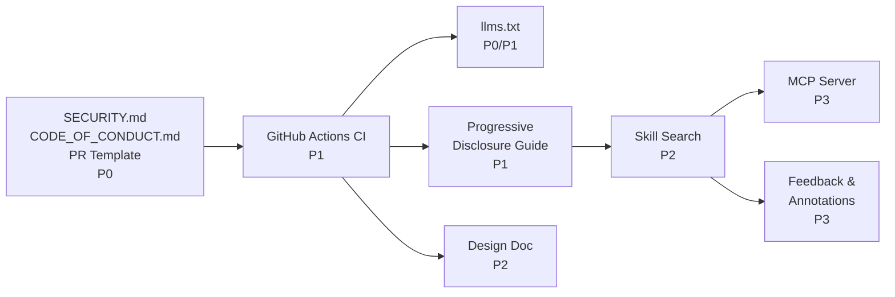

# Cross-Project Comparison: DevAI-Hub vs. Context Hub

**Version**: v0.8.2
**Generated**: 2026-03-06T00:00:00Z
**Analyzer**: Claude Code -- compare-project command
**External Source**: https://github.com/andrewyng/context-hub
**Source Type**: Repository

---

## Section 1: Executive Summary

DevAI-Hub (v0.8.2) and Context Hub (v0.1.1) are both designed to augment AI coding assistants with curated content and structured workflows, but they address this problem from fundamentally different angles. DevAI-Hub is a local-first skill and workflow library (134 skills, 17 categories, 21 commands) focused on behavioral instructions and code-quality automation, while Context Hub is a distributed API documentation registry (103+ services, npm CLI, CDN-backed) focused on giving agents accurate, versioned third-party API knowledge at fetch time.

The comparison yields **10 adoption candidates** from context-hub: 3 P0 quick wins (SECURITY.md, llms.txt, PR template), 3 P1 medium-effort improvements (GitHub Actions CI, progressive disclosure skill pattern, CODE_OF_CONDUCT.md), 2 P2 investments (skill search/discovery, enriched design documentation), and 2 P3 backlog items (MCP server, feedback/annotations system).

The overall recommendation is **selective adoption**: the two projects are largely complementary rather than redundant, and the highest-value gains are lightweight governance and CI hygiene files that DevAI-Hub is currently missing. The MCP server is the single highest long-term value investment but requires significant architectural work. DevAI-Hub's depth of skills, compliance coverage, multi-platform support, and toolchain are all strengths that context-hub does not attempt to match.

---

## Section 2: Project Profiles

| Property | DevAI-Hub | Context Hub |
|---|---|---|
| **Name** | DevAI-Hub | Context Hub (`@aisuite/chub`) |
| **Author** | Benjamin Dourthe ([benjamin.dourthe@gmail.com](mailto:benjamin.dourthe@gmail.com)) | andrewyng (Andrew Ng) |
| **Version** | v0.8.2 | v0.1.1 |
| **License** | (not specified in repo root) | MIT |
| **Purpose** | Modular behavioral skill + workflow library for AI coding assistants (Claude Code, Gemini, Copilot, Codex) | Curated, versioned API documentation registry for AI coding agents |
| **Core Value Prop** | "Turn a generic AI into a Senior Engineer" via behavioral rules, skills, and workflows | "Coding agents hallucinate APIs — give them curated, versioned docs that get smarter with use" |
| **Distribution** | Cross-platform PS1/Bash installers (no runtime required) | npm package (`npm install -g @aisuite/chub`), Node.js 18+ required |
| **Scale** | 134 skills, 21 commands, 17 workflows, 321 templates | 103+ API doc sets, 1 installable skill |
| **AI Platform Support** | Claude Code, Gemini, GitHub Copilot, Codex/AGENTS.md | Claude Code, Cursor, 30+ agent platforms |
| **Maturity** | Active development, ~30+ releases (v0.1.0 → v0.8.2) | Early stage, few releases (v0.1.1) |
| **Stars / Forks** | N/A (private or early public) | 257 stars, 30 forks |
| **Primary Audience** | Enterprise developer teams; cross-platform AI users | Individual developers using AI coding agents |

---

## Section 3: Technology Stack Comparison

| Layer | DevAI-Hub | Context Hub | Notes |
|---|---|---|---|
| **Primary Language** | PowerShell, Bash, Python, Markdown | JavaScript (Node.js ES modules) | Fundamentally different runtimes |
| **Secondary Language** | TypeScript (VS Code extension) | None | |
| **Runtime Requirement** | None (Markdown/shell) | Node.js 18+ | DevAI-Hub has lower barrier to entry |
| **Package Manager** | pip (report generator only), npm (extension only) | npm (core tool) | |
| **Distribution** | PS1/Bash installers, .vsix extension | npm package `@aisuite/chub` | |
| **Build System** | None (distribution project) | None (pure JS, no compilation) | |
| **Test Framework** | Manual dry-run, pre-commit hooks | Vitest (e2e tests, coverage) | Context-hub has formal test suite |
| **Linting / Format** | `.pre-commit-config.yaml` (7 hooks) | npm audit (security only) | DevAI-Hub has broader linting coverage |
| **CI/CD** | Pre-commit hooks (local only) | GitHub Actions (3 workflows) | Context-hub enforces checks on PRs |
| **Content Format** | Markdown with YAML frontmatter | Markdown with YAML frontmatter | Identical content format |
| **AI Config Format** | `.claude/`, `.gemini/`, `AGENTS.md` | `cli/skills/get-api-docs/SKILL.md` | DevAI-Hub supports more platforms |
| **Metadata Catalogs** | `skills.json`, `workflows.json`, `bundles.json` | `registry.json` (CDN-hosted) | Different distribution models |
| **Data Access Pattern** | Local filesystem (installer copies files) | CDN + local cache (`~/.chub/`) | Context-hub fetches on demand |

---

## Section 4: AI Assistant Configuration Comparison

| Dimension | DevAI-Hub | Context Hub |
|---|---|---|
| **Claude Code support** | Full: `.claude/skills/`, `.claude/commands/`, hooks, context, memory | Partial: one skill (`get-api-docs`) installable to `.claude/skills/` |
| **Gemini support** | Full: `.gemini/skills/`, `.gemini/antigravity/global_workflows`, base template | None |
| **Copilot support** | Full: language-specific `.github/copilot-instructions.md` templates + snippets | None |
| **Codex / AGENTS.md** | Full: `base-codex.md` template | None |
| **Cursor support** | Via AGENTS.md | Yes: skill installable to `.cursor/rules/` |
| **Hooks** | 10 runtime hooks (PreToolUse, PostToolUse, Stop) | None |
| **Skill count** | 134 skills across 17 categories | 1 installable skill |
| **Commands** | 21 slash commands | 0 slash commands (CLI commands, not agent slash commands) |
| **Workflows** | 17 goal-based workflows | 0 (implicit via `get-api-docs` skill workflow) |
| **Bundles** | 11 role-based bundles | None |
| **Context files** | `.claude/context/architecture.md` | None (content is in CDN registry) |
| **Memory files** | `.claude/memory/decisions.md` | Annotations at `~/.chub/annotations/` (user-level, not project-level) |
| **Instruction templates** | 3 base templates (Claude, Gemini, Codex) + 7 language variants | None (skill-based only) |
| **MCP server** | None | Full MCP server (`chub-mcp`) with 5 tools |
| **Progressive disclosure** | No (skills are monolithic Markdown files) | Yes (entry point + on-demand `/references/` files) |

**Verdict**: DevAI-Hub has dramatically deeper AI assistant configuration depth. Context-hub's advantage is its MCP server (programmatic IDE integration) and progressive disclosure (token-efficient content delivery), both of which DevAI-Hub lacks.

---

## Section 5: Skills and Capabilities Gap Analysis

### 5a. Present in Context Hub, Missing in DevAI-Hub (Adoption Candidates)

| Capability | Context Hub Implementation | Potential DevAI-Hub Equivalent | Priority |
|---|---|---|---|
| **MCP server** | `cli/src/mcp/server.js` — 5 tools: `chub_search`, `chub_get`, `chub_list`, `chub_annotate`, `chub_feedback` | New `extensions/mcp-server/` exposing skill catalog search and retrieval | P3 |
| **Progressive disclosure** | Entry-point files (≤500 lines) + `/references/` companion files fetched with `--file` or `--full` | New convention in `catalog/skills/` for large skills; existing `agents/` subdirectory could serve as companion | P1 |
| **Feedback / ratings** | `chub feedback <id> up/down --label accurate/outdated/...` command; votes sent to authors | Add rating metadata field to `skills.json` + `/feedback` slash command | P3 |
| **Annotations / persistent notes** | `chub annotate <id> "note"` — local, per-machine, auto-appended on next `get` | Not directly applicable (DevAI-Hub skills are installed locally already); partial overlap with `.claude/memory/decisions.md` | Not applicable as-is |
| **Versioned API documentation** | 103+ service-specific API doc sets with language/version variants | Not in scope (different content type); DevAI-Hub focuses on behavioral skills, not API reference | Not applicable |
| **Search/discovery** | BM25 full-text search: `chub search "stripe"` with tag/lang filtering, `--json` output | Enhance `/import-skills` command or add new `/search-skills` command reading `skills.json` | P2 |
| **Multi-source/private registry** | `~/.chub/config.yaml` sources: list of CDN + local paths; trust levels; ID collision disambiguation | Not applicable at current scale; DevAI-Hub is local-first | P3 (backlog) |
| **`llms.txt`** | `llms.txt` in repo root — LLM-optimized project metadata (CLI reference format) | Add `llms.txt` to DevAI-Hub repo root | P0 |
| **SECURITY.md** | `SECURITY.md` — vulnerability reporting via GitHub Issues (label `security`), 7-day SLA | Add `SECURITY.md` to repo root | P0 |
| **CODE_OF_CONDUCT.md** | Contributor Covenant 2.0 | Add `CODE_OF_CONDUCT.md` to repo root | P1 |
| **PR template** | `.github/PULL_REQUEST_TEMPLATE.md` — What / Why / Testing checklist | Add `.github/PULL_REQUEST_TEMPLATE.md` | P0 |
| **GitHub Actions CI** | `.github/workflows/ci.yml` — runs tests, build validation, and audit on every push/PR | Add `.github/workflows/ci.yml` running `pre-commit run --all-files` + catalog JSON validation | P1 |

### 5b. Present in DevAI-Hub, Missing in Context Hub (Strengths to Preserve)

| Capability | DevAI-Hub Implementation | Notes |
|---|---|---|
| **134 behavioral skills** | `catalog/skills/` — 17 categories covering architecture, testing, security, compliance, DX, etc. | Core differentiator; context-hub has 1 skill |
| **21 slash commands** | `catalog/commands/` — agent-invocable workflows | Context-hub has CLI commands, not agent slash commands |
| **17 goal-based workflows** | `workflows.json` — chains multiple skills for common objectives | No equivalent in context-hub |
| **11 role-based bundles** | `bundles.json` — curated collections by developer role | No equivalent |
| **10 runtime hooks** | `catalog/hooks/` — secret scanning, git guardrails, auto-format, usage display | Context-hub has no hooks |
| **Multi-platform support** | Claude Code, Gemini, Copilot, Codex | Context-hub officially supports Claude Code + Cursor |
| **321 AI instruction templates** | `templates/` — base templates + 7 language variants | Context-hub has no instruction templates |
| **Compliance skills** | 9 frameworks: SOC2, GDPR, ISO27001, ISO42001, NIST AI RMF, PCI-DSS, CCPA | No equivalent |
| **VS Code extension** | Claude Usage Monitor — real-time status bar, dashboard, model-switching recommendations | Context-hub has no VS Code extension |
| **Cross-platform installers** | PS1 v9 (Windows) + Bash v9 (macOS/Linux) — no runtime required | Context-hub requires Node.js 18+ |
| **Report generator** | `scripts/generate_report.py` — Word/PowerPoint from Markdown | No equivalent |
| **DEVLOG.md** | 31KB development log with per-release goals and verification | Context-hub has no equivalent |
| **CONTRIBUTING.md** | 12.6KB with clear submission guidelines | Context-hub has CONTRIBUTING.md but shorter/less detailed |

### 5c. Present in Both, Quality Comparison

| Dimension | DevAI-Hub | Context Hub | Winner |
|---|---|---|---|
| **Skill format** | YAML frontmatter + phased Markdown, `agents/` subdirectory | YAML frontmatter + simple Markdown instructions | Tie (different use cases) |
| **Content guide** | No explicit "how to write a skill" doc (only CONTRIBUTING.md) | `docs/content-guide.md` (6.7KB) with format spec, examples, best practices | Context Hub |
| **Design documentation** | No `design.md` or architecture rationale doc | `docs/design.md` (26KB) documenting every design decision with rationale | Context Hub |
| **README quality** | 5KB with quick start, features table, usage monitoring | Concise README with clear problem statement and 30-second quick start | Context Hub (clearer problem framing) |
| **CHANGELOG** | 96KB comprehensive history (v0.1.0 → v0.8.2) | Minimal / not present in repo root | DevAI-Hub |
| **Security tooling** | 9 security skills + secret-scan hook + git-guardrails | SECURITY.md + npm audit in CI | DevAI-Hub |
| **Pre-commit hooks** | `.pre-commit-config.yaml` (7 hooks) | None | DevAI-Hub |
| **CONTRIBUTING.md** | 12.6KB with detailed guidelines | CONTRIBUTING.md (shorter, clear) | DevAI-Hub (more thorough) |

---

## Section 6: Commands and Automation Comparison

### 6a. Commands Gap

| | DevAI-Hub | Context Hub |
|---|---|---|
| **Slash commands** | 21 agent-invocable slash commands (`/analyze-codebase`, `/review-codebase`, `/generate-tests`, etc.) | None (context-hub provides CLI commands, not agent slash commands) |
| **CLI commands** | No standalone CLI; installer is one-time setup | 7 CLI commands (`search`, `get`, `annotate`, `feedback`, `update`, `cache`, `build`) |
| **Search** | None for skills discovery at runtime | `chub search` with BM25 + tag filtering |
| **On-demand fetch** | Skills installed locally once by installer | `chub get <id>` fetches on demand with caching |
| **Build / validation** | `pre-commit run --all-files` validates catalog | `chub build --validate-only` validates content |
| **JSON output** | Not available | `--json` flag on all commands for structured output |
| **Feedback** | None | `chub feedback <id> up/down --label ...` |
| **Annotation** | None | `chub annotate <id> "note"` |

**Gap**: DevAI-Hub lacks any runtime search or discovery mechanism for its skills. A user wanting to know what skills are available must browse `skills.json` or the catalog directory. Adding a search-capable `/import-skills` enhancement or new `/search-skills` command would close this gap.

### 6b. CI/CD and Hooks Gap

| | DevAI-Hub | Context Hub |
|---|---|---|
| **Pre-commit hooks** | `.pre-commit-config.yaml` with 7 hooks (linting, YAML validation, catalog builds, trailing whitespace, LF normalization) | None |
| **GitHub Actions** | None | 3 workflows: `ci.yml` (test matrix), `deploy-content.yml` (content deployment), `publish.yml` (npm release) |
| **PR enforcement** | No automated checks on PRs; relies on contributors running pre-commit locally | CI runs on every PR; tests + build validation + security audit required to pass |
| **Security audit in CI** | Not automated | `npm audit --audit-level=high` in CI |
| **Release automation** | Manual (version upgrade via `/update-version` skill) | `publish.yml` automates npm package publishing |

**Gap**: DevAI-Hub's pre-commit hooks are excellent for local enforcement but provide no PR-level guardrails. A GitHub Actions workflow that runs `pre-commit run --all-files` (and optionally validates `skills.json`/`workflows.json` integrity) would bring parity with context-hub's CI posture without requiring Node.js.

**DevAI-Hub Strength**: Runtime hooks (secret scanning, git guardrails, auto-format) run inside Claude Code sessions — a capability context-hub does not address.

---

## Section 7: Documentation and Developer Experience Comparison

| Dimension | DevAI-Hub | Context Hub |
|---|---|---|
| **README** | 5KB; strong on features and quick start; somewhat technical | Concise (1KB); sharp problem framing; clear "how it works" diagram |
| **Architecture / Design doc** | No design.md; `.claude/context/architecture.md` does not exist (file not found) | `docs/design.md` (26KB): every design decision documented with rationale and alternatives considered |
| **CLI / Command reference** | No dedicated reference doc | `docs/cli-reference.md` (6.2KB) |
| **Content contribution guide** | CONTRIBUTING.md covers process but not skill-writing format | `docs/content-guide.md` (6.7KB) with frontmatter spec, markdown best practices, examples |
| **Feedback / annotations guide** | None | `docs/feedback-and-annotations.md` (3.9KB) |
| **Setup / onboarding** | One-click installers (PS1/Bash); drag-and-drop folder picker | `npm install -g @aisuite/chub`; first-run auto-downloads registry |
| **Guides directory** | 7 guides (52KB CLAUDE_CODE_GUIDE, CLI reference, settings reference, subagents, MCP, contributing) | No equivalent; information is in docs/ and README |
| **Security policy** | None | `SECURITY.md` with reporting instructions and SLA |
| **Code of conduct** | None | `CODE_OF_CONDUCT.md` (Contributor Covenant 2.0) |
| **Changelog** | CHANGELOG.md (96KB, v0.1.0 → v0.8.2) | Not present |
| **DEVLOG** | DEVLOG.md (31KB) with per-release goals and verification | Not present |
| **PR template** | None | `.github/PULL_REQUEST_TEMPLATE.md` (What / Why / Testing checklist) |
| **Issue templates** | Not present | `.github/ISSUE_TEMPLATE/` |
| **llms.txt** | None | `llms.txt` — structured CLI reference in LLM-friendly format |

**Key Gaps for DevAI-Hub**: SECURITY.md, CODE_OF_CONDUCT.md, PR template, llms.txt, and a design/architecture rationale document are all present in context-hub and absent from DevAI-Hub. The design.md pattern is particularly notable — it explains the "why" behind architectural decisions and would improve contributor alignment and onboarding quality.

---

## Section 8: Testing and Security Posture Comparison

### Testing

| Dimension | DevAI-Hub | Context Hub |
|---|---|---|
| **Test framework** | Manual dry-run (no automated test runner) | Vitest (e2e suite + coverage + watch mode) |
| **Test coverage** | No quantitative coverage | e2e tests in `cli/test/e2e.test.js` (11.6KB) with fixtures for docs, skills, multi-language |
| **CI test execution** | None (pre-commit hooks are local only) | Tests run on Node 18, 20, 22 in GitHub Actions on every push/PR |
| **Content validation** | `pre-commit run --all-files` validates YAML frontmatter and JSON catalogs | `chub build --validate-only` validates frontmatter without generating output |
| **Relevant DevAI-Hub skills** | 17 testing skills (unit-tests, e2e-testing-automation, mutation-testing, etc.) | None — context-hub has no testing skills |

**Assessment**: Context-hub has a real test suite for its JavaScript code; DevAI-Hub is a Markdown/shell distribution project where formal unit tests would have limited applicability. The meaningful gap is **CI enforcement**: context-hub blocks broken PRs, DevAI-Hub does not.

### Security

| Dimension | DevAI-Hub | Context Hub |
|---|---|---|
| **Runtime secret scanning** | `catalog/hooks/secret-scan.sh` — runs on every Write/Edit (PreToolUse hook) | None |
| **Git guardrails** | `catalog/hooks/git-guardrails.sh` — prevents destructive git commands | None |
| **Dependency audit** | No automated audit | `npm audit --audit-level=high` in CI |
| **Security skills** | 7 skills: dependency-security-audit, cve-reachability-analyzer, exploitability-analyzer, security-patch-advisor, authentication-patterns, licensing-compliance-check, pre-commit-checklist | None |
| **Compliance skills** | 9 frameworks: SOC2, GDPR, ISO27001, ISO42001, NIST AI RMF, PCI-DSS, CCPA, AI governance, traceability matrix | None |
| **Security policy** | None | `SECURITY.md` with responsible disclosure instructions and 7-day SLA |
| **Data privacy** | OAuth token stored in `~/.claude/.credentials.json` (usage monitor); no telemetry | Optional anonymous telemetry; config opt-out via `telemetry: false` in `~/.chub/config.yaml` |
| **Large file guard** | `catalog/hooks/large-file-guard.sh` (PreToolUse on Write) | None |

**Assessment**: DevAI-Hub has dramatically stronger security tooling (7 security skills, 9 compliance skills, runtime hooks). The only gap is a formal **SECURITY.md** vulnerability reporting policy, which context-hub has and DevAI-Hub lacks.

---

## Section 9: Structural and Architectural Differences

**Content Model**: The most fundamental architectural difference is the content distribution model. DevAI-Hub uses a "local-first install" model: content is copied to the user's filesystem once by the installer and remains static until manually updated. Context-hub uses an "on-demand fetch" model: content lives on a CDN and is retrieved as needed, ensuring agents always use current documentation. These are different trade-offs — DevAI-Hub prioritizes zero-runtime-dependency simplicity; context-hub prioritizes freshness and minimal initial footprint.

**Content Type Philosophy**: Context-hub draws a sharp distinction between "docs" (factual reference, large, language/version-variant) and "skills" (behavioral instructions, small, language-agnostic). DevAI-Hub's skills are closer to context-hub's "skills" definition, but DevAI-Hub also includes workflow orchestration and compliance content that has no equivalent in context-hub's taxonomy.

**Progressive Disclosure**: Context-hub's architecture enforces entry-point files (≤500 lines) with companion `/references/` files loaded on demand. DevAI-Hub skills can grow to any length without an enforced structure. This is a convention gap, not an architectural impossibility — DevAI-Hub's existing `agents/` subdirectory pattern inside skills could serve an analogous function.

**ID Namespace**: Context-hub uses `author/name` IDs (e.g., `openai/chat-api`, `stripe/payments`) to prevent collisions and signal provenance. DevAI-Hub uses flat names (e.g., `architecture-design`, `code-review-security`). For a single-source library this is fine, but if DevAI-Hub ever supports third-party skill contributions, an `author/name` convention would be worth adopting.

**Metadata Catalog**: DevAI-Hub's `skills.json` (177KB) is pre-built by pre-commit hooks and checked into the repo. Context-hub's `registry.json` is built by `chub build` and hosted on a CDN — never committed directly. DevAI-Hub's approach is simpler and avoids a runtime dependency; context-hub's approach enables dynamic updates without reinstallation.

---

## Section 10: Adoption Plan

### P0 — Immediate (High Value, Low Effort)

| # | What to Adopt | Source Reference | Target Location | Effort | Dependencies | Risk |
|---|---|---|---|---|---|---|
| 1 | **SECURITY.md** — Vulnerability reporting policy with GitHub Issues label `security`, 7-day SLA for critical issues, supported versions table | `SECURITY.md` in context-hub root | `SECURITY.md` in DevAI-Hub repo root | Low (< 1 hour; adapt content for DevAI-Hub) | None | Minimal; purely additive |
| 2 | **llms.txt** — LLM-optimized project metadata listing all commands, content types, key behaviors in a machine-readable format; lets AI agents discover and use the project without hallucinating | `llms.txt` in context-hub root | `llms.txt` in DevAI-Hub repo root | Low (< 2 hours; document skills, commands, workflows in llms.txt format) | None | Minimal; purely additive |
| 3 | **PR template** — Guided `.github/PULL_REQUEST_TEMPLATE.md` with What / Why / Testing checklist adapted for DevAI-Hub (e.g., `pre-commit run --all-files` passes, manual skill test performed) | `.github/PULL_REQUEST_TEMPLATE.md` in context-hub | `.github/PULL_REQUEST_TEMPLATE.md` in DevAI-Hub | Low (< 30 min; adapt checklist items) | None | Minimal |

### P1 — Short-term (High Value, Medium Effort)

| # | What to Adopt | Source Reference | Target Location | Effort | Dependencies | Risk |
|---|---|---|---|---|---|---|
| 4 | **GitHub Actions CI workflow** — Automated checks on every push/PR: run `pre-commit run --all-files`, validate `skills.json`/`workflows.json` are parseable JSON, confirm installer scripts are syntactically valid | `.github/workflows/ci.yml` in context-hub | `.github/workflows/ci.yml` in DevAI-Hub | Medium (4-8 hours; configure pre-commit in CI, add JSON validation step, test on ubuntu-latest) | Requires GitHub Actions enabled on the repo | Low; CI is additive and does not change local workflow |
| 5 | **Progressive disclosure convention** — Establish a documented pattern: large skills (> 300 lines) should have a concise entry-point section followed by a collapsible `## Reference` block or a companion `references/` sub-file. Update `content-guide` (to be created) with this convention. | `docs/design.md` §"Why progressive disclosure?" and `docs/content-guide.md` in context-hub | New `docs/v0.8.2/content-guide.md` convention doc; no existing skill files need to change immediately | Medium (4-6 hours; write guide, identify 5-10 large skills to refactor as examples) | None; convention only, not enforced by tooling initially | Low; backward-compatible |
| 6 | **CODE_OF_CONDUCT.md** — Contributor Covenant 2.0 adapted for DevAI-Hub | `CODE_OF_CONDUCT.md` in context-hub | `CODE_OF_CONDUCT.md` in DevAI-Hub repo root | Low (< 30 min; adapt enforcement contact) | None | Minimal |

### P2 — Medium-term (Medium Value, Medium Effort)

| # | What to Adopt | Source Reference | Target Location | Effort | Dependencies | Risk |
|---|---|---|---|---|---|---|
| 7 | **Skill search/discovery mechanism** — Add a search capability to the `/import-skills` command (or a new `/search-skills` command) that reads `skills.json` and performs keyword matching on skill names, descriptions, and categories; output a ranked list | `cli/src/lib/bm25.js` (BM25 algorithm), `cli/src/commands/search.js` in context-hub | Enhance `catalog/commands/import-skills.md` or add `catalog/commands/search-skills.md` | Medium (6-10 hours; implement search in Claude Code command prompt, or add a Python helper script) | `skills.json` (already exists and is up-to-date) | Low; purely additive |
| 8 | **Design/architecture document** — A `design.md`-style document explaining the "why" behind DevAI-Hub's key architectural decisions: skill format, category taxonomy, bundle design, workflow chaining, template rendering, hook architecture, installer design | `docs/design.md` (26KB) in context-hub | `docs/v0.8.2/design.md` (or `.claude/context/architecture.md`) | Medium (6-12 hours; document existing decisions in depth) | None | None |

### P3 — Backlog (High Value, High Effort)

| # | What to Adopt | Source Reference | Target Location | Effort | Dependencies | Risk |
|---|---|---|---|---|---|---|
| 9 | **MCP server for skills catalog** — A `devai-mcp` server exposing 4 tools: `devai_search` (find skills by keyword), `devai_get` (fetch skill content), `devai_list` (list by category), `devai_workflows` (list workflows). Enables IDE-level integration in VS Code, Cursor, and any MCP-compatible client | `cli/src/mcp/server.js` (6.8KB), `cli/src/mcp/tools.js` (7.5KB) in context-hub | New `extensions/mcp-server/` (Node.js, using `@modelcontextprotocol/sdk`) or `scripts/mcp_server.py` (Python, using `mcp` Python package) | High (20-40 hours; design tool schema, implement server, test with Claude Code MCP integration, update installer to register server) | `skills.json`, `workflows.json` must remain up-to-date | Medium: adds a runtime dependency (Node.js or Python); installer must be updated; ongoing maintenance burden |
| 10 | **Feedback / annotations system** — Allow users and agents to annotate skills (local notes that persist across sessions) and submit quality ratings (thumbs up/down with labels like `outdated`, `inaccurate`, `helpful`) via a `/feedback` slash command | `cli/src/commands/feedback.js`, `cli/src/commands/annotate.js` in context-hub | New `catalog/commands/feedback.md` command; annotations stored in `~/.claude/skill-annotations/`; ratings stored locally (community submission optional) | High (15-30 hours; design storage format, implement slash command prompt, integrate annotation display into skill output) | None required; community submission optional | Low for local-only implementation; medium if community submission is added |

---

## Section 11: Implementation Sequence

Recommended adoption order accounting for dependencies and increasing effort:

```
Phase 1 (Week 1) — Governance files (P0)
  ├── SECURITY.md
  ├── CODE_OF_CONDUCT.md  (P1 but trivial — bundle with P0)
  └── .github/PULL_REQUEST_TEMPLATE.md

Phase 2 (Week 2) — CI enforcement (P1)
  └── .github/workflows/ci.yml

Phase 3 (Week 3) — Content & discovery (P1 + P2)
  ├── llms.txt  (P0 but benefits from having CI in place first)
  ├── Progressive disclosure content-guide.md
  └── design.md (architecture rationale document)

Phase 4 (Month 2) — Search/discovery (P2)
  └── /search-skills command enhancement

Phase 5 (Month 3+) — Platform integrations (P3)
  ├── MCP server
  └── Feedback / annotations system
```



---

## Section 12: Risks and Considerations

**Items explicitly NOT recommended for adoption:**

1. **Telemetry / analytics** — Context-hub collects optional, hashed-machine-ID telemetry. DevAI-Hub's enterprise audience expects privacy-first defaults. Adding telemetry introduces a trust concern with minimal measurable benefit at current scale. If usage analytics are ever desired, a simple opt-in survey or GitHub Discussions mechanism would be less invasive.

2. **npm distribution** — Context-hub's npm package requires Node.js 18+. DevAI-Hub's current PS1/Bash distribution works on machines without Node (common in enterprise environments). Switching or adding an npm distribution channel would require maintaining two parallel release pipelines and would not eliminate the need for the current installer.

3. **Multi-source / private registry** — Context-hub's CDN + config-based multi-source architecture is well-suited for a public documentation registry that needs to support enterprise private content. DevAI-Hub's local-first model is simpler and sufficient for its current use case. Adopting this pattern would require a significant architectural redesign with unclear benefit for the majority of users.

4. **Vitest test suite** — DevAI-Hub's content is Markdown and shell scripts, not JavaScript modules. Vitest is not applicable. The right testing investment is the GitHub Actions CI workflow (item 4 in the adoption plan), not a ported test framework.

5. **Author-prefixed IDs (`author/name`)** — Context-hub uses `openai/chat-api` style IDs to prevent namespace collisions. DevAI-Hub currently uses flat IDs (`architecture-design`, `code-review-security`). Changing the ID scheme would break all existing user installations and CLAUDE.md references. This is only worth revisiting if DevAI-Hub ever supports community skill contributions from multiple authors.

**Conflicts with existing conventions:**

- The progressive disclosure pattern (item 5, P1) requires authors to structure large skills differently than current practice. This should be introduced as a forward-looking convention for new skills only, with a gradual migration path for existing skills — not a forced migration.

- The GitHub Actions CI workflow (item 4, P1) running `pre-commit run --all-files` requires that pre-commit hooks are configured to run in a headless CI environment without interactive prompts. Current hooks may need minor adjustments for CI compatibility (e.g., ensuring `build-catalogs` hook can run without local Python environment assumptions).

**Maintenance considerations:**

- `llms.txt` (item 2, P0) must be updated whenever new skills, commands, or workflows are added. Consider adding a `pre-commit` hook to validate `llms.txt` stays in sync with `skills.json`.

- The MCP server (item 9, P3) adds an ongoing maintenance burden: it must be updated whenever the skill catalog schema changes, and it requires users to have a compatible runtime installed. Start with Python (`mcp` package) to avoid adding a Node.js dependency for non-extension users.

---

*Generated by Claude Code compare-project command | DevAI-Hub v0.8.2 | 2026-03-06*
