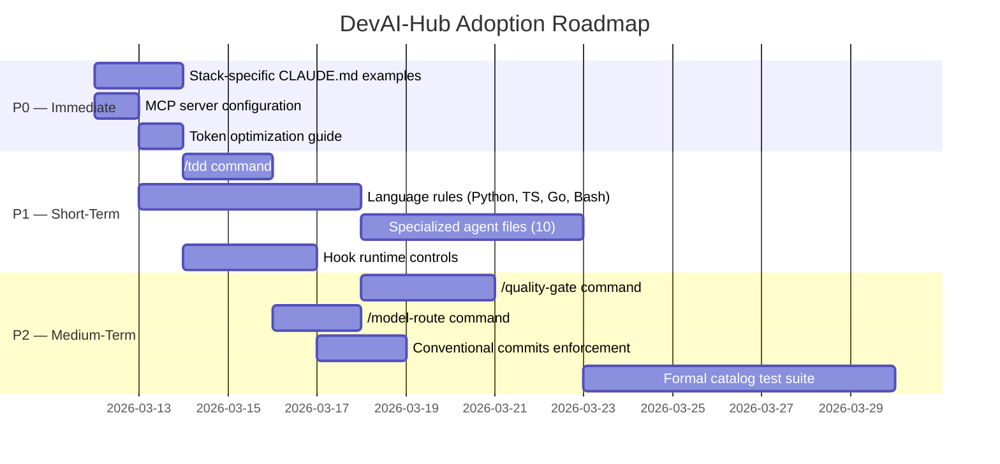

# Cross-Project Comparison: DevAI-Hub vs. Everything Claude Code

**Version**: 0.8.5
**Generated**: 2026-03-11T00:00:00Z
**Analyzer**: Claude Code — compare-project command
**External Source**: https://github.com/affaan-m/everything-claude-code
**Source Type**: Repository

---

## Section 1: Executive Summary

This report compares DevAI-Hub v0.8.5 with Everything Claude Code (ECC) v1.8.0, a peer project that evolved over 10+ months of intensive daily use and has accumulated 71,899 stars. Both projects enhance AI coding assistants with skills, commands, hooks, and configuration templates, but they are architecturally complementary rather than direct replacements. DevAI-Hub leads in breadth (136 skills vs 16), installer polish, multi-platform template rendering, compliance coverage, and VS Code tooling. ECC leads in agent specialization, language-specific rules, MCP server configuration, token optimization strategies, and formal test infrastructure.

Fourteen adoption candidates were identified: three are P0 (immediate, low effort), four are P1 (short-term, medium effort), three are P2 (medium-term), and four are P3 (backlog). The top three P0 items are: stack-specific CLAUDE.md example configurations, a curated MCP server configuration file, and a token optimization guide. The overall recommendation is **selective adoption**: borrow ECC's agent-layer patterns, rules system, and MCP configuration approach while preserving DevAI-Hub's superior skill library, installer ecosystem, and compliance depth.

---

## Section 2: Project Profiles

| Attribute | DevAI-Hub | Everything Claude Code |
|-----------|-----------|----------------------|
| **Purpose** | Modular skill and instruction library for AI coding assistants | Agent harness performance optimization with production-ready agents, skills, hooks, commands, and rules |
| **Version** | 0.8.5 (2026-03-10) | 1.8.0 (2026-03-04) |
| **License** | Not explicitly stated | MIT |
| **Stars / Forks** | Emerging | 71,899 / 9,027 |
| **Contributors** | 1 primary | 30+ |
| **Supported Platforms** | Claude Code, Gemini, Copilot, Codex | Claude Code, Cursor IDE, Codex, OpenCode |
| **Distribution** | Cross-platform installer (PS1 + SH, 104 KB) | npm plugin marketplace + manual copy |
| **Primary Language** | PowerShell, Bash, Python, Markdown | JavaScript (Node.js), TypeScript, Markdown |
| **Package Manager** | pip / npm (optional) | Bun |
| **Skills Count** | 136 (18 categories) | 16 (domain-focused) |
| **Commands Count** | 24 | 36+ |
| **Hooks Count** | 11 runtime hooks | 16 event-driven hooks (JavaScript) |
| **Agents Count** | 0 explicit agent files | 17 specialized agents |
| **Rules Count** | 0 | 40 (9 language categories) |
| **MCP Configuration** | None | 14 servers configured |
| **Test Infrastructure** | Manual verification | Node.js runner, 80% coverage threshold |
| **Compliance Skills** | 9 (GDPR, CCPA, ISO 27001, SOC2, PCI-DSS, ISO 42001, NIST AI RMF, AI Governance, Traceability) | 0 |
| **Installer Sophistication** | Full template rendering, language detection, per-project customization | Plugin marketplace install + manual copy |

---

## Section 3: Technology Stack Comparison

| Layer | DevAI-Hub | Everything Claude Code | Notes |
|-------|-----------|----------------------|-------|
| **Primary language** | PowerShell + Bash + Python | JavaScript (Node.js) + TypeScript | ECC uses Node.js for all automation; DevAI-Hub uses native shell per platform |
| **Package manager** | pip / npm (optional) | Bun | ECC committed to Bun since Jan 2026; DevAI-Hub auto-detects all package managers |
| **Build tooling** | `infrastructure/tools/build_skills_catalog.py` | No build step (distribution) | DevAI-Hub has a catalog compilation pipeline; ECC distributes source directly |
| **Test runner** | None (manual verification) | `node tests/run-all.js` + c8 (80% threshold) | ECC has formal automated testing |
| **Linting** | Pre-commit (JSON/YAML/Markdown) | ESLint + Prettier + Markdownlint | ECC more comprehensive on JS/TS; equivalent for Markdown |
| **CI/CD** | GitHub Actions (1 job: validate) | GitHub Actions (5 workflows) | ECC has more CI coverage |
| **Commit conventions** | None enforced | commitlint.config.js (conventional commits) | ECC enforces feat/fix/refactor/docs/test prefixes |
| **IDE extension** | VS Code extension (Claude Usage Monitor, TypeScript) | None | DevAI-Hub unique advantage |
| **Report generation** | Python (Word + PPT via `generate_report.py`) | None | DevAI-Hub unique advantage |

---

## Section 4: AI Assistant Configuration Comparison

This is the highest-signal section for both projects.

### 4a. Claude Code Configuration

| Aspect | DevAI-Hub | ECC |
|--------|-----------|-----|
| **`.claude/` structure** | Minimal root config (`settings.local.json`) | `.claude/package-manager.json`, skills |
| **Skills location** | Installed to `.claude/skills/` from `catalog/skills/` | `.agents/skills/` (16 skills) |
| **Commands** | 24 in `catalog/commands/` | 36+ in `.opencode/commands/` |
| **Hooks** | 11 in `catalog/hooks/` (Bash/SH) | 16 in `.cursor/hooks/` (JavaScript) |
| **Agents** | None explicit | 17 in `agents/` (Markdown with YAML frontmatter) |
| **Rules** | None | 40 in `rules/<lang>/` |
| **Context files** | `catalog/context/architecture.md` | `examples/CLAUDE.md` variants (6) |
| **Memory** | `catalog/memory/decisions.md` | None explicit |
| **Hook runtime control** | Static (edit files to change behavior) | `ECC_HOOK_PROFILE` + `ECC_DISABLED_HOOKS` env vars |
| **Token management** | None | `MAX_THINKING_TOKENS=10000`, `CLAUDE_AUTOCOMPACT_PCT_OVERRIDE=50` |
| **MCP config** | None | `mcp-configs/mcp-servers.json` (14 servers) |

### 4b. Multi-Platform Configuration

| Platform | DevAI-Hub | ECC |
|----------|-----------|-----|
| **Claude Code** | Full support (CLAUDE.md, skills, commands, hooks) | Full support |
| **Gemini** | Full support (GEMINI.md template) | Not targeted |
| **GitHub Copilot** | Full support (copilot-instructions.md, coding-snippets) | Not targeted |
| **Codex** | Full support (AGENTS.md template) | Partial support |
| **Cursor IDE** | Not targeted | Full support (`.cursor/hooks/`, `.cursor/rules/`, `.cursor/skills/`) |
| **OpenCode** | Not targeted | Full support (`.opencode/commands/`, `.opencode/prompts/`, `.opencode/tools/`) |

### 4c. Hook Architecture Comparison

| Dimension | DevAI-Hub | ECC |
|-----------|-----------|-----|
| **Language** | Bash/Shell | JavaScript (Node.js) |
| **Event types** | PreToolUse, PostToolUse, Stop | session-start, session-end, before/after file edit, before/after shell, before/after MCP, pre-compact, subagent-start/stop |
| **Runtime control** | None (requires file edits) | `ECC_HOOK_PROFILE` env var + `ECC_DISABLED_HOOKS` for selective disable |
| **Event granularity** | Coarse (tool type filter) | Fine-grained (per event, per tool) |
| **Portability** | Requires Bash; limited on Windows without WSL | Node.js cross-platform |
| **Inspection depth** | File content scanning | Full adapter pattern for platform differences |

---

## Section 5: Skills and Capabilities Gap Analysis

### 5a. Present in ECC, Missing in DevAI-Hub (Adoption Candidates)

**Agent Layer (17 specialized agents in `agents/`)**

ECC ships explicit agent definition files that Claude Code can activate as subagents. DevAI-Hub lacks this layer entirely — capabilities are embedded in skill files rather than agent personas.

| ECC Agent | File | Capability |
|-----------|------|-----------|
| `architect` | `agents/architect.md` | System design, architectural decisions |
| `build-error-resolver` | `agents/build-error-resolver.md` | TypeScript and build error triage |
| `chief-of-staff` | `agents/chief-of-staff.md` | Task orchestration and prioritization |
| `code-reviewer` | `agents/code-reviewer.md` | Quality assurance review |
| `database-reviewer` | `agents/database-reviewer.md` | Schema, query, and index review |
| `doc-updater` | `agents/doc-updater.md` | Documentation synchronization |
| `e2e-runner` | `agents/e2e-runner.md` | End-to-end test generation and execution |
| `go-build-resolver` | `agents/go-build-resolver.md` | Go-specific build error resolution |
| `go-reviewer` | `agents/go-reviewer.md` | Go code assessment |
| `harness-optimizer` | `agents/harness-optimizer.md` | Test harness improvement |
| `kotlin-reviewer` | `agents/kotlin-reviewer.md` | Kotlin code assessment |
| `loop-operator` | `agents/loop-operator.md` | Autonomous loop orchestration |
| `planner` | `agents/planner.md` | Implementation planning (requires user confirmation before code) |
| `python-reviewer` | `agents/python-reviewer.md` | Python code assessment |
| `refactor-cleaner` | `agents/refactor-cleaner.md` | Code refactoring and cleanup |
| `security-reviewer` | `agents/security-reviewer.md` | OWASP Top 10 security assessment |
| `tdd-guide` | `agents/tdd-guide.md` | Test-driven development coaching |

**Rules System (40 files across 9 language categories)**

ECC ships coding standards as discrete rule files per language. DevAI-Hub has no equivalent; coding standards are embedded narratively in skill files.

| Category | Files | Coverage |
|----------|-------|---------|
| `rules/common/` | 9 files | Cross-language conventions (immutability, input validation, file size limits, API format) |
| `rules/typescript/` | 5 files | TS-specific patterns, ESLint config, type safety |
| `rules/python/` | 5 files | PEP 8, type hints, pytest conventions |
| `rules/golang/` | 5 files | Go idioms, error handling, module conventions |
| `rules/kotlin/` | 5 files | Kotlin coroutines, Android patterns |
| `rules/perl/` | 5 files | Perl best practices |
| `rules/php/` | 5 files | PHP modern patterns |
| `rules/swift/` | 5 files | Swift/iOS conventions |

**MCP Server Configuration**

ECC ships `mcp-configs/mcp-servers.json` covering 14 MCP servers: GitHub, Firecrawl, Supabase, Memory, Sequential-thinking, Railway, Exa Web Search, Context7, Magic UI, Filesystem, Insaits, Vercel, Cloudflare, ClickHouse. DevAI-Hub mentions MCP in `guides/MCP_DEVELOPMENT_SERVERS.md` but ships no configuration.

**Stack-Specific Example Configurations**

ECC ships 6 ready-to-use CLAUDE.md examples in `examples/`:
- `CLAUDE.md` (base template)
- `django-api-CLAUDE.md` (Python 3.12+, Django 5.x, PostgreSQL, Celery, Docker Compose)
- `go-microservice-CLAUDE.md` (Go microservice)
- `rust-api-CLAUDE.md` (Rust API)
- `saas-nextjs-CLAUDE.md` (Next.js SaaS)
- `user-CLAUDE.md` (personal configuration)

DevAI-Hub has a single base template rendered by the installer but no framework-specific variants.

**Token Optimization Strategies**

ECC documents specific env vars for token management: `MAX_THINKING_TOKENS=10000` and `CLAUDE_AUTOCOMPACT_PCT_OVERRIDE=50` (claimed 60% cost reduction). DevAI-Hub has no equivalent guidance. ECC also has a `/model-route` command for dynamic model selection and a Sonnet-first recommendation policy.

**TDD Workflow Command**

ECC's `/tdd` command enforces a strict RED → GREEN → REFACTOR → REPEAT cycle with an 80% coverage gate, Playwright for E2E, and Jest/Vitest for unit tests. DevAI-Hub has 17 testing skills and `/generate-tests` / `/generate-unit-tests` commands but no `/tdd` phased workflow command.

**Autonomous Loop System**

ECC has `/loop-start`, `/loop-status` commands and a `loop-operator` agent for autonomous iterative workflows. DevAI-Hub has no equivalent — this enables persistent AI-driven background tasks that self-correct.

**Hook Runtime Controls**

ECC hooks read `ECC_HOOK_PROFILE` (strictness level) and `ECC_DISABLED_HOOKS` (comma-separated list of hooks to skip). This allows project-level tuning without file edits. DevAI-Hub hooks are static; changing behavior requires editing shell scripts.

### 5b. Present in DevAI-Hub, Missing in ECC (Strengths to Preserve)

| Strength | DevAI-Hub Evidence | ECC Gap |
|----------|-------------------|---------|
| **Skill breadth** | 136 skills across 18 categories (`catalog/skills/`, `data/skills.json`) | 16 skills, no compliance, no infrastructure, no orchestration |
| **Role bundles** | 11 bundles in `data/bundles.json` (Core Dev, Frontend, Backend, AI Engineer, Architect, DevOps, Security, Compliance, QA, Tech Lead, Bug Hunter) | No bundle concept |
| **Goal workflows** | 17 workflows in `data/workflows.json` (Full Code Review, Security Audit, AI Agent Pipeline, Compliance Assessment, etc.) | No workflow concept |
| **Compliance skills** | 9 compliance skills: GDPR, CCPA, ISO 27001, ISO 42001, SOC2, PCI-DSS, NIST AI RMF, AI Governance, Traceability | None |
| **Cross-platform installers** | 104 KB of PS1 + SH with template rendering, language detection, hook installation | Plugin marketplace only; no installer automation |
| **Template rendering** | Renders CLAUDE.md, GEMINI.md, copilot-instructions.md, AGENTS.md from `templates/ai-instructions/` | No template system |
| **VS Code extension** | Claude Usage Monitor (1,791 LOC TypeScript, real-time usage dashboard) | None |
| **Report generation** | Word + PPT output via `scripts/generate_report.py` | None |
| **Auto-devlog hook** | `catalog/hooks/auto-devlog.sh` appends git summary to DEVLOG on session end | No devlog automation |
| **LLMs.txt** | `llms.txt` at root for AI crawler discovery | None found |
| **Catalog pipeline** | `infrastructure/tools/build_skills_catalog.py` compiles SKILL.md → skills.json | No compilation step; raw files distributed |
| **Skills discovery** | `/search-skills` command + skills.json metadata (priority, tags, role mappings) | No search tooling |
| **Gemini support** | Full GEMINI.md template + Gemini-specific instructions | Not targeted |
| **Copilot support** | Full copilot-instructions.md + `coding-snippets/` | Not targeted |

### 5c. Present in Both, Quality Comparison

| Aspect | DevAI-Hub | ECC | Winner |
|--------|-----------|-----|--------|
| **Skill documentation quality** | Structured YAML frontmatter, phases, severity classifications | Structured YAML frontmatter, seven-step workflows | Tie — both excellent |
| **Security skills** | `catalog/skills/security/` (7 skills) + `catalog/hooks/secret-scan.sh` | `agents/security-reviewer.md` + AgentShield (102 rules) | ECC for runtime scanning; DevAI-Hub for skill breadth |
| **CI validation** | 1 job: JSON syntax + pre-commit | 5 workflows: full test suite + schema validation | ECC |
| **Documentation depth** | DEVLOG + CHANGELOG + guides + version-specific docs | README + CHANGELOG + localized docs | DevAI-Hub for internal process docs; ECC for onboarding examples |
| **Hook coverage** | PreToolUse, PostToolUse, Stop (coarse) | 8 fine-grained event types (session, file, shell, MCP) | ECC |
| **Installer UX** | Professional multi-step installer with prompts and rollback | `npm install` or manual copy | DevAI-Hub |

---

## Section 6: Commands and Automation Comparison

### 6a. Commands Gap

**ECC-only commands (no DevAI-Hub equivalent):**

| ECC Command | Purpose | Priority |
|-------------|---------|---------|
| `/tdd` | RED→GREEN→REFACTOR cycle with 80% coverage gate | P1 |
| `/quality-gate` | Pre-merge quality verification (lint + tests + coverage) | P2 |
| `/model-route` | Dynamic model selection based on task complexity | P1 |
| `/loop-start` | Begin autonomous iterative loop | P3 |
| `/loop-status` | Check loop state | P3 |
| `/eval` | Evaluation workflows for agent outputs | P2 |
| `/harness-audit` | Test harness improvement analysis | P2 |
| `/instinct-export` / `/instinct-import` | Export/import learned patterns | P3 |
| `/promote` | Code promotion to higher environments | P2 |
| `/checkpoint` | Create development checkpoint | P2 |
| `/go-build` / `/go-review` / `/go-test` | Go-specific commands | P3 |

**DevAI-Hub-only commands (strengths to preserve):**

`/check-usage`, `/search-skills`, `/import-skills`, `/compare-project`, `/generate-report`, `/generate-report-style-guide`, `/generate-sbom`, `/update-devlog`, `/generate-devlog`, `/generate-changelog`, `/manage-memory`, `/refactor-project-layout`, `/setup-project`, `/generate-readme`, `/generate-dev-history`

**Commands present in both (equivalent function):**

| DevAI-Hub | ECC | Notes |
|-----------|-----|-------|
| `/review-codebase` | `/code-review` | Both comprehensive review workflows |
| `/analyze-codebase` | `/update-codemaps` | Structural analysis |
| `/generate-unit-tests` | `/tdd`, `/test-coverage` | Testing workflows |
| `/update-documentation` | `/update-docs` | Doc synchronization |
| `/create-skill-or-command` | `/skill-create` | Skill generation |
| `/generate-commit-message` | Implicit via commitlint | Commit conventions |

### 6b. CI/CD and Hooks Gap

| Feature | DevAI-Hub | ECC | Gap |
|---------|-----------|-----|-----|
| **Pre-commit hooks** | 8 (local + community) | None seen | DevAI-Hub stronger |
| **GitHub Actions workflows** | 1 (validate) | 5 | ECC stronger |
| **Catalog compilation in CI** | Yes (`build-catalogs` hook) | N/A | DevAI-Hub unique |
| **Coverage enforcement** | None | 80% via c8 | ECC stronger |
| **Commit linting** | None | commitlint.config.js | ECC stronger |
| **Hook event granularity** | 3 event types | 8 event types | ECC stronger |

---

## Section 7: Documentation and Developer Experience Comparison

| Aspect | DevAI-Hub | ECC | Assessment |
|--------|-----------|-----|-----------|
| **README quality** | Production-grade (Quick Start, What's New, usage guide) | Comprehensive (workflows, installation, features) | Equivalent |
| **CHANGELOG format** | Keep a Changelog (102 KB, 15+ releases) | Present with version history | DevAI-Hub more thorough |
| **DEVLOG** | Active session-based log (`docs/DEVLOG.md`) | None | DevAI-Hub unique |
| **Stack examples** | None | 6 CLAUDE.md variants (Django, Go, Rust, Next.js) | ECC stronger |
| **Localization** | English only | English + Japanese (`docs/ja-JP/`) | ECC stronger |
| **MCP guide** | `guides/MCP_DEVELOPMENT_SERVERS.md` (conceptual) | `mcp-configs/mcp-servers.json` (ready-to-use) | ECC stronger |
| **Integration guides** | 8 guides in `guides/` | Contributing guidelines, README | DevAI-Hub more guides |
| **LLMs.txt** | Present (`llms.txt`, 139 lines) | Not found | DevAI-Hub stronger |
| **Setup time** | "30 seconds" via installer | Manual copy or npm install | DevAI-Hub faster |
| **Architecture docs** | `catalog/context/architecture.md`, `docs/v0.8.2/design.md` | Not found | DevAI-Hub stronger |
| **Onboarding** | Installer + `/setup-project` command | README walkthrough + examples | ECC more practical examples |

---

## Section 8: Testing and Security Posture Comparison

### Testing

| Aspect | DevAI-Hub | ECC |
|--------|-----------|-----|
| **Test framework** | None (manual verification) | Node.js test runner + c8 |
| **Coverage threshold** | None | 80% enforced |
| **E2E testing** | None (for the project itself) | Playwright-based |
| **Unit tests** | None (for the project itself) | Jest/Vitest, sub-50ms target |
| **CI test execution** | Pre-commit hook validation | Full test suite in GitHub Actions |
| **Test types** | JSON/YAML/Markdown syntax only | Unit, integration, E2E |
| **Test stability target** | N/A | >95% pass rate |

### Security

| Aspect | DevAI-Hub | ECC |
|--------|-----------|-----|
| **Security policy** | `SECURITY.md` present | `.github/SECURITY.md` (403 during fetch) |
| **Secret scanning** | `catalog/hooks/secret-scan.sh` (PreToolUse) | ESLint security plugins + pattern detection |
| **OWASP coverage** | Compliance skills (documentation) | `agents/security-reviewer.md` (runtime, 10 OWASP items) |
| **Static analysis rules** | None (project itself) | AgentShield: 102 rules, 1,282 tests |
| **Dependency scanning** | Pre-commit JSON/YAML validation | `npm audit` |
| **OAuth token handling** | Explicit (extension + hooks) | Not applicable |
| **Privacy / telemetry** | Explicit no-telemetry policy | Not stated |
| **Hardcoded secret detection** | Hook-based (runtime) | ESLint-based (static) |

---

## Section 9: Structural and Architectural Differences

**Compilation vs. Distribution Model**

DevAI-Hub uses a compilation model: raw SKILL.md files in `catalog/skills/` are compiled by `build_skills_catalog.py` into `data/skills.json`. ECC uses direct distribution: raw files are copied to the target AI platform directory. The compilation model provides richer metadata (priorities, tags, role mappings, bundle assignments) at the cost of an extra build step. ECC's model is simpler for contributors but loses structured discovery.

**Installer vs. Plugin Marketplace**

DevAI-Hub's 104 KB installer performs language detection, template rendering (filling `{{PLACEHOLDER}}` tokens), directory creation, hook registration, and per-project customization — all without Node.js. ECC's Claude Code plugin marketplace approach requires Claude Code v2.1+ and Node.js, but delivers one-command installation without manual path management. Both models serve different user segments: DevAI-Hub fits enterprise environments that restrict npm; ECC fits developers who already use the Claude Code CLI daily.

**Skill Depth vs. Agent Breadth**

DevAI-Hub's 136 skills provide broad horizontal coverage across 18 categories. ECC's 17 agents provide deep vertical specialization — each agent is a narrowly focused expert persona with explicit activation triggers, known limitations, and handoff protocols. These models complement each other: DevAI-Hub's skills can be referenced from ECC-style agent files, and ECC's agent pattern can be adopted within DevAI-Hub's catalog structure.

**Hook Language Choice**

ECC's JavaScript hooks enable cross-platform execution without Bash (important for Windows users without WSL), richer data manipulation, npm ecosystem access, and an explicit adapter pattern for platform differences. DevAI-Hub's Bash hooks are simpler to author and review but require WSL on Windows for full functionality. Given DevAI-Hub already has a PowerShell installer (which demonstrates Windows-first thinking), JavaScript hooks would be a natural extension.

---

## Section 10: Adoption Plan

### P0 — Immediate (High Value, Low Effort)

| What | Source (ECC) | Target (DevAI-Hub) | Effort | Dependencies | Risk |
|------|-------------|-------------------|--------|-------------|------|
| **Stack-specific CLAUDE.md examples** (Django/FastAPI, Go, TypeScript/Next.js, Rust) | `examples/django-api-CLAUDE.md`, `go-microservice-CLAUDE.md`, `rust-api-CLAUDE.md`, `saas-nextjs-CLAUDE.md` | `examples/<stack>-CLAUDE.md` at repo root | Low — authoring 4 Markdown files | None | None; purely additive |
| **MCP server configuration** (curated `mcp-servers.json` for 14 common servers) | `mcp-configs/mcp-servers.json` | `catalog/mcp-configs/mcp-servers.json`; installer copies to `.claude/` | Low — adapt file + add one installer step | None | None; opt-in |
| **Token optimization guide** (`MAX_THINKING_TOKENS`, `CLAUDE_AUTOCOMPACT_PCT_OVERRIDE`, Sonnet-first policy) | ECC README + CLAUDE.md env var section | New `guides/TOKEN_OPTIMIZATION.md` + reference in installer output | Low — documentation only | None | None |

### P1 — Short-Term (High Value, Medium Effort)

| What | Source (ECC) | Target (DevAI-Hub) | Effort | Dependencies | Risk |
|------|-------------|-------------------|--------|-------------|------|
| **Language-specific rules** for Python, TypeScript, Go, Bash (3-5 rules each) | `rules/python/`, `rules/typescript/`, `rules/golang/` | `catalog/rules/<lang>/`; installer copies to `.claude/rules/` | Medium — authoring 12-20 rule files + installer update | None | Low; additive |
| **Specialized agent files** (10 key agents: architect, planner, code-reviewer, security-reviewer, tdd-guide, build-error-resolver, doc-updater, refactor-cleaner, loop-operator, harness-optimizer) | `agents/*.md` | `catalog/agents/<name>.md`; installer copies to `.claude/agents/` | Medium — authoring 10 agent files + installer update | None | Low; additive |
| **`/tdd` command** (phased RED→GREEN→REFACTOR with 80% coverage gate) | `.opencode/commands/tdd.md` | `catalog/commands/tdd.md` | Medium — authoring + testing | None | Low; additive |
| **Hook runtime controls** (`ECC_HOOK_PROFILE`, `ECC_DISABLED_HOOKS` env var support in existing hooks) | ECC hook env var pattern | Update `catalog/hooks/*.sh` to read env vars at top | Medium — modify 5-6 hook scripts | None | Low; backward-compatible |

### P2 — Medium-Term (Medium Value, Medium/High Effort)

| What | Source (ECC) | Target (DevAI-Hub) | Effort | Dependencies | Risk |
|------|-------------|-------------------|--------|-------------|------|
| **`/quality-gate` command** (pre-merge: lint + tests + coverage check) | `.opencode/commands/quality-gate.md` | `catalog/commands/quality-gate.md` | Medium | P1 rules system | Low |
| **`/model-route` command** (task-complexity-based model selection) | `.opencode/commands/model-route.md` | `catalog/commands/model-route.md` | Medium | None | Low |
| **Conventional commits enforcement** (advisory pre-commit hook) | `commitlint.config.js` | Local hook in `.pre-commit-config.yaml` (advisory, not blocking) | Medium | None | Medium if blocking; low if advisory |
| **Formal catalog test suite** (JSON schema validation, YAML frontmatter checks, link validation) | `tests/run-all.js` pattern | `tests/` directory with Python pytest | High | None | Low |

### P3 — Backlog (Lower Priority or High Effort)

| What | Source (ECC) | Target (DevAI-Hub) | Effort | Dependencies | Risk |
|------|-------------|-------------------|--------|-------------|------|
| **Cursor IDE integration** | `.cursor/hooks/`, `.cursor/rules/`, `.cursor/skills/` | `catalog/cursor/` + installer section | High | P1 rules | Medium; new platform |
| **OpenCode integration** | `.opencode/commands/`, `.opencode/prompts/` | `catalog/opencode/` + installer section | High | P1 agents | Medium; new platform |
| **Autonomous loop system** (`/loop-start`, `/loop-status`, loop-operator agent) | `.opencode/commands/loop-*.md`, `agents/loop-operator.md` | `catalog/commands/` + installer | High | P1 agents | Medium; complex semantics |
| **Japanese localization** | `docs/ja-JP/` | `docs/ja-JP/` | High | None | Low |

---

## Section 11: Implementation Sequence

The 7 actionable P0/P1 items should be implemented in this order, respecting dependencies and maximizing early value:

**Recommended order within P0 (can be done in parallel):**

1. MCP server configuration (1 day, zero risk, immediately useful)
2. Token optimization guide (1 day, zero risk, immediately useful)
3. Stack-specific CLAUDE.md examples (2 days, purely additive)

**Recommended order within P1:**

4. `/tdd` command (2 days, builds on existing testing skills)
5. Language rules — Python, TypeScript, Go, Bash (5 days; enables `/quality-gate`)
6. Hook runtime controls (3 days; improves hook usability before agents ship)
7. Specialized agent files (5 days; depends on rules being available as reference)

---

## Section 12: Risks and Considerations

**Items not recommended for adoption:**

- **Bun as default package manager**: ECC committed to Bun, but DevAI-Hub's auto-detection of npm/pnpm/yarn/bun is a deliberate strength for enterprise environments. Do not force-migrate to Bun.
- **JavaScript hooks (replacing Bash)**: While JS hooks are more portable, DevAI-Hub's hooks are simple enough that Bash remains maintainable. Adding env var controls to existing Bash hooks is lower risk than a full language migration. Revisit if Cursor IDE integration (P3) becomes a priority.
- **Plugin marketplace distribution (replacing installer)**: ECC's plugin marketplace requires Claude Code v2.1+ and Node.js. DevAI-Hub's installer works in enterprise environments with restricted network access and older tooling. Both can coexist; do not deprecate the installer.
- **ECC's 16 skills as replacements**: ECC's skills (api-design, backend-patterns, frontend-patterns, investor-materials, etc.) overlap with DevAI-Hub's existing 136 skills. Adopt the ECC skills only where DevAI-Hub has no equivalent — primarily `eval-harness`, `verification-loop`, and `tdd-workflow` (which are not yet in DevAI-Hub's catalog).

**Risks to manage during adoption:**

- **Installer scope creep**: Adding rules, agents, and MCP config to the installer increases its complexity and maintenance burden. Each new directory type should be gated by a clear user prompt (opt-in, not opt-out).
- **Agent file naming conflicts**: If Claude Code's agent resolution changes in future versions, `catalog/agents/` files may conflict with user-defined agents. Follow ECC's `agents/` naming convention exactly to stay compatible.
- **Rules system drift**: Language-specific rules become stale as languages evolve. Establish a review cadence (quarterly) and add a pre-commit hook that lints rule files for broken links and outdated version references.
- **MCP server proliferation**: ECC recommends keeping active MCPs under 10 to preserve context window. The MCP config file should ship with all 14 servers but document the "keep under 10" best practice prominently.
- **Coverage threshold as a gate**: Adopting an 80% coverage gate (P2) will block CI for any skill files that lack test coverage. Since DevAI-Hub's "tests" are structural (JSON validation), the 80% threshold must be scoped to source code only, not Markdown content.
