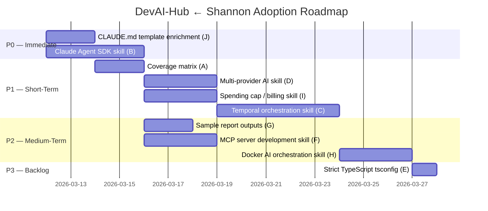

# Cross-Project Comparison: DevAI-Hub vs. Shannon

**Version**: 0.8.5
**Generated**: 2026-03-11T00:00:00Z
**Analyzer**: Claude Code — compare-project command
**External Source**: https://github.com/KeygraphHQ/shannon
**Source Type**: Repository

---

## Section 1: Executive Summary

This report compares DevAI-Hub v0.8.5 with Shannon, an autonomous AI security testing pipeline built by KeygraphHQ (33,186 stars) that deploys 13 specialized Claude agents across a 5-phase penetration testing workflow, achieving a 96.15% success rate on the XBEN benchmark. The two projects are architecturally non-overlapping: DevAI-Hub operates in the instructional layer, shaping how human-facing AI assistants behave during interactive sessions through skills, commands, hooks, and configuration templates. Shannon operates in the execution layer, deploying the Claude Agent SDK directly as a production autonomous system with no human in the loop after launch. They are complementary rather than competing.

Despite this asymmetry, Shannon is the highest-fidelity real-world reference implementation of exactly the patterns DevAI-Hub's catalog currently teaches abstractly: Claude Agent SDK usage, Temporal workflow orchestration, multi-provider LLM routing, MCP server scaffolding, and Docker AI orchestration. This makes Shannon an unusually valuable benchmarking source. Ten adoption candidates were identified: two are P0 (immediate), four are P1 (short-term), three are P2 (medium-term), and one is P3 (backlog). The top P0 items are a dedicated Claude Agent SDK skill grounded in Shannon's TypeScript production patterns, and an enriched `base-claude.md` template modeled on Shannon's 9.8 KB detailed project manual. The overall recommendation is **targeted adoption**: extract Shannon's production-grade AI agent patterns as new skills while preserving DevAI-Hub's superior skill breadth, installer ecosystem, and compliance coverage.

---

## Section 2: Project Profiles

| Attribute | DevAI-Hub | Shannon |
|-----------|-----------|---------|
| **Purpose** | Modular skill and instruction library for AI coding assistants | Autonomous AI security testing pipeline (DAST + SAST correlation) |
| **Version** | 0.8.5 (2026-03-10) | Active development (no semver tag) |
| **License** | Not explicitly stated | AGPL-3.0 (open-source); commercial Pro variant |
| **Stars / Forks** | Emerging | 33,186 / 3,306 |
| **Primary Domain** | Developer productivity / AI augmentation | Offensive security / penetration testing |
| **Architecture Style** | Library / catalog / installer | Pipeline / orchestration / multi-agent system |
| **Layer** | Instructional (shapes AI assistant behavior) | Execution (autonomous AI agent system) |
| **Agent Count** | 0 explicit autonomous agents | 13 specialized agents (5-phase pipeline) |
| **AI SDK** | None (teaches patterns; does not use SDK) | Claude Agent SDK v0.2.38 (production) |
| **Workflow Engine** | Markdown phase templates (`workflow-orchestrator` skill) | Temporal (durable, parallel, crash-resilient) |
| **Multi-Provider AI** | No dedicated coverage | Anthropic, AWS Bedrock, Google Vertex AI, OpenRouter |
| **Skills Catalog** | 136 skills, 18 categories | None |
| **Commands** | 24 slash commands | Bash CLI (`./shannon start/logs/query/stop`) |
| **Hooks** | 11 runtime hooks (Bash) | None |
| **Role Bundles** | 11 | None |
| **Workflows** | 17 goal-based workflows | 1 (fixed 5-phase security pipeline) |
| **MCP Coverage** | Guide only (`guides/MCP_DEVELOPMENT_SERVERS.md`) | `mcp-server/` scaffold (not yet implemented) |
| **CI/CD** | GitHub Actions (1 workflow) + pre-commit hooks | No GitHub Actions; issue templates only |
| **Testing** | Manual verification | No automated tests; XBEN benchmark (96.15%) |
| **Primary Languages** | PowerShell, Bash, Python, TypeScript | TypeScript / Node.js 22 |
| **Container Strategy** | None | Docker Compose-native, Chainguard Wolfi (non-root) |
| **CLAUDE.md** | 4 KB rendered template | 9,847 bytes (detailed project manual) |
| **Spending Controls** | VS Code extension (informational display) | Built into Claude SDK invocation layer (hard stop) |
| **Sample Outputs** | None | 3 real vulnerability assessment reports (`sample-reports/`) |
| **DX Entry Point** | Cross-platform installer (PS1 + SH, 104 KB) | `docker compose up` + `.env` config |
| **Cost per Run** | N/A | ~$50 USD (1-1.5 hours per pentest) |

---

## Section 3: Technology Stack Comparison

| Layer | DevAI-Hub | Shannon | Notes |
|-------|-----------|---------|-------|
| **Primary language** | PowerShell, Bash, Python, TypeScript | TypeScript / Node.js 22 | Shannon is a pure TS/Node project; DevAI-Hub uses multiple languages by design |
| **Runtime** | None (Markdown distribution) | Node.js 22 LTS | Shannon requires Node 22; DevAI-Hub has no runtime dependency |
| **Package manager** | pip (report generator); npm (VS Code ext) | npm | Shannon uses npm for all dependencies |
| **Type safety** | None (Bash/Python/PS1) | Strict TypeScript (`strict`, `noUncheckedIndexedAccess`, `exactOptionalPropertyTypes`) | Shannon uses TypeScript as a quality gate |
| **AI SDK** | None (documents patterns, does not use SDK) | `@anthropic-ai/sdk` + Claude Agent SDK v0.2.38 | Shannon integrates the SDK at production scale |
| **Workflow engine** | None (Markdown templates) | Temporal (durable workflow orchestration) | Shannon's most distinctive infrastructure choice |
| **Browser automation** | None | Playwright (for dynamic security testing) | Shannon-specific |
| **Container** | None | Docker Compose + Chainguard Wolfi | Shannon runs containerized; non-root execution (UID 1001) |
| **Multi-provider** | No coverage | Anthropic, AWS Bedrock, Vertex AI, OpenRouter | Shannon's provider abstraction is first-class |
| **Schema validation** | Pre-commit JSON/YAML lint | AJV + Zod (strict JSON Schema validation at runtime) | Different layers: DevAI-Hub at commit time; Shannon at runtime |
| **CI/CD** | GitHub Actions (1 job: validate) | None (no GitHub Actions) | DevAI-Hub paradoxically has stronger CI |
| **Testing** | Manual only | None automated; XBEN benchmark (96.15%) | Both lack automated test suites |
| **Security tools (runtime)** | secret-scan.sh hook | Nmap, Subfinder, WhatWeb, Schemathesis (in container) | Shannon ships security tools as container dependencies |
| **IDE extension** | VS Code Claude Usage Monitor | None | DevAI-Hub unique advantage |
| **Report generation** | Python (Word + PPT via `generate_report.py`) | Automated Markdown report from exploitation phase | Different output formats; Shannon's is domain-specific |

---

## Section 4: AI Assistant Configuration Comparison

This is the highest-signal section for evaluating Shannon as a reference source.

### 4a. CLAUDE.md Quality Comparison

Shannon's CLAUDE.md (9,847 bytes) functions as a complete engineering reference for the project — covering architecture, agent registry, Temporal integration, TypeScript conventions, Docker Compose usage, environment variable catalog, spending cap configuration, and MCP scaffold status. DevAI-Hub's `base-claude.md` template (rendered by the installer) is a well-structured starting point but averages 4 KB and does not include agent registry, env var reference, spending controls, or MCP status sections.

| Dimension | DevAI-Hub `base-claude.md` | Shannon `CLAUDE.md` (9.8 KB) |
|-----------|---------------------------|-------------------------------|
| Architecture description | `{{PROJECT_DESCRIPTION}}` placeholder | Full 5-phase pipeline with agent names and responsibilities |
| Agent registry | Not applicable | All 13 agents listed with responsibilities and tool access |
| Tech stack | Auto-detected placeholders | Pinned: TS/Node 22, Temporal, SDK v0.2.38, Playwright |
| Environment variables | None | Complete env var catalog with purpose and required/optional |
| Spending cap guidance | None | Explicit billing safeguard configuration |
| MCP status | None | Documents scaffold status and integration intent |
| Layout rules | Section exists (enforces repo root rules) | Detailed directory tree with rationale per path |
| Conventions | Generic communication style bullets | TypeScript-specific naming, imports, single-responsibility rules |
| Comments convention | None | Numbered steps for sequential logic; section dividers for grouping |

### 4b. Claude Agent SDK Integration Depth

| Dimension | DevAI-Hub | Shannon |
|-----------|-----------|---------|
| SDK version | None (documentation project) | `@anthropic-ai/sdk` + Agent SDK v0.2.38 |
| SDK usage | None | 13 agents using SDK for all LLM calls (production) |
| Multi-provider routing | No skill or template | Anthropic, Bedrock, Vertex AI, OpenRouter (unified interface) |
| Retry logic | Described generically in `ai-agent-development` skill | Implemented in `src/ai/claude-executor.ts` |
| Spending caps | `UsageTracker` class in `ai-agent-development` (tracking only) | Integrated hard stop at SDK invocation layer |
| Audit logging | Described in skill | Per-invocation audit log in `src/audit/activity-logger.ts` |
| Error classification | Described in skill | Retryable vs fatal error taxonomy implemented |
| MCP integration | Described in skill + `guides/MCP_DEVELOPMENT_SERVERS.md` | `mcp-server/` scaffold present; separate Playwright instance per agent |

### 4c. Workflow Orchestration Depth

| Dimension | DevAI-Hub | Shannon |
|-----------|-----------|---------|
| Orchestration approach | Markdown phase templates (`workflow-orchestrator` skill) | Temporal (durable, fault-tolerant, distributed) |
| Parallel execution | Described conceptually in `ai-agent-development` | 5 agents run in parallel during analysis and exploitation phases |
| Failure handling | Rollback plan templates (Markdown) | Temporal activity retries + durable state + non-retryable error classification |
| State persistence | Not applicable | Temporal workflow state survives crashes; git checkpointing |
| Resume capability | Not applicable | Named workspaces; workflow ID query |
| Temporal Web UI | Not applicable | Available at `localhost:8233` |

---

## Section 5: Skills and Capabilities Gap Analysis

### 5a. Shannon Capabilities Missing from DevAI-Hub Catalog

These are patterns Shannon demonstrates at production scale that DevAI-Hub currently teaches only generically or not at all.

| Shannon Capability | Shannon Source | DevAI-Hub Gap |
|-------------------|----------------|---------------|
| Claude Agent SDK (TypeScript) — retry, multi-provider, spending caps, audit logging | `src/ai/claude-executor.ts` architecture | `ai-agent-development` skill is Python/generic; no TypeScript SDK skill |
| Temporal workflow orchestration | Temporal throughout all 5 phases | `workflow-orchestrator` skill covers Markdown phase templates; no Temporal content |
| Multi-provider AI routing (Anthropic/Bedrock/Vertex/OpenRouter) | Provider abstraction in Shannon's config | No skill or template for multi-provider configuration |
| MCP server authoring (implementation) | `mcp-server/` scaffold | `MCP_DEVELOPMENT_SERVERS.md` guide-only; no dedicated skill |
| Docker Compose for AI multi-agent systems | `docker-compose.yml` (Temporal + worker topology) | `containerization` skill is generic; no AI-workload-specific patterns |
| Spending cap / billing safeguards (hard stop) | Built into Claude SDK invocation layer | `UsageTracker` in `ai-agent-development` tracks cost; no enforcement skill |
| OWASP-aligned coverage matrix | `COVERAGE.md` (43 tests across 8 categories) | No catalog coverage matrix of any kind |
| Strict TypeScript tsconfig | Strict TS throughout (`noUncheckedIndexedAccess`, `exactOptionalPropertyTypes`) | `typescript.md` template exists; lacks advanced strict config patterns |
| Agent identity and specialization files | 13 dedicated agent prompt configs in `prompts/` | No equivalent agent specialization patterns |

### 5b. DevAI-Hub Strengths Shannon Does Not Address

Shannon is a vertical application, not an AI assistant augmentation tool. These strengths have no Shannon equivalent because Shannon is not competing in the same category — they are listed to confirm DevAI-Hub's identity is preserved.

- 136 skills across 18 categories (vs 0 in Shannon)
- 24 slash commands (vs headless bash CLI only)
- 11 runtime hooks for session-level automation
- Pre-commit hooks for code quality enforcement
- VS Code Claude Usage Monitor extension
- Cross-platform installer (PS1 + SH, 104 KB) with language detection
- 11 role-based bundles for targeted installation
- 17 goal-based workflows
- 9 compliance skills (GDPR, SOC 2, ISO 27001, ISO 42001, NIST AI RMF, PCI-DSS, CCPA, AI Governance, Traceability)
- Multi-AI-assistant support (Claude, Gemini, Copilot, Codex)
- GitHub Actions CI pipeline

### 5c. Both Present, Quality Comparison

| Area | DevAI-Hub Approach | Shannon Approach | Assessment |
|------|--------------------|-----------------|------------|
| CLAUDE.md | 4 KB rendered template with placeholders | 9.8 KB detailed project manual | Shannon significantly richer; DevAI-Hub template should add optional sections |
| Security documentation | SECURITY.md (vulnerability reporting policy) | COVERAGE.md (capability matrix) + safety disclaimers | Complementary — Shannon's coverage matrix is the adoptable pattern |
| Agent cost awareness | VS Code extension (informational) | Hard billing safeguard in SDK (operational) | Shannon's approach is production-appropriate for autonomous agents |

---

## Section 6: Commands and Automation Comparison

### 6a. Slash Commands vs. Autonomous CLI

Shannon has no slash command system. Its automation surface is Docker Compose + environment variable configuration. The comparison illuminates two different automation philosophies.

| Dimension | DevAI-Hub | Shannon |
|-----------|-----------|---------|
| Automation model | AI-assisted (human triggers slash commands in a session) | Autonomous (headless pipeline runs to completion) |
| Entry point | `/command` invocation in Claude Code | `./shannon start URL=... REPO=...` |
| Session requirement | Requires an active AI assistant session | No session required; agents run independently |
| Interruption model | Human confirms at each step | No interruption; spending cap is the safety boundary |
| Security-specific commands | `/generate-sbom`, `/review-codebase` | Entire pipeline is security-specific |
| Report generation | `/generate-report` (Word/PPT) | Automated Markdown report as pipeline output |
| Workspace management | None | Named workspaces (`./shannon workspaces`); resumable audits |

### 6b. CI/CD and Hooks Comparison

Unusually, DevAI-Hub has stronger CI than Shannon. Shannon has no GitHub Actions workflows; its quality assurance comes from XBEN benchmark testing rather than automated CI gates.

| Dimension | DevAI-Hub | Shannon |
|-----------|-----------|---------|
| GitHub Actions | 1 workflow (catalog validation) | None |
| Pre-commit hooks | 8 hooks (lint, YAML, JSON, whitespace) | None |
| Runtime hooks (AI session) | 11 hooks (PreToolUse, PostToolUse, Stop) | None |
| Quality enforcement | Pre-commit + runtime hooks | XBEN benchmark runs (external validation) |

---

## Section 7: Documentation and Developer Experience Comparison

| Aspect | DevAI-Hub | Shannon | Assessment |
|--------|-----------|---------|------------|
| README size | Comprehensive | 35,908 bytes (comprehensive) | Both strong; Shannon's is deeper for its narrower domain |
| CHANGELOG | 102 KB (keep-a-changelog format) | Not present | DevAI-Hub stronger |
| DEVLOG | Active (`docs/DEVLOG.md`, hook-automated) | None | DevAI-Hub unique |
| Coverage matrix | None | `COVERAGE.md` (skills vs. OWASP, 43 tests) | Shannon stronger — concrete adoption model |
| Commercial docs | None | `SHANNON-PRO.md` (26,798 bytes) | Not directly adoptable; documents a commercial offering |
| Sample outputs | None | 3 real vulnerability reports in `sample-reports/` | Shannon stronger — "show, don't tell" DX |
| Guides | 10 in `guides/` | None separate (embedded in README) | DevAI-Hub stronger |
| Architecture docs | `catalog/context/architecture.md` (blank template) | Detailed in CLAUDE.md | Shannon's is richer; DevAI-Hub's is a user-filled template |
| CLAUDE.md quality | 4 KB rendered template | 9.8 KB detailed project manual | Shannon significantly stronger |
| Setup time | "30 seconds" via installer | `docker compose up` (fast; requires Docker) | Both fast; different prerequisites |
| Onboarding path | Clone → run installer → drag project folder | Clone → set env var → run `./shannon start` | Shannon simpler for its single use case |

---

## Section 8: Testing and Security Comparison

### Testing

| Aspect | DevAI-Hub | Shannon |
|--------|-----------|---------|
| Automated test suite | None | None |
| Benchmark evidence | None | XBEN: 96.15% (100/104 exploits) |
| CI test execution | Pre-commit syntax validation | No CI |
| Validation strategy | Installer dry-run (manual) | `src/services/preflight.ts` environment checks; agent output validators |
| Test philosophy | Manual quality control + pre-commit lint | Real-world benchmark runs as acceptance criteria |

### Security

| Aspect | DevAI-Hub | Shannon |
|--------|-----------|---------|
| Container security | None | Chainguard Wolfi (minimal attack surface), non-root UID 1001 |
| Secret detection | `secret-scan.sh` hook (PreToolUse) | Container isolation + `.gitignore` for `.env`/`credentials/` |
| Input validation | Pre-commit JSON/YAML lint | AJV strict schema validation at runtime; FAILSAFE_SCHEMA for YAML |
| Destructive command guard | `git-guardrails.sh` hook | Not applicable (no git operations during pentest) |
| TypeScript safety | Not applicable | Strict TS: `noUncheckedIndexedAccess`, `exactOptionalPropertyTypes`, `noFallthroughCasesInSwitch` |
| Spending controls | VS Code extension (display only) | Hard billing safeguard at SDK invocation (blocks runaway cost) |
| Compliance coverage | 9 compliance skills (GDPR, SOC2, ISO 27001, etc.) | OWASP WSTG alignment (`COVERAGE.md`) |
| Legal safeguards | None (CLI tool) | Explicit disclaimers: staging only, written authorization required |

---

## Section 9: Structural and Architectural Differences

**Instructional Layer vs. Execution Layer.** DevAI-Hub operates in the instructional layer: its artifacts (skills, commands, hooks, CLAUDE.md) are consumed by Claude Code or Gemini as context, shaping how a human-facing AI assistant reasons and responds during interactive sessions. Shannon operates in the execution layer: its artifacts (TypeScript agents, Temporal workflows, Docker Compose) are runtime components of a production autonomous system. A developer using DevAI-Hub is still the loop; a developer using Shannon sets a workflow in motion and waits for a report. These layers are complementary — DevAI-Hub can teach the patterns Shannon uses; Shannon demonstrates what those patterns look like at production scale.

**Library vs. Application.** DevAI-Hub is a library installed into other people's projects and AI environments; its value compounds across every install. Shannon is a self-contained application that installs and runs itself; its value is concentrated in its specific security testing domain. This means DevAI-Hub cannot "adopt" Shannon's architecture (it would become a different product), but it can represent Shannon's patterns as skills that other developers use when building Shannon-like systems. The gap between DevAI-Hub's abstract guidance and Shannon's concrete TypeScript implementation is the core opportunity.

**Teaching vs. Doing.** DevAI-Hub's `ai-agent-development` skill teaches Claude Agent SDK patterns using Python examples at a conceptual level. Shannon does those patterns in TypeScript at production scale, with retry logic, spending caps, per-invocation audit logging, multi-provider routing, and Temporal crash recovery. This gap — between documented patterns and production implementation — is the primary driver of the P0 adoption items below.

---

## Section 10: Adoption Plan

> Items are ordered by priority tier. Skills adopt Shannon's architectural patterns, not its security domain content.

### P0 — Immediate (High Value, Low–Medium Effort)

| # | What | Source (Shannon) | Target (DevAI-Hub) | Effort | Dependencies | Risk |
|---|------|------------------|--------------------|--------|-------------|------|
| B | Claude Agent SDK skill — TypeScript patterns (retry logic, multi-provider routing, spending caps, audit logging, error classification, MCP registration) | `src/ai/` architecture; CLAUDE.md conventions | `catalog/skills/ai-development/claude-agent-sdk/SKILL.md` (new) | Medium (3-5 days) | None | Low — additive; primary source is Anthropic's public SDK docs |
| J | `base-claude.md` template enrichment — add Agent Registry block, Spending Controls section, Environment Variables Reference, MCP Integration Status section | Shannon CLAUDE.md structure and field coverage | `templates/ai-instructions/base-claude.md` (update) | Low-Medium (2-3 days) | None | Low-Medium — must keep new sections optional (`{{PLACEHOLDER}}` tokens); installer sync required |

### P1 — Short-Term (High Value, Medium Effort)

| # | What | Source (Shannon) | Target (DevAI-Hub) | Effort | Dependencies | Risk |
|---|------|------------------|--------------------|--------|-------------|------|
| A | Catalog coverage matrix — map all 136 skills against user roles, AI platforms, and use case categories | `COVERAGE.md` matrix pattern | `docs/CATALOG-COVERAGE.md` (new) | Low (2 days) | None; sourced from `data/skills.json` | Low — purely additive documentation |
| D | Multi-provider AI skill — provider selection criteria, env var patterns, unified client interface, fallback routing, model ID conventions for Anthropic/Bedrock/Vertex/OpenRouter | Shannon's multi-provider abstraction; `.env.example` | `catalog/skills/ai-development/multi-provider-ai/SKILL.md` (new) | Medium (3-4 days) | P0B preferred context | Low — provider APIs are public |
| I | Spending cap / billing safeguards skill — hard budget limits, per-session/per-task caps, provider-level controls, SDK integration pattern, cost attribution audit trail | Built into Shannon's Claude SDK invocation layer | `catalog/skills/ai-development/ai-billing-safeguards/SKILL.md` (new) | Medium (3-4 days) | P0B recommended prior | Low — additive |
| C | Temporal workflow orchestration skill — when to use Temporal, TypeScript SDK initialization, AI agent activity design (retryable, idempotent), parallel agent fan-out, Temporal Web UI, Docker Compose setup | Shannon's 5-phase pipeline architecture; `docker-compose.yml` | `catalog/skills/orchestration/temporal-orchestration/SKILL.md` (new) | High (5-7 days) | P0B recommended prior | Medium — Temporal has conceptual overhead; scope to AI-agent-pipeline use case only |

### P2 — Medium-Term (Medium Value, Medium Effort)

| # | What | Source (Shannon) | Target (DevAI-Hub) | Effort | Dependencies | Risk |
|---|------|------------------|--------------------|--------|-------------|------|
| F | MCP server development skill — project structure, TypeScript MCP SDK, tool registration, schema definition, server lifecycle, local testing, `.mcp.json` integration | `mcp-server/` scaffold | `catalog/skills/ai-development/mcp-server-development/SKILL.md` (new) | Medium (3-4 days) | P0B conceptually | Low — MCP spec is stable; note that Shannon's scaffold is incomplete |
| G | Sample report outputs — 2-3 example outputs for `/generate-report`, `/generate-sbom`, `/generate-readme` commands | `sample-reports/` DX pattern | `examples/reports/` directory (new) | Low-Medium (2-3 days) | None | Low — "show, don't tell" DX |
| H | Docker Compose AI orchestration skill — service topology for LLM workers + Temporal, API key injection, health checks, resource limits, volume strategy | Shannon's `docker-compose.yml`; Chainguard Wolfi patterns | `catalog/skills/infrastructure/ai-docker-orchestration/SKILL.md` (new) | Medium (3-4 days) | P1C (Temporal skill) | Low — additive; complements containerization skill |

### P3 — Backlog (Low-Medium Value, Low Effort)

| # | What | Source (Shannon) | Target (DevAI-Hub) | Effort | Dependencies | Risk |
|---|------|------------------|--------------------|--------|-------------|------|
| E | Strict TypeScript tsconfig patterns — add `noUncheckedIndexedAccess`, `exactOptionalPropertyTypes`, and rationale for AI agent code | Shannon's strict TypeScript throughout | `templates/ai-instructions/coding-instructions/typescript.md` (update) | Low (1 day) | None | None — enhancement of existing file |

---

## Section 11: Implementation Sequence

**Rationale.** P0 items can run in parallel — the CLAUDE.md enrichment (J) is a documentation track independent of the Claude Agent SDK skill (B). P1 items branch from their respective P0 prerequisites: the coverage matrix (A) follows the CLAUDE.md work; multi-provider (D), spending cap (I), and Temporal (C) skills follow the Claude Agent SDK skill (B) and sequence from least to most effort. P2 items follow their natural predecessors: sample reports (G) follows the documentation track; MCP skill (F) follows B conceptually; Docker orchestration (H) follows Temporal (C). The TypeScript tsconfig update (E) is a final polish item with no dependencies.

---

## Section 12: Risks and Considerations

**Security domain boundary.** Shannon's security testing content (vulnerability prompts, exploitation patterns, OWASP test procedures) must not be imported into DevAI-Hub skills. The adoption candidates extract Shannon's architectural and SDK integration patterns only — the Claude Agent SDK skill (B), Temporal skill (C), and related items describe how Shannon is built, not what Shannon does. DevAI-Hub's `security/` category already covers defensive security; Shannon's offensive patterns are out of scope.

**CLAUDE.md template sync risk (J).** The `base-claude.md` template is rendered by both `scripts/installer.ps1` and `scripts/installer.sh`. Adding new `{{PLACEHOLDER}}` sections requires updating both installers in sync. New sections must default gracefully to empty strings when the corresponding values are not provided, so existing installer invocations continue to work without modification.

**Temporal skill scope (C).** Temporal is a substantial open-source product with its own SDK, server infrastructure, and operational complexity. The skill must be scoped narrowly to the AI-agent-pipeline use case Shannon demonstrates — specifically durable, parallel, fault-tolerant agent execution. It should not attempt to be a general Temporal reference. The trigger condition ("when simple async/await is insufficient for multi-agent workflows") must be explicit.

**MCP server scaffold incompleteness (F).** Shannon's `mcp-server/` scaffold has the project structure (`package.json`, `tsconfig.json`) but `src/` is empty and not yet implemented. The MCP server development skill (F) should draw primarily from the MCP TypeScript SDK's public documentation, not from Shannon's scaffold. Shannon's contribution is the structural layout and the evidence that MCP server authoring is a real development need in Claude Agent SDK projects.

**Docker AI orchestration overlap (H).** The existing `containerization` skill at `catalog/skills/infrastructure/containerization/SKILL.md` covers generic Docker patterns. The new AI Docker orchestration skill (H) adds AI-workload-specific content (multi-agent service topology, LLM API key injection across containers, Temporal worker containers). These are distinct enough to warrant a separate skill rather than extending the existing one, but both skills should cross-reference each other.

**Shannon PR policy.** Shannon is not accepting external PRs ("bug reports and feature requests welcome"). This comparison informs DevAI-Hub's skill content; no contribution to Shannon's codebase is planned or expected.

**Items not recommended for adoption.** Shannon's exploitation prompts, vulnerability detection prompt templates, and OWASP-specific pentest content are not adoption candidates — they require security domain expertise and authorized use context outside DevAI-Hub's scope. The `SHANNON-PRO.md` commercial architecture (Code Property Graph analysis, SCA with reachability, business logic testing) is similarly out of scope; it documents a commercial product feature set, not patterns relevant to a skill library.

---

*Analyzed via WebFetch — no repository clone required. Shannon's `src/` source files were not directly read; architectural patterns are inferred from CLAUDE.md, README.md, file structure analysis, and public documentation.*
