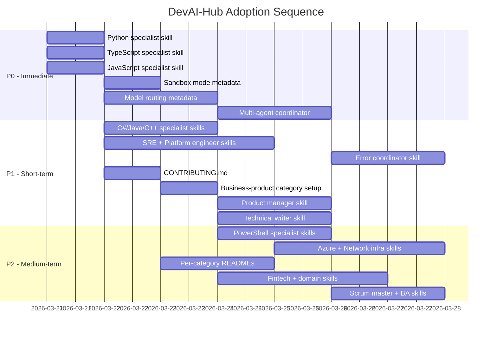

# Cross-Project Comparison: DevAI-Hub vs. Awesome Codex Subagents

**Version**: 0.8.7
**Generated**: 2026-03-20T12:00:00Z
**Analyzer**: Claude Code -- compare-project command
**External Source**: https://github.com/VoltAgent/awesome-codex-subagents
**Source Type**: Repository

---

## Section 1: Executive Summary

DevAI-Hub (140 skills, 29 commands, 12 hooks) and awesome-codex-subagents (139 agents across 10 categories) are complementary projects with fundamentally different architectures serving overlapping goals. DevAI-Hub is a cross-platform installation framework targeting Claude Code, Gemini, and Copilot with deep workflow automation. Awesome-codex-subagents is a Codex-only agent catalog with broader role coverage but no installation tooling, CI/CD, or enforcement hooks. The comparison identified **23 adoption candidates** (primarily in language specialists, business roles, and orchestration), **18 strengths to preserve** in DevAI-Hub, and **9 areas where both projects overlap but differ in approach**. The overall recommendation is **selective adoption**: expand language and role coverage by adapting the external project's category breadth, while preserving DevAI-Hub's superior depth, automation, and multi-platform architecture.

---

## Section 2: Project Profiles

| Attribute | DevAI-Hub | Awesome Codex Subagents |
|---|---|---|
| **Purpose** | Modular skill and instruction library for AI coding assistants | Curated catalog of specialized Codex subagents |
| **Target Platforms** | Claude Code, Gemini, Copilot, Codex | Codex only |
| **Scale** | 140 skills, 29 commands, 12 hooks, 10 agents | 139 agents across 10 categories |
| **Distribution** | PowerShell/Bash installers with dry-run verification | Manual file copy to `~/.codex/agents/` |
| **Config Format** | YAML frontmatter + phased Markdown (avg 589 lines/skill) | TOML (avg 40 lines/agent) |
| **Maturity** | v0.8.7, active development, structured DEVLOG | Unversioned, community-driven (1,452 stars) |
| **License** | MIT | MIT |
| **Author** | Benjamin Dourthe ([benjamin.dourthe@gmail.com](mailto:benjamin.dourthe@gmail.com)) | VoltAgent (community) |
| **CI/CD** | Git hooks, JSON validation, pre-commit enforcement | None |
| **VS Code Extension** | Claude Usage Monitor | None |

---

## Section 3: Technology Stack Comparison

| Layer | DevAI-Hub | Awesome Codex Subagents | Notes |
|---|---|---|---|
| **Languages** | PowerShell, Bash, Python, Markdown | TOML, Markdown | DevAI-Hub has executable scripts; external is config-only |
| **Config Format** | YAML + Markdown | TOML | DevAI-Hub skills are 10-15x more detailed per unit |
| **Package Manager** | pip (report generator), uv preferred | None | External has zero runtime dependencies |
| **Build** | N/A (distribution) | N/A (distribution) | Equivalent |
| **Test** | Installer dry-run, hook enforcement | Manual verification | DevAI-Hub has automated validation |
| **Lint/Format** | N/A | N/A | Equivalent |
| **Template Engine** | `{{PLACEHOLDER}}` syntax in base templates | None | DevAI-Hub assembles platform-specific instructions |
| **Model Routing** | Not specified per skill | Explicit per agent (GPT-5.4 vs 5.3-Spark) | External has a useful pattern to adopt |
| **Sandbox Modes** | Not specified | read-only / workspace-write per agent | External has a useful pattern to adopt |

---

## Section 4: AI Assistant Configuration Comparison

### Instruction Depth

DevAI-Hub skills average **589 lines** with phased execution, quality gates, output templates, and reference checklists. External agents average **40 lines** with a consistent but lighter structure: working mode, focus areas, quality checks, return format, and a scope-limiting closing line.

| Aspect | DevAI-Hub | Awesome Codex Subagents |
|---|---|---|
| **Instruction Detail** | Deep: multi-phase, language-specific, with checklists | Moderate: single-phase, generic, bounded roles |
| **Execution Model** | Phased (plan → execute → verify → report) | Linear (map → implement → validate → return) |
| **Quality Gates** | Explicit per phase with checklist references | Single quality-checks block per agent |
| **Scope Control** | Via skill boundaries and hook enforcement | Via closing "Do not..." instruction |
| **Model Selection** | Inherited from user config | Explicit per agent (high-reasoning vs fast-scan) |
| **Write Permissions** | Controlled by platform permissions | Explicit sandbox_mode field per agent |
| **MCP Integration** | Referenced in agent configs | Optional mcp_servers field per agent |

### Configuration Infrastructure

| Component | DevAI-Hub | Awesome Codex Subagents |
|---|---|---|
| **Skills/Agents** | 140 | 139 |
| **Commands** | 29 slash commands | 0 |
| **Hooks** | 12 (enforcement, validation) | 0 |
| **Context Templates** | base-claude.md, base-gemini.md, coding-snippets | None |
| **Memory System** | Structured memory with MEMORY.md index | None |
| **Language Rules** | Per-language code-style, security, testing rules | None |
| **Installer** | PS1, SH, BAT entry points | None (manual copy) |

### Agent Definition Quality (TOML format analysis)

The external project's TOML agent format is well-structured with a consistent pattern across all 139 agents:

```toml
name = "agent-name"
description = "One-sentence scope trigger"
model = "gpt-5.4"                    # Explicit model routing
model_reasoning_effort = "high"       # Effort calibration
sandbox_mode = "workspace-write"      # Permission boundary
developer_instructions = """
  Working mode → Focus areas → Quality checks → Return format → Scope limiter
"""
```

**Strengths of this format**: explicit model routing, sandbox permissions, consistent structure, easy to browse and compare. **Weaknesses**: shallow instructions (no multi-phase execution, no checklists, no language-specific variants).

---

## Section 5: Skills and Capabilities Gap Analysis

### 5a. Present in External, Missing in DevAI-Hub (Adoption Candidates)

#### Language Specialists (20 missing)

| External Agent | Category | Priority | Notes |
|---|---|---|---|
| python-pro | Language | P0 | DevAI-Hub has python-cleanup and fastapi-expert but no general Python specialist |
| typescript-pro | Language | P0 | DevAI-Hub has no TS specialist despite TS rule sets |
| javascript-pro | Language | P0 | DevAI-Hub has JS cleanup but no specialist |
| csharp-developer | Language | P1 | DevAI-Hub has C# cleanup and init-csharp but no specialist |
| java-architect | Language | P1 | DevAI-Hub has java-cleanup and init-java but no specialist |
| cpp-pro | Language | P1 | DevAI-Hub has cpp-cleanup but no specialist |
| kotlin-specialist | Language | P2 | New language coverage |
| swift-expert | Language | P2 | New language coverage |
| php-pro | Language | P2 | New language coverage |
| angular-architect | Framework | P2 | New framework coverage |
| vue-expert | Framework | P2 | New framework coverage |
| django-developer | Framework | P2 | New framework coverage |
| rails-expert | Framework | P2 | New framework coverage |
| laravel-specialist | Framework | P2 | New framework coverage |
| flutter-expert | Framework | P2 | New framework coverage |
| spring-boot-engineer | Framework | P2 | New framework coverage |
| dotnet-core-expert | Language | P2 | New platform coverage |
| dotnet-framework-4.8-expert | Language | P3 | Legacy platform, niche |
| elixir-expert | Language | P3 | Niche language |
| powershell-5.1-expert / powershell-7-expert | Language | P2 | Relevant given DevAI-Hub's PS1 installer |

#### Business & Product (11 missing, new category)

| External Agent | Priority | Notes |
|---|---|---|
| product-manager | P1 | Product framing and prioritization |
| technical-writer | P1 | Overlaps with DevAI-Hub documentation skills but broader scope |
| project-manager | P1 | Task breakdown, dependency management |
| scrum-master | P2 | Agile ceremony facilitation |
| business-analyst | P2 | Requirements analysis |
| ux-researcher | P2 | User research synthesis |
| sales-engineer | P3 | Technical sales support |
| legal-advisor | P3 | Contract and compliance review |
| content-marketer | P3 | Marketing content |
| customer-success-manager | P3 | Customer-facing support |
| wordpress-master | P3 | CMS-specific, niche |

#### Specialized Domains (10 missing, new category)

| External Agent | Priority | Notes |
|---|---|---|
| fintech-engineer | P2 | Financial services development |
| payment-integration | P2 | Payment systems |
| embedded-systems | P2 | Hardware/firmware development |
| iot-engineer | P2 | IoT development |
| game-developer | P3 | Game development |
| blockchain-developer | P3 | Web3/blockchain |
| quant-analyst | P3 | Quantitative finance |
| risk-manager | P3 | Financial risk |
| seo-specialist | P3 | Search optimization |
| m365-admin | P2 | Microsoft 365 administration |

#### Meta & Orchestration (5 missing capabilities)

| External Agent | Priority | Notes |
|---|---|---|
| multi-agent-coordinator | P0 | Workflow coordination across agents (DevAI-Hub has task-coordinator but lacks multi-agent planning) |
| error-coordinator | P1 | Cross-agent error resolution |
| agent-installer | P2 | Self-service agent deployment |
| agent-organizer | P2 | Agent catalog management |
| performance-monitor | P2 | Agent performance tracking |

#### Infrastructure (6 missing)

| External Agent | Priority | Notes |
|---|---|---|
| sre-engineer | P1 | Site reliability engineering |
| platform-engineer | P1 | Platform engineering |
| network-engineer | P2 | Network infrastructure |
| azure-infra-engineer | P2 | Azure-specific infrastructure |
| windows-infra-admin | P2 | Windows server administration |
| terragrunt-expert | P3 | Terragrunt-specific (DevAI-Hub has terraform-specialist) |

### 5b. Present in DevAI-Hub, Missing in External (Strengths to Preserve)

| DevAI-Hub Capability | Category | Significance |
|---|---|---|
| **8 compliance skills** (GDPR, SOC2, ISO27001, PCI-DSS, CCPA, ISO42001, NIST AI RMF, AI Agent Governance) | Compliance | Unique, high-value enterprise differentiator |
| **6-phase code review** (context-analysis → code-quality → security-review → performance-review → testing-review → final-report) | Code Review | Far deeper than external's single code-reviewer |
| **17 testing skills** (unit tests, mutation testing, edge cases, mocks, CI/CD integration, performance testing, e2e) | Testing | External has only qa-expert + test-automator |
| **7 code cleanup skills** (C, C++, C#, Go, Java, JavaScript, Python) | Code Cleanup | No equivalent in external |
| **29 slash commands** | Workflow | Zero commands in external |
| **12 hooks** (description block enforcement, git guardrails, etc.) | Automation | Zero hooks in external |
| **Report generation** (Word/PPT from Markdown) | Developer Experience | Unique capability |
| **VS Code extension** (Claude Usage Monitor) | Developer Experience | Unique capability |
| **Language rule sets** (code-style, security, testing per language) | Quality | No equivalent in external |
| **100+ instruction templates** (base-claude, base-gemini, coding-snippets) | Configuration | External has no template system |
| **Memory system** (structured memory with MEMORY.md index) | Context | External has no persistence |
| **Context management** (context-manager, context-degradation, context-compression) | Orchestration | External has context-manager but no degradation/compression |
| **Bug fixing skills** (bug-localization, bug-to-patch-generator) | Bug Fixing | External has debugger + error-detective but different approach |
| **Architecture skills** (DDD, event-driven, microservices patterns, API design) | Architecture | External has microservices-architect but less depth |
| **AI development skills** (ai-agent-development, rag-implementation, prompt-engineering) | AI Development | External has ai-engineer + llm-architect but less depth |
| **Cross-platform support** (Claude, Gemini, Copilot, Codex) | Platform | External is Codex-only |
| **Installer framework** (PS1, SH, BAT with dry-run) | Distribution | External is manual file copy |
| **Pre-commit integration** | Automation | No equivalent in external |

### 5c. Present in Both, Quality Comparison

| Capability | DevAI-Hub | Awesome Codex Subagents | Better? |
|---|---|---|---|
| **Code Review** | 6-phase skill chain with checklists (8 skills) | Single code-reviewer + architect-reviewer agents | DevAI-Hub (far deeper) |
| **Security Audit** | 7 security skills + hook enforcement | security-auditor + penetration-tester + ad-security-reviewer | DevAI-Hub (broader + enforcement) |
| **Infrastructure** | 11 skills (cloud, k8s, terraform, CI/CD, containers, observability, data pipeline, CD pipeline, database) | 16 agents (adds Azure, Windows, terragrunt, SRE, platform, network, incident response, deployment, DevOps) | External (broader coverage) |
| **Documentation** | 6 skills (API docs, docstrings, SBOM, strategic comments, technical docs, user docs) | documentation-engineer + api-documenter + technical-writer | DevAI-Hub (more specialized) |
| **Orchestration** | 9 skills (context-manager, task-coordinator, workflow-orchestrator, context-degradation, context-compression, etc.) | 10 agents (multi-agent-coordinator, task-distributor, error-coordinator, performance-monitor, etc.) | Different focus: DevAI-Hub on context management; external on agent coordination |
| **Refactoring** | refactoring-expert skill | refactoring-specialist agent | Comparable |
| **Dependency Management** | dependency-manager + dependency-security-audit | dependency-manager agent | DevAI-Hub (security layer) |
| **Legacy Modernization** | legacy-modernizer skill | legacy-modernizer agent | Comparable |
| **Cloud Architecture** | cloud-architect skill | cloud-architect agent | Comparable |
| **Kubernetes** | kubernetes-expert skill | kubernetes-specialist agent | Comparable |

---

## Section 6: Commands and Automation Comparison

### 6a. Commands Gap

| Aspect | DevAI-Hub | Awesome Codex Subagents |
|---|---|---|
| **Slash Commands** | 29 (compare-project, generate-changelog, generate-readme, review-codebase, run-security-audit, tdd, etc.) | 0 |
| **Installation Scripts** | PS1, SH, BAT entry points | None |
| **Report Generation** | generate-report (Word/PPT) | None |
| **Version Management** | update-version, generate-changelog | None |
| **Project Setup** | setup-project, init-csharp/java/javascript | None |
| **Memory Management** | manage-memory | None |

DevAI-Hub has a massive lead in command-driven automation. The external project has no equivalent; users invoke agents through natural language delegation only.

### 6b. CI/CD and Hooks Gap

| Aspect | DevAI-Hub | Awesome Codex Subagents |
|---|---|---|
| **Pre-commit Hooks** | 12 (description block enforcement, git guardrails, etc.) | 0 |
| **JSON Validation** | Automated catalog validation | None |
| **Git Guardrails** | Destructive command prevention | None |
| **CI Pipelines** | Hook-based enforcement | None |
| **Contribution Validation** | Automated | Manual (CONTRIBUTING.md checklist) |

DevAI-Hub is significantly ahead in automation and enforcement. The external project relies entirely on manual processes and community review.

---

## Section 7: Documentation and Developer Experience Comparison

| Aspect | DevAI-Hub | Awesome Codex Subagents |
|---|---|---|
| **README** | Comprehensive with install instructions, architecture overview, catalog stats | Comprehensive with category index, model routing guide, delegation examples (25 KB) |
| **CLAUDE.md** | Detailed project instructions with conventions, rules, layout | None |
| **DEVLOG** | Structured development log at docs/DEVLOG.md | None |
| **CHANGELOG** | Full changelog with semantic versioning | None |
| **Architecture Docs** | .claude/context/architecture.md | Architecture section in README |
| **Contributing Guide** | Not found | CONTRIBUTING.md with quality standards |
| **Category READMEs** | catalog/skills/README.md | 10 category-specific READMEs |
| **Setup Guides** | guides/ directory with setup documentation | Quick Start in README |
| **Onboarding** | Installer-driven (run one command) | Manual file copy |
| **Agent Discovery** | skills.json catalog with search | Categorical directory browsing + README index |

**Adoption candidate**: The external project's per-category README pattern and CONTRIBUTING.md could improve DevAI-Hub's contributor experience.

---

## Section 8: Testing and Security Posture Comparison

### Testing

| Aspect | DevAI-Hub | Awesome Codex Subagents |
|---|---|---|
| **Test Skills** | 17 skills spanning unit tests, mutation testing, e2e, performance, edge cases, mocks, CI/CD integration | 0 test-generation skills |
| **Test Agents** | N/A | qa-expert, test-automator, accessibility-tester, chaos-engineer, browser-debugger |
| **Test Infrastructure** | Installer dry-run verification | Manual verification |
| **Coverage Enforcement** | Via skill instructions (80% target) | Not addressed |

### Security

| Aspect | DevAI-Hub | Awesome Codex Subagents |
|---|---|---|
| **Security Skills** | 7 (dependency audit, licensing, pre-commit, authentication patterns, exploitability analyzer, SBOM) | 0 security-specific skills |
| **Security Agents** | N/A | security-auditor, security-engineer, penetration-tester, ad-security-reviewer, compliance-auditor, powershell-security-hardening |
| **Hook Enforcement** | Description block enforcement, git guardrails | None |
| **Sandbox Model** | Platform-managed permissions | Explicit per-agent sandbox_mode |
| **Compliance** | 8 compliance skills (GDPR, SOC2, ISO27001, PCI-DSS, CCPA, ISO42001, NIST, AI Governance) | compliance-auditor agent (generic) |

DevAI-Hub leads in both testing depth and compliance breadth. The external project has more security-oriented agent roles but less enforcement infrastructure.

---

## Section 9: Structural and Architectural Differences

### Instruction Philosophy

**DevAI-Hub**: Deep, phased skills with quality gates and reference checklists. Each skill is a complete workflow (plan → execute → verify → report). Average skill is 589 lines with language-specific variants. Optimized for autonomous execution with minimal human intervention.

**Awesome Codex Subagents**: Lightweight, bounded agents with consistent structure. Each agent is a focused role definition (40 lines) designed for delegation from a parent agent. Optimized for composability within a multi-agent workflow. The "Do not... unless explicitly requested by the parent agent" pattern enforces scope boundaries.

### Organization

**DevAI-Hub**: 17 categories organized by function (code-review, testing, security, compliance, infrastructure, etc.). Skills within categories are independent units with their own directories and SKILL.md files.

**Awesome Codex Subagents**: 10 categories with numbered prefixes (01-core-development through 10-research-analysis). Flat structure with one TOML file per agent. Simpler to browse but less rich per unit.

### Model Selection

**DevAI-Hub**: No per-skill model selection. The user's Claude Code configuration determines which model runs. All skills are model-agnostic.

**Awesome Codex Subagents**: Explicit model routing per agent. GPT-5.4 for deep reasoning tasks; GPT-5.3-Codex-Spark for fast scanning. This allows optimal cost/performance tradeoffs per task type.

### Permission Model

**DevAI-Hub**: Permissions managed at the platform level (Claude Code permission modes). Hook enforcement provides additional guardrails but does not specify per-skill permissions.

**Awesome Codex Subagents**: Explicit sandbox_mode per agent (read-only vs workspace-write). This makes the permission boundary visible in the agent definition itself.

---

## Section 10: Adoption Plan

### P0: Immediate (High Value, Low-Medium Effort)

| # | What to Adopt | Source | Target | Effort | Dependencies | Risk |
|---|---|---|---|---|---|---|
| 1 | **Python specialist skill** | `categories/02-language-specialists/python-pro.toml` | `catalog/skills/language-specialists/python-expert/SKILL.md` | Low | None | Minimal; adapt TOML format to DevAI-Hub's phased Markdown |
| 2 | **TypeScript specialist skill** | `categories/02-language-specialists/typescript-pro.toml` | `catalog/skills/language-specialists/typescript-expert/SKILL.md` | Low | None | Minimal |
| 3 | **JavaScript specialist skill** | `categories/02-language-specialists/javascript-pro.toml` | `catalog/skills/language-specialists/javascript-expert/SKILL.md` | Low | None | Minimal |
| 4 | **Multi-agent coordinator skill** | `categories/09-meta-orchestration/multi-agent-coordinator.toml` | `catalog/skills/orchestration/multi-agent-coordinator/SKILL.md` | Medium | None | Adapt Codex delegation model to Claude Code subagent patterns |
| 5 | **Model routing metadata** | Agent-level `model` and `model_reasoning_effort` fields | Add optional `model_hint` and `reasoning_effort` to skill YAML frontmatter | Medium | Schema update to skills.json | Must remain advisory (not enforced); platform-agnostic |
| 6 | **Sandbox mode metadata** | Agent-level `sandbox_mode` field | Add optional `permissions` field to skill YAML frontmatter (read-only / write) | Low | Schema update to skills.json | Informational only; actual permissions managed by platform |

### P1: Short-term (High Value, Medium Effort)

| # | What to Adopt | Source | Target | Effort | Dependencies | Risk |
|---|---|---|---|---|---|---|
| 7 | **C# specialist skill** | `categories/02-language-specialists/csharp-developer.toml` | `catalog/skills/language-specialists/csharp-expert/SKILL.md` | Low | None | Minimal |
| 8 | **Java specialist skill** | `categories/02-language-specialists/java-architect.toml` | `catalog/skills/language-specialists/java-expert/SKILL.md` | Low | None | Minimal |
| 9 | **C++ specialist skill** | `categories/02-language-specialists/cpp-pro.toml` | `catalog/skills/language-specialists/cpp-expert/SKILL.md` | Low | None | Minimal |
| 10 | **SRE engineer skill** | `categories/03-infrastructure/sre-engineer.toml` | `catalog/skills/infrastructure/sre-engineer/SKILL.md` | Medium | None | Adapt to DevAI-Hub's deeper instruction style |
| 11 | **Platform engineer skill** | `categories/03-infrastructure/platform-engineer.toml` | `catalog/skills/infrastructure/platform-engineer/SKILL.md` | Medium | None | Adapt to DevAI-Hub style |
| 12 | **Error coordinator skill** | `categories/09-meta-orchestration/error-coordinator.toml` | `catalog/skills/orchestration/error-coordinator/SKILL.md` | Medium | None | Adapt cross-agent error patterns to Claude Code |
| 13 | **Product manager skill** | `categories/08-business-product/product-manager.toml` | New category: `catalog/skills/business-product/product-manager/SKILL.md` | Medium | New category creation | New category; define scope carefully |
| 14 | **Technical writer skill** | `categories/08-business-product/technical-writer.toml` | `catalog/skills/documentation/technical-writer/SKILL.md` | Medium | None | Distinguish from existing technical-documentation skill |
| 15 | **CONTRIBUTING.md** | `CONTRIBUTING.md` | Root `CONTRIBUTING.md` | Low | None | Adapt guidelines to DevAI-Hub's contribution workflow |

### P2: Medium-term (Medium Value, Medium Effort)

| # | What to Adopt | Source | Target | Effort | Dependencies | Risk |
|---|---|---|---|---|---|---|
| 16 | **PowerShell specialist skills** (5.1 + 7) | `categories/02-language-specialists/powershell-*.toml` | `catalog/skills/language-specialists/powershell-expert/SKILL.md` | Medium | None | Relevant given PS1 installer |
| 17 | **Network engineer skill** | `categories/03-infrastructure/network-engineer.toml` | `catalog/skills/infrastructure/network-engineer/SKILL.md` | Medium | None | Niche but useful |
| 18 | **Azure infrastructure skill** | `categories/03-infrastructure/azure-infra-engineer.toml` | `catalog/skills/infrastructure/azure-infra-engineer/SKILL.md` | Medium | None | Cloud-specific |
| 19 | **Fintech engineer skill** | `categories/07-specialized-domains/fintech-engineer.toml` | New category: `catalog/skills/specialized-domains/fintech-engineer/SKILL.md` | Medium | New category creation | Niche domain |
| 20 | **Per-category READMEs** | Category-specific README.md files | Add README.md to each `catalog/skills/<category>/` directory | Low | None | Documentation overhead |
| 21 | **Scrum master skill** | `categories/08-business-product/scrum-master.toml` | `catalog/skills/business-product/scrum-master/SKILL.md` | Medium | P1 #13 (new category) | Role relevance depends on team |
| 22 | **Business analyst skill** | `categories/08-business-product/business-analyst.toml` | `catalog/skills/business-product/business-analyst/SKILL.md` | Medium | P1 #13 (new category) | Role relevance depends on team |

### P3: Backlog (Low Value or High Effort)

| # | What to Adopt | Source | Target | Effort | Dependencies | Risk |
|---|---|---|---|---|---|---|
| 23 | Remaining 8 language/framework specialists (Kotlin, Swift, PHP, Angular, Vue, Django, Rails, Laravel, Flutter, Spring Boot, Elixir, .NET) | Various TOML files | `catalog/skills/language-specialists/` and `catalog/skills/framework-specialists/` | High (bulk) | None | Maintenance burden of 8+ new skills |

---

## Section 11: Implementation Sequence

Recommended adoption order, accounting for dependencies:



**Phase 1 (P0)**: Start with the three core language specialists (Python, TypeScript, JavaScript) since these are the most requested languages and DevAI-Hub already has rule sets for them. Add metadata fields (model routing, sandbox mode) to the skill schema. Then add the multi-agent coordinator.

**Phase 2 (P1)**: Expand language specialists (C#, Java, C++), add infrastructure breadth (SRE, platform engineer), create the business-product category, and add a CONTRIBUTING.md.

**Phase 3 (P2)**: Fill in remaining specialists (PowerShell, Azure, network), add per-category READMEs, and expand the business-product category.

---

## Section 12: Risks and Considerations

### Adoption Risks

| Risk | Severity | Mitigation |
|---|---|---|
| **Instruction depth dilution** | Medium | External agents are 40 lines vs DevAI-Hub's 589 average. Do not copy TOML content directly; adapt and expand to match DevAI-Hub's phased instruction standard. |
| **Category proliferation** | Low | Adding business-product and specialized-domains categories increases maintenance surface. Start with 2-3 high-value agents per category, not all 11+12. |
| **Model routing lock-in** | Medium | The external project's model routing is GPT-specific. DevAI-Hub's metadata must remain model-agnostic (advisory hints, not hardcoded model names). Use labels like "high-reasoning" / "fast-scan" instead of specific model IDs. |
| **Scope creep** | Medium | The external project covers 139 agents across many domains. Do not attempt to match quantity; prioritize the 6-8 highest-value adoption items first and measure impact before expanding. |
| **Maintenance burden** | Medium | Each new skill requires ongoing maintenance when DevAI-Hub's instruction format evolves. Batch new skills into versioned releases. |

### Items Explicitly NOT Recommended for Adoption

| Item | Reason |
|---|---|
| **TOML config format** | DevAI-Hub's YAML + phased Markdown is significantly richer and more actionable. TOML is good for lightweight configs but cannot express multi-phase workflows, quality checklists, or language-specific variants. |
| **Manual file-copy distribution** | DevAI-Hub's installer framework is a major strength. Do not regress to manual copy. |
| **Codex-only targeting** | DevAI-Hub's cross-platform support is a key differentiator. New skills should remain platform-agnostic. |
| **Flat directory structure** | DevAI-Hub's nested category/skill/SKILL.md structure with supporting files (references, checklists) enables richer skills. Do not flatten. |
| **Zero CI/CD** | DevAI-Hub's hook enforcement and validation are strengths. Do not relax automation standards. |
| **Generic agent names** | Names like "reviewer" and "debugger" are too vague. DevAI-Hub's more specific naming (security-review, bug-localization) is better for discoverability. |

### Conflicts with Existing Conventions

- Adding `model_hint` and `permissions` metadata fields to skill YAML frontmatter requires updating the skills.json schema, the installer, and the catalog validation pipeline.
- The new business-product category does not exist in DevAI-Hub's current taxonomy. The category name and scope should be defined before creating skills.
- Some external agent names overlap with DevAI-Hub skill names but serve different purposes (e.g., external "dependency-manager" vs DevAI-Hub's dependency-manager skill). Ensure naming consistency.
