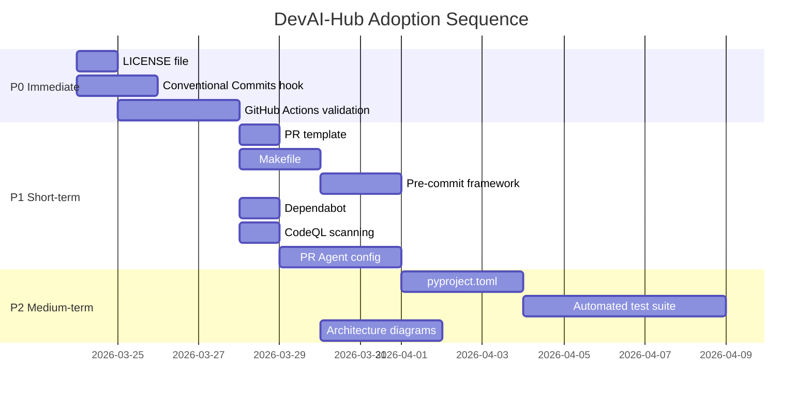

# Cross-Project Comparison: DevAI-Hub vs. OpenViking

**Version**: 0.8.8
**Generated**: 2026-03-23T12:00:00Z
**Analyzer**: Claude Code -- compare-project command
**External Source**: https://github.com/volcengine/OpenViking
**Source Type**: Repository

---

## Section 1: Executive Summary

DevAI-Hub (v0.8.8) and OpenViking (v0.2.9) serve fundamentally different purposes: DevAI-Hub is a modular skill and instruction library for AI coding assistants (Claude Code, Gemini, Copilot, Codex), while OpenViking is a runtime context database for AI agents using a filesystem paradigm (`viking://` protocol). Despite occupying different niches, OpenViking demonstrates mature engineering infrastructure (14 CI/CD workflows, comprehensive test suite, multi-platform Docker builds, PR automation with 15 review rules) that DevAI-Hub can selectively adopt to strengthen its own development practices. The analysis identifies **12 adoption candidates** (3 at P0, 6 at P1, 3 at P2) and confirms **8 strengths** unique to DevAI-Hub that should be preserved. The overall recommendation is **selective adoption** of engineering practices and tooling, not domain features.

---

## Section 2: Project Profiles

| Attribute | DevAI-Hub | OpenViking |
|-----------|-----------|------------|
| **Purpose** | Skill/instruction library for AI coding assistants | Context database for AI agents |
| **Author** | Benjamin Dourthe ([benjamin.dourthe@gmail.com](mailto:benjamin.dourthe@gmail.com)) | ByteDance / VolcEngine |
| **Version** | 0.8.8 (2026-03-20) | 0.2.9 (2026-03-19) |
| **License** | Not specified (no LICENSE file) | Apache 2.0 |
| **Stars** | Private/internal | 18,400+ |
| **Maturity** | Pre-1.0, rapid iteration (v0.8.4 to v0.8.8 in ~6 months) | Pre-1.0 alpha, fast-growing community |
| **Scale** | 162 skills, 29 commands, 11 hooks, 10 agents | 508 commits, 56.7 MB, polyglot monorepo |
| **Primary users** | Developers using AI coding assistants | AI agent builders and researchers |
| **Deployment** | Local installation via cross-platform scripts | Server (Docker, Kubernetes, bare metal) |
| **Community** | GitHub (private/enterprise) | Discord, WeChat, Lark, 1.3k forks |

---

## Section 3: Technology Stack Comparison

| Layer | DevAI-Hub | OpenViking | Notes |
|-------|-----------|------------|-------|
| **Primary languages** | PowerShell, Bash, Markdown | Python 3.10+, Rust 1.88+, Go 1.22+, C++ | OpenViking is a polyglot monorepo; DevAI-Hub is script-driven |
| **Package manager** | pip (report gen only) | uv (primary), pip (fallback) | Both support pip; OpenViking prefers uv |
| **Build system** | None (distribution project) | setup.py + CMake + Cargo + Go build, orchestrated via Makefile | OpenViking needs multi-language build; DevAI-Hub has no build step |
| **Test framework** | Manual verification | pytest + pytest-asyncio + pytest-cov | Significant gap |
| **Linter/formatter** | None | ruff (lint + format), mypy (type check) | Gap for DevAI-Hub's Python scripts |
| **CI/CD** | None | 14 GitHub Actions workflows | Major gap |
| **Container** | None | Docker (multi-stage) + docker-compose | Not directly applicable but useful for report generator |
| **Web framework** | None | FastAPI + Uvicorn | Domain-specific; not applicable |
| **CLI framework** | PowerShell/Bash scripts | Clap (Rust) + Typer (Python) + ratatui (TUI) | Domain-specific; not applicable |
| **VS Code extension** | claude-usage-monitor (TypeScript) | None | DevAI-Hub strength |
| **Pre-commit hooks** | Custom hooks (catalog/hooks/) | .pre-commit-config.yaml (ruff) | DevAI-Hub has more hooks but no standard framework |
| **Dependency scanning** | None | Dependabot (weekly, pip + actions) | Gap |
| **Security scanning** | Custom secret-scan hook | CodeQL (Python + C++), weekly schedule | Different approaches |
| **PR automation** | None | Qodo PR-Agent with 15 custom rules | Gap |
| **Commit convention** | Semantic versioning (changelog) | Conventional Commits (enforced) | Gap in enforcement |
| **Documentation** | Markdown (162 skill files, guides, templates) | Sphinx-ready (en/zh/ja) | DevAI-Hub has more content; OpenViking has better i18n |

---

## Section 4: AI Assistant Configuration Comparison

| Attribute | DevAI-Hub | OpenViking |
|-----------|-----------|------------|
| **`.claude/` directory** | Full structure: skills, commands, hooks, agents, rules, context, memory, MCP configs | Not present |
| **Skills** | 162 curated skills across 20 categories | None (not an AI assistant config project) |
| **Commands** | 29 slash commands with phased Markdown | None |
| **Hooks** | 11 hooks (PreToolUse, Stop, Write) | None |
| **Agents** | 10 specialist agents (architect, code-reviewer, etc.) | None |
| **Rules** | Language-specific coding standards (bash, go, python, typescript) | None |
| **Context files** | architecture.md, decisions.md | None |
| **MCP configs** | mcp-servers.json | None |
| **Instruction templates** | 4 base templates (Claude, Gemini, Codex, generic) with `{{PLACEHOLDER}}` rendering | None |
| **Multi-AI support** | Claude Code, Gemini, GitHub Copilot, Codex | Claude plugin example only |
| **Copilot instructions** | Auto-generated from coding-snippets | None |

**Assessment:** This is DevAI-Hub's core domain and its primary strength. OpenViking is a consumer of AI assistant configuration (it provides a Claude memory plugin example), not a producer. There is nothing to adopt in this dimension; DevAI-Hub is the reference implementation.

---

## Section 5: Skills and Capabilities Gap Analysis

### 5a. Present in OpenViking, Missing in DevAI-Hub (Adoption Candidates)

These are not "skills" in the DevAI-Hub sense but engineering capabilities that could inspire new skills or project improvements:

| Capability | OpenViking Implementation | Potential DevAI-Hub Adoption |
|-----------|--------------------------|------------------------------|
| **Tiered context loading (L0/L1/L2)** | 3-tier abstraction levels for context delivery | Could inspire a skill discovery optimization: L0 skill summaries for quick search, L1 for selection, L2 for full prompt injection |
| **Conventional Commits enforcement** | `.pr_agent.toml` rules, CONTRIBUTING.md | A new hook or command to validate commit messages |
| **PR review automation** | 15 custom review rules covering async safety, memory pipeline, API stability | A new `review-pr` skill or command could incorporate similar structured rule sets |
| **Retrieval trajectory visualization** | Transparent retrieval paths for debugging | Could enhance `/search-skills` with ranked match explanations |
| **Multi-tenant architecture** | Auth, authorization, identity resolution | Not applicable (single-user tool) |

### 5b. Present in DevAI-Hub, Missing in OpenViking (Strengths to Preserve)

| Capability | DevAI-Hub Implementation |
|-----------|--------------------------|
| **162 curated skills** | 20 categories covering AI development, architecture, compliance, security, testing, documentation, and more |
| **29 slash commands** | Phased Markdown structure with YAML frontmatter |
| **11 hooks** | PreToolUse, Stop, Write handlers with cascading enforcement |
| **10 specialist agents** | Architect, code-reviewer, security-reviewer, tdd-guide, and more |
| **Cross-platform installers** | PowerShell (PS1) and Bash (SH) with 4-phase setup |
| **VS Code extension** | Real-time usage monitoring with dashboard panel |
| **Multi-AI-assistant support** | Templates for Claude, Gemini, Copilot, Codex |
| **Instruction template system** | `{{PLACEHOLDER}}` rendering with language-specific snippets |

### 5c. Present in Both, Quality Comparison

| Area | DevAI-Hub | OpenViking | Better |
|------|-----------|------------|--------|
| **Hook system** | 11 custom hooks in `catalog/hooks/` with `settings.json` config | 2 pre-commit hooks via `.pre-commit-config.yaml` | DevAI-Hub (more hooks, richer behavior) but OpenViking (standardized framework) |
| **Code review guidance** | `code-review/` skills (9 skills, 6-step deep dive) | `.pr_agent.toml` with 15 automated review rules | Complementary: DevAI-Hub provides manual review guidance; OpenViking automates it |
| **Security approach** | `secret-scan.sh` hook + `run-security-audit` command (9-phase audit) | CodeQL (SAST) + Dependabot (SCA) + weekly scans | OpenViking (automated, CI-integrated); DevAI-Hub (more comprehensive manual audit) |
| **Documentation** | 250+ Markdown files, 4 examples, guides | Multilingual (EN/CN/JA), Sphinx-ready, architecture docs in `docs/design/` | DevAI-Hub (volume); OpenViking (i18n, structured tooling) |

---

## Section 6: Commands and Automation Comparison

### 6a. Commands Gap

| Area | DevAI-Hub | OpenViking |
|------|-----------|------------|
| **Task runner** | None (manual script execution) | Makefile with build/clean/check-deps/help targets |
| **Slash commands** | 29 commands (`/analyze-codebase`, `/tdd`, `/run-security-audit`, etc.) | None (CLI commands: `ov`, `openviking-server`, `vikingbot`) |
| **Report generation** | `/generate-report` (Word/PPT from Markdown) | None |
| **Skill discovery** | `/search-skills`, `/import-skills` | None |
| **Version management** | `/update-version` (semantic versioning guide) | setuptools_scm (automatic from git tags) |

**Adoption candidate:** A `Makefile` (or equivalent task runner) for DevAI-Hub would centralize common operations: validate skills.json, lint shell scripts, run installer dry-run, rebuild catalog.

### 6b. CI/CD and Hooks Gap

| Area | DevAI-Hub | OpenViking |
|------|-----------|------------|
| **CI/CD workflows** | None | 14 GitHub Actions workflows |
| **PR validation** | None | `pr.yml` (lint + test-lite + conditional build) |
| **Main branch checks** | None | `ci.yml` (full test matrix + CodeQL) |
| **Release pipeline** | Manual changelog + git tag | `release.yml` (auto-build + PyPI publish + Docker push) |
| **Security scanning** | Manual via `/run-security-audit` | Weekly CodeQL (`schedule.yml`) + per-PR analysis |
| **Dependency updates** | Manual | Dependabot (weekly pip + github-actions) |
| **PR automation** | None | Qodo PR-Agent (auto-review, auto-describe, auto-improve) |
| **Docker builds** | None | `build-docker-image.yml` (multi-platform, GHCR push) |
| **Pre-commit framework** | None (custom hooks only) | `.pre-commit-config.yaml` (ruff fix + format) |

**Key gap:** DevAI-Hub has zero CI/CD automation. A minimal GitHub Actions setup would add significant value: skills.json validation, shell script linting (ShellCheck), installer syntax checks, and PR labeling.

---

## Section 7: Documentation and Developer Experience Comparison

| Attribute | DevAI-Hub | OpenViking |
|-----------|-----------|------------|
| **README quality** | Good (117 lines, quick start, what's new, featured skills) | Excellent (comprehensive, 5 core concepts, badges, provider tables, benchmarks) |
| **CHANGELOG** | Detailed semantic versioning (v0.8.4 to v0.8.8) | Not present |
| **CONTRIBUTING** | Present (new in v0.8.8) | Comprehensive (setup, style, testing, CI/CD, commit convention, PR template) |
| **SECURITY.md** | Present (51 lines, vulnerability reporting, scope, SLA) | Not present |
| **CODE_OF_CONDUCT** | Present | Not present |
| **LICENSE** | Not present | Apache 2.0 |
| **Multilingual docs** | English only | English, Chinese, Japanese |
| **Architecture docs** | `.claude/context/architecture.md` | `docs/design/` directory |
| **API docs** | N/A | Sphinx-ready (`doc` optional dependency) |
| **Setup guides** | `guides/` directory, 4 example CLAUDE.md files | CONTRIBUTING.md + README quick start |
| **DEVLOG** | Comprehensive (`docs/DEVLOG.md`, 80+ entries) | Not present |
| **Onboarding** | 4-phase installer with language selection, dry-run mode | `uv sync --all-extras` + config file setup |

**Assessment:** DevAI-Hub has stronger community governance files (SECURITY.md, CODE_OF_CONDUCT, CHANGELOG, DEVLOG) but is missing a LICENSE file. OpenViking has better i18n and a more structured CONTRIBUTING guide with commit conventions and PR templates.

---

## Section 8: Testing and Security Posture Comparison

### Testing

| Attribute | DevAI-Hub | OpenViking |
|-----------|-----------|------------|
| **Automated tests** | None | pytest suite across 15+ test directories |
| **Test types** | Manual installer dry-run | Unit, integration, E2E, edge-case, evaluation (RAGAS) |
| **Async testing** | N/A | pytest-asyncio with `asyncio_mode = "auto"` |
| **Fixture system** | N/A | Rich conftest.py with session/function-scoped fixtures |
| **Coverage** | N/A | `pytest-cov` with `--cov=openviking --cov-report=term-missing` |
| **CI gating** | None | Test-lite on PRs, full matrix on main |
| **Test generation tools** | 19 test generation templates (for user projects) | Manual test writing |

### Security

| Attribute | DevAI-Hub | OpenViking |
|-----------|-----------|------------|
| **Secret scanning** | `secret-scan.sh` (PreToolUse hook, pattern matching) | None (relies on CodeQL for code-level issues) |
| **SAST** | Manual via `/run-security-audit` (9-phase) | CodeQL (Python + C++), automated weekly + per-PR |
| **SCA (dependency)** | Manual via `/run-security-audit` | Dependabot (weekly, pip + github-actions, major version filtering) |
| **Git guardrails** | `git-guardrails.sh` (blocks destructive commands) | None |
| **Vulnerability reporting** | SECURITY.md with 7-day SLA for critical issues | None (no SECURITY.md) |
| **Penetration testing** | `/run-penetration-test` command | None |
| **Large file guard** | `large-file-guard.sh` hook | None |

**Assessment:** DevAI-Hub has more comprehensive security tooling for the AI assistant use case (secret scanning, git guardrails, manual audit commands). OpenViking has better automated security scanning (CodeQL, Dependabot) integrated into CI. These approaches are complementary.

---

## Section 9: Structural and Architectural Differences

| Pattern | DevAI-Hub | OpenViking |
|---------|-----------|------------|
| **Repo type** | Distribution/library (no build step) | Application monorepo (multi-language build) |
| **Organization** | Flat catalog (`catalog/skills/`, `catalog/commands/`) | Layered source (`openviking/client/`, `openviking/server/`, `openviking/core/`) |
| **Config format** | YAML frontmatter in Markdown files | JSON config files (`ov.conf`, `ovcli.conf`) |
| **Versioning** | Manual CHANGELOG updates + git tags | `setuptools_scm` (automatic from git tags) |
| **Asset compilation** | `data/skills.json` rebuilt manually | Native extensions compiled via setup.py + CMake |
| **Installation** | Custom installers (PS1/SH) copy files to `~/.claude/` | pip/uv install from PyPI or source |
| **Plugin architecture** | Skills loaded via file placement | Python entry points + native extensions |
| **Workspace structure** | Single-language directories | Cargo workspace (Rust) + Python packages + Go modules |

**Notable pattern from OpenViking:** The `setuptools_scm` approach to automatic versioning from git tags could reduce manual CHANGELOG maintenance burden. However, DevAI-Hub's manual changelog is more detailed and human-readable, so this is a tradeoff rather than a clear upgrade.

**Notable pattern from OpenViking:** The `.pr_agent.toml` configuration with 15 domain-specific review rules is a sophisticated approach to encoding institutional knowledge into automated PR review. DevAI-Hub could create a similar configuration file for its own PR review process, encoding rules about skill format validation, hook safety, installer compatibility, and documentation consistency.

---

## Section 10: Adoption Plan

### P0: Immediate (High Value, Low-Medium Effort)

| # | What to Adopt | Source Reference | Target Location | Effort | Dependencies | Risk |
|---|--------------|-----------------|----------------|--------|-------------|------|
| 1 | **LICENSE file** | `LICENSE` (Apache 2.0) | `LICENSE` (root) | Low | None | None; required for open-source distribution. Choose appropriate license (Apache 2.0, MIT, or proprietary). |
| 2 | **GitHub Actions: Validation workflow** | `.github/workflows/pr.yml`, `_lint.yml` | `.github/workflows/validate.yml` | Medium | GitHub repo must be configured | Minimal; read-only validation only. Adapt for DevAI-Hub: ShellCheck for shell scripts, JSON schema validation for `data/skills.json`, Markdown link checking. |
| 3 | **Conventional Commits hook** | `CONTRIBUTING.md` (commit convention section) | `catalog/hooks/conventional-commits.sh` or `.github/workflows/` | Low | None | Low; may require existing commit history cleanup. Start enforcing on new commits only. |

### P1: Short-term (High-Medium Value, Low Effort)

| # | What to Adopt | Source Reference | Target Location | Effort | Dependencies | Risk |
|---|--------------|-----------------|----------------|--------|-------------|------|
| 4 | **Dependabot configuration** | `.github/dependabot.yml` | `.github/dependabot.yml` | Low | P2 (GitHub Actions) | None; weekly scans for `extensions/claude-usage-monitor/` (npm) and `scripts/` (pip). |
| 5 | **CodeQL security scanning** | `.github/workflows/_codeql.yml`, `schedule.yml` | `.github/workflows/codeql.yml` | Low | GitHub repo | None; scan Python scripts and TypeScript extension. Weekly schedule. |
| 6 | **Pre-commit framework** | `.pre-commit-config.yaml` | `.pre-commit-config.yaml` (root) | Low | pip install pre-commit | Low; does not replace existing `catalog/hooks/` (those are Claude Code hooks, not git hooks). Adds ShellCheck for scripts, markdownlint for skills. |
| 7 | **Makefile** | `Makefile` | `Makefile` (root) | Low | None | None; targets: `validate` (skills.json schema), `lint` (ShellCheck + markdownlint), `install-dry-run`, `rebuild-catalog`, `clean`. |
| 8 | **PR Agent configuration** | `.pr_agent.toml` (15 review rules) | `.pr_agent.toml` (root) | Low | Qodo PR-Agent GitHub App | Low; adapt rules for DevAI-Hub domain: skill format, hook safety, installer compatibility, documentation consistency. |
| 9 | **PR template** | `CONTRIBUTING.md` (PR guidelines section) | `.github/PULL_REQUEST_TEMPLATE.md` | Low | None | None; standardizes PR descriptions with checklist. |

### P2: Medium-term (Medium Value, Medium Effort)

| # | What to Adopt | Source Reference | Target Location | Effort | Dependencies | Risk |
|---|--------------|-----------------|----------------|--------|-------------|------|
| 10 | **pyproject.toml for report generator** | `pyproject.toml` | `scripts/pyproject.toml` or root `pyproject.toml` | Medium | None | Low; modernizes Python packaging for `generate_report.py`. Adds ruff config, dependency pinning, script entry points. |
| 11 | **Automated test suite** | `tests/` directory structure, `conftest.py` | `tests/` (root) | Medium | P7 (Makefile) | Medium; start with: skills.json schema validation, installer syntax checks (bash -n, PowerShell syntax), hook output testing. Not a full pytest suite for a distribution project. |
| 12 | **Architecture diagrams** | `docs/design/` | `docs/v0.8.8/` or `.claude/context/` | Medium | None | None; Mermaid diagrams for installer flow, skill loading pipeline, hook execution order. |

### Not Recommended for Adoption

| Item | Reason |
|------|--------|
| **Docker/docker-compose** | DevAI-Hub is a local installation tool, not a server application. Container deployment adds complexity without value. |
| **Multi-language build system** | DevAI-Hub has no compiled components. setup.py + CMake + Cargo are OpenViking-specific. |
| **Multilingual README** | High effort for a primarily English-speaking user base. Reconsider if community grows internationally. |
| **Tiered context loading (L0/L1/L2)** | Interesting concept but requires fundamental architecture changes to skill discovery. Better as a future v1.0 consideration. |
| **setuptools_scm** | DevAI-Hub's manual CHANGELOG is more detailed and human-readable. Automatic versioning trades control for convenience. |
| **VikingBot/plugin architecture** | Domain-specific to OpenViking's runtime context model. |

---

## Section 11: Implementation Sequence

Recommended order, accounting for dependencies:

**Dependency chain:**
1. **LICENSE** (independent, do first)
2. **GitHub Actions validation** (depends on LICENSE for repo readiness)
3. **PR template** and **Dependabot** and **CodeQL** (depend on GitHub Actions being set up)
4. **Makefile** (independent but inform pre-commit targets)
5. **Pre-commit framework** (references Makefile targets)
6. **PR Agent** (depends on PR template for context)
7. **pyproject.toml** (independent but informs test suite)
8. **Test suite** (depends on Makefile targets and pyproject.toml)
9. **Architecture diagrams** (independent, do anytime)

---

## Section 12: Risks and Considerations

### Conflicts with Existing Patterns

| Risk | Mitigation |
|------|-----------|
| **Pre-commit hooks vs. Claude Code hooks** | These are separate systems. `.pre-commit-config.yaml` hooks run on `git commit`; `catalog/hooks/` are Claude Code event hooks. Document the distinction clearly. |
| **Makefile vs. PowerShell installers** | Makefile targets complement (not replace) the existing installer scripts. Makefile is for development workflow; installers are for end-user setup. |
| **Conventional Commits vs. current style** | Current commit messages are descriptive but not conventionally formatted. Enforce only on new commits; do not rewrite history. |
| **PR Agent rules vs. manual review** | PR Agent augments manual review, does not replace it. Start with 3-5 rules and expand based on experience. |

### Maintenance Burden

| Item | Ongoing Cost |
|------|-------------|
| **GitHub Actions** | Low (YAML maintenance, occasional runner updates) |
| **Dependabot** | Low (review weekly PRs, merge or dismiss) |
| **CodeQL** | Very low (runs automatically, review findings occasionally) |
| **Pre-commit** | Very low (hook versions pinned, update quarterly) |
| **PR Agent** | Low-medium (tune rules as domain evolves, review auto-suggestions) |
| **Test suite** | Medium (maintain tests as skills/commands change) |

### Explicitly Not Recommended

1. **Do not adopt OpenViking's polyglot build system.** DevAI-Hub is a distribution project with no compiled artifacts. Adding CMake, Cargo, or Go build steps would be pure overhead.

2. **Do not adopt Docker deployment.** DevAI-Hub is installed locally via scripts. A Docker container adds a layer of indirection that conflicts with the project's core value proposition (direct `~/.claude/` file placement).

3. **Do not adopt setuptools_scm automatic versioning.** DevAI-Hub's manual CHANGELOG with detailed Added/Changed/Fixed sections provides more value to users than automatic version bumps. The `/update-version` command already handles version management.

4. **Do not adopt the VikingBot agent framework.** It is specific to OpenViking's context database and has no applicability to DevAI-Hub's skill library model.

5. **Do not adopt multilingual documentation at this time.** The effort-to-value ratio is unfavorable until the project has a significant non-English user base.
