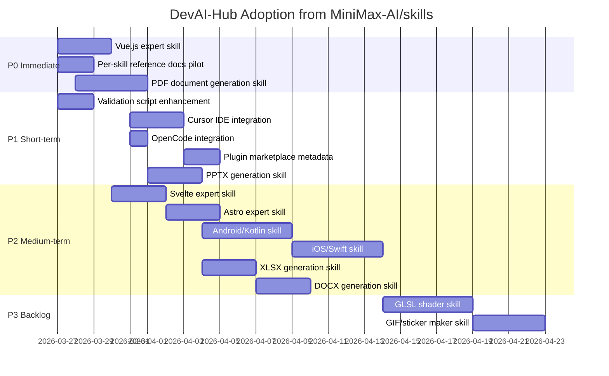

# Cross-Project Comparison: DevAI-Hub vs. MiniMax-AI/skills

**Version**: 0.8.9
**Generated**: 2026-03-26T12:00:00Z
**Analyzer**: Claude Code -- compare-project command
**External Source**: https://github.com/MiniMax-AI/skills
**Source Type**: Repository

---

## Section 1: Executive Summary

DevAI-Hub (v0.8.9) and MiniMax-AI/skills (v1.0.0 beta) both serve as skill libraries for AI coding assistants, but they occupy opposite ends of the breadth-vs-depth spectrum: DevAI-Hub provides 163 skills across 22 categories with an enterprise-horizontal focus (compliance, security, orchestration, architecture, testing), while MiniMax provides 16 skills with deep vertical expertise in frontend development, mobile (Android/iOS), graphics (GLSL shaders), and document generation (PDF, PPTX, XLSX, DOCX). The analysis identifies **17 adoption candidates** (3 at P0, 5 at P1, 6 at P2, 3 at P3) and confirms **10 strengths** unique to DevAI-Hub that should be preserved. The overall recommendation is **selective adoption** of domain skills that fill clear coverage gaps (frontend frameworks, mobile development, document generation) and structural patterns (per-skill reference documentation, plugin marketplace metadata, additional IDE integrations).

---

## Section 2: Project Profiles

| Attribute | DevAI-Hub | MiniMax-AI/skills |
|-----------|-----------|-------------------|
| **Purpose** | Modular skill/instruction library for AI coding assistants | Plug-and-play skills for AI coding tools with deep domain expertise |
| **Author** | Benjamin Dourthe ([benjamin.dourthe@gmail.com](mailto:benjamin.dourthe@gmail.com)) | MiniMax |
| **Version** | 0.8.9 (2026-03-23) | 1.0.0 (Beta) |
| **License** | MIT | MIT |
| **Maturity** | Pre-1.0, rapid iteration (v0.8.1 to v0.8.9) | Beta, actively under development |
| **Scale** | 163 skills, 29 commands, 11 hooks, 10 agents | 16 skills (10 public + 1 internal + 5 plugin sub-skills) |
| **Primary users** | Developers using AI coding assistants across enterprise workflows | Developers building frontend, mobile, and document-heavy applications |
| **Deployment** | Local installation via cross-platform scripts (PS1/SH) | Manual clone or `claude plugin marketplace add` |
| **AI assistant support** | Claude Code, Gemini, Copilot, Codex | Claude Code, Cursor, Codex, OpenCode |
| **Community** | Private/enterprise | GitHub (public, MIT), multilingual (EN + CN) |
| **Repository size** | ~250+ Markdown files, scripts, extensions | 385 files, 16 MB, 172 Markdown files |

---

## Section 3: Technology Stack Comparison

| Layer | DevAI-Hub | MiniMax-AI/skills | Notes |
|-------|-----------|-------------------|-------|
| **Primary languages** | PowerShell, Bash, Python, Markdown | Python, JavaScript/TypeScript, Kotlin, Swift, GLSL, C#/.NET, Bash | MiniMax covers more runtime languages due to domain-specific skills |
| **Package manager** | pip (report gen only) | npm, pip, Gradle, dotnet CLI | MiniMax has multi-ecosystem package management |
| **Build system** | None (distribution project) | None (skill library) | Both are distribution projects |
| **Test framework** | Manual verification via installer dry-run | Manual QA checklists per skill, `validate_skills.py` for structural checks | Neither has automated tests |
| **Linter/formatter** | ShellCheck, commitizen (pre-commit) | None configured | DevAI-Hub has linting; MiniMax does not |
| **CI/CD** | Pre-commit hooks (shellcheck, commitizen) | None | Neither has GitHub Actions workflows |
| **Validation** | `secret-scan.sh` hook (pattern matching) | `validate_skills.py` (YAML validation, required fields, secret scanning) | Complementary approaches |
| **VS Code extension** | claude-usage-monitor (TypeScript) | None | DevAI-Hub strength |
| **MCP server** | devai-skill-server (Python) | None | DevAI-Hub strength |
| **Template engine** | `{{PLACEHOLDER}}` rendering system | None (direct file placement) | DevAI-Hub supports multi-AI from one source |
| **Installer** | Cross-platform (PS1 + SH) | Manual clone + symlink per platform | DevAI-Hub has more sophisticated distribution |
| **Skill discovery** | Tiered (L0/L1/L2) with MCP search | Trigger keywords in SKILL.md frontmatter | Different approaches, both effective |

---

## Section 4: AI Assistant Configuration Comparison

| Attribute | DevAI-Hub | MiniMax-AI/skills |
|-----------|-----------|-------------------|
| **`.claude/` directory** | Full structure: skills, commands, hooks, agents, rules, context, memory, MCP configs | Minimal: 1 internal skill (`pr-review`) with validation script |
| **Skills** | 163 curated skills across 22 categories | 10 public skills + 1 internal + 5 plugin sub-skills |
| **Commands** | 29 slash commands with phased Markdown | None |
| **Hooks** | 11 hooks (PreToolUse, Stop, Write) | None |
| **Agents** | 10 specialist agents | None |
| **Rules** | Language-specific coding standards (bash, go, python, typescript) | None |
| **Context files** | architecture.md, decisions.md | None |
| **MCP configs** | mcp-servers.json with devai-skill-server | None |
| **Instruction templates** | 4 base templates (Claude, Gemini, Codex, generic) with `{{PLACEHOLDER}}` rendering | None (skills are used directly) |
| **Multi-AI support** | Claude Code, Gemini, GitHub Copilot, Codex (via template rendering) | Claude Code, Cursor, Codex, OpenCode (via separate config directories) |
| **Plugin marketplace** | Not present | `.claude-plugin/marketplace.json` for Claude marketplace discovery |
| **Cursor integration** | Not present | `.cursor-plugin/plugin.json` with skills directory mapping |
| **OpenCode integration** | Not present | `.opencode/INSTALL.md` with symlink-based registration |
| **Skill metadata** | YAML frontmatter with `summary_l0`, `overview_l1`, category, triggers | YAML frontmatter with `name`, `description`, `license`, `metadata` |
| **Per-skill reference docs** | Self-contained skill files (avg ~585 lines) | `references/` subdirectory with deep domain guides (172 files total) |
| **Skill depth** | Broad coverage, standardized format | Deep domain expertise with extensive reference material per skill |

**Assessment:** DevAI-Hub is the more mature and feature-rich AI assistant configuration, with commands, hooks, agents, rules, MCP, and template rendering that MiniMax lacks entirely. However, MiniMax demonstrates three patterns worth adopting: (1) a plugin marketplace manifest for external discovery, (2) Cursor and OpenCode IDE integration, and (3) per-skill reference documentation directories for deep-domain skills.

---

## Section 5: Skills and Capabilities Gap Analysis

### 5a. Present in MiniMax, Missing in DevAI-Hub (Adoption Candidates)

| Capability | MiniMax Implementation | Potential DevAI-Hub Adoption |
|-----------|------------------------|------------------------------|
| **Vue.js development** | Part of `frontend-dev` skill (Vue/Nuxt alongside React/Next.js) | New `catalog/skills/framework-specialists/vue-expert/SKILL.md`. DevAI-Hub has React and Next.js experts but no Vue. Vue is the 2nd most-used frontend framework. |
| **Svelte development** | Part of `frontend-dev` skill (Svelte/SvelteKit) | New `catalog/skills/framework-specialists/svelte-expert/SKILL.md`. Growing framework, lower priority than Vue. |
| **Astro development** | Part of `frontend-dev` skill (Astro) | New `catalog/skills/framework-specialists/astro-expert/SKILL.md`. Growing framework for content-heavy sites. |
| **Cinematic UI animation** | `frontend-dev` with Framer Motion, GSAP, Three.js, p5.js recipes and motion matrix | New `catalog/skills/developer-experience/ui-animation-patterns/SKILL.md` covering Framer Motion, GSAP, CSS animations, and scroll-driven animations. |
| **Android/Kotlin native** | `android-native-dev` skill with Material Design 3, Jetpack Compose, Gradle config, accessibility | New `catalog/skills/specialized-domains/android-development/SKILL.md` or `language-specialists/kotlin-expert/SKILL.md`. DevAI-Hub has zero mobile skills. |
| **iOS/Swift native** | `ios-application-dev` skill with UIKit, SwiftUI, SnapKit, Apple HIG compliance | New `catalog/skills/specialized-domains/ios-development/SKILL.md` or `language-specialists/swift-expert/SKILL.md`. DevAI-Hub has zero mobile skills. |
| **GLSL shader development** | `shader-dev` with 36 techniques (ray marching, SDF, fluid simulation, lighting, post-processing) | New `catalog/skills/specialized-domains/glsl-shader-development/SKILL.md`. Very niche but deeply technical. |
| **PDF document generation** | `minimax-pdf` with 3 pipelines (CREATE, FILL, REFORMAT), 15 cover styles, token-based design | New `catalog/skills/specialized-domains/pdf-document-generation/SKILL.md`. Common developer need; adapt for Python (ReportLab, WeasyPrint) and JS (Puppeteer, PDFKit). |
| **PPTX generation** | `pptx-generator` with PptxGenJS, CREATE/EDIT/READ pipelines, design system | New `catalog/skills/specialized-domains/pptx-generation/SKILL.md`. Business presentation generation. |
| **XLSX generation** | `minimax-xlsx` with pandas, XML templates, CREATE/READ/EDIT/VALIDATE pipelines | New `catalog/skills/specialized-domains/xlsx-generation/SKILL.md`. Spreadsheet and financial model creation. |
| **DOCX generation** | `minimax-docx` with OpenXML SDK (.NET), CREATE/FILL/FORMAT-APPLY pipelines | New `catalog/skills/specialized-domains/docx-generation/SKILL.md`. Professional document creation. |
| **GIF/sticker maker** | `gif-sticker-maker` with MiniMax Image + Video API, Funko Pop style conversion | Niche; depends on proprietary API. Would need generalization for multiple providers. |
| **Per-skill reference docs** | `references/` subdirectory per skill (172 files total with deep domain guides) | Adopt as convention: `catalog/skills/*/references/` for deep-domain skills that benefit from supplementary guides (framework specialists, mobile, document generation). |
| **Plugin marketplace manifest** | `.claude-plugin/marketplace.json` with version, category, installation metadata | Extend `data/skills.json` or create `data/marketplace.json` for external tool discovery. |
| **Cursor IDE integration** | `.cursor-plugin/plugin.json` with skills directory mapping | Add Cursor as 5th platform via template system or `configs/cursor/` output. |
| **OpenCode integration** | `.opencode/INSTALL.md` with symlink-based skill registration | Add OpenCode as 6th platform via template system or `configs/opencode/` output. |

### 5b. Present in DevAI-Hub, Missing in MiniMax (Strengths to Preserve)

| Capability | DevAI-Hub Implementation |
|-----------|--------------------------|
| **163 curated skills across 22 categories** | Enterprise-grade coverage: compliance (9 skills), security (7), orchestration (14), architecture (6), testing (2 + 19 test generation), code review (9), infrastructure (16), and more |
| **29 slash commands** | Phased Markdown structure with YAML frontmatter (`/analyze-codebase`, `/tdd`, `/run-security-audit`, `/compare-project`, etc.) |
| **11 hooks** | PreToolUse, Stop, Write handlers with cascading enforcement (`secret-scan.sh`, `git-guardrails.sh`, `large-file-guard.sh`, `format-bash-description.py`, etc.) |
| **10 specialist agents** | Architect, code-reviewer, security-reviewer, tdd-guide, refactor-cleaner, and more |
| **Cross-platform installers** | PowerShell (PS1) and Bash (SH) with 4-phase setup, language selection, dry-run mode |
| **VS Code extension** | claude-usage-monitor with real-time dashboard panel |
| **MCP skill server** | devai-skill-server with keyword search, category browsing, and bundle tools |
| **Instruction template system** | `{{PLACEHOLDER}}` rendering for Claude, Gemini, Copilot, Codex from single source |
| **Tiered skill discovery** | L0 summaries, L1 overviews, L2 full content with MCP search integration |
| **CHANGELOG, DEVLOG, SECURITY.md** | Community governance and development history that MiniMax lacks |

### 5c. Present in Both, Quality Comparison

| Area | DevAI-Hub | MiniMax-AI/skills | Better |
|------|-----------|-------------------|--------|
| **Frontend development** | `react-expert` + `nextjs-expert` (2 skills, framework-focused) | `frontend-dev` (1 skill covering React, Vue, Svelte, Astro + cinematic animations, AI media, generative art) | MiniMax (broader framework coverage + animation depth); DevAI-Hub (deeper per-framework guidance) |
| **Secret scanning** | `secret-scan.sh` hook (runtime enforcement, PreToolUse) | `validate_skills.py` (pre-validation, 14 file types, 3 pattern types) | DevAI-Hub (runtime enforcement is stronger); MiniMax patterns could supplement DevAI-Hub's regex set |
| **Skill metadata** | YAML frontmatter with `summary_l0`, `overview_l1`, category, triggers | YAML frontmatter with `name`, `description`, `license`, `metadata` | DevAI-Hub (tiered summaries enable better discovery); MiniMax (explicit license field per skill is good practice) |
| **Multi-AI support** | Template rendering (1 source, 4 outputs) | Separate config directories (5 platforms) | DevAI-Hub (architecturally superior, maintainable); MiniMax (more platforms covered) |
| **Skill documentation** | Self-contained skill files averaging ~585 lines | Shorter SKILL.md + rich `references/` subdirectories (172 supplementary docs) | Complementary: DevAI-Hub is self-contained and consistent; MiniMax separates core instruction from deep reference material |
| **Validation** | Pre-commit hooks (shellcheck, commitizen) + runtime secret scanning | Python script with YAML parsing, required field validation, secret detection | DevAI-Hub (broader CI tooling); MiniMax (more thorough structural validation of skills specifically) |

---

## Section 6: Commands and Automation Comparison

### 6a. Commands Gap

| Area | DevAI-Hub | MiniMax-AI/skills |
|------|-----------|-------------------|
| **Slash commands** | 29 commands (`/analyze-codebase`, `/tdd`, `/run-security-audit`, `/compare-project`, etc.) | None |
| **Task runner** | None (commands serve this role within Claude Code) | None |
| **Report generation** | `/generate-report` (Word/PPT from Markdown) | None |
| **Skill discovery** | `/search-skills`, `/import-skills` with MCP backend | None |
| **Version management** | `/update-version` (5-phase orchestrator) | None |
| **Code review** | `/review-codebase` (6-section senior review) | Internal `pr-review` skill with `validate_skills.py` |
| **Skill validation** | None (hooks handle enforcement) | `validate_skills.py` (structural + secret scanning) |

**Adoption candidate:** MiniMax's `validate_skills.py` approach to structural skill validation (required YAML fields, directory naming, file structure) could be adopted as a dedicated validation command or integrated into the existing hook system.

### 6b. CI/CD and Hooks Gap

| Area | DevAI-Hub | MiniMax-AI/skills |
|------|-----------|-------------------|
| **Pre-commit framework** | `.pre-commit-config.yaml` (shellcheck, commitizen) | None |
| **Claude Code hooks** | 11 hooks in `catalog/hooks/` + `settings.json` config | None |
| **CI/CD workflows** | None (GitHub Actions) | None (GitHub Actions) |
| **PR review process** | Manual via `/review-codebase` | Semi-automated via `pr-review` skill + `validate_skills.py` |
| **Secret scanning** | `secret-scan.sh` (runtime hook) | `validate_skills.py` (pre-validation script) |
| **Structural validation** | None (skills assumed well-formed) | `validate_skills.py` validates YAML frontmatter, required fields, directory naming |

**Key observation:** Neither project has GitHub Actions CI/CD. MiniMax's `validate_skills.py` with its structural validation (YAML parsing, required fields, naming conventions, secret detection) is a well-designed single-script approach that could enhance DevAI-Hub's existing hook-based validation.

---

## Section 7: Documentation and Developer Experience Comparison

| Attribute | DevAI-Hub | MiniMax-AI/skills |
|-----------|-----------|-------------------|
| **README quality** | Good (project overview, quick start, featured skills, what's new) | Good (skill table with descriptions, 4-platform installation guides, badges) |
| **CHANGELOG** | Detailed semantic versioning (v0.8.1 to v0.8.9) | None |
| **CONTRIBUTING** | Present | Present (5636 bytes, PR requirements, skill structure, guidelines) |
| **SECURITY.md** | Present (vulnerability reporting, scope, SLA) | None |
| **CODE_OF_CONDUCT** | Present | None |
| **LICENSE** | MIT | MIT |
| **Multilingual docs** | English only | English + Chinese (README_zh.md) |
| **Architecture docs** | `.claude/context/architecture.md` | None |
| **DEVLOG** | Comprehensive (`docs/DEVLOG.md`, 80+ entries) | None |
| **Per-skill reference docs** | None (self-contained skills) | `references/` subdirectory per skill (172 files total) |
| **Troubleshooting** | None per-skill | Per-skill troubleshooting guides (shader-dev, minimax-docx, android-native-dev, frontend-dev) |
| **Onboarding** | 4-phase installer with language selection, dry-run | Manual clone + 4 platform-specific install guides |
| **Setup guides** | `guides/` directory, 4 example CLAUDE.md files | `.codex/INSTALL.md`, `.opencode/INSTALL.md` |
| **QA checklists** | None per-skill | Per-skill QA checklists (frontend-dev: 16 items, android-native-dev: 17 items) |

**Assessment:** DevAI-Hub has stronger community governance (CHANGELOG, DEVLOG, SECURITY.md, CODE_OF_CONDUCT) and a more polished installation experience. MiniMax excels at per-skill depth with dedicated reference directories, troubleshooting guides, and QA checklists that accompany each skill. The per-skill reference pattern and multilingual support are worth considering for adoption.

---

## Section 8: Testing and Security Posture Comparison

### Testing

| Attribute | DevAI-Hub | MiniMax-AI/skills |
|-----------|-----------|-------------------|
| **Automated tests** | None | None |
| **Structural validation** | Pre-commit hooks (shellcheck, commitizen) | `validate_skills.py` (YAML, required fields, naming, secrets) |
| **Manual testing** | Installer dry-run | Per-skill QA checklists (16-17 items per skill) |
| **Test generation skills** | 19 test generation skills (for user projects) | None |
| **CI gating** | None | None |

### Security

| Attribute | DevAI-Hub | MiniMax-AI/skills |
|-----------|-----------|-------------------|
| **Secret scanning** | `secret-scan.sh` (PreToolUse hook, runtime) | `validate_skills.py` (pre-validation, 14 file types, 3 patterns: OpenAI keys, AWS keys, bearer tokens) |
| **Git guardrails** | `git-guardrails.sh` (blocks destructive commands) | None |
| **Large file guard** | `large-file-guard.sh` hook | None |
| **Vulnerability reporting** | SECURITY.md with 7-day SLA for critical issues | None |
| **Penetration testing** | `/run-penetration-test` command | None |
| **Security audit** | `/run-security-audit` (9-phase) | None |
| **Credentials management** | Environment variables (installer handles) | Environment variables (per-skill `os.getenv` pattern) |
| **Dependency scanning** | None automated | None automated |
| **SAST** | Manual via commands | None |

**Assessment:** DevAI-Hub has a significantly more comprehensive security posture with runtime hooks, dedicated commands, and community governance. MiniMax's `validate_skills.py` secret patterns (OpenAI keys, AWS keys, bearer tokens) could supplement DevAI-Hub's existing regex set in `secret-scan.sh`.

---

## Section 9: Structural and Architectural Differences

| Pattern | DevAI-Hub | MiniMax-AI/skills |
|---------|-----------|-------------------|
| **Repo type** | Distribution/library (no build step) | Distribution/library (no build step) |
| **Organization** | Categorized catalog (`catalog/skills/<category>/<skill>/`) with 22 categories | Flat skills directory (`skills/<skill>/`) with no category nesting |
| **Skill format** | Self-contained SKILL.md files (~585 lines avg) with tiered summaries | Shorter SKILL.md + `references/` subdirectory with supplementary docs |
| **Skill metadata** | YAML frontmatter: summary_l0, overview_l1, category, triggers | YAML frontmatter: name, description, license, metadata |
| **Distribution** | Template rendering (`{{PLACEHOLDER}}`) to 4 AI assistant formats | Separate config directories per platform (`.claude-plugin/`, `.cursor-plugin/`, `.codex/`, `.opencode/`) |
| **Discovery** | MCP server + compiled `skills.json` + SKILL_INDEX.md | Trigger keywords in SKILL.md frontmatter + plugin marketplace manifest |
| **Config format** | `settings.json` for hooks + YAML frontmatter in Markdown | `plugin.json` for IDE integration + YAML frontmatter in Markdown |
| **Installation** | Automated cross-platform installers (PS1/SH) | Manual clone + symlink or marketplace command |
| **Plugin system** | Skills loaded via installer file placement | `.claude-plugin/marketplace.json` for Claude marketplace + IDE plugin configs |
| **Compiled catalog** | `data/skills.json` rebuilt by `build_skills_catalog.py` | None (filesystem-based discovery) |
| **Versioning** | Manual CHANGELOG updates + git tags | Semantic version in plugin.json |
| **Extension points** | MCP server, VS Code extension | Plugin sub-skills (`plugins/pptx-plugin/` with 5 sub-skills) |

**Notable pattern from MiniMax:** The plugin architecture with `marketplace.json` enables external tool discovery without requiring users to browse the repository. DevAI-Hub's MCP skill server serves a similar function but only within Claude Code sessions. A marketplace manifest would extend discoverability to the broader ecosystem.

**Notable pattern from MiniMax:** The per-skill `references/` directory pattern cleanly separates core instruction (what the AI should do) from deep reference material (domain-specific guides, troubleshooting, QA checklists). This avoids bloating the main SKILL.md while still making expert-level content available. DevAI-Hub's self-contained approach is simpler and more consistent, but the reference pattern would benefit deep-domain skills where 585 lines is insufficient.

**Notable pattern from MiniMax:** The `plugins/` directory with sub-skills (5 PPTX sub-skills orchestrated by a parent skill) is a modular composition pattern. DevAI-Hub's orchestration skills serve a similar purpose but at a different abstraction level. This specific pattern is not recommended for adoption as DevAI-Hub's flat skill structure is simpler and more maintainable.

---

## Section 10: Adoption Plan

### P0: Immediate (High Value, Low-Medium Effort)

| # | What to Adopt | Source Reference | Target Location | Effort | Dependencies | Risk |
|---|--------------|-----------------|----------------|--------|-------------|------|
| 1 | **Vue.js expert skill** | MiniMax `skills/frontend-dev/` (Vue/Nuxt sections) | `catalog/skills/framework-specialists/vue-expert/SKILL.md` | Medium | None; use `react-expert` as template | None; fills clear gap in 2nd most popular frontend framework |
| 2 | **Per-skill reference documentation pattern** | MiniMax `skills/*/references/` (172 files) | Convention: `catalog/skills/*/references/` starting with 3-5 pilot skills | Low | None | Low; opt-in pattern, does not change existing skills. Pilot with `react-expert`, `nextjs-expert`, `fastapi-expert` |
| 3 | **PDF document generation skill** | MiniMax `skills/minimax-pdf/` (3 pipelines, 15 cover styles) | `catalog/skills/specialized-domains/pdf-document-generation/SKILL.md` | Medium | None | Low; adapt for multi-language (Python ReportLab/WeasyPrint, JS Puppeteer/PDFKit) instead of MiniMax-specific API |

### P1: Short-term (High-Medium Value, Medium Effort)

| # | What to Adopt | Source Reference | Target Location | Effort | Dependencies | Risk |
|---|--------------|-----------------|----------------|--------|-------------|------|
| 4 | **Cursor IDE integration** | MiniMax `.cursor-plugin/plugin.json` | Extend template system for Cursor output or `configs/cursor/` | Medium | None | Low; Cursor is a major AI IDE. Template system may need new placeholder for Cursor-specific format |
| 5 | **Plugin marketplace metadata** | MiniMax `.claude-plugin/marketplace.json` | Extend `data/skills.json` with marketplace-compatible fields or create `data/marketplace.json` | Medium | None | Low; incremental extension of existing catalog. Enables external tool discovery |
| 6 | **PPTX document generation skill** | MiniMax `skills/pptx-generator/` (PptxGenJS, design system) | `catalog/skills/specialized-domains/pptx-generation/SKILL.md` | Medium | None | Low; adapt for Python (python-pptx) and JS (PptxGenJS) |
| 7 | **OpenCode integration** | MiniMax `.opencode/INSTALL.md` | Extend template system for OpenCode or `configs/opencode/` | Low | None | None; minimal effort for emerging platform |
| 8 | **Validation script enhancement** | MiniMax `.claude/skills/pr-review/scripts/validate_skills.py` | Enhance existing hooks or add `scripts/validate_skills.py` | Low | None | Low; add structural validation (YAML field completeness, directory naming) to complement existing secret scanning |

### P2: Medium-term (Medium Value, Medium-High Effort)

| # | What to Adopt | Source Reference | Target Location | Effort | Dependencies | Risk |
|---|--------------|-----------------|----------------|--------|-------------|------|
| 9 | **Android/Kotlin development skill** | MiniMax `skills/android-native-dev/` (Material Design 3, Jetpack Compose) | `catalog/skills/specialized-domains/android-development/SKILL.md` | High | None | Medium; new platform domain requires deep Kotlin/Android expertise to write at DevAI-Hub quality |
| 10 | **iOS/Swift development skill** | MiniMax `skills/ios-application-dev/` (UIKit, SwiftUI, SnapKit) | `catalog/skills/specialized-domains/ios-development/SKILL.md` | High | None | Medium; same rationale as Android. Requires UIKit/SwiftUI expertise |
| 11 | **Svelte expert skill** | MiniMax `skills/frontend-dev/` (Svelte/SvelteKit sections) | `catalog/skills/framework-specialists/svelte-expert/SKILL.md` | Medium | P0-1 (Vue expert establishes pattern) | None; lower demand than Vue |
| 12 | **Astro expert skill** | MiniMax `skills/frontend-dev/` (Astro sections) | `catalog/skills/framework-specialists/astro-expert/SKILL.md` | Medium | P0-1 (Vue expert establishes pattern) | None; content-site focused framework |
| 13 | **XLSX document generation skill** | MiniMax `skills/minimax-xlsx/` (pandas, XML templates) | `catalog/skills/specialized-domains/xlsx-generation/SKILL.md` | Medium | None | Low; adapt for Python (openpyxl, pandas) and JS (ExcelJS) |
| 14 | **DOCX document generation skill** | MiniMax `skills/minimax-docx/` (OpenXML SDK) | `catalog/skills/specialized-domains/docx-generation/SKILL.md` | Medium | None | Low; adapt for Python (python-docx) and JS approaches |

### P3: Backlog (Lower Value or High Effort)

| # | What to Adopt | Source Reference | Target Location | Effort | Dependencies | Risk |
|---|--------------|-----------------|----------------|--------|-------------|------|
| 15 | **GLSL shader development skill** | MiniMax `skills/shader-dev/` (36 techniques) | `catalog/skills/specialized-domains/glsl-shader-development/SKILL.md` | High | None | Medium; very niche domain with small user base. Only adopt if user demand emerges |
| 16 | **GIF/sticker maker skill** | MiniMax `skills/gif-sticker-maker/` | `catalog/skills/specialized-domains/gif-sticker-maker/SKILL.md` | High | None | High; tightly coupled to MiniMax proprietary API. Would need generalization for other providers (DALL-E, Stable Diffusion) |
| 17 | **Multilingual support (Chinese)** | MiniMax `README_zh.md`, skill caption translations | `README_zh.md`, skill metadata translations | Very High | None | Medium; large ongoing maintenance burden for uncertain value. Reconsider if community grows internationally |

### Not Recommended for Adoption

| Item | Reason |
|------|--------|
| **MiniMax API integration** | Vendor-specific. DevAI-Hub is provider-agnostic. Skills should use generic tool/library references. |
| **Separate platform output directories** | DevAI-Hub's template rendering system (`{{PLACEHOLDER}}`) is architecturally superior: one source, multiple outputs. Copying separate directory trees per platform would be a regression in maintainability. |
| **Flat skill organization** | DevAI-Hub's 22-category hierarchical structure is essential for organizing 163+ skills. MiniMax's flat `skills/` directory works for 10 skills but would not scale. |
| **Plugin sub-skill pattern** | MiniMax's `plugins/pptx-plugin/` with 5 sub-skills orchestrated by a parent is interesting but adds structural complexity. DevAI-Hub's orchestration skills achieve the same composability at a simpler abstraction level. |
| **Token-budget-aware file sizing** | MiniMax explicitly sizes files to fit context windows. DevAI-Hub's tiered loading (L0/L1/L2) is a more elegant solution to the same problem, loading only the depth needed. |

---

## Section 11: Implementation Sequence

Recommended order, accounting for dependencies:

**Dependency chains:**

1. **Framework expansion chain:** Vue.js expert (P0) establishes the pattern for Svelte (P2) and Astro (P2). Use `react-expert` as the template.
2. **Document generation chain:** PDF generation (P0) establishes the pattern for PPTX (P1), XLSX (P2), and DOCX (P2). Each must be adapted for multi-language (Python + JS) rather than MiniMax-specific APIs.
3. **Platform integration chain:** Cursor (P1) and OpenCode (P1) can proceed independently. Plugin marketplace metadata (P1) should follow Cursor integration to inform the metadata schema.
4. **Mobile skills:** Android (P2) and iOS (P2) are independent high-effort items that can start anytime after P1 completes.

---

## Section 12: Risks and Considerations

### Adoption Risks

| Risk | Severity | Mitigation |
|------|----------|------------|
| **Domain expertise gap for mobile skills** | Medium | Android/Kotlin and iOS/Swift skills require deep platform expertise to write at DevAI-Hub quality. Do not create shallow copies of MiniMax's instructions; instead, allocate time for thorough research or engage domain experts. |
| **MiniMax API coupling in document skills** | Low | MiniMax's PDF, PPTX, and DOCX skills reference MiniMax-specific APIs. DevAI-Hub versions must be rewritten for generic libraries (ReportLab, python-pptx, python-docx, PptxGenJS, PDFKit). |
| **Reference docs maintenance burden** | Low | Adding `references/` directories to all 163 skills would be impractical. Limit to deep-domain skills (framework specialists, mobile, document generation) where the main SKILL.md is insufficient. |
| **Template system complexity for new platforms** | Low | Adding Cursor and OpenCode output may require new template placeholders or rendering logic. The existing `{{PLACEHOLDER}}` system should accommodate this, but test thoroughly. |
| **Skill count inflation** | Low | Adding 8-12 new skills increases the catalog from 163 to ~175. Ensure each skill meets the quality bar and does not overlap with existing skills. |

### Items Not Recommended with Reasoning

| Item | Why Not |
|------|---------|
| **Flat skill directory** | DevAI-Hub's categorized structure is essential at 163+ skills. MiniMax's flat structure only works because they have 10 skills. |
| **Separate platform directories** | Template rendering from one source is architecturally superior. Maintaining separate directories per platform creates sync drift. |
| **MiniMax API skills** | Vendor lock-in. DevAI-Hub skills should be provider-agnostic, recommending libraries and patterns rather than specific APIs. |
| **Chinese translation** | High ongoing maintenance burden (163 skills, 29 commands, all documentation) for uncertain ROI. Reconsider only if international community demand is demonstrated. |
| **Token-budget file splitting** | DevAI-Hub's L0/L1/L2 tiered loading already solves context window management more elegantly than manually splitting files by size. |

### Strengths to Actively Preserve

DevAI-Hub's core advantages over MiniMax should not be diluted by adoption:

1. **Enterprise breadth**: 22 categories covering compliance, security, orchestration, and architecture that MiniMax does not touch
2. **Command system**: 29 phased commands provide structured workflows that MiniMax entirely lacks
3. **Hook enforcement**: Runtime hooks (secret scanning, git guardrails, large file guard) provide defense-in-depth
4. **Template rendering**: One-source multi-output is superior to per-platform directory duplication
5. **Tiered discovery**: L0/L1/L2 with MCP search is more sophisticated than keyword triggers
6. **Installer experience**: Cross-platform automated installation vs manual clone-and-symlink
