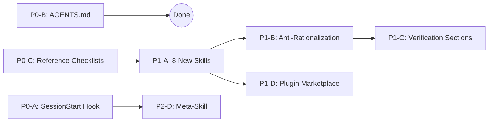

# Cross-Project Comparison: DevAI-Hub vs. agent-skills

**Version**: v0.9.2
**Generated**: 2026-04-06T21:46:31Z
**Analyzer**: Claude Code — compare-project command
**External Source**: https://github.com/addyosmani/agent-skills
**Source Type**: Repository

---

## Section 1: Executive Summary

DevAI-Hub (v0.9.2) and Addy Osmani's agent-skills are both production-grade AI coding assistant enhancement frameworks, but they differ sharply in scope and philosophy: DevAI-Hub is a broad-coverage catalog (175 skills, 32 commands, multi-IDE support, MCP server, CI/CD pipeline) while agent-skills is a tightly focused SDLC-lifecycle system (20 skills, 7 commands, pure Markdown, tool-agnostic).

The comparison surfaces **11 adoption candidates** across 4 priority tiers. The most valuable items to bring into DevAI-Hub are not skills but rather *skill anatomy improvements* — agent-skills embeds anti-rationalization tables and binary verification criteria into every skill file, a pattern that would significantly raise the quality bar of DevAI-Hub's existing 175 skills. The second highest-value gap is **8 new functional skills** covering the Define and Ship phases of the SDLC (idea-refine, spec-driven-development, incremental-implementation, context-engineering, frontend-ui-engineering, browser-testing-with-devtools, code-simplification, shipping-and-launch). Infrastructure gaps (SessionStart hook, AGENTS.md, reference checklists, plugin marketplace distribution) round out the P0/P1 items.

DevAI-Hub's strengths — depth of domain coverage, MCP discoverability, VS Code integration, full CI/CD, hook test suite, multi-IDE permission system — are decisive advantages that agent-skills does not approach. The recommendation is **selective adoption**: adopt agent-skills' quality patterns and SDLC-gap skills; preserve and protect DevAI-Hub's architectural investments.

---

## Section 2: Project Profiles

| Attribute | DevAI-Hub | agent-skills |
|---|---|---|
| **Author/Owner** | Benjamin Dourthe ([benjamin.dourthe@gmail.com](mailto:benjamin.dourthe@gmail.com)) | Addy Osmani |
| **Version** | 0.9.2 (2026-04-06) | 1.0.0 (2026-04-06) |
| **License** | MIT | MIT |
| **Tagline** | "Production-Grade Brain Upgrades for Your AI Coding Assistant" | "Production-grade engineering skills for AI coding agents — covering the full software development lifecycle from spec to ship" |
| **Core Philosophy** | Depth-first catalog: cover every engineering domain with specialized skills, commands, and hooks | SDLC-first lifecycle: cover every phase of the development workflow with quality-gated skills |
| **Scale** | 18,162 files; 175 skills; 32 commands; 12 hooks; 10 agents | 87 files; 20 skills; 7 commands; 2 hooks; 3 agent personas |
| **Distribution** | Shell + PowerShell installers; MCP server | Claude Code plugin marketplace (`claude plugin install`) |
| **IDE Support** | Claude Code, GitHub Copilot, Gemini, OpenAI Codex (with permission configs) | Claude Code, Cursor, Gemini CLI, Windsurf, GitHub Copilot, any (tool-agnostic Markdown) |
| **Runtime Infrastructure** | MCP server (Python), VS Code extension (TypeScript) | None (pure documentation) |
| **CI/CD** | Full: validation pipeline + CodeQL security scanning + Dependabot | Minimal: plugin manifest validation + install test |
| **Maturity Signals** | Pre-commit hooks, hook test suite, Makefile, installer scripts, 113 KB changelog | CONTRIBUTING.md quality bar, structured AGENTS.md, rich README |

---

## Section 3: Technology Stack Comparison

| Layer | DevAI-Hub | agent-skills | Notes |
|---|---|---|---|
| **Skill content** | Markdown with YAML frontmatter (name, description, summary_l0, overview_l1) | Markdown with YAML frontmatter (name, description) + structured sections | agent-skills' anatomy is more rigorous; DevAI-Hub has richer metadata for MCP |
| **Scripting** | Bash, Python, PowerShell | Bash (2 hook scripts) | DevAI-Hub has 11 bash hooks + 1 Python hook; agent-skills has 2 |
| **Build system** | Makefile (`validate`, `lint`, `build-catalog`, `test`, `clean`) | None | DevAI-Hub only |
| **Package manager** | npm (VS Code ext), pip (MCP server), hatchling | npm (plugin distribution only) | DevAI-Hub has runtime dependencies; agent-skills has none |
| **Test framework** | pytest (hook tests + MCP server tests) | None | DevAI-Hub only |
| **Linting** | ShellCheck, ruff (Python), pre-commit hooks | None | DevAI-Hub only |
| **CI/CD** | GitHub Actions: ci.yml (validation) + codeql.yml (security) | GitHub Actions: test-plugin-install.yml | DevAI-Hub is significantly more comprehensive |
| **Secret detection** | `secret-scan.sh` hook (Write/Edit pre-hook) | `.gitignore` exclusions only | DevAI-Hub only |
| **Dependency scanning** | Dependabot + CodeQL | None | DevAI-Hub only |
| **Distribution** | `installer.sh` (61 KB) + `installer.ps1` (85 KB) | `claude plugin install` marketplace | Different approaches; not mutually exclusive |
| **Primary language** | Markdown + Python + Bash | Markdown + Bash | DevAI-Hub has more runtime code |

---

## Section 4: AI Assistant Configuration Comparison

### Hooks

| Hook | DevAI-Hub | agent-skills |
|---|---|---|
| **PreToolUse (Bash)** | `format-bash-description.py`, `require-description.sh`, `git-guardrails.sh` | None |
| **PreToolUse (Write)** | `secret-scan.sh`, `large-file-guard.sh`, `escalation-trigger.sh` | `simplify-ignore.sh` (code block protection) |
| **PreToolUse (Edit)** | `secret-scan.sh`, `escalation-trigger.sh` | `simplify-ignore.sh` |
| **PostToolUse (Write/Edit)** | `auto-format-on-write.sh`, `lint-on-write.sh` | `simplify-ignore.sh` (restoration) |
| **Stop** | `usage-display.sh`, `notify-on-complete.sh`, `session-summary.sh`, `auto-devlog.sh` | None |
| **SessionStart** | **None** | `session-start.sh` (injects `using-agent-skills` meta-skill) |

DevAI-Hub has no SessionStart hook. agent-skills uses this to guarantee skill awareness in every new session — a lightweight but high-leverage pattern.

### Commands

| Dimension | DevAI-Hub | agent-skills |
|---|---|---|
| **Total count** | 32 | 7 |
| **Organization** | Tool/workflow-focused (generate-changelog, run-security-audit, implement-phase, etc.) | SDLC-phase-mapped (/spec, /plan, /build, /test, /review, /code-simplify, /ship) |
| **Coverage** | Deep utility coverage; every command does one specific thing | Broad lifecycle coverage; each command invokes an entire workflow skill |
| **SDLC mapping** | Implicit (no formal Define/Plan/Build/Verify/Review/Ship taxonomy) | Explicit — commands are named after phases |

### Agent Personas

| Dimension | DevAI-Hub | agent-skills |
|---|---|---|
| **Count** | 10 | 3 |
| **Format** | YAML agent definitions in `catalog/agents/` | Markdown personas in `agents/` |
| **Breadth** | Domain-specialized agents (security, performance, etc.) | Role-specialized personas (senior engineer, architect, etc.) |

### Plugin Distribution

| Dimension | DevAI-Hub | agent-skills |
|---|---|---|
| **`.claude-plugin/` directory** | **Absent** | `plugin.json` + `marketplace.json` |
| **Install command** | Manual: `bash install.sh` | One-command: `claude plugin install agent-skills@addy-agent-skills` |
| **CI validation** | JSON schema + ShellCheck | `claude plugin validate .` |

---

## Section 5: Skills and Capabilities Gap Analysis

### 5a. Skills in agent-skills Missing from DevAI-Hub (Adoption Candidates)

Eight functional skills from agent-skills address gaps in DevAI-Hub's coverage:

| Skill | SDLC Phase | Gap in DevAI-Hub | Proposed Target |
|---|---|---|---|
| `idea-refine` | Define | No ideation/problem-clarification skill exists; closest are `ambiguity-detector` and `requirement-enhancer` but these operate on existing requirements, not raw ideas | `catalog/skills/developer-experience/idea-refine/` |
| `spec-driven-development` | Define | No spec-authoring skill; `business-analyst` is stakeholder-facing, not code-spec-facing | `catalog/skills/developer-experience/spec-driven-development/` |
| `incremental-implementation` | Build | No disciplined step-by-step build-discipline skill; `plan-before-code` covers planning but not incremental execution | `catalog/skills/workflow/incremental-implementation/` |
| `context-engineering` | Build | `context-optimization` and `context-compression` focus on token cost; no skill teaches deliberate context shaping for AI session effectiveness | `catalog/skills/ai-development/context-engineering/` |
| `frontend-ui-engineering` | Build | Framework specialists (react-expert, nextjs-expert) exist but no general frontend-UI skill covering layout, accessibility, component composition | `catalog/skills/developer-experience/frontend-ui-engineering/` |
| `browser-testing-with-devtools` | Verify | `e2e-testing-automation` covers Playwright/Cypress; no skill covers browser-native DevTools-based testing and debugging | `catalog/skills/testing/browser-testing-with-devtools/` |
| `code-simplification` | Review | Language cleanup skills exist (python-cleanup, javascript-cleanup, etc.) but no dedicated simplification-as-a-discipline skill | `catalog/skills/code-cleanup/code-simplification/` |
| `shipping-and-launch` | Ship | `cd-pipeline-generator` and `release-notes-writer` are infrastructure-focused; no launch-readiness checklist skill covering go/no-go decisions | `catalog/skills/workflow/shipping-and-launch/` |

Two additional skills from agent-skills are covered adequately by DevAI-Hub and do not need porting:
- `test-driven-development` — DevAI-Hub has `test-driven-development` in `catalog/skills/workflow/`
- `api-and-interface-design` — DevAI-Hub has `api-design` in `catalog/skills/architecture/`
- `code-review-and-quality` — DevAI-Hub has `code-quality` and `code-review` suite (9 skills)
- `security-and-hardening` — DevAI-Hub has 7 security skills + 9 compliance skills
- `performance-optimization` — DevAI-Hub has `code-optimizer` and `performance-review`
- `git-workflow-and-versioning` — DevAI-Hub has `code-commit-workflow` + `version-upgrade`
- `ci-cd-and-automation` — DevAI-Hub has `cicd-architect` + `cd-pipeline-generator`
- `deprecation-and-migration` — DevAI-Hub has `deprecated-api-updater` + `framework-migration-assistant`
- `documentation-and-adrs` — DevAI-Hub has `technical-documentation` + `api-documentation`
- `planning-and-task-breakdown` — DevAI-Hub has `plan-before-code` + `implementation-plan`
- `debugging-and-error-recovery` — DevAI-Hub has `bug-localization` + `bug-to-patch-generator` + `error-explanation-generator`

### 5b. DevAI-Hub Strengths to Preserve (Not Present in agent-skills)

These capabilities are decisive advantages. Do not degrade them during adoption work.

| Strength | DevAI-Hub Location | Why It Matters |
|---|---|---|
| **155 additional skills** across compliance, infrastructure, orchestration, language specialists | `catalog/skills/` (21 categories) | agent-skills covers 20 SDLC workflow skills; DevAI-Hub covers entire engineering domains |
| **MCP server** for programmatic skill discovery | `extensions/devai-skill-server/` | Enables AI agents to search and load skills at runtime; no equivalent in agent-skills |
| **VS Code extension** (claude-usage-monitor) | `extensions/claude-usage-monitor/` | Real-time usage monitoring and model switching; no equivalent in agent-skills |
| **Multi-IDE permission configs** | `configs/permissions/` | Machine-readable tool allowlists for Claude, Copilot, Codex, Gemini; agent-skills has narrative setup guides only |
| **CodeQL security scanning** | `.github/workflows/codeql.yml` | Automated vulnerability detection on every push; agent-skills has no security CI |
| **Hook test suite** | `catalog/hooks/tests/` | 763-line pytest suite for `format-bash-description.py`; agent-skills has no hook tests |
| **Pre-commit hook stack** | `.pre-commit-config.yaml` | ShellCheck, YAML/JSON validation, commitizen enforcement; agent-skills has no pre-commit config |
| **Installer scripts** | `scripts/installer.sh`, `scripts/installer.ps1` | Cross-platform installation with interactive setup; agent-skills relies on `claude plugin` CLI only |
| **9 compliance skills** | `catalog/skills/compliance/` | GDPR, SOC2, ISO27001, ISO42001, NIST AI RMF, PCI DSS, CCPA — no equivalent in agent-skills |
| **16 infrastructure skills** | `catalog/skills/infrastructure/` | Terraform, Kubernetes, Helm, cloud architecture, SRE — no equivalent in agent-skills |
| **14 orchestration skills** | `catalog/skills/orchestration/` | Multi-agent coordination, temporal orchestration, context management — no equivalent |

### 5c. Both Present — Quality Comparison

| Capability | DevAI-Hub Approach | agent-skills Approach | Winner |
|---|---|---|---|
| **Skill anatomy** | YAML frontmatter (name, description, summary_l0, overview_l1) + free-form body with variable structure | Mandatory sections: Overview, When to Use, Process, **Common Rationalizations table**, Red Flags, **Verification checklist** | agent-skills — the anti-rationalization tables and binary verification criteria are a meaningful quality improvement |
| **Skill discoverability** | MCP server with keyword search, tiered summaries (L0/L1), category browsing | README feature matrix + SessionStart meta-skill injection | DevAI-Hub — machine-searchable at runtime |
| **Hook depth** | 12 hooks covering Pre/Post/Stop lifecycle with test suite | 2 hooks (SessionStart, simplify-ignore) | DevAI-Hub — substantially more comprehensive |
| **Installation UX** | Comprehensive installer scripts; interactive setup | Single command via plugin marketplace | agent-skills — lower barrier to entry; both approaches have value |
| **Command breadth** | 32 fine-grained commands for specific tasks | 7 SDLC-phase commands as skill entry points | Tie — different purposes; DevAI-Hub for power users, agent-skills for onboarding |
| **Documentation for contributors** | `CONTRIBUTING.md` (12.6 KB), 7 guides, 21 category READMEs | `CONTRIBUTING.md` (concise), `AGENTS.md` (AI-specific guidance), `docs/skill-anatomy.md` | agent-skills — AGENTS.md and `docs/skill-anatomy.md` fill a specific gap DevAI-Hub lacks |

---

## Section 6: Commands and Automation Comparison

### 6a. Command Gap

DevAI-Hub's 32 commands are deep and granular. agent-skills' 7 commands are broad phase-entry points. The gap is not quantity but **SDLC phase completeness**: DevAI-Hub has no commands for the Define phase (no `/spec` equivalent) or the Ship phase (no `/ship` equivalent).

| SDLC Phase | agent-skills Command | DevAI-Hub Equivalent | Gap |
|---|---|---|---|
| Define — Specify | `/spec` | None | Missing |
| Plan | `/plan` | `implement-phase` (partial) | Partial |
| Build | `/build` | `implement-phase` | Equivalent |
| Verify | `/test` | `generate-tests`, `tdd` | Equivalent |
| Review | `/review` | `review-codebase` | Equivalent |
| Review | `/code-simplify` | `simplify` | Equivalent |
| Ship | `/ship` | None | Missing |

Recommendation: do not restructure the 32 existing commands to match the SDLC taxonomy (high disruption, low gain). Instead, consider adding `/spec` and `/ship` as thin wrapper commands that invoke the relevant skills (which will exist after P1-A). See Section 10.

### 6b. Hook Gap

| Hook Pattern | agent-skills | DevAI-Hub | Gap |
|---|---|---|---|
| **SessionStart** | Injects `using-agent-skills` meta-skill on every session start | **Not implemented** | Missing — no orientation hook |
| **simplify-ignore** | Protects `SIMPLIFY_IGNORE`-marked code blocks from being rewritten during simplification | **Not implemented** | Missing — unprotected simplification |
| **PreToolUse (Bash)** | None | `format-bash-description.py`, `require-description.sh`, `git-guardrails.sh` | DevAI-Hub strength |
| **PostToolUse (Write/Edit)** | simplify-ignore restoration | `auto-format-on-write.sh`, `lint-on-write.sh` | DevAI-Hub stronger; agent-skills' pattern is complementary |
| **Stop** | None | 4 hooks (usage-display, notify-on-complete, session-summary, auto-devlog) | DevAI-Hub strength |

---

## Section 7: Documentation and Developer Experience

| Dimension | DevAI-Hub | agent-skills | Gap |
|---|---|---|---|
| **AGENTS.md** | **Absent** | Present — AI-specific guidance for contributing: directory structure, SKILL.md format, naming conventions, script requirements, zip packaging, end-user installation | Missing in DevAI-Hub |
| **Main README** | 5.6 KB — overview, quick start, feature list | 15.2 KB — feature matrix with all skills, command reference, collapsible IDE-specific quick starts, philosophy section, architecture diagram | agent-skills README is significantly more onboarding-friendly |
| **Skill anatomy guide** | No dedicated guide; format implied by examples | `docs/skill-anatomy.md` (4.9 KB) — formal specification of every SKILL.md section | Missing in DevAI-Hub |
| **Reference checklists** | Content embedded in skills (not standalone) | 4 standalone reference files: `references/testing-patterns.md`, `references/security-checklist.md`, `references/architecture-checklist.md`, `references/api-design-checklist.md` | Missing in DevAI-Hub |
| **IDE setup guides** | Multi-IDE permission configs in `configs/permissions/`; no narrative guides for Cursor/Windsurf | `docs/cursor-setup.md`, `docs/windsurf-setup.md`, `docs/copilot-setup.md`, `docs/gemini-cli-setup.md`, `docs/getting-started.md` | Cursor and Windsurf guides are missing from DevAI-Hub |
| **Guides depth** | 7 comprehensive guides (52 KB CLAUDE_CODE_GUIDE, 28 KB project setup, etc.) | 6 short guides (1.5–5 KB each) | DevAI-Hub strength |
| **CLAUDE.md** | Comprehensive global instructions in `~/.claude/CLAUDE.md` | 2 KB project conventions file | Different purposes; not directly comparable |
| **llms.txt** | Present — LLM context file for Claude.ai context window | Absent | DevAI-Hub strength |
| **Changelog** | 113 KB comprehensive CHANGELOG.md | Absent (git history only) | DevAI-Hub strength |
| **Localization** | Chinese README (README_zh.md) | None | DevAI-Hub strength |

---

## Section 8: Testing and Security Posture

DevAI-Hub is substantially stronger on both dimensions.

### Testing

| Dimension | DevAI-Hub | agent-skills |
|---|---|---|
| **Test framework** | pytest | None |
| **Hook tests** | 763-line test suite for `format-bash-description.py`; tests approval flow, edge cases | None |
| **MCP server tests** | 3 test files covering catalog loading, keyword search, configuration | None |
| **CI test execution** | `make test` → pytest in GitHub Actions | None |
| **Plugin validation** | JSON schema validation + ShellCheck | `claude plugin validate .` |
| **Skill validation** | `scripts/validate_skills.py` — checks SKILL.md structure | YAML frontmatter implied by CI |

### Security

| Dimension | DevAI-Hub | agent-skills |
|---|---|---|
| **Secret detection** | `secret-scan.sh` hook (fires on every Write/Edit) | `.gitignore` exclusions only |
| **SAST** | CodeQL scanning via GitHub Actions | None |
| **Dependency scanning** | Dependabot for npm + pip dependencies | None |
| **Pre-commit enforcement** | ShellCheck, YAML/JSON validation, commitizen | None |
| **Security policy** | `SECURITY.md` (responsible disclosure guidelines) | None |
| **Security skills** | 7 security skills + 9 compliance skills | 1 `security-and-hardening` skill |
| **Reference security checklist** | Embedded in `security-review` skill | `references/security-checklist.md` (standalone) |

---

## Section 9: Structural and Architectural Differences

### Organization Philosophy

DevAI-Hub organizes by **engineering domain** (architecture, infrastructure, security, testing, etc.) — a library model where skills are retrieved by what you need to do. agent-skills organizes by **SDLC phase** (Define → Plan → Build → Verify → Review → Ship) — a workflow model where skills are invoked by where you are in the process.

Neither is objectively better. They serve different mental models:
- Domain organization scales better as the catalog grows (175 skills in 21 categories would be unwieldy as a 6-phase SDLC index)
- Phase organization provides better onboarding and lower cognitive load for users who think in terms of "what am I doing right now" vs. "what domain does this fall into"

Recommendation: add a secondary SDLC-phase index (`data/SDLC_INDEX.md`) without restructuring the primary domain organization. See Section 10.

### Skill Anatomy Richness

The most substantive structural difference is skill quality standards:

**DevAI-Hub skill anatomy:**
```yaml
---
name: plan-before-code
description: Guide exploration and planning phases before implementation...
summary_l0: "Plan before coding with exploration, task assessment..."
overview_l1: "This skill guides exploration and planning phases..."
---
# Title
## When to Use This Skill
## Instructions / Steps
## Quality Checklist   ← inconsistently present
## Related Skills      ← inconsistently present
```

**agent-skills anatomy:**
```yaml
---
name: spec-driven-development
description: Creates specs before coding...
---
# Title
## Overview
## When to Use
## The Gated Workflow   ← process steps
## Common Rationalizations  ← table: excuses vs. rebuttals (ALWAYS present)
## Red Flags            ← ALWAYS present
## Verification         ← binary checklist (ALWAYS present)
```

The anti-rationalization tables and binary verification criteria are the structural improvement most worth adopting. They address a real problem: AI agents frequently skip steps with plausible-sounding justifications. A table that pre-empts the top 5 rationalizations makes the skill more robust in practice.

---

## Section 10: Adoption Plan

### P0 — High Value, Low Effort

> These items can be implemented in 1-2 hours each and deliver immediate, compounding value.

| # | What | Source in agent-skills | Target in DevAI-Hub | Effort | Dependencies | Risk |
|---|---|---|---|---|---|---|
| P0-A | **SessionStart hook** — fires on every new Claude Code session; injects a brief catalog orientation pointing to `data/SKILL_INDEX.md` | `hooks/session-start.sh` + `hooks/hooks.json` | `catalog/hooks/session-start.sh` + `catalog/hooks/settings.json` (new `SessionStart` block) | Low — DevAI-Hub already has a working `settings.json` hook pattern; adding a new event type is 5-10 lines | None | Keep injected content under 200 tokens; point to the index, do not embed it verbatim |
| P0-B | **AGENTS.md** — AI-specific guidance for contributing to DevAI-Hub: how to add a skill, run validation, naming conventions, hook test suite | `AGENTS.md` | `/AGENTS.md` (project root) | Low — pure documentation; content exists scattered across CONTRIBUTING.md and guides/, needs curation | None | Keep concise and cross-reference rather than duplicate |
| P0-C | **Reference checklists (4)** — standalone reusable checklists: testing-patterns, security, architecture, api-design | `references/*.md` | `catalog/checklists/` (new subdirectory) | Low — distill from existing skill content into standalone files | None | Risk of duplication with skill content; differentiate by purpose (checklist = rapid reference, skill = step-by-step guidance) |

### P1 — High Value, Medium Effort

> These items require a focused half-day each but address real structural gaps.

| # | What | Source in agent-skills | Target in DevAI-Hub | Effort | Dependencies | Risk |
|---|---|---|---|---|---|---|
| P1-A | **8 new functional skills** (idea-refine, spec-driven-development, incremental-implementation, context-engineering, frontend-ui-engineering, browser-testing-with-devtools, code-simplification, shipping-and-launch) | `skills/*.md` | See skill destination table below | Medium — port content from agent-skills' anatomy into DevAI-Hub's YAML frontmatter format, register in `data/SKILL_INDEX.md` + `data/skills.json` + `data/marketplace.json` | P0-C (checklists serve as cross-references from new skills) | Audit `context-engineering` vs. existing context skills (`context-optimization`, `context-compression`, `context-manager`) before porting; fold if overlap > 70% |
| P1-B | **Anti-rationalization tables** — add `## Common Rationalizations` section to top 25 skills: a table of excuse → rebuttal pairs | Every skill file | Top 25 DevAI-Hub skills by strategic importance (all security/compliance, all architecture, all code-review, all 8 new P1-A skills) + updated SKILL.md template in `guides/` | Medium — structure is trivial; authoring quality rationalizations requires domain judgment (~15 min per skill × 25 = ~6 hours) | None | Generic rationalizations add no value; each entry must cite a concrete failure mode |
| P1-C | **Verification sections** — add `## Verification` section with binary pass/fail checklist to same top 25 skills; batch with P1-B to avoid touching each file twice | Every skill file ends with `## Verification` | Same 25 skills as P1-B; update SKILL.md template simultaneously | Medium — batch with P1-B; rule: each criterion must describe an observable artifact or state, not an aspiration | P1-B (implement in same pass) | Weak criteria ("code is cleaner") add no value; enforce binary check rule |
| P1-D | **Plugin marketplace distribution** — add `.claude-plugin/plugin.json` and `.claude-plugin/marketplace.json`; extend CI to run `claude plugin validate` | `.claude-plugin/plugin.json`, `.claude-plugin/marketplace.json` | `.claude-plugin/` at project root; extend `.github/workflows/ci.yml` | Medium — understand plugin manifest schema, adapt `data/marketplace.json` content, add CI step | None | Plugin manifest schema may evolve; keep installer scripts as primary distribution path during transition; do not remove them |

**P1-A new skill destinations:**

| Skill | Target Location |
|---|---|
| `idea-refine` | `catalog/skills/developer-experience/idea-refine/SKILL.md` |
| `spec-driven-development` | `catalog/skills/developer-experience/spec-driven-development/SKILL.md` |
| `incremental-implementation` | `catalog/skills/workflow/incremental-implementation/SKILL.md` |
| `context-engineering` | `catalog/skills/ai-development/context-engineering/SKILL.md` |
| `frontend-ui-engineering` | `catalog/skills/developer-experience/frontend-ui-engineering/SKILL.md` |
| `browser-testing-with-devtools` | `catalog/skills/testing/browser-testing-with-devtools/SKILL.md` |
| `code-simplification` | `catalog/skills/code-cleanup/code-simplification/SKILL.md` |
| `shipping-and-launch` | `catalog/skills/workflow/shipping-and-launch/SKILL.md` |

### P2 — Medium Value

| # | What | Target | Effort |
|---|---|---|---|
| P2-A | **SDLC-phase secondary index** — `data/SDLC_INDEX.md` mapping all skills to Define/Plan/Build/Verify/Review/Ship phases; add `sdlc_phase` field to `data/skills.json` | `data/SDLC_INDEX.md` | Medium — mapping 175 skills to phases requires judgment; some span multiple phases |
| P2-B | **simplify-ignore hook** — protects `SIMPLIFY_IGNORE`-marked code blocks from rewriting during AI simplification; requires Pre+PostToolUse pair + tests | `catalog/hooks/simplify-ignore.sh` + hook tests | Medium — implement in Bash, write pytest tests following `test_format_bash_description.py` pattern |
| P2-C | **Cursor + Windsurf setup guides** | `guides/CURSOR_SETUP.md`, `guides/WINDSURF_SETUP.md` | Medium — 2-3 hours per guide; add "verified with version X" note |
| P2-D | **using-devai-hub meta-skill** — explains the skill system to a new session; loaded by P0-A SessionStart hook | `catalog/skills/workflow/using-devai-hub/SKILL.md` | Low — pure documentation; cross-reference CLAUDE.md, do not duplicate |

### P3 — Defer

| # | What | Reason |
|---|---|---|
| P3-A | **Full SDLC command restructure** (/spec, /plan, /build, /test, /review, /ship as primary commands) | High disruption to 32 existing commands; P2-A index achieves discoverability without restructuring |
| P3-B | **Anti-rationalization + verification for all 175 skills** | 80+ hours; start with top 25 (P1-B/C), defer remainder to v1.1.0 documentation sprint |

---

## Section 11: Implementation Sequence

Dependencies between P0 and P1 items:



Recommended 4-sprint sequence:

**Sprint 1 — Infrastructure Foundations (3-4 hours)**

1. Write `/AGENTS.md` (P0-B) — content from CONTRIBUTING.md + AGENTS.md reference
2. Write and register `catalog/hooks/session-start.sh` + update `catalog/hooks/settings.json` with `SessionStart` block (P0-A)
3. Create `catalog/checklists/` with 4 reference files distilled from existing skill content (P0-C)

**Sprint 2 — New Skills (5-6 hours)**

4. Port and register 8 skills from agent-skills into appropriate DevAI-Hub categories (P1-A)
   - Batch 1: `idea-refine` + `spec-driven-development` (Define phase pair)
   - Batch 2: `context-engineering`
   - Batch 3: `frontend-ui-engineering` + `browser-testing-with-devtools`
   - Batch 4: `code-simplification` + `incremental-implementation` + `shipping-and-launch`
   - After each skill: update `data/SKILL_INDEX.md`, `data/skills.json`, `data/marketplace.json`

**Sprint 3 — Skill Anatomy Improvements (4-5 hours)**

5. Update SKILL.md template documentation in `guides/` (define anti-rationalization and verification sections)
6. Apply P1-B (anti-rationalization tables) + P1-C (verification sections) together to top 25 skills
   - Priority order: all 8 new P1-A skills first, then security-review + authentication-patterns + architecture-design + code-quality + spec-driven-development + plan-before-code + test-driven-development + remaining code-review suite

**Sprint 4 — Distribution (3-4 hours)**

7. Author `.claude-plugin/plugin.json` + `.claude-plugin/marketplace.json` (P1-D)
8. Extend `.github/workflows/ci.yml` to run `claude plugin validate .` (P1-D)
9. Write `catalog/skills/workflow/using-devai-hub/SKILL.md` (P2-D — bundle with Sprint 4 since SessionStart hook already exists from Sprint 1)

**Total estimated investment:** 15-19 hours across 4 sprints.

---

## Section 12: Risks and Considerations

### Per-Item Risks

| Item | Risk | Mitigation |
|---|---|---|
| P0-A SessionStart hook | Token overhead on every session; orientation content loaded whether relevant or not | Keep injected content under 200 tokens; use a pointer ("Run `search-skills` or see `data/SKILL_INDEX.md`"), not embedded content |
| P1-A context-engineering skill | High overlap with `context-optimization` (cost focus), `context-compression` (token reduction), and `context-manager` (attention budgeting) | Audit existing three skills before porting; if the gap is "deliberate context shaping for AI effectiveness" vs. "token cost reduction", they are distinct enough to coexist; otherwise fold the unique insights into `context-manager` |
| P1-A code-simplification skill | The DevAI-Hub `simplify` command already invokes a simplification workflow; unclear if a skill adds value | Confirm the `simplify` command is a procedure invoker and the skill would be the knowledge base; keep both if distinct |
| P1-B anti-rationalizations | Generic entries ("it saves time in the long run") add no value and make the skill feel boilerplate | Enforce specificity rule: each rebuttal must cite a failure mode the user (or agent) would actually encounter |
| P1-C verification sections | Aspirational criteria ("the code is clean") are worse than none — they create a false pass signal | Enforce binary rule: each criterion describes an artifact that either exists or does not; "The spec file is committed to the repository" passes; "The code is well-specified" fails |
| P1-D plugin manifest | `claude plugin` CLI schema may not be stable for production projects yet | Pin to a specific schema version if available; keep installer scripts as the primary distribution path; add a `BETA` note to the plugin installation instructions |
| P2-B simplify-ignore hook | Placeholder markers (`BLOCK_<hash>`) could be accidentally committed if the PostToolUse restoration step fails | Add marker detection to `secret-scan.sh` or create a dedicated pre-commit check; make the hook idempotent |

### Items Not Recommended for Adoption

| Item | Reason |
|---|---|
| **SDLC command restructure** (P3-A) | DevAI-Hub's 32 granular commands serve power users well. Replacing them with 7 phase-level commands would degrade the toolset. The secondary SDLC index (P2-A) delivers the discoverability benefit without the structural cost. |
| **Retroactive anatomy for all 175 skills** (P3-B) | The marginal value of adding anti-rationalization tables and verification criteria to the 150 lower-traffic skills is small. Prioritize the top 25 most-invoked skills where the quality improvement matters most. Schedule the remainder for a dedicated v1.1.0 documentation sprint. |
| **Removing installer scripts in favor of plugin marketplace** | The plugin marketplace (P1-D) lowers the install barrier for new users but does not replace the installer scripts' capability for users who need custom project-level configuration, Windows PowerShell setup, or multi-IDE permission configuration. Both distribution paths have value. |
| **Adopting agent-skills' minimal CI model** | DevAI-Hub's full CI (CodeQL + validation + test suite) is a genuine strength. agent-skills' plugin-only CI is appropriate for a documentation project, not for a framework with Python hooks and a TypeScript extension. |

### Conventions Preservation

All adoption items must adapt to DevAI-Hub conventions, not copy agent-skills verbatim:
- Skill YAML frontmatter must include `summary_l0` and `overview_l1` fields (required by the MCP server)
- Hook scripts must use `bash` (not `#!/bin/bash` without set flags), include `set -euo pipefail`, and follow the security rules in `.claude/rules/bash/`
- New skills must be registered in `data/SKILL_INDEX.md`, `data/skills.json`, and `data/marketplace.json` to be discoverable via the MCP server
- The SKILL.md template update (P1-B/C) should extend the existing template, not replace it; `summary_l0` and `overview_l1` are MCP metadata fields that agent-skills does not need but DevAI-Hub does

---

*End of report.*
