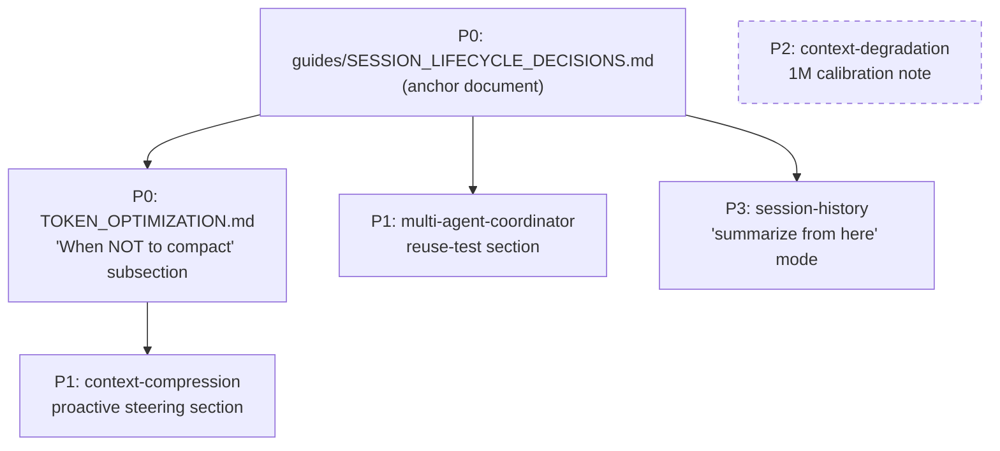

# Source Analysis: DevAI-Hub vs. "Using Claude Code: Session Management & 1M Context"

**Version**: 0.9.6
**Generated**: 2026-04-21T00:00:00Z
**Analyzer**: Claude Code -- compare-project command
**External Source**: Anthropic blog post (text provided inline; no canonical URL supplied with the command invocation)
**Source Type**: Web Article

---

## Section 1: Executive Summary

The article argues that the 1M-token context window is a double-edged sword: it enables longer autonomous runs but amplifies the cost of poor session hygiene, and it introduces context rot around 300-400k tokens. It lays out a five-option decision framework for every turn (continue, `/rewind`, `/clear`, `/compact`, subagent) and names a specific failure mode ("bad compact") where autocompact fires mid-task and drops information the user is about to need. Fourteen actionable insights were extracted across five article sections. DevAI-Hub already ships a deep context/session/orchestration skill catalog, but none of the skills are calibrated to 1M-specific behavior, no guidance codifies the five-branch decision tree, `/rewind` is entirely absent from the catalog, and the `/clear` vs. `/compact` distinction is never made explicit. Six actionable adoption candidates remain after curating for duplication: a session-lifecycle decisions guide, a "when NOT to compact" subsection for `TOKEN_OPTIMIZATION.md`, a proactive-compaction-with-steering section in `context-compression`, a "will I need this output again?" subagent mental-test section in `multi-agent-coordinator`, a 1M-window calibration anchor in `context-degradation`, and a rewind-pattern note added to `session-history`. No new slash commands are recommended -- `/compact`, `/clear`, and `/rewind` are native Claude Code features and adding DevAI-Hub shims would duplicate and drift.

---

## Section 2: Source Overview

**Title:** Using Claude Code: Session Management & 1M Context
**Author:** Anthropic (no individual author attributed in the inlined text)
**Publication date:** Not specified in the inlined text
**Topic:** Practical guidance for managing Claude Code sessions against the 1M-token context window, covering context rot, compaction, fresh sessions, rewind, and subagent-based context isolation.

**Key thesis:** The 1M context window lets Claude Code operate autonomously for longer, but only if the operator manages context deliberately. Every end-of-turn is a branching point with five options (continue, rewind, clear, compact, subagent), and the right choice depends on what the next task needs from the current context. The article's through-line is that context rot around 300-400k tokens makes the compaction step particularly risky ("bad compact"), so proactive steering beats reactive autocompact.

---

## Section 3: Key Insights Extracted

1. **Context window composition** (Primer): "The context window is everything the model can 'see' at once when generating its next response. It includes your system prompt, the conversation so far, every tool call and its output, and every file that's been read."

2. **1M context window size** (Primer): "Claude Code has a context window of one million tokens."

3. **Context rot at 300-400k tokens** (Primer): "For our 1MM context model, we see some level of context rot happen around ~300-400k tokens, but it is highly dependent on the task -- not a fast rule." Model performance degrades as context grows because attention spreads and older irrelevant content distracts.

4. **Compaction as summarize-then-continue** (Primer): When nearing the end of the window, the prior task is summarized into a smaller description and work continues in a new context window; compaction is triggered automatically or manually.

5. **Five-branch decision tree at end of turn** (Every Turn Is a Branching Point): Continue, `/rewind` (esc esc), `/clear`, `/compact`, or spawn a subagent. "While the most natural is just to continue, the other four options exist to help manage your context."

6. **New task = new session rule** (When to Start a New Session): "Our general rule of thumb is when you start a new task, you should also start a new session." Just because the window is not full does not mean a continued session is correct.

7. **Documentation-after-implementation exception** (When to Start a New Session): Related tasks where some context is still needed may be better continued than restarted. Example: writing documentation for a feature just implemented. "Since documentation may not be a highly intelligence sensitive task, the extra context is probably worth the efficiency gain of not having to re-read the relevant files again."

8. **Rewind over mid-session correction** (Rewinding Instead of Correcting): "If I had to pick one habit that signals good context management, it's rewind." Instead of "that didn't work, try X," rewind to just after the problematic reads and re-prompt with the learnings: "Don't use approach A, the foo module doesn't expose that -- go straight to B."

9. **"Summarize from here" handoff** (Rewinding Instead of Correcting): Ask Claude to summarize its learnings and create a handoff message before rewinding -- "kind of like a message to the previous iteration of Claude from its future self that tried something and it didn't work."

10. **`/compact` is lossy but steerable** (Compacting vs. Fresh Sessions): Compact replaces history with the model's own summary; the user did not have to write anything but is trusting Claude's judgment on what mattered. Compaction can be steered: "/compact focus on the auth refactor, drop the test debugging."

11. **`/clear` is manual and curated** (Compacting vs. Fresh Sessions): With `/clear` the user writes down what matters ("we're refactoring the auth middleware, the constraint is X, the files that matter are A and B, we've ruled out approach Y") and starts clean. "It's more work, but the resulting context is what you decided was relevant."

12. **"Bad compact" failure mode** (What Causes a Bad Compact?): Autocompact fires after a long debugging session and summarizes the investigation; the user's next message is "now fix that other warning we saw in bar.ts" -- but the warning was dropped because the session was focused on debugging. "The model is at its least intelligent point when compacting" due to context rot.

13. **Proactive `/compact` with intent** (What Causes a Bad Compact?): "With one million context, you have more time to /compact proactively with a description of what you want to do" -- pre-empting autocompact with explicit guidance prevents information loss.

14. **Subagents as context isolation with a reuse test** (Subagents & Fresh Context Windows): A subagent gets its own fresh context window; only its final report returns to the parent. "The mental test we use: will I need this tool output again, or just the conclusion?" Explicit delegation patterns include: "Spin up a subagent to verify the result of this work," "Spin off a subagent to read through this other codebase and summarize how it implemented the auth flow," and "Spin off a subagent to write the docs on this feature based on my git changes."

---

## Section 4: Relevance Analysis

| # | Insight | Status | Evidence / Notes |
|---|---------|--------|-----------------|
| 1 | Context window composition | **Already implemented** | [catalog/skills/ai-development/context-engineering/SKILL.md](catalog/skills/ai-development/context-engineering/SKILL.md) and [catalog/skills/orchestration/context-manager/SKILL.md](catalog/skills/orchestration/context-manager/SKILL.md) both cover the "what is in context" model (system prompt, messages, tool outputs, files). Fully conceptually covered. |
| 2 | 1M context window size | **Partially implemented** | [guides/TOKEN_OPTIMIZATION.md](guides/TOKEN_OPTIMIZATION.md) and the orchestration skills are window-size-agnostic. No file explicitly names "1M" or scales advice to it. Coverage is generic. |
| 3 | Context rot at 300-400k tokens | **Partially implemented** | [catalog/skills/orchestration/context-degradation/SKILL.md](catalog/skills/orchestration/context-degradation/SKILL.md) documents the five degradation patterns (Lost-in-Middle, Context Poisoning, Context Distraction, Context Confusion, Context Clash) and quotes "10-40% lower recall" for middle content, but never anchors to the 300-400k token range specific to the 1M model. |
| 4 | Compaction as summarize-then-continue | **Already implemented** | [guides/TOKEN_OPTIMIZATION.md](guides/TOKEN_OPTIMIZATION.md) lines 45-55 document `CLAUDE_AUTOCOMPACT_PCT_OVERRIDE` (default ~85, recommended 50), and [catalog/skills/orchestration/context-compression/SKILL.md](catalog/skills/orchestration/context-compression/SKILL.md) covers structured summarization and session handoff document generation. |
| 5 | Five-branch decision tree at end of turn | **Missing** | No file codifies the continue/rewind/clear/compact/subagent decision tree as an operator-facing guide. The pieces exist individually (compression skill, multi-agent skill, continue-session command) but are not unified. |
| 6 | New task = new session rule | **Missing** | Neither the CLAUDE.md templates nor any guide states this rule. [catalog/commands/wrap-up-session.md](catalog/commands/wrap-up-session.md) documents how to close a session but does not say when to start a new one mid-work. |
| 7 | Documentation-after-implementation exception | **Missing** | No guide discusses the grey-area trade-off between fresh session and continued session for related-but-different tasks. |
| 8 | Rewind over mid-session correction | **Missing** | DevAI-Hub has no documentation, skill, or command mentioning `/rewind` or the double-Esc shortcut. Zero coverage. |
| 9 | "Summarize from here" handoff | **Missing** | [catalog/skills/workflow/session-history/SKILL.md](catalog/skills/workflow/session-history/SKILL.md) generates end-of-session documents, but no guidance covers the mid-session "summarize from here before rewinding" pattern. |
| 10 | `/compact` is lossy but steerable | **Partially implemented** | [guides/TOKEN_OPTIMIZATION.md](guides/TOKEN_OPTIMIZATION.md) flags the lossy trade-off ("older context may be summarized rather than retained verbatim") but does not mention that `/compact` accepts steering instructions. No example of `/compact focus on X, drop Y`. |
| 11 | `/clear` is manual and curated | **Missing** | The `/clear` command is never named or compared against `/compact`. [catalog/commands/continue-session.md](catalog/commands/continue-session.md) is the only nearby artifact and it is a 3-line auth-resume prompt, not a decision framework. |
| 12 | "Bad compact" failure mode | **Missing** | [guides/TOKEN_OPTIMIZATION.md](guides/TOKEN_OPTIMIZATION.md) notes the trade-off but does not name the failure mode or teach recognition. No file warns that autocompact at the wrong moment can drop information the user is about to need. |
| 13 | Proactive `/compact` with intent | **Partially implemented** | [catalog/skills/orchestration/context-compression/SKILL.md](catalog/skills/orchestration/context-compression/SKILL.md) Step 1 includes a capacity assessment table (Green/Yellow/Orange/Red) but does not discuss pre-emptive `/compact` with a directive ("focus on X, drop Y") to steer what survives. |
| 14 | Subagents as context isolation with reuse test | **Partially implemented** | [catalog/skills/orchestration/multi-agent-coordinator/SKILL.md](catalog/skills/orchestration/multi-agent-coordinator/SKILL.md) names "context isolation is required because total context exceeds a single agent's effective window" as a use case but is coordination-focused. The "will I need this tool output again, or just the conclusion?" mental test is missing, as is the single-subagent, single-task lightweight delegation pattern. |

**Summary of status counts:** 2 Already implemented, 5 Partially implemented, 7 Missing, 0 Not applicable.

---

## Section 5: Adoption Plan

### P0 -- Immediate (High value, low effort)

| What | Article source | Target location | Effort | Dependencies | Risk |
|------|---------------|----------------|--------|-------------|------|
| **Session Lifecycle Decisions guide** -- a short operator-facing guide that codifies the five-branch decision tree (continue / rewind / clear / compact / subagent), the "new task = new session" rule, and the documentation-after-implementation exception. Include a decision flowchart and concrete examples for each branch | Insights 5, 6, 7 | `guides/SESSION_LIFECYCLE_DECISIONS.md` (new) | Low | None | None; purely additive. Rename-safe because no file currently imports "session lifecycle" guidance |
| **"When NOT to compact" subsection** in TOKEN_OPTIMIZATION.md -- name the "bad compact" failure mode, list three recognition signals (mid-debug, mid-refactor, user has a pending follow-up unrelated to the current thread), recommend proactive `/compact focus on X, drop Y` as mitigation, and cross-link to the new Session Lifecycle Decisions guide | Insights 10, 12, 13 | [guides/TOKEN_OPTIMIZATION.md](guides/TOKEN_OPTIMIZATION.md) (add subsection under existing "Auto-Compaction") | Low | None | Low; extends an existing guide the user has likely already read |

### P1 -- Short-term (High value, medium effort)

| What | Article source | Target location | Effort | Dependencies | Risk |
|------|---------------|----------------|--------|-------------|------|
| **Subagent reuse-test section** in multi-agent-coordinator -- add an explicit "Will I need this tool output again, or just the conclusion?" decision gate ahead of the existing Task Graph analysis; include the three article-cited delegation patterns (verify-with-subagent, summarize-other-codebase, write-docs-from-diff) as worked examples. Differentiate lightweight single-subagent delegation from full multi-agent coordination | Insight 14 | [catalog/skills/orchestration/multi-agent-coordinator/SKILL.md](catalog/skills/orchestration/multi-agent-coordinator/SKILL.md) (new section at top of Instructions); consider a lighter sibling skill `subagent-delegation` if the coordinator skill becomes bloated | Medium | None | Additive; do not alter existing "Do NOT use this skill when" gates |
| **Proactive compaction with steering** in context-compression -- add a sub-step to Step 2 (Select Compression Approach) that teaches the `/compact focus on X, drop Y` pattern for pre-emptive compaction before the 70-80% capacity threshold. Pair with a new "Common pre-compaction directives" list (drop debug noise, keep decisions, keep file locations, keep error messages) | Insights 10, 13 | [catalog/skills/orchestration/context-compression/SKILL.md](catalog/skills/orchestration/context-compression/SKILL.md) (extend Step 2 decision tree) | Medium | None | Low; existing Approach A/B/C structure remains intact |

### P2 -- Medium-term (Medium value, low effort)

| What | Article source | Target location | Effort | Dependencies | Risk |
|------|---------------|----------------|--------|-------------|------|
| **1M-window calibration note** in context-degradation -- anchor the Lost-in-Middle pattern to the 300-400k token window reported for the 1M model, with the caveat that it is task-dependent. Add a "Session size vs. degradation risk" table (<100k green, 100-300k yellow, 300-500k orange, 500k+ red) | Insights 2, 3 | [catalog/skills/orchestration/context-degradation/SKILL.md](catalog/skills/orchestration/context-degradation/SKILL.md) (extend Step 1 and Step 2) | Low | None | Low; anchors an existing skill to current Anthropic guidance, no behavioural change |

### P3 -- Backlog (Lower value or deferred)

| What | Article source | Target location | Effort | Dependencies | Risk |
|------|---------------|----------------|--------|-------------|------|
| **"Summarize from here" mid-session handoff** in session-history -- document the pattern of generating a handoff message immediately before `/rewind`, so the rewound session has Claude's own learnings loaded as its starting context | Insights 8, 9 | [catalog/skills/workflow/session-history/SKILL.md](catalog/skills/workflow/session-history/SKILL.md) (new operating mode alongside existing session/retrospective modes) | Medium | Depends on users actually using `/rewind`; low adoption of the shortcut limits value | Low; additive mode |

> Items explicitly considered and rejected are listed in Section 7 with reasoning.

---

## Section 6: Implementation Sequence

The six recommended items have minimal inter-dependencies. The Session Lifecycle Decisions guide (P0) is the anchor document that the other items cross-link to; write it first so subsequent items can point at it.

**Recommended order:**

1. `guides/SESSION_LIFECYCLE_DECISIONS.md` -- write first so it can be referenced from the other items
2. `TOKEN_OPTIMIZATION.md` "When NOT to compact" subsection -- same session as item 1; both are guide-level and share the bad-compact narrative
3. `multi-agent-coordinator` reuse-test section -- skill-level change; next because it is the highest-signal skill upgrade
4. `context-compression` proactive-steering section -- pairs logically with item 3 under the same "proactive context management" theme
5. `context-degradation` 1M calibration -- standalone factual anchor; write when an editor has an uninterrupted block
6. `session-history` "summarize from here" mode -- backlog; promote to P1 if users start using `/rewind` heavily

---

## Section 7: Risks and Considerations

### Platform parity requirement

DevAI-Hub's cross-platform consistency rule (`memory/project_platform_agnostic.md`) requires that any rule, skill, command, or hook change be applied across all five platform templates (Claude, Gemini, Codex, Cursor, OpenCode). Of the six adoption items:

- **Items 1, 2** (`SESSION_LIFECYCLE_DECISIONS.md`, `TOKEN_OPTIMIZATION.md` subsection): guides under `guides/` are not platform-gated. No mirror updates required.
- **Items 3, 4, 5, 6** (skill edits): SKILL.md files under `catalog/skills/` are platform-neutral by design. No platform-specific template changes are required because no item adds a new rule to any base template. If any item's rollout introduces a CLAUDE.md template snippet (e.g., "always consult SESSION_LIFECYCLE_DECISIONS.md when the session exceeds 300k tokens"), that snippet MUST be propagated to all five templates in [templates/ai-instructions/](templates/ai-instructions/).

### Anthropic may change native slash command behavior

The article's advice for `/rewind`, `/compact`, and `/clear` describes current (v2+) Claude Code behavior. If Anthropic changes defaults (e.g., moves `CLAUDE_AUTOCOMPACT_PCT_OVERRIDE` threshold, alters `/compact` signature, deprecates `/rewind`), the P0-P1 guide and skill references will go stale. Mitigation: every cross-reference to native slash command behavior should cite the Anthropic source article so a future maintainer knows to re-verify.

### 300-400k token anchor is task-dependent

The article explicitly hedges: "it is highly dependent on the task -- not a fast rule." The P2 calibration item in `context-degradation` should preserve this caveat and not hard-code 300-400k as a deterministic threshold. The existing Green/Yellow/Orange/Red severity indicator model already allows for task-dependent interpretation; the 1M anchor should appear as guidance, not law.

### Avoid duplicating existing coverage

Several article insights overlap with existing DevAI-Hub skills. The adoption plan specifically avoids:
- A new "context management" top-level skill (would duplicate `context-manager`, `context-engineering`, `context-compression`).
- A standalone "session health monitor" (would duplicate `context-degradation` Step 1 probe questions).
- A "fresh session starter" command (would duplicate `continue-session` / `wrap-up-session` boundary).

### Not recommended for adoption

- **New `/rewind`, `/compact`, or `/clear` DevAI-Hub slash commands**: These are native Claude Code features. Wrapping them in DevAI-Hub catalog entries would duplicate functionality and create drift if Anthropic changes the underlying behavior. Reference them from guides and skill documentation instead.
- **Dedicated "bad compact" detection skill**: The failure mode is important but narrow; a subsection in `TOKEN_OPTIMIZATION.md` (P0) carries it without skill-level overhead.
- **Session health scorecard as a standalone skill**: The [catalog/skills/orchestration/context-degradation/SKILL.md](catalog/skills/orchestration/context-degradation/SKILL.md) Step 1 degradation probe questions already serve this purpose. A separate scorecard would overlap.
- **Mandatory CLAUDE.md injection of the five-branch decision tree**: Tempting as a "teach every model this rule" move, but the decision tree is operator-facing, not agent-facing. Agents already call subagents and compact when appropriate; the humans driving the session are the ones who need the tree.
