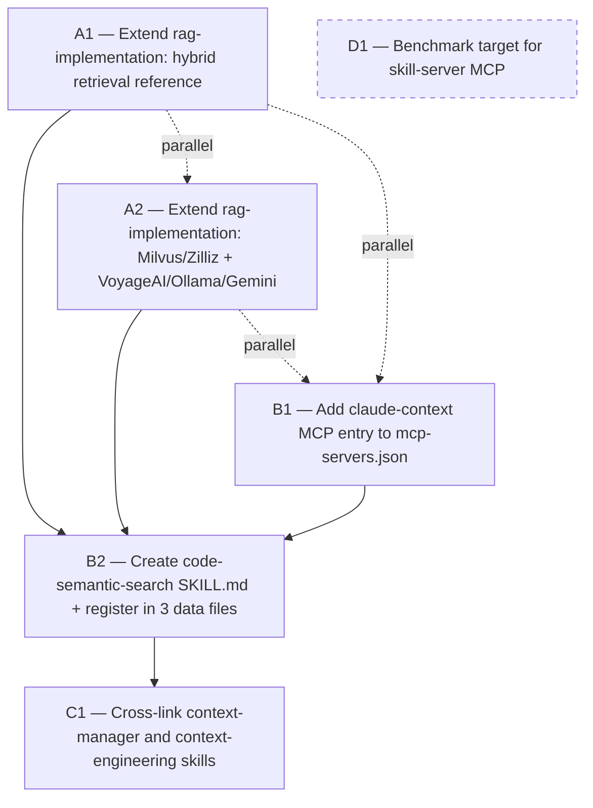

# Cross-Project Comparison: DevAI-Hub vs. zilliztech/claude-context

**Version**: v0.9.7
**Generated**: 2026-04-23T00:00:00Z
**Analyzer**: Claude Code -- compare-project command
**External Source**: https://github.com/zilliztech/claude-context
**Source Type**: Repository

---

## Section 1: Executive Summary

DevAI-Hub (a template catalog distributing 186 skills, 32 commands, 13 hooks, 10 agents, and 5 platform instruction templates across 6 AI assistants) was compared against `zilliztech/claude-context` (a runtime MCP server + VS Code + Chrome extensions providing semantic code search to AI coding agents via hybrid BM25 + dense-vector retrieval). The two projects are **adjacent, not competing**: claude-context makes the codebase queryable as context; DevAI-Hub makes accumulated engineering judgment queryable as context. Six actionable adoption items were identified (P0: 2, P1: 2, P2: 1, P3: 1), none involving runtime code copy — all are documentation or registry additions that extend DevAI-Hub's existing `rag-implementation` skill and `catalog/mcp-configs/` registry with concrete patterns, named backends (Milvus, Zilliz, VoyageAI, Ollama, Gemini), and AST-aware / Merkle-tree techniques that claude-context validates in production at 8.4k-star scale. Three explicit non-adoptions are flagged in Section 12: the pnpm monorepo topology, Milvus as a direct runtime dependency, and copying claude-context's 6-IDE configuration matrix into the DevAI-Hub README. **Overall recommendation: selective pattern adoption.**

---

## Section 2: Project Profiles

| Attribute | DevAI-Hub | claude-context |
|---|---|---|
| **Purpose** | Template catalog of skills, commands, hooks, agents, and rules for AI coding assistants | MCP server + IDE extensions that index a codebase and expose hybrid semantic search to AI agents |
| **Shipped as** | Installer scripts (Bash + PowerShell) that distribute files into user `.claude/` / `.cursor/` / etc. profiles | npm package (`@zilliz/claude-context-mcp`), VS Code Marketplace extension (`semanticcodesearch`), Chrome extension |
| **Runtime** | None — template-only repository | Node.js ≥20, <24; Milvus or Zilliz Cloud backend |
| **Version** | v0.9.7 (2026-04-22) | v0.1.7 |
| **License** | MIT (Benjamin Dourthe, [benjamin.dourthe@gmail.com](mailto:benjamin.dourthe@gmail.com)) | MIT (Zilliz) |
| **Scale signal** | 186 skills across 22 categories, 32 commands, 13 hooks, 10 agents | 8.4k stars, 660 forks, 165 commits; ~34 MB repo |
| **Primary consumer** | AI coding assistants (Claude Code, Cursor, Copilot, Gemini/Antigravity, OpenCode, Codex) | AI coding assistants that speak MCP (Claude Code, Claude Desktop, Windsurf, VS Code, Cherry Studio, Cline) |
| **Cited evidence** | `README.md`, `CHANGELOG.md` line 26, `data/SKILL_INDEX.md` (187 rows) | `README.md`, `package.json`, `LICENSE` |

**Conceptual framing.** DevAI-Hub is a *knowledge distribution* artifact: it ships static text (SKILL.md files, command prompts, rule files) that AI assistants read at session-start or on skill lookup. claude-context is a *retrieval infrastructure* artifact: it ships a running service that indexes the user's codebase into a vector database and answers natural-language queries about it at tool-call time. The two projects do not overlap in function; they compose. A DevAI-Hub user who installs claude-context gets (a) all of DevAI-Hub's accumulated engineering playbooks and (b) the ability to ask their agent "where in this repo do we handle rate-limiting for the billing endpoint?" and get a vector-retrieved answer grounded in actual code. This composition is the basis for the adoption items in Section 10.

---

## Section 3: Technology Stack Comparison

| Layer | DevAI-Hub | claude-context | Notes |
|---|---|---|---|
| **Primary languages** | Markdown (skills/commands), Bash + PowerShell (installers), Python 3.10+ (`extensions/devai-skill-server/`, hooks), TypeScript (VS Code extension `extensions/claude-usage-monitor/`) | TypeScript 69.2%, Python 15.4% (evaluation only), JavaScript 10.5% | Only overlap: TypeScript in VS Code / MCP extension code |
| **Package managers** | npm (VS Code extension), pip/pyproject (skill-server MCP) | pnpm ≥10 workspaces (`pnpm-workspace.yaml`) | DevAI-Hub has no root `package.json`; claude-context is pnpm-monorepo |
| **Runtime** | None; user's existing editor/assistant | Node ≥20.0.0, <24.0.0 (`package.json` engines) | DevAI-Hub deliberately ships no runtime |
| **Build system** | `Makefile` with 6 targets (`validate`, `lint`, `build-catalog`, `test`, `clean`, `help`) | Per-package `tsc --build --force`; root `pnpm -r build`; `scripts/build-benchmark.js` | Makefile vs. `pnpm -r` serve the same orchestration role |
| **Test framework** | pytest (`extensions/devai-skill-server/` + `catalog/hooks/tests/`) | Jest configured in core package devDeps, **zero test files found**; Python eval suite in `evaluation/` | DevAI-Hub is better tested at the hook level |
| **Lint/format** | ShellCheck (via `make lint`); `format-bash-description.py` hook | ESLint per-package (`pnpm -r lint`) | Different surfaces, both enforced in CI |
| **Key libraries** | `python-docx`, `python-pptx`, `rapidfuzz`, FastMCP (skill-server) | `@modelcontextprotocol/sdk@1.12.1`, `langchain@0.3.27`, `tree-sitter@0.21.1` + 9 language grammars, `@zilliz/milvus2-sdk-node@2.5.10`, `openai@5.1.1`, `voyageai@0.0.4`, `@google/genai@1.9.0`, `ollama@0.5.16`, `faiss-node@0.5.1` | claude-context's dependency footprint is ~10x larger; reflects its runtime nature |
| **Repository size** | n/a (template-only; skills ≈ markdown) | 34 MB (`du -sh /tmp/compare-claude-context`) | |

---

## Section 4: AI Assistant Configuration Comparison

This is the highest-signal section. Both projects configure AI assistants, but at different layers.

### 4.1 Distribution model

| | DevAI-Hub | claude-context |
|---|---|---|
| **What is distributed** | 186 SKILL.md files, 32 command prompts, 13 hooks, 10 agents, 5 platform templates, MCP config registry | One npm package (`@zilliz/claude-context-mcp`) + two IDE extensions |
| **How users install** | Clone + `./install.sh` or `install.bat` → installer copies artifacts into each assistant's profile directory | `claude mcp add claude-context -e ... -- npx @zilliz/claude-context-mcp@latest` (or JSON config per client) |
| **Update model** | Re-run installer after `git pull` | `npx @...@latest` at next invocation |
| **Source of truth** | The repo itself; `data/SKILL_INDEX.md` aggregates | The npm package; README documents config snippets |
| **Evidence** | `scripts/installer.sh` (1584 lines), `scripts/installer.ps1` (1907 lines), both reference MCP | `README.md` lines 57–310 |

### 4.2 Platform coverage

| Assistant / IDE | DevAI-Hub | claude-context |
|---|---|---|
| Claude Code | Full (skills + commands + hooks + agents + rules via `templates/ai-instructions/base-claude.md`, 103 lines) | MCP-only via `claude mcp add` |
| Claude Desktop | Not distributed | JSON `mcpServers` config |
| Cursor | Behavioral only (`.cursor/rules/devai-hub.mdc`, `templates/ai-instructions/base-cursor.md`, 52 lines) | Not mentioned in README top-level config matrix |
| Copilot (GitHub) | Behavioral only (`.github/copilot-instructions.md`) | Not supported |
| Gemini CLI / Antigravity | Full (`templates/ai-instructions/base-gemini.md`, 51 lines) | Not in README config matrix |
| OpenCode | Behavioral only (`templates/ai-instructions/base-opencode.md`, 52 lines) | Not in README config matrix |
| Codex | Behavioral only (`templates/ai-instructions/base-codex.md`, 54 lines) | Not in README config matrix |
| Windsurf | Not distributed | JSON `mcpServers` config |
| Cherry Studio | Not distributed | GUI-based settings (documented) |
| Cline | Not distributed | MCP Servers GUI integration |

**Conclusion**: DevAI-Hub targets more AI assistants overall (7 platforms with at least a behavioral surface), but claude-context's 6 platforms are *exclusively* MCP-consumption targets — i.e., any tool that speaks MCP gets equal treatment without needing per-platform rule files. These are compatible models: claude-context's MCP server can be registered inside DevAI-Hub's `catalog/mcp-configs/` for any platform DevAI-Hub already supports.

### 4.3 MCP presence in each project

- **DevAI-Hub**: Ships `catalog/mcp-configs/mcp-servers.json` (101 lines, 1 file, JSON object of named server blocks). Example entry shape from that file:
  ```json
  "github": {
    "command": "npx",
    "args": ["-y", "@modelcontextprotocol/server-github"],
    "env": { "GITHUB_PERSONAL_ACCESS_TOKEN": "${GITHUB_TOKEN}" }
  }
  ```
  Also ships its own MCP server at `extensions/devai-skill-server/` (Python 3.10+, exposes `search_skills`, `get_skill`, `list_categories`, `list_bundles`, `get_bundle`).
- **claude-context**: The entire project is an MCP server. Tools exposed at `packages/mcp/src/index.ts` lines 124, 165, 197, 240: `index_codebase`, `search_code`, `clear_index`, `get_indexing_status`.

**Gap**: DevAI-Hub's `catalog/mcp-configs/mcp-servers.json` has no entry for claude-context. Adding one is a P1 item.

---

## Section 5: Skills and Capabilities Gap Analysis

### 5a. Present in claude-context, missing in DevAI-Hub (adoption candidates)

| Capability | claude-context location | DevAI-Hub status | Adoption signal |
|---|---|---|---|
| **Hybrid BM25 + dense retrieval** with Reciprocal Rank Fusion | `packages/core/src/` + README "Hybrid Search" section | Named in `rag-implementation/SKILL.md` line 581 (hybrid search) and line 639 (RRF), but without a concrete reference implementation | Strong — name claude-context as canonical OSS reference |
| **AST-aware code chunking** via tree-sitter for 9 languages (JS, TS, Python, Java, C++, Go, Rust, C#, Scala) | `packages/core/src/splitter/ast-splitter.ts` | Not mentioned in `rag-implementation/SKILL.md` chunking taxonomy (only fixed / recursive / semantic / document-aware) | Strong — a named chunking strategy specifically for code corpora |
| **LangChain fallback splitter** for non-supported languages | `packages/core/src/splitter/langchain-splitter.ts` | Not mentioned | Supporting detail for AST adoption |
| **Incremental indexing via content-hash Merkle trees** | `packages/core/src/sync/merkle.ts` + `synchronizer.ts` | Zero mentions of "Merkle" anywhere in repo | Strong — a named technique for "avoid re-embedding unchanged subtrees" |
| **Milvus (native + REST) and Zilliz Cloud as vector DB backends** | `packages/core/src/vectordb/milvus-vectordb.ts`, `milvus-restful-vectordb.ts`, `zilliz-utils.ts` | `rag-implementation/SKILL.md` names only Chroma, Pinecone, pgvector, Qdrant (lines 439–443) | Adopt — add Milvus/Zilliz to the vector-store roster |
| **VoyageAI, Ollama, Gemini embedding backends** | `packages/core/src/embedding/{voyageai,ollama,gemini}-embedding.ts` | `rag-implementation/SKILL.md` does not enumerate these by name | Adopt |
| **Zero-setup VS Code sidebar for in-IDE semantic search** | `packages/vscode-extension/` | DevAI-Hub's `extensions/claude-usage-monitor/` is a different kind of VS Code extension (usage tracking, not code search) | Not adoptable — would be scope creep |
| **MCP tool for code search**: `search_code` with hybrid mode + rerank strategies | `packages/mcp/src/index.ts` line 165 | No code-search skill or MCP entry | Adopt as MCP registry entry (P1) |
| **SWE-bench evaluation producing 39.4% token reduction + 36.3% tool-call reduction** | `evaluation/run_evaluation.py`, `analyze_and_plot_mcp_efficiency.py` | No equivalent benchmark for the skill-discovery MCP | Consider for P3 |

### 5b. Present in DevAI-Hub, missing in claude-context (strengths to preserve)

| Capability | DevAI-Hub location | Why claude-context has no equivalent |
|---|---|---|
| **186-skill catalog across 22 categories** | `data/SKILL_INDEX.md` (187 rows including header), `catalog/skills/**/SKILL.md` | Different purpose — claude-context ships zero prescriptive skill content |
| **Cross-platform installer with 6-assistant distribution** | `scripts/installer.sh` (1584 lines), `scripts/installer.ps1` (1907 lines) | claude-context distributes via npm only; no per-assistant profile writing |
| **Compliance skills**: GDPR, SOC 2, ISO 27001, NIST AI RMF, ISO 42001, PCI-DSS, CCPA | `catalog/skills/compliance/` | Out of scope for claude-context |
| **Security hunter framework** (`/run-penetration-test` with 5+1 specialist hunters) | `catalog/commands/run-penetration-test.md`, `catalog/skills/security/` | Out of scope |
| **Deep-research compilation pipeline** (7 input formats → unified .docx/.pdf/.md) | `catalog/commands/compile-deep-research.md`, `catalog/skills/specialized-domains/deep-research-compilation/` | Out of scope |
| **Version-segregated documentation** (`docs/v0.8.1/` … `docs/v0.9.7/` with comparison reports) | `docs/v*/` — 13 prior comparison reports | claude-context's `docs/` is flat (no version folders) |
| **13 hooks with pytest suite** (secret-scan, git-guardrails, large-file-guard, format-bash-description, etc.) | `catalog/hooks/` + `catalog/hooks/tests/` | claude-context has no hooks; no husky / lint-staged in root `package.json` |
| **`data/skills.json` / `data/marketplace.json` / `data/bundles.json` machine-readable catalogs** | `data/` | claude-context has no equivalent — it has no catalog |

### 5c. Present in both, different approach

| Concern | DevAI-Hub approach | claude-context approach | Which is better? |
|---|---|---|---|
| **MCP server hosting** | `extensions/devai-skill-server/` (Python 3.10+) exposing skill catalog retrieval tools (`search_skills`, `get_skill`, `list_categories`, `list_bundles`, `get_bundle`) | `packages/mcp/` (Node 20+) exposing code-search tools (`index_codebase`, `search_code`, `clear_index`, `get_indexing_status`) | Neither — different corpora (skills vs. source code). Both are sound. |
| **Hybrid retrieval** | `rag-implementation/SKILL.md` lines 581, 639 discuss BM25 + RRF at the pattern level; DevAI-Hub's own skill-server README line 9 mentions BM25 keyword search | `packages/core/` implements hybrid search as a runtime feature with rerank strategies | claude-context is strictly more concrete. DevAI-Hub's skill can borrow from it. |
| **Packaging and distribution** | Flat template repo; installer copies files | pnpm monorepo; npm publish + VS Code marketplace publish | Different goals. Flat layout is correct for DevAI-Hub (Section 12). |
| **README tone** | Single long README with table of contents; supplemented by `AGENTS.md`, `CLAUDE.md`, `GEMINI.md`, `CONTRIBUTING.md`, `SECURITY.md` | 13 top-level README sections including a `🏗️ Architecture` section; supplementary docs under `docs/getting-started/`, `docs/dive-deep/`, `docs/troubleshooting/` | Both are adequate. claude-context's split of README vs. `docs/` is one model worth noting but not adopting wholesale. |
| **CI matrix** | `.github/workflows/ci.yml` (Ubuntu, push/PR to main), `codeql.yml` | `.github/workflows/ci.yml` (Ubuntu + Windows, Node 20.x + 22.x, push/PR to main/master/claude_context), `release.yml` (npm + vsce publish on tags) | claude-context's matrix is broader (Windows + Node versions). DevAI-Hub does not need this because its surface is not compiled code; however, adding Windows CI would test the PowerShell installer surface. Out of scope here. |

### 5d. Both present, equivalent

- MIT license.
- Use of GitHub Actions for CI.
- TypeScript used for a VS Code extension component (`extensions/claude-usage-monitor/` on DevAI-Hub side; `packages/vscode-extension/` on claude-context side — the extensions serve different purposes, but the stack choice matches).

---

## Section 6: Commands and Automation Comparison

### 6a. Commands gap

DevAI-Hub has 32 slash commands (e.g., `/compare-project`, `/generate-plan`, `/implement-phase`, `/run-penetration-test`, `/compile-deep-research`, `/setup-project`, `/tdd`, `/review-codebase`, `/search-skills`, and 23 others in `catalog/commands/`). claude-context has **no slash-command concept** — it is an MCP tool exposed to agents, not a prompt catalog.

**Gap assessment**: Nothing to adopt in this direction. DevAI-Hub's command layer is simply a feature claude-context does not have because it is a different kind of project.

### 6b. CI/CD and hooks gap

| | DevAI-Hub | claude-context | Gap? |
|---|---|---|---|
| **CI** | `.github/workflows/ci.yml`, `.github/workflows/codeql.yml` | `.github/workflows/ci.yml`, `.github/workflows/release.yml` | DevAI-Hub has no release workflow (npm publish) because nothing is published. Equivalent. |
| **Pre-commit / write-time hooks** | 13 hooks in `catalog/hooks/` + pytest suite in `catalog/hooks/tests/` | **None** (no husky, no lint-staged in root `package.json`) | DevAI-Hub is strictly stronger here. Claude-context could adopt pre-commit — but that is their problem, not ours. No DevAI-Hub adoption needed. |
| **Benchmark suite** | None | `scripts/build-benchmark.js` + `build-benchmark.json` capturing clean/build-core/build-mcp/build-vscode/build-chrome timings across 10 recent runs | Consider as P3 for the skill-discovery MCP (latency regression detection). |

---

## Section 7: Documentation and Developer Experience Comparison

| Dimension | DevAI-Hub | claude-context |
|---|---|---|
| **Root instruction files** | `AGENTS.md` (canonical), `CLAUDE.md` (thin pointer with `@AGENTS.md` import), `GEMINI.md` (thin pointer), `.github/copilot-instructions.md` (inline summary), `.cursor/rules/devai-hub.mdc` | `README.md` (13 sections), `CONTRIBUTING.md`, no per-assistant instruction files |
| **Docs tree** | `docs/v0.8.1/` through `docs/v0.9.7/`, version-segregated; 13 comparison reports; `docs/v0.9.7/` contains `RELEASE_NOTES.md` (131 lines), `implementation-plan.md` (959 lines), `development/` | Flat: `docs/README.md` + `docs/getting-started/` (3 files) + `docs/dive-deep/` (2 files) + `docs/troubleshooting/` (2 files) = 8 files total |
| **Guides** | `guides/` (SESSION_LIFECYCLE_DECISIONS.md, TOKEN_OPTIMIZATION.md, SUBAGENTS_GUIDE.md, others) | None above `docs/` level |
| **Setup guide for developers** | `AGENTS.md` "Adding a New Skill" section + `CONTRIBUTING.md` | `CONTRIBUTING.md` + `docs/getting-started/quick-start.md` |
| **Dev container** | None | None (both rely on native tooling) |
| **Changelog** | `CHANGELOG.md` with Keep-a-Changelog format, v0.8.1 → v0.9.7 | `CHANGELOG.md` (verified present); less granular |
| **Per-release artifacts** | `docs/v<version>/RELEASE_NOTES.md` + `implementation-plan.md` + `development/history/` | None — release notes consolidated in `CHANGELOG.md` |

**Conclusion**: DevAI-Hub's documentation depth is substantially greater. claude-context's advantage is clearer domain-specific entry points (`getting-started/environment-variables.md`, `dive-deep/asynchronous-indexing-workflow.md`) — which is a pattern DevAI-Hub already matches in the per-version `docs/v*/implementation-plan.md` artifacts. No adoption needed.

---

## Section 8: Testing and Security Posture Comparison

### 8.1 Testing

| | DevAI-Hub | claude-context |
|---|---|---|
| **Unit tests** | pytest suite at `catalog/hooks/tests/` (4 files: `test_classification_audit.py`, `test_format_bash_description.py`, `test_installer_smoke.py`, `test_platform_parity.py`) + `extensions/devai-skill-server/tests/` | Jest configured in `packages/core/package.json` devDeps but **zero test files found** (no `*.test.ts`, `*.spec.ts`, `test/`, `__tests__/`) |
| **Integration / E2E** | `test_installer_smoke.py`, `test_platform_parity.py` (cross-platform consistency checks) | `python/test_endtoend.py` — end-to-end agent flow using Python harness |
| **Evaluation / benchmark** | None | `evaluation/` (SWE-bench suite producing 39.4% token reduction, 36.3% call reduction vs. grep baseline) |
| **Lint in CI** | ShellCheck via `make lint` | ESLint via `pnpm -r lint` |
| **Catalog validation** | `make validate` (`python -c "import json; d = json.load(open('data/skills.json')) ..."`) | N/A |

**Assessment**: DevAI-Hub's unit test coverage of its hook logic is genuinely better than claude-context's test posture. claude-context's unique asset is the evaluation / benchmark suite, which has no analogue in DevAI-Hub. See P3 item.

### 8.2 Security

| | DevAI-Hub | claude-context |
|---|---|---|
| **SECURITY.md** | Present (secret handling, hook safety, privacy) | **Absent** |
| **Pre-write secret scanner** | `catalog/hooks/secret-scan.sh` | None |
| **Large-file guard** | `catalog/hooks/large-file-guard.sh` | None |
| **Git guardrails** | `catalog/hooks/git-guardrails.sh` | None |
| **Dependency audit** | Not formalized beyond CodeQL scan (`.github/workflows/codeql.yml`) | Not formalized |
| **Secret handling in code** | n/a (no runtime secrets) | `.env.example` template for all keys (OpenAI, Milvus, etc.); environment-only |

**Assessment**: DevAI-Hub's security posture is stronger because it operates at the developer's shell/filesystem boundary where the risk is clear. claude-context's exposure is narrower (a running MCP server with documented env vars), so its lower posture is defensible but not a model to adopt.

---

## Section 9: Structural and Architectural Differences

Three architectural differences are worth noting but do not map to single adoption items:

**A. Monorepo vs. flat catalog.** claude-context uses a pnpm workspace monorepo (`pnpm-workspace.yaml`: `packages/*`, `examples/*`) with 4 packages (`@zilliz/claude-context-core`, `@zilliz/claude-context-mcp`, `semanticcodesearch`, `@zilliz/claude-context-chrome-extension`) and an example package. DevAI-Hub is a flat repo where the "packages" are actually content directories (`catalog/skills/`, `catalog/commands/`, etc.) with no per-directory `package.json`. The flat layout is correct for DevAI-Hub because content distribution is not the same problem as code publishing — but a reader coming from claude-context might initially expect a monorepo.

**B. Runtime service vs. static catalog.** claude-context includes an orchestrator class (`packages/core/src/context.ts`) with stateful lifecycle (index, re-index on change via Merkle diffs, search, clear). DevAI-Hub's closest analogue is `extensions/devai-skill-server/` — also a stateful MCP service, but serving a static corpus (the 186 skills shipped in the repo), not a user's own data. This is not a missing feature; it is a different domain.

**C. Configuration surface area.** claude-context's configuration is concentrated in environment variables (`OPENAI_API_KEY`, `MILVUS_ADDRESS`, `MILVUS_TOKEN`, `EMBEDDING_PROVIDER`, `EMBEDDING_MODEL`, `EMBEDDING_BATCH_SIZE`, `SPLITTER_TYPE`, `CUSTOM_EXTENSIONS`, `CUSTOM_IGNORE_PATTERNS`, `HYBRID_MODE`) documented in `docs/getting-started/environment-variables.md`. DevAI-Hub's configuration is distributed across `settings.json`, `AGENTS.md`, `CLAUDE.md`, `.cursor/rules/devai-hub.mdc`, and per-platform `base-*.md` templates. Each project's approach fits its deployment model; nothing to adopt.

---

## Section 10: Adoption Plan

### P0 (Immediate, Low Effort / High Value)

| What | Source | Target | Effort | Dependencies | Risk |
|---|---|---|---|---|---|
| **A1. Extend `rag-implementation` SKILL.md** with named hybrid-retrieval implementation reference (BM25 + dense + RRF, citing claude-context as the 8.4k-star OSS reference). | `packages/core/src/` (hybrid search logic) + `README.md` Hybrid Search section | `catalog/skills/ai-development/rag-implementation/SKILL.md` — augment existing lines 581, 639 discussion with a concrete implementation link | Low (1 skill file edit, no registry changes because skill already exists) | None | Minimal. Skill currently lists BM25/RRF as pattern; adding a canonical reference increases signal without changing guidance. |
| **A2. Broaden `rag-implementation` SKILL.md vector-store and embedding-provider tables.** Current file names only Chroma/Pinecone/pgvector/Qdrant (lines 439–443) for vector stores and does not enumerate OpenAI / VoyageAI / Ollama / Gemini side-by-side as embedding providers. Add Milvus (native + REST) and Zilliz Cloud to the vector-store roster and list all four embedding providers with their characteristics (dimensions, code-specific models like `voyage-code-3`). | `packages/core/src/vectordb/*` and `packages/core/src/embedding/*` | Same file, extend the vector-store and embedding-provider enumerations | Low (table additions in one file) | A1 (bundle into same edit) | Minimal. Expanding a roster does not break any other skill reference. |

### P1 (Short-term, Medium Effort / High Value)

| What | Source | Target | Effort | Dependencies | Risk |
|---|---|---|---|---|---|
| **B1. Add `claude-context` entry to the MCP registry.** A ready-to-use MCP server configuration lets DevAI-Hub users wire semantic code search into their AI assistant in one step, matching how existing entries (e.g., `github`) work. | `README.md` (MCP configuration snippet including `OPENAI_API_KEY`, `MILVUS_ADDRESS`, `MILVUS_TOKEN` env vars and `npx @zilliz/claude-context-mcp@latest` command/args) | `catalog/mcp-configs/mcp-servers.json` — add a new top-level key `"claude-context"` following the shape of the existing `"github"` entry (lines 4–10) | Low-medium (file is 101 lines, JSON; single entry addition). Validate with `make validate`. | None | Low. Entry is additive and respects the existing schema. Users who do not set env vars get a non-functional server they can ignore; no side effects on other entries. |
| **B2. Create new `code-semantic-search` skill** under `catalog/skills/ai-development/`. Document the capability at the level DevAI-Hub skills typically operate: when to reach for semantic code search, embedding-model selection criteria for code (prefer code-specialized models like `voyage-code-3`), chunking choice (AST > recursive > fixed for code), incremental re-indexing (Merkle-tree content hashing), hybrid retrieval with BM25 for identifier-exact matches, and common pitfalls (stale indexes, token-limit overruns from chunk-size misconfiguration, embedding cost at first index). Reference claude-context as the canonical OSS implementation. | claude-context README + `packages/core/src/splitter/ast-splitter.ts` + `packages/core/src/sync/merkle.ts` | New file `catalog/skills/ai-development/code-semantic-search/SKILL.md`. Register in `data/SKILL_INDEX.md` (1 new row), `data/skills.json` (1 new entry matching the schema shape shown in Section 5), and `data/marketplace.json` (increment `skill_count` for `ai-development` and `total_skills` in statistics). | Medium (≈300-400 line SKILL.md + 3 registry edits; requires running `make validate` after) | B1 should land first so the skill can reference the registry entry; A1/A2 should land first to avoid duplicating content from `rag-implementation` | Medium. Requires editorial judgment about what belongs in the new skill versus `rag-implementation`. Mitigation: `code-semantic-search` is capability-specific (source code as corpus) while `rag-implementation` remains the general-purpose RAG skill. Cross-link both with "Related Skills". |

### P2 (Medium-term, Medium Value)

| What | Source | Target | Effort | Dependencies | Risk |
|---|---|---|---|---|---|
| **C1. Cross-link existing `context-manager` and `context-engineering` skills** to the new `code-semantic-search` skill. Both current skills talk about attention budgeting and deliberate context shaping but do not cover the "my codebase is larger than the model's context window" escape valve of vector retrieval. A "Related Skills" entry pointing to `code-semantic-search` closes this gap. | `code-semantic-search` (will be created under B2) | `catalog/skills/orchestration/context-manager/SKILL.md` (432 lines) and `catalog/skills/ai-development/context-engineering/SKILL.md` (148 lines) — add Related Skills entries | Low (two small edits) | B2 | Minimal. Cross-links are additive. |

### P3 (Backlog)

| What | Source | Target | Effort | Dependencies | Risk |
|---|---|---|---|---|---|
| **D1. Evaluate a benchmark target for `extensions/devai-skill-server/` MCP latency.** Model after claude-context's `scripts/build-benchmark.js` + `build-benchmark.json` (stores last 10 runs with timestamp, platform, Node version, success, duration per operation). DevAI-Hub's skill-server has no latency regression detection today. A `make benchmark` target that measures `search_skills`, `get_skill`, and `list_bundles` round-trip times would catch regressions in the Python server before they land in releases. | `scripts/build-benchmark.js` + `build-benchmark.json` shape | New file `scripts/skill_server_benchmark.py` + new `benchmark` target in `Makefile` + optional `data/benchmarks/skill-server.json` result store | Medium (new Python script + Makefile target + optional result-store decision) | Would ideally wait until the skill-server has a stable API contract | Medium. If skill-server's API changes, the benchmark needs updating. Acceptable cost once the API stabilizes. |

**Counts for the chain offer in Section 8 of the command**: P0 = 2, P1 = 2, P2 = 1, P3 = 1, **Total = 6**.

---

## Section 11: Implementation Sequence

Because there are 6 adoption items with explicit dependencies (B2 depends on B1 and A1/A2; C1 depends on B2), a dependency-ordered sequence is non-trivial. Mermaid flowchart:



**Recommended execution order**:

1. **Wave 1 (P0, parallelizable)**: A1 + A2 as a single bundled edit to `rag-implementation/SKILL.md`. Run `make validate` after.
2. **Wave 2 (P1, parallelizable after Wave 1)**: B1 (MCP entry) can land independently. B2 (new skill) should wait until A1/A2 are merged so cross-references are accurate.
3. **Wave 3 (P2, after Wave 2)**: C1 — add Related Skills links once B2's skill exists.
4. **Wave 4 (P3, independent, deferred)**: D1 — sequence freely whenever the skill-server API is considered stable.

Approximate total effort: Wave 1 ≈ 1–2 hours; Wave 2 ≈ 3–5 hours (B2 is the bulk); Wave 3 ≈ 15 minutes; Wave 4 ≈ 2–4 hours when undertaken.

---

## Section 12: Risks and Considerations

### Items explicitly NOT recommended for adoption

**N1. Do not adopt the pnpm monorepo topology.** claude-context uses `pnpm-workspace.yaml` with 4 packages + an examples package, appropriate because it publishes three distinct npm artifacts. DevAI-Hub publishes nothing via npm from the main catalog; the `catalog/` flat layout is a content distribution choice (installer copies files, does not resolve workspace dependencies). Reorganizing DevAI-Hub into a monorepo would create churn proportional to the number of skills (186) without any publishing benefit. Reject.

**N2. Do not adopt Milvus as a runtime dependency.** DevAI-Hub is intentionally zero-runtime-dep at the distribution layer. Adding Milvus (via `@zilliz/milvus2-sdk-node` or otherwise) would change the project's mental model from "installer-copies-files" to "installer-also-provisions-vector-DB". This is a different product. If a user wants semantic code search, they should install claude-context (which is exactly what the B1 MCP registry entry enables). Reject.

**N3. Do not copy claude-context's per-IDE configuration matrix into the DevAI-Hub README.** claude-context documents configuration snippets for 6 MCP clients (Claude Code, Claude Desktop, Windsurf, VS Code, Cherry Studio, Cline) directly in its README. If DevAI-Hub mirrored this pattern, the installer would no longer be the single source of truth for which platforms are supported, violating the MEMORY.md rule `project_platform_agnostic.md` (changes to platform coverage must be applied across all 5 platform templates `templates/ai-instructions/base-*.md` in lockstep, via the installer). Instead, DevAI-Hub should surface claude-context via the B1 MCP entry and let the installer's existing platform-distribution logic continue to own platform coverage. Reject.

### Risks on adoption items

| Item | Risk | Mitigation |
|---|---|---|
| **A1/A2** | Expanding `rag-implementation` SKILL.md beyond its current 1054 lines risks violating the AGENTS.md "Keep SKILL.md under 800 lines" guideline. | Bundle A1 and A2 as focused table additions (not narrative expansion); if the file grows past 800 lines, extract Milvus/Zilliz backend details into a `references/` subdirectory and link. |
| **B1** | A new entry in `mcp-servers.json` that depends on env vars (`OPENAI_API_KEY`, `MILVUS_ADDRESS`, `MILVUS_TOKEN`) may confuse users who install DevAI-Hub's MCP registry wholesale and expect every server to work out of the box. | Add an `"_comment"` field in the JSON entry (following the existing style) explaining the required env vars and pointing at claude-context's documentation. Validate with `make validate`. |
| **B2** | Creating `code-semantic-search` under `ai-development/` may create confusion with the existing `rag-implementation` skill. | Explicit scope statements in each skill's When-to-Use section: `rag-implementation` = general RAG over documents; `code-semantic-search` = semantic retrieval specifically over source code with code-specialized embeddings and AST chunking. Cross-link both. |
| **B2 registry update** | Adding a new skill requires three synchronous edits (`data/SKILL_INDEX.md`, `data/skills.json`, `data/marketplace.json`) per AGENTS.md. Missing any breaks the installer or the MCP server's skill discovery. | Run `make validate` after edits. The v0.9.7 release process is already accustomed to this pattern — 2 of 3 new v0.9.7 skills followed the same registration path (`business-logic-abuse`, `advanced-attack-patterns`, `deep-research-compilation`). |
| **C1** | None of note. Additive cross-links. | N/A |
| **D1** | Benchmark script maintenance burden if the skill-server API changes. | Defer until the API is stable; alternatively, gate the benchmark target behind a `--skip-benchmark` default so CI does not break when the script lags. |

### General considerations

- **License compatibility**: Both projects are MIT. No adoption item requires license analysis.
- **Attribution**: When citing claude-context in SKILL.md content (A1, A2, B2), include a Related Resources entry linking to the GitHub URL. This matches DevAI-Hub's established pattern (e.g., the `compile-deep-research` skill references python-docx).
- **Version pinning in the MCP entry (B1)**: claude-context publishes to npm; DevAI-Hub's existing `mcp-servers.json` uses `@latest` for `@modelcontextprotocol/server-github`. Match that convention (`@zilliz/claude-context-mcp@latest`) unless the user reports stability issues.
- **Cross-platform installer impact**: None of the 6 items require installer changes (`scripts/installer.sh`, `scripts/installer.ps1`). A1/A2 edit existing files; B1 edits an existing file; B2 adds new catalog files that are already auto-copied by the installer's recursive copy of `catalog/skills/`. This is by design and respects the AGENTS.md "Installer-Aware Changes" checklist.

---

**End of report.**
