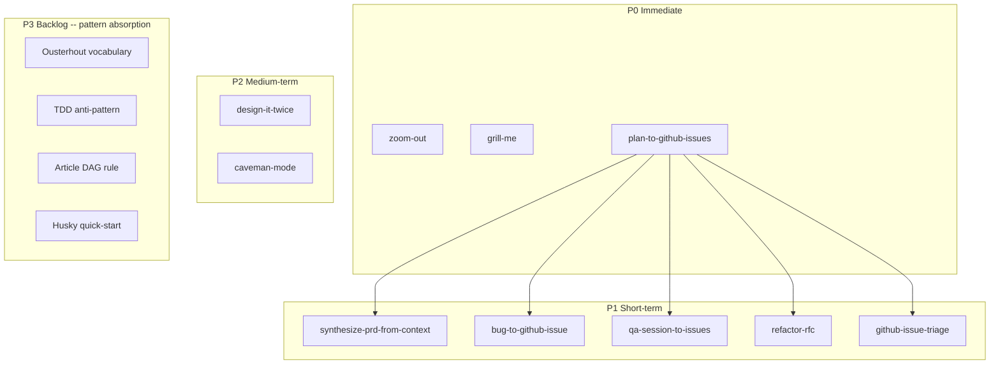

# Cross-Project Comparison: DevAI-Hub vs. mattpocock/skills

**Version**: v1.0.0
**Generated**: 2026-04-27T00:00:00Z
**Analyzer**: Claude Code -- compare-project command
**External Source**: https://github.com/mattpocock/skills
**Source Type**: Repository

> Filename note: the URL's last path segment is `skills`, which is too generic in this repo. The report is named `comparison-mattpocock-skills.md` for disambiguation; all references downstream use the same identifier.

## 1. Executive Summary

mattpocock/skills is a personal skill collection (21 skills, no commands or hooks) optimized for a TypeScript/GitHub-issue-driven solo workflow. DevAI-Hub is a 184-skill multi-platform catalog with commands, hooks, agents, and a security-hardened MCP registry. Most of mattpocock's skills are already covered by DevAI-Hub equivalents; the meaningful gaps are a coherent **GitHub-issue-driven workflow family** (`qa`, `to-prd`, `to-issues`, `triage-issue`, `github-triage`, `request-refactor-plan`) and three short prompt-style skills (`zoom-out`, `grill-me`, `caveman`). Recommendation: **selectively adopt** 9 skills as new DevAI-Hub skills (all skill-native), absorb 3 patterns into existing skills, and reject 7 candidates as already covered, hyper-specific, or out-of-scope. Every adoption candidate is `skill-native` per the MCP Registry Policy decision tree -- zero new outbound calls, zero new API keys, zero new third-party data processors.

## 2. Project Profiles

| Aspect | DevAI-Hub (current) | mattpocock/skills |
|---|---|---|
| Identity | Production-grade skill catalog for AI coding assistants, distributed via installer scripts | Personal collection of "agent skills for real engineers" |
| Author | Benjamin Dourthe ([benjamin.dourthe@gmail.com](mailto:benjamin.dourthe@gmail.com)) | Matt Pocock (TypeScript educator) |
| License | Repository-internal (none of `LICENSE`, `LICENSE.md` at root) | MIT |
| Scale | 184 skills, 32 commands, 13 hooks, 10 agents, 5 platform templates, 3 internal MCPs | 21 skills, 0 commands, 0 hooks, 0 agents, 1 platform (Claude Code only) |
| Distribution | `scripts/installer.sh` + `installer.ps1`, multi-platform (Claude/Codex/Cursor/Gemini/OpenCode) | `npx skills@latest add mattpocock/skills/<name>` (Anthropic skills CLI) |
| Maturity | v1.0.0 first stable release; security policy + RE matrix; CI gates | Personal; rapid iteration; no test harness |
| Audience | Teams, regulated industries, multi-IDE shops | Solo developer using Claude Code + GitHub issues |

## 3. Technology Stack Comparison

| Layer | DevAI-Hub | mattpocock/skills | Notes |
|---|---|---|---|
| Skill format | YAML frontmatter (`summary_l0`, `overview_l1`, `name`, `description`) + Markdown body | YAML frontmatter (`name`, `description`, optional `disable-model-invocation`) + Markdown body | mattpocock uses Anthropic's bare-minimum frontmatter; DevAI-Hub adds L0/L1 progressive-disclosure fields used by its MCP server |
| Reference materials | `references/` subdirectory pattern; cross-skill links | Sibling Markdown files (`tdd/tests.md`, `tdd/mocking.md`, `domain-model/CONTEXT-FORMAT.md`) | Functionally equivalent |
| Test harness | `pytest` for hooks, `make validate` for JSON, `make lint` for shell | None | DevAI-Hub validates catalog integrity; mattpocock relies on manual review |
| Distribution mechanism | Installer scripts that copy across 5 platforms | `npx skills@latest add` (Anthropic's official CLI) | DevAI-Hub bundles itself; mattpocock relies on a third-party CLI |
| Catalog metadata | `data/SKILL_INDEX.md`, `data/skills.json`, `data/marketplace.json`, `data/bundles.json` | None (README is the index) | DevAI-Hub's metadata is what powers the MCP server discoverability |

## 4. AI Assistant Configuration Comparison

| Surface | DevAI-Hub | mattpocock/skills |
|---|---|---|
| Skills | 184 across 22 categories with progressive-disclosure frontmatter | 21 flat (no categories) with bare frontmatter |
| Commands | 32 slash commands in `catalog/commands/` (plus `style-guides/` for non-slash references) | None |
| Hooks | 13 hooks in `catalog/hooks/` registered via `settings.json` template | None |
| Agents | 10 agent YAML definitions in `catalog/agents/` | None |
| Rules | 4 language rule sets (`catalog/rules/{bash,go,python,typescript}/`) | None |
| MCP servers | 3 internal MCPs (`devai-skill-server`, `devai-code-search`, `devai-web-fetch`) + curated `mcp-servers.json` registry with policy + RE matrix | None |
| Platform templates | 5 (`base-claude.md`, `base-codex.md`, `base-cursor.md`, `base-gemini.md`, `base-opencode.md`) | None (Claude-Code-only) |

**Verdict**: DevAI-Hub's surface is roughly 10x larger and multi-platform. mattpocock's repository is intentionally a single-surface, skills-only collection.

## 5. Skills and Capabilities Gap Analysis

### 5a. Present in mattpocock, Missing in DevAI-Hub (adoption candidates)

| # | mattpocock Skill | What it Does | DevAI-Hub Equivalent | Gap Severity |
|---|---|---|---|---|
| A1 | `to-prd` | Synthesize current conversation context into a PRD and submit as a `gh issue` -- no interview | None (`spec-driven-development` writes a spec but doesn't synthesize to GitHub issue) | High -- distinct workflow primitive |
| A2 | `to-issues` | Break a plan/spec/PRD into independently-grabbable GitHub issues using vertical slices, with HITL/AFK markers and `Blocked by` chains | None (`generate-plan` writes a Markdown plan; nothing creates `gh` issues) | High -- bridge between planning and ticketing |
| A3 | `triage-issue` | Investigate a bug, find root cause, and create a GitHub issue with a TDD-based fix plan | `bug-localization` finds the bug; nothing files it as an issue | High -- closes the loop bug -> issue |
| A4 | `github-triage` | Label-based GitHub issue triage state machine (`needs-triage` -> `needs-info` / `ready-for-agent` / `ready-for-human` / `wontfix`) with `.out-of-scope/` knowledge base | None | High -- maintainer-side workflow not covered |
| A5 | `qa` | Conversational QA session: user reports bugs, agent files durable GitHub issues using project's domain language | None | Medium -- niche but well-formed |
| A6 | `request-refactor-plan` | Interview-driven refactor RFC with "tiny commits" plan, filed as GitHub issue | None (`refactoring-expert` operates on code; `generate-plan` writes Markdown only) | Medium |
| A7 | `grill-me` | Tiny standalone "interview me one branch at a time" prompt that walks the design tree | Pattern exists *inside* `spec-driven-development` Phase 1 and `idea-refine`, but not as a callable primitive | Medium -- frequently invoked behavior |
| A8 | `zoom-out` | Tiny standalone "go up an abstraction layer; map the modules and callers" prompt | None | Low -- one-line skill, but exactly the kind of muscle-memory primitive worth having |
| A9 | `design-an-interface` | "Design It Twice" (Ousterhout): spawn 3+ parallel sub-agents with radically different constraints, then compare and synthesize | `competitive-generation` is more general (run parallel agents, score by rubric); `api-design` covers the design space without the parallel-sub-agent mechanic | Medium -- specialized sibling of `competitive-generation` |
| A10 | `improve-codebase-architecture` (deepening framing) | Apply Ousterhout's "deep modules / depth / leverage / locality / seam" vocabulary + the "deletion test" as a refactoring lens | `component-boundary-identifier` and `refactoring-expert` cover boundary work but not the Ousterhout vocabulary | Medium -- pattern absorption, not a new skill |
| A11 | `caveman` | Ultra-compressed agent response mode (~75% token reduction) with auto-clarity exception for security warnings | `context-compression` and `prompt-token-optimization` operate on session context, not response style | Low -- niche, response-style mode |
| A12 | `setup-pre-commit` (Husky-specific scaffolder) | Concrete Husky + lint-staged + Prettier scaffolder with `.husky/pre-commit`, `.lintstagedrc`, `.prettierrc` files | `pre-commit-checklist` describes the categories of checks but doesn't scaffold a specific stack | Low -- duplicative of `pre-commit-checklist`'s "Husky Setup" section but more concrete |
| A13 | `tdd` (vertical-slice / tracer-bullet framing) | Sharp anti-pattern callout against "horizontal slicing" (writing all tests, then all impl) | `test-driven-development` covers RED-GREEN-REFACTOR but doesn't crisply name horizontal-slicing as the failure mode | Low -- pattern absorption into existing skill |
| A14 | `edit-article` (paragraph-DAG + 240-char rule) | Article restructuring rule: information is a DAG, sections respect dependencies; max 240 chars per paragraph | `writing-editing` covers structure and concision generically | Low -- pattern absorption into existing skill |

### 5b. Present in DevAI-Hub, Missing in mattpocock (strengths to preserve)

| Strength | DevAI-Hub Surface | Why it matters |
|---|---|---|
| Multi-platform distribution | 5 platform templates + installer for Claude/Codex/Cursor/Gemini/OpenCode | Locks DevAI-Hub teams in to no single vendor's tooling |
| Hooks layer | 13 hooks (`git-guardrails.sh`, `secret-scan.sh`, `format-bash-description.py`, etc.) registered via `settings.json` | Enforced behaviors; mattpocock's skills are advisory only |
| MCP Registry Policy + RE matrix | `AGENTS.md` + `docs/policy/mcp-reverse-engineering-matrix.md` + 3 internal MCPs | Regulated-industry safe; no third-party data processors required |
| 184-skill multi-category catalog | 22 categories spanning AI dev, architecture, compliance, infra, language specialists, testing, etc. | Breadth that mattpocock intentionally does not pursue |
| Validation + CI | `make validate`, `make lint`, `make test` (pytest hook suite) | Catalog integrity gated; mattpocock is manual |
| Long-form workflow commands | `/run-deep-review`, `/run-penetration-test`, `/run-security-audit`, `/compare-project` | Multi-phase orchestrators; mattpocock has no command surface |
| Compliance skills | GDPR / CCPA / SOC2 / ISO 27001 / ISO 42001 / NIST AI RMF / PCI-DSS / traceability matrix | Regulated-industry coverage |
| Style guides distributed but not as slash commands | `catalog/style-guides/markdown.md` distributed to `~/.devai-hub/style-guides/` | Cleaner separation of reference vs. command content |

### 5c. Present in Both, Quality Comparison

| Capability | DevAI-Hub | mattpocock | Winner |
|---|---|---|---|
| Git guardrails (block dangerous commands) | `catalog/hooks/git-guardrails.sh` -- shipped as a registered PreToolUse hook with 12 patterns | `git-guardrails-claude-code` skill that *instructs* the user to copy a script and edit settings | DevAI-Hub (already deployed, not a setup task) |
| TDD | `test-driven-development` skill -- comprehensive, multi-language, with progressive-disclosure frontmatter | `tdd` skill with sharper anti-pattern callout (no horizontal slicing) and 5 reference docs (`tests.md`, `mocking.md`, `deep-modules.md`, `interface-design.md`, `refactoring.md`) | Tie -- DevAI-Hub is broader; mattpocock is sharper on vertical-slice discipline |
| DDD / ubiquitous language | `ddd-strategic-design` -- comprehensive, includes event-storming workshop format, full strategic + tactical pattern catalog | `ubiquitous-language` (glossary extraction only) + `domain-model` (interactive grilling that updates `CONTEXT.md` and `docs/adr/` inline) | Tie -- DevAI-Hub is the reference; mattpocock has a sharper *interactive* loop |
| Skill creation | `create-skill-or-command` (interactive wizard) + `create-custom-command` (slash command) | `write-a-skill` (explicit Anthropic-style template) | Tie -- both adequate for their format |
| Writing / editing | `writing-editing` skill (general principles) | `edit-article` skill (article-specific: section DAG, 240-char paragraph rule) | DevAI-Hub for breadth; mattpocock has 1-2 specific rules worth absorbing |
| Refactoring | `refactoring-expert` + `code-simplification` + `legacy-modernizer` + `component-boundary-identifier` | `improve-codebase-architecture` (single skill with Ousterhout vocabulary) | DevAI-Hub for breadth; mattpocock has the Ousterhout *vocabulary* worth absorbing |
| Pre-commit | `pre-commit-checklist` (security-focused, multi-tool) | `setup-pre-commit` (Husky + lint-staged + Prettier scaffold) | DevAI-Hub for coverage; mattpocock for "scaffolds the Husky stack right now" specificity |

## 6. Commands and Automation Comparison

### 6a. Commands Gap

mattpocock/skills has **zero commands** (skills only). DevAI-Hub has 32 commands. No commands to adopt.

A worthwhile observation: every mattpocock GitHub-issue-driven skill (qa, to-prd, to-issues, triage-issue, request-refactor-plan, github-triage) terminates in `gh issue create`. None of them is a slash command -- they are all skills meant to be auto-invoked or invoked by name. DevAI-Hub's existing convention (e.g. `/generate-plan`, `/setup-project`) leans toward slash commands for workflow orchestrators. The adoption candidates from Section 5a should be skills, not commands -- consistent with mattpocock's pattern, since each is a self-contained workflow that doesn't need ceremonial invocation.

### 6b. CI/CD and Hooks Gap

mattpocock/skills has zero CI workflows and zero hooks. DevAI-Hub has 13 hooks and a CI matrix. Nothing to adopt here.

## 7. Documentation and Developer Experience Comparison

| Aspect | DevAI-Hub | mattpocock | Note |
|---|---|---|---|
| README | Comprehensive, with workflow phases | Concise category-table with `npx skills@latest add` snippets per skill | mattpocock's README format is essentially the install command + a one-line description per skill -- very low ceremony |
| Onboarding | `setup-project` skill + installer + `/init` command | None | DevAI-Hub assumes its own setup; mattpocock assumes Anthropic's CLI |
| CHANGELOG | `CHANGELOG.md` Keep-a-Changelog format | None | mattpocock relies on git history |
| DEVLOG | `docs/DEVLOG.md` + `update-devlog` command | None | DevAI-Hub strength preserved |
| ADRs | None at repo level | `domain-model/ADR-FORMAT.md` -- promotes ADRs as a skill artifact | mattpocock's *promotion* of ADRs as a developer practice is worth noting; DevAI-Hub's `ddd-strategic-design` mentions them but doesn't ship a format file |
| `CONTEXT.md` pattern | Not used | `domain-model` skill creates and maintains `CONTEXT.md` (or `CONTEXT-MAP.md` for multi-context repos) inline as a project artifact | mattpocock's `CONTEXT.md` pattern is sharper than DevAI-Hub's project-context defaults |

## 8. Testing and Security Posture Comparison

| Aspect | DevAI-Hub | mattpocock |
|---|---|---|
| Tests | `pytest` suite for hooks (88 tests passing post-v1.0.0) | None |
| Catalog validation | `make validate` (JSON integrity) + `make lint` (ShellCheck) | None |
| Security review skills | 9 dedicated security skills + `/run-security-audit` + `/run-penetration-test` | None |
| Compliance | 9 compliance skills (GDPR, CCPA, SOC2, ISO 27001, ISO 42001, NIST AI RMF, PCI-DSS, traceability matrix, AI agent governance) | None |
| Secret scanning | `secret-scan.sh` PreToolUse hook | None |
| MCP policy | Reverse-engineering-first decision tree + 5-question audit | N/A (no MCP layer) |

DevAI-Hub is materially stronger on testing and security. Nothing to adopt.

## 9. Security and Risk Assessment

This section gates Section 11. Reference: [`AGENTS.md`](../../AGENTS.md) MCP Registry Policy and [`docs/policy/mcp-reverse-engineering-matrix.md`](mcp-reverse-engineering-matrix.md).

### 9.1 Threat Model Comparison

| Dimension | DevAI-Hub (current) | mattpocock/skills | Adoption delta |
|---|---|---|---|
| New runtime dependencies | None for adoption | None (skills are pure prompt instructions) | Zero |
| Outbound calls at runtime | Existing -- `gh` CLI in `code-commit-workflow`, etc. | `gh` CLI for issue-creation skills (qa, to-prd, to-issues, triage-issue, github-triage, request-refactor-plan) | None new -- DevAI-Hub already invokes `gh` in adjacent workflows |
| Credentials / API keys | Existing GitHub auth via user's local `gh` config | Same | None new |
| Source code / prompts / query text leaving local | The user's *issue body text* is posted to GitHub -- but only into the user's own repos at user-initiated time | Same | None new -- vendor-intrinsic to user's GitHub account |
| New commercial relationship required | None | None (user already has GitHub) | None new |

**Net delta**: zero new third-party data processors, zero new API keys, zero new outbound destinations. All adoption candidates are pure prompt-instruction skills; the only network surface is `gh issue create` which goes to the user's own GitHub repos and is consistent with existing DevAI-Hub workflows.

### 9.2 Per-Item Risk Scorecard

| # | Item | Risk tier | Justification |
|---|---|---|---|
| A1 | `to-prd` | Low | Posts user-authored content to user's own GitHub. Same surface as existing DevAI-Hub `gh`-based commands. |
| A2 | `to-issues` | Low | Same -- `gh issue create` against user's repos. |
| A3 | `triage-issue` | Low | Same -- `gh issue create`. The skill explicitly forbids file paths / line numbers in issue bodies, which *reduces* leakage risk vs. ad-hoc issue filing. |
| A4 | `github-triage` | Low | Reads + labels + comments on user's own repos; AI-disclaimer banner mandated. Lower risk than ad-hoc issue triage by humans because of the disclaimer requirement. |
| A5 | `qa` | Low | Same -- `gh issue create`. Domain-language rule (no file paths or line numbers) reduces leakage. |
| A6 | `request-refactor-plan` | Low | Same -- `gh issue create`. |
| A7 | `grill-me` | None | Pure prompt; no I/O. |
| A8 | `zoom-out` | None | Pure prompt; no I/O. |
| A9 | `design-an-interface` | None | Spawns parallel agents locally; no external calls. |
| A10 | Deepening framing (pattern absorption) | None | Documentation change to existing skills. |
| A11 | `caveman` | Low | Pure prompt-style mode, but the auto-clarity exception for security warnings must be preserved verbatim during port. The risk is *not* network -- it is the failure mode of compressing a destructive-operation confirmation. Mitigation: keep the exception list at parity. |
| A12 | `setup-pre-commit` (Husky scaffold) | Low | Writes local files, runs `npm install`. Same surface as existing `pre-commit-checklist` recommendations. |
| A13 | TDD vertical-slice framing (pattern absorption) | None | Documentation change. |
| A14 | `edit-article` 240-char rule (pattern absorption) | None | Documentation change. |

### 9.3 Reverse-Engineering Viability Analysis

| # | Item | Classification | Internal deliverable | Effort | Rationale |
|---|---|---|---|---|---|
| A1 | `to-prd` | `skill-native` | New skill at `catalog/skills/workflow/synthesize-prd-from-context/SKILL.md` | Low | Pure prompt-instructions skill. The capability *is* the prompt. No MCP, no code. |
| A2 | `to-issues` | `skill-native` | New skill at `catalog/skills/workflow/plan-to-github-issues/SKILL.md` | Low | Same -- pure prompt skill that drives `gh issue create` from the agent. |
| A3 | `triage-issue` | `skill-native` | New skill at `catalog/skills/bug-fixing/bug-to-github-issue/SKILL.md` | Low | Pure prompt skill. The investigation step uses existing `bug-localization` pattern; the new value is the GitHub-issue-with-TDD-plan output. |
| A4 | `github-triage` | `skill-native` | New skill at `catalog/skills/workflow/github-issue-triage/SKILL.md` + 2 reference docs (`AGENT-BRIEF.md`, `OUT-OF-SCOPE.md`) | Medium | Pure prompt skill with a label state machine. Larger than the others (3 files) but no executable code. |
| A5 | `qa` | `skill-native` | New skill at `catalog/skills/workflow/qa-session-to-issues/SKILL.md` | Low | Pure prompt skill. |
| A6 | `request-refactor-plan` | `skill-native` | New skill at `catalog/skills/workflow/refactor-rfc/SKILL.md` | Low | Pure prompt skill. |
| A7 | `grill-me` | `skill-native` | New skill at `catalog/skills/developer-experience/grill-me/SKILL.md` | Low | Tiny prompt skill (5-10 lines of body). Companion to `idea-refine` and `spec-driven-development`. |
| A8 | `zoom-out` | `skill-native` | New skill at `catalog/skills/developer-experience/zoom-out/SKILL.md` | Trivial | One-line prompt skill. |
| A9 | `design-an-interface` | `skill-native` | New skill at `catalog/skills/architecture/design-it-twice/SKILL.md` | Low | Specialized sibling of `competitive-generation`. Pure prompt skill that orchestrates parallel sub-agents (a capability the agent already has via the `Task` tool). |
| A10 | Deepening framing (Ousterhout vocabulary) | `skill-native` | Update `catalog/skills/architecture/component-boundary-identifier/SKILL.md` and `catalog/skills/developer-experience/refactoring-expert/SKILL.md` to add a "Depth, Leverage, Locality, Seam" reference subsection + the deletion test | Trivial | Documentation absorption only. |
| A11 | `caveman` | `skill-native` | New skill at `catalog/skills/developer-experience/caveman-mode/SKILL.md` | Trivial | Pure prompt-style skill. **Must port the auto-clarity exception verbatim** (security warnings, irreversible operations, multi-step sequences). |
| A12 | `setup-pre-commit` (Husky scaffold) | `re-partial` | Either: (a) extend `catalog/skills/security/pre-commit-checklist/SKILL.md` with a "Husky Quick-Start" section, OR (b) ship a sibling skill `catalog/skills/security/setup-husky-pre-commit/SKILL.md`. Recommend (a) -- avoid duplication. | Trivial | The capability is already present; what's missing is the concrete Husky/Prettier/lint-staged file scaffold. |
| A13 | TDD vertical-slice framing | `skill-native` | Update `catalog/skills/workflow/test-driven-development/SKILL.md` to add the "Anti-Pattern: Horizontal Slices" section verbatim from mattpocock's `tdd/SKILL.md` (with attribution removed per the reverse-engineering attribution rule) | Trivial | Documentation absorption only. |
| A14 | `edit-article` 240-char rule | `skill-native` | Update `catalog/skills/developer-experience/writing-editing/SKILL.md` with the "information is a DAG" framing and the 240-char paragraph rule | Trivial | Documentation absorption only. |

### 9.4 Recommendation Ordering

All 14 candidates are `skill-native` or `re-partial` (one item). Per the MCP Registry Policy ordering rules:

1. **`skill-native` first** (zero-code prompt-only): A7, A8, A1, A2, A3, A5, A6, A4, A9, A11, A10, A13, A14 -- in priority order within this bucket.
2. **`re-partial` next**: A12 (Husky scaffolder absorbed into existing `pre-commit-checklist`).
3. **`vendor-intrinsic`**: none.
4. **`drop-outright`**: none from the active candidates list. The 7 explicit drops live in Section 13.

This ordering **is** the adoption plan; Section 11's P0/P1/P2/P3 priority tiers operate within this ordering.

## 10. Structural and Architectural Differences

| Dimension | DevAI-Hub | mattpocock |
|---|---|---|
| Skill organization | 22 named categories | Flat (no categories) |
| Skill scope | Most skills are 100-800 lines with progressive disclosure (`summary_l0`, `overview_l1`) | Many skills are 5-200 lines; some are single-paragraph prompts (`zoom-out` is 1 line of body) |
| Reference materials | Linked from SKILL.md, in `references/` subdirs | Sibling Markdown files in the skill directory |
| Auto-invocation control | Via the `description` field's trigger phrases | Same, plus an explicit `disable-model-invocation: true` frontmatter for skills the user must invoke directly (e.g. `domain-model`, `ubiquitous-language`, `zoom-out`) |
| Skill-as-a-prompt convention | Most DevAI-Hub skills are workflow orchestrators with checklists | mattpocock has the **tiny-prompt** convention -- a skill can legitimately be a 1-line instruction (`zoom-out`) or a 10-line interview kickoff (`grill-me`) |

**Worth noting**: mattpocock's `disable-model-invocation: true` frontmatter is a useful escape hatch for skills that should never auto-trigger. DevAI-Hub doesn't have this convention. Consider whether `caveman` (which should only activate on explicit user request) or `zoom-out` should ship with the same flag.

The "tiny prompt skill" convention (A7, A8, A11) is itself a structural pattern worth acknowledging. DevAI-Hub's skills tend to be larger and more ceremonial; small prompt-only skills are an under-used shape in the catalog.

## 11. Adoption Plan

Organized per Section 9.4's reverse-engineer-first ordering, then by priority tier within each bucket.

### Bucket 1: `skill-native` (13 items)

#### P0 (Immediate -- low effort, high value)

| # | What | Source | Target | Effort | Dependencies | Risk |
|---|---|---|---|---|---|---|
| A8 | `zoom-out` skill | `mattpocock/skills/zoom-out/SKILL.md` | `catalog/skills/developer-experience/zoom-out/SKILL.md` (+ register in `data/SKILL_INDEX.md`, `data/skills.json`, `data/marketplace.json`) | Trivial | None | None |
| A7 | `grill-me` skill | `mattpocock/skills/grill-me/SKILL.md` | `catalog/skills/developer-experience/grill-me/SKILL.md` (+ registry) | Low | None | None |
| A2 | `plan-to-github-issues` skill (renamed from `to-issues`) | `mattpocock/skills/to-issues/SKILL.md` | `catalog/skills/workflow/plan-to-github-issues/SKILL.md` (+ registry) | Low | None | Low (uses existing `gh` surface) |

#### P1 (Short-term -- medium effort, high value)

| # | What | Source | Target | Effort | Dependencies | Risk |
|---|---|---|---|---|---|---|
| A1 | `synthesize-prd-from-context` skill | `mattpocock/skills/to-prd/SKILL.md` | `catalog/skills/workflow/synthesize-prd-from-context/SKILL.md` | Low | A2 ideally exists first, so the PRD-then-issues chain is natural | Low |
| A3 | `bug-to-github-issue` skill (incorporates TDD fix plan) | `mattpocock/skills/triage-issue/SKILL.md` | `catalog/skills/bug-fixing/bug-to-github-issue/SKILL.md` | Low | None (reuses `bug-localization` patterns) | Low |
| A5 | `qa-session-to-issues` skill | `mattpocock/skills/qa/SKILL.md` | `catalog/skills/workflow/qa-session-to-issues/SKILL.md` | Low | None | Low |
| A6 | `refactor-rfc` skill | `mattpocock/skills/request-refactor-plan/SKILL.md` | `catalog/skills/workflow/refactor-rfc/SKILL.md` | Low | None | Low |
| A4 | `github-issue-triage` skill (label state machine) | `mattpocock/skills/github-triage/SKILL.md` + `AGENT-BRIEF.md` + `OUT-OF-SCOPE.md` | `catalog/skills/workflow/github-issue-triage/SKILL.md` + `references/agent-brief.md` + `references/out-of-scope.md` | Medium | None | Low |

#### P2 (Medium-term -- medium value)

| # | What | Source | Target | Effort | Dependencies | Risk |
|---|---|---|---|---|---|---|
| A9 | `design-it-twice` skill (parallel-sub-agent interface design) | `mattpocock/skills/design-an-interface/SKILL.md` | `catalog/skills/architecture/design-it-twice/SKILL.md` | Low | Cross-link from `competitive-generation` and `api-design` | None |
| A11 | `caveman-mode` skill (with `disable-model-invocation: true`) | `mattpocock/skills/caveman/SKILL.md` | `catalog/skills/developer-experience/caveman-mode/SKILL.md` | Trivial | None | Low -- preserve the auto-clarity exception verbatim |

#### P3 (Backlog -- pattern absorption only)

| # | What | Source | Target | Effort | Dependencies | Risk |
|---|---|---|---|---|---|---|
| A10 | Add Ousterhout deep-modules vocabulary + deletion test | `mattpocock/skills/improve-codebase-architecture/SKILL.md` + `LANGUAGE.md` | Edit `catalog/skills/architecture/component-boundary-identifier/SKILL.md` and `catalog/skills/developer-experience/refactoring-expert/SKILL.md` | Trivial | None | None |
| A13 | Add explicit "no horizontal slicing" anti-pattern callout to TDD skill | `mattpocock/skills/tdd/SKILL.md` (Anti-Pattern section) | Edit `catalog/skills/workflow/test-driven-development/SKILL.md` | Trivial | None | None |
| A14 | Add "information is a DAG" + 240-char paragraph rule to writing skill | `mattpocock/skills/edit-article/SKILL.md` | Edit `catalog/skills/developer-experience/writing-editing/SKILL.md` | Trivial | None | None |

### Bucket 2: `re-partial` (1 item)

#### P3 (Backlog)

| # | What | Source | Target | Effort | Dependencies | Risk |
|---|---|---|---|---|---|---|
| A12 | Add Husky + lint-staged + Prettier scaffold quick-start to existing `pre-commit-checklist` | `mattpocock/skills/setup-pre-commit/SKILL.md` | Edit `catalog/skills/security/pre-commit-checklist/SKILL.md` -- add a "Husky Quick-Start (TypeScript / Node)" section | Trivial | None | Low |

## 12. Implementation Sequence

The sequence respects Section 9.4 (RE-first) ordering plus Section 11 priority tiers within each bucket.

**Recommended order**:

1. **Phase 1 (P0 quick wins)**: `zoom-out`, `grill-me`, `plan-to-github-issues`. These are mostly trivial-to-low effort, establish the pattern of porting mattpocock skills, and make the GitHub-issue-creation surface available before the more elaborate workflows depend on it.
2. **Phase 2 (P1 GitHub-issue-driven workflows)**: `synthesize-prd-from-context`, `bug-to-github-issue`, `qa-session-to-issues`, `refactor-rfc`. These all share the `gh issue create` surface introduced in Phase 1.
3. **Phase 3 (P1 maintainer-side)**: `github-issue-triage`. Larger because of the state machine + 2 reference docs.
4. **Phase 4 (P2 niche-but-good)**: `design-it-twice`, `caveman-mode`.
5. **Phase 5 (P3 pattern absorption)**: edit existing skills with the Ousterhout vocabulary, the TDD anti-pattern callout, the article-DAG rule, and the Husky quick-start.

## 13. Risks and Considerations

### Risks of adopting

- **Category sprawl**: 8 of the 13 new skills land in `workflow/` and `developer-experience/`. This is fine but signals that a future `github-workflow` sub-category may eventually be warranted. Per `AGENTS.md` rule, creating a new category requires maintainer discussion. Defer.
- **`gh` CLI dependency**: 6 of the new skills depend on `gh` being installed and authenticated. This is already an implicit dependency in DevAI-Hub but should be documented in each new skill's "When NOT to Use" section.
- **`disable-model-invocation: true` is a new convention**: mattpocock uses this YAML field to prevent auto-invocation. DevAI-Hub's MCP server does not currently honor it. If `caveman-mode` and `zoom-out` are ported with this flag, verify the skill server tolerates the unknown frontmatter field, OR map it to DevAI-Hub's discoverability mechanism.
- **Attribution stripping**: Per the reverse-engineering attribution rule, the ported skills must use generic descriptive names (already done in target paths above) and must not credit mattpocock in the user-facing artifact. Attribution belongs in `docs/policy/mcp-reverse-engineering-matrix.md` if a row applies (none of these are MCPs, so no row is required) or in this report.
- **Style guide compliance**: All ported skills must follow `catalog/style-guides/markdown.md` -- mattpocock's skills don't conform exactly (e.g. some tight lists with multi-sentence items). Ports should be re-formatted on the way in.

### Items explicitly NOT recommended for adoption (security / policy reasons)

| # | mattpocock Skill | Rejection Reason |
|---|---|---|
| N1 | `migrate-to-shoehorn` | Hyper-specific to a single TypeScript library (`@total-typescript/shoehorn`). Not policy-blocked, but out of scope for a multi-language catalog. If a TypeScript-test-typing skill is desired in the future, write it as a generic "type-safe partial test data" skill, not a migration to a specific package. |
| N2 | `obsidian-vault` | Personal note-management workflow against a hardcoded `/mnt/d/Obsidian Vault/` path. Out of DevAI-Hub's scope; not generalizable. |
| N3 | `scaffold-exercises` | Course-platform specific (uses `pnpm ai-hero-cli internal lint`). Not applicable to DevAI-Hub. |
| N4 | `write-a-skill` | Functionally duplicated by `create-skill-or-command` (interactive wizard) and `create-custom-command`. Adopting would create catalog confusion. |
| N5 | `git-guardrails-claude-code` | Already shipped as a registered PreToolUse hook (`catalog/hooks/git-guardrails.sh`) covering all 12 of mattpocock's patterns and 2 more (`git stash drop`, `rm -rf .git`). DevAI-Hub's hook is *deployed*, not a setup task. |
| N6 | `ubiquitous-language` | Glossary extraction is fully covered by `ddd-strategic-design`'s ubiquitous-language section. The interactive `domain-model` flavor is partially absorbed by `idea-refine` and `spec-driven-development` Phase 1. Adopting standalone would duplicate. |
| N7 | `edit-article` (full skill) | The 240-char paragraph rule and section-DAG framing are absorbed into `writing-editing` (item A14, P3). The full skill is otherwise duplicative. |

None of these rejections are MCP Registry Policy violations -- they are scope, duplication, or environmental-coupling rejections. The policy itself flags zero candidates because all 14 active candidates are `skill-native` (no outbound calls, no third-party data processors).
