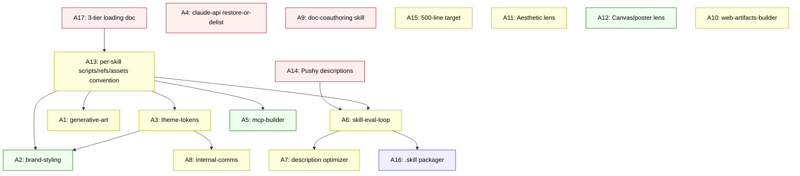

# Cross-Project Comparison: DevAI-Hub vs. anthropics/skills

**Version**: v1.1.5
**Generated**: 2026-05-07T00:00:00Z
**Analyzer**: Claude Code -- compare-project command
**External Source**: https://github.com/anthropics/skills
**Source Type**: Repository

---

## 1. Executive Summary

DevAI-Hub (188 skills, 22 categories, 5-platform installer) was compared against `anthropics/skills` (17 demonstration / production skills shipped flat under `skills/`). The two projects overlap on 6 skills end-to-end (docx / pdf / pptx / xlsx / webapp-testing / slack-gif-creator equivalents) and partially on 7 more, but DevAI-Hub has zero coverage of 4 high-value Anthropic skills: `algorithmic-art`, `brand-guidelines`, `claude-api`, and `theme-factory`. The most architecturally interesting gap is `skill-creator` -- its iteration loop with browser-based eval-viewer and automated description-optimization is a missing capability that would harden every other skill DevAI-Hub ships. Recommendation: **selective adoption** -- bring in the eval-iteration workflow, the per-skill `scripts/` / `references/` / `assets/` convention, and 4-5 net-new content skills, while declining vendor-specific assets and Claude.ai-only mechanics.

---

## 2. Project Profiles

| | DevAI-Hub | anthropics/skills |
|---|---|---|
| **Identity** | Production-grade skill catalog + installer for AI coding assistants. Brain upgrades for AI agents. | Demonstration / production skill examples illustrating Claude's skills system. |
| **Distribution model** | Template repo distributed via `installer.sh` / `installer.ps1` to 5 IDEs (Claude Code, Cursor, Codex, Gemini, OpenCode); local-first. | Marketplace plugin (`/plugin marketplace add anthropics/skills`) + Claude.ai paid plans + Claude API skill upload. |
| **License** | Repo license. Skills are first-party content. | Apache 2.0 for most skills; **proprietary / source-available** for docx, pdf, pptx, xlsx (the production document skills). |
| **Catalog size** | 188 skills, 22 categories, 32 commands, 13 hooks, 10 agents. | 17 skills, flat layout, no commands / hooks / agents. |
| **Layout** | `catalog/skills/<category>/<skill-name>/SKILL.md` + bundled subdirs. | `skills/<skill-name>/` flat (no category dir). Optional `scripts/` / `references/` / `assets/`. |
| **Frontmatter** | Required: `name`, `description`, `summary_l0` (<=15 words), `overview_l1` (<=150 words). | Required: `name`, `description`. Optional: `license`. Source-available skills add `license: Proprietary`. |
| **SKILL.md size norm** | <=800 lines (per `AGENTS.md`). | <=500 lines ideal (per `skill-creator/SKILL.md` line 96). |
| **Body sections required** | When-to-Use, Instructions, Common Rationalizations, Verification, Related Skills (per `AGENTS.md`). | None enforced. Examples / Guidelines suggested in template. |
| **Eval / triggering tooling** | `ai-output-evaluation` skill (rubrics, LLM-as-judge); no per-skill eval harness. | `skill-creator` ships `eval-viewer/generate_review.py`, `scripts/aggregate_benchmark`, `scripts/run_loop` (description optimizer), `agents/grader.md` / `comparator.md` / `analyzer.md`. |
| **Spec reference** | `AGENTS.md` (project-specific) + `data/SKILL_INDEX.md`. | Public spec at `agentskills.io/specification` (linked from `spec/agent-skills-spec.md`). |

---

## 3. Technology Stack Comparison

| Layer | DevAI-Hub | anthropics/skills | Notes |
|---|---|---|---|
| Distribution | Bash + PowerShell installers; Makefile; pre-commit hooks | Marketplace plugin manifest | DevAI-Hub is OS-agnostic by design (Windows / macOS / Linux); Anthropic skills assume Unix paths in scripts. |
| Markup | Markdown + YAML frontmatter | Markdown + YAML frontmatter | Same on the surface; DevAI-Hub uses richer frontmatter (`summary_l0`, `overview_l1`). |
| Bundled scripts | Repo-level `scripts/<name>.py` (e.g., `generate_report.py`); installed to `~/.devai-hub/scripts/` | Per-skill `scripts/` folders (e.g., `pdf/scripts`, `pptx/scripts/office/validators`); JS / TS / Python | Architectural difference: DevAI-Hub centralizes; Anthropic co-locates with the skill. |
| Languages in scripts | Python (Word / PPTX / Excel generators), Bash (hooks) | Python (most), JS / TS, Bash (artifact init) | Anthropic includes `web-artifacts-builder/scripts/init-artifact.sh` for React + Tailwind + shadcn scaffolding. |
| Test framework | pytest under `catalog/hooks/tests/`; ShellCheck via `make lint` | None at the repo level (each skill ships its own tools, none have a top-level test harness) | DevAI-Hub has stronger CI hygiene. |
| Document templates | `templates/documentation/*.{docx,pptx}` shared across skills | `algorithmic-art/templates/`, `theme-factory/themes/`, `slack-gif-creator/core/`, etc. -- per-skill assets | Different organizational patterns. |

---

## 4. AI Assistant Configuration Comparison

| Aspect | DevAI-Hub | anthropics/skills |
|---|---|---|
| Multi-IDE reach | 5 platforms (Claude Code, Cursor, Codex, Gemini, OpenCode) via `templates/ai-instructions/base-*.md` | Claude-only (Claude Code, Claude.ai, Claude API) |
| Skill registration | Triple-registry (`data/SKILL_INDEX.md`, `data/skills.json`, `data/marketplace.json`) | None; the `skills/<name>/` folder IS the registry |
| Commands | 32 slash commands at `catalog/commands/` distributed to Claude / Gemini / Codex | 0 |
| Hooks | 13 hooks (`secret-scan.sh`, `git-guardrails.sh`, `pre-commit review hooks`, etc.) | 0 |
| Agents | 10 agent YAML definitions at `catalog/agents/` | 0 (skill-creator has internal `agents/grader.md`, `comparator.md`, `analyzer.md` -- those are sub-agent prompts, not platform agents) |
| Style guides | `catalog/style-guides/markdown.md` + others, installed to `~/.devai-hub/style-guides/` | None |
| Memory templates | `catalog/memory/` -- auto-memory subsystem | None |
| Skill triggering | Two-tier: `summary_l0` always loaded, `overview_l1` on match, body on full trigger | Two-tier: name + description always loaded (~100 words), body on trigger (<500 lines), bundled resources on demand |
| Description style guidance | DevAI-Hub provides explicit trigger phrases in the body, not the description | **"Pushy" descriptions**: explicitly instructs the writer to combat undertriggering by listing trigger contexts in the description itself (`skill-creator/SKILL.md` line 67) |
| Test / eval harness | `ai-output-evaluation` skill (general rubric) | `skill-creator` ships an end-to-end eval-iteration loop: `evals.json` with assertions, with-skill / baseline subagent runs, `iteration-N` directories, `benchmark.json`, browser-based `eval-viewer/generate_review.py` |
| Description optimizer | None | `scripts/run_loop.py` -- automated 60 / 40 train-test split, 5-iteration optimization, `best_description` selection by held-out score |

---

## 5. Skills and Capabilities Gap Analysis

### 5a. Present in External, Missing in Current

| External skill | What it does | Closest DevAI-Hub | Gap |
|---|---|---|---|
| `algorithmic-art` | p5.js generative art, seeded randomness, interactive parameter exploration; outputs .md (philosophy) + .html (viewer) + .js (generator) | `creative-generation` (image prompts / decks), `glsl-shader-development` (shaders) | **Full miss**. No skill in DevAI-Hub covers p5.js or HTML-canvas generative art. |
| `brand-guidelines` | Apply organizational brand colors / typography to artifacts (slides, docs, HTML) | None | **Full miss**. The pattern (token-driven brand application) is missing. Anthropic's specific tokens are vendor-specific and OUT of scope per DevAI-Hub's company-neutral memory rule. |
| `claude-api` | Multi-language SDK guide (csharp / curl / go / java / php / python / ruby / typescript) for Claude API + Managed Agents, with prompt-caching as a baseline | `data/SKILL_INDEX.md` claims a `claude-api` skill at `catalog/skills/ai-development/claude-api/`, **but the directory does not exist on disk** (verified 2026-05-07; closest is `catalog/skills/ai-development/ai-agent-development/SKILL.md`). | **Index drift + content gap**. Either restore the missing skill or remove the stale index entry. |
| `theme-factory` | 10 pre-set themes (color palette + font pairing tokens) + on-the-fly theme generation, applied to slides / docs / reports / HTML | None | **Full miss**. Pattern is highly adoptable for `pptx-generation` / `docx-generation` / `pdf-document-generation` to consume. |
| `mcp-builder` (as a step-by-step build guide) | FastMCP (Python) + MCP SDK (Node / TS) walkthrough for building MCP servers, with reference docs and bundled scripts | `developer-experience/tool-design` (general AI tool/API design with MCP and function schemas) | **Partial miss**. `tool-design` is conceptual; `mcp-builder` is a build-runner with ready-made templates. |
| `skill-creator` eval-iteration loop | Test-prompt eval-set, with-skill vs baseline subagent runs, `iteration-N` workspaces, `grading.json`, `benchmark.json`, `eval-viewer/generate_review.py` (browser viewer with feedback collection), description optimization (`run_loop.py`), blind A/B comparator | `workflow/create-skill-or-command` + `workflow/create-custom-command` + `developer-experience/ai-output-evaluation` (3 separate skills) | **Partial miss**. DevAI-Hub has the pieces but no integrated iteration workflow with a browser viewer and held-out-test description optimizer. |
| `internal-comms` | Templates for 3P updates (Progress / Plans / Problems), status reports, leadership updates, company newsletters, FAQs, incident reports, project updates | `developer-experience/writing-editing`, `business-product/technical-writer` | **Partial miss**. DevAI-Hub has general writing skills; the structured-format library is missing. |
| `doc-coauthoring` | Three-stage workflow (Context Gathering -> Refinement & Structure -> Reader Testing) for collaborative doc creation | `business-product/technical-writer`, `developer-experience/writing-editing`, `documentation/technical-documentation` | **Partial miss**. The staged interactive workflow with explicit reader-testing step is not in DevAI-Hub. |
| `web-artifacts-builder` | Multi-component claude.ai HTML artifacts with React + Tailwind + shadcn/ui, including `init-artifact.sh` scaffolder | `developer-experience/frontend-ui-engineering`, `framework-specialists/react-expert` | **Partial miss**. Artifact scaffolding for multi-component HTML deliverables (state management, routing, shadcn) is not covered. Drop the "claude.ai-only" framing in adaptation. |
| `frontend-design` | Distinctive, production-grade frontend interfaces; explicitly anti-"AI slop" aesthetic | `developer-experience/frontend-ui-engineering` | **Partial miss**. DevAI-Hub focuses on accessibility / responsiveness / clean architecture; the aesthetic-distinctiveness lens is absent. |
| `canvas-design` | Static visual art (.png / .pdf) via design philosophy + visual expression two-step | `developer-experience/creative-generation` | **Partial miss**. `creative-generation` covers image prompts and decks; the static-poster / static-art angle with .pdf output is not first-class. |
| `slack-gif-creator` Slack-specific tuning | Hard size / dimension / frame-rate constraints + validation tools tuned for Slack uploads | `specialized-domains/gif-sticker-maker` | **Edge gap**. DevAI-Hub covers GIFs generally; Slack-specific validation is missing but low-value. |

### 5b. Present in Current, Missing in External (Strengths to Preserve)

DevAI-Hub has 30+ capability dimensions absent from `anthropics/skills`. The most load-bearing:

- **Cross-platform reach**: 5-IDE installer (`scripts/installer.sh` + `scripts/installer.ps1`), `templates/ai-instructions/base-{claude,codex,cursor,gemini,opencode}.md`. Anthropic's repo is Claude-only.
- **MCP Registry Policy** (`AGENTS.md` decision tree + `docs/policy/mcp-reverse-engineering-matrix.md`). Anthropic ships skills only -- no MCP governance posture.
- **Hooks subsystem** (`secret-scan.sh`, `git-guardrails.sh`, `large-file-guard.sh`, the four AI-CLI pre-commit review hooks from v1.1.3, `format-bash-description.py`, `format-powershell-description.py`). Anthropic ships zero hooks.
- **32 slash commands** (`/setup-project`, `/generate-plan`, `/implement-phase`, `/wrap-up-session`, `/update-version`, `/run-deep-review`, `/run-security-audit`, `/run-penetration-test`, `/review-codebase`, `/analyze-codebase`, `/compare-project`, `/install-pre-commit-review-hook`, etc.). Anthropic ships zero commands.
- **10 specialized agents** (`code-reviewer`, `security-reviewer`, `architect`, `harness-optimizer`, `tdd-guide`, etc.). Anthropic exposes only sub-agent prompts inside `skill-creator/agents/`.
- **Style guides** (`catalog/style-guides/markdown.md` for generated docs, `commit-message`-related guides). Anthropic has none.
- **Auto-memory subsystem** (`MEMORY.md` index + per-topic `<name>.md` files distributed via `catalog/memory/`).
- **Workflow categories** (compliance, infrastructure, language-specialists, framework-specialists, code-cleanup, security, testing). Anthropic does not group skills by category.
- **Tiered frontmatter** (`summary_l0` <=15 words, `overview_l1` <=150 words) for progressive disclosure at the registry level. Anthropic relies only on the description.
- **Body section conventions** (When-to-Use, Common Rationalizations, Verification, Related Skills). Anthropic enforces nothing structural in skill bodies.

### 5c. Present in Both, Quality Comparison

| Capability | DevAI-Hub | anthropics/skills | Winner |
|---|---|---|---|
| DOCX generation | `specialized-domains/docx-generation/SKILL.md` | `skills/docx/` + `scripts/office/{helpers,schemas,validators}` | **Anthropic** on tooling depth (validator pipeline). |
| PPTX generation | `specialized-domains/pptx-generation/SKILL.md` | `skills/pptx/` + `editing.md`, `pptxgenjs.md`, `scripts/office/{helpers,schemas,validators}` | **Anthropic** on tooling depth + pptxgenjs path documented. |
| PDF generation | `specialized-domains/pdf-document-generation/SKILL.md` | `skills/pdf/` + `forms.md`, `reference.md`, `scripts/` | **Anthropic** on form-fill coverage and split / merge / OCR scripts. |
| XLSX | `specialized-domains/xlsx-generation/SKILL.md` | `skills/xlsx/` + validator pipeline | **Anthropic** on validator depth. |
| GIF / sticker creation | `specialized-domains/gif-sticker-maker/SKILL.md` | `skills/slack-gif-creator/` (Slack-specific) | **DevAI-Hub** on generality. |
| Web app testing (Playwright) | `testing/e2e-testing-automation/SKILL.md` + `testing/browser-testing-with-devtools/SKILL.md` | `skills/webapp-testing/` + `examples/`, `scripts/` | **DevAI-Hub** on coverage breadth (E2E + DevTools). |
| Skill creation | `workflow/create-skill-or-command/SKILL.md` (separate) + `workflow/create-custom-command/SKILL.md` | `skills/skill-creator/` -- single skill that creates, edits, evaluates, optimizes | **Anthropic** on integration -- the eval-iteration + description-optimization loop is missing in DevAI-Hub. |
| MCP server building | `developer-experience/tool-design/SKILL.md` (general) | `skills/mcp-builder/` (FastMCP + TS SDK runbook) | **Anthropic** for the build-runbook; **DevAI-Hub** for the architectural lens. |

---

## 6. Commands and Automation Comparison

### 6a. Commands Gap

| Direction | Count | Examples |
|---|---|---|
| External-only | 0 | Anthropic ships no slash commands; their model is "skill triggers from prose, no commands." |
| Current-only | 32 | `/setup-project`, `/generate-plan`, `/implement-phase`, `/wrap-up-session`, `/update-version`, `/compare-project`, `/run-deep-review`, etc. |

Adoption note: Anthropic's design philosophy (skills only, no commands) is intentional. The DevAI-Hub command surface is a strict superset and a strength to preserve.

### 6b. CI / CD and Hooks Gap

| Direction | Count | Notes |
|---|---|---|
| External-only | 0 | Anthropic ships no CI / hooks for the catalog itself. |
| Current-only | 13+ | `secret-scan.sh`, `git-guardrails.sh`, `large-file-guard.sh`, four AI-CLI `*-diff-review.sh` hooks, `format-{bash,powershell}-description.py`, `require-{description,powershell-description}.sh`. |

---

## 7. Documentation and Developer Experience Comparison

| Aspect | DevAI-Hub | anthropics/skills |
|---|---|---|
| README | Detailed: workflow phases, install steps, mascot, badges. | Short: marketplace install, links to `support.claude.com` docs, partner-skills shout-out. |
| CHANGELOG | Keep-a-Changelog format, 1.1.0 - 1.1.5 sub-releases tracked, "Why a separate patch" rationale per entry. | None at the repo root. |
| DEVLOG | `docs/DEVLOG.md` | None. |
| Onboarding | One-click installer (`install.bat` / `./install.sh`) -> drag and drop project -> done. | `/plugin marketplace add anthropics/skills` then plugin browse. Zero local-install path. |
| Spec linkage | Internal `AGENTS.md` + `CATALOG-COVERAGE.md`. | Public `agentskills.io/specification` (linked from `spec/agent-skills-spec.md`). |
| Skill discovery aid | `data/SKILL_INDEX.md` table of all 188 skills (auto-generated); MCP `search_skills` tool + skill-discovery doc in CLAUDE.md. | None -- users browse the file tree. |
| Internal style guide | `catalog/style-guides/markdown.md` (cross-skill), inlined from `AGENTS.md` enforcement. | None. |
| Per-skill bundled assets | Mostly absent (assets centralized at `templates/documentation/`). | Heavy use: `algorithmic-art/templates/`, `theme-factory/themes/` + `theme-showcase.pdf`, `slack-gif-creator/core/`, `claude-api/{lang}/managed-agents/`, etc. |

---

## 8. Testing and Security Posture Comparison

| Aspect | DevAI-Hub | anthropics/skills |
|---|---|---|
| Hook test suite | `catalog/hooks/tests/` (pytest) -- e.g., `test_format_bash_description.py`, `test_diff_review_hooks.py` | None. |
| ShellCheck CI | `make lint` | None enforced at repo level. |
| JSON catalog validator | `make validate` (gates skill registry) | None. |
| Pre-commit secret scan | `secret-scan.sh` | None. |
| Pre-commit AI review | Four-CLI pre-commit hooks (claude / gemini / codex / opencode) gated on `VERDICT: PASS\|WARN\|BLOCK` | None. |
| Skill-level eval | `developer-experience/ai-output-evaluation/SKILL.md` (general rubric) | `skill-creator` -- per-skill eval set + grader subagent + benchmark + viewer. |
| Skill-level security policy | MCP Registry Policy + reverse-engineering matrix + 5-question audit checklist | None. |
| Vendor data flow rules | Hard-no list (search-as-service, embeddings-as-service, etc.); company-neutral framing rule | None -- skills are free to reference Anthropic's brand and infrastructure. |

---

## 9. Security and Risk Assessment (MANDATORY -- gates Section 11)

This section walks the MCP Registry Policy decision tree from `AGENTS.md` against every Section 5 candidate. Items classified `drop-outright` go to Section 13's N-list and never appear in Section 11.

### 9.1 Threat Model Comparison

| Dimension | DevAI-Hub today | anthropics/skills today | Adoption delta |
|---|---|---|---|
| New runtime dependencies introduced | Skill bodies are inert content; bundled scripts are explicit and pinned. | Skills like `web-artifacts-builder` install React / Tailwind / shadcn at runtime via `init-artifact.sh`. `webapp-testing` requires Playwright. `mcp-builder` requires FastMCP / MCP SDK. | Adopted skills must declare deps explicitly and follow the existing lazy-import + actionable-error pattern (`scripts/generate_report.py`). |
| Outbound calls at runtime | Only via user-installed CLIs that the user already runs (claude / gemini / codex / opencode). No skill performs outbound calls on its own. | `skill-creator/run_loop.py` shells out to `claude -p`. `claude-api` skill calls the Claude API by definition (it IS the SDK). | Adopted eval-loop must be CLI-agnostic per the v1.1.3 four-hook precedent. |
| Credentials / API keys | None required by the skill bodies. | `claude-api` skill -- ANTHROPIC_API_KEY. `skill-creator/run_loop.py` -- inherits the active CLI's auth. | OK if key is the user's own and the relationship is intrinsic. |
| Source code / prompts / query text leaving the local machine | Never -- DevAI-Hub is local-first. | `skill-creator` description optimizer sends the skill description to `claude -p`. `claude-api` skill ships code to the Claude API by design. | Both are intrinsic destinations (user's own Anthropic relationship). Documented as such. |
| New commercial relationship | None required. | `claude-api` -- already a Claude user assumed. `mcp-builder` reference vendors -- variable. | Acceptable; documented in adoption rationale. |

### 9.2 Per-Item Risk Scorecard

| # | Item (Section 5a) | Risk tier | Justification |
|---|---|---|---|
| A1 | `algorithmic-art` skill | None | Pure local p5.js code generation; no outbound calls; no credentials. |
| A2 | Generic `brand-styling` skill (RE'd from `brand-guidelines` pattern) | None | Token-driven application with user-supplied palette / fonts; no vendor data. |
| A3 | `theme-factory` skill | None | Static curated themes (palette + font tokens); no outbound calls. |
| A4 | `claude-api` skill (restoration) | Low | Skill body documents API usage; user must already have ANTHROPIC_API_KEY. Intrinsic destination. |
| A5 | `mcp-builder` skill | Low | Documents how to build an MCP server; runtime deps (FastMCP / MCP SDK) installed by the user. |
| A6 | Skill-eval iteration workflow + browser viewer | Low | Local-only. Spawns subagents via the active CLI. Multi-CLI parity required (see 9.3 A6). |
| A7 | Description optimizer (held-out test, A / B) | Low | Calls the active CLI in a loop. Multi-CLI parity required. |
| A8 | `internal-comms` skill (formats library) | None | Pure content (templates for 3P / status / FAQ / incident). |
| A9 | `doc-coauthoring` workflow skill | None | Pure workflow content. |
| A10 | `web-artifacts-builder` skill (de-Claude.ai-ified) | Low | `init-artifact.sh` installs npm deps locally; no outbound. |
| A11 | `frontend-design` aesthetic-distinctiveness lens | None | Pure content augmentation to existing `frontend-ui-engineering`. |
| A12 | `canvas-design` static-poster pattern | None | Pure local generation. |
| A13 | Per-skill `scripts/` / `references/` / `assets/` convention | None | Layout / installer change only. |
| A14 | "Pushy" description guidance | None | Doc change in skill-creator + create-skill-or-command. |
| A15 | SKILL.md body length norm reconciliation (500 vs 800) | None | Doc change. |
| A16 | `.skill` packaging format + `package_skill.py` port | Low | Local file packaging; no outbound. |
| A17 | Three-tier loading model (metadata / body / bundled-resources, scripts execute without being read) | None | Already partially in use; formalize. |

### 9.3 Reverse-Engineering Viability Analysis

Per `AGENTS.md` MCP Registry Policy decision tree:

| # | Item | Classification | Internal deliverable | Effort | Rationale |
|---|---|---|---|---|---|
| A1 | `algorithmic-art` | `re-full` | New skill `catalog/skills/specialized-domains/generative-art/SKILL.md` + `templates/` (p5.js scaffolds) | Medium | Pure content + scaffolds. Strip Anthropic-source attribution per the reverse-engineering rule; use generic descriptive name. |
| A2 | `brand-guidelines` (token-pattern) | `re-partial` | New skill `catalog/skills/specialized-domains/brand-styling/SKILL.md` consuming user-supplied tokens | Medium | The PATTERN is generalizable; Anthropic's specific palette / fonts are dropped (see N1). |
| A3 | `theme-factory` | `re-full` | New skill `catalog/skills/specialized-domains/theme-tokens/SKILL.md` + `themes/` directory of generic palettes | Medium | 10 generic themes (no Anthropic branding); wired into `pptx-generation` / `docx-generation` / `pdf-document-generation` consumers. |
| A4 | `claude-api` (restoration) | `re-full` (already done in spirit) | Restore `catalog/skills/ai-development/claude-api/SKILL.md` OR remove the stale index entry | Low | The skill has a row in `data/SKILL_INDEX.md` and `data/skills.json` but no file. Decide: rebuild or de-list. |
| A5 | `mcp-builder` | `re-full` | New skill `catalog/skills/ai-development/mcp-builder/SKILL.md` with `references/{fastmcp,ts-sdk}.md` and `scripts/init-mcp.sh` | High | Reverse-engineer the Anthropic content into a generic FastMCP / TS SDK guide. Cite `developer-experience/tool-design` as the conceptual companion. |
| A6 | Eval-iteration workflow + browser viewer | `re-full` | New skill `catalog/skills/workflow/skill-eval-loop/SKILL.md` + `scripts/skill_eval_viewer.py` + `scripts/aggregate_benchmark.py` | High | All logic is local Python + HTML. Make it CLI-agnostic via the v1.1.3 four-hook precedent (claude / gemini / codex / opencode). MCP Registry Policy: `re-full`. |
| A7 | Description optimizer | `re-full` | `scripts/optimize_skill_description.py` (added by A6) | Medium | 60 / 40 train-test split + 5-iteration loop, parametrized by CLI binary. |
| A8 | `internal-comms` formats library | `re-full` | New skill `catalog/skills/business-product/internal-comms/SKILL.md` with format library | Medium | Generic templates; no vendor specificity. Reword Anthropic-flavored examples. |
| A9 | `doc-coauthoring` workflow | `re-full` | New skill `catalog/skills/workflow/doc-coauthoring/SKILL.md` (or augment `business-product/technical-writer`) | Low | Pure workflow content. |
| A10 | `web-artifacts-builder` | `re-full` | New skill `catalog/skills/developer-experience/web-artifacts-builder/SKILL.md` + `scripts/init-artifact.sh` (Vite + React + Tailwind + shadcn scaffold) | Medium | Drop the "claude.ai" framing; ship as a generic multi-component HTML artifact builder. |
| A11 | `frontend-design` aesthetic-distinctiveness lens | `skill-native` | Augment `developer-experience/frontend-ui-engineering/SKILL.md` with an aesthetic-distinctiveness section + counter-examples | Low | Doc edit; no new skill needed. The agent can already reason about aesthetic distinctiveness when prompted. |
| A12 | `canvas-design` static-poster pattern | `skill-native` | Augment `developer-experience/creative-generation/SKILL.md` with a static-art / .pdf-output workflow | Low | Doc edit. |
| A13 | Per-skill `scripts/` / `references/` / `assets/` convention | `re-full` | Update `AGENTS.md` "Adding a New Skill" section + installer copy logic; update `catalog/commands/create-skill-or-command.md` | Medium | Layout convention + installer hookup. Costs: registry validation, installer dual-edit, doc rewrite. |
| A14 | "Pushy" description guidance | `skill-native` | Augment `workflow/create-skill-or-command/SKILL.md` (and the `/create-custom-command` skill) | Low | Doc-only. Adopt explicit-trigger / explicit-skip language pattern. |
| A15 | SKILL.md size norm (<=500 lines target) | `skill-native` | Update `AGENTS.md` "Keep SKILL.md under 800 lines" -> "Target <=500 lines, soft cap 800" | Low | Doc-only. |
| A16 | `.skill` packaging format | `re-partial` | New `scripts/package_skill.py` -- emits a `.skill` archive | Medium | Useful for Claude.ai / Anthropic API skill upload (a delivery channel DevAI-Hub does not currently reach). Marked `re-partial` because Anthropic owns the `.skill` consumer side -- DevAI-Hub can produce but not validate consumption. |
| A17 | Three-tier loading model formalization | `skill-native` | Update `AGENTS.md` to say: tier 1 metadata always loaded, tier 2 body on trigger, tier 3 bundled resources on demand (scripts can EXECUTE without being loaded into the context window) | Low | Doc-only. Already partially practiced; formalize. |

### 9.4 Recommendation Ordering

Per the policy decision tree, adoption ordering for Section 11 is:

1. **`skill-native` first** (zero-code, doc-only): A11, A12, A14, A15, A17.
2. **`re-full` and `re-partial` next** (build internal): A4, A9, A1, A3, A8, A10, A13, A6, A7, A2, A5, A16.
3. **`vendor-intrinsic`**: none -- the catalog is content + local scripts, no vendor-intrinsic items.
4. **`drop-outright`**: see Section 13's N-list.

---

## 10. Structural and Architectural Differences

Notable differences worth considering even when no single adoption item maps:

- **Flat vs categorized skills.** Anthropic's flat layout is fine at 17 skills; it would not scale to 188. DevAI-Hub's category structure should be preserved.
- **Skill body discipline.** Anthropic's skills lean shorter (<=500 lines target) and rely on `references/` for depth. DevAI-Hub's <=800-line norm + required body sections (Common Rationalizations, Verification, Related Skills) trade brevity for structural rigor. The structure is a strength; the line target should tighten to 500 with 800 as a soft cap (A15).
- **Per-skill bundled artifacts.** Anthropic colocates scripts / templates / themes / fonts / assets with each skill folder. DevAI-Hub centralizes most assets. Co-locating creates strong cohesion but installer complexity. Recommended: support BOTH (keep `templates/documentation/` shared; allow per-skill `scripts/`, `references/`, `assets/` for cohesion-heavy skills).
- **Triple-registry vs file-tree-as-registry.** DevAI-Hub's `data/SKILL_INDEX.md` + `data/skills.json` + `data/marketplace.json` is overkill at 17 skills but mandatory at 188. Strength to preserve, but the Section 5a A4 finding (claude-api index drift) shows the triple-registry needs a `make validate` extension that compares filesystem to index.
- **Spec authority.** Anthropic links to a public spec (`agentskills.io`); DevAI-Hub uses internal `AGENTS.md`. Consider linking `agentskills.io` from DevAI-Hub's own SKILL.md template as the upstream interoperable contract (DevAI-Hub is a strict superset).
- **Eval mindset.** Anthropic treats eval-driven iteration as core to skill quality. DevAI-Hub treats it as an optional `ai-output-evaluation` skill. Adopting A6 + A7 institutionalizes "test your skill with real prompts" as part of the workflow.

---

## 11. Adoption Plan

Organized by Section 9.4 RE-bucket, then by P-tier within each bucket. Item IDs match Section 9 for traceability.

### Bucket 1 -- `skill-native` (zero-code, doc-only)

| ID | Priority | What | Source | Target | Effort | Dependencies | Risk |
|---|---|---|---|---|---|---|---|
| A14 | P0 | Pushy description guidance | `skill-creator/SKILL.md` line 67 | `workflow/create-skill-or-command/SKILL.md` + `workflow/create-custom-command/SKILL.md` | Low | None | None |
| A17 | P0 | Three-tier loading model formalization | `skill-creator/SKILL.md` lines 86-93 | `AGENTS.md` "Adding a New Skill" + skill-template doc | Low | None | None |
| A15 | P1 | SKILL.md size norm: target 500, cap 800 | `skill-creator/SKILL.md` line 96 | `AGENTS.md` "Keep SKILL.md under 800 lines" sentence | Low | A17 | Low -- existing skills exceed 500 lines; norm is aspirational, not enforced. |
| A11 | P1 | Aesthetic-distinctiveness lens | `frontend-design/SKILL.md` | `developer-experience/frontend-ui-engineering/SKILL.md` | Low | None | None |
| A12 | P2 | Static-poster / .pdf workflow | `canvas-design/SKILL.md` | `developer-experience/creative-generation/SKILL.md` | Low | None | None |

### Bucket 2 -- `re-full` and `re-partial` (build internal)

| ID | Priority | What | Source | Target | Effort | Dependencies | Risk |
|---|---|---|---|---|---|---|---|
| A4 | P0 | Restore or de-list the `claude-api` skill | `claude-api/SKILL.md` (Anthropic) | `catalog/skills/ai-development/claude-api/SKILL.md` OR remove from `data/SKILL_INDEX.md` + `data/skills.json` + `data/marketplace.json` | Low | None | None -- pure cleanup. Already in user's auto-memory as imported. |
| A9 | P0 | `doc-coauthoring` 3-stage workflow skill | `doc-coauthoring/SKILL.md` | `catalog/skills/workflow/doc-coauthoring/SKILL.md` | Low | None | None -- new skill. |
| A1 | P1 | Generative-art (p5.js) skill | `algorithmic-art/SKILL.md` + `templates/` | `catalog/skills/specialized-domains/generative-art/SKILL.md` + per-skill `templates/` (requires A13) | Medium | A13 | Low -- aesthetic content. Strip upstream attribution (reverse-engineering rule). |
| A3 | P1 | `theme-tokens` skill (10 generic themes) | `theme-factory/themes/` | `catalog/skills/specialized-domains/theme-tokens/SKILL.md` + per-skill `themes/` | Medium | A13 | Low -- generic palettes only; no Anthropic-branded tokens. |
| A8 | P1 | `internal-comms` formats library | `internal-comms/SKILL.md` + `examples/` | `catalog/skills/business-product/internal-comms/SKILL.md` | Medium | None | Low -- content; reword Anthropic-flavored examples. |
| A10 | P1 | `web-artifacts-builder` (de-vendored) | `web-artifacts-builder/SKILL.md` + `scripts/init-artifact.sh` | `catalog/skills/developer-experience/web-artifacts-builder/SKILL.md` + repo-level `scripts/init_web_artifact.sh` | Medium | None | Low -- drop "claude.ai" framing; generic multi-component HTML. |
| A13 | P1 | Per-skill `scripts/` / `references/` / `assets/` convention | `skill-creator/SKILL.md` lines 75-110 | `AGENTS.md` "Installer-Aware Changes" + installer auto-copy of `catalog/skills/<cat>/<name>/{scripts,references,assets}/` | Medium | None | **Medium -- installer dual-edit + JSON-validator update**. Currently `scripts/<name>.py` MUST be registered by name; per-skill scripts would need a recursive-copy variant. |
| A6 | P1 | Skill-eval-loop workflow + browser viewer | `skill-creator/SKILL.md` Steps 1-5 + `eval-viewer/generate_review.py` + `scripts/aggregate_benchmark.py` + `agents/grader.md` / `comparator.md` / `analyzer.md` | New skill `catalog/skills/workflow/skill-eval-loop/SKILL.md` + repo-level `scripts/skill_eval_viewer.py` + `scripts/aggregate_benchmark.py` + sub-agent prompts under the new skill's `agents/` (requires A13) | High | A13, A17 | Medium -- requires CLI-agnostic adapter (claude / gemini / codex / opencode), per the v1.1.3 four-hook precedent. Cite MCP Registry Policy (A6 is `re-full`, not vendor-intrinsic). |
| A7 | P1 | Description optimizer (held-out test) | `skill-creator/scripts/run_loop.py` | `scripts/optimize_skill_description.py` (added by A6) | Medium | A6 | Medium -- requires CLI-agnostic adapter. |
| A2 | P2 | Generic `brand-styling` skill (token pattern) | `brand-guidelines/SKILL.md` (pattern only -- DROP the actual Anthropic palette per N1) | `catalog/skills/specialized-domains/brand-styling/SKILL.md` | Medium | A3 (theme-tokens), A13 | Low -- generic; ship with empty palette + fonts placeholder, NOT vendor tokens. |
| A5 | P2 | `mcp-builder` skill (FastMCP + TS SDK) | `mcp-builder/SKILL.md` + `reference/` + `scripts/` | `catalog/skills/ai-development/mcp-builder/SKILL.md` + `references/{fastmcp,ts-sdk}.md` + `scripts/init-mcp.{sh,ps1}` | High | A13 | Low -- conceptual + scaffolding; no outbound. Companion to existing `developer-experience/tool-design`. |
| A16 | P3 | `.skill` packaging format + `package_skill.py` port | `skill-creator/scripts/package_skill.py` | `scripts/package_skill.py` + installer registration in `installer.{sh,ps1}` | Medium | A6 | Medium -- Anthropic owns the consumer side of `.skill`; DevAI-Hub can emit but cannot validate consumption. Useful only if users target Claude.ai distribution. |

### Bucket 3 -- `vendor-intrinsic`

None.

### Bucket 4 -- `drop-outright`

See Section 13 N-list (N1-N3).

---

## 12. Implementation Sequence

Suggested phasing (each phase ends with `make validate` + `make lint` + `make test` + a CHANGELOG entry):

**Phase A -- Doc-only (P0 / P1, `skill-native`)**: A14 + A17 + A15 + A11 + A12. One PR. ~1 day.

**Phase B -- Cleanup (P0, `re-full`)**: A4 (restore or delist `claude-api`) + A9 (`doc-coauthoring`). Decoupled from layout changes. ~0.5 day.

**Phase C -- Layout convention (P1, `re-full`, blocking)**: A13 (per-skill `scripts/` / `references/` / `assets/` + installer dual-edit + `make validate` extension). ~1.5 days.

**Phase D -- Net-new skills (P1, `re-full`)**: A1, A3, A8, A10. Parallelizable after C. ~3-4 days.

**Phase E -- Eval workflow (P1, `re-full`)**: A6 then A7 (CLI-agnostic adapter following the v1.1.3 four-hook precedent). ~3 days.

**Phase F -- Polish (P2)**: A2 (depends on A3), A5. ~2 days.

**Phase G -- Optional (P3)**: A16 only if Claude.ai distribution becomes a goal. Defer.

---

## 13. Risks and Considerations

### Conflicts with existing patterns

- **A13 (per-skill bundled scripts)** breaks the current installer rule that "every script under `scripts/<name>.py` MUST be registered in BOTH `installer.sh` AND `installer.ps1`" (per `CLAUDE.md` rule 1). The convention change is additive (per-skill scripts coexist with repo-level scripts), but the recursive copy needs a JSON-validator extension to detect orphaned per-skill scripts.
- **A6 + A7 (eval loop + description optimizer)** call out to `claude -p` in the upstream. DevAI-Hub policy (per memory `project_platform_agnostic.md` and the v1.1.3 four-hook precedent) requires CLI-agnostic implementation across claude / gemini / codex / opencode. This is non-negotiable; budget the parity work into the effort estimate.
- **A1, A3, A8, A10 (new content skills)** must be reworded per memory `feedback_no_employer_refs.md` and the AGENTS.md reverse-engineering attribution rule -- generic descriptive names, no upstream-source citations in the user-facing artifact.
- **A15 (500-line target)** -- many existing DevAI-Hub skills exceed 500 lines (verified in spot-check; e.g., `ai-agent-development/SKILL.md` is large with detailed effort-level guidance). The target is aspirational and forward-looking; do not retroactively shrink existing skills as part of this adoption.
- **A4 (claude-api restore)** -- the user's auto-memory says claude-api was already imported, but the file is missing. Confirm with the user whether to restore from `anthropics/skills/claude-api/` or remove from the index.

### Maintenance burden

- Per-skill `scripts/` (A13) increases the surface area for `make lint` / `make validate` regressions. Add a CI check that every per-skill `scripts/*.py` runs through `python -m py_compile` and `ShellCheck` for `*.sh`.
- The eval workflow (A6) introduces a viewer process and per-skill workspace directories. Document a `make clean-eval-workspaces` target up front to keep repo bloat predictable.

### Items explicitly NOT recommended for adoption (security / policy reasons)

- **N1: Anthropic's actual brand colors / fonts / logo from `brand-guidelines/`.** Rejection reason: violates DevAI-Hub's company-neutral framing rule (memory `feedback_no_employer_refs.md`) and the AGENTS.md reverse-engineering attribution rule. Adopt the PATTERN (token-driven brand application) as A2; do NOT copy Anthropic's specific design tokens. The skill ships with an empty palette / fonts placeholder for the user to fill.
- **N2: The verbatim `claude -p`-only optimization loop from `skill-creator/scripts/run_loop.py`.** Rejection reason: violates platform-agnostic policy (memory `project_platform_agnostic.md`, v1.1.3 four-hook precedent). Adopt the LOOP DESIGN (60 / 40 train-test split, 5-iteration with held-out scoring, `best_description` selection) but reimplement with a CLI adapter that auto-detects claude / gemini / codex / opencode the same way `install-pre-commit-review-hook` does.
- **N3: Claude.ai-specific instructions (`skill-creator/SKILL.md` lines 420-456) verbatim.** Rejection reason: DevAI-Hub targets 5 platforms equally; Claude.ai-only mechanics (no subagents, no display, browser-fallback `--static`) belong as one branch in a multi-platform decision table inside the adopted A6 skill, not as the dominant narrative.
- **N4: The Anthropic `.skill` consumer-side validation.** Rejection reason: DevAI-Hub can EMIT a `.skill` file (A16) but cannot validate that an Anthropic consumer parses it correctly. Marked `re-partial` and gated on A6 / Phase G as P3.

---

## Appendix: Source Inventory Cross-Reference

| External skill | Path in clone | DevAI-Hub equivalent on disk | Adoption ID |
|---|---|---|---|
| algorithmic-art | `skills/algorithmic-art/SKILL.md` (+ `templates/`) | none | A1 |
| brand-guidelines | `skills/brand-guidelines/SKILL.md` | none | A2 (pattern only) / N1 (assets dropped) |
| canvas-design | `skills/canvas-design/SKILL.md` (+ `canvas-fonts/`) | `catalog/skills/developer-experience/creative-generation/SKILL.md` | A12 (augment) |
| claude-api | `skills/claude-api/SKILL.md` (+ 8 lang dirs) | **MISSING** -- index claims `catalog/skills/ai-development/claude-api/SKILL.md`, file absent | A4 |
| doc-coauthoring | `skills/doc-coauthoring/SKILL.md` | `catalog/skills/business-product/technical-writer/SKILL.md` (close) | A9 |
| docx | `skills/docx/SKILL.md` (+ `scripts/office/{helpers,schemas,validators}`) | `catalog/skills/specialized-domains/docx-generation/SKILL.md` | (deferred -- equivalent) |
| frontend-design | `skills/frontend-design/SKILL.md` | `catalog/skills/developer-experience/frontend-ui-engineering/SKILL.md` | A11 (augment) |
| internal-comms | `skills/internal-comms/SKILL.md` (+ `examples/`) | none | A8 |
| mcp-builder | `skills/mcp-builder/SKILL.md` (+ `reference/`, `scripts/`) | `catalog/skills/developer-experience/tool-design/SKILL.md` (related) | A5 |
| pdf | `skills/pdf/SKILL.md` (+ `forms.md`, `reference.md`, `scripts/`) | `catalog/skills/specialized-domains/pdf-document-generation/SKILL.md` | (deferred -- equivalent) |
| pptx | `skills/pptx/SKILL.md` (+ `editing.md`, `pptxgenjs.md`, `scripts/office/{helpers,schemas,validators}`) | `catalog/skills/specialized-domains/pptx-generation/SKILL.md` | (deferred -- equivalent) |
| skill-creator | `skills/skill-creator/SKILL.md` (+ `agents/`, `assets/`, `eval-viewer/`, `references/`, `scripts/`) | `catalog/skills/workflow/create-skill-or-command/SKILL.md` + `workflow/create-custom-command/SKILL.md` + `developer-experience/ai-output-evaluation/SKILL.md` | A6 + A7 + A14 + A17 |
| slack-gif-creator | `skills/slack-gif-creator/SKILL.md` (+ `core/`, `requirements.txt`) | `catalog/skills/specialized-domains/gif-sticker-maker/SKILL.md` | (no action) |
| theme-factory | `skills/theme-factory/SKILL.md` (+ `themes/`, `theme-showcase.pdf`) | none | A3 |
| web-artifacts-builder | `skills/web-artifacts-builder/SKILL.md` (+ `scripts/`) | `catalog/skills/developer-experience/frontend-ui-engineering/SKILL.md` (close) | A10 |
| webapp-testing | `skills/webapp-testing/SKILL.md` (+ `examples/`, `scripts/`) | `catalog/skills/testing/e2e-testing-automation/SKILL.md` + `testing/browser-testing-with-devtools/SKILL.md` | (no action) |
| xlsx | `skills/xlsx/SKILL.md` (+ `scripts/office/{helpers,schemas,validators}`) | `catalog/skills/specialized-domains/xlsx-generation/SKILL.md` | (deferred -- equivalent) |
