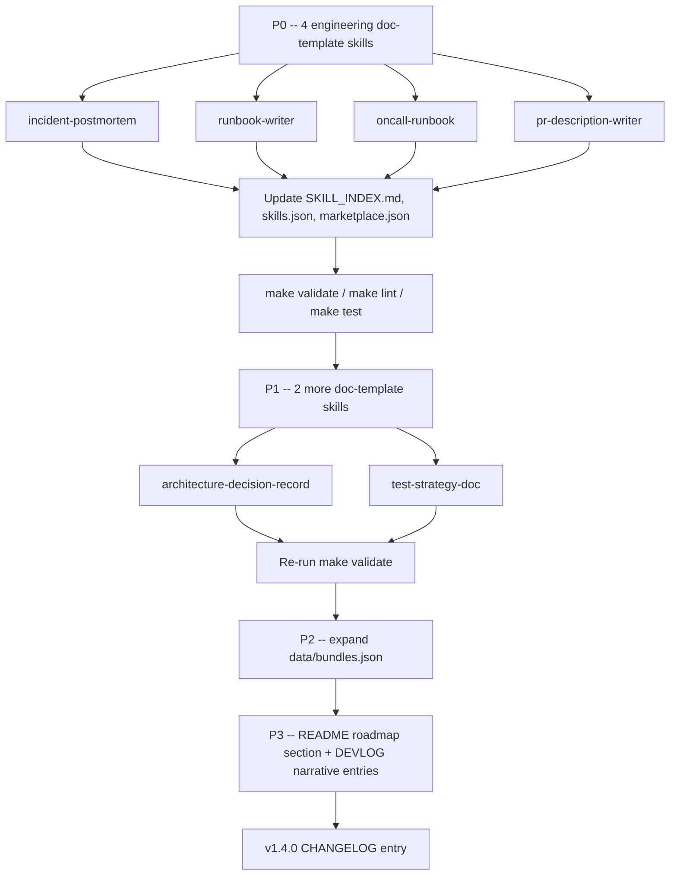

# Cross-Project Comparison: DevAI-Hub vs. pm-claude-skills

**Version**: v1.3.0
**Generated**: 2026-05-19
**Analyzer**: Claude Code -- compare-project command
**External Source**: https://github.com/mohitagw15856/pm-claude-skills (shallow clone, default branch)
**Source Type**: Repository

---

## 1. Executive Summary

DevAI-Hub (v1.3.0, 197 skills across 22 categories, multi-IDE installer, hooks, commands, agents, MCP registry) and pm-claude-skills (v10.0.0, 114-119 skill folders flat under `skills/`, 23 plugin bundles, 4 agent templates) target fundamentally different domains. DevAI-Hub is an **AI coding-assistant catalog** for software engineering; pm-claude-skills is a **professional document-template catalog** spanning PM, marketing, legal, finance, HR, sales, operations, healthcare, design, and engineering. The overlap is narrow: pm-claude-skills' 14-skill `pm-engineering` bundle is the only zone with meaningful adoption candidates, and even there DevAI-Hub already covers the same ground at advisor/orchestration depth (the gap is specifically *document-template* skills that produce a finished artifact). All adoption candidates are pure SKILL.md content with no scripts, no MCPs, no outbound calls, and no new dependencies — risk is uniformly low. Recommendation: **selectively adopt 4-6 document-template engineering skills as new additions, ignore the other ~108 skills as out-of-scope, do NOT adopt the flat directory layout, do NOT adopt the connector-based "agent template" pattern (conflicts with MCP Registry Policy), but DO consider the star-milestone roadmap and skill-bundle marketing patterns**.

---

## 2. Project Profiles

| Dimension | DevAI-Hub (current) | pm-claude-skills (external) |
|---|---|---|
| **Identity** | Production-grade skill catalog for AI coding assistants | Community library of professional Claude Skills across 16 professions |
| **Purpose** | Distribute coding-focused skills/commands/hooks/agents to developer workstations via cross-platform installer | Distribute structured-output document templates via Claude Code plugin marketplace |
| **Version** | v1.3.0 (semver, stable post-v1.0.0) | v10.0.0 (rolling, milestone-driven) |
| **License** | (see repo LICENSE) | MIT |
| **Maturity** | 17 versioned doc directories, CHANGELOG, DEVLOG, pytest suite, ShellCheck, make targets, MCP Registry Policy, reverse-engineering matrix | Single README, plugin marketplace registration, Medium article series, star-milestone gating |
| **Scale** | 197 skills, 22 categories, 33 commands, 14 hooks, 10 agents, multi-platform installer for 5 IDEs | 114-119 skill folders, 23 bundles, 4 agent templates, no commands, no hooks, no installer |
| **Audience** | Software engineers using Claude Code, Gemini CLI, Codex, Cursor, OpenCode | All professionals (PM, legal, HR, finance, sales, marketing, etc.) using Claude Code |
| **Distribution** | Bash + PowerShell installers copying into `~/.claude/`, `~/.gemini/`, `~/.codex/`, plus instruction-template editing for Cursor / OpenCode / Copilot | Claude Code `/plugin marketplace add` only |

---

## 3. Technology Stack Comparison

| Layer | DevAI-Hub | pm-claude-skills | Notes |
|---|---|---|---|
| **Skill format** | SKILL.md with three-tier frontmatter (`name`, `description`, `summary_l0`, `overview_l1`) | SKILL.md with minimal frontmatter (`name`, `description`) | DevAI-Hub's three-tier loading model is far more sophisticated |
| **Required body sections** | When-to-use, Instructions, Common Rationalizations, Verification, Related Skills | None enforced; varies per skill | DevAI-Hub enforces a stricter schema |
| **Per-skill bundling** | Optional `scripts/`, `references/`, `assets/` subdirs (Tier-3 lazy load) | None — single SKILL.md per skill | DevAI-Hub allows heavy capability without inflating context |
| **Validators** | `make validate` (JSON integrity), `make lint` (ShellCheck), `make test` (pytest hooks) | None observable | DevAI-Hub has CI-grade quality gates |
| **Skill categorization** | 22 nested category directories under `catalog/skills/<category>/<name>/` | Flat `skills/<name>/` with category encoded only in README tables and plugin bundles | DevAI-Hub's layout scales better past ~100 skills |
| **Hooks** | 14 hooks (security scans, git guardrails, description formatters, old-version docs guard, etc.) | None | DevAI-Hub-only capability |
| **Commands** | 33 slash commands (incl. `/compare-project`, `/generate-plan`, `/run-deep-review`) | None | DevAI-Hub-only capability |
| **Agents** | 10 agent YAML definitions | 4 "agent template" folders with orchestration scripts + connectors | Different concepts; see Section 4 |
| **MCP configs** | Curated `mcp-servers.json` governed by 5-step policy + matrix | None | DevAI-Hub-only capability |
| **CI / Tests** | pytest suite for hooks; pre-commit hooks; `make test` | GitHub Actions present (`.github/`) but light | Not directly comparable; DevAI-Hub deeper |
| **Cross-IDE support** | Claude, Gemini, Codex, Cursor, OpenCode, Copilot | Claude Code only (uses plugin marketplace) | DevAI-Hub-only capability |

---

## 4. AI Assistant Configuration Comparison

This is the most substantive section because both projects are Claude-Code-ecosystem artifacts.

| Feature | DevAI-Hub | pm-claude-skills | Verdict |
|---|---|---|---|
| **Frontmatter contract** | Mandatory `summary_l0` (<=15 words) and `overview_l1` (<=150 words) for tier-1 and tier-2 loading | Only `name` and `description` | DevAI-Hub clearly stronger — pm-claude-skills cannot participate in DevAI-Hub's MCP server-driven discovery |
| **Trigger phrasing convention** | Explicit "pushy description" guidance with SKIP clauses to combat under-triggering | Single-sentence description, no skip guidance | DevAI-Hub stronger; documented anti-pattern (under-triggering) is unaddressed in pm-claude-skills |
| **Verification section** | Mandatory binary checklist with observable artifacts | Absent | DevAI-Hub stronger |
| **Common Rationalizations** | Mandatory table of "excuses agent might use" with rebuttals | Absent | DevAI-Hub stronger |
| **Related Skills cross-links** | Mandatory | Absent | DevAI-Hub stronger |
| **Skill index / catalog metadata** | Auto-generated `data/SKILL_INDEX.md`, `data/skills.json`, `data/marketplace.json`, `data/bundles.json` | Plugin-bundle JSON only | DevAI-Hub stronger discovery surface |
| **Plugin marketplace participation** | Yes (`.claude-plugin/plugin.json`, `.claude-plugin/marketplace.json`) | Yes (the primary distribution channel) | Both participate; pm-claude-skills relies on it exclusively |
| **Commands surface** | 33 commands distributed to Claude / Gemini / Codex | None | DevAI-Hub-only |
| **Hooks surface** | 14 hooks with `settings.json` template + pytest tests | None | DevAI-Hub-only |
| **Agent templates** | None at the "ready-to-run workflow" level; 10 agent YAMLs are role-scoped | 4 agent templates (`pm-sprint-agent`, `pm-discovery-agent`, `pm-stakeholder-comms-agent`, `pm-launch-agent`) bundling skills + subagents + connectors | pm-claude-skills stronger on the "complete workflow" packaging — but the connector dependencies (Linear, Jira, Salesforce, Notion, Gong, Slack) make these inherently vendor-coupled |

---

## 5. Skills and Capabilities Gap Analysis

### 5a. Present in External, Missing in Current (adoption candidates)

The only category with non-trivial overlap is engineering. Everything else (PM, marketing, legal, finance, HR, sales, operations, design/UX, healthcare/research, cross-profession, Figma) is **out of scope** for DevAI-Hub per `AGENTS.md` ("production-grade skill catalog for AI coding assistants").

**Engineering candidates that fill a real DevAI-Hub gap**:

| # | External skill | DevAI-Hub equivalent? | Gap |
|---|---|---|---|
| 1 | `incident-postmortem` | `sre-engineer` covers postmortems conceptually | Missing as **standalone document-template skill** producing a finished blameless postmortem artifact |
| 2 | `runbook-writer` | `sre-engineer` mentions runbook creation | Missing as **standalone runbook template** with prerequisites, step-by-step, rollback, troubleshooting table |
| 3 | `oncall-runbook` | `sre-engineer` mentions on-call | Missing as **standalone on-call runbook** with per-alert response, escalation matrix, handoff template |
| 4 | `pr-description-writer` | `code-commit-workflow` (commit messages, not PR descriptions) | Missing as **PR description generator** distinct from commit-message work |
| 5 | `test-strategy-doc` | `test-structure`, `test-cases`, `testing-review` (orchestration) | Missing as **single artifact-producing skill** for the test strategy document itself |
| 6 | `architecture-decision-record` | `technical-documentation` (covers ADRs among many things) | Missing as **ADR-specific** template skill with IRAC-style structure |

**Engineering candidates already covered (no adoption needed)**:

| External skill | DevAI-Hub equivalent | Status |
|---|---|---|
| `api-docs-writer` | `api-documentation` | Both present, equivalent |
| `changelog-generator` | `release-notes-writer` + `/generate-changelog` command | DevAI-Hub stronger (skill + command) |
| `code-review-checklist` | `code-quality`, `intent-based-review`, `security-review`, `performance-review`, `testing-review` | DevAI-Hub stronger (orchestrated multi-skill review) |
| `debugging-log-analyser` | `bug-localization`, `debug-with-logs`, `error-explanation-generator` | DevAI-Hub stronger (broader coverage) |
| `slo-error-budget` | `sre-engineer` (covers SLOs/SLIs/error budgets in depth) | DevAI-Hub stronger as advisor; pm-claude-skills' template is shallower |
| `cicd-playbook` | `cicd-architect`, `cd-pipeline-generator` | DevAI-Hub stronger |
| `developer-onboarding-doc` | `user-documentation`, `/setup-project` | DevAI-Hub stronger but no dedicated onboarding-doc skill |
| `system-design-interview` | None — and intentionally out of scope (DevAI-Hub is not an interview-prep catalog) | Out of scope |

### 5b. Present in Current, Missing in External (strengths to preserve)

DevAI-Hub-only capabilities — these are the differentiators worth protecting:

- **Multi-platform installer** (5 IDEs across bash + PowerShell). pm-claude-skills is Claude-Code-only.
- **Three-tier loading model** with Tier-3 bundled `scripts/`, `references/`, `assets/`.
- **MCP Registry Policy + reverse-engineering matrix** (5-step decision tree, hard-no list).
- **14 hooks** with `PreToolUse`, `PostToolUse`, `Stop`, `SessionStart` matchers (e.g., `secret-scan`, `git-guardrails`, `format-bash-description`, `old-version-docs-guard`).
- **33 slash commands** (e.g., `/compare-project`, `/generate-plan`, `/run-deep-review`, `/ultrareview`, `/run-penetration-test`).
- **22 category-nested skill directories** with category-level descriptions in `marketplace.json`.
- **Pytest suite for hook scripts** (366 hook tests passing as of v1.3.0).
- **`make validate` / `make lint` / `make test` / `make build-catalog`** quality gates.
- **Documented version history** (`docs/v0.8.1/` through `docs/archive/v1/v1.3/`) with per-version plans, comparisons, known-gaps tracking.
- **Style guides** at `catalog/style-guides/` (markdown style, command companion guides).
- **Reverse-engineering attribution rule** — generic descriptive names, no external-product naming in distributed artifacts.

### 5c. Present in Both, Quality Comparison

| Capability | DevAI-Hub form | pm-claude-skills form | Winner |
|---|---|---|---|
| Skill discovery metadata | Three-tier frontmatter, auto-generated `SKILL_INDEX.md` | `name` + `description` only | DevAI-Hub |
| Trigger description authoring guidance | Pushy + SKIP clause guidance with before/after example in `AGENTS.md` | None | DevAI-Hub |
| Bundle / plugin packaging | `.claude-plugin/` + `data/bundles.json` (e.g., `release-prep` bundle) | 23 `pm-*` plugins under `plugins/`, one per profession | pm-claude-skills (more granular profession bundles); DevAI-Hub catches up via `data/bundles.json` |
| Skill index doc | Auto-generated, scriptable, validated | README markdown table, hand-maintained | DevAI-Hub |
| Validation infrastructure | Make + pytest + ShellCheck + pre-commit | Light (CI workflows present but no validators surfaced) | DevAI-Hub |
| Article-driven narrative | DEVLOG + CHANGELOG | 16-part Medium series + star-milestone roadmap | pm-claude-skills (community / marketing angle) |

---

## 6. Commands and Automation Comparison

### 6a. Commands Gap

**External-only**: pm-claude-skills has no slash commands. The README treats plugin installation (`/plugin marketplace add`) as the primary user surface and a per-skill `/<skill-name>` invocation thereafter.

**Current-only (DevAI-Hub)**: 33 slash commands covering bootstrap (`/setup-project`, `/generate-plan`, `/generate-readme`, `/generate-changelog`, `/generate-devlog`, `/generate-todos`), review (`/review`, `/review-codebase`, `/run-deep-review`, `/security-review`, `/run-security-audit`, `/run-penetration-test`, `/ultrareview`), maintenance (`/refactor-docs`, `/refactor-project-layout`, `/update-version`, `/update-documentation`, `/update-gitignore`, `/update-devlog`, `/update-config`, `/wrap-up-session`), workflow (`/continue-session`, `/implement-phase`, `/tdd`, `/loop`, `/schedule`), and meta (`/manage-memory`, `/commands-cheatsheet`, `/search-skills`, `/import-skills`, `/create-skill-or-command`).

No adoption candidates here — pm-claude-skills has nothing DevAI-Hub lacks at the commands layer.

### 6b. CI/CD and Hooks Gap

**External-only**: A `.github/` directory exists in pm-claude-skills but only ships issue templates and contribution guides; no hook scripts, no PreToolUse / PostToolUse machinery.

**Current-only (DevAI-Hub)**: 14 hooks with explicit `PreToolUse`, `PostToolUse`, `Stop`, `SessionStart` registration (see `catalog/hooks/settings.json`). Examples:

- `secret-scan.sh` (PreToolUse, Write/Edit)
- `git-guardrails.sh` (PreToolUse, Bash)
- `format-bash-description.py` + `format-powershell-description.py` (PreToolUse, Bash/PowerShell)
- `large-file-guard.sh` (PreToolUse, Write/Edit)
- `old-version-docs-guard.sh` (new in v1.3.0; PreToolUse, Write/Edit)
- Plus PowerShell siblings for cross-platform parity.

No adoption candidates here.

---

## 7. Documentation and Developer Experience Comparison

| Dimension | DevAI-Hub | pm-claude-skills | Note |
|---|---|---|---|
| README | Comprehensive, but split (`README.md` + `AGENTS.md` + `CLAUDE.md`) | Single very long README with full skill list, marketing copy, sponsor section, article series links | Different audiences — DevAI-Hub is developer-facing, pm-claude-skills is professional-marketing-facing |
| CHANGELOG | Keep-a-Changelog format, version-by-version, detailed | None observed | DevAI-Hub stronger |
| DEVLOG | Present | None | DevAI-Hub stronger |
| Per-version docs | `docs/v*/` directories with plans, comparisons, known-gaps | None | DevAI-Hub stronger |
| CONTRIBUTING.md | Present (light) | Present + skill template | Roughly equivalent |
| Code of Conduct | (check repo) | Present | Roughly equivalent |
| SECURITY.md | (check repo) | Present | Roughly equivalent |
| Onboarding for users | Multi-page (README, AGENTS, CLAUDE.md, guides/) | "2-minute install" framing in README | pm-claude-skills wins on **time-to-first-skill** UX |
| Onboarding for contributors | AGENTS.md "Adding a New Skill" 5-step section | README "SKILL.md template" snippet + CONTRIBUTING | DevAI-Hub more rigorous, pm-claude-skills more inviting |
| Marketing surface | DEVLOG + per-version reports | 16-part Medium series, star milestones, sponsor tiers, "see it in action" examples, agent template walkthroughs | pm-claude-skills clearly stronger on community / marketing |

---

## 8. Testing and Security Posture Comparison

| Dimension | DevAI-Hub | pm-claude-skills | Note |
|---|---|---|---|
| Hook test suite | pytest, 366 tests in `catalog/hooks/tests/` | None (no hooks) | DevAI-Hub-only |
| Skill validation | `scripts/validate_skills.py` runs orphan-bundle detection | None | DevAI-Hub-only |
| Shell linting | ShellCheck on all hook scripts | None | DevAI-Hub-only |
| Secret scanning | `secret-scan.sh` hook + pre-commit | None | DevAI-Hub-only |
| Git guardrails | `git-guardrails.sh` blocks dangerous destructive ops | None | DevAI-Hub-only |
| MCP registry policy | Documented in `AGENTS.md` + matrix in `docs/archive/v1/v1.0/` | No MCPs registered | DevAI-Hub-only |
| Dependency security | Lazy import pattern + dependency check in installer | N/A (pure markdown) | Not directly comparable |
| Content security review | "Five-Question Audit" applied to MCP entries | N/A | DevAI-Hub-only |

---

## 9. Security and Risk Assessment

### 9.1 Threat Model Comparison

| Dimension | DevAI-Hub (current) | pm-claude-skills (external) | Adoption delta |
|---|---|---|---|
| New runtime dependencies | Python (lazy-imported), bash, PowerShell, Make, jq (optional), ShellCheck (dev) | None — all artifacts are pure markdown SKILL.md | Adopting markdown skills introduces **zero new runtime dependencies** |
| Outbound calls at runtime | Hooks call local tools only; MCP servers explicitly governed | None — skills are agent prompts, no scripts | Adopting introduces **zero new outbound calls** |
| Credentials / API keys required | None for catalog content; MCP entries are user-configured | None | No new credential surface |
| Source code / prompts leaving local machine | None | None | No new exfiltration surface |
| New commercial relationship required | None | None for the SKILL.md files themselves. However, **the 4 agent templates require connectors** (Linear, Jira, Salesforce, Notion, Gong, Slack, Google Drive, NetSuite, HubSpot, Workday, etc.) — these would introduce commercial relationships if adopted | Connector-pattern adoption would create new surface; skill-only adoption does not |

### 9.2 Per-Item Risk Scorecard

Every concrete adoption candidate from Section 5a:

| # | Item | Risk tier | Justification |
|---|---|---|---|
| 1 | `incident-postmortem` (as new DevAI-Hub skill) | **None** | Pure markdown content; produces a document template. No code, no calls, no deps. |
| 2 | `runbook-writer` | **None** | Same as above. |
| 3 | `oncall-runbook` | **None** | Same as above. |
| 4 | `pr-description-writer` | **None** | Same as above. Adopted as a new DevAI-Hub skill it complements `code-commit-workflow`. |
| 5 | `test-strategy-doc` | **None** | Same as above. |
| 6 | `architecture-decision-record` | **None** | Same as above. |
| 7 | **Pattern**: star-milestone roadmap | **None** | Marketing / community pattern; no technical surface. |
| 8 | **Pattern**: per-profession plugin bundles (23 bundles in pm-claude-skills vs. DevAI-Hub's 1 `release-prep`) | **Low** | Implementation already supported via `data/bundles.json`; risk is metadata sprawl, not security. |
| 9 | **Pattern**: "agent template" packaging (4 ready-to-run workflows bundling skills + subagents + connectors) | **High** | Connectors named in pm-claude-skills' agent templates (Linear, Jira, Salesforce, Gong, Notion, Slack, Workday, NetSuite, HubSpot) are **third-party SaaS MCPs/integrations** — directly conflicts with DevAI-Hub's MCP Registry Policy hard-no list and decision tree. |
| 10 | **Pattern**: flat `skills/<name>/` directory layout | **Low** | No security risk; but **operationally regressive** — DevAI-Hub's 22-category nested layout scales better past 100 skills and is required by the existing validator. |
| 11 | **Pattern**: 16-part Medium article series style narrative | **None** | Marketing pattern. |

### 9.3 Reverse-Engineering Viability Analysis

Per `AGENTS.md` MCP Registry Policy decision tree:

| Item | Classification | Internal deliverable | Effort | Rationale |
|---|---|---|---|---|
| `incident-postmortem` | `skill-native` | New `catalog/skills/infrastructure/incident-postmortem/SKILL.md` (or under `business-product/`) | Low | Pure prompt content. The MCP Registry Policy says "LLM-native skill -- ship a skill, not an MCP." |
| `runbook-writer` | `skill-native` | New `catalog/skills/infrastructure/runbook-writer/SKILL.md` | Low | Same reasoning. |
| `oncall-runbook` | `skill-native` | New `catalog/skills/infrastructure/oncall-runbook/SKILL.md` | Low | Same reasoning. |
| `pr-description-writer` | `skill-native` | New `catalog/skills/workflow/pr-description-writer/SKILL.md` | Low | Same reasoning. |
| `test-strategy-doc` | `skill-native` | New `catalog/skills/tests-generation/test-strategy-doc/SKILL.md` | Low | Same reasoning. |
| `architecture-decision-record` | `skill-native` | New `catalog/skills/architecture/architecture-decision-record/SKILL.md` (or `documentation/`) | Low | Same reasoning. |
| Star-milestone roadmap | `skill-native` (pattern) | Section in `README.md` or new `docs/v*/star-roadmap.md` | Low | Marketing pattern; trivially portable. |
| Per-profession plugin bundles | `re-full` | Expand `data/bundles.json` with engineering-scoped bundles (`docs-runbooks`, `code-review-loop`, etc.); already supported infrastructure | Low | Already reverse-engineered into the existing bundle system. |
| Agent templates (skills + subagents + connectors) | `drop-outright` | None — the connectors (Linear, Jira, Salesforce, etc.) are vendor-intrinsic third-party MCPs and DevAI-Hub's policy hard-no's "search-as-service, embeddings-as-service, scraping-as-service, generation-as-service" and gates trusted-vendor adoption on "all three conditions hold" with a justified `_comment` | N/A | Adopting the pattern would require shipping vendor MCP wrappers that DevAI-Hub explicitly excludes. The pattern's underlying idea (multi-skill orchestration) is already covered by DevAI-Hub commands like `/run-deep-review`. |
| Flat directory layout | `drop-outright` | None | N/A | Regressive vs. existing 22-category nested layout; would break `make validate` and `data/SKILL_INDEX.md` schema. |
| 16-part article narrative | `skill-native` (pattern) | Optionally add narrative entries to DEVLOG | Low | Trivially portable; consider for v1.4.0 marketing if DevAI-Hub wants community-facing surface. |

### 9.4 Recommendation Ordering

Per the MCP Registry Policy ordering (skill-native first, RE next, vendor-intrinsic only with justification, drops to Section 13):

1. **`skill-native` (ship as new SKILL.md files)** — all 6 engineering document-template skills (Section 9.3 rows 1-6), plus the star-milestone and article-narrative marketing patterns.
2. **`re-full` (build internally using existing infrastructure)** — per-profession-style bundles via `data/bundles.json` expansion.
3. **`re-partial`** — none.
4. **`vendor-intrinsic`** — none. The "agent template" pattern with named connectors fails all three policy conditions (it is NOT intrinsic-destination, it IS reverse-engineerable as orchestration via existing commands, and it would carry trusted-vendor MCPs we have explicitly hard-no'd).
5. **`drop-outright`** — agent template pattern; flat directory layout; PM / marketing / legal / finance / HR / sales / operations / design / healthcare / Figma / cross-profession skills (~108 of 114 skills are out of scope per `AGENTS.md` scope statement).

---

## 10. Structural and Architectural Differences

| Theme | DevAI-Hub | pm-claude-skills | Implication |
|---|---|---|---|
| **Skill-shape philosophy** | "Advisor / orchestrator skills that guide implementations" — e.g., `sre-engineer` is a deep expert that produces SLOs, runbooks, postmortems on demand as part of a broader workflow | "Document-template skills that produce a finished artifact" — e.g., `incident-postmortem` exists solely to write one postmortem doc from inputs | These two shapes are **complementary**, not competing. DevAI-Hub could host both. |
| **Scope** | Software engineering only (incl. AI, infra, security, testing, compliance for software) | All professions, with engineering as one of 16 buckets | DevAI-Hub should NOT broaden scope — the focus is the differentiator. |
| **Distribution model** | Multi-IDE installer with explicit copy steps + instruction-template editing | Claude Code plugin marketplace exclusively | DevAI-Hub's model is broader; do not narrow. |
| **Trigger description style** | Pushy + SKIP clauses (per `AGENTS.md`) | Single-sentence, narrow | DevAI-Hub's style is stronger; adopt-as-is in any new skills sourced from pm-claude-skills. |
| **Frontmatter** | Mandatory `summary_l0` / `overview_l1` | None | Any adoption MUST be rewritten to add the missing frontmatter and the four mandatory body sections. |

---

## 11. Adoption Plan

Per Section 9.4 ordering. P0/P1/P2/P3 priorities operate **within** each RE bucket.

### Bucket A: skill-native (ship as new DevAI-Hub skills with full body schema)

**P0 (Immediate, High Value / Low Effort):**

| What | Source | Target | Effort | Dependencies | Risk |
|---|---|---|---|---|---|
| New skill `incident-postmortem` | `skills/incident-postmortem/SKILL.md` | `catalog/skills/infrastructure/incident-postmortem/SKILL.md` (rewritten with `summary_l0`, `overview_l1`, Common Rationalizations, Verification, Related Skills cross-link to `sre-engineer`) | Low — content port + schema rewrite + 3 registry updates | `make validate` must pass | None |
| New skill `runbook-writer` | `skills/runbook-writer/SKILL.md` | `catalog/skills/infrastructure/runbook-writer/SKILL.md` (same schema rewrite) | Low | Same | None |
| New skill `oncall-runbook` | `skills/oncall-runbook/SKILL.md` | `catalog/skills/infrastructure/oncall-runbook/SKILL.md` (same schema rewrite, Related Skills -> `sre-engineer`, `runbook-writer`) | Low | Same | None |
| New skill `pr-description-writer` | `skills/pr-description-writer/SKILL.md` | `catalog/skills/workflow/pr-description-writer/SKILL.md` (Related Skills -> `code-commit-workflow`) | Low | Same | None |

**P1 (Short-term, Medium Value / Low Effort):**

| What | Source | Target | Effort | Dependencies | Risk |
|---|---|---|---|---|---|
| New skill `architecture-decision-record` | `skills/architecture-decision-record/SKILL.md` | `catalog/skills/architecture/architecture-decision-record/SKILL.md` (Related Skills -> `architecture-design`, `technical-documentation`) | Low | Same | Mild overlap with existing `technical-documentation`; differentiate by ADR-only scope |
| New skill `test-strategy-doc` | `skills/test-strategy-doc/SKILL.md` | `catalog/skills/tests-generation/test-strategy-doc/SKILL.md` (Related Skills -> `test-structure`, `test-cases`, `code-coverage`, `testing-review`) | Low | Same | Mild overlap with `test-cases`; differentiate by single-artifact output |

### Bucket B: re-full (reverse-engineer into existing infrastructure)

**P2 (If easy, Medium Value / Low Effort):**

| What | Source | Target | Effort | Dependencies | Risk |
|---|---|---|---|---|---|
| Expand `data/bundles.json` with 2-3 new engineering-themed bundles modeled after the `release-prep` bundle (e.g., `incident-response` grouping `sre-engineer`, `incident-postmortem`, `runbook-writer`, `oncall-runbook`, `rollback-strategy-advisor`, `observability-setup`; `pr-workflow` grouping `code-commit-workflow`, `pr-description-writer`, `code-quality`, `testing-review`) | pm-claude-skills 23-bundle pattern | `data/bundles.json` | Low | Bucket A skills must land first | Metadata-only |

### Bucket C: skill-native marketing patterns

**P3 (Backlog, Low Value / Low Effort):**

| What | Source | Target | Effort | Dependencies | Risk |
|---|---|---|---|---|---|
| Add a "Roadmap / community" section to `README.md` modeled on the star-milestone idea | pm-claude-skills README | `README.md` | Low | None | None |
| Optional: per-version DEVLOG entries written in narrative-article style for major releases | pm-claude-skills' 16-part series | `docs/DEVLOG.md` | Low | None | None |

### Items explicitly NOT adopted

See Section 13.

---

## 12. Implementation Sequence

Order rationale: Bucket A first (highest-value adoptions; all `skill-native`, lowest risk). Bundles in Bucket B depend on Bucket A skills existing first to be groupable. Bucket C (marketing patterns) is independent and can ship anytime but is lowest priority — it does not block any technical work.

---

## 13. Risks and Considerations

**General risks of the recommended adoption set**:

- **Skill schema rewrite is non-trivial**: pm-claude-skills' SKILL.md files only have `name` + `description` frontmatter. Every adopted skill must be rewritten to add `summary_l0`, `overview_l1`, the four mandatory body sections (When to Use, Instructions, Common Rationalizations, Verification, Related Skills), and pushy descriptions with SKIP clauses. Plan for ~30-60 min per skill of rewrite, not just copy-paste.
- **Cross-link coherence**: each new skill's Related Skills section must accurately reference existing DevAI-Hub skills (`sre-engineer`, `code-commit-workflow`, `architecture-design`, `test-structure`, etc.). Audit those cross-links during validation.
- **Naming collisions**: confirm `pr-description-writer`, `architecture-decision-record`, `test-strategy-doc`, etc. do not collide with existing DevAI-Hub skill names. Spot-check against `data/SKILL_INDEX.md` before merging.
- **Registry drift**: every new skill requires `data/SKILL_INDEX.md`, `data/skills.json`, `data/marketplace.json` updates AND `make validate` passing. Easy to skip; CI gate prevents merge.
- **Category placement is a judgment call**: `architecture-decision-record` could live under `architecture/` or `documentation/`. Pick one and use the Related Skills cross-links to bridge the other category.

### Items explicitly NOT recommended for adoption (security / policy reasons)

**N1. Agent template pattern with vendor connectors.** Per MCP Registry Policy decision tree (`AGENTS.md`), the four pm-claude-skills agent templates (`pm-sprint-agent`, `pm-discovery-agent`, `pm-stakeholder-comms-agent`, `pm-launch-agent`) bundle skills with named third-party SaaS connectors (Linear, Jira, Salesforce, Gong, Notion, Slack, Workday, NetSuite, HubSpot, Google Drive). Classification: `drop-outright`. The pattern requires shipping MCP wrappers for vendor SaaS that DevAI-Hub's policy excludes ("search-as-service, embeddings-as-service, scraping-as-service, generation-as-service" hard-no list; trusted-vendor adoption gated on all three conditions including "feature is extremely worth it"). The orchestration-level idea (multi-skill workflows) is already addressed by DevAI-Hub commands (`/run-deep-review`, `/implement-phase`, `/wrap-up-session`) without vendor coupling. Rationale per MCP Registry Policy.

**N2. Flat `skills/<name>/` directory layout.** Classification: `drop-outright`. DevAI-Hub's 22-category nested layout under `catalog/skills/<category>/<name>/` is required by `make validate` and the registry generators; collapsing to flat would break `make build-catalog` and remove a primary discovery axis. No security implication, but a regressive structural change that violates the existing `AGENTS.md` "category placement" guidance.

**N3. All non-engineering skills (~108 of 114 skills) from PM, marketing, legal, finance, HR, sales, operations, design/UX, healthcare/research, cross-profession, Figma bundles.** Classification: `drop-outright`. These are out of scope per `AGENTS.md` repository overview ("DevAI-Hub is a production-grade skill catalog for AI coding assistants"). Adopting them would dilute the catalog's identity and conflict with the documented scope.

**N4. `system-design-interview` skill.** Classification: `drop-outright`. Interview prep is not "AI coding assistant" territory; out of scope per `AGENTS.md`.

**N5. Sponsor / financial-tier framing in README** (the `❤️ Sponsor This Work` section in pm-claude-skills). Classification: `drop-outright`. Per user memory, DevAI-Hub is a personal project and stays company-neutral; sponsor tiers are a project-level marketing decision that the maintainer can revisit later, not a comparison-level adoption candidate.

---

## Appendix: Counts for `/generate-plan` handoff

- **P0 items**: 4 (incident-postmortem, runbook-writer, oncall-runbook, pr-description-writer)
- **P1 items**: 2 (architecture-decision-record, test-strategy-doc)
- **P2 items**: 1 (engineering bundles in `data/bundles.json`)
- **P3 items**: 2 (README roadmap section, DEVLOG narrative style)
- **Total**: 9 adoption items
- **RE breakdown**: 8 `skill-native`, 1 `re-full`, 0 `re-partial`, 0 `vendor-intrinsic`, 5 `drop-outright` (N1-N5 above)
