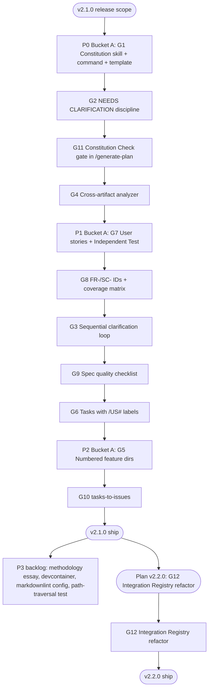

# Cross-Project Comparison: Nexus-Hub vs. GitHub Spec Kit

**Version**: v2.0.0
**Generated**: 2026-05-20T00:00:00Z
**Analyzer**: Claude Code -- compare-project command
**External Source**: https://github.com/github/spec-kit
**Source Type**: Repository

---

## 1. Executive Summary

Spec Kit is GitHub's open-source toolkit for **Spec-Driven Development (SDD)**: a methodology that treats specifications as executable artifacts that *generate* code, rather than scaffolding discarded after implementation begins. It ships a Python `specify` CLI plus a tight 9-command slash workflow (`constitution -> specify -> clarify -> plan -> tasks -> analyze -> implement -> taskstoissues -> checklist`) backed by templates, an integration registry covering 30+ AI agents, and an extensions/presets layering system.

Nexus-Hub and Spec Kit are **complementary, not competing**: Spec Kit is a *deep* vertical workflow (one methodology, many integrations), while Nexus-Hub is a *broad* horizontal harness (203 skills across 22 categories, 33 commands, internal MCPs, hooks, multi-platform templates). The comparison surfaces **12 high-signal adoption candidates** that Nexus-Hub can absorb without compromising its breadth. The most valuable gaps are not technologies but **conventions**: the Constitution-as-governance pattern, the `NEEDS CLARIFICATION` marker discipline, the sequential 5-question clarification loop, the cross-artifact `/analyze` consistency check, and rigorous user-story-organized task labels (`[P]`, `[US1]`). None of the candidates require new outbound calls, new credentials, or new third-party data processors. Every adoption candidate is classified `skill-native` or `re-full` under the MCP Registry Policy.

**Overall recommendation: selectively adopt**. Spec Kit's SDD methodology is rigorous and battle-tested at GitHub scale; Nexus-Hub already has an `spec-driven-development` skill and a `generate-plan` command but lacks the gating discipline, the constitution governance file, and the cross-artifact analyzer that make SDD enforceable rather than aspirational.

---

## 2. Project Profiles

| Attribute | Nexus-Hub | Spec Kit |
|---|---|---|
| **Purpose** | Production-grade skill harness for AI coding assistants; upstream catalog for Nexus (local-first desktop AI Studio) | Toolkit implementing Spec-Driven Development (SDD); bootstraps projects with specs/plans/tasks workflow |
| **Latest version (observed)** | v2.0.0 (rename release: DevAI-Hub -> Nexus-Hub) | Active development (no released tag detected on shallow clone) |
| **License** | (project root - not declared in CLAUDE.md sample; see LICENSE file) | MIT |
| **Primary distribution** | `scripts/installer.sh` / `scripts/installer.ps1` (template copy to `~/.nexus-hub/` + per-platform AI config dirs) | `specify-cli` Python tool installed via `uv tool install` or `pipx` |
| **Bootstrap entrypoint** | `make validate` after editing catalog; users run installer manually | `specify init <project> --integration <agent>` |
| **Catalog scale** | 203 skills, 33 commands, 14 hooks, 10 agents | 9 core slash commands (constitution/specify/clarify/plan/tasks/analyze/checklist/implement/taskstoissues), 30+ agent integrations |
| **Methodology** | Cross-cutting harness; users compose skills per task | Single opinionated methodology (SDD) end-to-end |
| **AI assistant coverage** | 5 platforms (Claude, Codex, Cursor, Gemini, OpenCode), per-file copy to Claude/Codex/Gemini, behavioral instructions only on Cursor/OpenCode/Copilot | 30+ agents via Python `IntegrationBase` subclasses (Markdown / TOML / YAML / Skills) |
| **Extensibility model** | Hub catalog edited directly; new skill = SKILL.md + 3 registry updates | Extensions add commands, Presets override templates, project-local overrides for one-offs - all layered at runtime |
| **Testing harness** | `make test` (pytest on hooks), `make validate`, `make lint` (ShellCheck) | `pytest` suite covering CLI, integrations, extensions, registrars, presets |
| **MCP / outbound posture** | Strict MCP Registry Policy with 5-bucket decision tree; 3 internal MCPs (skill-server, code-search, web-fetch); hard-no list (search/embeddings/scraping/generation-as-service) | Self-contained CLI + slash commands; no MCP layer; no third-party data processors in core workflow |

---

## 3. Technology Stack Comparison

| Layer | Nexus-Hub | Spec Kit | Notes |
|---|---|---|---|
| **Primary language** | Python (validators, hooks, MCP servers), Bash + PowerShell (installers, hooks), Markdown (skills) | Python 3.11+ (`specify-cli`), Bash + PowerShell (script helpers), Markdown (templates) | Both use Python + dual-shell scripts. Nearly identical posture. |
| **Build tool** | `Makefile` (`make validate`, `make lint`, `make test`, `make build-catalog`) | `pyproject.toml` (`uv` / `pipx` install) | Spec Kit is a packaged CLI; Nexus-Hub is a static catalog. |
| **Package manager** | None for the catalog itself (raw files); pip for MCP server deps | `uv` (recommended) or `pipx` | Spec Kit is `pip-installable`; Nexus-Hub is not. |
| **Test runner** | pytest (`catalog/hooks/tests/`) | pytest (`tests/`, ~20+ test modules) | Same framework. Spec Kit's coverage is broader. |
| **Lint / format** | ShellCheck (hooks), `make lint`, markdownlint (style guide), pre-commit hooks | `.markdownlint-cli2.jsonc`, ShellCheck (script helpers), pytest assertions | Comparable rigor. Spec Kit has a `.markdownlint-cli2.jsonc` config which Nexus-Hub does not ship. |
| **CI** | Pre-commit hooks; `make validate` + `make test` (per session notes, CI runs pytest) | GitHub Actions in `.github/workflows/` (not enumerated in shallow clone) | Both have CI; Spec Kit's is repo-public on GitHub. |
| **Documentation** | `docs/<version>/` versioned structure; `README.md`, `CHANGELOG.md`, `DEVLOG.md`, `RELEASE_NOTES.md` per version | `docs/` GitHub Pages site (docfx), `README.md`, `CHANGELOG.md`, `CONTRIBUTING.md`, `DEVELOPMENT.md`, `spec-driven.md` (methodology essay) | Spec Kit ships a methodology essay (`spec-driven.md`, 25KB); Nexus-Hub does not have an equivalent narrative. |
| **Devcontainer** | None observed | `.devcontainer/` with per-agent CLI install in `post-create.sh` | Gap: Nexus-Hub has no devcontainer; Spec Kit auto-installs supported agent CLIs. |

---

## 4. AI Assistant Configuration Comparison

This section is the highest-signal area. Both projects target the same problem (consistent AI agent setup) with very different shapes.

| Aspect | Nexus-Hub | Spec Kit |
|---|---|---|
| **Number of supported agents** | 5 with full per-file distribution (Claude, Codex, Gemini), behavioral-only on Cursor/OpenCode/Copilot | 30+ via Python `INTEGRATION_REGISTRY` (Claude, Copilot, Gemini, Codex, Cursor, Windsurf, Goose, Forge, Qwen, Tabnine, Kiro, Pi, opencode, Mistral Vibe, Qoder, etc.) |
| **Integration architecture** | Per-agent template files in `templates/ai-instructions/base-*.md`; installer hard-codes per-platform copy logic | Python class hierarchy: `IntegrationBase` -> `MarkdownIntegration` / `TomlIntegration` / `YamlIntegration` / `SkillsIntegration` -> per-agent subclass with `key`, `config`, `registrar_config`, `context_file` |
| **Adding a new agent** | Edit five `base-*.md` templates in lockstep; potentially edit installer if a new file class is needed | One Python subclass + one `_register()` line in `_register_builtins()`; auto-tested via `tests/integrations/test_integration_<key>.py` |
| **Format dispatch** | Implicit: each platform's template is hand-written | Explicit via base class: Markdown agents subclass `MarkdownIntegration`, TOML agents subclass `TomlIntegration`, etc. |
| **CLI-detection** | Manual: installer checks for `claude`, `gemini`, etc. | `shutil.which(key)` automatic for CLI-based integrations (`requires_cli: True`); key MUST match executable name |
| **Slash commands surface** | `catalog/commands/*.md` copied per-agent at install time | `templates/commands/*.md` processed by integration registrar, transformed per agent (TOML for Gemini, YAML for Goose, `$ARGUMENTS` vs `{{args}}` etc.) |
| **Skill / sub-agent surface** | `catalog/skills/<category>/<name>/SKILL.md` with three-tier loading + bundled `scripts/`, `references/`, `assets/` subdirs | `SkillsIntegration` base class supports `speckit-<name>/SKILL.md` layout (e.g. Copilot in skills mode, Codex by default) |
| **Argument placeholders** | Mostly `$ARGUMENTS` (Markdown convention) | `$ARGUMENTS` for Markdown, `{{args}}` for TOML/YAML, `{{parameters}}` for Forge - documented per-integration |
| **Hooks / lifecycle** | Claude-style hooks in `catalog/hooks/`, registered in `catalog/hooks/settings.json` (SessionStart, PreToolUse, PostToolUse, Stop) | `.specify/extensions.yml` lifecycle hooks: `before_specify` / `after_specify`, `before_plan` / `after_plan`, etc. - embedded directly in each slash command's Pre/Post-Execution Checks |
| **Memory / context** | `CLAUDE.md` (project) + user CLAUDE.md (global) + per-skill memory files under `memory/MEMORY.md` | `.specify/memory/constitution.md` (project governance file with versioning + Sync Impact Reports) |

**Headline takeaways**:

1. Spec Kit's **integration registry pattern** is more disciplined than Nexus-Hub's five-template-in-lockstep convention. Adding a new agent in Spec Kit is one Python subclass; in Nexus-Hub it can be a 10-file change.
2. Spec Kit's **lifecycle hook surface** (`before_*` / `after_*` per command) is finer-grained than Nexus-Hub's four Claude events (`SessionStart`, `PreToolUse`, `PostToolUse`, `Stop`).
3. Spec Kit ships a **project-governance file** (constitution) that Nexus-Hub has no equivalent of. CLAUDE.md is the closest analogue but is positioned as agent-instructions, not project-principles.

---

## 5. Skills and Capabilities Gap Analysis

### 5a. Present in Spec Kit, Missing in Nexus-Hub (adoption candidates)

| # | Spec Kit Capability | Source | Gap in Nexus-Hub |
|---|---|---|---|
| G1 | **Constitution as project-governance file** with versioned MUST/SHOULD principles, Sync Impact Reports on amendment, and gates in plan template | `templates/commands/constitution.md`, `templates/constitution-template.md` | No equivalent. CLAUDE.md is agent-facing, not project-principle. |
| G2 | **`NEEDS CLARIFICATION` marker discipline** with hard limit of 3 markers, prioritized by impact (scope > security/privacy > UX > technical), forced uncertainty surfacing | `templates/commands/specify.md`, `templates/spec-template.md` | `ambiguity-detector` skill detects ambiguities but does not standardize the marker convention or enforce a hard limit. |
| G3 | **Sequential 5-question clarification loop** with one question at a time, recommended option highlighted, table-formatted multiple-choice, accepted-answer integration back into spec sections | `templates/commands/clarify.md` | `idea-refine` skill exists but does not enforce the one-at-a-time sequential loop or the recommended-option pattern. |
| G4 | **Cross-artifact consistency analyzer** (`/speckit.analyze`) reading spec.md + plan.md + tasks.md, detecting duplication / ambiguity / underspecification / constitution-misalignment / coverage gaps, emitting a severity-tagged report with stable finding IDs | `templates/commands/analyze.md` | `ambiguity-detector` works on a single artifact; no cross-artifact runner exists. |
| G5 | **Feature directory convention** with sequential (`NNN-`) or timestamp (`YYYYMMDD-HHMMSS-`) prefix, persisted to `.specify/feature.json` so downstream commands locate the directory without git-branch coupling | `templates/commands/specify.md`, `scripts/bash/create-new-feature.sh` | Plans go to `docs/<version>/plans/<slug>.md` - no numbered prefix, no branch decoupling. |
| G6 | **Tasks organized by user story** with checklist format `- [ ] T### [P?] [US?] Description with file path`, parallel markers, story labels mapping to spec user stories, MVP-first phase ordering | `templates/commands/tasks.md`, `templates/tasks-template.md` | `generate-plan` produces phased plans but lacks the rigid `[P]/[US#]` labeling convention and per-story phase organization. |
| G7 | **User stories with explicit priorities (P1/P2/P3)** and `**Independent Test**:` criteria forcing each story to be independently developable / testable / deployable | `templates/spec-template.md` | `spec-driven-development` skill structures specs but does not enforce independent-test-criteria-per-story. |
| G8 | **Functional Requirements (FR-###) + Success Criteria (SC-###) ID scheme** with measurable, technology-agnostic, user-focused criteria; coverage matrix in `/analyze` cross-checks every FR/SC against tasks | `templates/spec-template.md`, `templates/commands/analyze.md` | No standardized requirement/criterion ID scheme. Coverage tracing relies on prose. |
| G9 | **Specification quality validation checklist** ("unit tests for English") auto-generated at `<feature>/checklists/requirements.md`, iterated up to 3 times until all pass | `templates/commands/specify.md` step 7, `templates/checklist-template.md` | Quality gates exist (`quality-gate-definitions` skill) but no auto-generated spec-validation checklist per feature. |
| G10 | **`/speckit.taskstoissues` GitHub Issues conversion** turning a generated tasks.md into linked GitHub issues for cross-team tracking | `templates/commands/taskstoissues.md` | No equivalent. Adoption gap especially relevant since user already has `gh` CLI available. |
| G11 | **Constitution Check gate in plan template** - plan MUST pass before Phase 0 research and re-check after Phase 1 design, with a Complexity Tracking table to justify any violations | `templates/plan-template.md` lines 39-45, 106-114 | Plans have phases but no constitution-gate or complexity-tracking justification table. |
| G12 | **Integration registry pattern** (Python class hierarchy with `MarkdownIntegration` / `TomlIntegration` / `YamlIntegration` / `SkillsIntegration` base classes + `INTEGRATION_REGISTRY` single source of truth) for adding new AI agents in a single subclass | `src/specify_cli/integrations/base.py`, `src/specify_cli/integrations/__init__.py` | Nexus-Hub edits five templates in lockstep. Adding Windsurf or Goose support is currently a ~10-file diff. |

### 5b. Present in Nexus-Hub, Missing in Spec Kit (strengths to preserve)

| # | Nexus-Hub Capability | Why It Should Be Preserved |
|---|---|---|
| S1 | **203-skill catalog across 22 categories** | Spec Kit covers SDD; Nexus-Hub covers SDD + code review + security audit + framework experts + language experts + observability + compliance + 200+ more. Catalog breadth is core identity. |
| S2 | **MCP Registry Policy + reverse-engineering matrix** with 5-bucket decision tree, hard-no list, and `vendor-intrinsic`-only-when-three-conditions-hold gate | Spec Kit has no MCP layer and no equivalent governance over third-party data flow. Nexus-Hub's policy is a structural advantage. |
| S3 | **3 internal MCP servers** (`nexus-skill-server`, `nexus-code-search`, `nexus-web-fetch`) for in-session skill discovery, code semantic search, and read-only web fetch | Spec Kit has none. |
| S4 | **Three-tier loading model** (Tier 1 always-loaded ~150-300 tokens, Tier 2 SKILL.md body on trigger, Tier 3 bundled `scripts/`/`references/`/`assets/` on demand) with explicit token-budget reasoning | Spec Kit's templates do not encode this tier-aware design. |
| S5 | **Per-skill bundled resources** (`scripts/`, `references/`, `assets/`) with orphan-bundle detection in `make validate` | Spec Kit's commands are flat Markdown files; no equivalent. |
| S6 | **Hooks: claude-style** (`SessionStart`, `PreToolUse`, `PostToolUse`, `Stop`) with format-bash/powershell-description.py and git-guardrails | Spec Kit's hooks are slash-command-internal (`before_specify` / `after_specify` etc.) - different surface, complementary, not competing. |
| S7 | **Cross-platform installer** (`installer.sh` + `installer.ps1`) with one-shot in-place migration (devai-hub -> nexus-hub) | Spec Kit's `specify-cli` is uv/pipx-based and does not orchestrate per-platform AI config dirs. |
| S8 | **Versioned `docs/<version>/` layout** with archive subtree, refactor-docs skill, plans, release notes, known-gaps tracker | Spec Kit's docs are GitHub-Pages-hosted via docfx. Different model. |
| S9 | **Style guides at `catalog/style-guides/`** (markdown.md, code-style guides) installed at `~/.nexus-hub/style-guides/` | Spec Kit has implicit style enforcement via templates; no separate style-guide catalog. |
| S10 | **VS Code extension** (`extensions/`) | Spec Kit has no IDE extension. |
| S11 | **Skill index + skills.json + marketplace.json** machine-readable registry | Spec Kit's metadata is encoded in Python `IntegrationBase` attributes. |
| S12 | **Multi-platform behavioral guardrails** for Cursor / OpenCode / Copilot via `AGENTS.md`, `.github/copilot-instructions.md`, `.cursor/rules/` even when per-file copy isn't supported | Spec Kit's slash commands target the supported integrations; behavioral fallback is less of a concern given uv/pipx CLI install. |

### 5c. Present in Both, Quality Comparison

| Capability | Nexus-Hub | Spec Kit | Better |
|---|---|---|---|
| Spec-first methodology | `spec-driven-development` skill: 4-phase gated workflow (Specify -> Plan -> Tasks -> Implement) with phase-by-phase review | `/speckit.specify` -> `/speckit.clarify` -> `/speckit.plan` -> `/speckit.tasks` -> `/speckit.analyze` -> `/speckit.implement`; constitution + clarify + analyze are gating checkpoints | **Spec Kit** - more rigorous gating (constitution check, cross-artifact analyze, sequential clarify) |
| Plan generation | `/generate-plan` command + `implementation-plan` skill - discovery interview, phased sub-tasks with executable prompts, plans go to `docs/<version>/plans/<slug>.md` | `/speckit.plan` reads spec.md, emits plan.md + data-model.md + contracts/ + research.md + quickstart.md inside `specs/<NNN>-<name>/`, with constitution-gate and complexity-tracking | **Tie** - Nexus-Hub's executable-prompt sub-tasks beat Spec Kit's flat task list; Spec Kit's multi-document plan output beats Nexus-Hub's single plan file. Best-of-both is achievable. |
| Task breakdown | `generate-plan` produces phased sub-tasks, each with an executable prompt | `/speckit.tasks` produces `tasks.md` with strict checklist format `- [ ] T### [P?] [US?] file_path`, organized by user story | **Spec Kit** for label discipline; **Nexus-Hub** for executable-prompt-per-task. |
| Implementation runner | `/implement-phase` command runs one phase end-to-end (review -> code -> lint -> test -> docs -> commit) | `/speckit.implement` reads tasks.md and runs through phases; checks checklists first | **Tie** - different opinionated approaches; both work. |
| Quality gates | `quality-gate-definitions` skill (reusable GO/NO-GO gates) + `incremental-implementation` + `tdd` | Constitution + checklist-as-test + analyze + checklist-block-on-implement | **Spec Kit** - gates are wired into the workflow by default, not opt-in skills. |
| Ambiguity detection | `ambiguity-detector` skill (detect ambiguous, incomplete, contradictory requirements) | `[NEEDS CLARIFICATION]` markers + `/speckit.clarify` sequential 5-question loop | **Spec Kit** - opinionated marker convention with hard 3-marker limit forces prioritization. |
| ADR / decision capture | `architecture-decision-record` skill | Constitution Sync Impact Report on each amendment + complexity-tracking table | **Tie** - different scopes (Nexus-Hub: per-decision ADR; Spec Kit: project-level constitution amendments). |
| Comparison tooling | `/compare-project` command (this file) + `cross-project-comparison` skill | None observed | **Nexus-Hub** |
| Test generation | `/generate-tests`, `/generate-unit-tests`, `bdd-acceptance-tests`, `directed-test-input-generator`, etc. | Tests are part of `/speckit.tasks` output (TDD-style if requested) and `/speckit.implement` runs them | **Nexus-Hub** - much broader test-generation surface. |
| Docs sync | `update-documentation`, `documentation-consistency`, `refactor-docs`, `update-devlog` skills | Constitution propagation checklist updates templates after constitution amendments | **Nexus-Hub** - broader docs tooling. |

---

## 6. Commands and Automation Comparison

### 6a. Commands Gap

| Spec Kit Command | Nearest Nexus-Hub Equivalent | Status |
|---|---|---|
| `/speckit.constitution` | (none) | **Missing** - adoption candidate G1 |
| `/speckit.specify` | `spec-driven-development` skill (no slash command) | Partial - skill exists, no `/specify` command |
| `/speckit.clarify` | `idea-refine`, `ambiguity-detector` skills | Partial - skills exist, no sequential 5-question loop |
| `/speckit.plan` | `/generate-plan` command | Equivalent (Nexus-Hub's is broader / interview-driven) |
| `/speckit.tasks` | `/generate-plan` (combines plan+tasks) | Partial - no separate tasks command with `[P]/[US#]` discipline |
| `/speckit.analyze` | `ambiguity-detector`, `review-codebase` | **Missing** cross-artifact analyzer - adoption candidate G4 |
| `/speckit.checklist` | `quality-gate-definitions` skill | Partial - no auto-generated per-feature spec-validation checklist |
| `/speckit.implement` | `/implement-phase` command | Equivalent |
| `/speckit.taskstoissues` | (none) | **Missing** - adoption candidate G10 |

**Slash-command surface comparison**:

Nexus-Hub: 33 commands spanning a broad range (analyze-codebase, compile-deep-research, generate-changelog, generate-report, install-pre-commit-review-hook, etc.).
Spec Kit: 9 highly opinionated commands forming one workflow.

These are **complementary catalogs**, not competing. Adopting Spec Kit's 4 missing commands grows Nexus-Hub from 33 to 37 without disrupting existing tooling.

### 6b. CI/CD and Hooks Gap

| Aspect | Nexus-Hub | Spec Kit | Gap |
|---|---|---|---|
| Pre-commit | `install-pre-commit-review-hook` skill | Implicit in CI / `.markdownlint-cli2.jsonc` | Tie |
| Lifecycle hooks | 4 Claude events (SessionStart, Pre/PostToolUse, Stop) | Per-command `before_*` / `after_*` (specify/clarify/plan/tasks/analyze/implement/constitution) | Spec Kit's finer-grained per-command hooks let extensions inject behavior at known workflow checkpoints - a legitimate adoption candidate but lower priority than G1-G10. |
| CI integration | GitHub Actions presumably (per CLAUDE.md mention) | GitHub Actions in `.github/workflows/` | Tie |
| Validator | `make validate` runs JSON-integrity + orphan-bundle audit | `pytest` covers integrations, presets, extensions, registrars, branch numbering | Tie |
| Markdown lint | Style guide at `catalog/style-guides/markdown.md`, applied by skills | `.markdownlint-cli2.jsonc` checked in repo root | **Minor gap** - Nexus-Hub could ship a `.markdownlint-cli2.jsonc` for projects bootstrapping from its scaffolding. |

---

## 7. Documentation and Developer Experience Comparison

| Aspect | Nexus-Hub | Spec Kit |
|---|---|---|
| **README** | Comprehensive; rebranded in v2.0.0 with explicit Nexus linkage | Comprehensive; includes 7-step quickstart, video overview, community extensions/presets/walkthroughs sections |
| **Onboarding flow** | `setup-project` skill bootstraps CLAUDE.md, scaffolding, gitignore, README, DEVLOG, CHANGELOG | `specify init` bootstraps `.specify/` with templates + scripts + integration-specific agent config |
| **Methodology essay** | None (CLAUDE.md is operational, not philosophical) | `spec-driven.md` (25KB philosophical essay on power-inversion, lingua franca, executable specs, branching for exploration) |
| **Devcontainer** | None | `.devcontainer/` with `post-create.sh` auto-installing supported agent CLIs |
| **Versioned docs** | `docs/<version>/` (v0.8.1 through v2.0.0); per-version known-gaps, plans, release notes | `docs/` GitHub Pages site via docfx; no per-version subtree |
| **CONTRIBUTING / SECURITY / SUPPORT** | (TODO - LICENSE-ASSETS.md mentioned in git status; presence of CONTRIBUTING/SECURITY/SUPPORT not confirmed in inventory) | All four files present at repo root (`CONTRIBUTING.md`, `SECURITY.md`, `SUPPORT.md`, `CODE_OF_CONDUCT.md`) |
| **Citation** | None observed | `CITATION.cff` + `.zenodo.json` for academic citation |

**Headline gaps**:

- Nexus-Hub lacks an `spec-driven.md`-style **methodology narrative**. CLAUDE.md and the skill catalog teach *what* to do, not *why* spec-first matters philosophically. (Adoption candidate, P3.)
- Nexus-Hub lacks a **devcontainer**. Lower priority but improves first-touch developer experience. (P3.)
- Nexus-Hub does not ship **CITATION.cff / .zenodo.json**. Negligible value unless academic citation is a goal.

---

## 8. Testing and Security Posture Comparison

| Aspect | Nexus-Hub | Spec Kit |
|---|---|---|
| **Test framework** | pytest (hooks tests in `catalog/hooks/tests/`) | pytest (~20+ modules under `tests/`) |
| **Coverage scope** | Hooks, JSON catalog integrity (`make validate`), shellcheck (`make lint`) | CLI, integrations (one test per agent), extensions, registrars, presets, branch numbering, authentication, timestamp branches, upgrade |
| **CI gate** | `make validate` + `make test` (per session notes) | GitHub Actions running pytest |
| **Static analysis** | ShellCheck for hooks; no Python-side mypy/ruff noted in catalog | Likely pytest + lint (not explicitly verified in shallow clone) |
| **Secret scanning** | `secret-scan.sh` hook (PreToolUse) | Not observed in shallow clone (likely standard GitHub secret scanning at the org level) |
| **Git guardrails** | `git-guardrails.sh` hook blocks destructive commands | None observed in core; relies on user discipline |
| **Path traversal hardening** | Pre-commit + validators in `make validate` | Explicit `tests/test_registrar_path_traversal.py` test |
| **License compliance** | `licensing-compliance` skill | MIT license; no dedicated tooling needed for an MIT project |
| **Supply chain** | MCP Registry Policy gates new outbound calls | uv / pipx install; pyproject.toml deps |
| **Dependency audit** | `dependency-security-audit` skill | Standard pip / uv handling |

**Headline takeaways**:

- Nexus-Hub's hook-level **secret scanning + git guardrails** are stronger than Spec Kit's posture. Preserve as strengths.
- Spec Kit's **path-traversal test for registrars** is a good defensive practice Nexus-Hub could mirror for its installer (P3).
- Spec Kit's **broader pytest matrix** could inform Nexus-Hub's harness expansion, but the catalog scopes differ (Nexus-Hub is mostly Markdown + shell; Spec Kit is mostly Python).

---

## 9. Security and Risk Assessment

This section is **mandatory** under the Nexus-Hub adoption discipline. Spec Kit is fully open-source (MIT, GitHub-hosted, no commercial dependencies, no third-party API keys, no outbound calls in core workflow). The risk surface is **structurally low** - but the discipline must still be exercised per the MCP Registry Policy in [AGENTS.md](../../AGENTS.md).

### 9.1 Threat Model Comparison

| Dimension | Nexus-Hub (current) | Spec Kit (external) | Adoption Delta |
|---|---|---|---|
| New runtime dependencies | Python (existing), Bash, PowerShell, pytest, pip MCP deps | Python 3.11+, uv (or pipx), jinja2-style templating in specify-cli, pytest | **No new deps** if we adopt conventions (templates, marker discipline) as skills/commands. If we adopt the Python `specify-cli` wholesale, we add `uv`/`pipx` and the Python CLI surface - but the recommendation in Section 9.4 is to NOT adopt the CLI wholesale. |
| Outbound calls at runtime | 3 internal MCPs (skill-server local, code-search local, web-fetch user-initiated only); installer GitHub API for plugin install | None in core workflow (specify CLI is local-only); `taskstoissues` calls GitHub via `gh` CLI (user's own credentials) | **No new outbound calls** for G1-G9 / G11 / G12. G10 (`taskstoissues`) reuses the user's existing `gh` CLI - same posture as Nexus-Hub's existing GitHub-touch points. |
| Credentials / API keys | None for the catalog itself; user-side API keys for the AI assistants are out of scope | None for core; `taskstoissues` uses local `gh auth` session | **No new credentials** introduced by any adoption candidate. |
| Source code / prompts / query text leaving machine | None except per-user AI assistant traffic (handled by the user's chosen agent, not Nexus-Hub) | None except `taskstoissues` posting tasks to the user's own GitHub repo | Symmetric. |
| New commercial relationship | None | None | None - GitHub is already an existing relationship for both projects. |

**Section 9.1 conclusion**: Adopting any subset of G1-G12 does not require a new vendor, new credential, or new outbound call destination beyond Nexus-Hub's existing posture.

### 9.2 Per-Item Risk Scorecard

| Item | Risk Tier | Justification |
|---|---|---|
| G1 Constitution skill | None | Local Markdown file; no I/O. |
| G2 NEEDS CLARIFICATION marker | None | Prose convention; no I/O. |
| G3 Sequential clarification loop | None | Interactive skill; no I/O. |
| G4 Cross-artifact analyzer | None | Read-only skill; no I/O. |
| G5 Numbered feature directories | None | Local filesystem only; no I/O. |
| G6 Tasks with `[P]/[US#]` labels | None | Prose convention; no I/O. |
| G7 User stories with priorities + Independent Test | None | Prose convention; no I/O. |
| G8 FR-###/SC-### ID scheme + coverage matrix | None | Prose convention; no I/O. |
| G9 Spec-validation checklist | None | Local Markdown checklist; no I/O. |
| G10 taskstoissues | Low | Calls user's local `gh` CLI; same posture as existing Nexus-Hub GitHub touch points (no new credential, no new outbound endpoint - just `api.github.com` via `gh` auth which user already controls). |
| G11 Constitution Check gate in plan | None | Prose convention applied to plan template; no I/O. |
| G12 Integration Registry pattern | None | Refactor of Nexus-Hub's own installer templates into a class hierarchy. No external dep needed; internal Python only. |

**No item is rated Medium or High**. All items can flow into Section 11 without gating.

### 9.3 Reverse-Engineering Viability Analysis

Per the MCP Registry Policy decision tree in [AGENTS.md](../../AGENTS.md):

| Item | Classification | Internal Deliverable | Effort Estimate | Rationale |
|---|---|---|---|---|
| G1 Constitution | `skill-native` | New skill `catalog/skills/workflow/project-constitution/` + template at `catalog/templates/constitution-template.md` + new command `catalog/commands/constitution.md` | Low | Pure LLM instruction + template. Zero code, zero external integration. |
| G2 NEEDS CLARIFICATION marker | `skill-native` | Update existing `spec-driven-development`, `ambiguity-detector`, `idea-refine` skills to standardize on the marker + 3-marker hard limit | Low | Prose convention update across 3 existing skills. |
| G3 Sequential clarification loop | `skill-native` | New command `catalog/commands/clarify.md` + update `idea-refine` skill | Low | Pure LLM behavior; no code. |
| G4 Cross-artifact analyzer | `skill-native` | New command `catalog/commands/analyze-spec.md` + new skill (or extend `ambiguity-detector`) | Low-Medium | LLM-driven analysis of 3 Markdown files; severity assignment + finding table. |
| G5 Numbered feature directories | `skill-native` (re-full for the helper scripts) | Update `generate-plan` skill to support `specs/NNN-<slug>/` layout when triggered; ship optional helper script `scripts/new-feature.sh` + `.ps1` for the numbering helper | Low-Medium | Numbering logic is 30 lines of shell; mostly LLM-driven. Reverse-engineered from `scripts/bash/create-new-feature.sh`. |
| G6 Tasks with `[P]/[US#]` labels | `skill-native` | Update `generate-plan` command to emit task checklist with `[P]/[US#]` labels per the format rule | Low | Prose / template update. |
| G7 User stories with priorities + Independent Test | `skill-native` | Update `spec-driven-development` skill body + ship `catalog/templates/spec-template.md` derived from Spec Kit's template | Low | Template + skill body update. |
| G8 FR-###/SC-### ID scheme + coverage matrix | `skill-native` | Update spec template + analyze command to enforce IDs and emit coverage matrix | Low-Medium | Prose + template convention; the matrix table is LLM-generated from the artifacts. |
| G9 Spec-validation checklist | `skill-native` | New `catalog/templates/spec-quality-checklist.md` + invocation step inside the new `specify` command (or `spec-driven-development` skill) | Low | Static checklist + iteration loop. |
| G10 taskstoissues | `skill-native` (re-full for the gh invocation logic) | New command `catalog/commands/tasks-to-issues.md` that drives `gh issue create` per parsed task; optional helper script under per-skill `scripts/` | Medium | Parsing tasks.md + parallel `gh` invocations; ~50-100 lines of shell/Python. The user's own GH credentials, no new vendor. |
| G11 Constitution Check gate | `skill-native` | Update `generate-plan` command to add Constitution Check + Complexity Tracking sections to plan output | Low | Prose / template update. |
| G12 Integration Registry pattern | `re-full` | Refactor Nexus-Hub's installer logic into a Python class hierarchy mirroring Spec Kit's `IntegrationBase` shape - one subclass per supported agent, registered in a single `_register_builtins()` | High | Substantial installer refactor. Worth it for Nexus-Hub's long-term agent-coverage expansion, but does not need to land in v2.1. Defer to a dedicated v2.x release. |

**MCP Registry Policy applied**: No item triggers `vendor-intrinsic` or `drop-outright`. No item requires a new commercial relationship, new outbound API, or new credential beyond existing Nexus-Hub posture. The policy gate is satisfied for all 12 candidates.

### 9.4 Recommendation Ordering

Per Section 9.3, the adoption sequence is:

1. **`skill-native` items first** (G1, G2, G3, G4, G5, G6, G7, G8, G9, G10, G11) - these are pure prose / template / convention updates and one new tasks-to-issues command. Ship as a coherent "Spec Kit Adoption" minor release (v2.1.0).
2. **`re-full` item next** (G12 Integration Registry pattern) - substantial refactor; defer to v2.2.0 or later, scoped as a standalone effort with its own plan.
3. **No `vendor-intrinsic` items**.
4. **No `drop-outright` items**.

This ordering supersedes raw P0/P1/P2/P3 within Section 11.

---

## 10. Structural and Architectural Differences

These are notable differences worth considering even where they don't map to a single adoption item.

| Difference | Nexus-Hub | Spec Kit | Implication |
|---|---|---|---|
| **Distribution model** | Static template catalog copied via installer scripts | uv / pipx-installed Python CLI | Spec Kit's CLI surface lets it upgrade in place; Nexus-Hub requires a fresh installer run. Not a gap - it's a deliberate architecture choice (template harness vs. tool). |
| **Per-agent file shape** | Five lock-step `base-*.md` templates | Single Python `IntegrationBase` class hierarchy | Architectural gap. See G12. |
| **Lifecycle hook surface** | 4 Claude-style events | Per-command `before_*` / `after_*` pairs (~16 hook points across the 9 commands) | Spec Kit's surface is finer-grained but tied to its specific workflow. Nexus-Hub's surface is broader (any agent activity) but coarser. Different optimization targets; not a clear "better". |
| **Project-governance file** | CLAUDE.md (agent-facing, prescriptive) | constitution.md (project-principle, MUST/SHOULD, versioned, with Sync Impact Report on amendments) | Real gap. See G1. |
| **Slash-command-to-skill ratio** | 33 commands : 203 skills (1 : 6) | 9 commands : 9 named skills (1 : 1) | Different philosophy. Nexus-Hub's skills are activated by context cues; Spec Kit's are surfaced explicitly via slash commands. Both work; Nexus-Hub's model is more compositional, Spec Kit's is more predictable. |
| **Feature directory naming** | `docs/<version>/plans/<slug>.md` | `specs/<NNN>-<slug>/spec.md, plan.md, tasks.md, ...` | Spec Kit's numbered convention is sturdier for multi-feature parallelism. See G5. |
| **User stories** | Optional convention in `spec-driven-development` | Mandatory with explicit P1/P2/P3 priorities + Independent Test criteria | Spec Kit's discipline forces MVP-thinking. See G7. |

---

## 11. Adoption Plan

Plan items are grouped per Section 9.4: `skill-native` first (G1-G11), then `re-full` (G12). Within each bucket, items are ordered by priority tier. All counts here flow into the Section 8 handoff prompt.

### Bucket A: `skill-native` adoptions (target release: v2.1.0)

#### P0 (Immediate)

| What | Source | Target | Effort | Dependencies | Risk |
|---|---|---|---|---|---|
| G1: Constitution skill + command + template | `templates/commands/constitution.md`, `templates/constitution-template.md` | New `catalog/skills/workflow/project-constitution/SKILL.md`; new `catalog/commands/constitution.md`; new `catalog/templates/constitution-template.md`; index updates in `data/SKILL_INDEX.md`, `data/skills.json`, `data/marketplace.json` | Low | None | Low - new artifact, no conflicts |
| G2: `NEEDS CLARIFICATION` marker discipline (max-3 hard limit) | `templates/commands/specify.md` lines 117-131, 188-227 | Update bodies of `spec-driven-development`, `ambiguity-detector`, `idea-refine` skills | Low | None | None - convention only |
| G4: Cross-artifact consistency analyzer | `templates/commands/analyze.md` | New `catalog/commands/analyze-spec.md` (or `/speckit-analyze`) reading spec/plan/tasks and emitting severity-tagged findings table | Low-Medium | G7 + G8 are useful (FR/SC ID scheme makes coverage matrix richer) but not blocking | Low - read-only analyzer |
| G11: Constitution Check gate + Complexity Tracking in `/generate-plan` output | `templates/plan-template.md` lines 39-45, 106-114 | Update `catalog/commands/generate-plan.md` to add Constitution Check (pass before Phase 0 research, re-check after Phase 1 design) + Complexity Tracking table | Low | G1 | None - prose update |

#### P1 (Short-term)

| What | Source | Target | Effort | Dependencies | Risk |
|---|---|---|---|---|---|
| G3: Sequential 5-question clarification loop with recommended-option table | `templates/commands/clarify.md` | New `catalog/commands/clarify-spec.md` (or `/clarify`); update `idea-refine` skill body to cross-reference | Low | None | None |
| G7: User stories with explicit P1/P2/P3 priorities + Independent Test criteria | `templates/spec-template.md` lines 26-69 | Update `spec-driven-development` skill body; ship `catalog/templates/spec-template.md` | Low | None | None |
| G8: FR-###/SC-### ID scheme + coverage matrix | `templates/spec-template.md` lines 88-118 | Update `spec-driven-development` skill body + `catalog/templates/spec-template.md`; update G4 analyzer to enforce IDs and emit coverage matrix | Low-Medium | G4 | None |
| G9: Auto-generated spec quality checklist ("unit tests for English") | `templates/commands/specify.md` step 7 (lines 139-229), `templates/checklist-template.md` | Ship `catalog/templates/spec-quality-checklist.md` + invocation step inside the new specify command or skill | Low | G7, G8 | None |
| G6: Tasks with strict `- [ ] T### [P?] [US?] file_path` format, organized by user story | `templates/commands/tasks.md` lines 133-204 | Update `catalog/commands/generate-plan.md` to emit this format when generating phased sub-tasks | Low | G7 | None |

#### P2 (Medium-term)

| What | Source | Target | Effort | Dependencies | Risk |
|---|---|---|---|---|---|
| G5: Numbered feature directories (`specs/NNN-<slug>/`) with `.specify/feature.json` persistence | `templates/commands/specify.md` step 3, `scripts/bash/create-new-feature.sh` | New optional skill mode in `generate-plan` enabling `specs/<NNN>-<slug>/` layout; ship `scripts/new-feature.sh` + `.ps1` helpers | Low-Medium | None (independent) | Low - alternate layout, opt-in |
| G10: `/tasks-to-issues` GitHub Issues conversion | `templates/commands/taskstoissues.md` | New `catalog/commands/tasks-to-issues.md` + per-skill `scripts/tasks-to-issues.sh` + `.ps1` driving `gh issue create` | Medium | G6 (task format must be parseable) | Low - uses user's `gh auth`, no new credential |

#### P3 (Backlog)

| What | Source | Target | Effort | Dependencies | Risk |
|---|---|---|---|---|---|
| Methodology essay (`spec-driven.md`-style narrative) | `spec-driven.md` (Spec Kit) | New `docs/v2.x.x/spec-driven-methodology.md` adapted to Nexus-Hub's broader catalog framing | Medium | None | None |
| `.devcontainer/` with per-agent CLI install in `post-create.sh` | Spec Kit's `.devcontainer/` | New `.devcontainer/` at Nexus-Hub repo root | Medium | None | None |
| `.markdownlint-cli2.jsonc` config | Spec Kit's repo root | Add `catalog/style-guides/markdownlint-cli2.jsonc` + installer copy | Low | None | None |
| Path-traversal test for installer registrar logic | `tests/test_registrar_path_traversal.py` | New test under `tests/installer/` (does not exist yet) | Medium | None - new test category | None |
| `CITATION.cff` / `.zenodo.json` | Spec Kit's repo root | Skip unless academic citation becomes a goal | - | - | - |

### Bucket B: `re-full` adoptions (target release: v2.2.0+)

#### P1 (Plan it - high effort)

| What | Source | Target | Effort | Dependencies | Risk |
|---|---|---|---|---|---|
| G12: Integration Registry pattern (Python class hierarchy `IntegrationBase` -> `MarkdownIntegration` / `TomlIntegration` / `YamlIntegration` / `SkillsIntegration`) | `src/specify_cli/integrations/base.py`, `src/specify_cli/integrations/__init__.py`, `AGENTS.md` (Spec Kit) | Refactor `scripts/installer.sh` + `scripts/installer.ps1` per-platform-template logic into a Python helper invoked by both installers; one subclass per supported agent in `scripts/lib/integrations/`; replace lock-step 5-template edits with a single subclass + auto-detected registrar config | High | None | Medium - significant installer refactor; behavior must remain identical for existing platforms before adding new agents |

### Bucket C: Items NOT recommended for adoption

None - all 12 candidates are clear adoptions per Section 9.

---

## 12. Implementation Sequence

The sequence below respects the Section 9.4 ordering (skill-native first, then re-full) and intra-bucket P-tier ordering. Items in the same row can run in parallel.

**Phasing rationale**:

- **G1, G2, G11** land first because they establish project-governance vocabulary that downstream items reference.
- **G4** lands next because it gates `/implement` discipline; even without G7/G8 yet, it can flag generic ambiguity and coverage gaps.
- **G7 + G8** unlock G4's coverage matrix richness and G9's checklist.
- **G3 + G9** are independent skill-native additions; ship anytime after G2.
- **G6** depends on G7 to define the `[US#]` label semantics.
- **G5** is independent but lower-value than the gating items; ship in P2.
- **G10** depends on G6 for parseable task format.
- **G12** is a standalone v2.2.0+ effort.

**Estimated calendar**: v2.1.0 ships ~10 P0/P1/P2 items, all skill-native; achievable in a single coherent minor release. v2.2.0 (G12) is a separate planning effort.

---

## 13. Risks and Considerations

### Conflicts with existing Nexus-Hub patterns

- **Feature directory location (G5)**: Spec Kit uses `specs/<NNN>-<slug>/`; Nexus-Hub currently uses `docs/<version>/plans/<slug>.md`. Two paths are defensible:
  - *Option A*: Make `specs/` an opt-in alternate layout via a `--specs-layout` flag on `/generate-plan`. Preserves Nexus-Hub's versioned-docs convention.
  - *Option B*: Migrate fully to `specs/<NNN>-<slug>/`. Breaks the versioned-docs convention but aligns with Spec Kit.
  - **Recommendation**: Option A. The versioned-docs convention is a Nexus-Hub strength (S8) that should not be dismantled.
- **Constitution vs CLAUDE.md (G1)**: Both files can coexist - CLAUDE.md remains agent-instructions; the new `.constitution.md` (or `docs/<version>/constitution.md`) is project-principle. State this explicitly in the constitution skill body to prevent confusion.
- **Slash command naming collision**: Spec Kit uses `/speckit.*` prefixes. Nexus-Hub commands are unprefixed (`/generate-plan`, etc.). Use unprefixed equivalents (`/constitution`, `/clarify`, `/analyze-spec`, `/tasks-to-issues`) to maintain Nexus-Hub's convention. Document in the skills' bodies that the source pattern is `/speckit.*`.

### Maintenance burden

- Adopting G1-G11 adds ~4 new commands (constitution, clarify, analyze-spec, tasks-to-issues), ~5 updated skills, and 2-3 new templates. Per `/setup-project` and `setup-project` skill expectations, this is a small marginal load.
- G12 is the only item with non-trivial ongoing maintenance (the Python integration registry must stay in sync with new agent additions). Defer until ROI is clear.

### Breaking changes

- None. All adoptions are additive. Existing skills (`generate-plan`, `spec-driven-development`, `ambiguity-detector`, `idea-refine`) receive prose-only updates; existing commands keep their names.
- v2.1.0 should be a **MINOR** bump per Nexus-Hub's SemVer policy (new functionality, backward-compatible).

### Items explicitly NOT recommended for adoption

No items were classified `drop-outright` under Section 9.3. The full MCP Registry Policy review passed for all 12 candidates. The Section 13 N-item block is empty by design - this is a comparison with a peer open-source project that ships under the same operating philosophy (local-first, MIT-licensed, no third-party data processors). The next time a comparison surfaces a SaaS-style integration or a hosted-service dependency, this block will be populated.

---

## Appendix A: Source Citations

All Spec Kit references in this report point to files in the shallow clone at `compare-spec-kit/` (cleaned up after report generation). The corresponding upstream URLs:

- `templates/commands/constitution.md` -> `github.com/github/spec-kit/blob/main/templates/commands/constitution.md`
- `templates/commands/specify.md` -> `github.com/github/spec-kit/blob/main/templates/commands/specify.md`
- `templates/commands/clarify.md` -> `github.com/github/spec-kit/blob/main/templates/commands/clarify.md`
- `templates/commands/plan.md` -> `github.com/github/spec-kit/blob/main/templates/commands/plan.md`
- `templates/commands/tasks.md` -> `github.com/github/spec-kit/blob/main/templates/commands/tasks.md`
- `templates/commands/analyze.md` -> `github.com/github/spec-kit/blob/main/templates/commands/analyze.md`
- `templates/commands/checklist.md` -> `github.com/github/spec-kit/blob/main/templates/commands/checklist.md`
- `templates/commands/implement.md` -> `github.com/github/spec-kit/blob/main/templates/commands/implement.md`
- `templates/commands/taskstoissues.md` -> `github.com/github/spec-kit/blob/main/templates/commands/taskstoissues.md`
- `templates/constitution-template.md` -> `github.com/github/spec-kit/blob/main/templates/constitution-template.md`
- `templates/spec-template.md` -> `github.com/github/spec-kit/blob/main/templates/spec-template.md`
- `templates/plan-template.md` -> `github.com/github/spec-kit/blob/main/templates/plan-template.md`
- `templates/tasks-template.md` -> `github.com/github/spec-kit/blob/main/templates/tasks-template.md`
- `templates/checklist-template.md` -> `github.com/github/spec-kit/blob/main/templates/checklist-template.md`
- `src/specify_cli/integrations/base.py` -> `github.com/github/spec-kit/blob/main/src/specify_cli/integrations/base.py`
- `AGENTS.md` -> `github.com/github/spec-kit/blob/main/AGENTS.md`
- `spec-driven.md` -> `github.com/github/spec-kit/blob/main/spec-driven.md`
