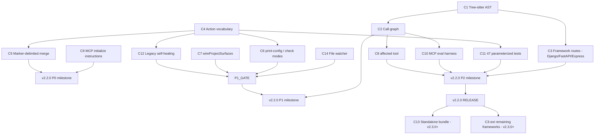

# Cross-Project Comparison: Nexus-Hub vs. CodeGraph

**Version**: v2.1.0
**Generated**: 2026-05-21T00:00:00Z
**Analyzer**: Claude Code - compare-project command
**External Source**: https://github.com/colbymchenry/codegraph
**Source Type**: Repository

---

## Section 1: Executive Summary

CodeGraph is a focused, single-purpose tool (tree-sitter knowledge graph + multi-agent MCP installer) and Nexus-Hub is a broad skill harness (206 skills across 22 categories + 9-platform installer + reverse-engineering policy). They do not compete on scope, but CodeGraph's narrow surface is implemented to a noticeably higher standard than the corresponding slice of Nexus-Hub on three concrete axes: **per-target installer architecture**, **idempotent file-write semantics**, and **AST-aware code intelligence**. The comparison surfaces **14 adoption candidates** (8 P0/P1, 4 P2, 2 P3). The headline P0 items are: tighten the `IntegrationBase` action vocabulary to match CodeGraph's `created/updated/unchanged/removed/not-found/kept` set, add marker-delimited section replacement to instruction-file writing, and upgrade `nexus-code-search` from keyword-only to tree-sitter AST + call-graph extraction (the existing v1.1.0 plan already gestures at this; CodeGraph proves the architecture).

Every adoption candidate is **`re-full`, `re-partial`, or `skill-native`** under the MCP Registry Policy - no `vendor-intrinsic` adoptions, no `drop-outright` adoptions, because CodeGraph is itself a 100%-local tool that Nexus-Hub already reverse-engineered (as `nexus-code-search`). The gap is in implementation depth, not in trust posture.

Overall recommendation: **selectively adopt** - port the installer-architecture patterns wholesale (P0/P1) and use CodeGraph's AST + call-graph + framework-route extraction as the architectural blueprint for `nexus-code-search` v1.1.0+ (P0/P1). Skip CodeGraph's standalone-runtime bundling for now (P3 - high effort, marginal benefit given Python is already a stated dependency of Nexus-Hub).

---

## Section 2: Project Profiles

| | Nexus-Hub v2.1.0 | CodeGraph @ HEAD (Unreleased, 0.8.0 latest tag) |
|---|---|---|
| **Purpose** | Production-grade skill harness; upstream catalog for Nexus (desktop AI Studio) and 9 other agent platforms | Local-first code intelligence library + CLI + MCP server with semantic knowledge graph |
| **Distribution** | `scripts/installer.sh` / `installer.ps1` copies catalog (skills, commands, hooks, agents, rules, MCP configs) into `~/.nexus-hub/` and per-platform config locations | npm (`@colbymchenry/codegraph`), one-line curl/PowerShell installer with bundled Node runtime, OR `npx @colbymchenry/codegraph` |
| **Scope** | 206 skills, 33 commands, 14 hooks, 10 agents, 4 MCP extensions, 9 platform integrations | 1 tool (codegraph), 1 MCP server (9 tools), 4 platform integrations |
| **Languages indexed** | nexus-code-search: any text file; keyword only | tree-sitter AST for 21 languages, plus framework-route extraction for 13 web frameworks |
| **License** | (See LICENSE) | MIT |
| **Test count** | pytest suite for hooks; integration tests for skills | ~47 parameterized installer-target tests + extraction / resolution / mcp / sync / watcher / sqlite-backend suites + a synthetic-codebase evaluation harness |
| **Maturity** | v2.1.0 (May 2026); 7 prior minor/major releases; SDD-driven | Pre-1.0 (0.8.0); active multi-agent rollout in the 0.7.x line; on its 8th unreleased breakthrough (self-contained runtime) |

---

## Section 3: Technology Stack Comparison

| Layer | Nexus-Hub | CodeGraph | Notes |
|---|---|---|---|
| Primary language | Python 3.10+ (extensions), Bash + PowerShell (installer) | TypeScript (target ES, CommonJS dist), Node ≥18 <25 (now bundled) | CodeGraph is single-language. Nexus-Hub is multi-language. |
| Package mgmt | pip / pyproject.toml per extension; no central manifest | npm; single `package.json` | |
| Test runner | pytest (hook + extension tests) | vitest (`npm test`, plus `npm run eval` synthetic-codebase scorer) | CodeGraph's eval harness is unique - see 9.3 below |
| Lint / format | ShellCheck on hook scripts; no project-wide formatter | tsc strict mode; no separate lint configured | |
| Build | None (catalog is source-of-truth, installer copies) | `tsc + copy-assets` (schema.sql + *.wasm) | |
| Storage | Plain Markdown + JSON catalog files | SQLite (FTS5) at `.codegraph/codegraph.db`; native `better-sqlite3` -> `node:sqlite` (Node 22.5+) -> WASM fallback | |
| Watch / sync | None | Native OS events (FSEvents / inotify / RDCW) with 500ms-2s debounce | |
| AST | None | tree-sitter (21 languages); per-language extractors plus standalone non-tree-sitter for Svelte / Vue / Liquid / DFM | |

---

## Section 4: AI Assistant Configuration Comparison

The most consequential section. Both projects ship an installer that writes per-agent config to disk; the architecture diverges sharply.

### 4.1 Platform coverage

| Platform | Nexus-Hub v2.1.0 | CodeGraph @ HEAD |
|---|---|---|
| Claude Code | Yes (legacy installer copy block + IntegrationBase subclass) | Yes (`targets/claude.ts`) |
| Cursor | Yes (`.cursor/rules/*.mdc` + repo-root `AGENTS.md`) | Yes (`targets/cursor.ts`) - with the cwd quirk patched via `--path ${workspaceFolder}` |
| Codex CLI | Yes (`~/.codex/AGENTS.md`) | Yes (`targets/codex.ts`) with hand-rolled TOML serializer for `~/.codex/config.toml` |
| OpenCode | Yes (`AGENTS.md`) | Yes (`targets/opencode.ts`) with surgical `jsonc-parser` edits |
| GitHub Copilot | Yes (`.github/copilot-instructions.md` - behavioral only) | No |
| Gemini IDE | Yes | No |
| Antigravity 1.0 / 2.0 | Yes (separate integrations) | No |
| Gemini CLI | Yes (transitioning to Antigravity CLI per 2026-06-18 sunset) | No |
| Nexus-AI | Yes | No |

Nexus-Hub covers **more than 2x** as many platforms. CodeGraph's narrower set is implemented more deeply per-platform.

### 4.2 Installer architecture

**CodeGraph** ([src/installer/targets/types.ts](C:\Users\BEDOURTHE\AppData\Local\Temp\compare-codegraph\src\installer\targets\types.ts)): a per-target `AgentTarget` interface with six methods (`supportsLocation`, `detect`, `install`, `uninstall`, `printConfig`, `describePaths`) plus an optional `wireProjectSurfaces()`. Each target returns a `WriteResult` whose `files` array describes every disk action with a six-state action vocabulary:

```
'created' | 'updated' | 'unchanged' | 'removed' | 'not-found' | 'kept'
```

`unchanged` is byte-identical re-write detection - it powers idempotent re-runs and the `--check` dry-run mode without writing a single byte.

**Nexus-Hub** ([scripts/lib/integrations/__init__.py](scripts/lib/integrations/__init__.py), [base.py](scripts/lib/integrations/base.py)): a per-platform `IntegrationBase` subclass with `install_global`, `install_workspace`, `uninstall_global`, `uninstall_workspace`. Console-driven; no formal action vocabulary returned from each call. The recursive folder copy (`safe_folder_copy` / `Safe-Folder-Copy`) does not surface per-file results to the orchestrator.

Gap: Nexus-Hub lacks formal `unchanged` / `not-found` / `kept` semantics, which means:

- No `--check` dry-run mode (planned but not implemented).
- No "byte-identical re-run" guarantee testable in CI.
- No way to surface "this file was migrated away from a legacy path" cleanly (see CodeGraph's `cleanupLegacyLocalMcp` -> `'removed'` action).

### 4.3 Instructions-file merging

**CodeGraph** uses marker-delimited section replacement ([instructions-template.ts:14-17](C:\Users\BEDOURTHE\AppData\Local\Temp\compare-codegraph\src\installer\instructions-template.ts)):

```typescript
export const CODEGRAPH_SECTION_START = '<!-- CODEGRAPH_START -->';
export const CODEGRAPH_SECTION_END = '<!-- CODEGRAPH_END -->';
```

A single agent-agnostic Markdown body is written between markers in every agent's instructions file (`CLAUDE.md`, `AGENTS.md`, `.cursor/rules/codegraph.mdc`). Re-installs replace the block in place. Uninstalls remove only the block. User content above and below the block is preserved.

**Nexus-Hub** uses `render_template` placeholders (`{{SKILL_INDEX}}`, etc.) baked into per-platform `base-*.md` templates. The whole file is rewritten each install. If the user hand-edits their `~/.claude/CLAUDE.md`, those edits are clobbered.

Gap: Nexus-Hub has no non-destructive merge story for instruction files.

### 4.4 Permissions writing

Both projects write auto-allow lists. CodeGraph writes per-tool entries to `~/.claude/settings.json` `permissions.allow` ([claude.ts:340-360](C:\Users\BEDOURTHE\AppData\Local\Temp\compare-codegraph\src\installer\targets\claude.ts)). Nexus-Hub's `install_permissions` in [scripts/installer.sh:421-540](scripts/installer.sh) writes whatever the per-platform JSON template contains.

Both projects merge into existing `permissions.allow` arrays without clobbering siblings. CodeGraph's approach is more granular (per-tool entries by name); Nexus-Hub's is more wholesale (template-driven block).

### 4.5 MCP server-instructions in the `initialize` response

**CodeGraph** returns instructions to the agent in the MCP `initialize` response via `src/mcp/server-instructions.ts`. This is the *first* thing every agent sees about how to use the tools.

**Nexus-Hub** MCP extensions (`nexus-skill-server`, `nexus-code-search`, `nexus-web-fetch`) do **not** set the `instructions` field in their MCP `initialize` response. Agent guidance comes from the platform's `CLAUDE.md` / `AGENTS.md` file - which works, but means the guidance is only loaded if the user has installed Nexus-Hub's template; an agent that connects to the MCP server without the template sees no usage guidance.

---

## Section 5: Skills and Capabilities Gap Analysis

### 5a. Present in External, Missing in Current (adoption candidates)

| # | Capability | CodeGraph reference | Nexus-Hub equivalent |
|---|---|---|---|
| C1 | Tree-sitter AST extraction with `NodeKind` / `EdgeKind` taxonomy | [src/extraction/](C:\Users\BEDOURTHE\AppData\Local\Temp\compare-codegraph\src\extraction\) | Missing - `nexus-code-search` v1.0.0 is keyword-only. v1.1.0 plans tree-sitter but the design isn't pinned. |
| C2 | Call-graph traversal (`callers`, `callees`, `impact`) | [src/graph/](C:\Users\BEDOURTHE\AppData\Local\Temp\compare-codegraph\src\graph\) | Missing entirely |
| C3 | Framework-route extraction (13 frameworks) | [src/resolution/frameworks/](C:\Users\BEDOURTHE\AppData\Local\Temp\compare-codegraph\src\resolution\frameworks\) | Missing entirely |
| C4 | Action vocabulary on every installer write (`created/updated/unchanged/removed/not-found/kept`) | [src/installer/targets/types.ts:51-62](C:\Users\BEDOURTHE\AppData\Local\Temp\compare-codegraph\src\installer\targets\types.ts) | Missing - console output only, no structured return |
| C5 | Marker-delimited section replacement in instruction files | [instructions-template.ts](C:\Users\BEDOURTHE\AppData\Local\Temp\compare-codegraph\src\installer\instructions-template.ts) | Missing - templates clobber user edits |
| C6 | `--print-config <target>` / `--check` dry-run modes | [src/installer/index.ts](C:\Users\BEDOURTHE\AppData\Local\Temp\compare-codegraph\src\installer\index.ts) | Missing - installer always writes |
| C7 | `wireProjectSurfaces()` hook called from project init | [src/installer/targets/types.ts:107-120](C:\Users\BEDOURTHE\AppData\Local\Temp\compare-codegraph\src\installer\targets\types.ts) | Partial - `install_workspace` exists but no per-target hook for "called from `codegraph init`" |
| C8 | `codegraph affected <files>` for test-impact analysis | [README.md:343-370](C:\Users\BEDOURTHE\AppData\Local\Temp\compare-codegraph\README.md) | Missing entirely |
| C9 | MCP `initialize`-response server-instructions | [src/mcp/server-instructions.ts](C:\Users\BEDOURTHE\AppData\Local\Temp\compare-codegraph\src\mcp\server-instructions.ts) | Missing across all 3 internal MCP extensions |
| C10 | Synthetic-codebase eval harness for the MCP server | [__tests__/evaluation/](C:\Users\BEDOURTHE\AppData\Local\Temp\compare-codegraph\__tests__\evaluation\) + `npm run eval` | Partial - `skill-eval-loop` exists for skills, no equivalent for MCP tools |
| C11 | Parameterized installer-target contract tests (~47 cases) | [__tests__/installer-targets.test.ts](C:\Users\BEDOURTHE\AppData\Local\Temp\compare-codegraph\__tests__\installer-targets.test.ts) | Partial - integration tests exist, not at this scale or formality |
| C12 | Legacy-state self-healing on re-install (CodeGraph migrates pre-#207 paths + strips dead hooks) | [claude.ts:104-126, 281-338](C:\Users\BEDOURTHE\AppData\Local\Temp\compare-codegraph\src\installer\targets\claude.ts) | Partial - the recent legacy VS Code extension cleanup (commit b52a038) is exactly this pattern; can be generalized |
| C13 | Standalone installer bundling its own Node runtime | [install.sh](C:\Users\BEDOURTHE\AppData\Local\Temp\compare-codegraph\install.sh) + [BUNDLING.md](C:\Users\BEDOURTHE\AppData\Local\Temp\compare-codegraph\BUNDLING.md) | Missing - Nexus-Hub assumes Python 3.10+ is present |
| C14 | File watcher with native OS events + debounce for index freshness | [src/sync/](C:\Users\BEDOURTHE\AppData\Local\Temp\compare-codegraph\src\sync\) | Missing - `nexus-code-search` rebuilds on demand only |

### 5b. Present in Current, Missing in External (strengths to preserve)

| # | Capability | Nexus-Hub reference | Notes |
|---|---|---|---|
| S1 | 206-skill catalog across 22 categories | [data/SKILL_INDEX.md](data/SKILL_INDEX.md) | CodeGraph has 0 skills - it's a tool, not a catalog |
| S2 | MCP Registry Policy + Reverse-Engineering Matrix | [AGENTS.md](AGENTS.md), [docs/policy/mcp-reverse-engineering-matrix.md](docs/policy/mcp-reverse-engineering-matrix.md) | CodeGraph has no policy framework |
| S3 | 9-platform integration registry | [scripts/lib/integrations/](scripts/lib/integrations/) | More than 2x CodeGraph's 4 platforms |
| S4 | Spec-driven development workflow (`/constitution`, `/analyze-spec`, `/clarify-spec`, `/tasks-to-issues`) | [catalog/commands/](catalog/commands/) | CodeGraph has no SDD discipline |
| S5 | Hook framework with 14 hooks + test suite | [catalog/hooks/](catalog/hooks/) | CodeGraph writes one hook on install (auto-sync); no general hook concept |
| S6 | `/loop`, `/schedule`, `/run`, `/verify`, `skill-eval-loop` | [catalog/commands/](catalog/commands/) | None in CodeGraph |
| S7 | `nexus-skill-server` MCP for skill discovery | [extensions/nexus-skill-server/](extensions/nexus-skill-server/) | None in CodeGraph |
| S8 | `nexus-web-fetch` MCP with SSRF guards | [extensions/nexus-web-fetch/](extensions/nexus-web-fetch/) | None in CodeGraph |

### 5c. Present in Both, Quality Comparison

| # | Capability | Nexus-Hub | CodeGraph | Winner |
|---|---|---|---|---|
| Q1 | Local code-search MCP server | `nexus-code-search` (keyword-only, inverted index + rapidfuzz, 4 tools) | `codegraph_*` (AST + FTS5, 9 tools incl. callers/callees/impact/context/explore) | **CodeGraph by a wide margin.** |
| Q2 | Multi-agent installer | 9 platforms, broader; loose action vocabulary | 4 platforms, narrower; rigorous action vocabulary + idempotency tests | **Both. Nexus-Hub on coverage, CodeGraph on rigor.** |
| Q3 | Per-target permissions writing | Template-driven (per-platform JSON file) | Per-tool granular entries | **CodeGraph for clarity; Nexus-Hub for flexibility.** |
| Q4 | TOML config writing | Used in `gemini-cli` integration; via Python `tomli_w` | Hand-rolled minimal serializer scoped to `[mcp_servers.codegraph]` (preserves sibling tables verbatim) | **CodeGraph (surgical preservation).** |
| Q5 | Project-local vs global install | `install_workspace` vs `install_global` per integration | `--location=global / local` flag + `supportsLocation()` per target | **CodeGraph (per-target opt-out for Codex).** |
| Q6 | Idempotent re-runs | Mostly works (folder copy is idempotent) but no explicit guarantee | Tested with byte-identical assertions in 47 cases | **CodeGraph.** |

---

## Section 6: Commands and Automation Comparison

### 6a. Commands Gap

Nexus-Hub has 33 slash commands; CodeGraph has 0 (it has CLI subcommands, not agent slash commands). The relevant gaps are CLI subcommands worth porting:

| CodeGraph CLI subcommand | Nexus-Hub equivalent | Adoption candidate |
|---|---|---|
| `codegraph affected <files>` | None | **C8** (test impact analysis) |
| `codegraph context <task>` | None | Implicit in `nexus-code-search` v1.1.0 plan; CodeGraph proves the shape |
| `codegraph status` | None for `nexus-code-search` | Worth adding to the existing MCP extensions |
| `codegraph install --print-config <id>` | None | **C6** (dry-run mode) |
| `codegraph install --check` | None | **C6** (dry-run mode) |
| `codegraph uninit` | `install_template ... --uninstall` (mentioned in install.sh) | Partial; the per-platform `uninstall` paths could be exercised by a top-level `nexus-hub uninstall` |

### 6b. CI/CD and Hooks Gap

CodeGraph ships a git pre-commit hook helper (`src/sync/git-hooks.ts`) that wires `codegraph sync` into git so the index stays fresh. Nexus-Hub has `install-pre-commit-review-hook` skill for AI-CLI-based diff review, which is different in purpose - not a gap.

CodeGraph's `npm preuninstall` hook reverses install when uninstalled via npm. Nexus-Hub has no equivalent (uninstall is a manual installer flag).

---

## Section 7: Documentation and Developer Experience Comparison

| Aspect | Nexus-Hub | CodeGraph |
|---|---|---|
| README quality | Long, marketing-leaning; key info in `AGENTS.md` | Tight, benchmark-driven; quick start in 3 commands |
| Architecture docs | `AGENTS.md` is comprehensive (1000+ lines), plus per-version `docs/<v>/` | `CLAUDE.md` is the architecture doc; `BUNDLING.md` is dedicated to the bundled-runtime story |
| CHANGELOG | Yes (Keep a Changelog) | Yes (Keep a Changelog) - **more user-narrative-driven** |
| ADRs | Yes (`docs/<version>/adr/`) | No formal ADR system |
| Onboarding | `/setup-project` skill, dev-environment-windows.md | `codegraph init -i` one-liner |
| DevContainer | `.devcontainer/devcontainer.json` (added in v2.1.0) | None |
| Standalone install | None (requires Python) | One-line curl/PowerShell with bundled Node (C13) |

CodeGraph's CHANGELOG is written **from the user's perspective** with concrete metrics ("5-10x faster", "database is locked fixed at the root"). Nexus-Hub's CHANGELOG is more catalog-additions-oriented. Worth borrowing the narrative style for major releases.

---

## Section 8: Testing and Security Posture Comparison

### Testing

| Layer | Nexus-Hub | CodeGraph |
|---|---|---|
| Unit | pytest (hooks); per-extension pytest | vitest (single suite) |
| Integration | Installer dry-runs; integration tests for extensions | 47 parameterized installer-target tests + extraction/resolution/mcp/sync/watcher/sqlite-backend |
| E2E | Smoke install logs in `docs/<v>/installer-smoke-*.txt` | Synthetic-codebase eval harness (`npm run eval`) |
| Coverage gate | Mentioned in skills, not enforced repo-wide | None visible |

### Security

| Aspect | Nexus-Hub | CodeGraph |
|---|---|---|
| Outbound calls | None in internal MCPs (`nexus-skill-server`, `nexus-code-search`, `nexus-web-fetch`) | None (100% local SQLite) |
| Secret scanning | `secret-scan.sh` hook | None visible |
| Large-file guard | `large-file-guard.sh` hook | None |
| SSRF guards | `nexus-web-fetch` blocks RFC 1918 / loopback / link-local by default | N/A (no web fetch) |
| Dependency surface | Python: `rapidfuzz`, optional `fastembed` (v1.1.0). Node: not applicable. | Node: tree-sitter-wasms, web-tree-sitter, picomatch, commander, @clack/prompts, jsonc-parser, sisteransi. Optional `better-sqlite3` (native). |
| MCP Registry Policy | Yes - 5-question audit + RE matrix | None - one MCP server, locally produced |
| Code-signing of installer | None | None (but bundled-runtime install verifies tarball over HTTPS) |

Both projects pass the trust threshold for their domain. CodeGraph has fewer moving parts; Nexus-Hub has the policy framework to govern a much larger surface.

---

## Section 9: Security and Risk Assessment

### 9.1 Threat Model Comparison

| Dimension | Nexus-Hub | CodeGraph | Adoption delta |
|---|---|---|---|
| New runtime dependencies introduced by adoption | tree-sitter-python wheels + Python AST runtime (already on roadmap for `nexus-code-search` v1.1.0) | n/a | Modest: vendored or pinned tree-sitter wheels per supported OS x Python version |
| Outbound-call destinations | None | None | None - all adoption is local-only |
| Credentials / API keys | None | None | None |
| Source code / prompts / query text leaving local machine | None | None | None |
| New commercial relationship with a third party | None | None | None |

**Bottom line**: every adoption candidate is local-only. The policy decision tree's tier-1 (`already-local`) or tier-3 (`re-full` / `re-partial` reverse-engineering) applies to every item.

### 9.2 Per-Item Risk Scorecard

| # | Item | Risk tier | Justification |
|---|---|---|---|
| C1 | Tree-sitter AST extraction | Low | Vendored wheels; standard tree-sitter usage. Risk is dependency upkeep, not security. |
| C2 | Call-graph traversal | None | Pure computation on local DB. |
| C3 | Framework-route extraction | None | Pure pattern matching on local AST. |
| C4 | Action vocabulary on installer | None | Pure refactor of internal API. |
| C5 | Marker-delimited section replacement | None | Local file write semantics. |
| C6 | `--print-config` / `--check` modes | None | Read-only / no-side-effect modes. |
| C7 | `wireProjectSurfaces()` hook | None | Adds an entry point; reuses existing logic. |
| C8 | `codegraph affected` equivalent | None | Pure DB query on local index. |
| C9 | MCP `initialize` server-instructions | None | One-time string returned over stdio. |
| C10 | MCP-tool eval harness | None | Local synthetic-codebase scoring. |
| C11 | Parameterized installer-target tests | None | Test-suite expansion. |
| C12 | Legacy-state self-healing | None | Inverse of cleanup that already exists. |
| C13 | Standalone runtime bundling | Low | Vendored binary; the install path downloads from GitHub Releases over HTTPS. Same surface CodeGraph already uses. |
| C14 | File watcher with native OS events | None | Local OS API. |

No item rates Medium or High. The Section 9.3 RE-viability classification therefore governs sequencing more than risk does.

### 9.3 Reverse-Engineering Viability Analysis

| # | Item | Classification | Internal deliverable | Effort | Rationale |
|---|---|---|---|---|---|
| C1 | Tree-sitter AST extraction | `re-full` | `nexus-code-search` v1.1.0 / v1.2.0 - replace inverted-index extractor with tree-sitter | Medium | CodeGraph proves the design. MCP Registry Policy: any code-search-as-service would be drop; build local. |
| C2 | Call-graph traversal | `re-full` | New `nexus-code-search` module under `extensions/nexus-code-search/src/graph/` | Medium | Pure computation on the AST DB. |
| C3 | Framework-route extraction | `re-partial` | Port frameworks one-by-one starting with Django + FastAPI + Express | High | 13 frameworks total. v1.2.0 starts with 3; full parity is v1.3.0+. |
| C4 | Action vocabulary | `re-full` | Refactor `IntegrationBase` to return a `WriteResult` dataclass per call | Low | Pure refactor; mirrors CodeGraph's `types.ts` interface. |
| C5 | Marker-delimited section replacement | `re-full` | `scripts/lib/installer/instruction_merge.py` helper | Low | Drop-in replacement for `render_template` in instruction-file paths. |
| C6 | `--print-config` / `--check` modes | `re-full` | New flags on `installer.sh` / `installer.ps1` calling integration `print_config()` / `dry_run()` | Low | Each integration adds the two methods; runner gains the flag. |
| C7 | `wireProjectSurfaces()` | `re-full` | New `wire_project_surfaces(ctx)` optional method on `IntegrationBase` | Low | Pattern is identical to CodeGraph's. |
| C8 | `codegraph affected` equivalent | `re-full` | `nexus-code-search` `affected_tests` MCP tool + `nexus-hub affected` CLI subcommand | Medium | Requires graph traversal (C2) first. |
| C9 | MCP `initialize` server-instructions | `re-full` | Add `instructions` field to each internal MCP's `initialize` response | Low | One-line addition per server. |
| C10 | MCP-tool eval harness | `re-full` | Extend `skill-eval-loop` skill to cover MCP tools, or new `mcp-eval-loop` skill | Medium | Synthetic-codebase fixtures + scoring rubric. |
| C11 | Parameterized installer-target tests | `re-full` | Expand pytest suite under `scripts/lib/integrations/tests/` to ~47 cases | Medium | Mirrors CodeGraph's `installer-targets.test.ts`. |
| C12 | Legacy-state self-healing | `re-full` | `cleanup_legacy_state(integration_key)` helper called from each `install_*` method | Low | The recent VS Code extension cleanup commit (b52a038) is the first instance; generalize. |
| C13 | Standalone runtime bundling | `re-partial` | Optional `nexus-hub-bundle` install path that vendors Python (via pyoxidizer or PyInstaller) | High | Reduces install friction in regulated / offline environments; not required when Python is already standard. |
| C14 | File watcher | `re-full` | Optional auto-sync mode for `nexus-code-search` using `watchdog` | Low | `watchdog` is already cross-platform; CodeGraph uses native OS events directly via Node bindings. |

No `vendor-intrinsic`, no `drop-outright`, no `skill-native`. Every item is reverse-engineerable into local code.

### 9.4 Recommendation Ordering

Because every item is in the `re-full` / `re-partial` family, the standard ordering (`skill-native` -> `re-full` -> `re-partial` -> `vendor-intrinsic` -> `drop-outright`) collapses to: **`re-full` items first, `re-partial` items last**.

Within `re-full`, prioritize by effort (Low > Medium) and dependency:

1. C4 (action vocabulary) - foundation for C5, C6, C11, C12
2. C5 (marker-delimited merge) - immediate UX win
3. C9 (MCP initialize instructions) - one-liner
4. C12 (legacy self-healing) - generalize the existing v2.1.0 cleanup
5. C7 (wireProjectSurfaces) - small new method
6. C6 (print-config / check modes) - depends on C4
7. C14 (file watcher) - small standalone
8. C1 (tree-sitter extraction) - medium-effort module replacement
9. C2 (call-graph) - depends on C1
10. C8 (affected) - depends on C2
11. C10 (MCP eval harness) - new test infra
12. C11 (47 installer tests) - depends on C4

Then `re-partial`:

13. C3 (framework routes) - port 3 frameworks in v2.2.0, more later
14. C13 (standalone runtime) - defer to v2.3.0+

---

## Section 10: Structural and Architectural Differences

1. **Source-of-truth model**. Nexus-Hub treats `catalog/` as the authoritative source and `data/` as generated metadata. CodeGraph has no generated-metadata layer - the registry is hand-maintained in `targets/registry.ts`. Nexus-Hub's pattern scales better for 206 skills; CodeGraph's is simpler for 4 targets.

2. **Tier of artifacts shipped**. Nexus-Hub ships skills + commands + hooks + agents + rules + MCP configs + templates per platform. CodeGraph ships exactly one artifact: an MCP server config + an instructions block. Different scope, different architecture - not a critique either way.

3. **Cross-version archive policy**. Nexus-Hub has `docs/archive/v1/...` and reviews docs per-version (`/refactor-docs`). CodeGraph mostly relies on git history + the CHANGELOG.

4. **Strict-mode build**. CodeGraph uses tsc strict; Nexus-Hub has no project-wide formatter / linter. This is structural - Nexus-Hub's polyglot stance makes a single linter harder to enforce.

5. **Test-impact analysis**. CodeGraph has `codegraph affected`. Nexus-Hub's test suite is small enough that this hasn't been a bottleneck, but if the catalog keeps growing, this pattern becomes valuable.

---

## Section 11: Adoption Plan

Sequenced per Section 9.4. P-tier within each RE bucket reflects effort * value.

### `re-full` bucket - P0 (immediate, low effort, high value)

| What | Source | Target | Effort | Dependencies | Risk |
|---|---|---|---|---|---|
| **C4** Action vocabulary for installer writes (`created/updated/unchanged/removed/not-found/kept`) | [src/installer/targets/types.ts:51-62](C:\Users\BEDOURTHE\AppData\Local\Temp\compare-codegraph\src\installer\targets\types.ts) | `scripts/lib/integrations/base.py` + new `result.py` module | Low | None | None |
| **C5** Marker-delimited section replacement in instruction files | [instructions-template.ts:14-17](C:\Users\BEDOURTHE\AppData\Local\Temp\compare-codegraph\src\installer\instructions-template.ts) | `scripts/lib/installer/instruction_merge.py`; refactor each `MarkdownIntegration.install_global/workspace` | Low | None | None |
| **C9** MCP `initialize`-response instructions | [src/mcp/server-instructions.ts](C:\Users\BEDOURTHE\AppData\Local\Temp\compare-codegraph\src\mcp\server-instructions.ts) | One-line addition to each of `nexus-skill-server`, `nexus-code-search`, `nexus-web-fetch` `server.py` | Low | None | None |

### `re-full` bucket - P1 (short-term, low-medium effort, high value)

| What | Source | Target | Effort | Dependencies | Risk |
|---|---|---|---|---|---|
| **C12** Legacy-state self-healing generalized | [claude.ts:104-126,281-338](C:\Users\BEDOURTHE\AppData\Local\Temp\compare-codegraph\src\installer\targets\claude.ts) | `scripts/lib/integrations/legacy.py` registry of per-integration cleanups | Low | C4 | None |
| **C7** `wire_project_surfaces` hook on `IntegrationBase` | [types.ts:107-120](C:\Users\BEDOURTHE\AppData\Local\Temp\compare-codegraph\src\installer\targets\types.ts) | New optional method on `IntegrationBase`; called from a new `nexus-hub init` subcommand | Low | None | None |
| **C6** `--print-config <id>` / `--check` dry-run modes | [src/installer/index.ts:87-200](C:\Users\BEDOURTHE\AppData\Local\Temp\compare-codegraph\src\installer\index.ts) | `installer.sh` / `installer.ps1` flag handling + per-integration `print_config(ctx)` and `dry_run(ctx)` methods | Low-Medium | C4 | None |
| **C14** File watcher with native OS events | [src/sync/](C:\Users\BEDOURTHE\AppData\Local\Temp\compare-codegraph\src\sync\) | `extensions/nexus-code-search/src/nexus_code_search/watch.py` (uses `watchdog`) | Low | None | None |
| **C1** Tree-sitter AST extraction in `nexus-code-search` | [src/extraction/](C:\Users\BEDOURTHE\AppData\Local\Temp\compare-codegraph\src\extraction\) | `extensions/nexus-code-search/src/nexus_code_search/extraction/` (Python tree-sitter bindings) | Medium | None | Low (dep mgmt) |
| **C2** Call-graph traversal (`callers`, `callees`, `impact`) | [src/graph/](C:\Users\BEDOURTHE\AppData\Local\Temp\compare-codegraph\src\graph\) | `extensions/nexus-code-search/src/nexus_code_search/graph/` | Medium | C1 | None |

### `re-full` bucket - P2 (medium-term, medium effort, medium value)

| What | Source | Target | Effort | Dependencies | Risk |
|---|---|---|---|---|---|
| **C8** `affected_tests` MCP tool + `nexus-hub affected` CLI | [README.md:343-370](C:\Users\BEDOURTHE\AppData\Local\Temp\compare-codegraph\README.md) | New tool on `nexus-code-search`; new subcommand on installer | Medium | C2 | None |
| **C10** MCP-tool eval harness | [__tests__/evaluation/](C:\Users\BEDOURTHE\AppData\Local\Temp\compare-codegraph\__tests__\evaluation\) | Extend `skill-eval-loop` skill or new `mcp-eval-loop` skill | Medium | C1, C2 | None |
| **C11** Parameterized installer-target contract tests (~47 cases) | [__tests__/installer-targets.test.ts](C:\Users\BEDOURTHE\AppData\Local\Temp\compare-codegraph\__tests__\installer-targets.test.ts) | `scripts/lib/integrations/tests/test_contract.py` (pytest parameterize) | Medium | C4 | None |

### `re-partial` bucket - P2

| What | Source | Target | Effort | Dependencies | Risk |
|---|---|---|---|---|---|
| **C3** Framework-route extraction (start with Django, FastAPI, Express) | [src/resolution/frameworks/](C:\Users\BEDOURTHE\AppData\Local\Temp\compare-codegraph\src\resolution\frameworks\) | `extensions/nexus-code-search/src/nexus_code_search/frameworks/{django,fastapi,express}.py` | Medium | C1 | None |

### `re-partial` bucket - P3 (backlog)

| What | Source | Target | Effort | Dependencies | Risk |
|---|---|---|---|---|---|
| **C13** Standalone runtime bundling | [BUNDLING.md](C:\Users\BEDOURTHE\AppData\Local\Temp\compare-codegraph\BUNDLING.md) | New `install-bundle.sh` / `install-bundle.ps1` that downloads vendored Python via pyoxidizer or PyInstaller | High | None | Low |
| **C3-extended** Remaining 10 framework extractors | [src/resolution/frameworks/](C:\Users\BEDOURTHE\AppData\Local\Temp\compare-codegraph\src\resolution\frameworks\) | Per-framework Python modules | High | C3 starter | None |

---

## Section 12: Implementation Sequence



**Phase plan for v2.2.0** (separately encoded into `docs/archive/v2/v2.2/plans/codegraph-adoption.md` via `/generate-plan`):

1. **Phase 1 - Installer foundation** (P0: C4, C5, C9). Refactor `IntegrationBase` to return `WriteResult`. Add marker-delimited merge. Wire MCP `initialize` instructions.
2. **Phase 2 - Installer rigor** (P1: C6, C7, C11, C12). Dry-run modes, project-surface hook, contract tests, legacy cleanup registry.
3. **Phase 3 - Code-graph foundation** (P1: C1, C2, C14). Tree-sitter extraction module, call-graph, file watcher.
4. **Phase 4 - Code-graph capabilities** (P2: C3-starter, C8, C10). 3 framework extractors, affected-tests tool, eval harness.
5. **Phase 5 - Gemini CLI -> Antigravity CLI transition** (cross-cutting; not from this comparison but bundled into v2.2.0 per user request). Five concrete edits documented in the conversation that produced this report.

C13 and C3-extended go to v2.3.0+.

---

## Section 13: Risks and Considerations

### Risks of adopting

1. **Tree-sitter dependency footprint (C1).** Python tree-sitter wheels exist for all major platforms but require pinning per (Python version x OS x arch). Build matrix grows. Mitigation: ship a fallback path that emits a clear "tree-sitter unavailable; keyword-only mode" warning, mirroring CodeGraph's WASM fallback design.
2. **Marker-delimited merge breaking existing user files (C5).** If a user has hand-edited `~/.claude/CLAUDE.md` between Nexus-Hub installs and there is no marker block, the migration logic must detect this. CodeGraph's `writeInstructionsEntry` ([claude.ts:367-390](C:\Users\BEDOURTHE\AppData\Local\Temp\compare-codegraph\src\installer\targets\claude.ts)) handles this by detecting an unmarked `## CodeGraph` header and migrating it inline; Nexus-Hub should adopt the same pattern with `## Nexus-Hub` / `## Skill Index` headers.
3. **Action vocabulary refactor blast radius (C4).** Every integration's `install_*` method changes signature. Mitigation: introduce `WriteResult` as additive return value with a backward-compatible no-op default; migrate integrations one at a time.
4. **`nexus-code-search` v1.0.0 -> v2.x migration (C1, C2).** Existing users' `<repo>/.nexus/code-index/` directories use the v1.0.0 pickled-index format. v2.0 of the index should detect the old format and warn / auto-rebuild, not crash.

### Conflicts with existing patterns

1. **CodeGraph writes one section per file with markers.** Nexus-Hub currently writes one *whole file* per platform via `render_template`. Reconciling these two means each platform template either becomes a marker-delimited block embedded in a user-owned file, OR each platform keeps its own file (the current behavior). The current behavior is correct for `~/.gemini/GEMINI.md` (a Nexus-Hub-owned file) but wrong for `~/.claude/CLAUDE.md` if the user has their own content. Recommendation: marker-delimited blocks for `CLAUDE.md` / `AGENTS.md`-style shared files; whole-file ownership for `~/.gemini/GEMINI.md`-style dedicated files.

2. **CodeGraph's `unchanged` semantics requires byte-identical file detection.** Nexus-Hub's `safe_folder_copy` does not surface this. Recommendation: keep `safe_folder_copy` for bulk catalog content (`skills/`, `commands/`, `rules/`); apply per-file `WriteResult` only to the small set of instruction / settings / MCP-config writes.

### Items explicitly NOT recommended for adoption (security / policy reasons)

None. Every CodeGraph capability passes the MCP Registry Policy because CodeGraph itself is 100% local. There is no `drop-outright` N-item block for this comparison.

### Items not recommended for v2.2.0 (deferred to later)

- **N1** (defer): C13 standalone runtime bundling. **Reason**: Nexus-Hub's Python dependency is documented and accepted; bundling a Python runtime adds 80+ MB to the install and a build matrix to maintain. The cost outweighs the benefit until a regulated-environment user opens a concrete ticket asking for it.
- **N2** (defer): C3-extended remaining framework extractors beyond Django / FastAPI / Express. **Reason**: 13 frameworks at ~40-100 LoC each is a long tail; ship 3 in v2.2.0 to validate the architecture, then port the rest as user demand surfaces.

These are deferrals, not policy rejections. Both will be re-evaluated in v2.3.0.

---
