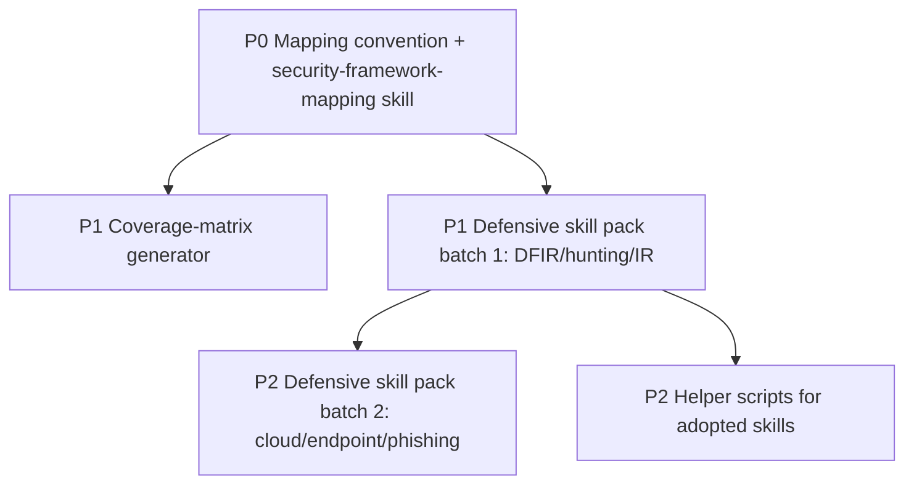

# Cross-Project Comparison: Nexus-Hub vs. Anthropic-Cybersecurity-Skills

**Version**: v2.2.0
**Generated**: 2026-05-26T22:12:54Z
**Analyzer**: Claude Code -- compare-project command
**External Source**: https://github.com/mukul975/Anthropic-Cybersecurity-Skills
**Source Type**: Repository

---

## Section 1: Executive Summary

Anthropic-Cybersecurity-Skills (community project by @mukul975, Apache-2.0, not affiliated with Anthropic) is a single-purpose content library: **754 cybersecurity skills across 26 security domains**, each mapped to **five industry frameworks** (MITRE ATT&CK v18, NIST CSF 2.0, MITRE ATLAS v5.4, MITRE D3FEND v1.3, NIST AI RMF) and following the `agentskills.io` open standard. Structurally it is the closest match to Nexus-Hub yet: identical three-tier layout (`SKILL.md` + `references/` + `scripts/` + `assets/`). The comparison found **2 strong adoption candidates** plus a curated content-import opportunity, set against three blocking constraints: a frontmatter-schema mismatch (no `summary_l0`/`overview_l1`, no Common Rationalizations section), 1030 bundled Python scripts that constitute a supply-chain review burden, and an Apache-2.0 attribution requirement that collides with Nexus-Hub's attribution-stripping reverse-engineering rule. **Overall recommendation: adopt the cross-framework mapping methodology as a first-class Nexus-Hub pattern (high value, skill-native), and selectively re-author a curated subset of defensive/operational security skills rather than bulk-importing; do not import the 1030 scripts wholesale.**

## Section 2: Project Profiles

| Attribute | Nexus-Hub | Anthropic-Cybersecurity-Skills |
|---|---|---|
| Identity | Cross-harness skill harness / catalog | Single-domain cybersecurity skill library |
| Scope | 22 categories, general SWE + AI + security | 26 security domains only |
| Author / license | Internal (Supira) | @mukul975 / Mahipal Jangra, Apache-2.0 |
| Skills | 206 | 754 (754 SKILL.md confirmed) |
| Bundled scripts | per-skill, curated | 1030 Python scripts (`agent.py` / `process.py` per skill) |
| Frameworks tagged | none in skill frontmatter (nist-ai-rmf as a skill) | 5 frameworks tagged in frontmatter + `references/standards.md` |
| Standard | Nexus-Hub three-tier model | `agentskills.io` open standard |
| Distribution | installer + integration registry | `npx skills add` / git clone / 26+ platforms |
| Validation | `validate_skills.py` (Python) | `tools/validate-skill.py` (246 lines) + 3 GitHub workflows |
| Maturity | v2.2.0 released | v1.0.0 (Mar 2026), `main` at 754 skills |

This is not a competing harness; it is a **content corpus** that could feed Nexus-Hub's thin security/compliance categories. The relationship is supplier-to-catalog, not platform-to-platform.

## Section 3: Technology Stack Comparison

| Layer | Nexus-Hub | Anthropic-Cybersecurity-Skills | Notes |
|---|---|---|---|
| Skill format | SKILL.md + 3-tier (`summary_l0`/`overview_l1`) | SKILL.md (agentskills.io frontmatter) | Same Markdown base; different required fields |
| Bundled resources | `scripts/` + `references/` + `assets/` (referenced-only rule) | identical dir convention + `SKILL.<lang>.md` translations | Structurally portable |
| Scripts | curated, cross-platform (.sh + .ps1 parity) | 1030 Python (`agent.py` wraps a security CLI via subprocess) | Python-only; no PowerShell siblings |
| Framework mapping | `nist-ai-rmf` skill; no frontmatter tags | `atlas_techniques`/`d3fend_techniques`/`nist_ai_rmf`/`nist_csf` frontmatter + `references/standards.md` + ATT&CK Navigator layer | The standout differentiator |
| Validation | JSON catalog + structural + orphan-bundle | per-skill schema validator + index.json + sync workflows | Comparable; both CI-gated |
| Discovery metadata | `data/SKILL_INDEX.md` + `skills.json` + `marketplace.json` | `index.json` + `mappings/` (attack-navigator-layer.json) | Both maintain a machine index |

## Section 4: AI Assistant Configuration Comparison

This repo carries almost no harness-configuration surface: no hooks, no agents, no rules, no commands, no installer logic. It ships `.claude-plugin/{plugin.json,marketplace.json}` for Claude Code plugin discovery and relies on `npx skills add` / the agentskills.io standard for everything else. Its entire value is in the **skill content and its framework metadata**, not in how it wires an assistant. Consequently the dimensions that dominated the ECC comparison (hooks, lifecycle CLI, MCP registry) are essentially empty here. The one configuration-adjacent asset worth noting is `mappings/` (MITRE ATT&CK, NIST CSF, OWASP cross-reference files + an ATT&CK Navigator layer JSON), which is a discovery/coverage artifact rather than an assistant config.

## Section 5: Skills and Capabilities Gap Analysis

### 5a. Present in source, Missing in Nexus-Hub (adoption candidates)

- **Cross-framework mapping methodology** (frontmatter `atlas_techniques`/`d3fend_techniques`/`nist_ai_rmf`/`nist_csf` + per-skill `references/standards.md` + a repo-level `mappings/` cross-reference + ATT&CK Navigator layer). Nexus-Hub has a `nist-ai-rmf` skill and a `traceability-matrix-generator` but no convention for tagging skills with framework identifiers. **This is the highest-value, lowest-risk adoption item.**
- **Operational security domains** with zero Nexus-Hub coverage: Threat Hunting (55), Threat Intelligence (50), Malware Analysis (39), Digital Forensics (37), Security Operations / SIEM (36), SOC Operations (33), Incident Response (25), Cloud Security ops (60), Network Security (40), Endpoint/EDR (17), Phishing Defense (16), Ransomware Defense (7), Deception Technology (2). Nexus-Hub's `security` category (9 skills: authentication-patterns, cve-reachability-analyzer, dependency-security-audit, exploitability-analyzer, licensing-compliance, pre-commit-checklist, security-patch-advisor, advanced-attack-patterns, business-logic-abuse) is entirely appsec/supply-chain; it has **no DFIR, threat-hunting, SOC, or IR operational skills**.
- **Apache-2.0 reference scripts** that wrap real security tooling (Volatility3, Sigma, YARA, BloodHound, Splunk) via clean subprocess wrappers -- useful as *exemplars* for how to bundle a deterministic security helper, even if not imported.

### 5b. Present in Nexus-Hub, Missing in source (strengths to preserve)

- **Three-tier loading discipline**: enforced `summary_l0` (<=15 words) and `overview_l1` (<=150 words) Tier-1 budget fields. The source uses richer free-form `description` but no enforced always-loaded budget.
- **Verification rigor**: Nexus-Hub requires a `## Common Rationalizations` table and a *binary* `## Verification` checklist. The source uses `When to Use / Prerequisites / Workflow / Verification` but its Verification is prose, not a binary artifact checklist.
- **Cross-platform script parity**: Nexus-Hub mandates `.ps1` siblings for every `.sh`. The source ships Python-only helpers.
- **Curation and governance**: Nexus-Hub's 206 skills are curated and registered in three data files with a security-scored `skills.json`; the source optimizes for breadth (754) and SEO reach (survey badges, playground links, token rewards in README).
- **Data-flow governance**: the MCP Registry Policy. The source has no equivalent, though its scripts are largely local-CLI wrappers.

### 5c. Present in Both, Quality Comparison

- **Per-skill bundled resources**: identical `scripts/`/`references/`/`assets/` convention. The source additionally ships `SKILL.<lang>.md` translations (e.g., `SKILL.es.md`) -- a localization pattern Nexus-Hub does not use. Quality is comparable; Nexus-Hub enforces the referenced-only (orphan-bundle) rule which the source does not advertise.
- **Machine index**: both maintain a generated index (`index.json` vs `data/skills.json` + `SKILL_INDEX.md`). Equivalent.
- **CI validation of skills**: both gate on a skill validator in CI. Equivalent rigor.

## Section 6: Commands and Automation Comparison

### 6a. Commands Gap

The source ships no slash commands, task runners, or workflow automation -- it is pure content. No gap to act on.

### 6b. CI/CD and Hooks Gap

The source's `.github/workflows/` has 3 workflows: `validate-skills.yml`, `update-index.yml` (regenerates `index.json`), and `sync-marketplace-version.yml`. Nexus-Hub already auto-generates its data registry and validates skills. The only mild adoption candidate is the **auto-index-regeneration workflow pattern** (regenerate `index.json` on skill changes), but Nexus-Hub's `make build-catalog` already covers this. No meaningful CI gap.

## Section 7: Documentation and Developer Experience Comparison

The source's README is marketing-forward (survey funnels, Casky.ai playground, token incentives, "featured in" lists) but its **skill anatomy documentation is excellent**: it clearly explains the ~30-token-scan / 500-2000-token-load progressive-disclosure model (the same economics as Nexus-Hub's three-tier model) and documents the exact frontmatter schema and body sections. The framework-mapping tables (ATT&CK tactics, CSF functions, ATLAS/D3FEND/AI RMF deep dives) are a strong DX asset for anyone navigating security coverage. Nexus-Hub's DX is tighter and less promotional; the adoptable DX idea here is the **coverage-matrix presentation** (which skills cover which framework controls), which pairs naturally with the mapping-methodology adoption in Section 5a.

## Section 8: Testing and Security Posture Comparison

**Testing.** The source validates skills via `tools/validate-skill.py` (246 lines) against the agentskills.io schema and regenerates its index in CI. It does not ship unit tests for its 1030 scripts. Nexus-Hub gates on pytest + contract suites and structural validators. Nexus-Hub is stronger on test infrastructure; the source is stronger on per-skill schema conformance breadth.

**Security.** Two-sided. On the positive side, the content is defensive/practitioner-grade and the sampled `agent.py` (Volatility3 wrapper) is a clean subprocess wrapper with timeouts, no embedded payloads, and no network calls. On the risk side: (1) **1030 unaudited Python scripts** are a supply-chain surface if imported en masse; (2) the corpus includes **offensive/dual-use domains** (Red Teaming 24, Penetration Testing 23, Web App exploitation 42, AD attacks) whose skills must be filtered against Nexus-Hub's mandate (authorized testing / defensive / CTF allowed; detection-evasion-for-malicious-purposes not allowed); (3) **Apache-2.0 requires attribution + NOTICE**, which conflicts with Nexus-Hub's rule that distributed artifacts carry no external attribution.

## Section 9: Security and Risk Assessment (MANDATORY -- gates Section 11)

### 9.1 Threat Model Comparison

| Dimension | Nexus-Hub | Anthropic-Cybersecurity-Skills | Adoption delta |
|---|---|---|---|
| New runtime dependencies | Python, bash, pwsh | Python + external security tools (Volatility3, YARA, BloodHound, Splunk) invoked by scripts | Importing *content* adds none; importing *scripts* adds heavy optional tool prerequisites |
| Outbound calls at runtime | none | skill scripts are local-CLI wrappers; some workflows `wget`/`git clone` tool symbols (Volatility ISF packs) | Re-authored skills make zero outbound calls; verbatim scripts may fetch external symbol packs |
| Credentials / API keys | none | none required by sampled content | none |
| Source/prompt/query egress | none | none in sampled content (local analysis) | none |
| New commercial relationship | none | none (Apache-2.0); README promotes optional Casky.ai/survey | none if content re-authored and promo stripped |
| Content trust | curated, reviewed | 754 community skills + 1030 scripts, not individually audited by Nexus-Hub | Per-skill review burden scales with import count |
| Dual-use / mandate | scoped to authorized/defensive/CTF | includes offensive red-team/pentest skills | Must filter to defensive + authorized-testing skills |

### 9.2 Per-Item Risk Scorecard

| Item | Risk tier | Justification |
|---|---|---|
| Cross-framework mapping methodology (frontmatter tags + standards.md) | None | Pure metadata convention; strictly improves traceability |
| Coverage-matrix / Navigator-layer presentation | None | Static reporting artifact |
| Curated defensive skill content (DFIR, threat hunting, IR, SOC) -- re-authored | Low | Markdown workflows; risk is accuracy, mitigated by review |
| Verbatim import of source SKILL.md files | Medium | Frontmatter-schema mismatch + Apache-2.0 attribution conflict + unreviewed content |
| Import of bundled Python scripts (1030) | High | Large unaudited executable surface; some wrap offensive tooling; fetches external symbol packs |
| Offensive/dual-use skills (red team, pentest exploitation, AD attacks) | High | Must be filtered against Nexus-Hub mandate; detection-evasion content excluded |

### 9.3 Reverse-Engineering Viability Analysis

| Item | Classification | Internal deliverable (if any) | Effort | Rationale (per MCP Registry Policy) |
|---|---|---|---|---|
| Cross-framework mapping methodology | skill-native | A documented frontmatter convention (`mitre_attack`/`nist_csf`/`d3fend`/`atlas`/`nist_ai_rmf` optional fields) + a `security-framework-mapping` skill + per-skill `references/standards.md` template | Low | Pure convention + instruction; no code or external call. Tier-2 LLM-native. |
| Coverage-matrix / Navigator layer | re-full | A `scripts/build_framework_coverage.py` that emits a coverage matrix from the new frontmatter tags | Low-Medium | Local static generation over Nexus-Hub's own metadata. |
| Curated defensive security skills (DFIR/threat-hunting/IR/SOC/cloud-sec) | re-full | New Nexus-Hub skills under `security/` (or a new `security-operations` category) re-authored to the Nexus-Hub three-tier + Common Rationalizations + binary Verification format | Medium-High (per batch) | Content is reproducible knowledge; re-author rather than copy to satisfy schema + attribution rules (Reverse-Engineering Attribution Rule). |
| Deterministic security helper scripts | re-partial | Re-author only the few helpers tied to adopted skills, with `.sh`+`.ps1` parity and local-only behavior | Medium | RE the pattern (subprocess wrapper) for adopted skills only; do not bulk-copy 1030 scripts. |
| Verbatim SKILL.md / script bulk import | drop-outright | none | n/a | Fails schema (no `summary_l0`/`overview_l1`, no Common Rationalizations), conflicts with attribution rule, and bulk-imports unaudited executables. |
| Offensive detection-evasion content | drop-outright | none | n/a | Outside Nexus-Hub's security mandate. |

### 9.4 Recommendation Ordering

1. **skill-native first**: Cross-framework mapping methodology (frontmatter convention + `security-framework-mapping` skill).
2. **re-full / re-partial next**: Coverage-matrix generator -> curated defensive security skills (re-authored, per batch) -> the handful of deterministic helper scripts tied to adopted skills.
3. **vendor-intrinsic**: none.
4. **drop-outright** (Section 13 N-list): verbatim bulk import of SKILL.md/scripts; offensive detection-evasion content; the 1030-script bundle.

## Section 10: Structural and Architectural Differences

- **Breadth-first vs curation-first**: the source maximizes count (754) and framework coverage; Nexus-Hub maximizes per-skill quality and a small auditable surface. Adoption must respect Nexus-Hub's curation bar -- a re-authored 15-30 skill defensive-security pack beats a 754-skill dump.
- **Schema divergence**: the source's agentskills.io frontmatter is a strict subset-plus-different-fields relative to Nexus-Hub's required fields. Any adoption needs a transform step (add `summary_l0`/`overview_l1`, Common Rationalizations, binary Verification; optionally keep the framework tags).
- **Localization pattern**: the source's `SKILL.<lang>.md` siblings are an interesting i18n approach Nexus-Hub does not use; out of scope now but noted.
- **License posture**: Apache-2.0 (source) vs internal (Nexus-Hub). Re-authoring from the same public-domain framework knowledge (MITRE/NIST are public) avoids the attribution conflict entirely.

## Section 11: Adoption Plan

Organized per Section 9.4 RE buckets, then by P-tier. `reverse-engineer-first=true`.

### Bucket A -- skill-native (ship first)

| What | Source | Target | Effort | Dependencies | Risk |
|---|---|---|---|---|---|
| P0: Cross-framework mapping convention + `security-framework-mapping` skill | source frontmatter (`atlas/d3fend/nist_csf/nist_ai_rmf`) + `references/standards.md` + `mappings/` | optional frontmatter fields documented in `AGENTS.md` + `catalog/skills/security/security-framework-mapping/` + register in 3 data files | Low | none | None |

### Bucket B -- re-full / re-partial (build internal equivalents)

| What | Source | Target | Effort | Dependencies | Risk |
|---|---|---|---|---|---|
| P1: Framework coverage-matrix generator | source `mappings/attack-navigator-layer.json` | `scripts/build_framework_coverage.py` (read-only over Nexus-Hub frontmatter tags) | Low-Medium | mapping convention (P0) | None |
| P1: Curated defensive security skill pack (batch 1: DFIR + threat hunting + incident response, ~10-15 skills) | source domains: Digital Forensics, Threat Hunting, Incident Response, SOC Ops | re-authored skills under a new `security-operations` category (or `security/`); each with `summary_l0`/`overview_l1` + Common Rationalizations + binary Verification + framework tags | Medium-High | mapping convention (P0); maintainer sign-off on new category | Low |
| P2: Curated defensive security skill pack (batch 2: cloud security ops + endpoint/EDR + phishing defense) | source domains: Cloud Security, Endpoint Security, Phishing Defense | same target as batch 1 | Medium-High | batch 1 | Low |
| P2: Deterministic helper scripts for adopted skills only | source `scripts/agent.py` exemplars | re-authored helpers with `.sh`+`.ps1` parity, local-only | Medium | adopted skills exist | Low |

### Bucket C -- vendor-intrinsic

None.

## Section 12: Implementation Sequence

Recommended order: (1) land the mapping convention + the `security-framework-mapping` skill first -- it is low-effort, no-risk, and unblocks everything else; (2) build the coverage-matrix generator over the new tags; (3) re-author defensive skill pack batch 1 (gated on maintainer approval for a new `security-operations` category per AGENTS.md "Ask first"); (4) batch 2 and the few helper scripts follow. Hard-gate every imported skill on the curation bar; prefer 10 excellent re-authored skills over 100 copied ones.

## Section 13: Risks and Considerations

- **Curation bar**: bulk-importing 754 skills would violate Nexus-Hub's curation principle and dilute the catalog's signal. Treat the source as a *reference corpus* and re-author a small, high-value defensive subset.
- **Schema transform is mandatory**: no source skill is import-ready. Each needs `summary_l0`/`overview_l1`, a Common Rationalizations table, and a binary Verification checklist, or it fails `validate_skills.py` and breaks the MCP server's frontmatter parsing.
- **New category approval**: a `security-operations` category requires maintainer sign-off (AGENTS.md "Ask first: Creating a new skill category"). Alternatively, nest under the existing `security` category.
- **Attribution**: do not copy Apache-2.0 text verbatim. Re-author from the underlying public MITRE/NIST frameworks; record provenance only in the reverse-engineering matrix row, never in the distributed skill.
- **Mandate filtering**: include defensive, detection, forensics, and authorized-testing skills; exclude any skill whose primary purpose is detection-evasion or untargeted offensive use.

### Items explicitly NOT recommended for adoption (security / policy reasons)

- **N1 -- Verbatim bulk import of the 754 SKILL.md files**: `drop-outright`. Fails Nexus-Hub's frontmatter schema (missing `summary_l0`/`overview_l1` and Common Rationalizations), conflicts with the Reverse-Engineering Attribution Rule (Apache-2.0 attribution would have to ship in the artifact), and bypasses the curation bar.
- **N2 -- Bulk import of the 1030 bundled Python scripts**: `drop-outright`. A large unaudited executable surface; several wrap offensive tooling and some workflows fetch external symbol packs. Reimplement only the handful of helpers tied to adopted skills, with cross-platform parity and local-only behavior.
- **N3 -- Offensive / detection-evasion skills**: `drop-outright`. Outside Nexus-Hub's stated security mandate (authorized testing, defensive, and CTF contexts are in scope; detection evasion for malicious purposes is not). Filter these out during any content adoption.
