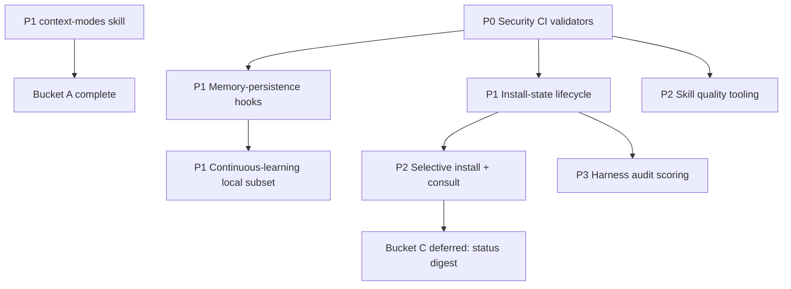

# Cross-Project Comparison: Nexus-Hub vs. ECC (Everything Claude Code)

**Version**: v2.2.0
**Generated**: 2026-05-26T22:12:54Z
**Analyzer**: Claude Code -- compare-project command
**External Source**: https://github.com/affaan-m/ECC
**Source Type**: Repository

---

## Section 1: Executive Summary

ECC ("Everything Claude Code", npm `ecc-universal`, v2.0.0-rc.1) is the closest direct analogue to Nexus-Hub yet compared: a multi-harness agent operating system shipping 246 skills, 61 agents, 76 commands, and an event-driven hook graph across Claude Code, Codex, Cursor, OpenCode, Gemini, Zed, and Copilot. Where Nexus-Hub is a curated catalog with a strict data-flow policy, ECC is an expansive operator platform with a commercial layer (ECC Pro, GitHub App, AgentShield) and a self-improving runtime (instinct-based continuous learning, memory-persistence hooks, a Rust control plane). The comparison surfaced **13 adoption candidates** (6 strong, 4 medium, 3 deferred) and reaffirmed several Nexus-Hub strengths worth preserving, chief among them the MCP Registry Policy: ECC bundles Exa, context7, Firecrawl, Magic UI, and a paid cloud-sync memory MCP, all of which sit on Nexus-Hub's explicit hard-no list. **Overall recommendation: selectively adopt the runtime-and-lifecycle infrastructure that is fully reverse-engineerable into local, zero-outbound code (continuous-learning, install-state lifecycle, context-mode injection, security CI validators), and reject ECC's external-MCP bundling philosophy outright.**

## Section 2: Project Profiles

| Attribute | Nexus-Hub | ECC |
|---|---|---|
| Identity | Production-grade skill harness / upstream catalog | Harness-native operator OS + commercial platform |
| Author / model | Single maintainer (Supira), internal | Single maintainer (Affaan Mustafa), Anthropic hackathon winner |
| License | Internal (repo-private) | MIT (OSS core) + paid Pro tier |
| Version | v2.2.0 (released) | v2.0.0-rc.1 (release candidate) |
| Skills | 206 across 22 categories | 246 (flat namespace, domain-tagged) |
| Agents | 10 | 61 |
| Commands | 40 | 76 maintained + 13 legacy shims |
| Hooks | 22 (bash + python) | event graph in `hooks/hooks.json`, Node.js implementations |
| Distribution | `installer.sh` / `installer.ps1` + integration registry | `/plugin install` + `install.sh`/`install.ps1` + `npx ecc` + manifest-driven selective install |
| Internal MCP | 3 local servers (skill, code-search, web-fetch) | None; bundles ~25 external MCP definitions |
| Maturity signal | versioned releases, known-gaps tracker, contract tests | 997+ internal tests, weekly cadence, 182K+ stars claimed |
| Distinctive layer | code-graph (tree-sitter AST + FTS5), MCP policy | continuous learning (instincts), Rust control plane (`ecc2/`), dashboard GUI |

Both projects target the identical problem space (cross-harness distribution of skills/commands/hooks/rules) and even share concrete agent names (planner, architect, tdd-guide, code-reviewer, security-reviewer, build-error-resolver, refactor-cleaner, doc-updater, loop-operator, harness-optimizer). The divergence is philosophical: Nexus-Hub optimizes for **curation and data-flow safety**; ECC optimizes for **breadth, runtime self-improvement, and commercial reach**.

## Section 3: Technology Stack Comparison

| Layer | Nexus-Hub | ECC | Notes |
|---|---|---|---|
| Skill format | SKILL.md + 3-tier loading (`summary_l0`/`overview_l1`) | SKILL.md (agentskills-style frontmatter) | Both Markdown-first; Nexus-Hub adds strict tier-1 budget fields |
| Installer | Bash + PowerShell + Python integration registry | Node.js (`scripts/*.js`), Bash, PowerShell | ECC standardized on Node for cross-platform hooks; Nexus-Hub uses Python integration subclasses |
| Internal services | Python MCP servers (FastMCP), tree-sitter, FTS5 | none (Rust `ecc2/` control plane prototype) | Nexus-Hub keeps logic in-tree as local MCPs; ECC's runtime is a separate Rust binary |
| State store | none (stateless installer + `--check` drift) | SQLite session/state store + install-state manifest | ECC tracks installed files and session history |
| Validation | `make validate` (Python), ShellCheck, pytest | `npm test` (12 Node validators), `c8` coverage gate (80%) | Comparable rigor; different runtimes |
| Test suite | pytest hook tests + 50-case integration contract suite | `tests/run-all.js`, 997+ tests, coverage gate | Both gate CI on tests |
| GUI | VS Code extension | Tkinter desktop dashboard (`ecc_dashboard.py`) | Functionally equivalent surfaces |
| Languages shipped to users | Markdown content + scripts | Markdown + 12 language rule packs + Rust alpha | ECC ships per-language rule packs (TS/Py/Go/Swift/PHP/ArkTS) |

## Section 4: AI Assistant Configuration Comparison

This is the highest-signal section because both repos exist to configure AI assistants.

**Platform fan-out.** ECC ships pre-built per-harness config directories committed to the repo (`.claude/`, `.codex/`, `.cursor/`, `.gemini/`, `.opencode/`, `.qwen/`, `.zed/`, `.trae/`, `.kiro/`, `.codebuddy/`, `.agents/`, plus `.claude-plugin/` and `.codex-plugin/` manifests). Nexus-Hub instead generates per-platform output at install time through the `scripts/lib/integrations/` registry (10 `IntegrationBase` subclasses) plus lock-step `templates/ai-instructions/base-*.md`. **ECC commits the rendered surfaces; Nexus-Hub renders on demand.** Nexus-Hub's approach is non-destructive (marker-based `merge_marker_section`, `--check` drift, `--print-config`); ECC's committed surfaces are simpler to inspect but require the install pipeline to keep them in sync (handled by `scripts/install-plan.js` / `install-apply.js` and a state store).

**Hooks.** Both ship a comparable hook taxonomy (PreToolUse / PostToolUse / Stop / SessionStart / PreCompact / SessionEnd). ECC's distinctive additions are runtime hook controls via environment variables (`ECC_HOOK_PROFILE=minimal|standard|strict`, `ECC_DISABLED_HOOKS`, `ECC_SESSION_START_MAX_CHARS`) and **lifecycle hooks that persist and reload session context** (`scripts/hooks/session-start.js`, `session-end.js`, `pre-compact.js`, `evaluate-session.js`). Nexus-Hub has `session-start.sh` and `session-summary.sh` but they do not implement cross-session memory persistence or pattern extraction.

**Commands vs skills direction.** Both projects are migrating from commands toward skills-first (ECC explicitly: "`skills/` is the canonical workflow surface", commands kept for compatibility). Nexus-Hub already treats skills as primary and ships only 40 commands.

**MCP configuration.** Sharp divergence. ECC's `mcp-configs/mcp-servers.json` bundles ~25 servers including GitHub, Supabase, Vercel, Railway, Cloudflare, ClickHouse, **Exa (web-search-as-service), context7 (Upstash docs-as-service), Firecrawl (scraping-as-service), Magic UI (generation-as-service), fal.ai, Browserbase, browser-use, token-optimizer, and squish (paid cloud-sync memory)**. Nexus-Hub ships 3 internal local MCPs and gates every external entry behind the MCP Registry Policy decision tree; Exa, context7, Firecrawl, and Magic UI are named explicitly in Nexus-Hub's hard-no list. This is the single largest philosophical gap between the projects (see Section 9).

## Section 5: Skills and Capabilities Gap Analysis

### 5a. Present in ECC, Missing in Nexus-Hub (adoption candidates)

Grouped by capability area. Domain-specific ECC skills with no Nexus-Hub analogue and no fit (network engineering, prediction markets, healthcare PHI, logistics, customs/trade, crypto/DeFi) are intentionally excluded as out-of-scope.

- **Continuous learning / instinct extraction** (`skills/continuous-learning-v2/`, `skills/continuous-learning/`, `scripts/hooks/evaluate-session.js`, commands `learn`/`evolve`/`instinct-*`/`prune`): observes sessions via hooks, mints atomic confidence-scored "instincts", and evolves clusters into skills/commands/agents. v2.1 adds project-scoped isolation. **No Nexus-Hub equivalent.**
- **Memory-persistence hooks** (`hooks/memory-persistence/`): save state on SessionEnd/PreCompact and reload on SessionStart. Nexus-Hub's session hooks do not persist/restore context.
- **Dynamic context-mode injection** (`contexts/dev.md`, `review.md`, `research.md`): swappable system-prompt fragments that retune behavior by task mode. **No Nexus-Hub equivalent.**
- **Install-state lifecycle CLI** (`scripts/doctor.js`, `repair.js`, `list-installed.js`, `uninstall.js`, `scripts/lib/install-lifecycle.js`): records what was installed and offers diagnose/repair/list/clean-uninstall. Nexus-Hub has `--check` drift and uninstall methods but no install-state manifest, no `repair`, no `list-installed` (confirmed: grep for `doctor`/`repair`/`list-installed`/`install_state` in `scripts/` returned zero matches).
- **Selective install** (`scripts/install-plan.js`, `install-apply.js`, profiles/modules/`capability:` tags) + **component advisor** (`scripts/consult.js`: fuzzy match a natural-language need to components/profiles). Nexus-Hub installs the full catalog per platform; `search_skills` MCP + `SKILL_INDEX` is a partial discovery analogue but there is no profile/module install scoping.
- **Security CI validators** (`scripts/ci/validate-no-personal-paths.js`, `check-unicode-safety.js`, `scan-supply-chain-iocs.js`, `validate-workflow-security.js`): catch leaked `/Users/<name>` paths, unsafe Unicode, supply-chain IOCs, and unsafe GitHub Actions. Nexus-Hub has a `secret-scan.sh` hook and an ASCII-commit rule but no CI-level personal-path/unicode/IOC validators.
- **Skill quality tooling**: `skill-create` (generate skills from local git history), `skills/skill-stocktake/` (holistic quality audit with cached `results.json` + quick-diff), `skills/skill-scout/`. Nexus-Hub has `validate_skills.py` (structural + orphan-bundle) and a `create-skill-or-command` wizard, but no git-history skill generation and no holistic quality-audit loop.
- **Operator status surface** (`scripts/status.js`, `work-items.js`, `operator-readiness-dashboard.js`): `ecc status --markdown` snapshots readiness + sessions + work items (Linear/GitHub). No Nexus-Hub equivalent (Nexus-Hub is a catalog, not a session operator).
- **Multi-session orchestration control plane** (`ecc2/`, Rust): TUI dashboard, SQLite session store, worktree-aware sessions, daemon. No Nexus-Hub equivalent.
- **Harness audit scoring** (`scripts/harness-audit.js`, `harness-adapter-compliance.js`): deterministic scoring of a harness install's reliability/cost posture. Nexus-Hub's 50-case contract suite is a partial structural analogue.

### 5b. Present in Nexus-Hub, Missing in ECC (strengths to preserve)

- **MCP Registry Policy + reverse-engineering matrix** (`AGENTS.md`, `docs/policy/mcp-reverse-engineering-matrix.md`): a formal data-flow decision tree. ECC has no equivalent governance and bundles the exact services Nexus-Hub forbids.
- **Internal local MCP servers with a code-graph** (`extensions/nexus-code-search/`: tree-sitter AST, FTS5, callers/callees/impact traversal, affected-tests). ECC bundles external code-search/docs MCPs instead of shipping a local one.
- **Three-tier loading model with budgeted Tier-1 fields** (`summary_l0`/`overview_l1`) and **orphan-bundle detection** in `validate_skills.py`. ECC's frontmatter lacks an enforced always-loaded token budget.
- **Non-destructive shared-file installer** (`merge_marker_section`/`remove_marker_section`, `WriteResult`/`FileAction`, `--check`, `--print-config`, 50-case contract suite, tree-mirror parity tests). ECC commits rendered surfaces and relies on a state store instead of marker-merge idempotency.
- **Process discipline artifacts**: `known-gaps-tracker`, `dev-progress-tracker`, `project-constitution`, `spec-driven-development`, `cross-artifact-analyzer`, RELEASE_NOTES + DEVLOG + Markdown style guide.

### 5c. Present in Both, Quality Comparison

- **Agent roster**: ECC has 61 agents vs Nexus-Hub's 10; ECC covers far more per-language reviewers/build-resolvers (Go, Rust, Kotlin, Java, C++, F#, PyTorch, Django, ArkTS). Nexus-Hub covers equivalent ground through skills rather than agents. ECC wins on agent breadth; Nexus-Hub wins on per-skill depth and verification rigor (Common Rationalizations + binary Verification sections).
- **Eval / verification**: ECC ships `eval-harness`, `verification-loop`, `token-budget-advisor` skills. Nexus-Hub ships `skill-eval-loop`, `context-optimization`, `context-compression`, `prompt-token-optimization`, and a `verify` skill. Roughly equivalent; no adoption needed.
- **Cross-platform installers**: both ship Bash + PowerShell. Nexus-Hub's is more structured (typed integration registry); ECC's is more feature-rich at the CLI surface (profiles, doctor, consult).

## Section 6: Commands and Automation Comparison

### 6a. Commands Gap

ECC's command surface that has no Nexus-Hub analogue: `learn` / `learn-eval` / `evolve` / `prune` / `instinct-status|import|export` (continuous-learning), `consult` (advisor), `harness-audit`, `loop-start` / `loop-status`, `model-route`, `quality-gate`, `multi-plan|execute|backend|frontend|workflow` (PM2 multi-service orchestration, requires external `ccg-workflow` runtime), `setup-pm` (package-manager selection). Nexus-Hub-only equivalents not in ECC: `generate-plan`, `implement-phase`, `run-deep-review`, `run-penetration-test`, `wrap-up-session`, `refactor-docs`, `constitution`, `tasks-to-issues`.

### 6b. CI/CD and Hooks Gap

ECC's `.github/workflows/` has 8 workflows including `supply-chain-watch.yml`, `monthly-metrics.yml`, and reusable release/test/validate workflows; its `npm test` chains 12 validators (agents/commands/rules/skills/hooks/install-manifests/no-personal-paths/unicode-safety/catalog/command-registry). Nexus-Hub's `make validate`/`make lint`/`make test` cover JSON integrity, ShellCheck, and pytest hooks. **Adoption candidates from CI**: the supply-chain IOC scan, no-personal-paths validator, and unicode-safety validator (all local, zero-outbound). Nexus-Hub's hook layer is comparable; ECC's runtime hook-profile env controls (`ECC_HOOK_PROFILE`) are a nice ergonomic Nexus-Hub lacks.

## Section 7: Documentation and Developer Experience Comparison

ECC ships extensive operator-facing docs (Hermes setup guide, cross-harness architecture, release notes per RC, three long-form guides, and README translations into 10 languages). Its DX standouts: `npx ecc consult` (find the right component), `doctor`/`repair` (self-heal), a Tkinter dashboard, and runtime env-var hook tuning. Nexus-Hub's DX standouts: the `using-nexus-hub` orientation skill, `search_skills` MCP, the three-tier progressive-disclosure model that keeps context cost low, and disciplined version-scoped docs (`docs/archive/v2/v2.2/`). ECC is broader and more operator-polished; Nexus-Hub is tighter and more context-economical. The clearest DX adoption candidates are `consult`-style component discovery and `doctor`/`repair` lifecycle health.

## Section 8: Testing and Security Posture Comparison

**Testing.** Both gate CI on a passing suite. ECC enforces an 80% coverage floor via `c8` across `scripts/**`; Nexus-Hub gates on pytest hook tests + the 50-case integration contract suite + tree-mirror parity tests. ECC has higher raw test count (997+); Nexus-Hub has stronger structural invariants (idempotency, uninstall-reverses-install, drift detection).

**Security.** ECC ships AgentShield (a separate npm security scanner with 102 rules, secrets detection, hook-injection analysis, MCP risk profiling) plus CI supply-chain watch and IOC scanning. Nexus-Hub ships the `secret-scan.sh` and `git-guardrails.sh` hooks, the ASCII-only commit rule, and the MCP Registry Policy as a preventive governance layer. **The decisive contrast**: ECC's security posture is strong on *scanning* but its MCP registry deliberately ships data-exfiltration-capable external servers (Exa/context7/Firecrawl/squish-cloud), which Nexus-Hub's policy forbids by construction. Nexus-Hub trades breadth for a smaller, auditable outbound-call surface.

## Section 9: Security and Risk Assessment (MANDATORY -- gates Section 11)

### 9.1 Threat Model Comparison

| Dimension | Nexus-Hub | ECC | Adoption delta |
|---|---|---|---|
| New runtime dependencies | Python (FastMCP, tree-sitter), bash, pwsh | Node.js runtime, `@iarna/toml`, `ajv`, `sql.js`, Rust toolchain (`ecc2/`), `c8` | Adopting ECC infra as-is adds Node + Rust; reverse-engineering into Python/existing stack adds none |
| Outbound calls at runtime | none (3 internal MCPs are local; web-fetch is user-initiated) | bundled MCPs reach Exa, Upstash, Firecrawl, fal.ai, Browserbase, squish-cloud; `auto-update.js`; GitHub App | Adopting infra logic = zero new outbound; adopting ECC's MCP bundle = many new destinations |
| Credentials / API keys | none required by core | EXA_API_KEY, FIRECRAWL_API_KEY, FAL_KEY, BROWSERBASE_API_KEY, GitHub PAT, etc. | RE'd infra requires zero new keys |
| Source/prompt/query egress | none | Exa/Firecrawl receive query text; context7 receives lib queries; squish cloud-sync receives session memory | RE'd infra keeps all data local |
| New commercial relationship | none | implied by Exa/Firecrawl/fal.ai/Browserbase/squish paid tiers and ECC Pro | none for RE'd infra |

### 9.2 Per-Item Risk Scorecard

| Item | Risk tier | Justification |
|---|---|---|
| Continuous-learning / instincts | Low | Local hooks + local files; risk is observation data on disk, no egress if no external observer model is wired |
| Memory-persistence hooks | Low | Local state read/write only |
| Context-mode injection | None | Static Markdown fragments, no execution |
| Install-state lifecycle (doctor/repair/list/uninstall) | None | Local filesystem bookkeeping |
| Selective install + consult advisor | None | Local manifest matching |
| Security CI validators (no-personal-paths, unicode, IOC, workflow-security) | None | Read-only static scans; strictly improve posture |
| Skill quality tooling (skill-create / stocktake / scout) | None | Local git-history + Markdown analysis |
| Operator status surface (work-items sync) | Medium | `work-items sync-github` and Linear integration introduce outbound calls + tokens |
| Multi-session control plane (`ecc2/` Rust) | Medium | Spawns/daemonizes agent sessions; large new attack surface + Rust dependency |
| Harness audit scoring | None | Local static analysis |
| ECC bundled external MCP registry | High | Exfiltration-capable third-party data processors on Nexus-Hub's hard-no list |
| ECC `auto-update.js` self-update | Medium | Network self-mutation of installed files |

### 9.3 Reverse-Engineering Viability Analysis

| Item | Classification | Internal deliverable (if any) | Effort | Rationale (per MCP Registry Policy) |
|---|---|---|---|---|
| Context-mode injection | skill-native | A `context-modes` skill + optional `~/.nexus-hub/contexts/*.md` fragments | Low | Pure instruction content; achievable by instructing the agent. Tier-2 LLM-native (Policy tier 2). |
| Security CI validators | re-full | `scripts/validate_no_personal_paths.py`, `validate_unicode_safety.py`, `scan_supply_chain_iocs.py` wired into `make validate` | Low | Self-contained static scans; reimplement in Nexus-Hub's Python validator stack with zero loss. |
| Install-state lifecycle | re-full | Extend integration registry with an install-state manifest + `doctor`/`repair`/`list-installed` subcommands on both installers | Medium | Local bookkeeping; reverse-engineers cleanly onto `WriteResult`/`FileAction` and the `nexus-hub init`/`--check` precedent. |
| Continuous-learning / instincts | re-partial | A `continuous-learning` skill + local SessionEnd/PreCompact hooks writing `instincts/*.yaml`; evolve step is agent-driven | Medium-High | Local capture + local files are RE-able; only a background *observer model* would add egress, so ship the local-only subset and document the deferred auto-observer (Policy tier 3, partial). |
| Memory-persistence hooks | re-full | Enrich `session-start.sh`/`session-summary.sh` to persist/restore a local context digest | Medium | Local read/write; no external dependency. |
| Selective install + consult advisor | re-full | Profile/module/capability tags in `data/bundles.json` + a `nexus-hub consult` matcher over `SKILL_INDEX` | Medium | Local manifest matching; `search_skills` MCP already proves the retrieval half. |
| Skill quality tooling | re-partial | A `skill-stocktake` skill (agent-graded) + extend `validate_skills.py` with a quality-heuristics pass; `skill-create` as a git-history skill | Medium | Audit/generation are agent + local-git driven (skill-native + re-full); no external service. |
| Harness audit scoring | re-full | A deterministic `scripts/harness_audit.py` over installed surfaces | Medium | Pure local static scoring. |
| Operator status surface | vendor-intrinsic | Local status digest is re-full; the Linear/GitHub work-items sync is vendor-intrinsic and out of fit | Medium | The local `status --markdown` is RE-able; GitHub sync is `vendor-intrinsic` (you already use GitHub) but low fit for a catalog repo. Defer. |
| Multi-session control plane (`ecc2/`) | drop-outright | none | High | Large Rust runtime, low fit for a distribution catalog; reproduces the Nexus-AI desktop studio's remit, not Nexus-Hub's. |
| ECC bundled external MCP registry | drop-outright | none | n/a | Exa/context7/Firecrawl/Magic/squish-cloud are on the Policy hard-no list (search/docs/scraping/generation/memory-as-service). Reject. |
| `auto-update.js` self-update | drop-outright | none | n/a | Network self-mutation conflicts with installer-determinism and adds a supply-chain vector. |

### 9.4 Recommendation Ordering

1. **skill-native first**: Context-mode injection.
2. **re-full / re-partial next** (build internal equivalents): Security CI validators -> Memory-persistence hooks -> Install-state lifecycle -> Continuous-learning (local subset) -> Selective install + consult -> Skill quality tooling -> Harness audit scoring.
3. **vendor-intrinsic only if all three conditions hold**: Operator status surface (local digest only) -- deferred; GitHub work-items sync does not clear the "extremely worth it" bar for a catalog repo.
4. **drop-outright** (Section 13 N-list): ECC external MCP registry bundle, `ecc2/` Rust control plane, `auto-update.js` self-update.

This ordering governs Section 11; the P-tiers operate *within* each RE bucket, not across it.

## Section 10: Structural and Architectural Differences

- **Rendered-surface vs render-on-demand**: ECC commits per-harness config trees; Nexus-Hub renders them from templates + integration subclasses at install time. Nexus-Hub's model is more maintainable for N platforms; ECC's is easier to inspect but heavier to keep in sync.
- **Stateful vs stateless installer**: ECC tracks install-state in a manifest and SQLite; Nexus-Hub is stateless with marker-merge idempotency + `--check` drift. Adopting an install-state manifest (Section 11) bridges the gap without abandoning marker-merge.
- **Flat domain-tagged skills vs categorized tree**: ECC uses a flat `skills/` namespace with frontmatter `domain` tags; Nexus-Hub uses a 22-category directory tree. Both are valid; no change recommended.
- **Runtime self-improvement**: ECC's defining architectural bet is a learning runtime (instincts + observer). Nexus-Hub has no runtime feedback loop. This is the most interesting and the most carefully-gated adoption area (egress risk lives in the observer model choice).
- **Commercial coupling**: ECC interleaves OSS with paid surfaces (Pro, GitHub App, AgentShield, Casky.ai). Nexus-Hub has no commercial layer; adoption must extract patterns, not the business model.

## Section 11: Adoption Plan

Organized per Section 9.4 RE buckets, then by P-tier within each bucket. `reverse-engineer-first=true`.

### Bucket A -- skill-native (ship first)

| What | Source | Target | Effort | Dependencies | Risk |
|---|---|---|---|---|---|
| P1: `context-modes` skill (dev/review/research system-prompt fragments) | ECC `contexts/*.md` | `catalog/skills/workflow/context-modes/` + register in 3 data files | Low | none | None |

### Bucket B -- re-full / re-partial (build internal equivalents)

| What | Source | Target | Effort | Dependencies | Risk |
|---|---|---|---|---|---|
| P0: Security CI validators (no-personal-paths, unicode-safety, supply-chain IOC, workflow-security) | ECC `scripts/ci/*.js` | `scripts/validate_*.py` wired into `make validate`; register copy steps in both installers | Low | none | None |
| P1: Memory-persistence session hooks (persist + restore local context digest) | ECC `hooks/memory-persistence/`, `scripts/hooks/session-*.js` | enrich `catalog/hooks/session-start.sh` + `session-summary.sh` (+ `.ps1` siblings) | Medium | none | Low |
| P1: Install-state lifecycle (`doctor`/`repair`/`list-installed` + state manifest) | ECC `scripts/doctor.js`, `repair.js`, `list-installed.js`, `lib/install-lifecycle.js` | extend `scripts/lib/integrations/` + add subcommands to `installer.sh`/`installer.ps1` | Medium | install-state manifest design | None |
| P1: Continuous-learning (local subset) skill + capture hooks | ECC `skills/continuous-learning-v2/`, `scripts/hooks/evaluate-session.js` | `catalog/skills/workflow/continuous-learning/` + local SessionEnd/PreCompact capture hooks (no external observer) | High | memory-persistence hooks | Low |
| P2: Selective install (profiles/modules/capability tags) + `consult` advisor | ECC `scripts/install-plan.js`, `install-apply.js`, `consult.js` | profile/module schema in `data/bundles.json` + `nexus-hub consult` matcher over `SKILL_INDEX` | Medium | install-state manifest | None |
| P2: Skill quality tooling (`skill-stocktake` audit + `skill-create` from git history) | ECC `skills/skill-stocktake/`, `scripts/skill-create-output.js` | `catalog/skills/workflow/skill-stocktake/` + quality pass in `validate_skills.py` | Medium | none | None |
| P3: Harness audit scoring | ECC `scripts/harness-audit.js` | `scripts/harness_audit.py` (read-only) | Medium | install-state manifest | None |

### Bucket C -- vendor-intrinsic (deferred)

| What | Source | Target | Effort | Dependencies | Risk |
|---|---|---|---|---|---|
| Deferred: Operator status digest (local only; GitHub/Linear sync excluded) | ECC `scripts/status.js` | not scheduled; revisit only if a session-operator use case emerges | Medium | n/a | Medium |

## Section 12: Implementation Sequence

Recommended order: (1) ship `context-modes` (trivial, immediate value); (2) land the P0 security CI validators (low effort, pure posture win, no dependencies); (3) build memory-persistence hooks and the install-state lifecycle in parallel; (4) layer continuous-learning on top of memory-persistence; (5) add selective install + consult once the install-state manifest exists; (6) skill quality tooling any time after the validators; (7) harness audit scoring last; (8) hold the operator status digest in the backlog.

## Section 13: Risks and Considerations

- **Continuous-learning egress trap**: ECC's instinct observer can run a background model. The local-only subset (capture + local files + agent-driven evolve) is safe; wiring an external observer model would reintroduce egress and must stay out of scope unless it uses a local model.
- **Install-state vs marker-merge**: an install-state manifest must coexist with the existing `merge_marker_section` idempotency, not replace it. Design the manifest as an additive record, preserving user-edit preservation guarantees.
- **Node/Rust runtime creep**: adopt ECC's *logic*, not its runtime. Reimplement in Nexus-Hub's Python/bash/pwsh stack to avoid adding Node and Rust toolchain requirements to every user.
- **Agent-count temptation**: ECC's 61 agents are mostly per-language reviewers. Resist mirroring them; Nexus-Hub delivers equivalent coverage through skills with stronger verification sections. Adding 50 thin agents would dilute, not strengthen.
- **License/attribution**: ECC is MIT. Any reverse-engineered pattern must follow Nexus-Hub's Reverse-Engineering Attribution Rule -- generic names, attribution recorded only in the `docs/policy/mcp-reverse-engineering-matrix.md` row, not in the distributed artifact.

### Items explicitly NOT recommended for adoption (security / policy reasons)

- **N1 -- ECC bundled external MCP registry (Exa, context7, Firecrawl, Magic UI, fal.ai, Browserbase, browser-use, squish cloud-sync)**: rejected under the **MCP Registry Policy** hard-no list (search-as-service, docs/embeddings-as-service, scraping-as-service, generation-as-service, memory-as-service). These transmit query text / session memory to third parties and require new API keys and commercial relationships.
- **N2 -- `ecc2/` Rust multi-session control plane**: `drop-outright`. High-effort Rust runtime that reproduces a desktop-operator remit (closer to Nexus-AI's scope) and adds a large new attack surface; low fit for an upstream catalog. Fails the "extremely worth it" bar of Policy tier 4.
- **N3 -- `auto-update.js` self-updating installer**: `drop-outright`. Network self-mutation of installed files conflicts with Nexus-Hub's deterministic, user-initiated installer model and introduces a supply-chain vector inconsistent with the MCP Registry Policy's data-flow principles.
- **N4 -- GitHub/Linear `work-items sync`**: not adopted now. `vendor-intrinsic` but does not clear all three Policy tier-4 conditions (intrinsic destination AND non-RE'able AND extremely worth it) for a distribution catalog that is not a session operator.
