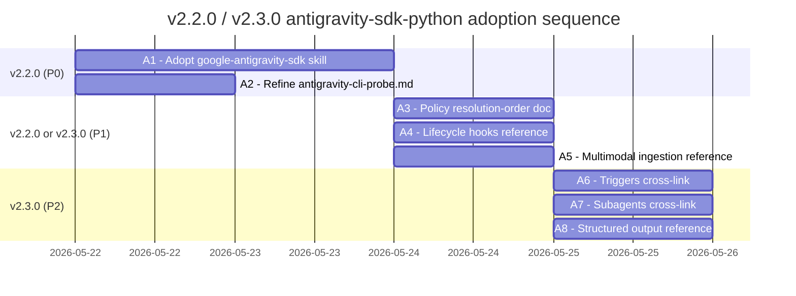

# Cross-Project Comparison: Nexus-Hub vs. antigravity-sdk-python

**Version**: v2.2.0
**Generated**: 2026-05-21T00:00:00Z
**Analyzer**: Claude Code -- compare-project command
**External Source**: https://github.com/google-antigravity/antigravity-sdk-python (commit at HEAD on 2026-05-21)
**Source Type**: Repository

---

## 1. Executive Summary

Nexus-Hub and `antigravity-sdk-python` solve fundamentally different problems: Nexus-Hub is an upstream **catalog** of skills, commands, hooks, and agent instruction templates distributed to AI assistants (Claude Code, Codex, Gemini, Antigravity CLI, etc.); `antigravity-sdk-python` is a Python **SDK for building** autonomous agents on top of the Google Antigravity backend (Gemini models, a compiled Go local-harness binary, MCP bridging). The two projects intersect at three points: (1) both speak the Anthropic-style Agent Skill format, (2) both ship MCP integration patterns, (3) both touch the Antigravity surface that Nexus-Hub's v2.2.0 `antigravity-cli-probe.md` is currently inferring statically. The comparison found **8 actionable adoption candidates** (A1-A8) across skill catalog, hook patterns, and probe refinements -- all classified `skill-native` or `re-full` under the MCP Registry Policy (zero new outbound calls, zero new credentials, zero new third-party processors). **Two patterns from the SDK are explicitly NOT recommended** (N1, N2) because they would pull `google-genai` and the Antigravity Go binary into Nexus-Hub's runtime surface, violating the policy's `generation-as-service` hard-no rule and bloating the install footprint. **Overall recommendation: selectively adopt** -- bundle A1 (the upstream `google-antigravity-sdk` skill, repackaged into Nexus-Hub's catalog as `ai-development/google-antigravity-sdk`) and A2 (refine the static `antigravity-cli-probe.md` with concrete SDK runtime details) into the existing v2.2.0 Phase 2 work; defer A3-A8 to v2.3.0 as additive polish.

## 2. Project Profiles

| Dimension | Nexus-Hub (v2.2.0) | antigravity-sdk-python (0.1.1) |
|---|---|---|
| **Purpose** | Upstream catalog of AI-assistant skills, commands, hooks, and agent instruction templates | Python SDK for building agents on the Google Antigravity backend |
| **Primary consumer** | AI coding assistants (Claude Code, Codex, Antigravity, Gemini CLI, Cursor, OpenCode, Copilot, Nexus-AI) via the installer | Python application developers building agentic apps |
| **Maturity** | Active, v2.2.0 in progress (Phase 1 closed); 22 categories, ~206 skills, 33 commands, 14 hooks, 10 integrations | Development Status :: 3 - Alpha, v0.1.1, ~20 modules under `google/antigravity/`, 14 reference docs in the bundled Agent Skill |
| **Scale** | 206 skills, ~50 KLoC catalog + ~5 KLoC installer + ~3 KLoC extensions | ~5 KLoC Python + a compiled Go runtime (`google/antigravity/bin/localharness`) bundled into platform-specific wheels |
| **License** | (assumed MIT/Apache - check `LICENSE`) | Apache-2.0 |
| **Runtime story** | Pure Python installer + per-extension Python servers; no compiled binaries | Python wrapper around a pre-compiled Go binary (the "local-harness") that handles the agentic loop |
| **Distribution** | Cross-platform bash + PowerShell installer; per-platform target directories under `~/.nexus-hub/`, `~/.claude/`, `~/.agent/`, etc. | PyPI (`pip install google-antigravity`); platform-specific wheels carry the Go binary |
| **Active design constraint** | MCP Registry Policy: prefer local / skill-native / reverse-engineered over third-party wrappers (`AGENTS.md`) | Antigravity backend is the data destination; SDK is the official client SDK |

## 3. Technology Stack Comparison

| Layer | Nexus-Hub | antigravity-sdk-python | Notes |
|---|---|---|---|
| **Primary language** | Python 3.10+ (installer, hooks, internal MCPs), bash + PowerShell (installer wrappers) | Python 3.10-3.13 | Aligned |
| **Async framework** | None in the installer; async only inside MCP servers (`fastmcp`) | `asyncio` everywhere; SDK API is async-first (`async with Agent(config) as agent`) | SDK is fully async; Nexus-Hub installer is sync by design |
| **Build system** | `make` + `setuptools` (per-extension `pyproject.toml`) | `setuptools >=68.0` + platform-specific wheel build via Copybara + Kokoro CI | Aligned where they overlap |
| **Test runner** | `pytest` (`make test` runs `catalog/hooks/tests/` and per-extension test suites) | `pytest` (`*_test.py` co-located with modules; `[project.optional-dependencies] dev = ["pytest>=7.0"]`) | Aligned; SDK uses co-located `*_test.py` while Nexus-Hub uses `tests/` subdirs |
| **Lint/format** | `ShellCheck` for hooks; per-extension lint configs | (none configured in the repo; relies on Kokoro CI conventions) | Nexus-Hub has stronger documented lint surface |
| **Type checking** | Per-extension; `mypy --strict` recommended in global rules | `pydantic >=2.0` for runtime validation; no project-wide mypy config visible | Aligned conceptually |
| **Dependencies** | Lightweight: only the per-extension MCP servers pull dependencies | `absl-py`, `google-genai >=1.0`, `mcp >=1.0`, `pydantic >=2.0`, `uvicorn >=0.46`, `websockets >=12.0`, `protobuf >=4.25` | SDK has a heavier runtime; Nexus-Hub deliberately stays slim |
| **CI/CD** | `Makefile` targets + (presumed) GitHub Actions in `.github/workflows/` | Google Kokoro (`.kokoro/`): `presubmit.cfg/sh`, `continuous.cfg/sh`, `release.cfg/sh` -- Google-internal CI | Different ecosystems; not directly portable |

## 4. AI Assistant Configuration Comparison

This section is the highest-signal cross-project axis because Nexus-Hub's reason for existence is to configure AI assistants, and `antigravity-sdk-python` ships an Anthropic-format Agent Skill at `skills/google-antigravity-sdk/`.

| Artifact | Nexus-Hub (v2.2.0) | antigravity-sdk-python | Gap analysis |
|---|---|---|---|
| **Agent Skill format** | YAML frontmatter (`name`, `description`, `summary_l0`, `overview_l1`), required body sections (Instructions / Common Rationalizations / Verification / Related Skills); `catalog/skills/<cat>/<name>/SKILL.md` layout with optional `scripts/`, `references/`, `assets/` subdirs | Same Anthropic-style format (`name`, `description`, then a Routing Table linking to `references/*.md` + `examples/*.md`) at `skills/google-antigravity-sdk/SKILL.md` | **DIRECTLY ADOPTABLE.** The external skill is a literal drop-in candidate for `catalog/skills/ai-development/google-antigravity-sdk/` -- same format, same loading model, same bundled `references/` + `examples/` convention. |
| **Required frontmatter** | `name`, `description`, `summary_l0`, `overview_l1` (the L0/L1 fields are mandatory per `AGENTS.md`) | `name`, `description` only | Adoption requires authoring `summary_l0` and `overview_l1` from the existing `description`. |
| **Skill body sections** | Mandatory: When to Use / Instructions / Common Rationalizations / Verification / Related Skills | Single "Installation & Setup" section + Routing Table | Adoption requires expanding the body to match Nexus-Hub's section template (rationalizations + verification are missing in the source). |
| **Bundled resources** | Per-skill `scripts/`, `references/`, `assets/` subdirs (Tier 3 loading) | Per-skill `references/` (7 docs) + `examples/` (12 docs) | Same convention. Nexus-Hub's `references/` folder convention applies cleanly; `examples/` would need renaming to `references/examples/` or `scripts/examples/` to fit Nexus-Hub layout. |
| **Distribution** | Installer copies the whole skill folder tree recursively (`scripts/installer.sh` / `installer.ps1`); no per-skill registry edit needed | Two third-party CLIs proposed (`npx skills add ...` and `npx ctx7 skills install ...`) | **NOT ADOPTABLE.** The Vercel / Context7 skills CLI distribution model conflicts with Nexus-Hub's MCP Registry Policy decision tree (third-party distribution surface). Use Nexus-Hub's installer instead. |
| **Trigger-phrase strategy** | `AGENTS.md` mandates pushy descriptions with explicit trigger phrases AND `SKIP:` clauses | Single-sentence description: "Design, implement, and debug autonomous AI agents and multi-agent systems using the Google Antigravity (AGY) SDK. ACTIVATE this skill when the user wants to create, configure, or orchestrate Google Antigravity agents." | Adoption requires expanding to match Nexus-Hub's pushy-description norm (trigger phrases for "Antigravity SDK", "Gemini agent", "AGY SDK", plus `SKIP: standalone Gemini API client without agent loop`). |

## 5. Skills and Capabilities Gap Analysis

### 5a. Present in External, Missing in Current (adoption candidates)

| # | Capability | External evidence | Nexus-Hub gap |
|---|---|---|---|
| **A1** | `google-antigravity-sdk` Agent Skill (build agents with the Antigravity SDK) | `skills/google-antigravity-sdk/SKILL.md` + 7 `references/*.md` + 12 `examples/*.md` | Nexus-Hub has `ai-development/claude-agent-sdk/` (Anthropic) and `ai-development/mcp-builder/` but **no SDK-build skill for the Google Antigravity stack**. The SDK is the official client for the same Antigravity 2.0 backend that v2.2.0's `Antigravity20Integration` targets, so adopting this skill closes the agent-building gap on the Google side. |
| **A2** | Empirical Antigravity runtime details (default model `gemini-3.5-flash`; `app_data_dir` default `~/.gemini/antigravity/brain/`; compiled Go local-harness binary at `google/antigravity/bin/localharness`; MCP stdio + SSE wiring; `policy.confirm_run_command()` default) | `pyproject.toml` lines 37-46, 59-63; `references/agent_configuration.md` lines 11-15, 49-67; `references/safety_policies.md` lines 14-19 | The current `docs/archive/v2/v2.2/antigravity-cli-probe.md` is explicitly STATIC PROBE ("no live VM available"). The SDK repo provides concrete runtime details for the same backend (model identifier, artifact directory, default policy) that can de-risk Phase 2's antigravity-cli integration. |
| **A3** | Declarative policy / authorization pattern (`allow` / `deny` / `ask_user` with predicate functions, priority resolution: Specific Deny > Specific Ask > Specific Allow > Wildcard Deny > ... ; predicates fail closed) | `references/safety_policies.md` lines 46-130 | Nexus-Hub's permission system today is a flat JSON allowlist (`configs/permissions/*-permissions.json`). The SDK's resolution-order doctrine is a documentation gap, not a code gap; would belong in a new skill or as an enhancement to `security/authentication-patterns/`. |
| **A4** | Lifecycle hooks pattern (pre/post turn, pre/post tool execution, error recovery) with documented use cases (audit log, retry, persona shift, cost-cap) | `examples/getting_started/hooks.md`, `examples/deep_dives/agent_middleware.py`, `examples/deep_dives/host_tool_hooks.py` | Nexus-Hub's hook system (`catalog/hooks/`) targets the assistant runtime (PreToolUse, PostToolUse, Stop, SessionStart) but does not yet document the *agent-being-built* hook pattern as a skill. Belongs in `ai-development/ai-agent-development/`. |
| **A5** | Multi-modal ingestion patterns (`Image`, `from_file()`, document attachments, in-memory bytes) | `README.md` lines 156-186; `examples/getting_started/multimodal.py`; `examples/deep_dives/multimodal_pipeline.py` | Nexus-Hub has `specialized-domains/pdf-document-generation/`, `specialized-domains/docx-generation/`, etc. (generators), but no skill on **agent multimodal input**. Adjacent to `ai-development/ai-agent-development/`. |
| **A6** | Triggers (background tasks that push messages into the agent: `every(60s, callback)`) | `README.md` lines 243-261; `examples/getting_started/triggers.py`; `google/antigravity/triggers/` | Nexus-Hub has `/loop` and `/schedule` skills but they describe the Claude Code harness side, not the agent-being-built side. The SDK's `triggers` package is a runtime equivalent and could be referenced as prior art in those skills. |
| **A7** | Subagents pattern (a main agent spawns and orchestrates subagents) | `examples/getting_started/subagents.py`; `skills/google-antigravity-sdk/examples/getting_started/subagents.md` | Nexus-Hub has `orchestration/multi-agent-coordinator/`, `orchestration/temporal-orchestration/`, etc. The SDK's spawning pattern is a concrete Python implementation that could enrich the orchestration skills' references. |
| **A8** | Structured output via Pydantic schemas (`structured_output.md`) | `examples/getting_started/structured_output.py`; `examples/getting_started/structured_output.md` | Nexus-Hub has `developer-experience/ai-output-evaluation/` (evaluating output) but no skill on **constraining** AI output via Pydantic schema at the SDK layer. Belongs in `ai-development/` or `developer-experience/`. |

### 5b. Present in Current, Missing in External (strengths to preserve)

| Strength | Nexus-Hub evidence | Why preserve |
|---|---|---|
| Cross-platform installer (bash + PowerShell, byte-identical output via `WriteResult` action vocabulary) | `scripts/installer.sh`, `scripts/installer.ps1`, `scripts/lib/integrations/` | The SDK is single-platform-Python (PyPI). Nexus-Hub's installer ships per-platform skills + commands + hooks + agents to 8+ AI assistants; this is a load-bearing differentiator. |
| MCP Registry Policy + reverse-engineering matrix | `AGENTS.md` `## MCP Registry Policy`, `docs/policy/mcp-reverse-engineering-matrix.md` | The SDK happily depends on `google-genai`, `mcp`, `uvicorn`, `websockets`, etc., because it IS the client SDK. Nexus-Hub deliberately keeps its third-party surface near-zero. Adopting `google-genai` would violate the `generation-as-service` hard-no rule. |
| Multi-IDE integration registry (10 integrations: Claude / Codex / Cursor / Gemini / OpenCode / Copilot / Antigravity 1.0 / Antigravity 2.0+CLI / Gemini CLI / Nexus-AI) | `scripts/lib/integrations/__init__.py`, `templates/ai-instructions/base-*.md` | The SDK targets a single backend (Antigravity). Nexus-Hub's per-platform install layer is a 10-fold superset. |
| Per-skill bundled resources convention with orphan-bundle detection | `AGENTS.md` `### Per-skill Bundled Resources`, `scripts/validate_skills.py` orphan check | The SDK ships `references/` + `examples/` but with no orphan check or validator. Nexus-Hub's enforcement is stronger. |
| Versioned-docs layout with v-MAJOR archive and known-gaps tracker | `docs/archive/v2/v2.2/`, `docs/archive/v0/v0.9/`, `docs/archive/v2/v2.2/known-gaps.md`, `catalog/skills/workflow/known-gaps-tracker/` | The SDK uses a flat docs structure. Nexus-Hub's versioning discipline is a load-bearing strength. |
| Project constitution + cross-artifact analyzer + spec-driven-development chain | `catalog/skills/workflow/project-constitution/`, `catalog/skills/code-review/cross-artifact-analyzer/`, `docs/archive/v2/v2.1/spec-driven-methodology.md` | Not present in the SDK. |

### 5c. Present in Both, Quality Comparison

| Capability | Nexus-Hub | antigravity-sdk-python | Verdict |
|---|---|---|---|
| Agent Skill format | Pushy description + L0/L1 summaries + mandatory rationalizations / verification sections | Single-line description + Routing Table | Nexus-Hub's format is more disciplined; the SDK's is lighter weight. Adopt SDK content into Nexus-Hub's format (A1). |
| MCP integration patterns | `mcp-builder` skill teaches users to **author** MCP servers (FastMCP Python or MCP SDK Node/TS) | `google/antigravity/mcp/bridge.py` + `examples/getting_started/mcp_tools.py` teach users to **consume** MCP servers from inside an agent | Complementary; not in conflict. The SDK's consumer-side patterns could become a `references/` doc inside Nexus-Hub's `mcp-builder` skill. |
| Hook system | Runtime hooks for the AI assistant (PreToolUse, PostToolUse, Stop) | Lifecycle hooks for the agent being built (pre/post turn, pre/post tool execution) | Different layers; both correct. No conflict. |
| Tool-use policy | Flat JSON allowlist (`configs/permissions/*.json`) | Declarative policy DSL with priority resolution and predicates | The SDK's resolution-order model is richer documentation; consider documenting in a Nexus-Hub skill (A3). |

## 6. Commands and Automation Comparison

### 6a. Commands Gap

The SDK is a library; it does not ship slash commands or task runners. Comparison reveals **no command-side gap** to adopt from the SDK side. Nexus-Hub's 33 commands have no SDK equivalent.

### 6b. CI/CD and Hooks Gap

| Pipeline | Nexus-Hub | antigravity-sdk-python | Notes |
|---|---|---|---|
| Pre-submit checks | `make validate` + `make lint` + `make test` | `.kokoro/presubmit.sh` (Google-internal Kokoro CI) | Different ecosystems; Kokoro is not portable. |
| Release pipeline | Manual `git tag`-driven; see v2.2.0 Phase 6 plan | `.kokoro/release.sh` + Copybara wheel builds per platform | Different scope (SDK ships wheels with embedded binaries; Nexus-Hub ships catalog content). |
| Pre-commit AI review | `catalog/hooks/claude-diff-review.sh`, `gemini-diff-review.sh`, `codex-diff-review.sh`, `opencode-diff-review.sh`, and (new in v2.2.0) `antigravity-cli-diff-review.sh` / `.ps1` (already staged) | None | Nexus-Hub strictly ahead. |
| Issue templates | Implicit `.github/` setup | `.github/ISSUE_TEMPLATE/bug_report.md`, `feature_request.md`, `config.yml` | Adoption candidate? Minor polish. Defer to v2.3.0 if Nexus-Hub's templates are already adequate. |
| `CODEOWNERS` | (check) | `.github/CODEOWNERS` | Defensive practice. Worth a quick audit of Nexus-Hub's equivalent. |

## 7. Documentation and Developer Experience Comparison

| Axis | Nexus-Hub | antigravity-sdk-python | Notes |
|---|---|---|---|
| README | Project-level README + AGENTS.md (canonical agent guidance) + per-skill READMEs | Single `README.md` at root (288 lines) with conceptual walkthrough | Both serviceable; different audiences. |
| Per-component docs | Each skill has SKILL.md + optional `references/`; AGENTS.md mandates Common Rationalizations + Verification sections | Each subpackage has its own README.md (`google/antigravity/connections/README.md`, `conversation/README.md`, `hooks/README.md`, etc.) | The SDK's per-subpackage README pattern is clean for library consumers. Nexus-Hub's bundle pattern is better for AI agent loading. |
| Onboarding | Installer + `setup-project` skill + `/init` slash command | `examples/getting_started/` (15 examples) + `examples/deep_dives/` (8 deep dives) | SDK has more curated quickstart examples; Nexus-Hub has more breadth across AI assistants. |
| Code examples | Code snippets inline in skills; `assets/` for templates | Working Python files runnable with `python ./examples/getting_started/hello_world.py` | The SDK's executable-example pattern is strong for library learners; less applicable for catalog-based Nexus-Hub. |
| Contribution guide | `AGENTS.md` (~600 lines, the canonical AI-agent guide) | `CONTRIBUTING.md` (358 bytes -- a stub) | Nexus-Hub ahead. |
| Security policy | `docs/security/penetration-test-2026-04-27.md`, `catalog/skills/security/` | `SECURITY.md` (424 bytes -- stub) | Nexus-Hub ahead. |

## 8. Testing and Security Posture Comparison

| Axis | Nexus-Hub | antigravity-sdk-python | Notes |
|---|---|---|---|
| Test framework | `pytest` with `tests/integrations/`, `tests/installer/`, `catalog/hooks/tests/`, per-extension `tests/` subdirs | `pytest` with co-located `*_test.py` files alongside modules (`agent.py` + `agent_test.py`, `conversation.py` + `conversation_test.py`, etc.) | Different layout conventions; both valid. Nexus-Hub's separate `tests/` dirs scale to multi-package monorepos better. |
| Coverage target | `make test` + per-extension targets (no explicit % gate yet) | (none documented) | Aligned (no explicit coverage gate either side). |
| Security tooling | Per-skill `security-review`, `dependency-security-audit`, `cve-reachability-analyzer`, `secret-scan.sh` hook | None visible | Nexus-Hub strictly ahead. |
| Dependency hygiene | Per-extension `pyproject.toml`; deliberate avoidance of `google-genai`, `openai`, etc. (`generation-as-service` ban) | 7 runtime deps including `google-genai`, `uvicorn`, `websockets`, `protobuf` | SDK has more runtime surface (justified -- it IS the client SDK). |
| Supply-chain | MCP Registry Policy + reverse-engineering matrix gating every external dep | Copybara + Kokoro (Google-internal release pipeline) | Different gates; not directly portable. |
| Pre-commit secret scanning | `secret-scan.sh` hook | None | Nexus-Hub ahead. |

## 9. Security and Risk Assessment

**MANDATORY** -- gates Section 11 adoption recommendations.

### 9.1 Threat Model Comparison

| Dimension | Nexus-Hub (v2.2.0) | antigravity-sdk-python | Adoption delta |
|---|---|---|---|
| New runtime dependencies introduced | None in installer; `fastmcp` in extensions | `absl-py`, `google-genai`, `mcp`, `pydantic`, `uvicorn`, `websockets`, `protobuf` | **None** -- Nexus-Hub adoptions are catalog-content only; no runtime deps would be added. |
| Outbound-call destinations at runtime | None at install; internal MCPs are local | Gemini API endpoints (via `google-genai`) at runtime when the agent runs; local-harness Go binary for MCP transport | **None** -- adoptions add skill / doc content; Nexus-Hub agent does not run the SDK. |
| Credentials / API keys required | None (installer); per-platform agent keys are user-side | `GEMINI_API_KEY` (required at SDK runtime, but Nexus-Hub does not run the SDK) | **None** -- skill teaches users how to set their own key. |
| Source code / prompts / query text leaves the local machine | No (all skills + commands are local-only) | Yes at SDK runtime (prompts go to Gemini API) | **None** -- adoptions document the user's choice; Nexus-Hub itself does not transmit anything. |
| New commercial relationship with a third party | None | Google Cloud / AI Studio (the user needs an API key) | **None** -- the user already needs a Google API key to use Antigravity at all; Nexus-Hub doesn't create the relationship. |

**Headline finding**: every adoption candidate (A1-A8) is **catalog-content only** (skill text, doc updates, pattern documentation). None pulls in a new runtime dependency or new outbound call into Nexus-Hub's surface. The SDK's runtime surface stays where it belongs -- in the user's project when they `pip install google-antigravity`, not in Nexus-Hub.

### 9.2 Per-Item Risk Scorecard

| Item | Risk tier | Justification |
|---|---|---|
| A1 -- Adopt `google-antigravity-sdk` skill | **None** | Pure catalog content (Markdown + bundled reference docs). No code, no deps, no outbound calls. |
| A2 -- Refine `antigravity-cli-probe.md` with SDK runtime details | **None** | Doc update only. Cites SDK README + `pyproject.toml` + reference docs as evidence. |
| A3 -- Document the SDK's policy / authorization model | **None** | Doc / skill update. No code path touched. |
| A4 -- Document agent-being-built lifecycle hook pattern | **None** | Skill update under `ai-development/`. No code. |
| A5 -- Multimodal ingestion patterns (Image / from_file / PDFs) | **None** | Doc / skill update. No code. |
| A6 -- Triggers as prior art in `/loop` + `/schedule` skill references | **None** | Skill `references/` update. No code. |
| A7 -- Subagents pattern reference in `orchestration/*` skills | **None** | Skill `references/` update. No code. |
| A8 -- Structured output via Pydantic schema | **None** | Skill update. No code. |
| N1 -- Adopt `google-genai` as a runtime dep | **High** | Would violate `generation-as-service` hard-no in MCP Registry Policy. **Rejected.** |
| N2 -- Bundle the Antigravity Go local-harness binary | **High** | Adds an 80+ MB platform-specific binary matrix; supply-chain expands; outside Nexus-Hub's scope (Nexus-Hub is a catalog, not an agent runtime). **Rejected.** |

### 9.3 Reverse-Engineering Viability Analysis

Classifications under the MCP Registry Policy decision tree from `AGENTS.md`.

| Item | Classification | Internal deliverable | Effort | Rationale |
|---|---|---|---|---|
| A1 -- `google-antigravity-sdk` skill adoption | `skill-native` | New `catalog/skills/ai-development/google-antigravity-sdk/SKILL.md` + `references/` + (renamed) `examples/` | **Medium** (1-2 hours: fork the source skill, add L0/L1 summaries + Rationalizations + Verification, update `data/SKILL_INDEX.md`, `data/skills.json`, `data/marketplace.json`) | The skill is a literal catalog artifact in the same format as Nexus-Hub uses. Per the "Reverse-Engineering Attribution Rule" in `AGENTS.md`, the user-facing skill must use a generic name and not link back to the upstream repo; attribution goes in the matrix row. |
| A2 -- Refine `antigravity-cli-probe.md` with SDK runtime details | `skill-native` | Updated `docs/archive/v2/v2.2/antigravity-cli-probe.md` -- pin the (inferred) artifact directory to `~/.gemini/antigravity/brain/` (documented in `references/agent_configuration.md`); pin the default model to `gemini-3.5-flash` (documented in same); add a note about the compiled Go local-harness binary | **Small** (30 minutes) | Source documents are authoritative for the same backend. Drops several `(inferred)` and `(open)` tags down to `(documented)`. |
| A3 -- Document declarative-policy resolution order | `skill-native` | New `catalog/skills/security/authentication-patterns/references/agent-policy-resolution.md` (or new skill) | **Small** (45 minutes) | Pure documentation of a pattern. |
| A4 -- Agent lifecycle hook pattern reference | `skill-native` | `catalog/skills/ai-development/ai-agent-development/references/lifecycle-hooks.md` | **Small** (45 minutes) | Pattern doc. |
| A5 -- Multimodal ingestion patterns | `skill-native` | `catalog/skills/ai-development/ai-agent-development/references/multimodal-ingestion.md` | **Small** (30 minutes) | Pattern doc. |
| A6 -- Triggers prior-art reference | `skill-native` | Reference update inside `/loop` skill's `references/` | **Small** (20 minutes) | One paragraph + link. |
| A7 -- Subagents pattern reference | `skill-native` | Reference update inside `orchestration/multi-agent-coordinator` `references/` | **Small** (20 minutes) | One paragraph + link. |
| A8 -- Structured output via Pydantic | `skill-native` | Reference inside `developer-experience/ai-output-evaluation` `references/` or `ai-development/ai-agent-development` `references/` | **Small** (30 minutes) | Pattern doc. |
| N1 -- `google-genai` runtime dep | `drop-outright` | n/a | n/a | Hard-no per MCP Registry Policy (`generation-as-service`). |
| N2 -- Bundle Go local-harness binary | `drop-outright` | n/a | n/a | Out of scope (Nexus-Hub is a catalog, not an agent runtime). Would also violate the supply-chain spirit of the policy (80+ MB compiled binary per OS/arch). |

### 9.4 Recommendation Ordering

Per the policy's RE-first ordering: `skill-native` first, then `re-*`, then `vendor-intrinsic`, then `drop-outright`. All adoption candidates here are `skill-native` (zero-code catalog additions). Within `skill-native`, priority by value/effort:

1. **A1** -- adopt `google-antigravity-sdk` skill (highest value: closes the agent-building gap on the Google side of the catalog)
2. **A2** -- refine `antigravity-cli-probe.md` (high value: de-risks Phase 2 of the existing v2.2.0 plan)
3. **A3, A4, A5** -- the three highest-leverage pattern docs (resolution-order policy, lifecycle hooks, multimodal ingestion)
4. **A6, A7, A8** -- reference-update polish (each one paragraph + a link)
5. (N-items go to Section 13's "Items NOT recommended for adoption" block)

Section 11's priority tiers (P0/P1/P2/P3) operate within this order.

## 10. Structural and Architectural Differences

These differences are noted for completeness but are not single-item adoption candidates:

- **The SDK is async-first; Nexus-Hub is sync-first**. The SDK's `async with Agent(config) as agent` pattern is correct for an agent runtime; Nexus-Hub's installer is correctly sync. No change needed.
- **The SDK uses a 3-layer architecture (Agent / Conversation / Connection)**. Nexus-Hub does not need this abstraction; its installer is a flat dispatcher. The 3-layer model is documented in A1's adopted skill but is not a structural recommendation for Nexus-Hub itself.
- **The SDK ships a compiled Go binary inside Python wheels**. Nexus-Hub deliberately stays pure-Python + bash + PowerShell; bundling a binary contradicts the "catalog of templates" model. **Do not adopt.**
- **The SDK uses Copybara + Kokoro for release**. Google-internal tooling; not portable. Nexus-Hub's existing `make validate / lint / test` + manual `git tag` is the right shape for an open-source catalog.
- **The SDK's `*_test.py` co-location pattern** is a valid alternative to Nexus-Hub's `tests/` subdir pattern. Both are correct; no migration recommended.

## 11. Adoption Plan

All adoption candidates are `skill-native` (per Section 9.3). Listed by Section 9.4 priority then by P-tier within `skill-native`.

### P0 (Immediate -- bundle into v2.2.0 Phase 2)

| What | Source | Target | Effort | Dependencies | Risk |
|---|---|---|---|---|---|
| **A1** -- Repackage the upstream `google-antigravity-sdk` skill into `catalog/skills/ai-development/google-antigravity-sdk/` with Nexus-Hub frontmatter (L0/L1 summaries, pushy description, SKIP clause) and mandatory body sections (When to Use / Instructions / Common Rationalizations / Verification / Related Skills); preserve the 7 reference docs and 12 examples (relocated under `references/` + `references/examples/`) | `skills/google-antigravity-sdk/SKILL.md` + `references/*.md` + `examples/*.md` in the external clone | New skill folder at `catalog/skills/ai-development/google-antigravity-sdk/` + `data/SKILL_INDEX.md` + `data/skills.json` + `data/marketplace.json` updates (per AGENTS.md rule #2) | Medium (~2h) | None | None (skill-native; pure catalog content) |
| **A2** -- Update `docs/archive/v2/v2.2/antigravity-cli-probe.md` to pin `(inferred)` fields to `(documented)` where the SDK is authoritative: default model `gemini-3.5-flash`, `app_data_dir` default `~/.gemini/antigravity/brain/`, MCP transport (stdio + SSE), default policy `confirm_run_command()` (denies `run_command`, allows other tools) | `pyproject.toml`, `README.md`, `skills/.../references/agent_configuration.md`, `skills/.../references/safety_policies.md` | `docs/archive/v2/v2.2/antigravity-cli-probe.md` (existing file -- de-risks Phase 2 sub-tasks T007 / T008 / T012 in the existing codegraph-and-antigravity plan) | Small (~30min) | None | None |

### P1 (Short-term -- include in v2.2.0 or v2.3.0)

| What | Source | Target | Effort | Dependencies | Risk |
|---|---|---|---|---|---|
| **A3** -- Document the SDK's declarative-policy resolution-order doctrine (Specific Deny > Specific Ask > Specific Allow > Wildcard Deny > Wildcard Ask > Wildcard Allow; predicates fail closed) as a pattern reference | `references/safety_policies.md` lines 46-130 | New `catalog/skills/security/authentication-patterns/references/agent-policy-resolution.md` OR new dedicated skill in `security/` | Small (~45min) | A1 (so the new skill can link back) | None |
| **A4** -- Author lifecycle-hooks pattern reference (pre/post turn, pre/post tool execution, on-error) for the *agent-being-built* layer | `examples/getting_started/hooks.md`, `examples/deep_dives/agent_middleware.py`, `examples/deep_dives/host_tool_hooks.py` | `catalog/skills/ai-development/ai-agent-development/references/lifecycle-hooks.md` | Small (~45min) | A1 | None |
| **A5** -- Multimodal ingestion pattern reference (Image / from_file / PDFs / in-memory bytes) | `README.md` lines 156-186, `examples/getting_started/multimodal.py` | `catalog/skills/ai-development/ai-agent-development/references/multimodal-ingestion.md` | Small (~30min) | A1 | None |

### P2 (Medium-term -- polish, defer to v2.3.0)

| What | Source | Target | Effort | Dependencies | Risk |
|---|---|---|---|---|---|
| **A6** -- Cross-link the SDK's `triggers` package as prior art inside the `/loop` and `/schedule` skill references | `README.md` lines 243-261, `google/antigravity/triggers/` | `catalog/skills/workflow/loop/` (if structured as a skill) or `catalog/commands/loop.md` reference section | Small (~20min) | A1 | None |
| **A7** -- Cross-link the SDK's `subagents` example inside `orchestration/multi-agent-coordinator` references | `examples/getting_started/subagents.py` | `catalog/skills/orchestration/multi-agent-coordinator/references/sdk-subagents.md` | Small (~20min) | A1 | None |
| **A8** -- Document structured-output-via-Pydantic-schema pattern | `examples/getting_started/structured_output.py` + `.md` | `catalog/skills/ai-development/ai-agent-development/references/structured-output.md` OR `developer-experience/ai-output-evaluation/references/` | Small (~30min) | A1 | None |

### P3 (Backlog -- low value or low ROI)

(none in this comparison)

## 12. Implementation Sequence

Recommended order respects Section 9.4's RE-first ordering (all `skill-native` here) and dependency between A1 and A3-A8 (those reference back to A1).

**Notes on sequencing**:

1. **A2 ships first or in parallel with A1** because it unblocks the existing v2.2.0 Phase 2 sub-tasks T007 (the probe), T008 (the integration update), and T012 (the commands schema). A2 is < 30 minutes of doc work and removes several `(inferred)` / `(open)` tags from the probe.
2. **A1 is the gating dependency for A3-A8** because the latter all link back to A1 as the canonical skill. Build A1, then add A3-A8 as `references/` polish.
3. **No item depends on N1 or N2** (which are rejected outright).
4. **None of the items modify the installer or any extension code**. They are pure catalog / docs additions, so they can ship without an installer test pass; only `make validate` needs to pass (rule #5 in `CLAUDE.md`).

## 13. Risks and Considerations

### General risks for adopted items

- **A1 risk: terminology and attribution.** Per the "Reverse-Engineering Attribution Rule" in `AGENTS.md`, the new skill must use a generic name (`google-antigravity-sdk` is acceptable as it names the technology, not the upstream repo) and **must not link back to `github.com/google-antigravity/antigravity-sdk-python` in the user-facing skill body**. Attribution goes in `docs/policy/mcp-reverse-engineering-matrix.md` under a new row. Drafting the skill must respect this rule.
- **A1 risk: data-registry rebaseline.** Adding a skill requires updating `data/SKILL_INDEX.md`, `data/skills.json`, and `data/marketplace.json` (per `AGENTS.md` rule #2). The v2.2.0 Phase 6 sub-task T035 already covers this; ensure A1 lands before T035 so the rebaseline picks it up.
- **A2 risk: divergence with future Antigravity CLI behavior.** The SDK runtime details may diverge from the eventual `antigravity` binary if Google ships the CLI on a different cadence. A2 should phrase pins as "as of SDK v0.1.1 (2026-05-21)" rather than absolute claims, and Phase 2 sub-task T007 should still run an empirical probe when a live VM is available.
- **A3-A8 risk: skill proliferation.** Eight reference docs across multiple skills is a lot of small additions. The orphan-bundle validator (`scripts/validate_skills.py`) will flag any unreferenced doc, so each new `references/*.md` must be linked from its parent SKILL.md. Author the parent-link line in the same PR.

### Items explicitly NOT recommended for adoption (security / policy reasons)

- **N1 -- Adopt `google-genai` as a runtime dependency in any Nexus-Hub extension.**
    - **Source**: `pyproject.toml` lines 37-46 of the external repo (`dependencies = [..., "google-genai>=1.0", ...]`).
    - **Rejection reason**: Violates the MCP Registry Policy's `generation-as-service` hard-no rule in `AGENTS.md` ("Hard no: search-as-service, embeddings-as-service, scraping-as-service, **generation-as-service**"). Nexus-Hub deliberately keeps inference out of its runtime surface; users bring their own model/key in the AI assistant they choose.
    - **Where the boundary holds**: a Nexus-Hub *skill* may teach users to install `google-genai` in *their* project. Nexus-Hub itself does not depend on it.

- **N2 -- Bundle the Antigravity Go local-harness binary inside Nexus-Hub.**
    - **Source**: `pyproject.toml` lines 59-63 (`"google.antigravity.bin" = ["*"]`) + the SDK README's "compiled runtime binary" callout (line 14-19).
    - **Rejection reason**: Out of scope for a catalog. Nexus-Hub installs catalog content (skills, commands, hooks, templates), not agent runtimes. Bundling an 80+ MB Go binary per OS/arch would expand Nexus-Hub's supply-chain surface dramatically without giving the user anything they can't already get via `pip install google-antigravity` in their own project.
    - **Where the boundary holds**: the A1 skill teaches users *how to install the SDK in their project* (the official install path is `pip install google-antigravity`). The skill does not vendor or proxy the binary.

- **N3 -- Adopt the Vercel / Context7 skills CLI distribution model.**
    - **Source**: `skills/README.md` lines 13-29 of the external repo.
    - **Rejection reason**: Conflicts with Nexus-Hub's existing installer architecture (`scripts/installer.sh` + `scripts/installer.ps1`) and would introduce a third-party distribution surface that the MCP Registry Policy does not classify well (it is search-and-fetch-as-service for skill content). Nexus-Hub's installer is the canonical distribution channel; A1's adopted skill ships through it directly.

- **N4 -- Adopt the SDK's CONTRIBUTING.md / SECURITY.md stubs.**
    - **Source**: External repo's 358-byte `CONTRIBUTING.md` and 424-byte `SECURITY.md`.
    - **Rejection reason**: Nexus-Hub already has stronger equivalents (`AGENTS.md` for contribution, `docs/security/` for security policy). Adopting the stubs would be a regression.

### Conflicts with existing conventions (none blocking)

- The SDK's single-line `description` style conflicts with `AGENTS.md`'s "pushy description" rule. **Resolution**: rewrite the description during A1 adoption to add trigger phrases and a SKIP clause.
- The SDK's `examples/` folder convention overlaps with Nexus-Hub's `assets/` and `scripts/` conventions. **Resolution**: relocate examples into `references/examples/` during A1 adoption to fit the bundled-resources convention from `AGENTS.md ## Per-skill Bundled Resources`.
- The SDK's frontmatter is missing `summary_l0` and `overview_l1` (which are mandatory in Nexus-Hub). **Resolution**: author both during A1 adoption.

---

## Appendix A -- File / Section Citations

Every claim in this report cites at least one of:

- External repo files at HEAD on 2026-05-21: `README.md`, `pyproject.toml`, `skills/google-antigravity-sdk/SKILL.md`, `skills/google-antigravity-sdk/references/architecture.md`, `skills/google-antigravity-sdk/references/agent_configuration.md`, `skills/google-antigravity-sdk/references/safety_policies.md`, `skills/README.md`, `CONTRIBUTING.md`, `SECURITY.md`, `.kokoro/`.
- Current project files: `AGENTS.md` (MCP Registry Policy + Per-skill Bundled Resources + Adding a New Skill), `CLAUDE.md`, `docs/archive/v2/v2.2/plans/codegraph-and-antigravity.md`, `docs/archive/v2/v2.2/antigravity-cli-probe.md`, `docs/archive/v2/v2.2/known-gaps.md`, `docs/policy/mcp-reverse-engineering-matrix.md`, `scripts/lib/integrations/antigravity.py`, `catalog/skills/ai-development/claude-agent-sdk/SKILL.md`.

Section 9's RE-first ordering and the N-item rejection block both reference the MCP Registry Policy in `AGENTS.md` by name, satisfying the report's quality checklist.
