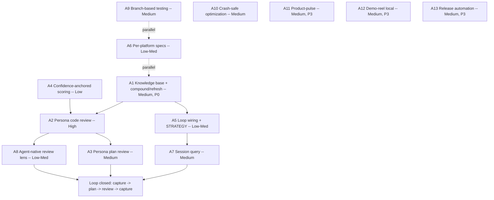

# Cross-Project Comparison: Nexus-Hub vs. Compound Engineering Plugin

**Version**: v2.3.0
**Generated**: 2026-05-30T00:00:00Z
**Analyzer**: Claude Code -- compare-project command
**External Source**: https://github.com/EveryInc/compound-engineering-plugin
**Source Type**: Repository

---

## Section 1: Executive Summary

The Compound Engineering plugin (CE, by Every Inc / Kieran Klaassen, MIT-licensed) is the closest structural analog to Nexus-Hub that has been compared to date: both are multi-platform AI-assistant harnesses that distribute skills, agents, and slash surfaces across Claude Code, Codex, Cursor, Copilot, Gemini, OpenCode, and more. CE is a marketplace repo shipping two plugins (the 37-skill / ~43-agent `compound-engineering` plugin and a small `coding-tutor` plugin), plus a TypeScript/bun converter CLI (`src/`) that translates the Claude plugin format into seven other target formats, and release automation via release-please. Its thesis is a single closed feedback loop: strategy -> ideate -> brainstorm -> plan -> work -> compound -> repeat, where the `compound` step writes documented solutions into `docs/solutions/` and the next iteration's planning reads them as grounding. The headline claim is leverage: 80% of the work is planning and review, 20% is execution, and each unit of work makes the next easier.

The comparison surfaced **13 adoption candidates** and confirmed that Nexus-Hub already covers most of CE's distribution, planning, testing, and onboarding surface. The genuine gaps cluster in three places: (1) CE has a categorized, searchable, refreshable **institutional-knowledge base** (`docs/solutions/` + `ce-compound` + `ce-compound-refresh`) that closes its loop, where Nexus-Hub has only the runtime-observation `continuous-learning` skill and the per-version `known-gaps-tracker`; (2) CE has a **multi-agent persona code-review pipeline** (14+ reviewer personas, 5-anchor confidence scoring, fingerprint dedup, cross-reviewer promotion, an independent validation pass, and four run modes) backed by a library of ~43 specialized agents, where Nexus-Hub has single-pass review skills plus the security-only parallel hunters in `run-penetration-test`; and (3) CE applies the same **persona fan-out to plans and requirements docs** (`ce-doc-review`) before any code is written, where Nexus-Hub has the read-only single-agent `cross-artifact-analyzer`.

**Overall recommendation: selectively adopt, skill-native first.** Every top-ranked candidate is pure catalog content (markdown skills + re-authored generic agents) or a local script that reuses the user's own model CLI and local session logs: zero new outbound calls, zero new credentials, zero new third-party data processors. The security delta concentrates entirely in CE's vendor-integrated convenience skills (`ce-gemini-imagegen`, `ce-slack-research`, `ce-proof`, `ce-riffrec-feedback-analysis`, `ce-test-xcode`), all of which fail the Nexus-Hub MCP Registry Policy and go to the Section 13 drop list. The top 3 P0/P1 items are the `docs/solutions/` knowledge base + a compound/refresh skill pair, a persona-fanout code-review pipeline with a re-authored generic agent set, and a persona plan-review skill. Do **not** import CE content verbatim (Reverse-Engineering Attribution Rule), do **not** adopt CE's "merge commands into skills" namespacing, and do **not** discard Nexus-Hub's 3-tier `summary_l0` / `overview_l1` frontmatter for CE's minimal frontmatter (Section 13, N8).

---

## Section 2: Project Profiles

| Attribute | Nexus-Hub | Compound Engineering plugin |
|---|---|---|
| Purpose | Broad upstream skill catalog for many agent platforms | Focused compounding-engineering methodology harness |
| Maturity | v2.3.0 released (2026-05-29) | Plugin v2.39.0+ (release-please managed; GitHub Releases canonical) |
| Scale | 227 skills, 40 commands, 22 hooks, 10 agents, 23 categories | 37 skills + ~43 agents (compound-engineering) + a `coding-tutor` plugin |
| Distribution | `scripts/installer.{sh,ps1}` + `scripts/lib/integrations/` Python registry (10 integrations) | Plugin marketplaces (Claude/Cursor/Codex) + a bun/TS converter CLI to opencode/pi/gemini/kiro/copilot/droid/qwen |
| Dependencies | Python (validators, scripts, MCP), optional node (extensions) | TypeScript/bun (converter + tests), Python (a few skill scripts), bash (skill scripts), release-please Action |
| License | repo LICENSE | MIT |
| Design philosophy | Progressive disclosure (3-tier loading), pushy descriptions, broad coverage, zero-outbound default | Closed compound loop, 80/20 plan-and-review-heavy, knowledge compounds via `docs/solutions/` |
| Contribution stance | Open catalog with strict registry/policy gates | Single-maintainer; no outside contributions merged (PRs reviewed by an agent, re-implemented if accepted) |
| Domain flavor | Language/framework/platform-agnostic | Ruby/Rails-leaning (DHH-style skill, Rails component enums in the solutions schema) |

The two projects are structurally parallel (both are cross-platform skill/agent harnesses) but make opposite bets on shape: Nexus-Hub is broad-and-flat (227 skills spanning compliance, security-ops, document generation, and language specialists that CE has no equivalent for), while CE is narrow-and-deep (a small skill set wired into one disciplined loop with a rich supporting agent library and an institutional-memory store).

---

## Section 3: Technology Stack Comparison

| Layer | Nexus-Hub | Compound Engineering plugin | Notes |
|---|---|---|---|
| Skill format | `SKILL.md` with `name` / `description` / `summary_l0` / `overview_l1`, 3-tier loading | `SKILL.md` with `name` / `description` / `argument-hint` only; commands merged into skills | NH frontmatter is richer and machine-indexed; CE is deliberately minimal |
| Catalog metadata | `data/skills.json`, `data/marketplace.json`, `data/SKILL_INDEX.md` (generated) + MCP `search_skills` | `.claude-plugin/`, `.cursor-plugin/`, `.agents/plugins/` marketplace.json per target | NH is machine-indexed for an MCP server; CE is filesystem-plus-manifest |
| Distribution code | Python integration registry + bash/PowerShell installers | TypeScript converter (`src/converters/`, `src/targets/`, `src/parsers/`) run via bun | Both cross-platform; CE is a clean per-target writer library, NH is a registry + dual installers |
| Reference convention | `references/` subdir, Tier-3 on-demand load | Backtick paths for on-demand, `@`-inline for small structural files (<150 lines) | Same tier-3 idea, different inclusion syntax |
| Hooks | 22 hook scripts, `.sh` + `.ps1` siblings | Minimal (session-history concept); no hook library | NH hook coverage is far deeper |
| Tests | pytest (`catalog/hooks/tests/`, `tests/`) + `skill-eval-loop` optimizer + eval fixtures | bun/TS suite (~60 files): converter correctness, frontmatter invariants, skill-shell-safety, per-skill behavior | Both strong; CE tests skill *contracts* heavily, NH tests hooks/validators/integrations + code-graph |
| Release | Manual via `update-version` / `version-upgrade` skills + Keep-a-Changelog | release-please (`googleapis/release-please-action`) + GitHub Releases canonical | CE automates version selection + changelog generation |
| Diagram convention | Mermaid (GitHub-native) | ASCII loop diagrams + Mermaid in some docs | Convention difference, not a gap |

---

## Section 4: AI Assistant Configuration Comparison

This is the highest-signal section for two skill harnesses.

**Skill / command / agent topology (direct divergence).** CE migrated all slash commands *into* skills (v2.39.0): every `/ce-*` slash command is a skill folder under `skills/`, prefixed `ce-` to avoid colliding with Claude Code's built-in `/plan` and `/review`. Nexus-Hub keeps the two surfaces separate: skills auto-trigger by description match (and via the MCP `search_skills` server), while `catalog/commands/*.md` are explicit slash entry points. CE's "everything is a `ce-` skill" model is simpler to reason about on platforms that lack a command surface, but it trades away the auto-trigger/explicit-invoke distinction Nexus-Hub relies on. This is a deliberate-difference, not a gap (Section 13, N8).

**Agent library (large gap).** CE ships ~43 specialized agents under `plugins/compound-engineering/agents/`, grouped (in the README) into Review (correctness, maintainability, security, performance, reliability, api-contract, data-migration, adversarial, testing, project-standards, agent-native, ...), Document Review (coherence, feasibility, product-lens, design-lens, security-lens, scope-guardian, adversarial-document), Research (best-practices, framework-docs, git-history, issue-intelligence, learnings, repo-research, session-historian, slack, web), Design (figma-sync, design-iterator, design-implementation), Workflow (pr-comment-resolver, spec-flow-analyzer), and Docs (ankane-readme-writer). Nexus-Hub ships 10 generic agents (architect, build-error-resolver, code-reviewer, doc-updater, harness-optimizer, loop-operator, planner, refactor-cleaner, security-reviewer, tdd-guide). CE's agents are the fuel for its review fan-out; Nexus-Hub's are general-purpose roles. The persona-agent concept is the single biggest configuration delta.

**Knowledge capture (the loop closer).** CE's `ce-compound` writes solved problems into `docs/solutions/<category>/<slug>.md` with a typed YAML frontmatter (bug track vs knowledge track), then runs a "Discoverability Check" that edits the project's `AGENTS.md`/`CLAUDE.md` so future agents learn the store exists and how to search it. `ce-compound-refresh` maintains the store over time (Keep / Update / Consolidate / Replace / Delete). The store is read back as grounding by `ce-brainstorm`, `ce-plan`, and the `ce-learnings-researcher` agent (which is an always-on reviewer in `ce-code-review`). Nexus-Hub has adjacent pieces (`continuous-learning` mints `.nexus/instincts/*.yaml` from runtime observations; `known-gaps-tracker` tracks per-version gaps; `devlog-generation` records history) but no categorized, searchable, refreshable solved-problems store wired into planning.

| Config dimension | Nexus-Hub | Compound Engineering | Classification |
|---|---|---|---|
| Skill vs command surface | Separate (auto-trigger skills + slash commands) | Unified (`ce-` skills are the commands) | Both present, different approach |
| Agent library | 10 generic role agents | ~43 specialized persona agents | External-only (adoption candidate) |
| Knowledge base | `continuous-learning` instincts + `known-gaps-tracker` | `docs/solutions/` + `ce-compound` + `ce-compound-refresh` | External has structured store (adopt) |
| Skill frontmatter | `summary_l0` + `overview_l1` (3-tier, MCP-indexed) | `name` + `description` + `argument-hint` (minimal) | NH richer; do not regress (N8) |
| Multi-mode skills | Implicit per-skill | Explicit interactive / autofix / report-only / headless modes | External-only pattern (adopt for review/compound) |
| Platform-interaction guidance | Per-skill | Centralized in plugin `AGENTS.md` (blocking-question tool, subagent dispatch, shell-safety, `!` pre-resolution) | External has a richer authoring rulebook |

---

## Section 5: Skills and Capabilities Gap Analysis

### 5a. Present in Compound Engineering, Missing or Weaker in Nexus-Hub (adoption candidates)

- **`docs/solutions/` knowledge base + `ce-compound` + `ce-compound-refresh`** (`plugins/compound-engineering/skills/ce-compound/SKILL.md`, `ce-compound-refresh/SKILL.md`, `references/schema.yaml`, `references/yaml-schema.md`, `scripts/validate-frontmatter.py`). A categorized institutional-memory store with a typed two-track frontmatter (bug track: symptoms / root_cause / resolution_type; knowledge track: applies_when), 16 auto-detected categories, parallel research subagents (Context Analyzer / Solution Extractor / Related Docs Finder), 5-dimension overlap scoring that decides update-vs-create, a Discoverability Check that edits `AGENTS.md`/`CLAUDE.md`, a stdlib-only parser-safety validator, and a refresh lifecycle. Nexus-Hub's nearest equivalents (`continuous-learning`, `known-gaps-tracker`, `devlog-generation`) are runtime-observation or per-version-gap oriented, not a durable searchable solved-problems corpus. **Gap confirmed. The headline candidate.**

- **Multi-agent persona code review (`ce-code-review`)** (`skills/ce-code-review/SKILL.md` + `references/{persona-catalog,findings-schema.json,subagent-template,validator-template,review-output-template}.md`). 14+ reviewer personas selected per-diff (4 always-on + 2 CE always-on + cross-cutting/stack-specific conditionals), structured JSON findings, a 5-anchor confidence scale (0/25/50/75/100), fingerprint dedup with cross-reviewer agreement promotion, a late confidence gate, `autofix_class` routing (safe_auto / gated_auto / manual / advisory), an independent per-finding validation pass, model tiering (high-stakes reviewers inherit the session model, others run mid-tier), and four modes (interactive / autofix / report-only / headless). Nexus-Hub has `run-penetration-test` (5-6 parallel *security* hunters), `review-codebase`, `run-deep-review` (orchestrator), and the `code-review` skill, but no general persona-fanout review with the confidence/dedup/validation pipeline. **Gap confirmed.**

- **`ce-doc-review` persona review of plans/requirements** (`skills/ce-doc-review/SKILL.md`). Parallel persona lenses (coherence, feasibility, product-lens, design-lens, security-lens, scope-guardian, adversarial-document) applied to a requirements or plan doc *before* code. Nexus-Hub has the read-only single-agent `cross-artifact-analyzer` and `analyze-spec`, but not a parallel persona-lens plan review. **Gap confirmed.**

- **Explicit closed compound loop + `ce-strategy` anchor** (`README.md` loop diagram, `skills/ce-strategy/SKILL.md`). CE wires its skills into one documented loop with a return arrow: `ce-compound` output feeds the next `ce-brainstorm` / `ce-plan`, and `STRATEGY.md` (target problem / approach / persona / metrics / tracks) anchors it upstream. Nexus-Hub has every piece (`project-constitution`, `idea-refine`, `spec-driven-development`, `generate-plan`, `implement-phase`, `continuous-learning`) but they are not wired into a documented loop where captured knowledge feeds planning. **Partial / wiring gap.**

- **Confidence-anchored scoring discipline** (`skills/ce-code-review/SKILL.md` Stage 5, `docs/solutions/skill-design/confidence-anchored-scoring-2026-04-21.md`). Discrete 5-value confidence anchors with behavioral definitions, cross-reviewer corroboration promotion, mode-aware demotion of weak general-quality findings, and a deliberately-late confidence gate. Nexus-Hub review skills do not use discrete confidence anchors or a cross-reviewer promotion rule. **Pattern gap.**

- **`ce-sessions` + `ce-session-historian` cross-tool session query** (`skills/ce-sessions/SKILL.md` + `scripts/{discover-sessions.sh,extract-errors.py,extract-metadata.py,extract-skeleton.py}`). Query Claude Code / Codex / Cursor JSONL session logs for prior investigation context, using bundled extraction scripts (script-first architecture). Nexus-Hub has `session-history` / `generate-session-history` (documentation/generation) but no query layer across multiple tools' local session logs. **Partial gap.**

- **Per-platform capability spec docs** (`docs/specs/{claude-code,codex,cursor,gemini,copilot,kiro,opencode}.md`). One reference doc per target documenting its plugin/skill/agent/hook capabilities and quirks. Nexus-Hub encodes this knowledge in integration subclasses + the AGENTS.md platform-coverage table but ships no dedicated per-platform capability reference. **Gap, low-medium value.**

- **Agent-native architecture lens** (`skills/ce-agent-native-architecture/SKILL.md` + 15 references; `agents/ce-agent-native-reviewer.md`; `skills/ce-agent-native-audit/SKILL.md`). A skill teaching prompt-native feature design and an always-on reviewer that verifies new features are agent-accessible (action + context parity). Nexus-Hub has `tool-design` and `ai-agent-development` but no review lens that checks whether shipped features are reachable by an agent. **Partial gap.**

- **`ce-demo-reel` visual PR evidence** (`skills/ce-demo-reel/SKILL.md` + `scripts/capture-demo.py`, project-type-aware tiers). Capture GIF / terminal recording / screenshots for PR descriptions, with a strict separation from test output. Nexus-Hub has no PR-demo capability. **Gap, medium value.**

- **`ce-product-pulse` product-outcome report** (`skills/ce-product-pulse/SKILL.md`). A time-windowed read-side report on usage / performance / errors / followups, saved to `docs/pulse-reports/` as a browseable timeline. Domain-specific (needs product telemetry). Nexus-Hub has nothing equivalent. **Gap, lower value for a catalog repo.**

- **`ce-optimize` general optimization loop + persistence discipline** (`skills/ce-optimize/SKILL.md` + 7 references + 3 scripts). Metric-driven iterative optimization with parallel worktree experiments, hard gates + LLM-as-judge three-tier evaluation, mandatory write-then-verify disk checkpoints (CP-0..CP-5), and crash-safe resume. Nexus-Hub's `skill-eval-loop` shares the harness DNA but is scoped to optimizing skill descriptions, not arbitrary measurable outcomes. The **crash-safe experiment-log persistence discipline** is the borrowable piece. **Partial / pattern gap.**

- **release-please-style release automation** (`.github/release-please-config.json`, `.release-please-manifest.json`, `scripts/release/{preview,sync-metadata,validate}.ts`). Conventional-commit-driven version selection + changelog + manifest parity validation. Nexus-Hub does this manually via `update-version` / `version-upgrade`. **Gap, medium value (security note in Section 9).**

- **Branch-based plugin testing** (`README.md` Local Development; `src/commands/plugin-path.ts`). `--branch` install and `plugin-path` resolve a deterministic cache clone so a pushed branch can be tested without switching checkouts. Nexus-Hub's installer has no branch-test affordance. **Gap, low-medium value.**

### 5b. Present in Nexus-Hub, Missing in Compound Engineering (strengths to preserve)

- 227 skills across 23 categories vs 37. Entire domains have no CE equivalent: compliance (GDPR/SOC2/ISO/PCI/NIST), security-operations DFIR/threat-hunting, language specialists (10), framework specialists (6), infrastructure (20+), document generation (.docx/.pptx/.xlsx/.pdf), and generative art.
- A machine-readable catalog (`data/skills.json`, `data/SKILL_INDEX.md`) plus an MCP `search_skills` server and a 3-tier loading model with explicit token budgeting. CE's frontmatter is minimal and the filesystem is the catalog.
- 22 hooks including `secret-scan.sh`, `git-guardrails.sh`, `large-file-guard.sh`, `scan_supply_chain_iocs`, `validate_unicode_safety`, and per-CLI diff-review hooks, all with `.sh` + `.ps1` siblings. CE has effectively no hook library.
- A strict MCP Registry Policy / zero-outbound default + reverse-engineering-first discipline + optional security-framework mapping (MITRE ATT&CK / D3FEND / NIST CSF). CE freely ships vendor-integrated skills.
- A 10-integration installer registry with idempotency, drift detection, `doctor` / `repair` / `list-installed` lifecycle, and a 50-case contract suite.
- Code-graph semantic search with tree-sitter extractors for Python / TypeScript / Go / Rust / Java / C#.
- 40 slash commands and a dedicated `tdd` command + `tdd-guide` agent.

### 5c. Present in Both, Quality Comparison

- **Planning.** Nexus-Hub `generate-plan` / `implementation-plan` / `plan-before-code` vs CE `ce-plan` (U-IDs, test scenarios, automatic confidence check, "WHAT decisions not HOW code"). Both strong; CE's plan/work separation and built-in confidence check are notable.
- **Optimization.** Nexus-Hub `skill-eval-loop` (description optimizer, train/test split, grading subagents, browser viewer) vs CE `ce-optimize` (general metric-driven loop, parallel worktree experiments, LLM-as-judge, crash-safe persistence). Different focus; CE's is more general-purpose and crash-hardened.
- **TDD.** Nexus-Hub `test-driven-development` + `tdd` command + `tdd-guide` agent vs CE (no dedicated TDD skill; quality gates live in `ce-work`/`ce-code-review`). Nexus-Hub is stronger here.
- **Worktrees.** Nexus-Hub `using-git-worktrees` (adopted from superpowers in v2.3.0) vs CE `ce-worktree` (`.worktrees/<branch>`, `.env` copy, branch-aware dev-tool trust, gitignore management). Both present, comparable.
- **Commit / PR workflow.** Nexus-Hub `code-commit-workflow` + `pr-description-writer` vs CE `ce-commit` + `ce-commit-push-pr` + `ce-resolve-pr-feedback` (parallel feedback resolution, adaptive descriptions). CE's PR-feedback resolution is richer.
- **Setup / onboarding.** Nexus-Hub `setup-project` + installer `doctor`/`repair` vs CE `ce-setup` (diagnose env + install missing tools + bootstrap config in one interactive flow). Comparable.

---

## Section 6: Commands and Automation Comparison

### 6a. Commands Gap

CE has no separate command surface: its ~37 `ce-` skills are the slash commands. Nexus-Hub ships 40 distinct slash commands plus 227 skills. The functional commands CE exposes that Nexus-Hub lacks an exact analog for are `ce-compound` (knowledge capture), `ce-code-review` (persona fanout), `ce-doc-review` (plan persona review), `ce-product-pulse`, and `ce-demo-reel`. Conversely Nexus-Hub exposes large command families CE has nothing comparable to (`run-deep-review`, `run-penetration-test`, `run-security-audit`, `generate-sbom`, `compile-deep-research`, `refactor-docs`, `refactor-project`, the document generators).

### 6b. CI/CD and Hooks Gap

CE runs GitHub Actions (`ci.yml`, `deploy-docs.yml`, `release-pr.yml`, `release-preview.yml`) and uses release-please for version/changelog automation; its in-product hook surface is minimal. Nexus-Hub has a 22-hook library (with `.sh`/`.ps1` parity) plus `make validate` / `make lint` / `make test` and four standalone CI validators, but manual release management. The two automation gaps are **release automation** (CE has it; adoption candidate A13) and **a hook library** (Nexus-Hub has it; nothing to adopt).

---

## Section 7: Documentation and Developer Experience Comparison

CE's documentation is unusually rich and is itself part of the product: `docs/solutions/` (the institutional-knowledge store, organized into best-practices / developer-experience / integrations / skill-design / workflow), `docs/brainstorms/` (requirements docs), `docs/plans/` (decision artifacts), `docs/skills/` (user-facing skill docs separate from runtime `SKILL.md`), and `docs/specs/` (per-platform capability references). The `docs/solutions/skill-design/` subtree alone is a captured-learnings corpus on skill authoring (script-first architecture, beta-skills framework, confidence-anchored scoring, "git-workflow skills need explicit state machines", "pass paths not content to subagents").

Nexus-Hub's documentation is version-organized (`docs/versions/<vMAJOR>/<vSEMVER>/`, RELEASE_NOTES, CHANGELOG, DEVLOG, `guides/`, per-version plans and known-gaps). It is excellent for release traceability but does not maintain a cross-version, problem-indexed knowledge store.

Developer experience is comparable: CE has `ce-setup`, shell aliases, `--plugin-dir` local dev, and `--branch` pushed-branch testing; Nexus-Hub has `setup-project`, installer `doctor`/`repair`/`list-installed`, and the `consult` advisor. The two DX gaps worth noting are CE's branch-based testing (A9) and the per-platform spec docs (A6).

---

## Section 8: Testing and Security Posture Comparison

**Testing.** CE's bun/TS suite (~60 files) is heavily weighted toward converter correctness (`*-converter.test.ts`, `*-writer.test.ts`), skill-contract invariants (`frontmatter.test.ts`, `frontmatter-validator.test.ts`, `skill-agent-ce-prefix.test.ts`, `skill-shell-safety.test.ts`), and per-skill behavior (`tests/skills/*`). Nexus-Hub's pytest suite covers hooks, validators, the 50-case integration contract, and code-graph extractor recall, plus the `skill-eval-loop` empirical description optimizer. CE's skill-shell-safety tests (enforcing `!` pre-resolution syntax constraints and no-action-chaining) are a discipline Nexus-Hub could borrow but are tightly coupled to Claude Code's safety checker.

**Security.** CE ships `SECURITY.md`, `PRIVACY.md`, a `secrets.ts` util, and path-sanitization / manifest-path-safety tests, but it freely integrates external services in skills (Gemini API, Slack, the Proof editor, Riffrec, XcodeBuildMCP). Nexus-Hub's posture is materially more conservative: a strict MCP Registry Policy, a zero-outbound default, a supply-chain-IOC validator, secret-scan and git-guardrail hooks, and a reverse-engineering-first decision tree. This difference is the entire substance of Section 9: CE's vendor-integrated skills are exactly the items the Nexus-Hub policy drops.

---

## Section 9: Security and Risk Assessment

This section gates Section 11. It evaluates every Section 5a candidate against the `AGENTS.md` MCP Registry Policy decision tree before any adoption is recommended.

### 9.1 Threat Model Comparison

| Dimension | Nexus-Hub | Compound Engineering plugin | Adoption delta |
|---|---|---|---|
| New runtime dependencies | Python, optional node | bun/TS toolchain, Python (some skills), release-please Action | None for skill-native items; release-please adds a GitHub Action (A13) |
| Outbound destinations at runtime | None by default | Gemini API (imagegen), Slack API, Proof API, Riffrec, GitHub (gh) | All outbound surfaces are in dropped skills; adopted set is zero-outbound |
| Credentials / API keys required | None | GEMINI_API_KEY, Slack token, Proof auth (in respective skills) | None introduced by the adopted set |
| Source code / prompts leave the machine | No | Yes, for the vendor-integrated skills (image prompts, Slack queries, Proof docs) | No, for the adopted set |
| New commercial relationship required | No | Google AI (Gemini), Slack, Proof/Every for the respective skills | No, for the adopted set |

The adopted set (everything except the Section 13 drops) introduces no new outbound call, no new credential, and no new third-party data processor. The entire data-flow risk lives in the dropped vendor-integrated skills.

### 9.2 Per-Item Risk Scorecard

| Item | Risk tier | Justification |
|---|---|---|
| A1 `docs/solutions/` knowledge base + compound/refresh | None | Local markdown + a stdlib Python validator; reads/writes only the project tree |
| A2 Persona code-review pipeline + agent library | None | Local model/agent orchestration over the local diff; read-only persona agents |
| A3 Persona plan/doc review | None | Same as A2, scoped to a local plan/spec file |
| A4 Confidence-anchored scoring discipline | None | A scoring/dedup rule applied in-skill; no external surface |
| A5 Compound-loop wiring + STRATEGY anchor | None | Documentation + cross-links + one local strategy doc |
| A6 Per-platform capability spec docs | None | Static reference docs |
| A7 `ce-sessions`-style session query | None | Local extraction scripts over the user's local session JSONL; zero outbound |
| A8 Agent-native review lens | None | Review persona + skill prose |
| A9 Branch-based plugin testing | Low | Local `git clone` of a branch the user already trusts; no new service |
| A10 Crash-safe optimization persistence | None | Local worktrees + disk checkpoints; uses the user's own model |
| A11 Product-pulse report skill | Low | Reads the user's own telemetry/logs; no new processor introduced by the skill |
| A12 Demo-reel local capture | Low | Drives locally-installed capture tools; the upstream upload step is dropped (local-save only) |
| A13 Release automation | Medium | Introduces `googleapis/release-please-action` running in CI with a write-scoped token |

No item scores High. A13 is the only Medium and is gated on the 9.3 viability analysis below.

### 9.3 Reverse-Engineering Viability Analysis

| Item | Classification | Internal deliverable | Effort | Rationale |
|---|---|---|---|---|
| A1 Knowledge base + compound/refresh | skill-native | `solution-knowledge-base` + `solution-refresh` skills + re-authored `references/schema.md` + a stdlib frontmatter validator | Medium | Pure agent-orchestration + markdown; re-author the two-track schema generically (strip Rails-specific component enums) per the Attribution Rule |
| A2 Persona code review | skill-native | New persona-fanout review command/skill + a re-authored generic persona agent set (correctness/maintainability/security/performance/reliability/api-contract/adversarial/testing/standards) | High | All local LLM orchestration; reuse NH's existing 10 agents where they map, add new generic personas |
| A3 Persona plan review | skill-native | New plan-review skill reusing the A2 persona set + plan-specific lenses | Medium | Achievable by instructing the agent's own LLM; no external dependency |
| A4 Confidence-anchored scoring | skill-native | Pattern reference applied to A2/A3 and existing `code-review` / `run-penetration-test` synthesis | Low | A scoring/dedup/gate rule; no code beyond prose |
| A5 Loop wiring + STRATEGY | skill-native | Extend `project-constitution` (or a new `product-strategy` skill) + cross-link `generate-plan`/`implement-phase`/`continuous-learning` to read the knowledge base | Low-Medium | Documentation and cross-links only |
| A6 Per-platform capability specs | re-full | `docs/specs/<platform>.md` (or per-integration `references/`) derived from existing integration subclass knowledge | Low-Medium | Fully reconstructable locally from the integration registry |
| A7 Session query | skill-native | New `session-query` skill + local extraction scripts (`.py` + `.ps1` siblings) over local JSONL | Medium | Reverse-engineer the script-first extraction; all data is local |
| A8 Agent-native review lens | skill-native | New review persona + extend `tool-design` | Low-Medium | Prose + a persona agent |
| A9 Branch-based testing | re-full | Installer `--branch` flag (bash + PowerShell) that clones to a deterministic cache path | Medium | Standard `git clone`; rebuild locally in both installers |
| A10 Crash-safe optimization | skill-native | Borrow the write-then-verify checkpoint discipline into `skill-eval-loop` (or a general `optimize` skill) | Medium | Local disk discipline; uses the user's own model |
| A11 Product-pulse | skill-native | A `product-pulse` skill template that reads user-supplied log/telemetry sources | Medium | LLM-native report generation over local data |
| A12 Demo-reel | re-partial | A `demo-capture` skill driving locally-installed asciinema/ffmpeg/headless-browser, writing local artifacts only | Medium | Local capture is reproducible; drop the upstream upload/approval step (vendor surface) |
| A13 Release automation | re-partial | A local conventional-commit changelog/version script (extend `update-version`/`generate-changelog`) instead of the release-please Action | Medium | The changelog/version logic is fully local; the GitHub Action is the only vendor piece and is replaceable |

### 9.4 Recommendation Ordering

1. **skill-native (ship first):** A1, A2, A3, A4, A5, A7, A8, A10, A11.
2. **re-full / re-partial (build internal):** A6, A9 (re-full); A12, A13 (re-partial).
3. **vendor-intrinsic (only if all three conditions hold):** none. The release-please *Action* would be the only candidate, but A13's local-script alternative removes the need, so no vendor-intrinsic adoption is recommended.
4. **drop-outright (Section 13):** `ce-gemini-imagegen`, `ce-slack-research`/`ce-slack-researcher`, `ce-proof`, `ce-riffrec-feedback-analysis`, `ce-test-xcode`, `ce-dhh-rails-style`, the `coding-tutor` plugin.

Section 11 organizes the adoption plan within this ordering; the P-tiers operate inside each RE bucket, not across it.

---

## Section 10: Structural and Architectural Differences

- **Loop vs catalog.** CE is organized around one closed loop; Nexus-Hub is organized as a flat, categorized catalog. Adopting A1+A5 imports the loop's *closer* (knowledge capture feeding planning) without forcing Nexus-Hub to reshape its catalog.
- **Skill = command.** CE's unified surface is simpler on command-less platforms but loses the auto-trigger/explicit-invoke distinction. Nexus-Hub should keep its separation (N8).
- **Converter vs registry.** CE's `src/` is a clean per-target writer library invoked by a single bun CLI; Nexus-Hub's distribution is a Python integration registry plus dual installers. Both are sound; no adoption is recommended (rewriting would be churn with no data-flow benefit).
- **Authoring rulebook.** CE concentrates cross-platform authoring rules (blocking-question tool, subagent dispatch, shell-safety, `!` pre-resolution constraints, reference-inclusion syntax) in its plugin `AGENTS.md`. Nexus-Hub's equivalents are spread across `AGENTS.md` + per-skill convention; CE's consolidated rulebook is a useful model but not a discrete adoption item.
- **Single-maintainer cadence.** CE's "no outside contributions" stance and release-please automation are coupled; Nexus-Hub's open-catalog model and manual releases are a different operating point. Adopt the automation pattern (A13) without the contribution stance.

---

## Section 11: Adoption Plan

Organized per Section 9.4 (skill-native, then re-full/re-partial), with P-tiers inside each bucket. Each item: What | Source | Target | Effort | Dependencies | Risk.

### Bucket 1: skill-native

| Item | What | Source | Target | Effort | Dependencies | Risk |
|---|---|---|---|---|---|---|
| A1 (P0) | Solved-problems knowledge base + capture/refresh skills | `ce-compound`, `ce-compound-refresh`, `references/{schema,yaml-schema}` | New `catalog/skills/workflow/solution-knowledge-base/` + `solution-refresh/` (+ generic `references/schema.md`, frontmatter validator) | Medium | None | None |
| A2 (P1) | Persona-fanout code review with confidence/dedup/validation pipeline | `ce-code-review` + `references/*` + review persona agents | New review command/skill + re-authored generic persona agents under `catalog/agents/` | High | A4 | None |
| A3 (P1) | Persona review of plans/requirements docs | `ce-doc-review` + document-review personas | New plan-review skill reusing A2 personas + plan lenses | Medium | A2 | None |
| A4 (P1) | Confidence-anchored scoring + dedup + cross-reviewer promotion + validation pass | `ce-code-review` Stage 5, `confidence-anchored-scoring` solution | Apply to A2/A3 + existing `code-review` / `run-penetration-test` synthesis | Low | None | None |
| A5 (P1) | Compound-loop wiring + STRATEGY anchor | `README` loop, `ce-strategy` | Extend `project-constitution` (or new `product-strategy` skill); cross-link `generate-plan`/`implement-phase`/`continuous-learning` to read A1 | Low-Medium | A1 | None |
| A7 (P2) | Cross-tool session-history query | `ce-sessions` + extraction scripts | New `session-query` skill + local `.py`/`.ps1` extraction scripts | Medium | None | None |
| A8 (P2) | Agent-native review lens | `ce-agent-native-architecture`, `ce-agent-native-reviewer` | New review persona + extend `tool-design` | Low-Medium | A2 | None |
| A10 (P2) | Crash-safe optimization persistence discipline | `ce-optimize` Persistence Discipline | Borrow write-then-verify checkpoints into `skill-eval-loop` | Medium | None | None |
| A11 (P3) | Product-outcome pulse report | `ce-product-pulse` | New `product-pulse` skill template (reads user-supplied telemetry) | Medium | None | Low |

### Bucket 2: re-full / re-partial

| Item | What | Source | Target | Effort | Dependencies | Risk |
|---|---|---|---|---|---|---|
| A6 (P1) | Per-platform capability spec docs | `docs/specs/*` | `docs/specs/<platform>.md` derived from the integration registry | Low-Medium | None | None |
| A9 (P2) | Branch-based plugin/skill testing | `--branch`, `plugin-path.ts` | Installer `--branch` flag (bash + PowerShell), deterministic cache clone | Medium | None | Low |
| A12 (P3) | Local PR demo-reel capture (local-save only) | `ce-demo-reel` + `capture-demo.py` | New `demo-capture` skill driving local capture tools; no upload | Medium | None | Low |
| A13 (P3) | Conventional-commit release automation (local script) | release-please config + `scripts/release/*.ts` | Extend `update-version`/`generate-changelog` with a local version/changelog script | Medium | None | Medium |

### Bucket 3: vendor-intrinsic

None recommended (see Section 9.4).

---

## Section 12: Implementation Sequence

Sequenced RE-first (Section 9.4), then by dependency and P-tier.

Recommended order:

1. **A1** (P0) and **A4** (P1, low effort) first; A4 is a prerequisite for A2 and A1 is the loop closer everything else benefits from. A6 can proceed in parallel (independent).
2. **A2** (persona code review) once A1 + A4 land, then **A3** and **A8** which reuse the persona set.
3. **A5** (loop wiring) once A1 exists so planning skills can read the knowledge base; **A7** (session query) after.
4. **A9, A10** as independent medium-effort items.
5. **A11, A12, A13** (P3 backlog) last.

---

## Section 13: Risks and Considerations

- **Scope discipline.** The persona-review pipeline (A2) is High effort and pulls in a sizeable agent library. Re-author personas generically rather than importing CE's Ruby/Rails-flavored set (`ce-julik-frontend-races-reviewer`, `ce-swift-ios-reviewer`, `ce-dhh-rails-style`); keep only language-agnostic personas plus any that map to Nexus-Hub's existing domains.
- **Knowledge-base schema portability.** CE's solution schema hardcodes Rails component enums (`rails_model`, `hotwire_turbo`, `brief_system`). Re-author the schema with generic component values before adopting A1.
- **Convention conflicts.** Do not adopt CE's reference-inclusion syntax (`@`-inline / backtick-path) wholesale; Nexus-Hub already has a `references/` + Tier-3 convention. Map CE patterns onto the existing convention.
- **Discoverability-check edits.** A1's instruction-file edit (CE writes a `docs/solutions/` pointer into `AGENTS.md`/`CLAUDE.md`) must respect Nexus-Hub's marker-block / `merge_marker_section` discipline so it does not clobber managed content.
- **Cross-platform parity.** Any script shipped by A7 / A9 / A12 must include `.ps1` siblings per the AGENTS.md hook/script parity rule, and A9/A13 installer changes must be applied to both `installer.sh` and `installer.ps1`.

### Items explicitly NOT recommended for adoption (security / policy reasons)

- **N1: `ce-gemini-imagegen`** (`skills/ce-gemini-imagegen/`). Routes image prompts to Google's Gemini image API. **generation-as-service**, an explicit Hard-No under the MCP Registry Policy. Nexus-Hub already covers the capability LLM-natively via `creative-generation` / `ui-component-generation`. **Drop-outright.**
- **N2: `ce-slack-research` + `ce-slack-researcher`** (`skills/ce-slack-research/`, `agents/ce-slack-researcher.md`). Sends query text to the Slack API and requires a Slack token. **search-as-service over a vendor**; introduces an outbound call and a credential. Defer to a user-supplied Slack MCP rather than shipping it. **Drop-outright** from the catalog.
- **N3: `ce-proof`** (`skills/ce-proof/`). Integrates the Proof collaborative editor (Every's own product). **vendor-intrinsic to Every**, irrelevant to Nexus-Hub users, requires Proof auth. **Drop-outright.**
- **N4: `ce-riffrec-feedback-analysis`** (`skills/ce-riffrec-feedback-analysis/`). Depends on the third-party Riffrec tool/format. Vendor-specific, niche. **Drop-outright.**
- **N5: `ce-test-xcode`** (`skills/ce-test-xcode/`). Requires the external XcodeBuildMCP server and macOS/Xcode. Platform-niche and pulls in an external MCP; Nexus-Hub already has `ios-development`. **Drop-outright** (revisit only if an iOS-testing skill is independently scoped).
- **N6: `ce-dhh-rails-style`** (`skills/ce-dhh-rails-style/`). Opinionated Ruby/Rails-in-DHH-style guidance. Not a security risk, but out of scope for Nexus-Hub's language-agnostic posture and duplicative of `rust-expert`/`python-expert`-style coverage without a Rails specialist. **Not recommended (scope).**
- **N7: `coding-tutor` plugin** (`plugins/coding-tutor/`). A separate product (teach-me / quiz-me / tutorials). Different domain from Nexus-Hub. **Not recommended (scope).**
- **N8: CE's "minimal frontmatter" + "merge commands into skills" conventions.** Adopting CE's minimal `name`/`description`-only frontmatter would regress Nexus-Hub's 3-tier loading (`summary_l0`/`overview_l1`) and break the MCP `search_skills` index; merging commands into skills would erase the auto-trigger/explicit-invoke distinction. **Not recommended (deliberate divergence).**

---

## Appendix: Sources

- External README and component reference: `README.md`, `plugins/compound-engineering/README.md`, `docs/skills/README.md`.
- Knowledge capture: `plugins/compound-engineering/skills/ce-compound/SKILL.md`, `ce-compound-refresh/SKILL.md`, `references/yaml-schema.md`.
- Persona review: `plugins/compound-engineering/skills/ce-code-review/SKILL.md` + `references/*`; `agents/ce-*.md`.
- Optimization: `plugins/compound-engineering/skills/ce-optimize/SKILL.md`.
- Conventions: `plugins/compound-engineering/AGENTS.md`; `docs/solutions/skill-design/script-first-skill-architecture.md`.
- Nexus-Hub side: `AGENTS.md` (MCP Registry Policy), `data/SKILL_INDEX.md`, `catalog/agents/`, `CHANGELOG.md` (v2.3.0).
