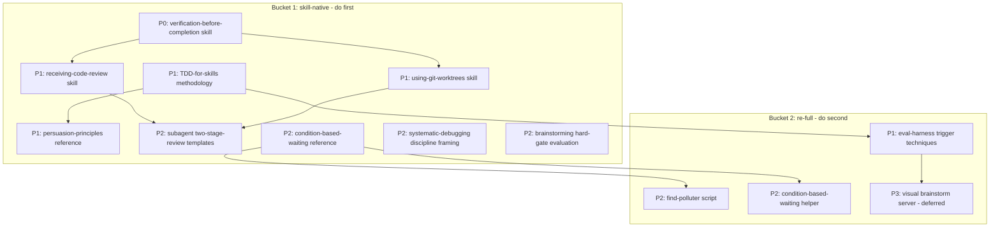

# Cross-Project Comparison: Nexus-Hub vs. Superpowers

**Version**: v2.3.0
**Generated**: 2026-05-27T00:00:00Z
**Analyzer**: Claude Code -- compare-project command
**External Source**: https://github.com/obra/superpowers
**Source Type**: Repository

---

## Section 1: Executive Summary

Superpowers (by Jesse Vincent / Prime Radiant, MIT-licensed, plugin version 5.1.0) is a zero-dependency, 14-skill process-discipline harness that installs into Claude Code, Codex, Cursor, OpenCode, Gemini CLI, Factory Droid, and Copilot CLI. Its thesis ("code like a senior dev") is narrow and deep: enforce brainstorming before code, isolated worktrees, TDD with red-green-refactor, systematic debugging, subagent-driven execution, code review, and evidence-before-completion verification, all auto-triggered at session start. Nexus-Hub is the inverse shape: a broad 207-skill, 40-command, 22-hook, 10-agent catalog spanning 22 categories. The two overlap heavily in the workflow and orchestration domains, which is exactly where the high-signal findings sit.

The comparison surfaced **11 adoption candidates** and confirmed Nexus-Hub already covers roughly 16 of 20 probed superpowers capabilities. The genuine gaps are concentrated in **discipline-enforcing skills** (skills that fire a hard gate and resist rationalization) rather than capability skills: Nexus-Hub has no standalone `verification-before-completion` skill, no `receiving-code-review` (anti-sycophancy) skill, no `using-git-worktrees` skill, and no research-backed skill-authoring testing methodology (baseline-failure-first + pressure scenarios). Superpowers also adds two concrete eval techniques Nexus-Hub's already-strong `skill-eval-loop` lacks: premature-action detection and multi-turn / cheap-model trigger testing.

**Overall recommendation: selectively adopt, skill-native first.** The security delta is effectively nil because superpowers is zero-dependency and every top-ranked candidate is pure catalog content (markdown) or a local script that reuses the user's existing model CLI. There are no new outbound calls, no new credentials, and no new third-party data processors anywhere in the adoption set. The top 3 P0/P1 items are a `verification-before-completion` discipline skill, a `receiving-code-review` discipline skill, and a `using-git-worktrees` skill, all `skill-native`. Do **not** import superpowers content verbatim, and do **not** replace Nexus-Hub's "pushy description" convention wholesale with superpowers' "WHEN-only" rule (Section 13, N1 / N2).

---

## Section 2: Project Profiles

| Attribute | Nexus-Hub | Superpowers |
|---|---|---|
| Purpose | Broad upstream skill catalog for many agent platforms | Focused software-development methodology harness |
| Maturity | v2.2.0 released, v2.3.0 in progress | Plugin v5.1.0 |
| Scale | 207 skills, 40 commands, 22 hooks, 10 agents, 22 categories | 14 skills, 1 session-start hook, 0 commands |
| Distribution | `scripts/installer.{sh,ps1}` + `scripts/lib/integrations/` registry (10 integrations) | Per-harness plugin marketplaces + `.claude-plugin` / `.codex-plugin` / `.cursor-plugin` / `.opencode` manifests |
| Dependencies | Python (validators/scripts), optional node (extensions) | Zero runtime dependencies (node only for the optional visual brainstorm server) |
| License | (repo LICENSE) | MIT |
| Design philosophy | Progressive disclosure (3-tier loading), pushy descriptions, broad coverage | Discipline enforcement, auto-trigger via SessionStart bootstrap, narrow + bulletproof |
| Authoring stance | "Combat under-triggering" with trigger phrases + SKIP clauses in description | "Description = WHEN only, never summarize workflow"; TDD-for-skills with eval evidence |

The two projects are complementary in scope but make a direct, evidence-backed disagreement about how to write a skill's `description` field (Section 4 and Section 13, N1).

---

## Section 3: Technology Stack Comparison

| Layer | Nexus-Hub | Superpowers | Notes |
|---|---|---|---|
| Skill format | `SKILL.md` with `name` / `description` / `summary_l0` / `overview_l1` frontmatter, 3-tier loading | `SKILL.md` with only `name` / `description` (max 1024 chars), flat namespace | Nexus-Hub frontmatter is richer; superpowers is deliberately minimal |
| Catalog metadata | `data/skills.json`, `data/marketplace.json`, `data/SKILL_INDEX.md` (generated) | None (filesystem is the catalog) | Nexus-Hub is machine-indexed for its MCP server |
| Distribution code | Python integration registry + bash/PowerShell installers | Shell + per-harness plugin manifests + one OpenCode JS plugin | Both cross-platform; different mechanisms |
| Hooks | 22 hook scripts, `.sh` + `.ps1` siblings | 1 SessionStart hook via a single polyglot `.cmd` wrapper | See Section 6b |
| Bundled scripts | Per-skill `scripts/` + repo-level `scripts/` (Python) | Per-skill bundled scripts (`.cjs`, `.sh`, `.ts`, `.js`, `.dot`) | Same tier-3 idea |
| Test harness | pytest (`catalog/hooks/tests/`, `tests/`) + `skill-eval-loop` description optimizer | Bash harnesses that drive `claude -p` and grep stream-json + node test suites | See Section 8 |
| Diagram convention | Mermaid (GitHub-native) | Graphviz `.dot` (rendered via `render-graphs.js`) | Convention difference, not a gap |

---

## Section 4: AI Assistant Configuration Comparison

This is the highest-signal section for two skill harnesses.

**Bootstrap / orientation.** Both ship a "using-the-hub" skill. Superpowers `skills/using-superpowers/SKILL.md` is force-injected into context at session start by `hooks/session-start`, which reads the SKILL body, JSON-escapes it, and emits it under the platform-appropriate field (`additional_context` for Cursor, `hookSpecificOutput.additionalContext` for Claude Code, top-level `additionalContext` for Copilot). Nexus-Hub ships `catalog/skills/workflow/using-nexus-hub/SKILL.md` and a `catalog/hooks/session-start.sh`. The difference: superpowers guarantees the bootstrap is in context every session (the foundation of its auto-trigger claim), whereas Nexus-Hub leans on the skill index + MCP `search_skills`. Worth confirming Nexus-Hub's session-start actually injects the orientation body, not just a pointer.

**Trigger philosophy (direct disagreement).** Superpowers `skills/writing-skills/SKILL.md` states the rule "Description = When to Use, NOT What the Skill Does" and "NEVER summarize the skill's process or workflow", citing eval evidence: a description that summarized "code review between tasks" caused Claude to do ONE review even though the body specified TWO; removing the workflow summary fixed it. Nexus-Hub's `AGENTS.md` ("Description style: combat undertriggering") says the opposite surface rule: "Lead with the action, then the trigger surface. First sentence states what the skill does." Both are trying to maximize correct triggering. The reconciliation (Section 13, N1): Nexus-Hub's three-tier model already separates the `description` field (Tier 1 trigger) from `summary_l0` / `overview_l1` (what it does), so Nexus-Hub can adopt the superpowers *insight* (keep `description` trigger-focused, push "what it does" into `overview_l1`) without discarding the pushy trigger-phrase + SKIP-clause guidance.

**Rationalization resistance.** Both projects independently converged on "Common Rationalizations" / "Red Flags" tables. Superpowers goes further with `skills/writing-skills/persuasion-principles.md` (Cialdini 2021 + Meincke et al. 2025, N=28,000 conversations, 33% -> 72% compliance) and the "Violating the letter is violating the spirit" foundational clause repeated across every discipline skill (`test-driven-development`, `systematic-debugging`, `verification-before-completion`). Nexus-Hub has the tables but not the research grounding or the spirit-vs-letter clause.

**Skill-trigger testing.** Both projects have runnable harnesses (not just methodology docs). Nexus-Hub's `catalog/skills/workflow/skill-eval-loop/` + `scripts/optimize_skill_description.py` runs paired with-skill / without-skill evals, grades outputs against assertions, computes trigger rate with a held-out train/test split, and ships a browser viewer. Superpowers' `tests/skill-triggering/run-test.sh` and `tests/explicit-skill-requests/run-test.sh` are simpler but add two techniques Nexus-Hub lacks (Section 8).

| Config dimension | Nexus-Hub | Superpowers | Classification |
|---|---|---|---|
| Bootstrap skill | `using-nexus-hub` + session-start hook | `using-superpowers` force-injected at SessionStart | Both present, different approach |
| Description convention | Pushy: action-first + trigger phrases + SKIP | WHEN-only, never summarize workflow | Both present, different approach (disagreement) |
| Rationalization tables | Present (Common Rationalizations) | Present + research-backed persuasion ref | External has extra (adopt ref) |
| Skill-trigger harness | `skill-eval-loop` (optimizer + grading + viewer) | Bash trigger + premature-action + multi-turn | Both present; external adds 2 techniques |
| Skill-authoring methodology | `create-custom-command`, `skill-eval-loop` | TDD-for-skills (baseline-fail-first + pressure) | External-only methodology |

---

## Section 5: Skills and Capabilities Gap Analysis

### 5a. Present in Superpowers, Missing or Weaker in Nexus-Hub (adoption candidates)

- **verification-before-completion** (`skills/verification-before-completion/SKILL.md`). A standalone discipline skill: "NO COMPLETION CLAIMS WITHOUT FRESH VERIFICATION EVIDENCE", a gate function, a claim-to-evidence table, and a "stop" red-flag list including expressions of satisfaction ("Great!", "Done!"). Nexus-Hub embeds verification in every skill's `## Verification` section and in `quality-gate-definitions`, `adversarial-verifier`, and the `implement-phase` command, but has no always-on skill that fires before *any* completion claim. **Gap confirmed** (grep found no equivalent).

- **receiving-code-review** (`skills/receiving-code-review/SKILL.md`). Discipline for *acting on* review feedback: forbid performative agreement ("You're absolutely right!"), verify before implementing, YAGNI-check "professional" suggestions, push back with technical reasoning, clarify all items before partial implementation. Nexus-Hub's `code-review/*` skills *produce* reviews; nothing covers *receiving* them. **Gap confirmed.**

- **using-git-worktrees** (`skills/using-git-worktrees/SKILL.md`). Detect-existing-isolation-first, native-tool-before-git-fallback, submodule guard, `git check-ignore` verification, clean-baseline test gate. Nexus-Hub has no worktree skill (grep found only an incidental mention in `competitive-generation`); the Claude Code harness exposes `EnterWorktree` but no skill operationalizes the pattern. **Gap confirmed.**

- **TDD-for-skills authoring methodology** (`skills/writing-skills/SKILL.md` + `testing-skills-with-subagents.md`). The "Iron Law: NO SKILL WITHOUT A FAILING TEST FIRST" applied to documentation: run a pressure scenario *without* the skill, capture rationalizations verbatim, write the skill to counter them, re-test, meta-test. Nexus-Hub's `skill-eval-loop` optimizes descriptions empirically but does not mandate the baseline-failure-first authoring discipline or ship a pressure-scenario test format. **Methodology gap.**

- **persuasion-principles reference** (`skills/writing-skills/persuasion-principles.md`). Research-backed (Cialdini, Meincke) guidance on authority / commitment / scarcity / social-proof framing for discipline skills, with explicit "don't use liking/reciprocity" guidance to avoid sycophancy. **Reference gap.**

- **systematic-debugging discipline framing** (`skills/systematic-debugging/SKILL.md`). Nexus-Hub has strong *technique* skills (`bug-localization`, `regression-root-cause-analyzer`, `debug-with-logs`) but no discipline gate "NO FIXES WITHOUT ROOT CAUSE INVESTIGATION FIRST" with the distinctive "3+ failed fixes = question the architecture, not the bug" rule and the multi-component-boundary evidence-gathering pattern. **Partial / framing gap.**

- **subagent-driven-development operational templates** (`skills/subagent-driven-development/{SKILL.md,implementer-prompt.md,spec-reviewer-prompt.md,code-quality-reviewer-prompt.md}`). Two-stage review (spec compliance THEN code quality, in that order), a 4-status implementer protocol (DONE / DONE_WITH_CONCERNS / NEEDS_CONTEXT / BLOCKED), and per-role model tiering. Nexus-Hub's `multi-agent-coordinator` covers the concept but not these concrete prompt templates / status protocol. **Operational gap.**

- **condition-based-waiting** (`skills/systematic-debugging/condition-based-waiting.md` + `condition-based-waiting-example.ts`). Reusable `waitFor` polling helper to replace `sleep`-based flakiness. Nexus-Hub mentions "avoid sleep" inside `e2e-testing-automation` but ships no standalone reusable pattern/helper. **Partial gap.**

- **find-polluter.sh** (`skills/systematic-debugging/find-polluter.sh`). A bisection script that runs each test file in isolation to find which one creates filesystem/state pollution. Nexus-Hub's `flaky-test-detector` describes the technique but ships no script. **Tooling gap.**

- **brainstorming hard-gate** (`skills/brainstorming/SKILL.md`). A `<HARD-GATE>` forbidding any implementation action until a design is presented and approved, with a one-question-at-a-time Socratic flow that terminates in `writing-plans`. Nexus-Hub has `idea-refine` + `spec-driven-development` + `plan-before-code` but no single hard pre-code gate skill. **Overlapping / partial gap.**

- **eval-harness trigger techniques** (`tests/skill-triggering/`, `tests/explicit-skill-requests/`). Premature-action detection + multi-turn / cheap-model trigger testing (Section 8). **Technique gap in an otherwise-stronger Nexus-Hub harness.**

### 5b. Present in Nexus-Hub, Missing in Superpowers (strengths to preserve)

- 207 skills across 22 categories vs 14. Entire domains (compliance, security, language specialists, framework specialists, infrastructure, document generation) have no superpowers equivalent.
- Machine-readable catalog (`data/skills.json`, MCP `search_skills` server) and a 3-tier loading model with token budgeting.
- 22 hooks including `secret-scan.sh`, `git-guardrails.sh`, `large-file-guard.sh`, per-CLI diff-review hooks, and description-format enforcement.
- A 10-integration installer registry with idempotency / drift-detection / parity contract tests.
- A richer skill-eval *optimization* loop (candidate generation, held-out test split, grading sub-agents, browser viewer) that superpowers' trigger harness does not attempt.
- 40 slash commands (superpowers ships zero).

### 5c. Present in Both, Quality Comparison

- **TDD.** Nexus-Hub `catalog/skills/workflow/test-driven-development/SKILL.md` + `tdd` command + `tdd-guide` agent vs superpowers `skills/test-driven-development/SKILL.md`. Both teach red-green-refactor. Superpowers is more *bulletproof* against rationalization (11-row rationalization table, "delete means delete", spirit-vs-letter clause, good/bad test contrast showing "tests the mock not the code"). Nexus-Hub is broader (multi-language, coverage gate). Net: comparable; borrow superpowers' anti-rationalization hardening.
- **Multi-agent orchestration.** Nexus-Hub `multi-agent-coordinator` is more general; superpowers `subagent-driven-development` + `dispatching-parallel-agents` are more operational (concrete prompts, status protocol). Borrow the operational pieces.
- **Planning.** Nexus-Hub `plan-before-code` / `implementation-plan` / `generate-plan` vs superpowers `writing-plans` / `executing-plans`. Both strong; superpowers' "bite-sized 2-5 minute steps with complete code and no placeholders" plan format is notably strict.
- **Finishing / shipping.** Nexus-Hub `shipping-and-launch` + `wrap-up-session` vs superpowers `finishing-a-development-branch`. Both strong; superpowers adds worktree-provenance-aware cleanup.

---

## Section 6: Commands and Automation Comparison

### 6a. Commands Gap

Superpowers ships **zero** slash commands; it operates entirely through auto-triggered skills. Nexus-Hub ships 40 commands. There is no commands gap in Nexus-Hub's direction. The only relevant observation: several adoption candidates (verification, worktrees, receiving-review) map naturally onto new *skills*, not commands, matching superpowers' command-free model.

### 6b. CI/CD and Hooks Gap

| Hook concern | Nexus-Hub | Superpowers |
|---|---|---|
| SessionStart | `session-start.sh` (+ `session-summary.sh`, `usage-display.sh`) | `hooks/session-start` injects the bootstrap skill body |
| Cross-platform shell | `.sh` + `.ps1` sibling pairs per hook | Single polyglot `run-hook.cmd` (valid in both CMD and bash) |
| Secret / guardrail hooks | `secret-scan.sh`, `git-guardrails.sh`, `large-file-guard.sh` | None (zero-dependency philosophy) |
| Diff review | Per-CLI `*-diff-review.{sh,ps1}` | None |

The polyglot `run-hook.cmd` (and `docs/windows/polyglot-hooks.md`) is an interesting *alternative* to Nexus-Hub's `.sh`+`.ps1` sibling convention: one file is valid CMD and bash simultaneously, dispatching to Git-Bash on Windows. It is **not** recommended as a replacement (Nexus-Hub's PowerShell-native hooks are better for Windows users who lack Git Bash, and the sibling convention is enforced project-wide), but the technique is documented here for awareness. Nexus-Hub's hook suite is strictly larger and more security-focused.

---

## Section 7: Documentation and Developer Experience Comparison

| Dimension | Nexus-Hub | Superpowers |
|---|---|---|
| README | Catalog overview + install matrix | Workflow narrative + 8-harness quickstart + philosophy |
| Contributor guidance | `AGENTS.md` (authoritative, extensive) | `CLAUDE.md` ("94% PR rejection rate", anti-slop gate, "human partner" voice) |
| Design docs | `docs/<version>/` plans, comparisons, ADRs | `docs/superpowers/{specs,plans}/YYYY-MM-DD-*.md` (dated spec + plan pairs) |
| Onboarding | `using-nexus-hub` + skill index + MCP search | `using-superpowers` force-injected at session start |
| Windows support | First-class (`.ps1` everywhere, PowerShell tool) | Polyglot hook + `docs/windows/polyglot-hooks.md` |

Superpowers' `CLAUDE.md` is itself a strong artifact: it front-loads an "If You Are an AI Agent: Stop" anti-slop gate, mandates reading the PR template, searching prior PRs, and human review of the full diff. Nexus-Hub's `AGENTS.md` is more comprehensive on policy (MCP registry decision tree, installer-aware-changes checklist) but does not have the same blunt anti-slop contributor gate. The dated spec/plan pairing (`docs/superpowers/specs/` -> `docs/superpowers/plans/`) is a clean convention that mirrors Nexus-Hub's `spec-driven-development` -> `generate-plan` flow.

---

## Section 8: Testing and Security Posture Comparison

**Testing.** Both ship real, runnable test harnesses. Nexus-Hub: pytest suites under `catalog/hooks/tests/` and `tests/` (installer, integrations, eval-loop), plus the `skill-eval-loop` optimization harness (`scripts/optimize_skill_description.py`, `aggregate_benchmark.py`, `skill_eval_viewer.py`). Superpowers: bash harnesses that drive `claude -p --plugin-dir ... --output-format stream-json` and grep the JSON for `"name":"Skill"` to assert triggering, plus node test suites for the brainstorm server.

The two trigger-testing approaches differ in instructive ways:

| Technique | Nexus-Hub `skill-eval-loop` | Superpowers trigger harness |
|---|---|---|
| Asserts skill triggers on a prompt | Yes (`should_trigger: true/false`, trigger rate) | Yes (grep stream-json for Skill tool + name) |
| Optimizes the description over iterations | Yes (candidate generation, held-out test split) | No |
| Grades output against assertions | Yes (grader sub-agent) | No |
| Browser viewer | Yes (`skill_eval_viewer.py`) | No |
| **Premature-action detection** | No | **Yes** (`run-test.sh` checks for any `tool_use` before the first `Skill` invocation = "agent started working before loading the skill") |
| **Multi-turn conversation triggering** | No | **Yes** (`run-haiku-test.sh` runs a 5-turn brainstorm -> plan -> execute flow and asserts the skill triggers at turn 5) |
| **Cheap-model fragility test** | No | **Yes** (runs the same flow with `--model haiku` to surface descriptions that only work on stronger models) |

The three bolded techniques are the additive value: Nexus-Hub's harness is more sophisticated at *optimization*, superpowers' is better at catching the *premature-action* and *deep-in-conversation* failure modes.

**Security.** Superpowers is zero-dependency and zero-outbound by design; its `CLAUDE.md` explicitly rejects PRs that add third-party dependencies. Nexus-Hub has a stricter formal posture (the MCP Registry Policy, secret-scan/git-guardrail hooks, security audit commands). From an adoption standpoint, superpowers is one of the cleanest possible sources: nothing it ships phones home, and adopting its patterns means writing local catalog content. See Section 9.

---

## Section 9: Security and Risk Assessment (MANDATORY)

### 9.1 Threat Model Comparison

| Dimension | Nexus-Hub (current) | Superpowers (external) | Adoption delta |
|---|---|---|---|
| New runtime dependencies | Python, optional node | Zero (node only for optional visual server) | Zero for all skill-native items; node only if the deferred visual server is ever adopted |
| Outbound calls at runtime | None (internal MCPs are local) | None | **None added** |
| Credentials / API keys required | None new | None | **None added** |
| Source code / prompts / query text leaving the machine | No | No | **No new exfiltration path**; eval scripts reuse the user's existing model CLI auth, same as Nexus-Hub's current `skill-eval-loop` |
| New commercial relationship with a third party | No | No | **None** |

The adoption threat delta is effectively nil. Every top-ranked candidate is markdown (a skill body) or a local script that shells out to the user's already-configured agent CLI. This is the strongest possible security profile for an adoption exercise and is the reason the entire plan is dominated by `skill-native` classifications.

### 9.2 Per-Item Risk Scorecard

| Item | Risk tier | Justification |
|---|---|---|
| verification-before-completion skill | None | Pure markdown skill body; no code, no I/O |
| receiving-code-review skill | None | Pure markdown skill body |
| using-git-worktrees skill | Low | Markdown skill; instructs `git worktree` commands the agent already runs; safety gate (`git check-ignore`) actually *reduces* risk |
| TDD-for-skills methodology | None | Markdown reference / authoring guidance |
| persuasion-principles reference | None | Markdown reference (cites public research) |
| systematic-debugging discipline framing | None | Markdown skill body |
| subagent-driven-development templates | None | Markdown prompt templates |
| condition-based-waiting reference + helper | Low | Markdown + a small example helper the user copies into tests |
| find-polluter bisector script | Low | Local bash/PowerShell that runs the project's own test command; no network, no secrets |
| eval-harness trigger techniques | Low | Local script changes that reuse the existing model CLI; same data-flow as today's `skill-eval-loop` |
| visual brainstorming server (deferred) | Low | Local node server bound to `127.0.0.1`; zero outbound; risk is operational (a long-lived local process), not data-flow |

No item is rated Medium or High. Nothing is gated on Section 9.3 viability because nothing requires reverse-engineering to remove a data-flow risk; the RE classification below is therefore about *form* (skill vs script vs deferred), not risk mitigation.

### 9.3 Reverse-Engineering Viability Analysis

| Item | Classification | Internal deliverable | Effort | Rationale |
|---|---|---|---|---|
| verification-before-completion skill | skill-native | `catalog/skills/workflow/verification-before-completion/SKILL.md` | Low | Achievable by instructing the agent; no MCP/integration. MCP Registry Policy tier 2 (LLM-native skill). |
| receiving-code-review skill | skill-native | `catalog/skills/code-review/receiving-code-review/SKILL.md` | Low | Pure behavior-shaping skill. Policy tier 2. |
| using-git-worktrees skill | skill-native | `catalog/skills/workflow/using-git-worktrees/SKILL.md` | Low-Med | Instructs the agent to use the harness's native worktree tool, falling back to `git worktree`. Policy tier 2. |
| TDD-for-skills methodology | skill-native + re-full | References under a skill-authoring skill + optional `scripts/` test scaffold | Med | Methodology is skill-native; the optional pressure-scenario runner is re-full (local). Policy tier 2/3. |
| persuasion-principles reference | skill-native | `references/persuasion-principles.md` under the skill-authoring skill | Low | Pure reference content. Policy tier 2. |
| systematic-debugging discipline framing | skill-native | New skill or enhancement to `regression-root-cause-analyzer` | Low-Med | Behavior-shaping framing. Policy tier 2. |
| subagent-driven-development templates | skill-native | `assets/` prompt templates under `multi-agent-coordinator` | Med | Prompt templates + status protocol. Policy tier 2. |
| condition-based-waiting reference + helper | skill-native + re-full | Reference + `assets/` example under `flaky-test-detector` | Low | Reference is skill-native; the `waitFor` helper is a local copy-in example. Policy tier 2/3. |
| find-polluter bisector script | re-full | `catalog/skills/.../scripts/find-polluter.{sh,ps1}` | Low | Reverse-engineer into a generic local bisector; ship `.sh` + `.ps1` per the project parity rule. Policy tier 3 (local script). |
| eval-harness trigger techniques | re-full | Enhancements to `scripts/optimize_skill_description.py` + `skill-eval-loop` references | Med | Premature-action detection + multi-turn/cheap-model runs are local code reusing the existing CLI dispatcher. Policy tier 3. |
| visual brainstorming server | re-full (deferred) | Internal local server under `extensions/` if ever built | High | Local-only (127.0.0.1) so it passes the policy, but it is a runtime server against Nexus-Hub's catalog-content-first identity; defer. |

There are **no** `vendor-intrinsic` and **no** `drop-outright` items on security/data-flow grounds, because superpowers introduces no third-party data flow. The items not recommended for adoption (Section 13) are excluded on *convention / scope / maintenance* grounds, not security.

### 9.4 Recommendation Ordering

Per the MCP Registry Policy default, the adoption plan is ordered:

1. **skill-native first** (ship zero-code catalog content immediately): verification-before-completion, receiving-code-review, using-git-worktrees, TDD-for-skills methodology, persuasion-principles reference, systematic-debugging discipline framing, subagent-driven-development templates, condition-based-waiting reference.
2. **re-full / re-partial next** (build internal local equivalents): find-polluter script, eval-harness trigger techniques, condition-based-waiting helper, the optional TDD-for-skills pressure runner.
3. **vendor-intrinsic**: none.
4. **drop-outright -> Section 13 N-block**: none on security grounds; the N-block instead lists convention/scope rejections.

Section 11's P0-P3 tiers operate *within* this ordering.

---

## Section 10: Structural and Architectural Differences

- **Breadth vs depth.** Nexus-Hub is a broad catalog; superpowers is a narrow, deeply-tuned workflow. Adopting superpowers patterns means adding a small cluster of *discipline* skills to Nexus-Hub's workflow/code-review categories, not restructuring.
- **Auto-trigger vs index-discovery.** Superpowers force-injects its bootstrap at SessionStart so skills fire without the user asking. Nexus-Hub relies on the skill index + MCP `search_skills`. Confirm Nexus-Hub's `session-start.sh` injects the `using-nexus-hub` body (not just a pointer) so its discipline skills trigger as reliably.
- **Skill chaining.** Superpowers skills explicitly hand off (`brainstorming` -> `writing-plans` -> `subagent-driven-development`/`executing-plans` -> `requesting-code-review` -> `finishing-a-development-branch`) with "REQUIRED SUB-SKILL" markers. Nexus-Hub has `Related Skills` sections but fewer hard "you MUST now invoke X" handoffs. Borrowing the explicit-handoff convention would tighten Nexus-Hub's workflow chains.
- **Description field semantics.** The disagreement in Section 4 is architectural: superpowers puts *only* triggering conditions in `description`; Nexus-Hub's three-tier model already supports that split via `summary_l0`/`overview_l1`. This is the single most valuable cross-pollination insight in the comparison.

---

## Section 11: Adoption Plan

Organized per Section 9.4 (skill-native first, then re-full), then by priority tier within each bucket.

### Bucket 1: skill-native (zero-code catalog content)

| Priority | What | Source | Target | Effort | Dependencies | Risk |
|---|---|---|---|---|---|---|
| P0 | `verification-before-completion` discipline skill | `skills/verification-before-completion/SKILL.md` | `catalog/skills/workflow/verification-before-completion/SKILL.md` + register in `data/SKILL_INDEX.md`, `data/skills.json`, `data/marketplace.json` | Low | None | None |
| P1 | `receiving-code-review` discipline skill | `skills/receiving-code-review/SKILL.md` | `catalog/skills/code-review/receiving-code-review/SKILL.md` + registry | Low | None | None |
| P1 | `using-git-worktrees` skill | `skills/using-git-worktrees/SKILL.md` | `catalog/skills/workflow/using-git-worktrees/SKILL.md` + registry | Low-Med | None | Low |
| P1 | TDD-for-skills authoring methodology | `skills/writing-skills/{SKILL.md,testing-skills-with-subagents.md}` | `references/` under `create-custom-command` (or a new `writing-skills` skill) + link from `skill-eval-loop` | Med | None | None |
| P1 | persuasion-principles reference | `skills/writing-skills/persuasion-principles.md` | `references/persuasion-principles.md` co-located with the skill-authoring skill | Low | TDD-for-skills item (same home) | None |
| P2 | systematic-debugging discipline framing | `skills/systematic-debugging/SKILL.md` | Enhance `catalog/skills/bug-fixing/regression-root-cause-analyzer/SKILL.md` or add a discipline skill | Low-Med | None | None |
| P2 | subagent two-stage-review templates + status protocol | `skills/subagent-driven-development/*-prompt.md` | `assets/` under `catalog/skills/orchestration/multi-agent-coordinator/` | Med | None | None |
| P2 | `condition-based-waiting` reference | `skills/systematic-debugging/condition-based-waiting.md` | `references/` under `catalog/skills/tests-generation/flaky-test-detector/` | Low | None | Low |
| P2 | brainstorming hard-gate (evaluate, likely fold into existing) | `skills/brainstorming/SKILL.md` | Enhance `catalog/skills/developer-experience/spec-driven-development` or `idea-refine` | Low-Med | None | None |

### Bucket 2: re-full (local internal equivalents)

| Priority | What | Source | Target | Effort | Dependencies | Risk |
|---|---|---|---|---|---|---|
| P1 | eval-harness trigger techniques (premature-action + multi-turn + cheap-model) | `tests/skill-triggering/run-test.sh`, `tests/explicit-skill-requests/run-{test,haiku-test}.sh` | Enhance `scripts/optimize_skill_description.py` + add `references/trigger-testing.md` under `skill-eval-loop`; add pytest cases in `catalog/hooks/tests/test_eval_loop.py` | Med | skill-eval-loop CLI dispatcher | Low |
| P2 | `find-polluter` test-pollution bisector | `skills/systematic-debugging/find-polluter.sh` | `catalog/skills/tests-generation/flaky-test-detector/scripts/find-polluter.{sh,ps1}` | Low | condition-based-waiting item (same skill) | Low |
| P2 | `condition-based-waiting` `waitFor` helper example | `skills/systematic-debugging/condition-based-waiting-example.ts` | `assets/` under `flaky-test-detector` | Low | condition-based-waiting reference | Low |
| P3 | visual brainstorming server (deferred) | `skills/brainstorming/scripts/{server.cjs,start-server.sh}` | `extensions/` (only if a clear need emerges) | High | None | Low |

---

## Section 12: Implementation Sequence

RE-first (skill-native before re-full), then dependency-aware within each bucket.

Recommended order:

1. **AD1 (P0)** `verification-before-completion` skill -- highest value, lowest effort, no dependencies, and it tightens the completion gate across every other skill.
2. **AD2, AD3 (P1)** `receiving-code-review` and `using-git-worktrees` skills -- two clean new discipline skills that fill confirmed gaps.
3. **AD4 + AD6 (P1)** TDD-for-skills methodology + persuasion-principles reference -- ship together as one skill-authoring upgrade; they share a home and reinforce each other.
4. **AD5 (P1, re-full)** eval-harness trigger techniques -- enhance `skill-eval-loop` with premature-action + multi-turn + cheap-model checks once the methodology above is in place.
5. **AD7, AD10, AD8/AD9 (P2)** systematic-debugging framing, subagent templates, and the flaky-test cluster (reference + script + helper).
6. **AD-brainstorm (P2)** evaluate folding the brainstorming hard-gate into existing spec/idea skills (likely an enhancement, not a new skill).
7. **Visual server (P3)** -- defer; revisit only if a concrete need emerges.

Every skill addition must update `data/SKILL_INDEX.md`, `data/skills.json`, and `data/marketplace.json`, then pass `make validate` and `make lint` (and `make test` for the eval-harness changes), per `AGENTS.md`.

---

## Section 13: Risks and Considerations

**General risks of adoption.**

- **Discipline-skill over-triggering.** Superpowers' discipline skills use absolute, authority-heavy language ("YOU MUST", "No exceptions") and fire aggressively (1% chance -> invoke). Ported naively into Nexus-Hub's 207-skill catalog, an always-on `verification-before-completion` could over-trigger or feel heavy. Mitigation: write a tight, trigger-only `description` (here the superpowers "WHEN-only" insight genuinely helps) and add a clear SKIP clause per Nexus-Hub convention.
- **Voice mismatch.** Superpowers uses a deliberate "your human partner" voice and a blunt anti-sycophancy stance ("ANY gratitude expression" forbidden). Adapt the *behavior* (verify before implementing, no performative agreement) into Nexus-Hub's "professional teaching tone" rather than copying the voice.
- **Maintenance.** Each new discipline skill is catalog content Nexus-Hub must maintain across all integrations. Low burden (markdown), but real.

**Items explicitly NOT recommended for adoption (convention / scope / maintenance reasons).**

> Note: none of these are `drop-outright` on security/data-flow grounds. Superpowers introduces no third-party data flow, so the MCP Registry Policy's hard-no list (search/embeddings/scraping/generation-as-service) is not implicated by any candidate. These rejections are about Nexus-Hub conventions, scope, and identity.

- **N1: Wholesale replacement of Nexus-Hub's "pushy description" convention with superpowers' "WHEN-only, never summarize workflow" rule.** Rejected as a wholesale swap. Nexus-Hub's `AGENTS.md` pushy-description guidance (trigger phrases + SKIP clauses + action-first) is tuned for a 207-skill catalog where under-triggering is the dominant failure. Superpowers' eval-backed insight (workflow summaries in `description` create a shortcut the agent follows instead of reading the body) is real and valuable, but Nexus-Hub already has the right structural fix: keep `description` trigger-focused and move "what it does" into the separate `summary_l0` / `overview_l1` fields. **Adopt the insight, not the replacement.** (Convention conflict, not security.)

- **N2: Verbatim import of superpowers skill content or its "human partner" voice.** Rejected. Superpowers' own `CLAUDE.md` states its skill content is "carefully-tuned behavior-shaping" and rejects reformatting without eval evidence; copying it into Nexus-Hub would conflict with both projects' conventions and Nexus-Hub's communication-style rules. Adapt the patterns (gates, rationalization tables, spirit-vs-letter clause) into Nexus-Hub's own voice. (Scope / convention, not security.)

- **N3: Shipping the visual brainstorming websocket server in the v2.3.0 cycle.** Deferred (not rejected). The server (`skills/brainstorming/scripts/server.cjs`) binds to `127.0.0.1`, makes zero outbound calls, and therefore *passes* the MCP Registry Policy as local-only. It is deferred on identity/maintenance grounds: Nexus-Hub is a catalog-content project and a long-lived local node server is a runtime artifact better suited to `extensions/` and only when a concrete need exists. (Scope / maintenance, not security.)

- **N4: The per-harness official-marketplace plugin packaging model.** Not applicable. Superpowers distributes via Anthropic's official plugin marketplace and per-CLI plugin marketplaces; Nexus-Hub has its own `scripts/installer.{sh,ps1}` + `scripts/lib/integrations/` registry that already reaches more platforms. No adoption needed. (Scope, not security.)

- **N5: The polyglot single-file hook wrapper (`run-hook.cmd`) as a replacement for `.sh`+`.ps1` sibling hooks.** Not recommended. The technique is clever and documented (Section 6b) but Nexus-Hub's PowerShell-native hooks serve Windows users who lack Git Bash, and the sibling-pair convention is enforced project-wide. Keep the current convention. (Convention, not security.)

---

## Appendix: Capability Coverage Summary

| # | Superpowers capability | Nexus-Hub status | Action |
|---|---|---|---|
| 1 | TDD red-green-refactor | Implemented (`workflow/test-driven-development`, `tdd`, `tdd-guide`) | Borrow anti-rationalization hardening |
| 2 | Testing anti-patterns | Partial (`checklists/testing-patterns.md`, in TDD skill) | Optional |
| 3 | Systematic debugging | Technique skills present; discipline framing missing | AD7 (P2) |
| 4 | Flaky test / find-polluter | `flaky-test-detector` present; no script | AD8 (P2) |
| 5 | condition-based-waiting | Embedded in e2e only | AD9 (P2) |
| 6 | Plan before code / writing plans | Implemented | Borrow strict no-placeholder format |
| 7 | Executing plans phase-by-phase | Implemented (`implement-phase`) | None |
| 8 | Subagent-driven development | Concept present; templates missing | AD10 (P2) |
| 9 | Dispatching parallel agents | Implemented (`multi-agent-coordinator`) | None |
| 10 | Requesting code review | Implemented (`code-review/*`) | None |
| 10b | Receiving code review | Missing | AD2 (P1) |
| 11 | Verification before completion | Embedded only; no discipline skill | AD1 (P0) |
| 12 | Using git worktrees | Missing | AD3 (P1) |
| 13 | Finishing a dev branch | Implemented (`shipping-and-launch`, `wrap-up-session`) | None |
| 14 | Brainstorming gate | Partial (`idea-refine`, `spec-driven-development`) | AD-brainstorm (P2) |
| 15 | Writing skills + combat under-triggering | Implemented (AGENTS.md, `create-custom-command`) | AD4 (P1) methodology |
| 16 | using-the-hub bootstrap | Implemented (`using-nexus-hub`) | Confirm SessionStart injection |
| 17 | Automated skill-trigger harness | Implemented + stronger (`skill-eval-loop`) | AD5 (P1) add 3 techniques |
| 18 | Persuasion principles | Missing the research-backed reference | AD6 (P1) |
| 19 | Pressure testing skills | Partial (eval heuristics) | AD4 (P1) |
| 20 | Graphviz `.dot` conventions | Uses Mermaid (deliberate) | No action |
