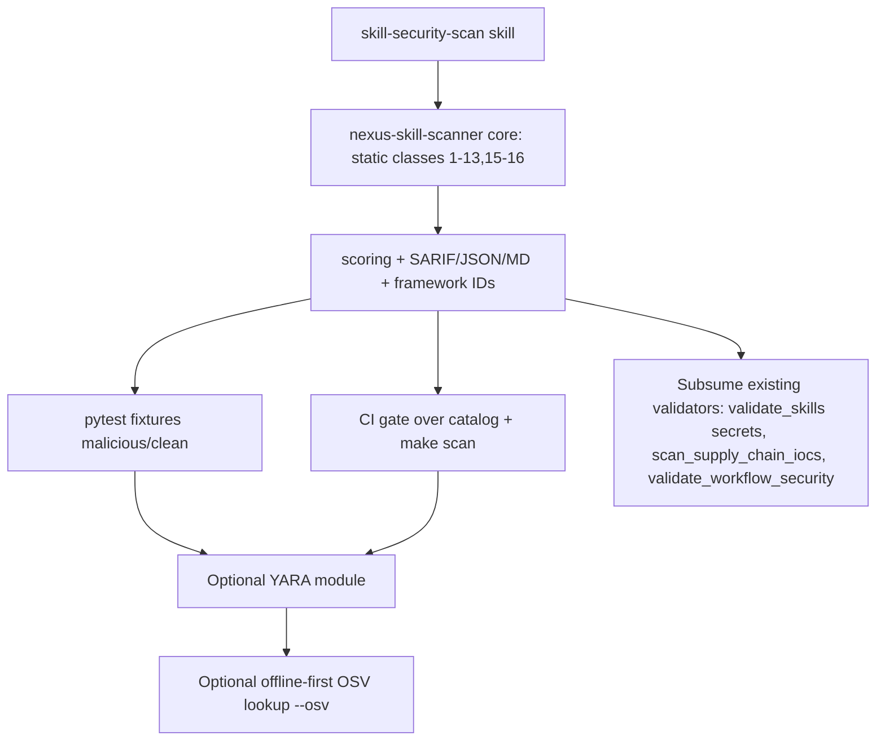

# Cross-Project Comparison: Nexus-Hub vs. NVIDIA SkillSpector

**Version**: v3.0.0 (planning; current released version is v2.4.0)
**Generated**: 2026-06-02
**Analyzer**: Claude Code -- compare-project command
**External Source**: https://github.com/nvidia/skillspector
**Source Type**: Repository

## Section 1: Executive Summary

SkillSpector is an Apache-2.0 Python/LangGraph security scanner that answers one question -- "is this AI agent skill safe to install?" -- by running 64 detection patterns across 16 vulnerability classes (prompt injection, data exfiltration, supply chain, excessive agency, MCP tool poisoning, and more) through a two-stage pipeline (static regex + AST + taint-tracking + YARA + a live OSV.dev dependency lookup, then an optional LLM semantic pass), and emitting a severity-banded risk score in terminal / JSON / Markdown / SARIF. This is the single highest-value adoption candidate in the v3.0.0 cycle because SkillSpector scans **exactly the artifact Nexus-Hub produces and distributes** -- `SKILL.md` files and MCP configs. Nexus-Hub already ships a *fragmented* subset of this capability (a fenced-code-aware secret scanner inside `validate_skills.py`, `scan_supply_chain_iocs.py`, `validate_workflow_security.py`), but lacks the prompt-injection / exfiltration / excessive-agency / MCP-poisoning / taint-tracking / YARA classes entirely. The recommendation is **adopt heavily, reverse-engineer-first**: build a single internal `nexus-skill-scanner` under `extensions/` that subsumes and unifies the existing validators and adds the missing classes (`re-full`), make the LLM semantic adjudication a skill (`skill-native`), keep the OSV.dev dependency lookup offline-first and opt-in (`re-partial`), and gate Nexus-Hub's own catalog on the scanner in CI (dogfooding). 13 of 16 detection classes are `re-full`, 2 are `re-partial`, 1 (semantic intent) is `skill-native`; nothing is dropped.

## Section 2: Project Profiles

| | Nexus-Hub | SkillSpector |
|---|---|---|
| Purpose | Upstream skill/command/hook/agent catalog distributed to AI coding assistants | Pre-install security scanner for AI agent skills |
| Maturity | v2.4.0, 245 skills / 41 commands / 22 hooks / 23 agents, multi-platform installer | Single-purpose CLI tool |
| Relationship | **Producer** of skills | **Inspector** of skills |
| Language | Python (scripts/validators, MCP extensions) + Bash/PowerShell (installers/hooks) + Markdown (catalog) | Python 3.12+ |
| License | (project) | Apache-2.0 |
| Headline stat | Catalog of 245 skills | "26.1% of skills contain vulnerabilities; 5.2% show likely malicious intent" |

The two projects are complementary, not competitive: Nexus-Hub *authors* skills; SkillSpector *audits* them. The natural fit is for Nexus-Hub to internalize the audit capability so it can (a) gate its own catalog before distribution and (b) let users scan any third-party skill before importing it via `/skills import`.

## Section 3: Technology Stack Comparison

| Layer | Nexus-Hub | SkillSpector | Notes |
|-------|-----------|--------------|-------|
| Language | Python 3.x scripts + extensions | Python 3.12+ | Compatible. |
| Static analysis | Regex-based validators (`validate_skills.py`, `scan_supply_chain_iocs.py`, `validate_workflow_security.py`) | Regex across 11 analyzers + AST behavioral detection | Nexus-Hub has regex but no AST behavioral layer. |
| Taint tracking | None | 5 taint-flow patterns (input-to-execution, file-to-network, credential chains) | Net-new for Nexus-Hub. |
| Signatures | None | YARA (malware / webshell / cryptominer / exploit) | Net-new; YARA is a local engine. |
| Dependency CVEs | `dependency-security-audit` skill + `generate-sbom` (conceptual) | Live OSV.dev API + static offline fallback | Nexus-Hub has the *skill* framing; no live lookup engine. |
| Semantic layer | The agent's own LLM (skills) | Optional LLM pass (OpenAI / Anthropic / NVIDIA / OpenAI-compatible) -> ~87% precision | Nexus-Hub does this natively via skills -- no bundled provider client needed. |
| Orchestration | N/A (validators are scripts) | LangGraph workflow | Nexus-Hub would use plain Python; LangGraph is unnecessary weight. |
| Output formats | Validator stdout + `make validate` exit codes | terminal / JSON / Markdown / SARIF | Nexus-Hub should add SARIF for CI/IDE integration. |
| Scoring | Pass/fail per validator | Severity points (CRIT +50 / HIGH +25 / MED +10 / LOW +5; exec 1.3x) -> 4 severity bands | Net-new: a unified risk score across all classes. |

## Section 4: AI Assistant Configuration Comparison

Not applicable in the usual sense -- SkillSpector is not an AI-assistant-configured project (no `.claude/`, no skills of its own). The relevant comparison is the *detection surface*: SkillSpector knows how to read `SKILL.md` frontmatter, skill scripts, and MCP server declarations and reason about their declared-vs-actual capability. Nexus-Hub authors all three of those artifact types, so it already has deep structural knowledge of them (`validate_skills.py` parses frontmatter; the MCP Registry Policy in `AGENTS.md` already reasons about declared-vs-actual MCP capability). This existing structural knowledge makes the reverse-engineering low-risk.

## Section 5: Capability Gap Analysis (16 detection classes)

### 5a. Present in SkillSpector, Missing or Partial in Nexus-Hub (adoption candidates)

| # | Detection class (pattern count) | Nexus-Hub today | Gap |
|---|---|---|---|
| 1 | Prompt Injection (5) | None | Full gap -- no detector for instruction overrides, hidden directives, exfiltration commands in skill text. |
| 2 | Data Exfiltration (4) | None | Full gap -- env-var harvesting, filesystem enumeration, context leakage. |
| 3 | Privilege Escalation (3) | Partial -- `validate_workflow_security.py` covers some workflow perms | Gap -- sudo/root exec, credential access in skill scripts. |
| 4 | Supply Chain (6) | Partial -- `scan_supply_chain_iocs.py` covers IOCs | Gap -- unpinned deps, external script fetch, obfuscation, abandoned deps, typosquatting, known CVEs. |
| 5 | Excessive Agency (4) | Partial -- MCP Registry Policy reasons about scope | Gap -- no automated check for unrestricted tool access / scope creep / unbounded resources. |
| 6 | Output Handling (3) | None | Full gap. |
| 7 | System Prompt Leakage (3) | None | Full gap. |
| 8 | Memory Poisoning (3) | None | Full gap -- persistent injection / context stuffing (relevant to Nexus-Hub's memory templates). |
| 9 | Tool Misuse (3) | None | Full gap. |
| 10 | Rogue Agent (2) | None | Full gap -- self-modification, unauthorized persistence. |
| 11 | Trigger Abuse (3) | Partial (inverse) -- `optimize_skill_description.py` fights *under*-triggering | Gap -- no detector for *overly broad* triggers / shadow commands / keyword baiting (the malicious inverse of the pushy-description guidance). |
| 12 | Behavioral AST (8) | None | Full gap -- exec/eval, dynamic imports, subprocess, getattr manipulation in skill scripts. |
| 13 | Taint Tracking (5) | None | Full gap. |
| 14 | YARA Signatures (4) | None | Full gap -- malware / webshell / cryptominer / exploit signatures. |
| 15 | MCP Least Privilege (4) | Partial -- MCP Registry Policy + matrix (manual) | Gap -- no automated under/over-declaration or wildcard detector. |
| 16 | MCP Tool Poisoning (4) | Partial -- `validate_unicode_safety.py` catches some Unicode | Gap -- hidden instructions, parameter injection, description-vs-behavior mismatch. |

### 5b. Present in Nexus-Hub, Absent in SkillSpector (strengths to preserve)

- **Fenced-code-aware secret scanning** (`validate_skills.py`, hardened in v2.4.0 BG-v23-1) -- documentation examples inside Markdown fences don't false-positive. SkillSpector's regex layer is not described as fence-aware; Nexus-Hub's nuance should be preserved in the unified scanner.
- **Security-framework mapping** (`build_framework_coverage.py` + MITRE ATT&CK / D3FEND / NIST CSF frontmatter) -- Nexus-Hub can tag each detection class with a framework control ID, which SkillSpector does not do. The scanner's findings should carry framework IDs.
- **The MCP Registry Policy + reverse-engineering matrix** -- a governance layer SkillSpector lacks entirely.
- **Cross-platform parity** (every `.sh` has a `.ps1` sibling) -- the scanner and its CI wiring must honor this.

### 5c. Present in Both, Quality Comparison

- **Supply chain**: SkillSpector's 6 patterns (including typosquatting + abandoned-dependency detection + live CVE lookup) are broader than `scan_supply_chain_iocs.py`. Adopt the broader pattern set; keep Nexus-Hub's IOC list.
- **Secrets / credentials**: roughly equivalent; Nexus-Hub's fence-awareness is superior. Merge.
- **MCP capability reasoning**: Nexus-Hub's is a *policy/manual* layer; SkillSpector's is *automated*. Combine -- automate the policy.

## Section 6: Commands and Automation Comparison

- **6a. Commands gap**: SkillSpector exposes one CLI verb -- `skillspector scan <target>` with `--format`, `--output`, `--no-llm`, `-V`. Nexus-Hub's equivalent in v3.0.0 is a `/skills scan <target>` sub-scope (and a `/review` scope) plus a `make scan` / `scripts/scan_skill_security.py` entry point. The `--no-llm` toggle maps to "skip the semantic-adjudication skill"; the `--format sarif` maps to a new SARIF emitter.
- **6b. CI/Hooks gap**: SkillSpector's SARIF output targets GitHub Advanced Security. Nexus-Hub should add a CI step that runs the scanner over `catalog/skills/` and `catalog/mcp-configs/` and fails on any HIGH/CRITICAL finding (dogfooding), plus an optional PreToolUse hook variant that scans a skill before `/skills import` writes it.

## Section 7: Documentation and Developer Experience Comparison

SkillSpector ships a single-tool README with a clear severity-band table and CLI examples. Nexus-Hub's strength is layered documentation (`AGENTS.md`, per-skill three-tier loading, the matrix). The scanner adoption should ship: a `skill-security-scan` skill body (the agent-facing manual), a `references/detection-classes.md` (the 16 classes + framework mappings + public-source URLs), and a short `docs/policy/` note tying the scanner to the MCP Registry Policy.

## Section 8: Testing and Security Posture Comparison

SkillSpector is itself a security tool; its posture is its product. Nexus-Hub already runs `make validate` / `make lint` / `make test` (1056 tests in v2.4.0) and four CI validators. The scanner extends this posture: it adds an offensive-pattern detector to a catalog that until now only checked *hygiene* (secrets, unicode, personal paths, supply-chain IOCs). Critically, the scanner must ship with its own pytest fixtures -- a known-malicious fixture skill (planted prompt-injection + exec call) that must score HIGH, and a known-clean fixture that must score LOW -- mirroring SkillSpector's two-stage validation.

## Section 9: Security and Risk Assessment (MANDATORY -- gates Section 11)

### 9.1 Threat Model Comparison

| Dimension | Nexus-Hub today | SkillSpector | Adoption delta |
|-----------|-----------------|--------------|----------------|
| New runtime dependencies | stdlib + tree-sitter (code-search) | LangGraph, YARA, an LLM provider client, `requests` (OSV) | Adopt **YARA only** (local engine, optional); reject LangGraph (use plain Python); reuse the user's own model CLI instead of a bundled provider client; OSV via stdlib `urllib`, offline-first. |
| Outbound calls at runtime | Zero (all validators local) | Live OSV.dev HTTPS lookups | One *optional, opt-in, offline-first* OSV lookup. Default off. This is the only network surface in the entire v3.0.0 cycle. |
| Credentials required | None | LLM provider API key (for semantic pass) | **None** -- the semantic pass is a Nexus-Hub *skill* run by the user's already-configured agent, not a bundled client with its own key. |
| Source code / prompts leave machine | No | Skill text sent to LLM provider (if semantic pass on); package names sent to OSV (if on) | Semantic pass runs in-agent (no external send beyond the user's existing model relationship); OSV sends only `{ecosystem, package, version}` tuples, opt-in. |
| New commercial relationship | No | Optional (LLM provider) | **None** required. |

### 9.2 Per-Item Risk Scorecard

| Item | Risk tier | Justification |
|------|-----------|---------------|
| Static analyzers (classes 1-13, 15-16 regex/AST/taint) | None | Pure local computation over local files; no outbound, no credential. |
| YARA signature engine (class 14) | Low | Local engine; risk is bundling/maintaining signature rules and a new (optional) dependency. Ship YARA as optional with graceful degradation when absent. |
| OSV.dev live dependency lookup (subset of class 4) | Medium | The only outbound call. Mitigated by offline-first default + opt-in flag + sending only package coordinate tuples (no source, no prompts). |
| LLM semantic adjudication (Stage 2) | Low | Runs as a Nexus-Hub skill via the user's own agent; no new credential or processor. Risk is only token cost, mitigated by `--no-llm` default-on for the deterministic gate. |
| SARIF / JSON / Markdown emitters + scoring | None | Deterministic local code. |

### 9.3 Reverse-Engineering Viability Analysis

| Item | Classification | Internal deliverable | Effort | Rationale (MCP Registry Policy) |
|------|----------------|----------------------|--------|---------------------------------|
| Detection classes 1-3, 5-13, 15-16 (static regex + AST + taint + MCP checks) | `re-full` | `extensions/nexus-skill-scanner/` (Python pkg) subsuming the existing validators | High | Tier 3: external logic runs locally; patterns are public security knowledge. Strip all SkillSpector attribution; use generic names (Reverse-Engineering Attribution Rule). |
| Supply chain (class 4) static portion | `re-full` | scanner module; reuse `scan_supply_chain_iocs.py` patterns | Medium | Tier 3 -- local pattern matching. |
| Supply chain (class 4) live CVE lookup | `re-partial` | optional offline-first OSV module (stdlib `urllib`, static fallback list) | Medium | Tier 3/4 boundary: OSV.dev is a free public vuln DB (not search-/embeddings-/scraping-as-service); queried by package coordinate, not arbitrary text. Ship offline-first + opt-in, matching SkillSpector's own offline mode. NOT the prohibited "search-as-service". |
| YARA signatures (class 14) | `re-partial` | optional YARA module + a curated, re-authored rule set | Medium | Tier 3 -- YARA is a local engine; rules are re-authored from public signatures, not copied. Optional dependency. |
| LLM semantic analysis (Stage 2) | `skill-native` | `catalog/skills/security/skill-security-scan/SKILL.md` -- the agent adjudicates flagged findings, filters false positives, explains intent | Low | Tier 2: achievable by instructing the agent's own LLM. No bundled provider client, no key. |
| Risk scoring + severity bands + SARIF/JSON/MD output | `re-full` | scanner output module | Low | Tier 3 -- deterministic local code. |

### 9.4 Recommendation Ordering

1. **`skill-native` first**: ship `skill-security-scan` (the semantic-adjudication skill) -- closes the intent-analysis gap with zero code.
2. **`re-full` next**: build `nexus-skill-scanner` (static engine: classes 1-13, 15-16 + scoring + SARIF/JSON/MD), subsuming `validate_skills.py` secret scanning, `scan_supply_chain_iocs.py`, `validate_workflow_security.py`, and `validate_unicode_safety.py`'s MCP-relevant checks. Gate the catalog on it in CI.
3. **`re-partial` next**: add the optional YARA module (curated rules) and the optional offline-first OSV.dev lookup (default off, opt-in flag).
4. **`vendor-intrinsic`**: none.
5. **`drop-outright`**: none. (LangGraph and the bundled LLM-provider client are *rejected as adoption mechanisms* -- see Section 13 -- but the *capabilities* they provide are adopted via plain Python and the skill-native semantic pass, so no detection class is dropped.)

This ordering structures Section 11.

## Section 10: Structural and Architectural Differences

- SkillSpector is a standalone tool with a LangGraph DAG; Nexus-Hub's idiom is small composable Python scripts gated by `make` targets and CI. The adoption should follow Nexus-Hub's idiom (plain Python package + `make scan` target), not import LangGraph.
- SkillSpector treats the scanner as the product; Nexus-Hub treats scanning as one validator among many. The internal scanner should be designed to **subsume the existing fragmented validators** so the security surface is unified rather than multiplied. This is an architectural simplification, not just an addition.

## Section 11: Adoption Plan

### Bucket 1 -- skill-native (ship first)

| What | Source | Target | Effort | Dependencies | Risk |
|------|--------|--------|--------|--------------|------|
| `skill-security-scan` skill (semantic adjudication of flagged findings; false-positive filtering; intent explanation) | SkillSpector Stage 2 | `catalog/skills/security/skill-security-scan/SKILL.md` (+ `references/detection-classes.md`) | Low | None | Low |

### Bucket 2 -- re-full internal builds (core scanner)

| What | Source | Target | Effort | Dependencies | Risk |
|------|--------|--------|--------|--------------|------|
| `nexus-skill-scanner` package: static analyzers for classes 1-13, 15-16 (regex + AST + taint + MCP least-privilege + tool-poisoning) | SkillSpector 11 static analyzers | `extensions/nexus-skill-scanner/` + `scripts/scan_skill_security.py` entry point | High | Subsumes existing validators | Medium |
| Risk scoring (severity points + bands) + SARIF/JSON/Markdown emitters | SkillSpector scoring + output | scanner output module | Low | core scanner | Low |
| Framework-ID tagging of findings (MITRE/D3FEND/NIST) | Nexus-Hub strength (5b) | scanner finding schema | Low | core scanner | Low |
| CI gate over `catalog/skills/` + `catalog/mcp-configs/` (fail on HIGH/CRIT) + `make scan` target | SkillSpector CI/SARIF | `.github/workflows/ci.yml`, `Makefile` | Medium | core scanner | Low |
| pytest fixtures: known-malicious (scores HIGH) + known-clean (scores LOW) | SkillSpector two-stage validation | `tests/validators/test_scan_skill_security.py` | Medium | core scanner | Low |
| Cross-platform parity (`scan_skill_security.ps1` wrapper or python-on-PATH note) + both-installer registration | Nexus-Hub installer rules | `scripts/installer.{sh,ps1}` | Low | core scanner | Low |

### Bucket 3 -- re-partial internal builds (optional network/engine modules)

| What | Source | Target | Effort | Dependencies | Risk |
|------|--------|--------|--------|--------------|------|
| Optional YARA module + re-authored rule set (class 14) | SkillSpector YARA | scanner YARA submodule (graceful degrade if YARA absent) | Medium | core scanner | Low |
| Optional offline-first OSV.dev dependency lookup (live portion of class 4) | SkillSpector OSV | scanner deps submodule, default OFF, `--osv` opt-in, static fallback list | Medium | core scanner | Medium |

## Section 12: Implementation Sequence

Order: skill first (closes the intent gap immediately and is usable even before the engine lands) -> core static engine + scoring + output -> fixtures + CI gate (dogfood the catalog) -> optional YARA -> optional OSV. The validator-subsumption (H) happens alongside the core build so the security surface is unified, not duplicated.

## Section 13: Risks and Considerations

- **Maintenance burden**: 64 patterns is a lot to maintain. Mitigation: start with the highest-signal classes (prompt injection, data exfiltration, behavioral AST, MCP tool poisoning) and grow the pattern set per release; record the deferred classes in known-gaps.
- **False positives in a *producer* catalog**: Nexus-Hub's own skills legitimately contain example exec/eval snippets and "instruction-override"-looking text inside fenced code. The scanner MUST be fence-aware (preserve the v2.4.0 secret-scanner nuance) and the skill-native semantic pass must adjudicate borderline findings before the CI gate fails the build. Mitigation: the deterministic gate fails only on HIGH/CRITICAL with the semantic pass as the false-positive filter.
- **Validator subsumption risk**: folding `validate_skills.py` secret scanning, `scan_supply_chain_iocs.py`, and `validate_workflow_security.py` into one scanner risks regressing their existing tests. Mitigation: subsume behind the same `make validate` entry points and keep all existing tests green; treat the unification as a refactor with a behavior-preservation check.
- **Scope creep into offensive tooling**: the scanner is *defensive* (detect malicious patterns). It must not ship offensive capability. Aligns with the v2.3.0 `security-operations` "defensive only" stance.

### Items explicitly NOT recommended for adoption (security / policy reasons)

- **N1 -- LangGraph as the orchestration engine.** SkillSpector uses LangGraph to sequence its two stages. Nexus-Hub's idiom is small composable Python scripts under `make` targets; a DAG framework is unnecessary weight and a new heavyweight dependency. Adopt the *two-stage concept* (deterministic gate, then optional semantic pass) in plain Python. (MCP Registry Policy: prefer the local minimal-dependency build; the capability is fully reverse-engineerable without the framework.)
- **N2 -- Bundled LLM-provider client (OpenAI / Anthropic / NVIDIA build.nvidia.com / OpenAI-compatible).** SkillSpector ships its own provider client + API-key handling for the semantic pass. Nexus-Hub must NOT bundle a provider client or require a new key -- the semantic pass is a `skill-native` capability run by the user's already-configured agent. (MCP Registry Policy tier 2: LLM-native, ship as a skill, no new credential or processor.)
- **N3 -- Mandatory live OSV.dev lookups.** Adopted only as an *optional, offline-first, opt-in* module (Section 11 Bucket 3), never as a default-on outbound call. A default-on network lookup would violate Nexus-Hub's zero-new-outbound release invariant. (MCP Registry Policy: borderline tier 3/4; permitted only because OSV.dev is a free public vuln DB queried by package coordinate, it is opt-in, and an offline fallback exists -- it is explicitly NOT the prohibited "search-as-service".)
