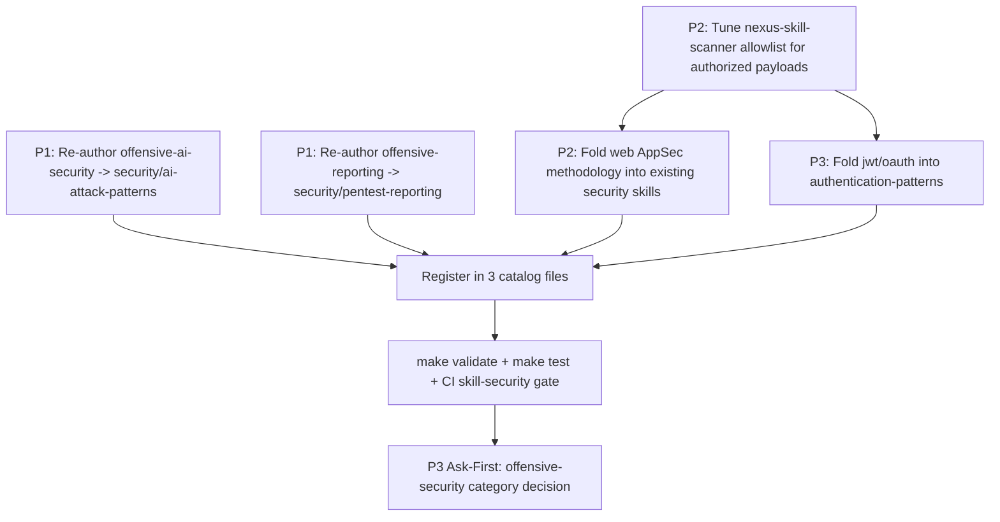

# Cross-Project Comparison: Nexus-Hub vs. Claude-Red

**Version**: v3.1.0
**Generated**: 2026-06-04
**Analyzer**: Claude Code -- compare-project command
**External Source**: https://github.com/SnailSploit/Claude-Red
**Source Type**: Repository

## Section 1: Executive Summary

Claude-Red is a curated library of **58 offensive-security skills** across 13 attack domains (Web 16, Wireless 14, Infrastructure/Red-Team 7, Exploit-Dev 6, Fuzzing 4, Recon 2, Auth 2, Utility 2, plus one each for Active Directory, AI, Cloud, IoT, Mobile), shipped as `SKILL.md` files in the same Anthropic Agent Skills format Nexus-Hub uses, under MIT license. Every skill is pure methodology prose (no bundled executables, no outbound calls, no credentials), so the data-flow risk of adopting any of it is **None** -- the entire decision is about *scope, brand, and dual-use posture*, not about the MCP Registry Policy's network-trust axis. The headline finding is that Claude-Red occupies a capability domain Nexus-Hub deliberately does not: Nexus-Hub's `security` (11 skills, AppSec) and `security-operations` (15 skills, defensive DFIR / threat-hunting / detection-engineering) categories are entirely **defensive**, and even `/review pentest` audits the user's *own* code rather than teaching engagement tradecraft. The overall recommendation is **selective, scope-gated adoption**: do not bulk-import 58 offensive skills (it would change the catalog's character, multiply maintenance, and chronically trip Nexus-Hub's own `nexus-skill-scanner`); instead adopt a small, re-authored set that strengthens the *existing defensive review surface* by adding the attacker's perspective -- principally `offensive-ai-security`, `offensive-reporting`, and a handful of web-app attack-pattern skills (SSRF, SSTI, deserialization, request-smuggling, IDOR) folded into the `security` category. Creating an `offensive-security` category, or adopting the weaponization / detection-evasion skills (EDR evasion, shellcode, keylogger architecture, advanced red-team C2), is an **Ask-First maintainer decision** per `AGENTS.md` and is recommended against for the core catalog (see Section 13). All adoption candidates are `skill-native`; nothing is `re-full`/`re-partial`/`vendor-intrinsic`, and nothing fails the MCP Registry Policy on data-flow grounds.

## Section 2: Project Profiles

| | Nexus-Hub | Claude-Red |
|---|---|---|
| Purpose | Upstream multi-platform skill / command / hook / agent catalog for AI coding assistants | Offensive-security methodology library for the Claude Skills system |
| Maturity | v3.0.0; 247 skills / 21 categories / 14 commands (+2 aliases, 40 deprecation shims) / 22 hooks / 23 agents; cross-platform installer | v0.2.0 (2025-05); 58 skills / 13 categories; shell installer + Python manifest builder |
| Security orientation | **Defensive** (AppSec + DFIR / threat-hunting / detection-engineering) and code-self-audit | **Offensive** (red-team engagement, bug bounty, CTF, vulnerability research) |
| Distribution | Installer to Claude / Codex / Cursor / Gemini / Antigravity / OpenCode / Copilot + Nexus-AI | `install.sh` into `~/.claude/skills/claude-red`; Claude.ai / Claude Code manual |
| Skill format | YAML frontmatter (`name`, `description`, `summary_l0`, `overview_l1`) + mandatory `When to Use` / `Instructions` / `Common Rationalizations` / `Verification` / `Related Skills` body | YAML frontmatter (`name`, `description`) + freer body (`Quick Workflow`, per-technique sections, `Detection / Defender View`, `Engagement Cheatsheet`, `Key References`) |
| License | (project) | MIT (2024-2025), maintainer Kai Aizen / SnailSploit; derived from the Sahar Shlichov offensive-checklist collection |
| Headline stat | 247-skill general-purpose catalog | 58 offensive skills, roadmap to ~107 |

The two projects are adjacent in *form* (both are SKILL.md catalogs targeting Claude's skills system) but orthogonal in *intent*: Nexus-Hub teaches an agent to build, review, secure, and operate software; Claude-Red teaches an agent to attack it under authorization. The natural relationship is not merge-everything but cherry-pick the attack knowledge that sharpens Nexus-Hub's existing defensive and review skills.

## Section 3: Technology Stack Comparison

| Layer | Nexus-Hub | Claude-Red | Notes |
|-------|-----------|------------|-------|
| Skill content | Markdown methodology + optional per-skill `scripts/` / `references/` / `assets/` (Tier-3 bundles) | Markdown methodology only; no bundled executables | Same primary medium; Nexus-Hub additionally supports bundled scripts. |
| Frontmatter | 4 required fields (`name`, `description`, `summary_l0`, `overview_l1`) + optional framework-mapping fields | 2 fields (`name`, `description`) | Claude-Red skills would need `summary_l0` / `overview_l1` added to satisfy the Nexus-Hub MCP server and validator. |
| Registry | `data/SKILL_INDEX.md` + `data/skills.json` + `data/marketplace.json` (validated by `make validate`) | `claude-skills.json` (generated by `tools/build_manifest.py`) | Different registry schemas; an importer would have to re-register. |
| Tooling | `make validate` / `make lint` / `make test`; `nexus-skill-scanner`; integration registry | `install.sh`; `tools/build_manifest.py`; `convert_skills.py` | Nexus-Hub's tooling is heavier and CI-gated. |
| CI/CD | GitHub Actions `validate` / `tests` jobs (incl. skill-security gate) | CodeQL, PyPI publish, plus `skill-preview.yml` / `skill-optimize-apply.yml` invoking the external `tesslio/skill-review-and-optimize` action with a `TESSL_API_TOKEN` secret | Claude-Red's CI sends skill text to an external optimization service (CI-only, not part of the shipped artifact). |
| Languages referenced | N/A (catalog) | Offensive tool ecosystem: aircrack-ng, hashcat, frida, pwntools, AFL++, sqlmap, BloodHound, Impacket, ScoutSuite, etc. | Tools are *named* in prose, never bundled. |

## Section 4: AI Assistant Configuration Comparison

Both repositories ARE AI-assistant configuration in the literal sense -- they are skill catalogs. The structural differences that matter for adoption:

- **Frontmatter completeness**: Nexus-Hub requires `summary_l0` (<=15 words) and `overview_l1` (<=150 words) on every skill because the bundled MCP server and `validate_skills.py` depend on them; Claude-Red ships only `name` + `description`. Any imported skill must have these two fields authored.
- **Body contract**: Nexus-Hub mandates `Common Rationalizations` and `Verification` (binary, observable-artifact checklist) sections; Claude-Red uses an engagement-oriented body (`Quick Workflow`, `Engagement Cheatsheet`, `Detection / Defender View`, `Key References`). The `Detection / Defender View` sections are a genuine asset -- they map cleanly onto Nexus-Hub's defensive `security-operations` skills and would survive re-authoring.
- **Description style**: Claude-Red's descriptions are already dense and trigger-phrase-rich (e.g., the `offensive-sqli` description lists error-based / blind / OOB / second-order / NoSQL / GraphQL variants), which aligns well with Nexus-Hub's "pushy description, combat-undertriggering" rule in `AGENTS.md`. They would, however, need an explicit `SKIP:` clause added.
- **Framework mapping**: Claude-Red skills cite MITRE ATT&CK / CWE / OWASP in `Key References` but do not use Nexus-Hub's optional structured `mitre_attack` / `d3fend_techniques` / `nist_csf` frontmatter fields. Re-authoring could promote those references into structured fields, feeding `scripts/build_framework_coverage.py`.
- **Scanner interaction**: Nexus-Hub's `nexus-skill-scanner` (and the `skill-security-scan` skill) statically scan every `SKILL.md` for 16 detection classes including shellcode, exfiltration commands, and excessive agency. Offensive skills contain exactly those tokens by design. The scanner is fence-aware and producer-catalog-aware, but importing offensive content would require tuning the scanner's allowlist for authorized red-team methodology -- a non-trivial, security-sensitive change discussed in Section 9.

## Section 5: Skills and Capabilities Gap Analysis

### 5a. Present in Claude-Red, missing in Nexus-Hub (adoption candidates, grouped)

Nexus-Hub has **no** offensive-engagement methodology. Every Claude-Red skill is therefore an external-only capability. Grouped and triaged by fit with Nexus-Hub's existing review / AppSec surface:

**In-domain (sharpen existing defensive/review skills) -- recommended candidates:**

| Skill | Capability | Strengthens |
|---|---|---|
| `offensive-ai-security` | Prompt injection, jailbreaking, RAG poisoning | `skill-security-scan`, the `ai-development` category, `nexus-skill-scanner` prompt-injection class |
| `offensive-reporting` | Pentest report writing (CVSS, evidence, exec summary, retest) | `/review pentest`, `code-review/final-report`, `infrastructure/incident-postmortem` |
| `offensive-sqli`, `offensive-ssrf`, `offensive-ssti`, `offensive-xxe`, `offensive-deserialization`, `offensive-request-smuggling`, `offensive-idor`, `offensive-business-logic` | Web-app attack methodology | `/review security`, `/review pentest`, `security/advanced-attack-patterns`, `security/business-logic-abuse` |
| `offensive-jwt`, `offensive-oauth` | Token / auth-flow attacks | `security/authentication-patterns` |
| `offensive-cloud` | Cloud privesc / IMDS / persistence | `security-operations/cloud-security-posture-detection`, `cloud-audit-log-detection` |

**Out-of-domain (specialist offensive tradecraft, weak fit for a coding-assistant catalog) -- maintainer scope decision:**

| Group | Skills | Why deferred |
|---|---|---|
| Wireless (14) | wifi, wpa2-psk, wpa3-sae, wpa-enterprise, wps, evil-twin, deauth, krack-fragattacks, bluetooth-ble, bluetooth-classic, zigbee-thread-matter, z-wave, lorawan-sub-ghz, wifi-recon | RF / hardware engagement domain, no overlap with software-engineering workflows |
| Exploit-Dev (6) | exploit-development, basic-exploitation, crash-analysis, mitigations, toctou, exploit-dev-course | Binary exploitation; narrow audience |
| Fuzzing (4) | fuzzing, fuzzing-course, bug-identification, vuln-classes | Partial overlap with `bug-fixing`; fuzzing-as-engagement is specialist |
| Detection-evasion / weaponization | edr-evasion, shellcode, keylogger-arch, windows-mitigations, windows-boundaries, advanced-redteam, initial-access | See Section 13 -- recommended against for the core catalog |
| IoT / Mobile / AD / Recon | iot, mobile, offensive-active-directory, osint, osint-methodology | Specialist; defer to a dedicated offensive bundle if ever pursued |

### 5b. Present in Nexus-Hub, missing in Claude-Red (strengths to preserve)

- The entire **defensive** security surface: `security` (11 AppSec skills) + `security-operations` (15 DFIR / threat-hunting / detection-engineering skills) + the `/review security` / `/review pentest` / `/review sbom` commands.
- **`nexus-skill-scanner`** + `skill-security-scan` -- the capability to vet any third-party skill (including Claude-Red's) before import.
- The 200+ non-security skills, 14 consolidated commands, 22 hooks, 23 agents, multi-platform installer, integration registry, and CI quality gates.
- The mandatory `Verification` / `Common Rationalizations` body contract and the three-tier loading model -- structural rigor Claude-Red does not enforce.

### 5c. Present in both, quality comparison

| Capability | Nexus-Hub | Claude-Red | Verdict |
|---|---|---|---|
| Business-logic abuse | `security/business-logic-abuse` (review-oriented) | `offensive-business-logic` (engagement-oriented: pricing/refund abuse, anti-fraud defeat) | Complementary; Claude-Red adds concrete attack scenarios the defensive skill can cite. |
| Attack patterns | `security/advanced-attack-patterns` | 16 web skills with copy-paste payloads | Claude-Red is deeper per-vector; Nexus-Hub is broader-but-shallower. Re-author select vectors into the existing skill rather than import standalone. |
| AI security | `skill-security-scan` (defensive: scan skills) | `offensive-ai-security` (offensive: prompt-inject / jailbreak / RAG-poison) | Two halves of the same coin; adopting the offensive half measurably strengthens the defensive scanner's detection rationale. |

## Section 6: Commands and Automation Comparison

### 6a. Commands gap

Claude-Red ships **no slash commands** -- it is a pure skill library plus an installer. Nexus-Hub's 14-command surface (notably `/review pentest`, `/review security`) is strictly richer. No command-level adoption candidate exists. The only automation Claude-Red adds is `install.sh` (category-filtered skill copy) and `tools/build_manifest.py` (regenerate the JSON manifest) -- both are functionally subsumed by Nexus-Hub's installer + `make build-catalog`.

### 6b. CI/CD and hooks gap

Claude-Red's `skill-preview.yml` / `skill-optimize-apply.yml` workflows invoke the external `tesslio/skill-review-and-optimize` GitHub Action (with a `TESSL_API_TOKEN` secret) to auto-review and auto-rewrite skill text. This is a **generation-as-service** dependency in CI. It is not part of the shipped artifact, and Nexus-Hub should NOT adopt it: it sends skill source to a third-party optimization service, which the MCP Registry Policy's hard-no list rejects. Nexus-Hub's equivalent (skill-quality review) is the LLM-native `skill-description-authoring` skill plus `make validate` -- already strictly better on the data-flow axis.

## Section 7: Documentation and Developer Experience Comparison

Claude-Red has strong docs for its size: a comprehensive README with a full skill index, `CONTRIBUTING.md` with a skill-format spec, `SECURITY.md` (authorized-use policy + responsible disclosure), `CHANGELOG.md`, and a `MINDMAP.md` Mermaid coverage map. Nexus-Hub's documentation surface (per-version `docs/`, `AGENTS.md`, style guides, guides/, DEVLOG, known-gaps trackers) is far larger. The one transferable DX idea is the **`MINDMAP.md` Mermaid coverage map** -- a single visual of all skills grouped by category, useful for spotting catalog gaps. Nexus-Hub's `docs/CATALOG-COVERAGE.md` already serves a similar purpose, so this is a low-value nicety at best. Claude-Red's `SECURITY.md` authorized-use framing is directly relevant if any offensive content is adopted (see Section 13).

## Section 8: Testing and Security Posture Comparison

| Dimension | Nexus-Hub | Claude-Red |
|---|---|---|
| Tests | `make test` pytest suite for hooks + validators; `tests/validators/` | None (manual PR review + external Tessl auto-review) |
| Skill-security gate | CI runs `nexus-skill-scanner` over `catalog/skills`; fails on HIGH/CRITICAL | CodeQL (code only); no skill-content security gate |
| Outbound at runtime | None from shipped artifacts (internal MCPs are local; OSV.dev opt-in/off) | None from shipped skills (CI Tessl action is build-time only) |
| Dual-use content | Defensive; offensive framing is review/detection-oriented | Offensive by design; `SECURITY.md` restricts to authorized engagements |

The decisive posture difference: Nexus-Hub *scans* skills for malicious patterns, while Claude-Red's skills *contain* the patterns a scanner is built to flag. This is not a defect in either project -- it is the core tension any adoption must resolve (Section 9.2).

## Section 9: Security and Risk Assessment

Reference: `AGENTS.md` "MCP Registry Policy" decision tree and `docs/policy/mcp-reverse-engineering-matrix.md`.

### 9.1 Threat Model Comparison

| Dimension | Nexus-Hub (current) | Claude-Red | Adoption delta |
|---|---|---|---|
| New runtime dependencies | None | None (pure markdown) | **Zero** |
| Outbound calls at runtime | None from shipped artifacts | None from shipped skills | **Zero** |
| Credentials / API keys | None | None in content (`TESSL_API_TOKEN` is CI-only, not shipped) | **Zero** |
| Source code / prompts leave machine | No | No (skills are prose primers; CI Tessl action excluded from adoption) | **Zero** |
| New commercial relationship | No | No | **None** |
| **Content / dual-use risk** | Defensive | **Offensive tradecraft (dual-use)** | **This is the real risk axis** |

The data-flow delta is uniformly zero. The genuine risk of adopting Claude-Red content is therefore NOT a Registry-Policy network concern but three non-network risks: (1) **dual-use content** -- offensive tradecraft that must be gated to authorized contexts; (2) **scanner self-collision** -- Nexus-Hub's own catalog skill-security gate will flag imported offensive payloads; (3) **brand / scope drift** -- shipping detection-evasion and weaponization skills changes what the catalog is.

### 9.2 Per-Item Risk Scorecard

Data-flow risk is **None** for every candidate (pure markdown). The tier below captures *holistic adoption risk* (dual-use + scanner-collision + scope), which is the gating axis here.

| Item | Risk tier | Justification |
|---|---|---|
| `offensive-reporting` | None | Report-writing methodology; no payloads; complements `/review pentest`. |
| `offensive-ai-security` | Low | Prompt-injection / RAG-poison knowledge; defensive value is high; mild scanner-collision on injection strings. |
| Web AppSec set (sqli, ssrf, ssti, xxe, deserialization, request-smuggling, idor, business-logic) | Low-Medium | Copy-paste payloads will trip the scanner's injection / RCE classes; needs allowlist tuning and authorized-use framing. |
| Auth set (jwt, oauth) | Low | Token-attack methodology; modest scanner collision. |
| `offensive-cloud` | Medium | IMDS / privesc / persistence + CSPM-evasion content; partial detection-evasion framing. |
| Wireless / Exploit-Dev / Fuzzing / IoT / Mobile / AD / Recon | Medium | Out-of-domain for a coding-assistant catalog; large maintenance surface; specialist audience. |
| Detection-evasion / weaponization (edr-evasion, shellcode, keylogger-arch, windows-mitigations/boundaries, advanced-redteam, initial-access) | High | Primarily teaches evading defenses and weaponizing payloads; chronic scanner-collision; brand-defining; constrained by the agent's own safety posture. Recommended against (Section 13). |

### 9.3 Reverse-Engineering Viability Analysis

| Item | Classification | Internal deliverable (if any) | Effort | Rationale |
|---|---|---|---|---|
| All recommended candidates | `skill-native` | Re-authored `SKILL.md` under `security` (or a new `offensive-security` category, Ask-First) with `summary_l0` / `overview_l1` + `SKIP:` + Nexus-Hub body contract; generic naming per the Reverse-Engineering Attribution Rule (do not name Claude-Red / SnailSploit / Sahar Shlichov in the artifact) | Low-Medium per skill | The capability IS the LLM primed by methodology prose -- MCP Registry Policy tier 2. No code, no MCP, no outbound. |
| External Tessl CI auto-optimize | `drop-outright` | None | n/a | Generation-as-service; hard-no list. Replace with `skill-description-authoring` + `make validate`. |

There are no `re-full` / `re-partial` / `vendor-intrinsic` items: Claude-Red ships no engine to rebuild.

### 9.4 Recommendation Ordering

1. **`skill-native` (ship as re-authored skills):** Ordered by domain-fit within this bucket --
   - First (high defensive value, low controversy): `offensive-ai-security`, `offensive-reporting`.
   - Second (fold into existing `security` skills as attacker-perspective enrichment rather than standalone imports): the web AppSec set + auth set, re-authored generically.
   - Third (Ask-First scope decision): `offensive-cloud` and the out-of-domain specialist groups -- only if maintainers choose to open an `offensive-security` category.
2. `re-full` / `re-partial`: **none**.
3. `vendor-intrinsic`: **none**.
4. `drop-outright`: the external Tessl CI optimization step; and (on scope/brand grounds, not data-flow) the detection-evasion / weaponization group -- see Section 13.

## Section 10: Structural and Architectural Differences

- **Catalog vs. library**: both are SKILL.md catalogs, but Nexus-Hub is a multi-platform *distribution system* (installer, integration registry, registries, CI gates), whereas Claude-Red is a single-target skill folder + installer. Adopted content must be re-registered in `data/SKILL_INDEX.md`, `data/skills.json`, and `data/marketplace.json`.
- **Body-contract rigor**: Nexus-Hub's mandatory `Verification` (binary, observable-artifact) and `Common Rationalizations` sections do not exist in Claude-Red; re-authoring must add them. For offensive skills the `Verification` checklist must be authorized-engagement-aware (e.g., "scope and rules-of-engagement documented" as a precondition).
- **Category taxonomy**: Nexus-Hub splits `security` (AppSec) from `security-operations` (defensive ops). Offensive content fits neither cleanly -- it argues for a third `offensive-security` category, which is an explicit Ask-First action in `AGENTS.md`.
- **Attribution**: Claude-Red is itself derived from an upstream checklist collection; Nexus-Hub's Reverse-Engineering Attribution Rule requires generic naming and no upstream-repo references in the distributed artifact.

## Section 11: Adoption Plan

All candidates are `skill-native`; per Section 9.4 the plan operates entirely within that one RE bucket, then by priority tier.

### Bucket: skill-native

| Tier | What | Source | Target | Effort | Dependencies | Risk |
|------|------|--------|--------|--------|--------------|------|
| P1 | Re-author `offensive-ai-security` as an AI-pentest skill (prompt injection / jailbreak / RAG poisoning) feeding the defensive scanner's rationale | `Skills/ai/offensive-ai-security` | `catalog/skills/security/ai-attack-patterns/SKILL.md` (generic name) | Medium | `nexus-skill-scanner` allowlist note | Low |
| P1 | Re-author `offensive-reporting` as pentest-report methodology | `Skills/utility/offensive-reporting` | `catalog/skills/security/pentest-reporting/SKILL.md` | Low | none | None |
| P2 | Fold the web AppSec attack methodology (sqli, ssrf, ssti, xxe, deserialization, request-smuggling, idor, business-logic) into `security/advanced-attack-patterns` + `security/business-logic-abuse` as attacker-perspective enrichment, with payloads scanner-allowlisted | `Skills/web/*` | existing `security/*` skills | Medium | scanner tuning (P1 below) | Low-Medium |
| P2 | Tune `nexus-skill-scanner` to allowlist authorized red-team methodology (fenced payloads in `security` skills) before any payload-bearing import | n/a (internal) | `extensions/nexus-skill-scanner/` | Medium | none | Medium (security-sensitive change -- needs tests) |
| P3 | Fold `offensive-jwt` / `offensive-oauth` into `security/authentication-patterns` | `Skills/auth/*` | existing skill | Low | scanner tuning | Low |
| P3 | (Ask-First) Decide whether to open an `offensive-security` category for `offensive-cloud` + specialist groups | various | new category | High | maintainer sign-off | Medium |

## Section 12: Implementation Sequence

Sequencing rationale: the two P1 skills carry near-zero scanner collision and ship immediately. The scanner allowlist tuning (P2, internal, security-sensitive) is a hard prerequisite for any payload-bearing web/auth content, so it gates the rest. The `offensive-security` category decision is last and gated on explicit maintainer approval.

## Section 13: Risks and Considerations

- **Scanner self-collision (highest practical risk)**: Nexus-Hub's CI fails on any HIGH/CRITICAL `nexus-skill-scanner` finding over `catalog/skills`. Importing offensive payloads without first tuning the scanner's producer-catalog allowlist would either break CI or force a blanket suppression that weakens the scanner for genuinely malicious skills. The allowlist change is itself security-sensitive and must ship with tests (planted-malicious fixture must still score CRITICAL).
- **Brand / scope drift**: Nexus-Hub positions as a production-grade general coding catalog. Shipping a large offensive surface changes that identity. Keep adoption to attacker-perspective enrichment of existing defensive skills unless maintainers explicitly choose to become an offensive-capable catalog.
- **Maintenance burden**: offensive tradecraft tracks fast-moving CVEs and tool versions. 58 skills is a large surface to keep current; this argues strongly against bulk import.
- **Authorized-use gating**: any adopted offensive content must carry Claude-Red's authorized-engagement framing in its `Verification` preconditions, consistent with the agent's own safety posture (authorized pentest / CTF / research only).
- **Attribution**: re-author generically; do not reference Claude-Red, SnailSploit, or the upstream Sahar Shlichov checklist in distributed artifacts (Reverse-Engineering Attribution Rule).

### Items explicitly NOT recommended for adoption (security / policy reasons)

- **N1 -- Claude-Red CI `tesslio/skill-review-and-optimize` action.** Sends skill source to a third-party optimization service. **Rejected under the MCP Registry Policy hard-no list (generation-as-service).** Use the LLM-native `skill-description-authoring` skill + `make validate` instead.
- **N2 -- Detection-evasion / weaponization skills** (`offensive-edr-evasion`, `offensive-shellcode`, `offensive-keylogger-arch`, `offensive-windows-mitigations`, `offensive-windows-boundaries`, `offensive-advanced-redteam`, `offensive-initial-access`). These have **no data-flow risk** (pure markdown) and so are not Registry-Policy drops, but they are recommended against for the core catalog on **scope, brand, scanner-collision, and dual-use** grounds: they primarily teach evading defenses and weaponizing payloads, exceed a coding-assistant catalog's defensive-leaning scope, and would chronically trip the skill-security gate. Adopting them is an Ask-First maintainer decision, not a default.
- **N3 -- Bulk import of the wireless / exploit-dev / fuzzing / IoT / mobile / AD / recon specialist groups (40+ skills).** Out-of-domain for software-engineering workflows and a heavy maintenance surface. Defer to a dedicated, separately-governed offensive bundle if ever pursued; do not fold into the core catalog.
