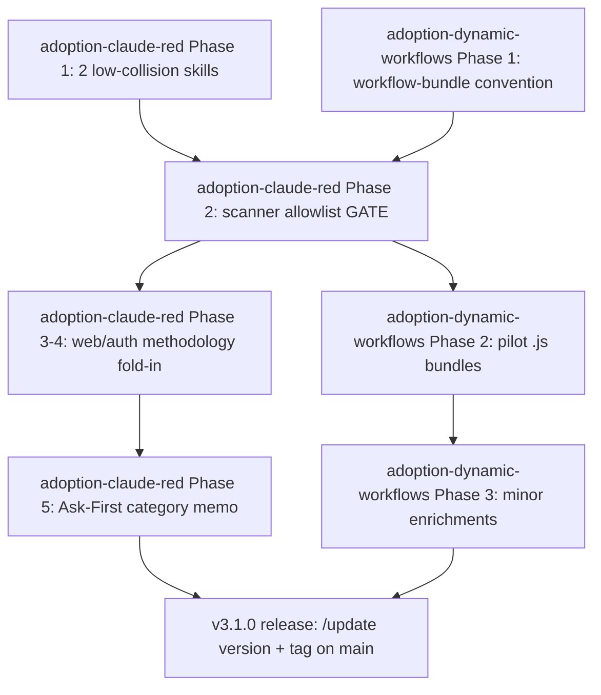

# Plan -- v3.1.0 External-Source Adoption Roadmap (master)

**Project**: Nexus-Hub
**Version**: v3.1.0
**Slug**: v3.1.0-adoption-roadmap
**Plan Type**: Feature / Enhancement (master / orchestrator)
**Created**: 2026-06-04
**Goal**: Ship the two fast, catalog-native adoptions from the 2026-06-04 `/compare-project` cycle (Dynamic Workflows residual + selective Claude-Red offensive methodology), sequenced reverse-engineer-first, with the `nexus-skill-scanner` allowlist as the shared gate.

## Overview

This is a **thin orchestrator**: it sequences two self-contained sub-plans and defines the version-level gate and Definition of Done. It does NOT restate their phases -- each sub-plan carries its own phases, executable task prompts, and exit checklists.

v3.1.0 is the first slice of the external-source adoption cycle that began with three `/compare-project` comparisons on 2026-06-04. The cycle was deliberately **split by size and risk**: the two catalog-native, low-risk adoptions land in v3.1.0 (this roadmap); the large `headroom` context-compression *engine* build (a new `extensions/` package, ~6-10 weeks, Med-High risk) is deferred to its own focused release, **v3.2.0** (see [`../../v3.2.0/plans/adoption-headroom.md`](../../v3.2/plans/adoption-headroom.md)). This keeps the fast wins from being gated behind the engine build.

Both v3.1.0 sub-plans are `skill-native` (pure catalog content; no new outbound call, credential, dependency, or third-party processor). **Phase sequencing across both sub-plans follows the MCP Registry Policy decision tree (reverse-engineer-first).** Within v3.1.0 the RE bucket is uniform (`skill-native`), so ordering is driven by the one shared technical gate: the `nexus-skill-scanner` producer-catalog allowlist.

This is a SemVer **minor** bump (additive only). The actual version-carrying bump (`.claude-plugin/plugin.json`, both installers, `data/marketplace.json`, CHANGELOG, README/AGENTS markers, tag) is a release action owned by `/update version` and happens at the end, not now.

## Constitution Check

*GATE: Must pass before Phase 0 research. Re-check after Phase 1 design.*

No constitution file found at docs/v3/v3.1/constitution.md - skipping check. Recommend running /constitution to establish project principles.

Both sub-plans align with the standing `AGENTS.md` MCP Registry Policy (all items `skill-native`, zero new outbound / credentials / processors). The one security-sensitive change (the scanner allowlist) ships with regression tests that keep the planted-malicious fixture scoring CRITICAL.

## Sub-plans in this version

| Sub-plan | Source comparison | Phases | Tasks | RE bucket | Effort | Risk |
|---|---|---|---|---|---|---|
| [adoption-dynamic-workflows.md](adoption-dynamic-workflows.md) | [comparison-a-harness-for-every-task...](../comparison-a-harness-for-every-task-dynamic-workflows-in-claude-code.md) | 3 | 9 | skill-native | ~days | Low |
| [adoption-claude-red.md](adoption-claude-red.md) | [comparison-claude-red.md](../comparison-claude-red.md) | 5 | 13 | skill-native (scope-gated) | ~1-2 wks | Low-Med |

Deferred to v3.2.0: [adoption-headroom.md](../../v3.2/plans/adoption-headroom.md) (7 phases, 23 tasks, `re-full` engine build).

## The shared gate: nexus-skill-scanner allowlist

The single cross-plan dependency. Both sub-plans add content the catalog skill-security gate (`nexus-skill-scanner`, run in CI over `catalog/skills`) is designed to flag:

- **Claude-Red**: re-authored web/auth attack methodology carries payloads that trip injection / RCE detection classes (adoption-claude-red Phase 3-4).
- **Dynamic Workflows**: bundled `.js` workflow templates are executable scripts that may trip the scanner's executable / excessive-agency classes (adoption-dynamic-workflows Phase 1-2).

Therefore the scanner producer-catalog allowlist work (**adoption-claude-red Phase 2**, tasks T005-T006) is a **prerequisite for all payload-bearing or script-bearing catalog content in this version** -- it must scope an allowlist precisely (by category / fenced-or-script context) without weakening detection of genuinely malicious skills (planted-malicious fixture must still score CRITICAL). When implementing the Dynamic Workflows `.js` bundles, confirm whether they also need an allowlist entry for executable workflow templates and, if so, extend the Phase 2 work to cover them.

## Recommended sequencing

Rationale: the two Phase-1 efforts (zero/low collision) can run first or in parallel. The scanner allowlist (claude-red Phase 2) is the convergence gate; nothing payload- or script-bearing merges before it is in place and its regression tests are green. After the gate, the two sub-plans proceed independently. The Ask-First offensive-security category memo (claude-red Phase 5) and the minor orchestration enrichments (dynamic-workflows Phase 3) are the lowest-priority tail.

## Orchestration milestones

- [ ] M1 -- adoption-claude-red Phase 1 complete (security/ai-attack-patterns + security/pentest-reporting shipped and registered)
- [ ] M2 -- adoption-dynamic-workflows Phase 1 complete (workflow-bundle convention documented + reference template)
- [ ] M3 -- SHARED GATE: nexus-skill-scanner allowlist landed with regression tests green (planted-malicious still CRITICAL); extended to cover `.js` workflow bundles if needed
- [ ] M4 -- adoption-claude-red Phases 3-4 complete (web + auth attack methodology folded into existing security skills)
- [ ] M5 -- adoption-dynamic-workflows Phase 2 complete (pilot `.js` bundles on multi-agent-code-review + deep-research-compilation)
- [ ] M6 -- Tail: claude-red Phase 5 category memo + dynamic-workflows Phase 3 enrichments complete
- [ ] M7 -- Version Definition of Done met (below); ready for release

## Version Definition of Done

- [ ] All milestones M1-M6 complete; both sub-plans' phase exit checklists satisfied
- [ ] `make validate`, `make lint`, and `make test` green
- [ ] `nexus-skill-scanner` CI gate green across `catalog/skills` (no HIGH/CRITICAL); allowlist regression tests pass (planted-malicious fixture still CRITICAL, known-clean still LOW)
- [ ] All new/changed skills registered in `data/SKILL_INDEX.md`, `data/skills.json`, `data/marketplace.json`; catalog counts reconciled
- [ ] Installer dry-run (bash + PowerShell) lands all new catalog content correctly
- [ ] CHANGELOG `## [Unreleased]` entry summarizes the v3.1.0 adoptions
- [ ] Offensive-security category decision memo authored and awaiting maintainer sign-off (not implemented)

## Branching and release workflow (develop + main)

This version is developed under the lightweight **develop + main** model adopted 2026-06-04:

- All v3.1.0 work happens on `develop` (or short-lived feature branches off `develop`, e.g. `feat/v3.1.0-claude-red`, merged back to `develop`).
- `main` stays the stable, installable branch (the branch users install from); it is not touched mid-version.
- At release, `develop` merges to `main` and the `v3.1.0` tag is cut on `main` via `/update version`.
- v3.2.0 (headroom) follows the same pattern as a subsequent release off `develop`.

## Complexity Tracking

> Fill ONLY if Constitution Check has violations that must be justified.

| Violation | Why Needed | Simpler Alternative Rejected Because |
|-----------|------------|-------------------------------------|
| (none) | -- | All Constitution Check items are N/A (no constitution file); no violations to justify. |

## Items explicitly NOT in this version

- **headroom context-compression engine** -- deferred to v3.2.0 as its own focused release (large `re-full` build; different risk profile). See [`../../v3.2.0/plans/adoption-headroom.md`](../../v3.2/plans/adoption-headroom.md).
- **`drop-outright` / scope-rejected items** -- each sub-plan carries its own "Items explicitly NOT adopted" appendix (Tessl CI optimizer, weaponization-skill group, specialist-skill bulk for Claude-Red; none for Dynamic Workflows). They are not restated here.
