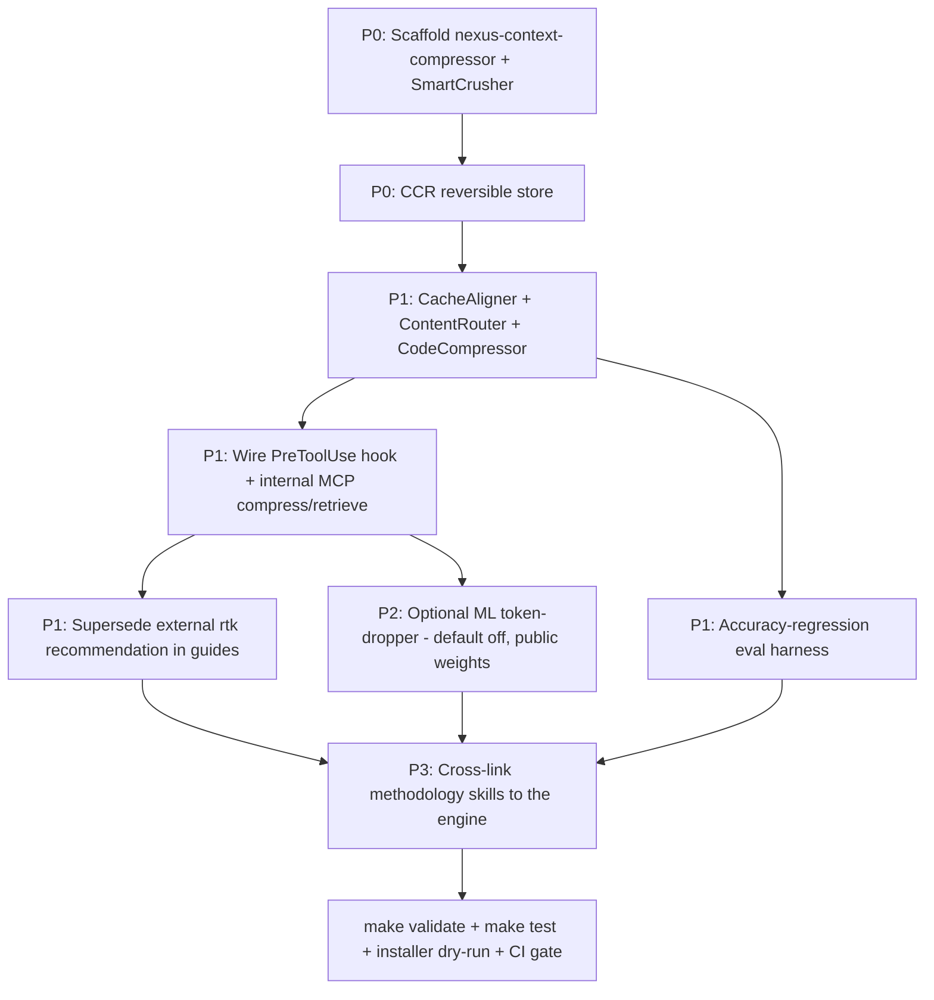

# Cross-Project Comparison: Nexus-Hub vs. headroom

**Version**: v3.2.0
**Generated**: 2026-06-04
**Analyzer**: Claude Code -- compare-project command
**External Source**: https://github.com/chopratejas/headroom
**Source Type**: Repository

## Section 1: Executive Summary

headroom is an Apache-2.0 **context-compression engine** (Python SDK + Rust core + TypeScript adapters, v0.23.0) that compresses everything an agent reads -- tool outputs, JSON, code, logs, RAG chunks, file reads, conversation history -- before it reaches the model, claiming 60-95% token savings with preserved accuracy (GSM8K +/-0%, TruthfulQA +3% on the README benchmarks). Its five strategies are **local-first and largely deterministic**: `CacheAligner` (stabilize KV-cache prefixes), `SmartCrusher` (Rust-backed JSON-array dedup), `CodeCompressor` (tree-sitter AST-aware code trimming), `Kompress-base` (a ~33M-param ModernBERT importance scorer running locally via ONNX INT8), and `ContentRouter` (route each content type to its best compressor). Critically, the deep-dive confirmed that **no tool output, file content, RAG data, or prompt ever leaves the machine**: the only outbound calls are a one-time public HuggingFace model-weight download (no user data), an opt-in anonymous aggregate-metrics telemetry beacon, and ordinary LLM forwarding via the user's own keys. headroom is therefore NOT "compression-as-a-service" and clears the MCP Registry Policy hard-no list. This is the **single highest-value reverse-engineering candidate** of the three sources in this cycle: Nexus-Hub today has only a *methodology* compression layer (the `context-compression` / `context-optimization` / `prompt-token-optimization` skills) plus a dependency on the **external** `rtk` Rust binary (command-output-only, no reversibility, installed via `cargo install --git` with a self-acknowledged source-trust caveat). The recommendation is **adopt heavily, reverse-engineer-first**: build an internal `extensions/nexus-context-compressor` that ports the four deterministic strategies (`re-full`) plus the reversible-retrieval store (`re-full`), treat the ML token-dropper as a deferred optional module (`re-partial`), drop the telemetry beacon outright, and decline the proxy form in favor of an in-process library/hook integration. Doing so also lets Nexus-Hub **retire the external `rtk` recommendation**, converting a "trust a third-party GitHub binary" posture into an owned, audited, broader-coverage compressor -- exactly the direction both the MCP Registry Policy and `rtk`'s own security caveat point.

## Section 2: Project Profiles

| | Nexus-Hub | headroom |
|---|---|---|
| Purpose | Multi-platform skill / command / hook / agent catalog for AI coding assistants | Local-first context-compression layer for LLM apps and coding agents |
| Maturity | v3.0.0; 247 skills, 22 hooks, 23 agents, 4 internal MCP extensions | v0.23.0; 347 Python files, 4 Rust crates, TS SDK, full CI |
| Form | Catalog + installer + internal MCP servers under `extensions/` | Importable library + optional FastAPI proxy + MCP server + framework adapters |
| Compression today | Methodology *skills* + external `rtk` binary (command output only) | Deterministic + ML *engine* across JSON / code / logs / RAG / text |
| License | (project) | Apache-2.0 (permissive; commercial use, modification, redistribution allowed) |
| Data-flow posture | Internal MCPs are local; OSV.dev lookup opt-in/off | Local-first; only public model download + opt-in anon telemetry + own-key LLM forwarding |
| Headline stat | 247-skill catalog | 60-95% token savings, accuracy preserved |

The projects are complementary: Nexus-Hub *teaches* an agent when and how to compress (skills) but owns no engine; headroom *is* the engine but ships no skills. The fit is for Nexus-Hub to internalize the engine and keep its methodology skills as the human-facing "when/why" layer on top.

## Section 3: Technology Stack Comparison

| Layer | Nexus-Hub | headroom | Notes |
|-------|-----------|----------|-------|
| Core language | Python (scripts, `extensions/` MCPs) + Rust (`nexus-code-search` extractors) + Bash/PowerShell | Python 3.10+ + Rust (4-crate workspace) + TypeScript SDK | Stacks align; Nexus-Hub already ships Python+Rust extensions. |
| Tokenizer | N/A (no runtime compression engine) | `tiktoken` | Net-new dependency if ported (stdlib-friendly). |
| JSON compression | None | `SmartCrusher` (Rust, variance/uniqueness/change-point scoring) | `re-full` candidate. |
| Code compression | `nexus-code-search` does AST *extraction* (tree-sitter, 12 languages) | `CodeCompressor` (tree-sitter AST trimming, 8 languages) | Nexus-Hub already owns tree-sitter infra -- strong RE precedent. |
| Cache alignment | None | `CacheAligner` (regex + optional spaCy NER) | `re-full` candidate; pure local logic. |
| ML token-dropping | None | `Kompress-base` ModernBERT via ONNX INT8 (~33M params, ~800 MB) | `re-partial` -- use public pre-trained weights, do not retrain. |
| Content routing | None | `ContentRouter` (magika-style detection) | `re-full` candidate. |
| Reversible retrieval | None | CCR store (SQLite default) + `headroom_retrieve` MCP tool | `re-full` -- the standout feature `rtk` lacks. |
| Runtime delivery | External `rtk` binary via PreToolUse hook (command output only) | Library / proxy / MCP / framework middleware | Nexus-Hub's only runtime compressor is external and narrower. |
| Build | `make` + installers; `maturin` not used | `maturin` (Rust-Python) + `uv` | Compatible with Nexus-Hub's Rust extension build. |

## Section 4: AI Assistant Configuration Comparison

headroom is not an AI-assistant-configured project -- it has no `.claude/`, no skills, no commands. The meaningful comparison is integration surface. headroom offers five integration modes: inline library (`compress(messages)`), zero-code proxy (`OPENAI_BASE_URL` swap), MCP server (`headroom mcp install`), agent wrapper (`headroom wrap claude`), and framework middleware (LangChain / Vercel AI / LiteLLM / Agno / Strands). For Nexus-Hub the relevant modes are the **MCP server** (matches the existing `extensions/nexus-*` pattern) and the **PreToolUse-hook / library** form (matches how `rtk` is wired today). The proxy form -- which intercepts and forwards provider API traffic and therefore handles the user's keys -- is the one mode Nexus-Hub should NOT replicate (Section 9). headroom's MCP tools (`headroom_compress`, `headroom_retrieve`, `headroom_stats`) are a clean template for an internal `nexus-context-compressor` MCP that exposes compress + reversible-retrieve to any agent.

## Section 5: Skills and Capabilities Gap Analysis

### 5a. Present in headroom, missing in Nexus-Hub (adoption candidates)

| # | Capability | headroom source | Nexus-Hub today | Gap |
|---|---|---|---|---|
| 1 | Deterministic JSON-array dedup (drop low-variance duplicates, keep change-points) | `crates/headroom-core/src/smart_crusher.rs` + `headroom/transforms/smart_crusher.py` | None | Full gap -- no programmatic structured-output compressor. |
| 2 | KV-cache prefix stabilization (move dynamic tail, normalize whitespace) | `headroom/transforms/cache_aligner.py` | None | Full gap. |
| 3 | AST-aware code compression (keep imports/signatures, trim bodies) | `headroom/transforms/code_compressor.py` | `nexus-code-search` *extracts* AST but does not *compress for context* | Adjacent infra exists; compression use is net-new. |
| 4 | Content-type detection + routing | `headroom/transforms/content_router.py` + Rust detector | None | Full gap. |
| 5 | Reversible retrieval (CCR): mark dropped data, let the model fetch originals on demand | `headroom/ccr/` (SQLite store + MCP retrieve tool) | None -- `rtk` is lossy with no retrieval | Full gap; the highest-value feature. |
| 6 | ML token-importance scoring / dropping | `headroom/transforms/kompress_compressor.py` + `chopratejas/kompress-base` | None | Full gap (deferred -- `re-partial`). |
| 7 | Token-savings benchmark / eval harness | `headroom/evals/` (GSM8K, TruthfulQA, SQuAD, BFCL) | `docs/archive/v2/v2.2/eval-baseline.md` + `skill-eval-loop` (skill-quality, not compression) | Partial -- methodology exists, no compression-accuracy harness. |
| 8 | Broad content coverage (JSON / code / logs / search output / text) | `ContentRouter` dispatch | `rtk` compresses Bash command output only | Coverage gap. |

### 5b. Present in Nexus-Hub, missing in headroom (strengths to preserve)

- The entire **methodology layer**: `context-compression`, `context-optimization`, `prompt-token-optimization`, `context-engineering`, `context-manager`, `context-degradation`, `context-modes` -- the "when / why / how-much to compress" guidance headroom has no equivalent for.
- The 247-skill catalog, 14 commands, 22 hooks, 23 agents, multi-platform installer, integration registry, and the `nexus-skill-scanner` security gate.
- The existing tree-sitter extraction infrastructure (`nexus-code-search`, 12 languages) that an AST compressor can build on.

### 5c. Present in both, quality comparison

| Capability | Nexus-Hub | headroom | Verdict |
|---|---|---|---|
| Runtime command-output compression | External `rtk` binary (Rust, `cargo install --git`, hook-wired, ~70% on command output, lossy, no retrieval, self-acknowledged source-trust caveat) | `SmartCrusher` + `ContentRouter` + CCR (local, broad content, reversible, Apache-2.0) | **headroom is the superior engine AND the better RE target.** It is more capable (broad content + reversibility) and removes an external-binary trust liability. |
| Compression methodology | 7 skills teaching the agent to compress | None (it just does it programmatically) | Complementary, not competing -- keep the skills as the human-facing layer. |

## Section 6: Commands and Automation Comparison

### 6a. Commands gap

headroom ships a CLI (`headroom proxy` / `wrap` / `learn` / `mcp install`) but no slash commands. There is no slash-command adoption candidate. An internal compressor, if built, would surface through an MCP tool and/or a PreToolUse hook (matching the current `rtk` wiring), not a new `/command`.

### 6b. CI/CD and hooks gap

headroom's CI (`ci.yml`, `eval.yml`, `rust.yml`, `docker.yml`, `publish.yml`, `release-please.yml`) is mature -- notably the **`eval.yml` compression-accuracy benchmark job** is a transferable idea: if Nexus-Hub ports the engine, it should port an accuracy-regression gate so compression changes cannot silently degrade answer quality. The runtime integration is a **PreToolUse hook** (compress tool output before it enters context) -- Nexus-Hub already uses exactly this hook point for `rtk`, so the wiring is a drop-in replacement.

## Section 7: Documentation and Developer Experience Comparison

headroom has strong docs (a Next.js docs site, an architecture guide explaining the pipeline / CCR / cache alignment, documented benchmark methodology, and ruff + mypy-strict + pre-commit). The transferable DX assets are (1) the **architecture/pipeline writeup** as a model for documenting an internal compressor, and (2) the **benchmark methodology** for an accuracy-regression harness. Nexus-Hub's broader documentation system (per-version `docs/`, guides, known-gaps trackers) is otherwise more extensive.

## Section 8: Testing and Security Posture Comparison

| Dimension | Nexus-Hub | headroom |
|---|---|---|
| Tests | `make test` (hooks + validators); per-extension tests | 347 test files; pytest + Rust MIRI; byte-parity tests between Rust and Python |
| Accuracy gate | None for compression (no engine yet) | `eval.yml` benchmark suite (GSM8K / TruthfulQA / SQuAD / BFCL) |
| Outbound at runtime | None from shipped artifacts | HF model download (one-time, public, no user data); opt-in anon telemetry; own-key LLM forwarding |
| Reversibility / safety | `rtk` is lossy, no retrieval | CCR stores originals locally; model can retrieve dropped data on demand |

The reversibility design (CCR) is a meaningful safety improvement over the current lossy `rtk` approach: it removes the risk that aggressive compression drops data the model later needs.

## Section 9: Security and Risk Assessment

Reference: `AGENTS.md` "MCP Registry Policy" decision tree and `docs/policy/mcp-reverse-engineering-matrix.md`.

### 9.1 Threat Model Comparison

| Dimension | Nexus-Hub (current) | headroom (as-shipped) | Adoption delta (reverse-engineered correctly) |
|---|---|---|---|
| New runtime dependencies | External `rtk` Rust binary (third-party, unaudited registry path) | `tiktoken`, Rust core, optional `onnxruntime`/`torch`, optional `tree-sitter` | Net **reduction** in external trust if the internal compressor replaces `rtk`; adds in-repo, audited deps only. |
| Outbound calls at runtime | None from shipped artifacts (`rtk` runs locally) | (a) one-time public HF weight download, (b) opt-in anon telemetry to Supabase, (c) own-key LLM forwarding | **Zero** -- internal port strips telemetry; ships deterministic-only by default (no model download); no forwarding (library/hook form, not proxy). |
| Credentials / API keys | None | None for compression; proxy holds the user's provider key for forwarding | **Zero** -- decline the proxy form. |
| Source / prompts / tool output leave machine | No | No (compression is fully in-process) | **Zero** -- preserved. |
| New commercial relationship | No | No | **None**. |

The as-shipped headroom is already low-risk (no compression-as-a-service). A clean-room internal port is **risk-negative**: it can eliminate the only two outbound surfaces (telemetry, optional model download) and retire the external `rtk` dependency.

### 9.2 Per-Item Risk Scorecard

| Item | Risk tier | Justification |
|---|---|---|
| SmartCrusher (JSON dedup) | None | Pure local Rust/Python; deterministic; no I/O. |
| CacheAligner | None | Regex + optional local NER; no outbound. |
| CodeCompressor | None | Local tree-sitter AST; no outbound. |
| ContentRouter | None | Local content detection; no outbound. |
| CCR reversible store | None | Local SQLite; no outbound. |
| Kompress ML token-dropper | Low | One-time public weight download (no user data); inference is local. None if shipped deterministic-only or with vendored weights. |
| FastAPI proxy form | Medium | Intercepts and forwards provider traffic and holds API keys -- broad surface. **Not adopted** (use library/hook form). |
| Telemetry beacon | Low (but **dropped**) | Anonymous aggregate metrics to a third-party Supabase endpoint. Trivially omitted in a clean-room port; **drop-outright** to preserve zero-new-processor posture. |

### 9.3 Reverse-Engineering Viability Analysis

| Item | Classification | Internal deliverable | Effort | Rationale |
|---|---|---|---|---|
| SmartCrusher | `re-full` | `extensions/nexus-context-compressor` (JSON-array dedup) | ~1-2 wk | Deterministic scoring logic; Rust/Python both portable. Policy tier 3 (local logic). |
| CacheAligner | `re-full` | same package (prefix-stabilization module) | ~1 wk | Pure regex/NER local logic. |
| CodeCompressor | `re-full` | same package, reusing `nexus-code-search` tree-sitter infra | ~1 wk | Nexus-Hub already owns the tree-sitter extractors. |
| ContentRouter | `re-full` | same package (dispatcher) | ~3-5 d | Local content detection. |
| CCR reversible store | `re-full` | same package (SQLite store) + an MCP `retrieve` tool / hook | ~1 wk | Local SQLite; the highest-value feature `rtk` lacks. |
| Kompress ML token-dropper | `re-partial` | optional default-off module using the public pre-trained ONNX weights (do NOT retrain) | ~3-5 d to integrate weights; retraining is very-high effort and out of scope | Weights are a public, no-user-data download (like the OSV.dev offline-first precedent); ship deterministic-only by default. |
| FastAPI proxy | `re-partial` (decline) | none -- prefer library + PreToolUse hook (the existing `rtk` wiring point) | n/a | Proxy holds keys and forwards traffic; the hook/library form gives the same benefit without that surface. |
| Telemetry beacon | `drop-outright` | none | n/a | Third-party outbound; omit in clean-room port. |

### 9.4 Recommendation Ordering

1. `skill-native`: **none new** -- the existing methodology skills already cover the "when/why" and stay as-is (the engine is code, not LLM-native).
2. `re-full` (build internally first -- the high-value core): SmartCrusher, CacheAligner, CodeCompressor, ContentRouter, CCR store -> a single `extensions/nexus-context-compressor` package, wired via the existing PreToolUse hook point and/or an internal MCP tool, replacing the external `rtk` recommendation.
3. `re-partial` (deferred / optional): the Kompress ML token-dropper as a default-off module using public pre-trained weights; the proxy capability declined in favor of the hook/library form.
4. `vendor-intrinsic`: **none**.
5. `drop-outright`: the telemetry beacon (Section 13).

## Section 10: Structural and Architectural Differences

- **Engine vs. methodology**: the architectural gap is that Nexus-Hub has no owned compression engine -- only skills and an external binary. The clean fit is `extensions/nexus-context-compressor`, a sibling of `nexus-code-search` / `nexus-skill-scanner`, reusing the established Python+Rust extension build and the existing tree-sitter infra.
- **Hook integration precedent**: `rtk` already proves the PreToolUse-hook compression model works on Nexus-Hub's supported platforms (with the Windows caveat that hooks need a Unix shell, so Windows uses CLAUDE.md-injected instructions). An internal compressor inherits the same integration story and the same Windows constraint.
- **Reversibility as the differentiator**: CCR (mark-and-retrieve) is the architectural idea most worth importing -- it makes aggressive compression safe by keeping originals locally retrievable, which neither the current `rtk` path nor the methodology skills provide.
- **Distribution**: per `AGENTS.md`, a new `extensions/<name>` package auto-copies via both installers' recursive folder copy, but any new top-level `scripts/<name>.py` entrypoint must be registered by explicit name in BOTH `installer.sh` and `installer.ps1`.

## Section 11: Adoption Plan

Per Section 9.4, sequencing is RE-bucket-first (re-full core, then re-partial options), then priority within.

### Bucket: re-full (build internal `nexus-context-compressor`)

| Tier | What | Source | Target | Effort | Dependencies | Risk |
|------|------|--------|--------|--------|--------------|------|
| P0 | Scaffold `extensions/nexus-context-compressor` (Python pkg, optional Rust crate) + SmartCrusher (JSON dedup) | `smart_crusher.rs/.py` | `extensions/nexus-context-compressor/` | Medium | none | Low |
| P0 | CCR reversible store (SQLite) + retrieval interface | `headroom/ccr/` | same package | Medium | SmartCrusher (emits CCR markers) | Low |
| P1 | CacheAligner + ContentRouter + CodeCompressor (reuse `nexus-code-search` tree-sitter) | respective transforms | same package | Medium | tree-sitter infra | Low |
| P1 | Wire compressor via PreToolUse hook + internal MCP `compress`/`retrieve` tool; deprecate the external `rtk` guide recommendation | `rtk` hook point + headroom MCP template | `catalog/hooks/`, `extensions/`, `guides/RTK_CONTEXT_COMPRESSION.md` (supersede) | Medium | installer registration (explicit-name copy) | Medium (replaces an existing recommendation) |
| P1 | Accuracy-regression eval harness (port the benchmark gate concept) | `headroom/evals/` + `eval.yml` | `tests/` or `extensions/.../evals/` | Medium | engine exists | Low |

### Bucket: re-partial (optional / deferred)

| Tier | What | Source | Target | Effort | Dependencies | Risk |
|------|------|--------|--------|--------|--------------|------|
| P2 | Default-off ML token-dropper using public pre-trained ONNX weights (offline-first, like the OSV.dev precedent) | `kompress_compressor.py` + `chopratejas/kompress-base` | `extensions/nexus-context-compressor/` optional module | Medium | engine exists; `onnxruntime` optional dep | Low |
| P3 | Update the methodology skills (`context-compression`, `prompt-token-optimization`) to cross-link the new engine as the programmatic counterpart | n/a | `catalog/skills/orchestration/*` | Low | engine exists | None |

## Section 12: Implementation Sequence

Sequencing rationale: the deterministic core + CCR store is the high-value, zero-outbound foundation and ships first. Hook/MCP wiring depends on the engine existing. Superseding `rtk` is gated on the internal engine reaching parity (command-output coverage) plus the broader content types. The ML module is strictly optional and last in the build path; the methodology-skill cross-links close the loop.

## Section 13: Risks and Considerations

- **Replacing an existing recommendation (`rtk`)**: the current `guides/RTK_CONTEXT_COMPRESSION.md` actively recommends an external binary. Superseding it must keep a migration note and not break users who already wired `rtk`. The internal engine must reach at least `rtk`'s command-output parity before the guide is changed.
- **ONNX / model-weight dependency**: the ML module pulls a ~800 MB public model once. Even though no user data is sent, it adds a heavy optional dependency and a first-run network fetch. Keep it default-off and offline-capable (vendor or cache weights), mirroring the v3.0.0 OSV.dev offline-first precedent.
- **Compression correctness**: lossy compression can drop data the model needs. CCR mitigates this (reversible retrieval), but the accuracy-regression harness (P1) is mandatory before enabling aggressive ratios by default -- otherwise a compression change could silently degrade answer quality.
- **Windows hook constraint**: PreToolUse hooks require a Unix shell, so Windows uses CLAUDE.md-injected instructions (same limitation `rtk` documents). The internal engine inherits this and must ship the Windows path.
- **Effort realism**: the Explore deep-dive estimated 6-10 weeks for a full core port. Scoping to the deterministic strategies + CCR (dropping the proxy and ML retraining) keeps the high-value subset tractable.

### Items explicitly NOT recommended for adoption (security / policy reasons)

- **N1 -- Telemetry beacon** (`headroom/telemetry/beacon.py`, outbound to a third-party Supabase endpoint). Although anonymous and opt-in, it is a third-party data processor with zero functional benefit to Nexus-Hub. **Dropped under the MCP Registry Policy preference for zero new outbound / zero new processors**; trivially omitted in a clean-room port.
- **N2 -- FastAPI proxy form** (`headroom/proxy/`). Intercepts and forwards provider API traffic and holds the user's API keys -- a broad new trust surface. Not a data-flow drop per se, but **declined** in favor of the in-process library + PreToolUse-hook integration, which delivers the same compression benefit without handling credentials or proxying traffic.
- **N3 -- Cross-agent memory subsystem** (`headroom/memory/`, Qdrant / Neo4j / sentence-transformers). Out of scope for a context compressor and pulls heavy optional dependencies; not part of the compression mandate. Defer indefinitely.
