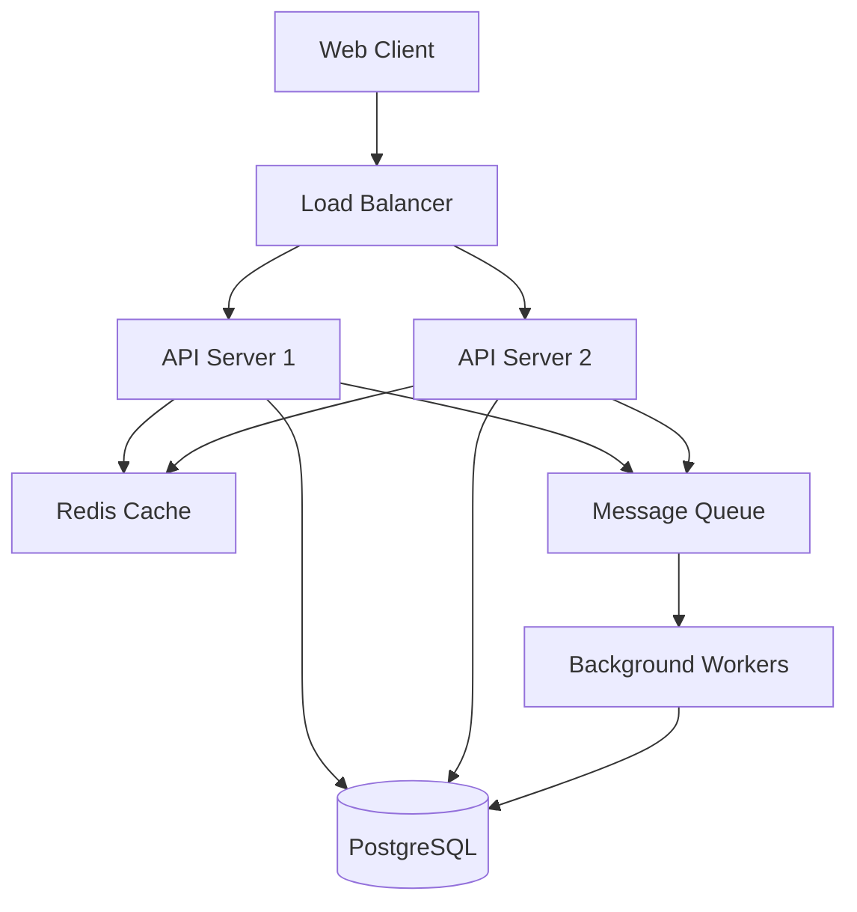
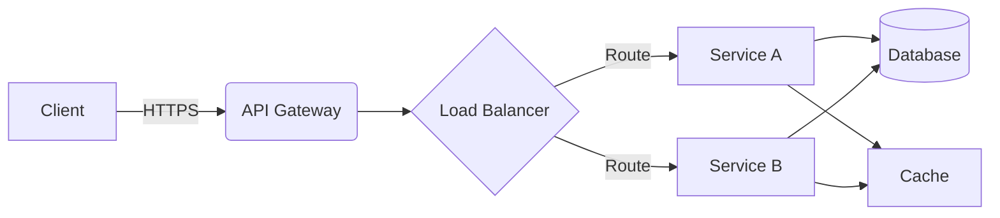
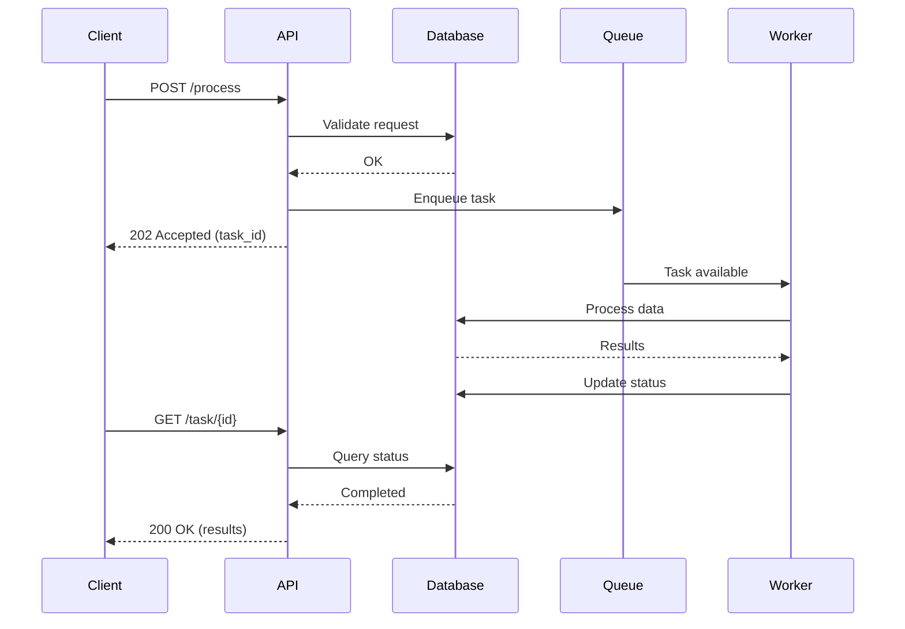
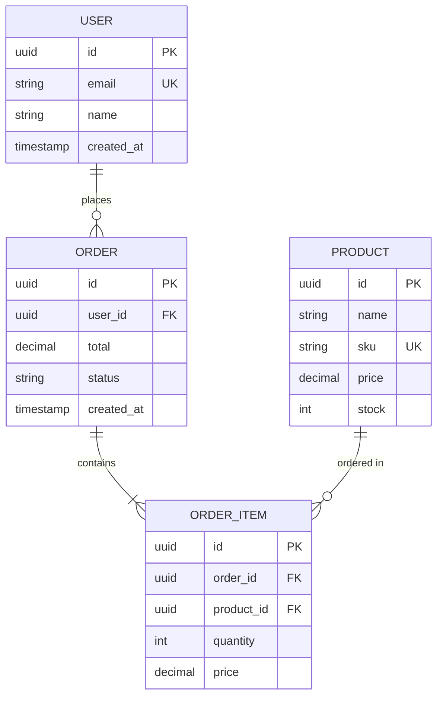

# Create Technical Documentation

Generate comprehensive technical documentation that captures architecture decisions, system design, data flows, integration points, and development workflows for developers and technical stakeholders.

## When to Use This Skill

Use this skill when you need to:
- Document system architecture and component design
- Record architecture decision records (ADRs)
- Create system design documentation
- Document data flows and integration points
- Explain technical trade-offs and decisions
- Onboard new developers to codebase
- Prepare for technical reviews or audits
- Document development workflows and processes
- Create technical specifications
- Support system maintenance and evolution

## What This Skill Does

This skill generates comprehensive technical documentation:

### For All Languages
1. **Architecture Documentation**
   - System architecture overview
   - Component diagrams and relationships
   - Technology stack details
   - Deployment architecture
   - Scalability considerations
   - Security architecture

2. **Architecture Decision Records (ADRs)**
   - Context and problem statement
   - Decision drivers
   - Considered options
   - Decision outcome
   - Consequences (positive and negative)
   - Status tracking

3. **System Design Documentation**
   - Module organization and structure
   - Design patterns used
   - Database schema and models
   - API contracts
   - State management
   - Error handling strategies

4. **Data Flow Documentation**
   - Data processing pipelines
   - Information flow diagrams
   - Data transformations
   - Integration points
   - Event flows
   - Message queues

5. **Development Documentation**
   - Development environment setup
   - Build and deployment process
   - Testing strategy
   - Code organization principles
   - Coding standards and conventions
   - Version control workflow

6. **Integration Documentation**
   - External service dependencies
   - API integrations
   - Third-party library usage
   - Authentication/authorization
   - Data exchange formats
   - Error handling and retries

### Language-Specific Features

#### Python
- **Package Structure**: Module organization, namespace packages
- **Frameworks**: Django, Flask, FastAPI architecture
- **Async Patterns**: asyncio, concurrent programming
- **Examples**:
  ```markdown
  ## Architecture Overview

  ### Module Structure

  ```
  myproject/
  ├── src/
  │   ├── core/           # Core business logic
  │   ├── api/            # API endpoints (FastAPI)
  │   ├── models/         # Data models (Pydantic)
  │   ├── services/       # Business services
  │   ├── repositories/   # Data access layer
  │   └── utils/          # Utilities
  ├── tests/
  └── docs/
  ```

  ### Technology Stack

  - **Web Framework**: FastAPI 0.104.0
  - **ORM**: SQLAlchemy 2.0
  - **Database**: PostgreSQL 14
  - **Cache**: Redis 7.0
  - **Task Queue**: Celery 5.3
  - **Testing**: pytest 7.4

  ### Architecture Patterns

  - **Layered Architecture**: API → Services → Repositories → Database
  - **Dependency Injection**: FastAPI dependency system
  - **Repository Pattern**: Data access abstraction
  - **Service Layer**: Business logic encapsulation
  ```

#### JavaScript/TypeScript
- **Module Systems**: CommonJS, ES modules
- **Frameworks**: React, Node.js, Express architecture
- **State Management**: Redux, Context API, state machines
- **Examples**:
  ```markdown
  ## Frontend Architecture (React)

  ### Component Hierarchy

  ```
  src/
  ├── components/
  │   ├── common/         # Reusable components
  │   ├── features/       # Feature-specific components
  │   └── layouts/        # Layout components
  ├── hooks/              # Custom React hooks
  ├── services/           # API clients
  ├── store/              # Redux store
  ├── types/              # TypeScript types
  └── utils/              # Utilities
  ```

  ### State Management

  **Global State (Redux):**
  - User authentication state
  - Application configuration
  - Shared UI state

  **Local State (useState/useReducer):**
  - Component-specific state
  - Form state
  - UI interactions

  **Server State (React Query):**
  - API data caching
  - Background refetching
  - Optimistic updates

  ### Data Flow

  ```
  User Action → Component → Action Creator → Reducer → Store → Component Update
  ```
  ```

#### Java
- **Architecture**: Spring Boot, Microservices
- **Design Patterns**: Dependency injection, factory, strategy
- **Enterprise Patterns**: DAO, DTO, Service layer
- **Examples**:
  ```markdown
  ## Spring Boot Architecture

  ### Layer Organization

  ```
  com.example.myapp/
  ├── controller/         # REST controllers
  ├── service/            # Business logic
  ├── repository/         # Data access (JPA)
  ├── model/              # Domain models
  ├── dto/                # Data transfer objects
  ├── config/             # Configuration classes
  ├── exception/          # Custom exceptions
  └── util/               # Utilities
  ```

  ### Dependency Injection

  Spring's IoC container manages bean lifecycle:

  - **@Service**: Business logic beans
  - **@Repository**: Data access beans
  - **@Controller**: Web layer beans
  - **@Configuration**: Configuration beans

  ### Database Access

  **JPA/Hibernate:**
  - Entity mapping with annotations
  - Repository interfaces (Spring Data JPA)
  - Transaction management (@Transactional)
  - Query optimization (N+1 prevention)

  ### Security Architecture

  **Spring Security:**
  - JWT-based authentication
  - Role-based authorization
  - CORS configuration
  - CSRF protection
  ```

#### C#
- **Architecture**: ASP.NET Core, CQRS, Clean Architecture
- **Patterns**: Dependency injection, repository, unit of work
- **Enterprise**: Domain-driven design, microservices
- **Examples**:
  ```markdown
  ## Clean Architecture (ASP.NET Core)

  ### Project Structure

  ```
  Solution/
  ├── Domain/             # Core domain models
  ├── Application/        # Business logic (CQRS)
  ├── Infrastructure/     # External concerns
  ├── WebAPI/            # API layer
  └── Tests/             # Test projects
  ```

  ### CQRS Pattern

  **Commands:** Write operations

  ```csharp
  public class CreateOrderCommand : IRequest<OrderDto>
  {
      public string CustomerId { get; set; }
      public List<OrderItemDto> Items { get; set; }
  }
  ```

  **Queries:** Read operations

  ```csharp
  public class GetOrderQuery : IRequest<OrderDto>
  {
      public Guid OrderId { get; set; }
  }
  ```

  **Handlers:** Process commands/queries

  ```csharp
  public class CreateOrderHandler : IRequestHandler<CreateOrderCommand, OrderDto>
  {
      // Implementation
  }
  ```

  ### Dependency Injection

  **Service Lifetimes:**
  - **Transient**: Created each time requested
  - **Scoped**: Created once per request
  - **Singleton**: Created once for application lifetime

  ```csharp
  services.AddTransient<IEmailService, EmailService>();
  services.AddScoped<IOrderRepository, OrderRepository>();
  services.AddSingleton<IConfiguration>(configuration);
  ```
  ```

#### Go
- **Architecture**: Clean architecture, hexagonal architecture
- **Patterns**: Interfaces, dependency injection
- **Concurrency**: Goroutines, channels
- **Examples**:
  ```markdown
  ## Go Service Architecture

  ### Project Structure

  ```
  myservice/
  ├── cmd/                # Application entrypoints
  ├── internal/
  │   ├── domain/         # Business entities
  │   ├── usecase/        # Business logic
  │   ├── repository/     # Data access
  │   └── delivery/       # HTTP handlers
  ├── pkg/                # Exported packages
  └── migrations/         # Database migrations
  ```

  ### Dependency Management

  **Interface-Based Design:**

  ```go
  // Define interface in consumer package
  type UserRepository interface {
      GetByID(ctx context.Context, id string) (*User, error)
      Create(ctx context.Context, user *User) error
  }

  // Implement in provider package
  type PostgresUserRepository struct {
      db *sql.DB
  }

  func (r *PostgresUserRepository) GetByID(ctx context.Context, id string) (*User, error) {
      // Implementation
  }
  ```

  ### Concurrency Patterns

  **Worker Pool:**

  ```go
  func processItems(items []Item) {
      jobs := make(chan Item, 100)
      results := make(chan Result, 100)

      // Start worker pool
      for w := 0; w < numWorkers; w++ {
          go worker(jobs, results)
      }

      // Send jobs
      for _, item := range items {
          jobs <- item
      }
      close(jobs)

      // Collect results
      for range items {
          <-results
      }
  }
  ```

  ### Error Handling

  **Sentinel Errors:** Predefined error variables

  ```go
  var ErrNotFound = errors.New("not found")
  var ErrUnauthorized = errors.New("unauthorized")
  ```

  **Error Wrapping:** Add context

  ```go
  if err != nil {
      return fmt.Errorf("failed to get user: %w", err)
  }
  ```
  ```

#### C
- **Architecture**: Modular design, opaque pointers
- **Patterns**: Factory functions, callbacks
- **Memory Management**: Manual allocation, cleanup
- **Examples**:
  ```markdown
  ## C Library Architecture

  ### Module Organization

  ```
  mylib/
  ├── include/
  │   └── mylib/
  │       ├── mylib.h         # Public API
  │       └── types.h         # Public types
  ├── src/
  │   ├── internal.h          # Private headers
  │   ├── core.c              # Core functionality
  │   ├── utils.c             # Utilities
  │   └── platform/           # Platform-specific
  ├── tests/
  └── examples/
  ```

  ### API Design Patterns

  **Opaque Pointers:**

  ```c
  // Public header (mylib.h)
  typedef struct mylib_context mylib_context_t;

  mylib_context_t* mylib_create(void);
  void mylib_destroy(mylib_context_t* ctx);
  int mylib_process(mylib_context_t* ctx, const void* data);

  // Private implementation (internal.h)
  struct mylib_context {
      void* internal_state;
      config_t config;
      // ... private members
  };
  ```

  ### Memory Management Strategy

  **Ownership Rules:**
  - Caller owns memory passed to functions
  - Library owns memory returned from functions
  - Explicit `_destroy()` functions for cleanup
  - No hidden allocations

  **Resource Cleanup:**

  ```c
  // RAII-style cleanup attribute (GCC/Clang)
  #define CLEANUP(fn) __attribute__((cleanup(fn)))

  void cleanup_context(mylib_context_t** ctx) {
      if (ctx && *ctx) {
          mylib_destroy(*ctx);
      }
  }

  void example(void) {
      CLEANUP(cleanup_context) mylib_context_t* ctx = mylib_create();
      // Automatic cleanup on scope exit
  }
  ```

  ### Thread Safety

  **Thread-Local Storage:**

  ```c
  __thread int last_error = 0;

  int mylib_get_last_error(void) {
      return last_error;
  }
  ```

  **Mutex Protection:**

  ```c
  struct mylib_context {
      pthread_mutex_t lock;
      // ... protected data
  };

  int mylib_thread_safe_operation(mylib_context_t* ctx) {
      pthread_mutex_lock(&ctx->lock);
      // Critical section
      pthread_mutex_unlock(&ctx->lock);
  }
  ```
  ```

#### C++
- **Architecture**: Modern C++, RAII, templates
- **Patterns**: CRTP, policy-based design
- **Memory**: Smart pointers, move semantics
- **Examples**:
  ```markdown
  ## Modern C++ Architecture

  ### Project Structure

  ```
  myproject/
  ├── include/
  │   └── myproject/
  │       ├── core/           # Core interfaces
  │       ├── types/          # Type definitions
  │       └── utils/          # Utilities
  ├── src/
  │   ├── core/               # Implementations
  │   └── internal/           # Private code
  ├── tests/
  └── examples/
  ```

  ### Resource Management (RAII)

  **Smart Pointers:**

  ```cpp
  class ResourceManager {
  private:
      std::unique_ptr<Resource> resource_;  // Exclusive ownership
      std::shared_ptr<Cache> cache_;        // Shared ownership
      std::weak_ptr<Observer> observer_;    // Non-owning reference

  public:
      ResourceManager()
          : resource_(std::make_unique<Resource>()),
            cache_(std::make_shared<Cache>()) {}

      // Rule of five: Define or delete special members
      ~ResourceManager() = default;
      ResourceManager(const ResourceManager&) = delete;
      ResourceManager& operator=(const ResourceManager&) = delete;
      ResourceManager(ResourceManager&&) noexcept = default;
      ResourceManager& operator=(ResourceManager&&) noexcept = default;
  };
  ```

  ### Template Metaprogramming

  **Concepts (C++20):**

  ```cpp
  template<typename T>
  concept Numeric = std::is_arithmetic_v<T>;

  template<Numeric T>
  T add(T a, T b) {
      return a + b;
  }
  ```

  **SFINAE (C++17 and earlier):**

  ```cpp
  template<typename T>
  typename std::enable_if<std::is_integral<T>::value, T>::type
  process(T value) {
      // Implementation for integral types
  }
  ```

  ### Concurrency

  **Thread Safety with std::mutex:**

  ```cpp
  class ThreadSafeQueue {
  private:
      std::queue<T> queue_;
      mutable std::mutex mutex_;
      std::condition_variable cv_;

  public:
      void push(T value) {
          std::lock_guard<std::mutex> lock(mutex_);
          queue_.push(std::move(value));
          cv_.notify_one();
      }

      T pop() {
          std::unique_lock<std::mutex> lock(mutex_);
          cv_.wait(lock, [this]{ return !queue_.empty(); });
          T value = std::move(queue_.front());
          queue_.pop();
          return value;
      }
  };
  ```

  **Lock-Free Programming:**

  ```cpp
  class LockFreeStack {
  private:
      std::atomic<Node*> head_{nullptr};

  public:
      void push(const T& value) {
          Node* new_node = new Node(value);
          new_node->next = head_.load(std::memory_order_relaxed);
          while (!head_.compare_exchange_weak(
              new_node->next, new_node,
              std::memory_order_release,
              std::memory_order_relaxed));
      }
  };
  ```
  ```

## Prerequisites

- Completed or stable system architecture
- Understanding of design decisions and trade-offs
- Knowledge of technology stack and dependencies
- Familiarity with development workflows
- Access to system diagrams or ability to create them
- Understanding of integration points and data flows

## Instructions

### Step 1: Gather Architecture Information

1. **System Components**:
   - Core modules and their responsibilities
   - External dependencies
   - Data stores and caches
   - Integration points
   - Deployment components

2. **Design Decisions**:
   - Technology choices
   - Architecture patterns
   - Trade-offs made
   - Rejected alternatives
   - Future considerations

3. **Data Flows**:
   - Input/output data
   - Processing pipelines
   - State management
   - Event propagation
   - Message passing

4. **Development Processes**:
   - Build system
   - Testing strategy
   - Deployment process
   - Code review workflow
   - Release management

### Step 2: Invoke the Create Technical Docs Skill

For **Python** projects:
```
"Use the create-technical-docs skill to document Python architecture.

Language: Python
Framework: Django / Flask / FastAPI
Architecture Style: Layered / Microservices / Monolithic
Documentation Needed:

- System architecture overview with diagrams
- Module organization and dependencies
- Design patterns used (Repository, Service Layer, etc.)
- Database schema and ORM models
- API design and contracts
- Data flow diagrams
- ADRs for key decisions
- Development workflow
- Testing strategy
Output Directory: docs/technical/"
```

For **JavaScript/TypeScript** projects:
```
"Use the create-technical-docs skill for JavaScript/TypeScript architecture.

Language: JavaScript / TypeScript
Framework: React / Node.js / Express / NestJS
Architecture Style: Component-based / Microservices / Serverless
Documentation Needed:

- Frontend architecture (if React)
- Backend architecture (if Node.js)
- State management design
- Component hierarchy
- API integration patterns
- Build and deployment process
- ADRs for technology choices
- Performance optimization strategies
Output Directory: docs/architecture/"
```

For **Java** projects:
```
"Use the create-technical-docs skill for Java architecture docs.

Language: Java
Framework: Spring Boot / Jakarta EE
Architecture Style: Microservices / Layered / Clean Architecture
Documentation Needed:

- System architecture overview
- Spring configuration and beans
- Database design (JPA entities)
- Security architecture
- Message queue integration
- Caching strategy
- ADRs for design decisions
- Deployment architecture
Output Directory: docs/architecture/"
```

For **C#** projects:
```
"Use the create-technical-docs skill for C# architecture.

Language: C#
Framework: ASP.NET Core / .NET
Architecture Style: Clean Architecture / CQRS / DDD
Documentation Needed:

- Solution structure and projects
- Domain model design
- CQRS implementation
- Dependency injection setup
- Database design (EF Core)
- Authentication/authorization
- ADRs for architecture choices
- Deployment to Azure/AWS
Output Directory: docs/architecture/"
```

For **Go** projects:
```
"Use the create-technical-docs skill for Go service docs.

Language: Go
Architecture Style: Clean Architecture / Hexagonal / Microservices
Documentation Needed:

- Package structure and organization
- Interface-based design
- Dependency management
- Goroutine and channel patterns
- Database access patterns
- gRPC/REST API design
- ADRs for design decisions
- Deployment architecture
Output Directory: docs/architecture/"
```

For **C/C++** projects:
```
"Use the create-technical-docs skill for C/C++ system docs.

Language: C / C++
Project Type: Library / System Tool / Framework
Documentation Needed:

- Module architecture
- API design (public vs private)
- Memory management strategy
- Thread safety guarantees
- Build system (CMake)
- Platform-specific code organization
- ADRs for design decisions
- Integration guide
Output Directory: docs/architecture/"
```

### Step 3: Create Architecture Decision Records (ADRs)

ADR template:

```markdown
# ADR-001: Use PostgreSQL for Primary Database

## Status

Accepted

## Context

Need to select a database system for the application that will store:
- User data (thousands of users)
- Transaction records (millions of records)
- Configuration data
- Audit logs

Requirements:
- ACID compliance for financial transactions
- Support for complex queries and joins
- Robust backup and recovery
- Good Python ORM support
- Open-source with strong community

## Decision

Use PostgreSQL 14 as the primary database.

## Considered Options

1. **PostgreSQL** - Robust relational database
2. **MySQL** - Popular relational database
3. **MongoDB** - Document-oriented NoSQL
4. **SQLite** - Embedded database

## Decision Rationale

**Why PostgreSQL:**
- Excellent ACID compliance
- Advanced features (JSON support, full-text search, CTEs)
- Strong Python integration (psycopg2, SQLAlchemy)
- Proven scalability for our use case
- Better handling of concurrent writes vs MySQL
- JSON support for flexible schema evolution

**Why not MySQL:**
- Weaker transaction isolation in some cases
- Less advanced SQL features
- Team has more PostgreSQL experience

**Why not MongoDB:**
- Need strong consistency for financial data
- Complex queries require relational model
- Added complexity of polyglot persistence

**Why not SQLite:**
- Cannot support required concurrent access
- Not suitable for production deployment

## Consequences

### Positive
- Strong data consistency guarantees
- Rich feature set for complex queries
- Excellent tooling and monitoring
- Good scaling path (replication, partitioning)
- Strong security features

### Negative
- Higher resource requirements than MySQL
- More complex to optimize for high performance
- Requires PostgreSQL expertise for operations

### Neutral
- Need to learn PostgreSQL-specific features
- Must set up backup and replication infrastructure

## Implementation Notes

- Use PostgreSQL 14 (LTS version)
- Deploy via Docker in development
- Use managed service (RDS/CloudSQL) in production
- Configure connection pooling (PgBouncer)
- Set up streaming replication for HA

## References

- [PostgreSQL Documentation](https://www.postgresql.org/docs/14/)
- [SQLAlchemy PostgreSQL Dialect](https://docs.sqlalchemy.org/en/14/dialects/postgresql.html)
- Internal Performance Benchmarks (Q3 2024)

---

**Date**: 2024-10-15
**Author**: Technical Team
**Reviewers**: Lead Architect, DBA
```

### Step 4: Document System Architecture

Create comprehensive architecture documentation:

```markdown
# System Architecture

## Overview

[Project Name] is a [web application/service/library] that [brief description].

## High-Level Architecture



## Component Descriptions

### API Layer
- **Technology**: FastAPI (Python 3.11)
- **Responsibility**: Handle HTTP requests, authentication, input validation
- **Scaling**: Horizontal (stateless)
- **Dependencies**: PostgreSQL, Redis, Message Queue

### Database Layer
- **Technology**: PostgreSQL 14
- **Responsibility**: Persistent data storage
- **Scaling**: Read replicas, partitioning
- **Backup**: Daily snapshots, WAL archiving

### Cache Layer
- **Technology**: Redis 7.0
- **Responsibility**: Session storage, query caching, rate limiting
- **Scaling**: Redis Cluster
- **Eviction**: LRU policy

### Message Queue
- **Technology**: RabbitMQ
- **Responsibility**: Asynchronous task processing
- **Scaling**: Multiple consumers
- **Patterns**: Work queue, pub/sub

### Background Workers
- **Technology**: Celery
- **Responsibility**: Heavy processing, scheduled tasks
- **Scaling**: Horizontal (multiple workers)
- **Monitoring**: Flower

## Data Flow

### Request Processing

```
1. Client sends HTTPS request
2. Load balancer terminates SSL
3. API server authenticates request (JWT)
4. API server checks cache
5. If cache miss, query database
6. Transform and return response
7. Update cache for future requests
```

### Async Processing

```
1. API server receives request
2. Validate and enqueue task
3. Return task ID to client
4. Worker picks up task from queue
5. Worker processes task
6. Worker updates result in database
7. Client polls for task status
```

## Security Architecture

- **Authentication**: JWT tokens (15min access, 7day refresh)
- **Authorization**: Role-based access control (RBAC)
- **Encryption**: TLS 1.3 for transport, AES-256 at rest
- **Secrets**: HashiCorp Vault
- **Rate Limiting**: Redis-based sliding window (100 req/min)

## Deployment Architecture

### Development
- Docker Compose
- Local PostgreSQL and Redis
- Hot reload enabled

### Staging
- Kubernetes cluster
- Managed PostgreSQL (single instance)
- Managed Redis (single instance)
- Similar to production config

### Production
- Kubernetes cluster (multi-AZ)
- PostgreSQL primary + 2 read replicas
- Redis cluster (3 nodes)
- Horizontal pod autoscaling
- CDN for static assets

## Scalability Considerations

### Current Scale
- 1,000 requests/second
- 10 million database records
- 5 API servers
- 3 background workers

### Growth Path
- **Database**: Vertical scaling to 32vCPU, then read replicas
- **API**: Horizontal scaling (tested to 50 instances)
- **Cache**: Redis Cluster (tested to 10 nodes)
- **Workers**: Horizontal scaling (unlimited)

## Monitoring and Observability

- **Metrics**: Prometheus + Grafana
- **Logging**: ELK Stack (Elasticsearch, Logstash, Kibana)
- **Tracing**: Jaeger (distributed tracing)
- **Alerting**: PagerDuty integration
- **Uptime**: Pingdom external monitoring

## Disaster Recovery

- **RPO**: 1 hour (PostgreSQL WAL archiving)
- **RTO**: 4 hours (restore from backup + replica promotion)
- **Backup**: Daily full, continuous WAL
- **Testing**: Quarterly DR drills
```

### Step 5: Document Development Workflow

```markdown
# Development Workflow

## Development Environment Setup

### Prerequisites
- Python 3.11+
- Docker and Docker Compose
- Git
- IDE (VS Code recommended)

### Initial Setup

```bash
# Clone repository
git clone https://github.com/org/project.git
cd project

# Set up Python environment
python -m venv .venv
source .venv/bin/activate  # Windows: .venv\Scripts\activate
pip install -e .[dev]

# Start dependencies
docker-compose up -d postgres redis rabbitmq

# Run migrations
alembic upgrade head

# Start development server
uvicorn main:app --reload
```

## Branch Strategy (Git Flow)

- **main**: Production-ready code
- **develop**: Integration branch for features
- **feature/***: New features (branch from develop)
- **hotfix/***: Critical fixes (branch from main)
- **release/***: Release preparation (branch from develop)

## Development Process

1. **Create Feature Branch**
   ```bash
   git checkout develop
   git pull
   git checkout -b feature/user-authentication
   ```

2. **Implement Feature**
   - Write tests first (TDD)
   - Implement functionality
   - Update documentation
   - Add CHANGELOG entry

3. **Code Quality Checks**
   ```bash
   # Format code
   black src/ tests/
   isort src/ tests/

   # Lint
   flake8 src/ tests/
   mypy src/

   # Run tests
   pytest tests/ -v --cov=src
   ```

4. **Commit Changes**
   ```bash
   git add .
   git commit -m "feat: implement user authentication

   - Add JWT token generation
   - Implement login endpoint
   - Add authentication middleware
   - Include tests (95% coverage)

   Closes #123"
   ```

5. **Create Pull Request**
   - Push branch: `git push origin feature/user-authentication`
   - Open PR on GitHub
   - Fill out PR template
   - Request reviews

6. **Code Review**
   - Address reviewer comments
   - Update PR with changes
   - Ensure CI passes

7. **Merge**
   - Squash and merge to develop
   - Delete feature branch

## Testing Strategy

### Unit Tests
- Test individual functions/methods
- Mock external dependencies
- Target: 90% code coverage

### Integration Tests
- Test component interactions
- Use test database
- Target: 80% path coverage

### E2E Tests
- Test complete workflows
- Use staging environment
- Critical paths only

### Performance Tests
- Load testing (Locust)
- Run before major releases
- Compare against benchmarks

## CI/CD Pipeline

### Continuous Integration (GitHub Actions)

```yaml
name: CI

on: [push, pull_request]

jobs:
  test:
    runs-on: ubuntu-latest
    steps:

      - uses: actions/checkout@v3
      - name: Set up Python
        uses: actions/setup-python@v4
        with:
          python-version: '3.11'

      - name: Install dependencies
        run: pip install -e .[dev]

      - name: Lint
        run: |
          black --check src/ tests/
          flake8 src/ tests/
          mypy src/

      - name: Test
        run: pytest tests/ --cov=src --cov-report=xml

      - name: Upload coverage
        uses: codecov/codecov-action@v3
```

### Continuous Deployment

**To Staging:**
- Triggered on merge to develop
- Deploy to staging environment
- Run smoke tests

**To Production:**
- Triggered on merge to main
- Deploy with blue-green strategy
- Run health checks
- Monitor for errors

## Release Process

1. **Create Release Branch**
   ```bash
   git checkout develop
   git checkout -b release/v1.2.0
   ```

2. **Update Version**
   - Update `__version__` in `__init__.py`
   - Update CHANGELOG.md
   - Update documentation

3. **Final Testing**
   - Full regression test suite
   - Performance testing
   - Security scan

4. **Merge to Main**
   ```bash
   git checkout main
   git merge release/v1.2.0
   git tag v1.2.0
   git push origin main --tags
   ```

5. **Merge Back to Develop**
   ```bash
   git checkout develop
   git merge release/v1.2.0
   git push origin develop
   ```

6. **Deploy**
   - CI/CD automatically deploys to production
   - Monitor deployment
   - Verify health checks

7. **Post-Release**
   - Announce release
   - Update documentation site
   - Close milestone issues
```

### Step 6: Create Diagram Documentation

Use tools to create architecture diagrams:

**Mermaid (Text-based):**
```markdown
## Component Diagram



## Sequence Diagram



## Entity Relationship Diagram


```

## Quality Checklist

Before finalizing technical documentation, verify:

- [ ] Architecture overview is clear and accurate
- [ ] All major components documented
- [ ] Design decisions recorded in ADRs
- [ ] Data flows explained with diagrams
- [ ] Integration points described
- [ ] Technology stack documented
- [ ] Scalability considerations addressed
- [ ] Security architecture explained
- [ ] Development workflow documented
- [ ] Build and deployment process clear
- [ ] Testing strategy explained
- [ ] Monitoring and observability covered
- [ ] Disaster recovery plan documented
- [ ] Diagrams are up-to-date
- [ ] References and links valid

## Common Issues and Solutions

### Issue: Documentation Quickly Outdated
**Solution**:

- Keep docs close to code (docs/ folder)
- Review docs in code reviews
- Automate diagram generation where possible
- Use ADRs for decisions (immutable history)
- Update docs as part of development process

### Issue: Too Much Detail vs Too Little
**Solution**:

- Target audience: fellow developers
- Explain "why" not just "what"
- Use layered documentation (overview → details)
- Link to external resources for standard patterns
- Include just enough for onboarding

### Issue: Diagrams Hard to Maintain
**Solution**:

- Use text-based diagrams (Mermaid, PlantUML)
- Version control diagrams with code
- Automate generation from code/config
- Keep diagrams focused and simple
- Use consistent notation

### Issue: ADRs Not Being Created
**Solution**:

- Make ADR template easily accessible
- Create ADR during design phase, not after
- Review ADRs in architecture reviews
- Keep ADRs lightweight (avoid perfection)
- Celebrate good ADR examples

## Success Criteria

After using this skill, you should have:

- [ ] Comprehensive architecture documentation
- [ ] ADRs for major decisions
- [ ] System design documentation
- [ ] Component diagrams
- [ ] Data flow documentation
- [ ] Integration point documentation
- [ ] Development workflow guide
- [ ] Build and deployment docs
- [ ] Testing strategy documented
- [ ] Onboarding guide for new developers
- [ ] All documentation in version control
- [ ] Technical team can maintain system

## Related Skills

- `generate-api-docs`: Create API reference documentation
- `create-user-documentation`: Build user-facing docs
- `generate-docstrings`: Document code inline
- `code-review-context-analysis`: Understand system context

## Tools and Resources

### Diagramming Tools
- **Mermaid**: Text-based diagrams in Markdown
- **PlantUML**: UML diagrams from text
- **draw.io**: Visual diagram editor
- **Structurizr**: C4 model diagrams
- **Excalidraw**: Hand-drawn style diagrams

### Documentation Generators
- **MkDocs**: Python documentation sites
- **Docusaurus**: React-based documentation
- **GitBook**: Collaborative documentation
- **VuePress**: Vue-powered documentation
- **Sphinx**: Python documentation (can document code + prose)

### ADR Tools
- **adr-tools**: Command-line ADR management
- **log4brains**: ADR with web UI
- **Backstage**: Developer portal with ADR support

### Architecture as Code
- **Structurizr DSL**: Define C4 diagrams as code
- **Terraform**: Infrastructure as code
- **OpenAPI**: API as code
- **AsyncAPI**: Event-driven API as code

## Additional Resources

- [C4 Model](https://c4model.com/) - Software architecture diagrams
- [Architecture Decision Records](https://adr.github.io/) - ADR overview and examples
- [arc42 Template](https://arc42.org/) - Software architecture documentation template
- [The Twelve-Factor App](https://12factor.net/) - Methodology for building SaaS apps
- [Documenting Software Architectures](https://resources.sei.cmu.edu/library/asset-view.cfm?assetid=30386) - SEI book

---

**Version**: 1.0.0
**Last Updated**: October 2025
**Based on**: ai_templates v0.2.5 - documentation/technical_docs/
